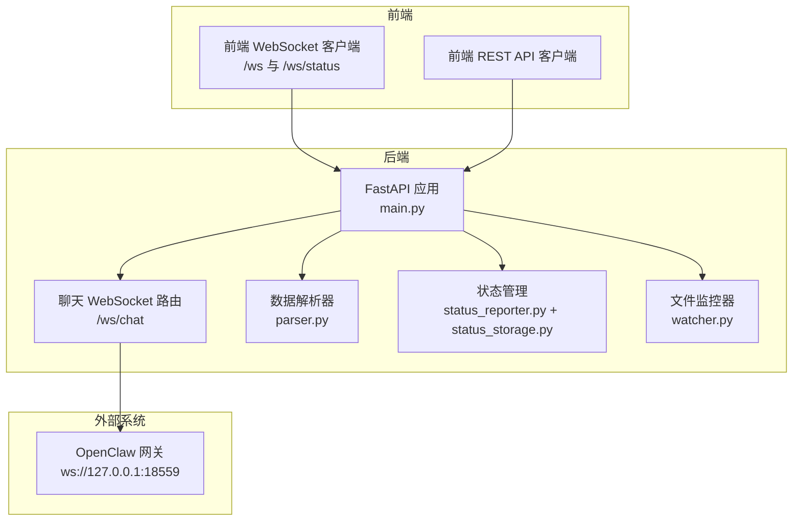
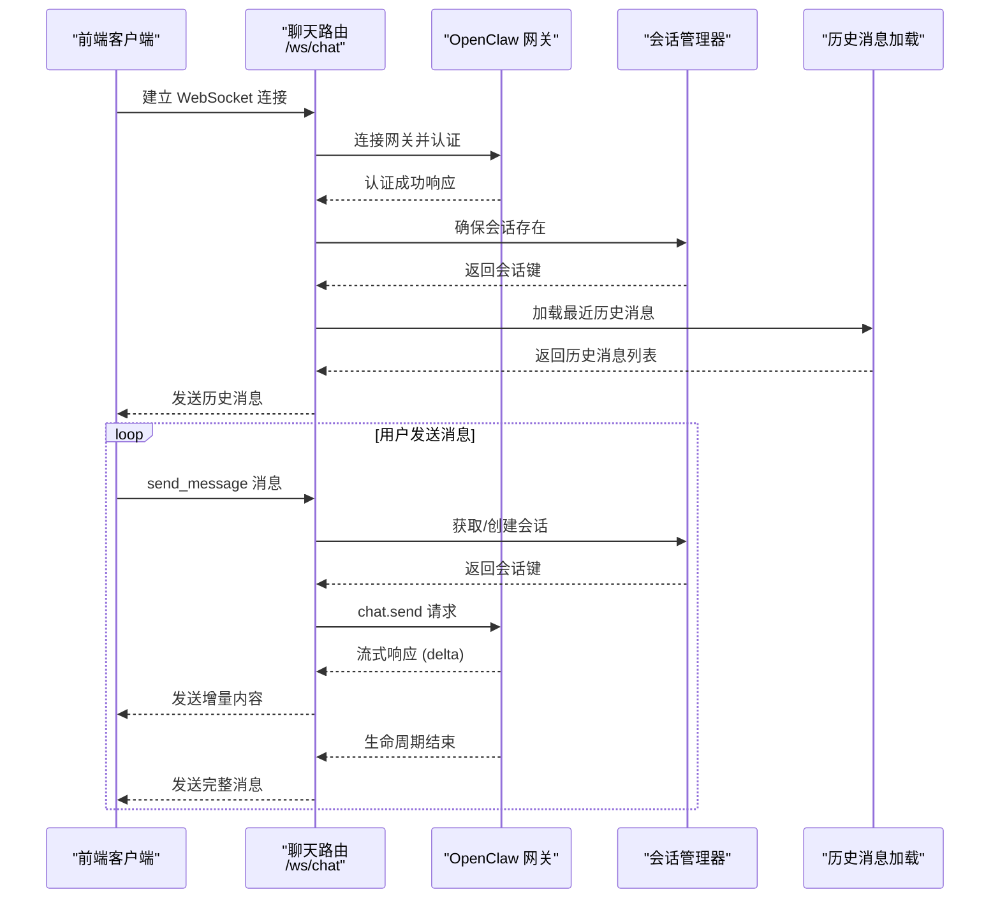
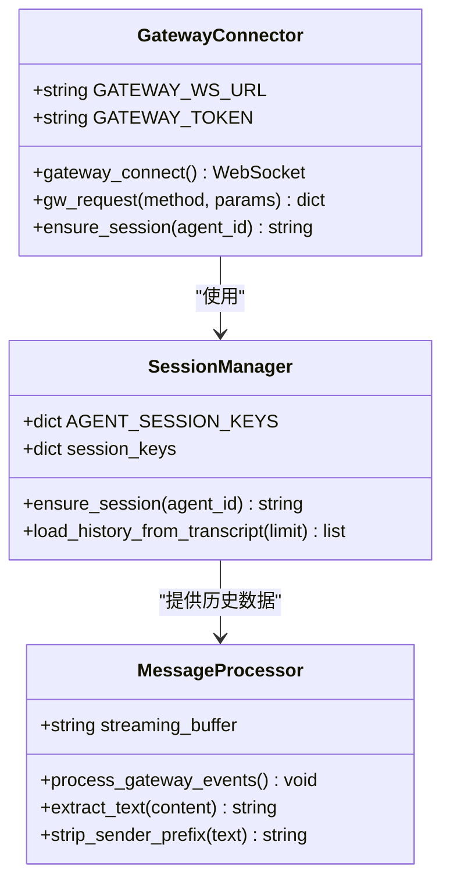
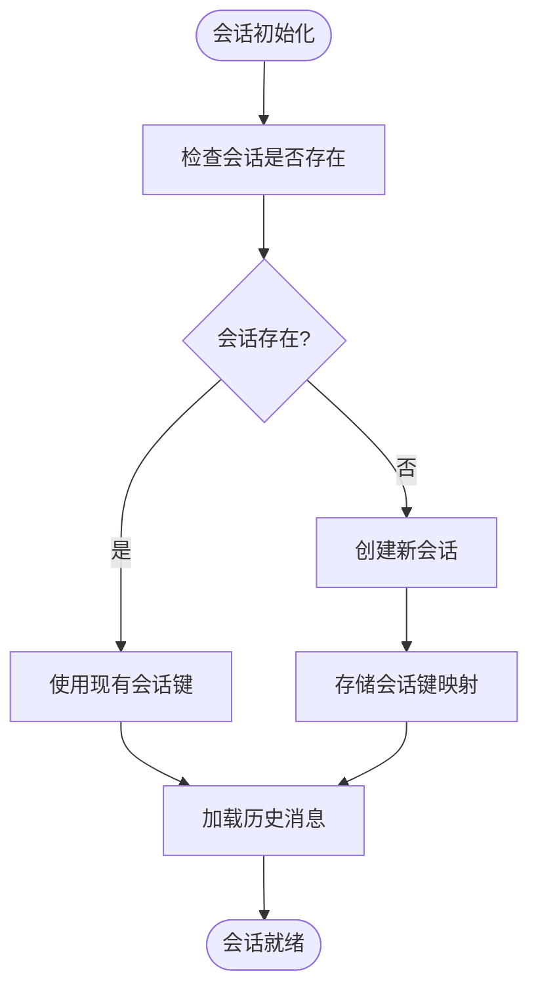
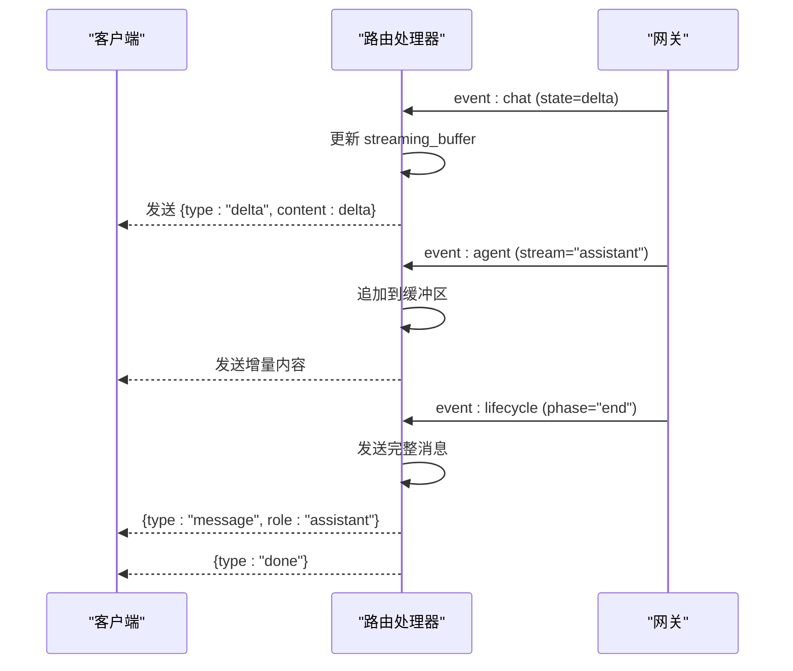
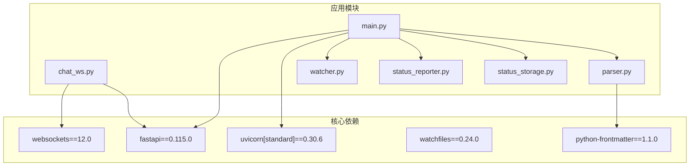

# AI 代理集成

<cite>
**本文档引用的文件**
- [backend/main.py](file://backend/main.py)
- [backend/routers/chat_ws.py](file://backend/routers/chat_ws.py)
- [backend/parser.py](file://backend/parser.py)
- [backend/status_reporter.py](file://backend/status_reporter.py)
- [backend/status_storage.py](file://backend/status_storage.py)
- [backend/watcher.py](file://backend/watcher.py)
- [backend/requirements.txt](file://backend/requirements.txt)
- [tests/test_chat_delta.py](file://tests/test_chat_delta.py)
- [tests/test_chat_delta2.py](file://tests/test_chat_delta2.py)
- [run.sh](file://run.sh)
- [frontend/src/lib/ws.ts](file://frontend/src/lib/ws.ts)
- [frontend/src/lib/status-ws.ts](file://frontend/src/lib/status-ws.ts)
- [frontend/src/lib/api.ts](file://frontend/src/lib/api.ts)
</cite>

## 目录
1. [简介](#简介)
2. [项目结构](#项目结构)
3. [核心组件](#核心组件)
4. [架构概览](#架构概览)
5. [详细组件分析](#详细组件分析)
6. [依赖分析](#依赖分析)
7. [性能考虑](#性能考虑)
8. [故障排除指南](#故障排除指南)
9. [结论](#结论)
10. [附录](#附录)

## 简介
本文件为 SynapseOS 2.0 的 AI 代理集成功能提供全面的技术文档。该系统通过 OpenClaw 网关实现与多个 AI 代理的实时通信，支持多代理会话管理、流式响应处理和 WebSocket 路由。文档涵盖以下关键方面：
- OpenClaw 网关连接与认证
- 会话管理与多代理支持
- 流式响应处理与实时对话
- WebSocket 路由与消息转发机制
- 会话状态管理与消息队列处理
- 测试用例与通信协议
- 错误处理策略与性能优化
- 安全考虑、速率限制与版本兼容性

## 项目结构
SynapseOS 2.0 采用前后端分离架构，后端基于 FastAPI 提供 REST API 和 WebSocket 服务，前端使用 Svelte 构建用户界面。AI 代理集成的核心位于后端的聊天 WebSocket 路由模块，负责与 OpenClaw 网关建立连接并转发消息。

**图表来源**
- [backend/main.py:184-495](file://backend/main.py#L184-L495)
- [backend/routers/chat_ws.py:174-318](file://backend/routers/chat_ws.py#L174-L318)

**章节来源**
- [backend/main.py:1-495](file://backend/main.py#L1-L495)
- [backend/routers/chat_ws.py:1-318](file://backend/routers/chat_ws.py#L1-L318)

## 核心组件
本节详细介绍 AI 代理集成的关键组件及其职责。

### OpenClaw 网关连接器
负责与 OpenClaw 网关建立 WebSocket 连接，执行身份验证并维护连接状态。

**章节来源**
- [backend/routers/chat_ws.py:117-136](file://backend/routers/chat_ws.py#L117-L136)

### 会话管理器
实现多代理会话的生命周期管理，包括会话创建、键值映射和历史消息加载。

**章节来源**
- [backend/routers/chat_ws.py:158-172](file://backend/routers/chat_ws.py#L158-L172)
- [backend/routers/chat_ws.py:53-115](file://backend/routers/chat_ws.py#L53-L115)

### 流式响应处理器
处理来自 OpenClaw 网关的流式消息，将增量数据转换为前端可消费的格式。

**章节来源**
- [backend/routers/chat_ws.py:213-255](file://backend/routers/chat_ws.py#L213-L255)

### WebSocket 路由器
实现聊天 WebSocket 路由，处理客户端消息、代理切换和状态同步。

**章节来源**
- [backend/routers/chat_ws.py:174-318](file://backend/routers/chat_ws.py#L174-L318)

## 架构概览
系统采用分层架构，后端通过 FastAPI 提供统一入口，前端通过 WebSocket 实现实时通信。

**图表来源**
- [backend/routers/chat_ws.py:174-318](file://backend/routers/chat_ws.py#L174-L318)

## 详细组件分析

### OpenClaw 网关连接与认证
系统通过固定的网关地址和令牌进行连接，支持多代理身份识别。

**图表来源**
- [backend/routers/chat_ws.py:18-28](file://backend/routers/chat_ws.py#L18-L28)
- [backend/routers/chat_ws.py:117-172](file://backend/routers/chat_ws.py#L117-L172)

**章节来源**
- [backend/routers/chat_ws.py:18-172](file://backend/routers/chat_ws.py#L18-L172)

### 会话状态管理
系统支持多代理会话，通过预定义的会话键映射实现快速切换。

**图表来源**
- [backend/routers/chat_ws.py:158-172](file://backend/routers/chat_ws.py#L158-L172)
- [backend/routers/chat_ws.py:53-115](file://backend/routers/chat_ws.py#L53-L115)

**章节来源**
- [backend/routers/chat_ws.py:158-172](file://backend/routers/chat_ws.py#L158-L172)
- [backend/routers/chat_ws.py:53-115](file://backend/routers/chat_ws.py#L53-L115)

### 流式响应处理机制
系统实现了完整的流式响应处理，支持增量内容传输和生命周期管理。

**图表来源**
- [backend/routers/chat_ws.py:213-255](file://backend/routers/chat_ws.py#L213-L255)

**章节来源**
- [backend/routers/chat_ws.py:213-255](file://backend/routers/chat_ws.py#L213-L255)

### WebSocket 路由实现
聊天 WebSocket 路由器提供了完整的消息处理流程，包括代理切换和历史消息加载。

**章节来源**
- [backend/routers/chat_ws.py:174-318](file://backend/routers/chat_ws.py#L174-L318)

## 依赖分析
系统依赖关系清晰，核心依赖包括 FastAPI、WebSockets 和文件监控库。

**图表来源**
- [backend/requirements.txt:1-6](file://backend/requirements.txt#L1-L6)
- [backend/main.py:1-495](file://backend/main.py#L1-L495)

**章节来源**
- [backend/requirements.txt:1-6](file://backend/requirements.txt#L1-L6)

## 性能考虑
系统在性能方面采用了多项优化策略：

### 连接池与重用
- 使用单个网关连接处理多个会话
- 会话键缓存减少重复查询
- 异步消息队列避免阻塞

### 内存管理
- 流式响应使用缓冲区累积
- 历史消息限制在 30 条以内
- 自动清理断开的连接

### 并发控制
- 每个会话独立的消息队列
- 读取器任务独立运行
- 超时机制防止资源泄露

## 故障排除指南
常见问题及解决方案：

### 网关连接失败
- 检查网关服务是否启动
- 验证令牌配置正确性
- 确认网络连通性

### 会话创建失败
- 检查代理 ID 是否在映射表中
- 验证会话目录权限
- 确认磁盘空间充足

### 流式响应中断
- 检查网络稳定性
- 验证消息队列状态
- 监控超时设置

**章节来源**
- [backend/routers/chat_ws.py:117-136](file://backend/routers/chat_ws.py#L117-L136)
- [backend/routers/chat_ws.py:202-203](file://backend/routers/chat_ws.py#L202-L203)

## 结论
SynapseOS 2.0 的 AI 代理集成功能通过精心设计的架构实现了高效、可靠的多代理通信。系统具备以下优势：
- 完整的流式响应处理能力
- 灵活的多代理会话管理
- 实时的状态同步机制
- 良好的错误处理和恢复能力
- 清晰的代码结构和扩展性

该系统为未来的功能扩展奠定了坚实基础，包括更复杂的代理协作、增强的安全机制和性能优化。

## 附录

### 测试用例实现
系统提供了完整的测试套件，验证流式响应和代理通信功能。

**章节来源**
- [tests/test_chat_delta.py:1-280](file://tests/test_chat_delta.py#L1-L280)
- [tests/test_chat_delta2.py:1-281](file://tests/test_chat_delta2.py#L1-L281)

### 集成指南
1. 启动 OpenClaw 网关服务
2. 配置环境变量指向正确的数据目录
3. 启动 SynapseOS 后端服务
4. 访问前端界面进行测试

### 配置选项
- `CYBER_TEAM_DIR`: 数据目录路径
- `WS_DEBOUNCE_MS`: WebSocket 去抖延迟
- `GATEWAY_WS_URL`: 网关 WebSocket 地址
- `GATEWAY_TOKEN`: 认证令牌

### 安全考虑
- 使用固定令牌进行身份验证
- CORS 配置允许跨域访问
- 输入验证和异常处理
- 连接超时和心跳检测

### 版本兼容性
- Python 3.8+
- FastAPI 0.115.0+
- WebSockets 12.0+
- 前端使用现代浏览器 WebSocket API