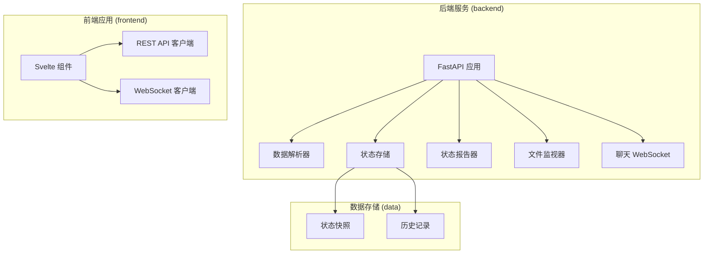
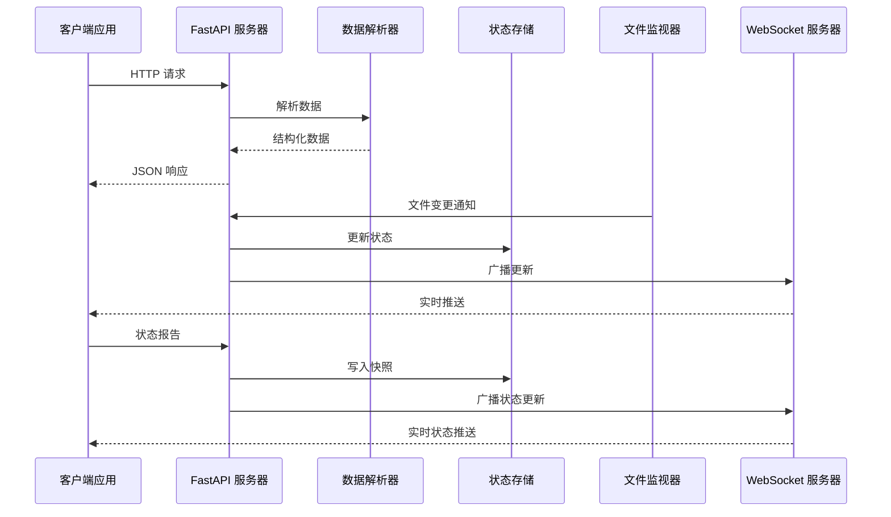
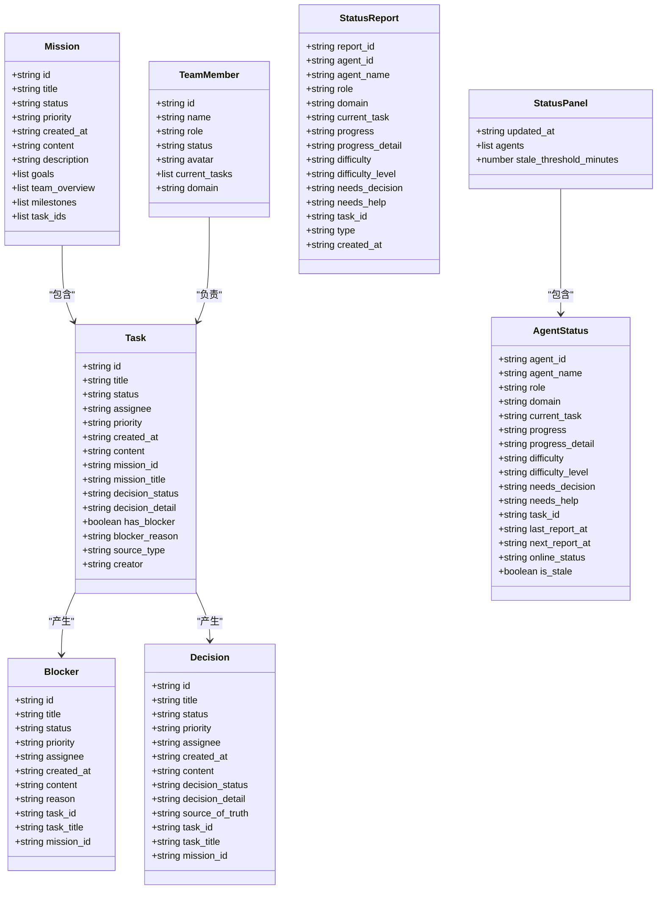

# API 参考文档

<cite>
**本文档引用的文件**
- [backend/main.py](file://backend/main.py)
- [backend/parser.py](file://backend/parser.py)
- [backend/status_storage.py](file://backend/status_storage.py)
- [backend/status_reporter.py](file://backend/status_reporter.py)
- [backend/watcher.py](file://backend/watcher.py)
- [backend/routers/chat_ws.py](file://backend/routers/chat_ws.py)
- [frontend/src/lib/api.ts](file://frontend/src/lib/api.ts)
- [frontend/src/lib/ws.ts](file://frontend/src/lib/ws.ts)
- [frontend/src/lib/status-ws.ts](file://frontend/src/lib/status-ws.ts)
- [data/status_current.json](file://data/status_current.json)
- [data/status_history.jsonl](file://data/status_history.jsonl)
</cite>

## 目录
1. [简介](#简介)
2. [项目结构](#项目结构)
3. [核心组件](#核心组件)
4. [架构概览](#架构概览)
5. [REST API 参考](#rest-api-参考)
6. [WebSocket 通信](#websocket-通信)
7. [数据模型规范](#数据模型规范)
8. [参数验证规则](#参数验证规则)
9. [错误处理](#错误处理)
10. [性能考虑](#性能考虑)
11. [故障排除指南](#故障排除指南)
12. [结论](#结论)

## 简介

SynapseOS 2.0 是一个基于 FastAPI 和 Svelte 的实时协作平台，专门用于管理网络安全团队的工作流程。该系统提供了完整的任务管理、状态监控、决策支持和实时通信功能。

系统的核心特性包括：
- 实时数据同步和状态更新
- 多通道 WebSocket 通信
- 基于 Markdown 的任务和决策管理
- 自动化的状态报告和历史追踪
- 完整的前端集成和用户界面

## 项目结构



**图表来源**
- [backend/main.py:185-495](file://backend/main.py#L185-L495)
- [backend/parser.py:441-509](file://backend/parser.py#L441-L509)

**章节来源**
- [backend/main.py:1-495](file://backend/main.py#L1-L495)
- [backend/parser.py:1-509](file://backend/parser.py#L1-L509)

## 核心组件

### 数据解析器 (Parser)
负责从 Markdown 文件中提取和转换任务、决策、阻塞器等数据结构。

### 状态管理系统
提供状态报告、快照管理和历史追踪功能。

### WebSocket 服务器
支持多频道的实时通信，包括通用数据更新和专用状态频道。

### 文件监视器
自动检测数据文件变化并触发相应的更新事件。

**章节来源**
- [backend/parser.py:16-92](file://backend/parser.py#L16-L92)
- [backend/status_storage.py:33-136](file://backend/status_storage.py#L33-L136)
- [backend/watcher.py:8-52](file://backend/watcher.py#L8-L52)

## 架构概览



**图表来源**
- [backend/main.py:120-182](file://backend/main.py#L120-L182)
- [backend/status_storage.py:102-127](file://backend/status_storage.py#L102-L127)

## REST API 参考

### 基础数据获取端点

#### GET /api/mission
获取当前任务的使命信息。

**请求参数**: 无

**响应数据**:
- `id`: 使命标识符
- `title`: 使命标题
- `status`: 使命状态
- `priority`: 优先级
- `created_at`: 创建时间
- `content`: 详细内容
- `description`: 描述
- `goals`: 目标列表
- `team_overview`: 团队概览
- `milestones`: 里程碑
- `task_ids`: 任务ID列表

**响应示例**:
```json
{
  "id": "mission-001",
  "title": "SynapseOS 2.0",
  "status": "active",
  "priority": "high",
  "created_at": "2026-01-01T00:00:00Z"
}
```

**章节来源**
- [backend/main.py:200-204](file://backend/main.py#L200-L204)
- [backend/parser.py:17-30](file://backend/parser.py#L17-L30)

#### GET /api/tasks
获取所有任务列表。

**请求参数**: 无

**响应数据**: 任务对象数组，包含：
- `id`: 任务标识符
- `title`: 任务标题
- `status`: 任务状态
- `assignee`: 负责人
- `priority`: 优先级
- `created_at`: 创建时间
- `content`: 详细内容
- `mission_id`: 关联使命ID
- `mission_title`: 关联使命标题
- `decision_status`: 决策状态
- `decision_detail`: 决策详情
- `has_blocker`: 是否存在阻塞
- `blocker_reason`: 阻塞原因
- `source_type`: 来源类型
- `creator`: 创建者

**响应示例**:
```json
[
  {
    "id": "task-001",
    "title": "UI 设计",
    "status": "in-progress",
    "assignee": "苏珊",
    "priority": "high"
  }
]
```

**章节来源**
- [backend/main.py:206-210](file://backend/main.py#L206-L210)
- [backend/parser.py:33-49](file://backend/parser.py#L33-L49)

#### GET /api/blockers
获取阻塞问题列表。

**请求参数**: 无

**响应数据**: 阻塞对象数组，包含：
- `id`: 阻塞标识符
- `title`: 阻塞标题
- `status`: 阻塞状态
- `priority`: 优先级
- `assignee`: 负责人
- `created_at`: 创建时间
- `content`: 详细内容
- `reason`: 原因
- `task_id`: 关联任务ID
- `task_title`: 关联任务标题
- `mission_id`: 关联使命ID

**响应示例**:
```json
[
  {
    "id": "blocker-001",
    "title": "待果爸决策: UI 设计",
    "status": "open",
    "priority": "high",
    "assignee": "苏珊"
  }
]
```

**章节来源**
- [backend/main.py:212-216](file://backend/main.py#L212-L216)
- [backend/parser.py:52-64](file://backend/parser.py#L52-L64)

#### GET /api/decisions
获取决策列表。

**请求参数**: 无

**响应数据**: 决策对象数组，包含：
- `id`: 决策标识符
- `title`: 决策标题
- `status`: 决策状态
- `priority`: 优先级
- `assignee`: 负责人
- `created_at`: 创建时间
- `content`: 详细内容
- `decision_status`: 决策状态
- `decision_detail`: 决策详情
- `source_of_truth`: 真相源
- `task_id`: 关联任务ID
- `task_title`: 关联任务标题
- `mission_id`: 关联使命ID

**响应示例**:
```json
[
  {
    "id": "decision-001",
    "title": "UI 设计方案",
    "status": "pending",
    "priority": "high",
    "assignee": "果爸",
    "decision_status": "pending"
  }
]
```

**章节来源**
- [backend/main.py:218-222](file://backend/main.py#L218-L222)
- [backend/parser.py:67-81](file://backend/parser.py#L67-L81)

#### PATCH /api/decisions/{decision_id}
更新决策状态。

**路径参数**:
- `decision_id`: 决策标识符

**请求体**:
- `decision_status`: 决策状态 (默认: "decided")

**响应数据**:
- `success`: 操作是否成功
- `decision_id`: 决策标识符
- `task_id`: 关联任务ID

**响应示例**:
```json
{
  "success": true,
  "decision_id": "decision-001",
  "task_id": "task-001"
}
```

**章节来源**
- [backend/main.py:224-299](file://backend/main.py#L224-L299)

#### GET /api/team
获取团队成员列表。

**请求参数**: 无

**响应数据**: 团队成员对象数组，包含：
- `id`: 成员标识符
- `name`: 成员姓名
- `role`: 角色
- `status`: 状态
- `avatar`: 头像
- `current_tasks`: 当前任务列表
- `domain`: 领域

**响应示例**:
```json
[
  {
    "id": "member-01",
    "name": "苏珊",
    "role": "主设计师",
    "status": "在线",
    "current_tasks": []
  }
]
```

**章节来源**
- [backend/main.py:301-305](file://backend/main.py#L301-L305)
- [backend/parser.py:84-92](file://backend/parser.py#L84-L92)

#### GET /api/registry
获取团队注册表信息。

**请求参数**: 无

**响应数据**: 注册表JSON对象，包含角色槽位和分配信息。

**响应示例**:
```json
{
  "roles": {
    "designer": ["苏珊"],
    "developer": ["里德"],
    "manager": ["果爸"]
  }
}
```

**章节来源**
- [backend/main.py:307-315](file://backend/main.py#L307-L315)

### 状态管理端点

#### POST /api/status/report
提交状态报告。

**请求体**:
- `agent_id`: 员工ID
- `agent_name`: 员工姓名
- `role`: 角色
- `domain`: 领域
- `current_task`: 当前任务
- `progress`: 进度
- `progress_detail`: 进度详情
- `difficulty`: 困难描述
- `difficulty_level`: 困难级别 (none/minor/blocking)
- `needs_decision`: 需要决策
- `needs_help`: 需要帮助
- `task_id`: 任务ID
- `type`: 报告类型 (report/difficulty/decision)
- `metadata`: 元数据

**响应数据**:
- `success`: 操作是否成功
- `report_id`: 报告ID
- `next_report_at`: 下次报告时间

**响应示例**:
```json
{
  "success": true,
  "report_id": "rpt_20260323_164215_susan",
  "next_report_at": "2026-03-23T16:57:15.977048+08:00"
}
```

**章节来源**
- [backend/main.py:318-347](file://backend/main.py#L318-L347)
- [backend/status_storage.py:33-58](file://backend/status_storage.py#L33-L58)

#### GET /api/status/panel
获取状态面板。

**请求参数**: 无

**响应数据**:
- `updated_at`: 更新时间
- `agents`: 员工状态数组
- `stale_threshold_minutes`: 过期阈值（分钟）

**响应示例**:
```json
{
  "updated_at": "2026-03-25T23:36:31.337835+08:00",
  "agents": [
    {
      "agent_id": "susan",
      "agent_name": "苏珊",
      "role": "产品设计师",
      "domain": "infrastructure",
      "current_task": "SynapseOS 2.0 UI/UX 设计规范",
      "progress": "developing",
      "difficulty": null,
      "needs_decision": null,
      "last_report_at": "2026-03-25T23:36:31.337574+08:00",
      "next_report_at": "2026-03-25T23:51:31.337584+08:00",
      "online_status": "online",
      "is_stale": false
    }
  ],
  "stale_threshold_minutes": 5
}
```

**章节来源**
- [backend/main.py:349-353](file://backend/main.py#L349-L353)
- [backend/status_storage.py:102-127](file://backend/status_storage.py#L102-L127)

#### GET /api/status/history
获取状态历史记录。

**查询参数**:
- `agent_id`: 员工ID
- `type`: 类型 (report/difficulty/decision)
- `from_time`: 开始时间
- `to_time`: 结束时间
- `task_id`: 任务ID
- `page`: 页码 (默认: 1)
- `limit`: 每页数量 (默认: 20, 最大: 100)

**响应数据**:
- `total`: 总记录数
- `page`: 当前页码
- `limit`: 每页数量
- `records`: 记录数组

**响应示例**:
```json
{
  "total": 10,
  "page": 1,
  "limit": 20,
  "records": [
    {
      "report_id": "rpt_20260323_164215_susan",
      "agent_id": "susan",
      "agent_name": "苏珊",
      "role": "主设计师",
      "domain": "infrastructure",
      "current_task": "状态面板 UI 设计",
      "progress": "developing",
      "type": "difficulty",
      "created_at": "2026-03-23T16:42:15.977048+08:00"
    }
  ]
}
```

**章节来源**
- [backend/main.py:355-375](file://backend/main.py#L355-L375)
- [backend/status_storage.py:146-193](file://backend/status_storage.py#L146-L193)

#### GET /api/status/{agent_id}
获取指定员工的状态。

**路径参数**:
- `agent_id`: 员工ID

**响应数据**: 员工状态对象或404错误

**响应示例**:
```json
{
  "agent_id": "susan",
  "agent_name": "苏珊",
  "role": "产品设计师",
  "domain": "infrastructure",
  "current_task": "SynapseOS 2.0 UI/UX 设计规范",
  "progress": "developing",
  "difficulty": null,
  "needs_decision": null,
  "last_report_at": "2026-03-25T23:36:31.337574+08:00",
  "next_report_at": "2026-03-25T23:51:31.337584+08:00",
  "online_status": "online",
  "is_stale": false
}
```

**章节来源**
- [backend/main.py:377-385](file://backend/main.py#L377-L385)

#### POST /api/status/difficulty
提交困难报告。

**请求体**: 包含标准状态报告字段，自动设置类型为"difficulty"

**响应数据**: 与状态报告端点相同

**章节来源**
- [backend/main.py:387-394](file://backend/main.py#L387-L394)

## WebSocket 通信

### 通用数据更新通道 (/ws)

**连接地址**: `ws://host/ws` 或 `wss://host/ws`

**消息格式**:
```json
{
  "type": "data_updated",
  "payload": {
    "mission": {},
    "tasks": [],
    "blockers": [],
    "decisions": [],
    "team": []
  },
  "timestamp": "2026-01-01T00:00:00Z"
}
```

**心跳机制**:
- 客户端发送: `"ping"`
- 服务器响应: `{"type": "pong", "timestamp": "..."}`
- 服务器定期发送: `{"type": "heartbeat", "timestamp": "..."}`

### 专用状态更新通道 (/ws/status)

**连接地址**: `ws://host/ws/status` 或 `wss://host/ws/status`

**消息类型**:
- `status_updated`: 状态面板更新
- `difficulty_reported`: 困难报告
- `decision_requested`: 决策请求

**消息格式**:
```json
{
  "type": "status_updated",
  "payload": {
    "panel": {
      "updated_at": "2026-01-01T00:00:00Z",
      "agents": [],
      "stale_threshold_minutes": 5
    },
    "report": {
      "report_id": "rpt_...",
      "agent_id": "susan",
      "type": "difficulty",
      "created_at": "2026-01-01T00:00:00Z"
    }
  },
  "timestamp": "2026-01-01T00:00:00Z"
}
```

**章节来源**
- [backend/main.py:397-477](file://backend/main.py#L397-L477)
- [frontend/src/lib/ws.ts:19-74](file://frontend/src/lib/ws.ts#L19-L74)
- [frontend/src/lib/status-ws.ts:12-68](file://frontend/src/lib/status-ws.ts#L12-L68)

## 数据模型规范

### 核心数据模型



**图表来源**
- [backend/parser.py:17-92](file://backend/parser.py#L17-L92)
- [backend/status_storage.py:102-127](file://backend/status_storage.py#L102-L127)

### 数据验证规则

#### 状态级别枚举
- `difficulty_level`: `"none"` | `"minor"` | `"blocking"`
- `priority`: `"low"` | `"medium"` | `"high"`
- `status`: `"pending"` | `"in-progress"` | `"completed"` | `"assigned"`

#### 时间格式
- ISO 8601 格式: `"YYYY-MM-DDTHH:mm:ss.ssssss+HH:MM"`
- 时区: UTC+8

#### 字段长度限制
- 文本字段: 最大 200 字符
- 任务描述: 最大 150 字符
- 使命描述: 最大 200 字符

**章节来源**
- [backend/parser.py:230-252](file://backend/parser.py#L230-L252)
- [backend/status_storage.py:33-58](file://backend/status_storage.py#L33-L58)

## 参数验证规则

### HTTP 请求验证

#### 路径参数
- `decision_id`: 必需，字符串格式
- `agent_id`: 必需，字符串格式

#### 查询参数
- `page`: 整数，最小值 1
- `limit`: 整数，最小值 1，最大值 100
- `from_time/to_time`: 有效的ISO时间戳

#### 请求体验证
- JSON格式必须有效
- 必需字段必须存在
- 字段类型必须正确

### WebSocket 消息验证

#### 心跳消息
- 支持的消息: `"ping"`
- 响应格式: `{"type": "pong" | "heartbeat", "timestamp": string}`

#### 聊天消息
- 支持的消息类型: `"send_message"`, `"switch_agent"`
- 必需字段: `"type"`, `"message"` 或 `"agent"`

**章节来源**
- [backend/main.py:355-375](file://backend/main.py#L355-L375)
- [backend/routers/chat_ws.py:298-334](file://backend/routers/chat_ws.py#L298-L334)

## 错误处理

### HTTP 错误码

| 状态码 | 错误类型 | 描述 |
|--------|----------|------|
| 200 | OK | 请求成功 |
| 404 | Not Found | 资源不存在 |
| 422 | Unprocessable Entity | 参数验证失败 |
| 500 | Internal Server Error | 服务器内部错误 |

### WebSocket 错误处理

#### 连接错误
- 自动重连机制，指数退避策略
- 最大重连延迟: 10秒
- 重连间隔: 1s → 10s

#### 消息错误
- JSON解析失败时记录错误日志
- 忽略无效消息但保持连接
- 发送端错误时关闭连接并重试

#### 文件监控错误
- 监控异常时记录错误
- 继续监听其他文件变化
- 重启监控任务

**章节来源**
- [frontend/src/lib/ws.ts:57-69](file://frontend/src/lib/ws.ts#L57-L69)
- [frontend/src/lib/status-ws.ts:51-63](file://frontend/src/lib/status-ws.ts#L51-L63)
- [backend/watcher.py:26-28](file://backend/watcher.py#L26-L28)

## 性能考虑

### 缓存策略
- WebSocket消息去抖动: 300ms延迟
- 文件变更监控: 异步处理
- 状态面板缓存: 内存中维护

### 并发控制
- WebSocket连接池管理
- 异步I/O操作
- 无阻塞的数据解析

### 内存管理
- JSONL历史文件格式
- 定期清理过期数据
- 内存使用监控

### 网络优化
- 增量数据更新
- 心跳保活机制
- 自适应重连策略

## 故障排除指南

### 常见问题诊断

#### API 请求失败
1. 检查网络连接
2. 验证请求URL和参数
3. 查看服务器日志
4. 确认数据目录权限

#### WebSocket 连接问题
1. 检查防火墙设置
2. 验证SSL证书配置
3. 查看浏览器控制台错误
4. 确认代理配置

#### 数据不同步
1. 检查文件权限
2. 验证Markdown格式
3. 查看解析器日志
4. 确认文件监控运行

### 调试工具

#### 后端调试
- 使用uvicorn调试模式
- 启用详细日志记录
- 监控内存使用情况

#### 前端调试
- 浏览器开发者工具
- WebSocket消息监控
- 网络请求检查

**章节来源**
- [backend/main.py:432-436](file://backend/main.py#L432-L436)
- [backend/watcher.py:33-34](file://backend/watcher.py#L33-L34)

## 结论

SynapseOS 2.0 提供了一个完整的企业级协作平台，具有以下特点：

### 技术优势
- 基于现代Web技术栈 (FastAPI + Svelte)
- 实时双向通信支持
- 自动化数据同步机制
- 完善的错误处理和监控

### 功能特性
- 全面的任务和决策管理
- 实时状态监控和报告
- 多通道WebSocket通信
- 灵活的数据模型扩展

### 最佳实践建议
- 使用HTTPS确保通信安全
- 实施适当的访问控制
- 定期备份数据文件
- 监控系统性能指标

该API参考文档为开发者提供了完整的接口规范和技术实现细节，便于快速集成和扩展系统功能。