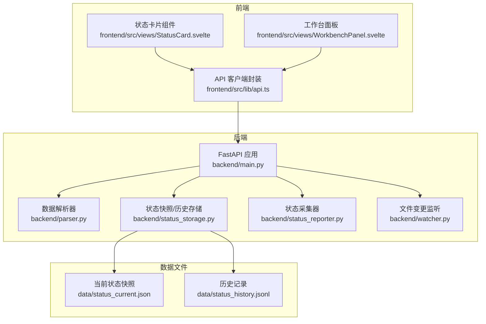
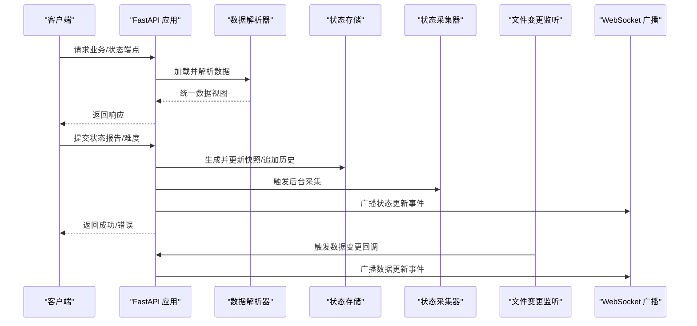
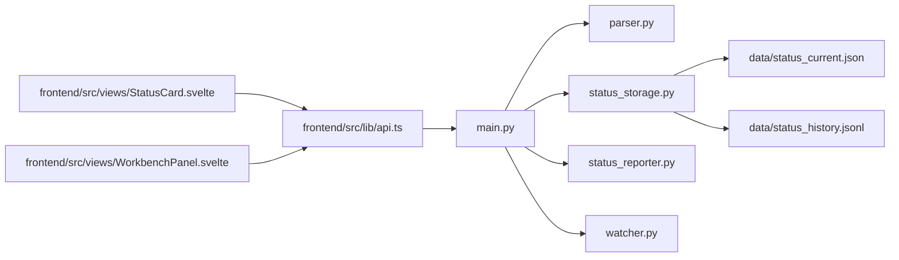

# REST API 端点

<cite>
**本文引用的文件**
- [backend/main.py](file://backend/main.py)
- [backend/parser.py](file://backend/parser.py)
- [backend/status_reporter.py](file://backend/status_reporter.py)
- [backend/status_storage.py](file://backend/status_storage.py)
- [backend/watcher.py](file://backend/watcher.py)
- [frontend/src/lib/api.ts](file://frontend/src/lib/api.ts)
- [frontend/src/views/StatusCard.svelte](file://frontend/src/views/StatusCard.svelte)
- [frontend/src/views/WorkbenchPanel.svelte](file://frontend/src/views/WorkbenchPanel.svelte)
- [data/status_current.json](file://data/status_current.json)
- [data/status_history.jsonl](file://data/status_history.jsonl)
</cite>

## 目录
1. [简介](#简介)
2. [项目结构](#项目结构)
3. [核心组件](#核心组件)
4. [架构总览](#架构总览)
5. [详细端点规范](#详细端点规范)
6. [依赖关系分析](#依赖关系分析)
7. [性能与并发特性](#性能与并发特性)
8. [故障排查指南](#故障排查指南)
9. [结论](#结论)
10. [附录](#附录)

## 简介
本文件为 SynapseOS 2.0 的 REST API 参考文档，覆盖以下端点：
- 业务数据端点：GET /api/mission、GET /api/tasks、GET /api/blockers、GET /api/decisions、PATCH /api/decisions/{decision_id}、GET /api/team、GET /api/registry
- 状态管理端点：POST /api/status/report、GET /api/status/panel、GET /api/status/history、GET /api/status/{agent_id}、POST /api/status/difficulty
同时给出参数校验规则、数据模型定义、响应格式、状态码、错误处理策略，并提供客户端调用示例与最佳实践建议。

## 项目结构
后端基于 FastAPI，负责：
- 解析 cyber-team 仓库中的任务与使命数据，聚合为统一数据视图
- 提供业务数据与状态管理的 REST API
- 通过 WebSocket 广播数据变更与状态更新
- 定时扫描任务文件生成状态快照并持久化

前端通过 fetch 调用 REST API，并通过 WebSocket 订阅状态面板更新。

图表来源
- [backend/main.py:184-495](file://backend/main.py#L184-L495)
- [backend/parser.py:440-509](file://backend/parser.py#L440-L509)
- [backend/status_storage.py:102-193](file://backend/status_storage.py#L102-L193)
- [backend/status_reporter.py:258-267](file://backend/status_reporter.py#L258-L267)
- [backend/watcher.py:8-52](file://backend/watcher.py#L8-L52)
- [frontend/src/lib/api.ts:75-181](file://frontend/src/lib/api.ts#L75-L181)
- [data/status_current.json:1-59](file://data/status_current.json#L1-L59)
- [data/status_history.jsonl:1-4](file://data/status_history.jsonl#L1-L4)

章节来源
- [backend/main.py:184-495](file://backend/main.py#L184-L495)
- [backend/parser.py:440-509](file://backend/parser.py#L440-L509)
- [backend/status_storage.py:102-193](file://backend/status_storage.py#L102-L193)
- [backend/status_reporter.py:258-267](file://backend/status_reporter.py#L258-L267)
- [backend/watcher.py:8-52](file://backend/watcher.py#L8-L52)
- [frontend/src/lib/api.ts:75-181](file://frontend/src/lib/api.ts#L75-L181)
- [data/status_current.json:1-59](file://data/status_current.json#L1-L59)
- [data/status_history.jsonl:1-4](file://data/status_history.jsonl#L1-L4)

## 核心组件
- 数据解析器：从 cyber-team 仓库读取任务与使命 Markdown，解析为统一的数据结构，生成 mission、tasks、blockers、decisions、team 等视图。
- 状态存储：维护当前状态快照与历史记录，支持查询与分页过滤。
- 状态采集器：定时扫描任务文件，汇总各 Agent 的进度、困难、待决策等信息，写入快照。
- 文件变更监听：监听数据目录变化，触发广播通知前端刷新。
- REST API：提供业务数据与状态管理接口；WebSocket 广播数据更新与状态面板变更。

章节来源
- [backend/parser.py:16-92](file://backend/parser.py#L16-L92)
- [backend/status_storage.py:32-193](file://backend/status_storage.py#L32-L193)
- [backend/status_reporter.py:189-267](file://backend/status_reporter.py#L189-L267)
- [backend/watcher.py:8-52](file://backend/watcher.py#L8-L52)

## 架构总览

图表来源
- [backend/main.py:200-394](file://backend/main.py#L200-L394)
- [backend/parser.py:440-509](file://backend/parser.py#L440-L509)
- [backend/status_storage.py:32-193](file://backend/status_storage.py#L32-L193)
- [backend/status_reporter.py:105-117](file://backend/status_reporter.py#L105-L117)
- [backend/watcher.py:21-34](file://backend/watcher.py#L21-L34)

## 详细端点规范

### 业务数据端点

#### GET /api/mission
- 功能：获取使命信息
- 响应：Mission 对象
- 示例响应：见“附录/示例响应”
- 错误：无显式错误码，若未找到则返回默认结构
- 客户端调用示例：见“附录/客户端调用示例”

章节来源
- [backend/main.py:200-204](file://backend/main.py#L200-L204)
- [backend/parser.py:16-30](file://backend/parser.py#L16-L30)
- [frontend/src/lib/api.ts:75-78](file://frontend/src/lib/api.ts#L75-L78)

#### GET /api/tasks
- 功能：获取任务列表
- 响应：Task 数组
- 示例响应：见“附录/示例响应”
- 错误：无显式错误码
- 客户端调用示例：见“附录/客户端调用示例”

章节来源
- [backend/main.py:206-210](file://backend/main.py#L206-L210)
- [backend/parser.py:32-49](file://backend/parser.py#L32-L49)
- [frontend/src/lib/api.ts:80-83](file://frontend/src/lib/api.ts#L80-L83)

#### GET /api/blockers
- 功能：获取阻塞项（由待决策任务推导）
- 响应：Blocker 数组
- 示例响应：见“附录/示例响应”
- 错误：无显式错误码
- 客户端调用示例：见“附录/客户端调用示例”

章节来源
- [backend/main.py:212-216](file://backend/main.py#L212-L216)
- [backend/parser.py:393-414](file://backend/parser.py#L393-L414)
- [frontend/src/lib/api.ts:85-88](file://frontend/src/lib/api.ts#L85-L88)

#### GET /api/decisions
- 功能：获取待决策任务列表
- 响应：Decision 数组
- 示例响应：见“附录/示例响应”
- 错误：无显式错误码
- 客户端调用示例：见“附录/客户端调用示例”

章节来源
- [backend/main.py:218-222](file://backend/main.py#L218-L222)
- [backend/parser.py:416-437](file://backend/parser.py#L416-L437)
- [frontend/src/lib/api.ts:90-93](file://frontend/src/lib/api.ts#L90-L93)

#### PATCH /api/decisions/{decision_id}
- 功能：更新决策状态（批准/拒绝），内部会修改对应任务文件中的“果爸决策”区块
- 路径参数
  - decision_id: string（必填）
- 请求体
  - decision_status: string（可选，默认为 decided）
- 成功响应
  - success: boolean
  - decision_id: string
  - task_id: string
- 失败响应
  - 若找不到对应决策：返回 { success: false, error: "decision not found" }
- 注意
  - 该端点会直接修改任务文件，请谨慎使用
- 客户端调用示例：见“附录/客户端调用示例”

章节来源
- [backend/main.py:224-299](file://backend/main.py#L224-L299)
- [backend/parser.py:416-437](file://backend/parser.py#L416-L437)

#### GET /api/team
- 功能：获取团队成员信息
- 响应：TeamMember 数组
- 示例响应：见“附录/示例响应”
- 错误：无显式错误码
- 客户端调用示例：见“附录/客户端调用示例”

章节来源
- [backend/main.py:301-305](file://backend/main.py#L301-L305)
- [backend/parser.py:345-391](file://backend/parser.py#L345-L391)
- [frontend/src/lib/api.ts:95-98](file://frontend/src/lib/api.ts#L95-L98)

#### GET /api/registry
- 功能：获取注册表（角色槽位与分配）
- 响应：JSON 对象（registry.json 内容）
- 示例响应：见“附录/示例响应”
- 错误：若文件不存在返回空对象
- 客户端调用示例：见“附录/客户端调用示例”

章节来源
- [backend/main.py:307-315](file://backend/main.py#L307-L315)

### 状态管理端点

#### POST /api/status/report
- 功能：提交状态报告
- 请求体字段
  - agent_id: string（必填）
  - agent_name: string（必填）
  - role: string（必填）
  - domain: string（可选）
  - current_task: string（必填）
  - progress: string（必填）
  - progress_detail: string（必填）
  - difficulty: string|null（可选）
  - difficulty_level: "none"|"minor"|"blocking"（可选）
  - needs_decision: string|null（可选）
  - needs_help: string|null（可选）
  - task_id: string（必填）
  - metadata: object（可选）
  - type: "report"|"difficulty"|"decision"（可选，若提供 difficulty/needs_decision 将自动覆盖）
- 成功响应
  - success: boolean
  - report_id: string
  - next_report_at: string
- 广播
  - 根据 type 决定事件类型：status_updated、difficulty_reported、decision_requested
- 客户端调用示例：见“附录/客户端调用示例”

章节来源
- [backend/main.py:318-347](file://backend/main.py#L318-L347)
- [backend/status_storage.py:32-58](file://backend/status_storage.py#L32-L58)
- [backend/status_storage.py:71-99](file://backend/status_storage.py#L71-L99)
- [backend/status_storage.py:139-144](file://backend/status_storage.py#L139-L144)

#### GET /api/status/panel
- 功能：获取实时状态面板（含在线状态与过期检测）
- 响应：包含 updated_at、agents（含 is_stale、online_status）、stale_threshold_minutes
- 客户端调用示例：见“附录/客户端调用示例”

章节来源
- [backend/main.py:349-353](file://backend/main.py#L349-L353)
- [backend/status_storage.py:102-127](file://backend/status_storage.py#L102-L127)

#### GET /api/status/history
- 功能：获取状态历史记录（支持分页与多条件过滤）
- 查询参数
  - agent_id: string（可选）
  - type: string（可选，report|difficulty|decision）
  - from_time: string（ISO 时间戳，可选）
  - to_time: string（ISO 时间戳，可选）
  - task_id: string（可选）
  - page: number（默认 1，最小 1）
  - limit: number（默认 20，最大 100）
- 成功响应
  - total: number
  - page: number
  - limit: number
  - records: StatusReport[]
- 客户端调用示例：见“附录/客户端调用示例”

章节来源
- [backend/main.py:355-375](file://backend/main.py#L355-L375)
- [backend/status_storage.py:146-193](file://backend/status_storage.py#L146-L193)

#### GET /api/status/{agent_id}
- 功能：获取指定成员的状态
- 路径参数
  - agent_id: string（必填）
- 成功响应：AgentStatus
- 失败响应：404 + {"error": "..."}
- 客户端调用示例：见“附录/客户端调用示例”

章节来源
- [backend/main.py:377-385](file://backend/main.py#L377-L385)
- [backend/status_storage.py:102-127](file://backend/status_storage.py#L102-L127)

#### POST /api/status/difficulty
- 功能：专门用于报告困难的便捷端点
- 请求体：同 POST /api/status/report，但会强制 type="difficulty"，且 difficulty_level 默认为 minor（若未提供）
- 成功响应：同 POST /api/status/report
- 客户端调用示例：见“附录/客户端调用示例”

章节来源
- [backend/main.py:387-394](file://backend/main.py#L387-L394)
- [backend/status_storage.py:32-58](file://backend/status_storage.py#L32-L58)

### 参数校验规则与数据模型

- 通用字段约束
  - 所有字符串字段若为空应视为缺失，按默认值处理
  - 数值型参数需满足范围限制（如 limit 最大 100）

- 状态面板字段
  - is_stale: 基于 last_report_at 与 stale_threshold_minutes 计算
  - online_status: online/stale

- 历史查询过滤
  - 支持按 agent_id、type、task_id、时间区间过滤
  - 结果按时间倒序返回

章节来源
- [backend/status_storage.py:102-127](file://backend/status_storage.py#L102-L127)
- [backend/status_storage.py:146-193](file://backend/status_storage.py#L146-L193)

## 依赖关系分析

图表来源
- [backend/main.py:15-21](file://backend/main.py#L15-L21)
- [backend/parser.py:440-509](file://backend/parser.py#L440-L509)
- [backend/status_storage.py:102-193](file://backend/status_storage.py#L102-L193)
- [backend/status_reporter.py:258-267](file://backend/status_reporter.py#L258-L267)
- [backend/watcher.py:8-52](file://backend/watcher.py#L8-L52)
- [frontend/src/lib/api.ts:75-181](file://frontend/src/lib/api.ts#L75-L181)
- [data/status_current.json:1-59](file://data/status_current.json#L1-L59)
- [data/status_history.jsonl:1-4](file://data/status_history.jsonl#L1-L4)

## 性能与并发特性
- WebSocket 广播
  - 使用独立通道 /ws/status 推送状态更新，降低与通用数据更新的耦合
  - 采用去抖机制减少频繁变更导致的广播风暴
- 状态采集
  - 后台线程每 60 秒扫描任务文件，生成快照并触发广播
- 历史查询
  - 历史文件为 JSONL 文本文件，逐行解析，注意 limit 上限控制
- 文件监控
  - 异步文件监控，变更时触发回调并去抖后广播

章节来源
- [backend/main.py:44-94](file://backend/main.py#L44-L94)
- [backend/main.py:105-161](file://backend/main.py#L105-L161)
- [backend/watcher.py:21-34](file://backend/watcher.py#L21-L34)
- [backend/status_storage.py:146-193](file://backend/status_storage.py#L146-L193)

## 故障排查指南
- 决策更新失败
  - 现象：PATCH /api/decisions/{decision_id} 返回 { success: false, error: "decision not found" }
  - 原因：传入的 decision_id 不存在
  - 处理：确认前端获取的决策列表与路径参数一致
- 任务文件修改失败
  - 现象：PATCH 成功但文件未更新
  - 原因：任务目录不存在或权限不足
  - 处理：检查 CYBER_TEAM_DIR 环境变量与目录权限
- 状态面板为空
  - 现象：GET /api/status/panel 返回空 agents
  - 原因：尚未生成快照或采集器未运行
  - 处理：等待后台采集器运行或手动触发一次采集
- 历史查询无结果
  - 现象：GET /api/status/history 返回空 records
  - 原因：历史文件不存在或过滤条件过于严格
  - 处理：检查历史文件存在性与过滤参数

章节来源
- [backend/main.py:241-242](file://backend/main.py#L241-L242)
- [backend/main.py:307-315](file://backend/main.py#L307-L315)
- [backend/status_storage.py:146-193](file://backend/status_storage.py#L146-L193)

## 结论
本 REST API 体系围绕“数据解析 + 状态采集 + 存储持久化 + WebSocket 广播”的模式构建，既满足业务数据查询需求，又提供高效的状态可视化能力。建议在生产环境中：
- 对外暴露的 PATCH 决策更新端点应配合鉴权与审计
- 控制历史查询的 limit，避免一次性拉取过多数据
- 监控状态采集线程与文件监控任务的健康状态

## 附录

### 数据模型定义
- Mission
  - 字段：id, title, status, priority, created_at, content, description, goals, team_overview, milestones, task_ids
- Task
  - 字段：id, title, status, assignee, priority, created_at, content, mission_id, mission_title, decision_status, decision_detail, has_blocker, blocker_reason, source_type, creator
- Blocker
  - 字段：id, title, status, priority, assignee, created_at, content, reason, task_id, task_title, mission_id
- Decision
  - 字段：id, title, status, priority, assignee, created_at, content, decision_status, decision_detail, source_of_truth, task_id, task_title, mission_id
- TeamMember
  - 字段：id, name, role, status, avatar, current_tasks, domain
- StatusReport
  - 字段：report_id, agent_id, agent_name, role, domain, current_task, progress, progress_detail, difficulty, difficulty_level, needs_decision, needs_help, task_id, type, created_at
- AgentStatus
  - 字段：agent_id, agent_name, role, domain, current_task, progress, progress_detail, difficulty, difficulty_level, needs_decision, needs_help, task_id, last_report_at, next_report_at, online_status, is_stale
- StatusPanel
  - 字段：updated_at, agents, stale_threshold_minutes

章节来源
- [frontend/src/lib/api.ts:3-149](file://frontend/src/lib/api.ts#L3-L149)

### 客户端调用示例
- 获取使命
  - fetch(`${BASE}/api/mission`)
- 获取任务列表
  - fetch(`${BASE}/api/tasks`)
- 获取阻塞项
  - fetch(`${BASE}/api/blockers`)
- 获取待决策
  - fetch(`${BASE}/api/decisions`)
- 更新决策
  - PATCH `${BASE}/api/decisions/{decision_id}`，Body: { decision_status: "decided" }
- 获取团队
  - fetch(`${BASE}/api/team`)
- 获取注册表
  - fetch(`${BASE}/api/registry`)
- 提交状态报告
  - POST `${BASE}/api/status/report`，Body: { agent_id, agent_name, role, current_task, progress, progress_detail, task_id, ... }
- 获取状态面板
  - fetch(`${BASE}/api/status/panel`)
- 获取历史
  - fetch(`${BASE}/api/status/history?agent_id=susan&type=difficulty&page=1&limit=20`)
- 获取指定成员状态
  - fetch(`${BASE}/api/status/{agent_id}`)
- 报告困难
  - POST `${BASE}/api/status/difficulty`，Body: { agent_id, agent_name, role, current_task, progress, progress_detail, task_id, difficulty, ... }

章节来源
- [frontend/src/lib/api.ts:75-181](file://frontend/src/lib/api.ts#L75-L181)
- [backend/main.py:200-394](file://backend/main.py#L200-L394)

### 示例响应
- GET /api/mission
  - 返回 Mission 对象
- GET /api/tasks
  - 返回 Task[]，示例字段：id, title, status, assignee, priority, created_at
- GET /api/blockers
  - 返回 Blocker[]，示例字段：id, title, status, priority, assignee, created_at
- GET /api/decisions
  - 返回 Decision[]，示例字段：id, title, status, priority, assignee, created_at
- PATCH /api/decisions/{decision_id}
  - 成功：{ success: true, decision_id, task_id }
  - 失败：{ success: false, error: "decision not found" }
- GET /api/team
  - 返回 TeamMember[]，示例字段：id, name, role, status, current_tasks
- GET /api/registry
  - 返回 JSON 对象（registry.json 内容）
- GET /api/status/panel
  - 返回 StatusPanel，包含 agents（含 is_stale、online_status）与 stale_threshold_minutes
- GET /api/status/history
  - 返回 { total, page, limit, records: StatusReport[] }
- GET /api/status/{agent_id}
  - 返回 AgentStatus，或 404 + { error }
- POST /api/status/report
  - 返回 { success: true, report_id, next_report_at }
- POST /api/status/difficulty
  - 返回 { success: true, report_id, next_report_at }

章节来源
- [backend/main.py:200-394](file://backend/main.py#L200-L394)
- [backend/status_storage.py:102-193](file://backend/status_storage.py#L102-L193)
- [data/status_current.json:1-59](file://data/status_current.json#L1-L59)
- [data/status_history.jsonl:1-4](file://data/status_history.jsonl#L1-L4)