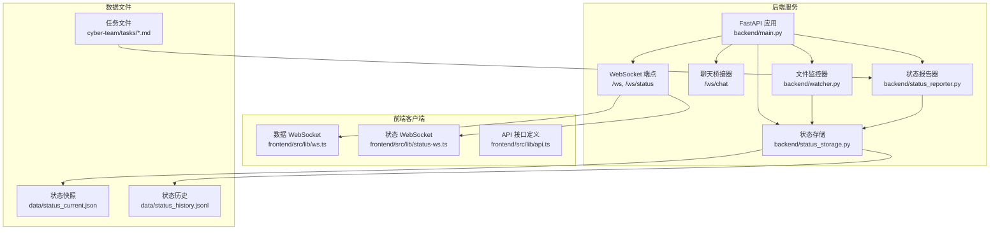
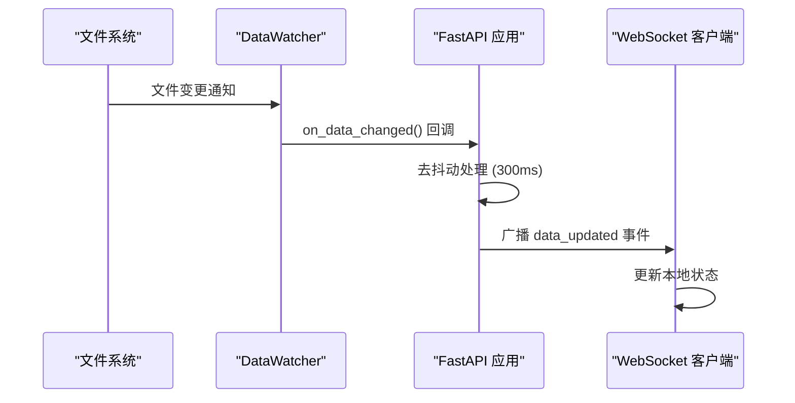
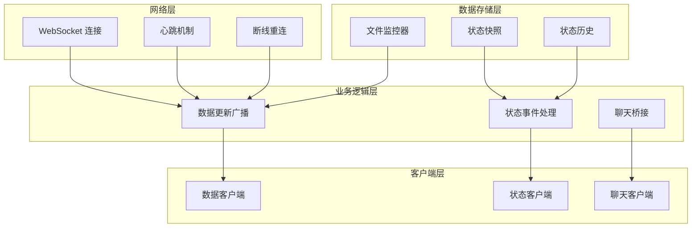
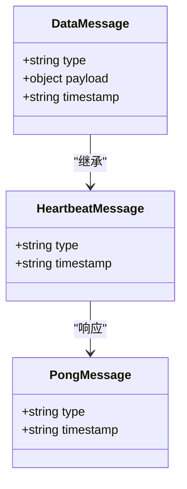
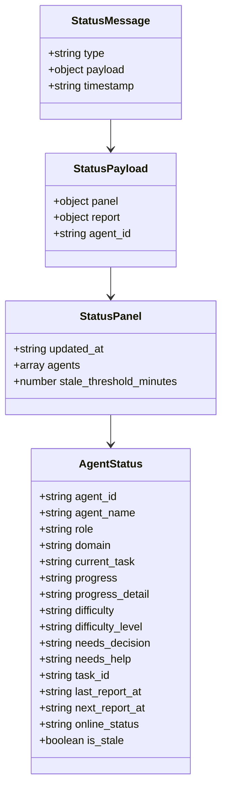
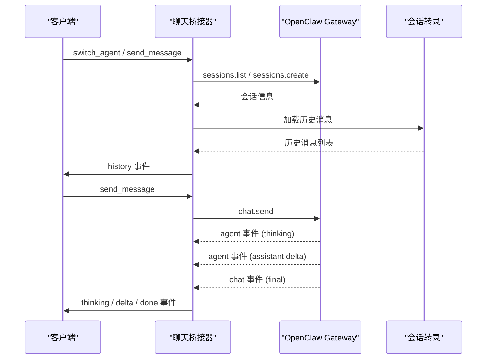
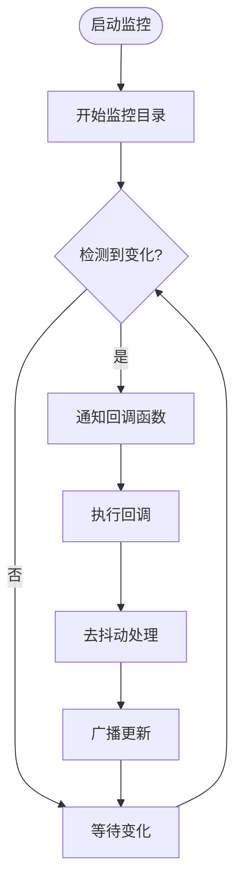
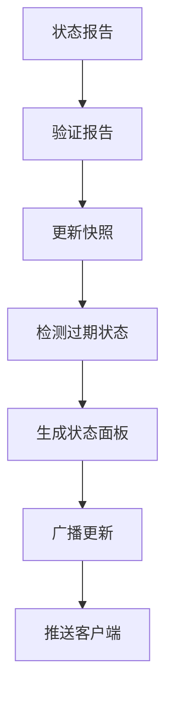
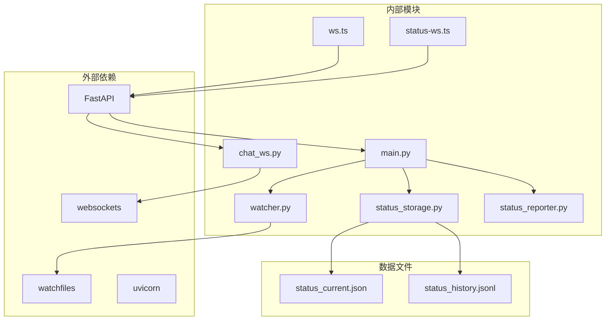

# WebSocket 事件

<cite>
**本文档引用的文件**
- [backend/main.py](file://backend/main.py)
- [backend/routers/chat_ws.py](file://backend/routers/chat_ws.py)
- [backend/watcher.py](file://backend/watcher.py)
- [backend/status_storage.py](file://backend/status_storage.py)
- [backend/status_reporter.py](file://backend/status_reporter.py)
- [frontend/src/lib/ws.ts](file://frontend/src/lib/ws.ts)
- [frontend/src/lib/status-ws.ts](file://frontend/src/lib/status-ws.ts)
- [frontend/src/lib/api.ts](file://frontend/src/lib/api.ts)
- [tests/test_chat_delta.py](file://tests/test_chat_delta.py)
- [tests/test_chat_delta2.py](file://tests/test_chat_delta2.py)
</cite>

## 目录
1. [简介](#简介)
2. [项目结构](#项目结构)
3. [核心组件](#核心组件)
4. [架构概览](#架构概览)
5. [详细组件分析](#详细组件分析)
6. [依赖关系分析](#依赖关系分析)
7. [性能考虑](#性能考虑)
8. [故障排除指南](#故障排除指南)
9. [结论](#结论)

## 简介

SynapseOS 2.0 的 WebSocket 事件系统是一个实时数据同步和状态监控平台，为前端应用提供了两个主要的 WebSocket 端点：`/ws` 和 `/ws/status`。该系统实现了高效的数据更新推送、心跳机制、文件监控触发的实时更新以及状态面板的实时推送功能。

系统采用 FastAPI 构建，支持异步 WebSocket 连接，通过文件监控机制自动检测数据变化，并通过心跳机制维持连接活跃性。前端通过专门的 WebSocket 客户端库实现断线重连、消息解析和状态管理。

## 项目结构

WebSocket 事件系统在项目中的组织结构如下：



**图表来源**
- [backend/main.py:396-477](file://backend/main.py#L396-L477)
- [backend/watcher.py:1-52](file://backend/watcher.py#L1-L52)
- [backend/status_storage.py:1-236](file://backend/status_storage.py#L1-L236)

**章节来源**
- [backend/main.py:1-495](file://backend/main.py#L1-L495)
- [backend/routers/chat_ws.py:1-353](file://backend/routers/chat_ws.py#L1-L353)

## 核心组件

### WebSocket 端点架构

系统包含两个主要的 WebSocket 端点，每个都有特定的功能和消息格式：

#### 主数据端点 (`/ws`)
- **功能**：推送实时数据更新和心跳信号
- **连接管理**：维护客户端连接列表，支持断线重连
- **消息类型**：
  - `data_updated`：数据更新事件
  - `heartbeat`：心跳信号
  - `pong`：心跳响应

#### 状态端点 (`/ws/status`)
- **功能**：推送状态面板更新和特殊事件
- **消息类型**：
  - `status_updated`：状态面板更新
  - `difficulty_reported`：困难报告事件
  - `decision_requested`：决策请求事件
  - `heartbeat`：心跳信号

### 数据监控机制

系统通过文件监控器自动检测数据变化：



**图表来源**
- [backend/watcher.py:21-35](file://backend/watcher.py#L21-L35)
- [backend/main.py:61-94](file://backend/main.py#L61-L94)

**章节来源**
- [backend/main.py:396-477](file://backend/main.py#L396-L477)
- [backend/watcher.py:1-52](file://backend/watcher.py#L1-L52)

## 架构概览

WebSocket 事件系统的整体架构采用分层设计，确保了高可用性和可扩展性：



**图表来源**
- [backend/main.py:119-182](file://backend/main.py#L119-L182)
- [backend/status_storage.py:102-127](file://backend/status_storage.py#L102-L127)

## 详细组件分析

### 主数据 WebSocket (`/ws`)

#### 连接协议

主数据端点实现了标准的 WebSocket 协议，支持以下特性：

- **初始连接**：接受连接后立即发送当前数据快照
- **心跳机制**：每 30 秒发送心跳信号，客户端需在 30 秒内发送 "ping"
- **断线处理**：优雅断开连接，清理资源

#### 消息格式



**图表来源**
- [backend/main.py:407-430](file://backend/main.py#L407-L430)

#### 事件类型

1. **data_updated**：数据更新事件
   - 触发条件：文件监控检测到数据变化
   - 去抖动处理：300ms 冷却期合并多次更新
   - 载荷结构：包含完整的数据对象

2. **heartbeat**：心跳信号
   - 发送频率：每 30 秒
   - 目的：保持连接活跃
   - 客户端响应：发送 "ping"

3. **pong**：心跳响应
   - 自动发送：当客户端发送 "ping"
   - 结构：包含服务器时间戳

**章节来源**
- [backend/main.py:396-440](file://backend/main.py#L396-L440)

### 状态 WebSocket (`/ws/status`)

#### 连接协议

状态端点专为状态面板设计，具有以下特点：

- **独立连接池**：与主数据端点分离
- **初始状态推送**：连接建立时推送当前状态面板
- **事件驱动更新**：基于状态报告器的事件推送

#### 消息格式



**图表来源**
- [backend/main.py:452-476](file://backend/main.py#L452-L476)
- [backend/status_storage.py:102-127](file://backend/status_storage.py#L102-L127)

#### 事件类型

1. **status_updated**：状态面板更新
   - 触发条件：状态报告器生成新的状态快照
   - 载荷内容：完整的状态面板数据
   - 更新频率：后台线程每 60 秒扫描

2. **difficulty_reported**：困难报告事件
   - 触发条件：状态报告包含困难信息
   - 特殊处理：自动转换为相应事件类型
   - 用户界面：显示困难状态

3. **decision_requested**：决策请求事件
   - 触发条件：状态报告包含决策需求
   - 特殊处理：自动转换为相应事件类型
   - 用户界面：突出显示需要决策的任务

**章节来源**
- [backend/main.py:442-477](file://backend/main.py#L442-L477)
- [backend/status_reporter.py:258-267](file://backend/status_reporter.py#L258-L267)

### 聊天桥接 WebSocket (`/ws/chat`)

#### 功能概述

聊天桥接器实现了与 OpenClaw Gateway 的双向通信，支持：

- **会话管理**：为不同代理维护独立会话
- **流式响应**：支持增量文本推送
- **多代理支持**：支持多个代理的并发对话
- **历史加载**：从会话转录文件加载历史消息

#### 消息流程



**图表来源**
- [backend/routers/chat_ws.py:174-353](file://backend/routers/chat_ws.py#L174-L353)

**章节来源**
- [backend/routers/chat_ws.py:1-353](file://backend/routers/chat_ws.py#L1-L353)

### 文件监控机制

#### DataWatcher 组件

文件监控器负责检测数据目录的变化：



**图表来源**
- [backend/watcher.py:29-35](file://backend/watcher.py#L29-L35)

#### 监控配置

- **监控路径**：`data` 目录
- **去抖动时间**：300ms
- **回调处理**：异步执行，避免阻塞
- **错误处理**：捕获并记录回调异常

**章节来源**
- [backend/watcher.py:1-52](file://backend/watcher.py#L1-L52)
- [backend/main.py:61-94](file://backend/main.py#L61-L94)

### 状态存储系统

#### 数据模型

状态存储系统维护两种主要数据结构：

1. **状态快照** (`status_current.json`)
   - 当前所有代理的状态
   - 实时更新的时间戳
   - 在线状态检测

2. **状态历史** (`status_history.jsonl`)
   - 每条状态报告的完整历史
   - 支持查询过滤和分页
   - Gzip 压缩存储

#### 状态面板生成



**图表来源**
- [backend/status_storage.py:62-127](file://backend/status_storage.py#L62-L127)

**章节来源**
- [backend/status_storage.py:1-236](file://backend/status_storage.py#L1-L236)

## 依赖关系分析

WebSocket 事件系统的依赖关系体现了清晰的分层架构：



**图表来源**
- [backend/main.py:1-495](file://backend/main.py#L1-L495)
- [backend/routers/chat_ws.py:1-353](file://backend/routers/chat_ws.py#L1-L353)

### 关键依赖链

1. **监控依赖**：`watcher.py` → `main.py` → `ws.ts`
2. **状态依赖**：`status_reporter.py` → `status_storage.py` → `status-ws.ts`
3. **聊天依赖**：`chat_ws.py` → `websockets` → `ws.ts`

**章节来源**
- [backend/main.py:1-495](file://backend/main.py#L1-L495)
- [backend/routers/chat_ws.py:1-353](file://backend/routers/chat_ws.py#L1-L353)

## 性能考虑

### 连接管理优化

1. **连接池管理**
   - 主数据端点：维护全局连接列表
   - 状态端点：独立连接池，避免相互影响
   - 自动清理：断开连接时移除死连接

2. **消息去抖动**
   - 数据更新：300ms 冷却期合并频繁更新
   - 避免消息风暴，提高系统稳定性

3. **内存优化**
   - 使用队列处理消息传递
   - 及时清理历史消息缓冲区

### 网络性能优化

1. **心跳机制**
   - 30秒超时检测连接状态
   - 自动 pong 响应减少手动处理
   - 降低网络开销

2. **消息压缩**
   - JSON 序列化优化
   - 大消息分片传输（聊天桥接）

3. **并发处理**
   - 异步 I/O 操作
   - 多任务并行处理
   - 避免阻塞主线程

### 存储性能优化

1. **文件监控**
   - 异步文件监控，非阻塞
   - 变化批量处理
   - 缓存最近状态

2. **状态报告**
   - 后台线程定期扫描
   - 事件驱动更新
   - 减少实时扫描频率

## 故障排除指南

### 常见问题诊断

#### 连接问题

1. **连接失败**
   - 检查 WebSocket 服务器是否运行
   - 验证 CORS 配置
   - 确认防火墙设置

2. **断线重连**
   - 客户端实现指数退避重连
   - 最大重连延迟 10秒
   - 连接状态持久化

#### 消息处理问题

1. **消息丢失**
   - 检查去抖动处理是否过长
   - 验证消息序列化
   - 确认客户端解析逻辑

2. **心跳超时**
   - 检查客户端 ping 发送频率
   - 验证服务器超时设置
   - 网络延迟测试

#### 状态同步问题

1. **状态不同步**
   - 检查文件监控器是否正常工作
   - 验证状态报告器执行频率
   - 确认状态快照更新

2. **聊天消息异常**
   - 检查 OpenClaw Gateway 连接
   - 验证会话密钥有效性
   - 确认代理权限配置

### 调试工具

#### 服务器端调试

```python
# 启用详细日志
import logging
logging.basicConfig(level=logging.DEBUG)

# 监控连接状态
print(f"[ws] connected, total clients: {len(connected_clients)}")

# 检查消息处理
print(f"[ws] received message: {msg[:100]}...")
```

#### 客户端调试

```typescript
// WebSocket 连接调试
ws.onopen = () => {
    console.log("[ws] connected");
    console.log("Connection URL:", ws.url);
};

ws.onerror = (err) => {
    console.error("[ws] error:", err);
    console.error("Error details:", err.message);
};
```

**章节来源**
- [frontend/src/lib/ws.ts:26-84](file://frontend/src/lib/ws.ts#L26-L84)
- [frontend/src/lib/status-ws.ts:18-78](file://frontend/src/lib/status-ws.ts#L18-L78)

## 结论

SynapseOS 2.0 的 WebSocket 事件系统通过精心设计的架构实现了高效、可靠的实时数据同步。系统的主要优势包括：

1. **双通道设计**：分离的数据更新和状态更新通道，避免相互影响
2. **智能去抖动**：300ms 冷却期有效防止消息风暴
3. **完善的错误处理**：断线重连、心跳检测、异常恢复
4. **灵活的消息格式**：标准化的消息结构便于客户端处理
5. **高性能实现**：异步处理、内存优化、网络优化

该系统为 SynapseOS 2.0 提供了强大的实时能力，支持复杂的工作流和状态管理需求。通过合理的架构设计和性能优化，系统能够在高负载情况下保持稳定运行。

未来可以考虑的改进方向包括：
- 添加消息认证机制
- 实现更精细的连接池管理
- 增强消息持久化和重放功能
- 优化大规模连接的性能表现