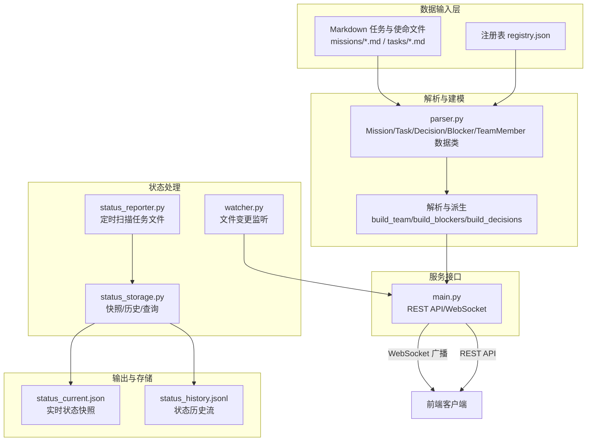
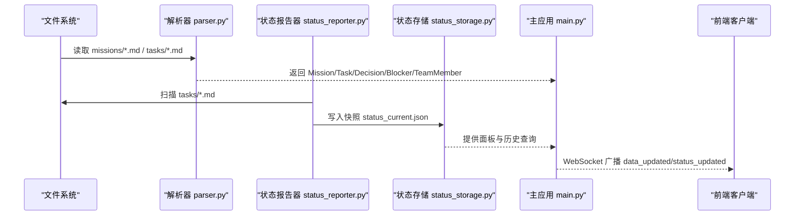
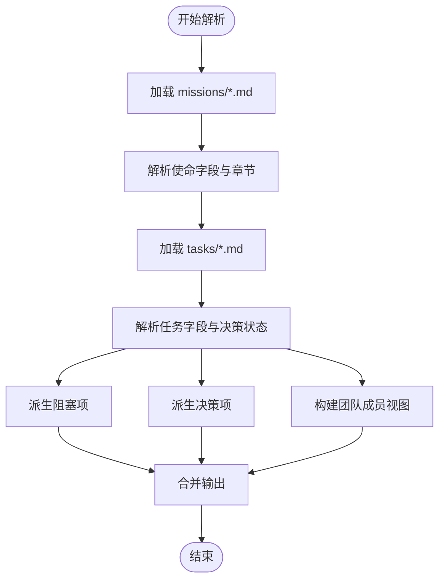
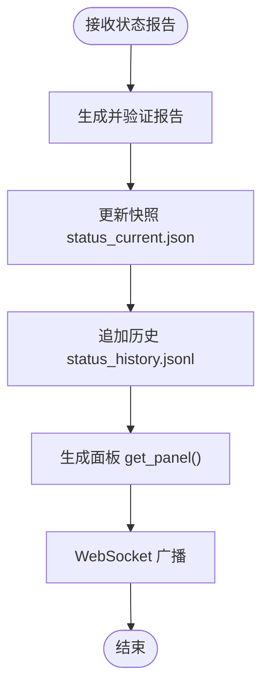
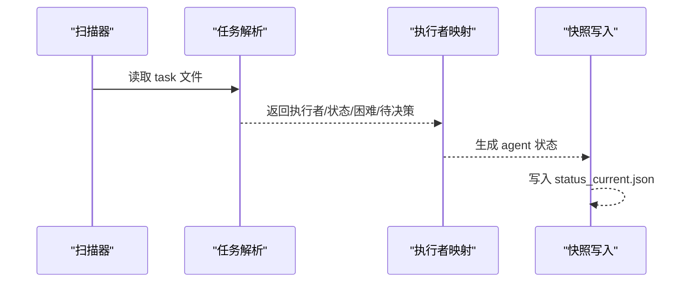
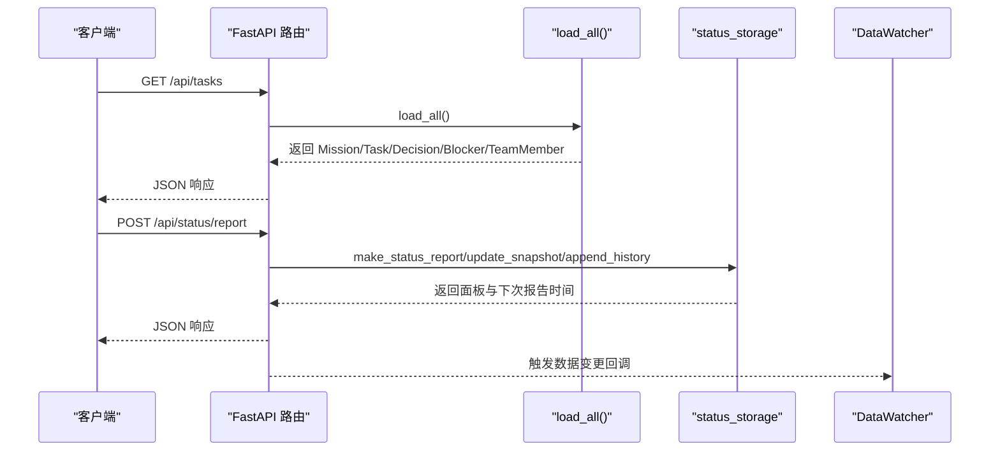
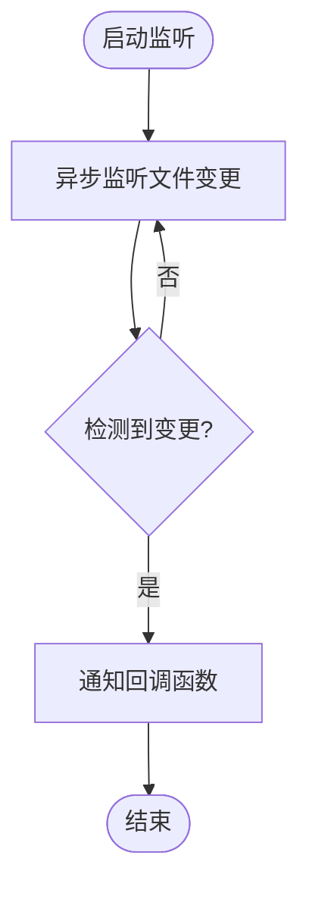
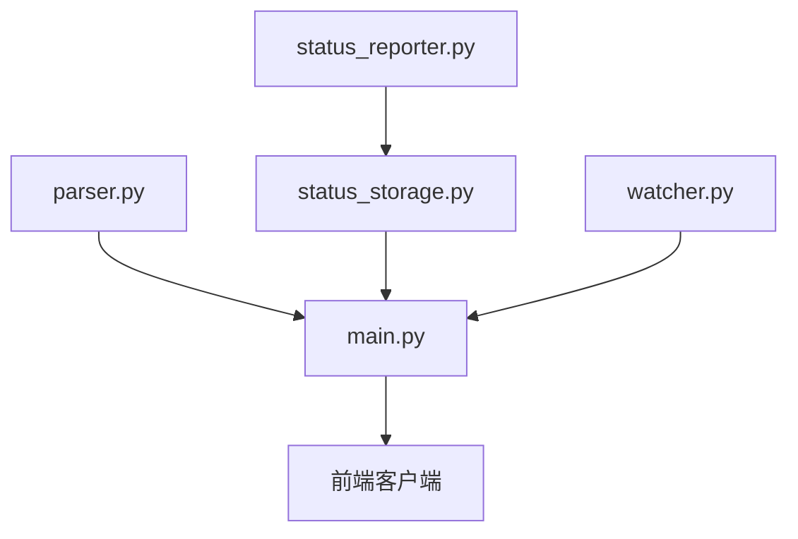

# 数据模型规范

<cite>
**本文档引用的文件**
- [backend/main.py](file://backend/main.py)
- [backend/parser.py](file://backend/parser.py)
- [backend/status_storage.py](file://backend/status_storage.py)
- [backend/status_reporter.py](file://backend/status_reporter.py)
- [backend/watcher.py](file://backend/watcher.py)
- [data/status_current.json](file://data/status_current.json)
- [data/status_history.jsonl](file://data/status_history.jsonl)
</cite>

## 目录
1. [简介](#简介)
2. [项目结构](#项目结构)
3. [核心数据实体](#核心数据实体)
4. [架构概览](#架构概览)
5. [详细组件分析](#详细组件分析)
6. [依赖关系分析](#依赖关系分析)
7. [性能考虑](#性能考虑)
8. [故障排除指南](#故障排除指南)
9. [结论](#结论)
10. [附录](#附录)

## 简介
本规范文档面向 SynapseOS 2.0 的数据模型，系统性定义核心数据实体（Mission、Task、TeamMember、Decision、StatusReport）的结构、字段、验证规则、默认值、约束条件，并阐明实体间的关系与引用关系。同时提供数据序列化/反序列化格式规范、JSON Schema 定义、数据校验规则、数据生命周期管理、版本兼容性与迁移策略，以及数据完整性与并发访问控制机制。

## 项目结构
SynapseOS 2.0 的数据模型由以下模块协同实现：
- 解析器模块：负责从 Markdown 文档中抽取 Mission、Task、Decision、Blocker 等实体，并构建团队视图。
- 状态存储模块：负责状态快照与历史记录的持久化、查询与分页。
- 状态报告器模块：定时扫描任务文件，生成实时状态报告并写入快照。
- 主应用模块：提供 REST API 与 WebSocket，协调数据变更广播与状态更新。
- 文件监视器：监控数据目录变化，触发前端数据更新广播。

**图表来源**
- [backend/parser.py:16-92](file://backend/parser.py#L16-L92)
- [backend/status_reporter.py:15-44](file://backend/status_reporter.py#L15-L44)
- [backend/status_storage.py:10-236](file://backend/status_storage.py#L10-L236)
- [backend/main.py:17-495](file://backend/main.py#L17-L495)
- [backend/watcher.py:8-52](file://backend/watcher.py#L8-L52)

**章节来源**
- [backend/main.py:17-495](file://backend/main.py#L17-L495)
- [backend/parser.py:16-509](file://backend/parser.py#L16-L509)
- [backend/status_storage.py:10-236](file://backend/status_storage.py#L10-L236)
- [backend/status_reporter.py:15-274](file://backend/status_reporter.py#L15-L274)
- [backend/watcher.py:8-52](file://backend/watcher.py#L8-L52)

## 核心数据实体

### Mission（使命）
- 描述：承载项目目标、里程碑、团队概览与任务集合。
- 关键字段
  - id: 字符串，唯一标识
  - title: 字符串，标题
  - status: 字符串，状态（如 active）
  - priority: 字符串，默认 high
  - created_at: 字符串，ISO 时间戳
  - content: 字符串，内容摘要
  - description: 字符串，描述
  - goals: 数组，目标条目（title、detail）
  - team_overview: 数组，团队角色与成员（role、member、duty）
  - milestones: 数组，里程碑（id、title、status）
  - task_ids: 数组，关联的任务 ID 列表
- 默认值与约束
  - priority 默认 high；status 默认 active
  - goals、team_overview、milestones、task_ids 默认空数组
  - created_at 为空时由解析逻辑填充
- 关系
  - 通过任务文件中的 mission_id 关联 Task
  - 通过 team_overview 与 TeamMember 建立角色映射

**章节来源**
- [backend/parser.py:17-30](file://backend/parser.py#L17-L30)

### Task（任务）
- 描述：具体可执行的工作单元，包含状态、负责人、优先级、决策状态等。
- 关键字段
  - id: 字符串，唯一标识
  - title: 字符串，标题
  - status: 字符串，标准化后的状态（如 pending、in-progress、completed）
  - assignee: 字符串，负责人（支持多负责人拼接）
  - priority: 字符串，优先级（high/medium/low）
  - created_at: 字符串，ISO 时间戳
  - content: 字符串，内容摘要
  - mission_id: 字符串，所属使命 ID
  - mission_title: 字符串，所属使命标题
  - decision_status: 字符串，决策状态（pending/decided/none）
  - decision_detail: 字符串，决策详情
  - has_blocker: 布尔，是否存在阻塞
  - blocker_reason: 字符串，阻塞原因
  - source_type: 字符串，来源类型（real-business / synapse-os）
  - creator: 字符串，创建者
- 默认值与约束
  - status 标准化映射；priority 默认 medium
  - decision_status 默认 none；has_blocker 默认 false
  - mission_id 为空时清理括号注释后提取
- 关系
  - 与 Decision 一对一或一对多（根据决策状态）
  - 与 Blocker 关联（当决策状态为 pending 时）

**章节来源**
- [backend/parser.py:32-49](file://backend/parser.py#L32-L49)

### Blocker（阻塞）
- 描述：由任务派生的阻塞项，用于追踪“等待决策”的阻塞点。
- 关键字段
  - id: 字符串，唯一标识
  - title: 字符串，标题（形如“待果爸决策: 任务标题”）
  - status: 字符串，状态（open）
  - priority: 字符串，优先级
  - assignee: 字符串，负责人
  - created_at: 字符串，ISO 时间戳
  - content: 字符串，决策详情
  - reason: 字符串，阻塞原因
  - task_id: 字符串，关联任务 ID
  - task_title: 字符串，关联任务标题
  - mission_id: 字符串，关联使命 ID
- 默认值与约束
  - 仅在任务决策状态为 pending 时派生
  - status 默认 open

**章节来源**
- [backend/parser.py:393-413](file://backend/parser.py#L393-L413)

### Decision（决策）
- 描述：任务相关的决策实体，记录决策状态与来源。
- 关键字段
  - id: 字符串，唯一标识
  - title: 字符串，标题
  - status: 字符串，决策状态（pending/decided）
  - priority: 字符串，优先级
  - assignee: 字符串，默认 果爸
  - created_at: 字符串，ISO 时间戳
  - content: 字符串，决策详情
  - decision_status: 字符串，决策状态（与 status 同步）
  - decision_detail: 字符串，决策详情
  - source_of_truth: 字符串，真相源
  - task_id: 字符串，关联任务 ID
  - task_title: 字符串，关联任务标题
  - mission_id: 字符串，关联使命 ID
- 默认值与约束
  - 仅在任务决策状态为 pending/decided 时派生
  - assignee 默认 果爸

**章节来源**
- [backend/parser.py:416-437](file://backend/parser.py#L416-L437)

### TeamMember（团队成员）
- 描述：团队成员视图，包含当前任务列表与角色信息。
- 关键字段
  - id: 字符串，唯一标识
  - name: 字符串，姓名
  - role: 字符串，角色
  - status: 字符串，在线状态（如 🟢 在线、🟡 工作中）
  - avatar: 可选字符串，头像路径
  - current_tasks: 数组，当前任务列表（id、title、status）
  - domain: 字符串，领域
- 默认值与约束
  - core 成员（果爸、苏珊、里德）确保存在
  - status 默认在线或工作中

**章节来源**
- [backend/parser.py:345-391](file://backend/parser.py#L345-L391)

### StatusReport（状态报告）
- 描述：员工状态报告，包含进度、困难、待决策等信息。
- 关键字段
  - report_id: 字符串，报告唯一标识（格式 rpt_YYYYMMDD_HHMMSS_agent_id）
  - agent_id: 字符串，员工 ID
  - agent_name: 字符串，员工姓名
  - role: 字符串，角色
  - domain: 字符串，领域
  - current_task: 字符串，当前任务标题
  - progress: 字符串，进度状态（idle/planning/developing/testing/deploying/completed）
  - progress_detail: 字符串，进度详情（含任务 ID 与状态）
  - difficulty: 可选字符串，困难描述
  - difficulty_level: 字符串，困难等级（none/minor/blocking）
  - needs_decision: 可选字符串，需要决策的问题
  - needs_help: 可选字符串，需要帮助的事项
  - task_id: 字符串，任务 ID
  - metadata: 对象，扩展元数据
  - type: 字符串，报告类型（report/difficulty/decision）
  - created_at: 字符串，创建时间（ISO）
- 默认值与约束
  - progress 默认 idle；difficulty_level 默认 none
  - type 根据内容自动覆盖（difficulty/decision）
  - created_at 使用东八区 ISO 时间

**章节来源**
- [backend/status_storage.py:33-58](file://backend/status_storage.py#L33-L58)
- [data/status_current.json:1-59](file://data/status_current.json#L1-L59)
- [data/status_history.jsonl:1-4](file://data/status_history.jsonl#L1-L4)

## 架构概览
数据模型在系统中的流转如下：
- 任务与使命文件经解析器抽取为 Mission、Task、Decision、Blocker、TeamMember。
- 状态报告器定时扫描任务文件，生成状态报告并写入快照。
- 主应用提供 REST API 与 WebSocket，广播数据更新与状态变更。
- 文件监视器检测数据目录变化，触发前端刷新。

**图表来源**
- [backend/parser.py:441-509](file://backend/parser.py#L441-L509)
- [backend/status_reporter.py:258-267](file://backend/status_reporter.py#L258-L267)
- [backend/status_storage.py:246-266](file://backend/status_storage.py#L246-L266)
- [backend/main.py:44-181](file://backend/main.py#L44-L181)

## 详细组件分析

### 解析器组件（parser.py）
- 职责
  - 抽取 Mission/Task/Decision/Blocker/TeamMember 数据类
  - 标准化任务状态与优先级
  - 从任务文件中解析决策状态与真相源
  - 派生 Blocker 与 Decision
  - 构建 TeamMember 视图
- 关键流程
  - parse_mission：解析使命元数据与章节，提取 goals、team_overview、milestones
  - parse_task：解析任务标题、状态、优先级、执行者、困难、待决策、决策状态与真相源
  - build_blockers/build_decisions：基于任务决策状态派生阻塞与决策
  - build_team：合并使命团队概览与任务分配，生成团队成员视图
- 错误处理
  - 文件不存在或解析失败时返回空或默认值
  - 任务状态映射与优先级识别采用容错策略

**图表来源**
- [backend/parser.py:123-509](file://backend/parser.py#L123-L509)

**章节来源**
- [backend/parser.py:123-509](file://backend/parser.py#L123-L509)

### 状态存储组件（status_storage.py）
- 职责
  - 创建并验证状态报告（make_status_report）
  - 更新实时状态快照（update_snapshot）
  - 生成状态面板（get_panel），包含过期检测
  - 追加历史记录（append_history）
  - 查询历史（get_history），支持分页与过滤
- 关键流程
  - make_status_report：生成 report_id、规范化 type、设置 created_at
  - update_snapshot：写入 agents 字典，计算 next_report_at
  - get_panel：计算 is_stale 与 online_status
  - get_history：按过滤条件读取 JSONL 历史文件
- 并发与一致性
  - 单进程写入，快照与历史文件独立，避免锁竞争
  - 过期阈值与报告间隔配置化

**图表来源**
- [backend/status_storage.py:33-193](file://backend/status_storage.py#L33-L193)

**章节来源**
- [backend/status_storage.py:33-193](file://backend/status_storage.py#L33-L193)

### 状态报告器组件（status_reporter.py）
- 职责
  - 扫描 tasks 目录，解析任务文件，提取执行者、状态、困难、待决策
  - 将执行者映射为 agent_id，生成状态报告
  - 写入快照文件，供面板展示
- 关键流程
  - _parse_task_file：提取任务标题、状态、执行者、困难、待决策
  - gather_all_status_reports：聚合各 agent 的状态
  - write_snapshot：写入 status_current.json
- 映射与规则
  - AGENT_NAME_MAP：中文名/英文名映射到 agent_id
  - AGENT_META：agent_id 到姓名、角色、领域的元信息
  - _task_state_to_progress：状态映射到 progress

**图表来源**
- [backend/status_reporter.py:129-266](file://backend/status_reporter.py#L129-L266)

**章节来源**
- [backend/status_reporter.py:129-266](file://backend/status_reporter.py#L129-L266)

### 主应用组件（main.py）
- 职责
  - 提供 REST API：/api/mission、/api/tasks、/api/decisions、/api/team、/api/registry
  - 提供状态 API：/api/status/report、/api/status/panel、/api/status/history、/api/status/{agent_id}
  - 维护 WebSocket：/ws（数据更新）、/ws/status（状态更新）
  - 集成文件监视器 DataWatcher，触发数据更新广播
- 关键流程
  - WebSocket 广播：debounce_and_broadcast、broadcast_status
  - 决策更新：/api/patch 决策，更新任务文件中的“果爸决策”区块
  - 状态上报：/api/status/report，生成报告、更新快照、追加历史并广播

**图表来源**
- [backend/main.py:200-385](file://backend/main.py#L200-L385)
- [backend/main.py:44-181](file://backend/main.py#L44-L181)

**章节来源**
- [backend/main.py:200-385](file://backend/main.py#L200-L385)
- [backend/main.py:44-181](file://backend/main.py#L44-L181)

### 文件监视器组件（watcher.py）
- 职责
  - 异步监听数据目录变化
  - 触发回调函数，驱动前端数据更新
- 关键流程
  - start：启动异步监听
  - _watch：检测到变更后通知回调
  - stop：停止监听

**图表来源**
- [backend/watcher.py:29-51](file://backend/watcher.py#L29-L51)

**章节来源**
- [backend/watcher.py:8-52](file://backend/watcher.py#L8-L52)

## 依赖关系分析
- 解析器依赖 Markdown frontmatter 与正则解析，派生 Blocker 与 Decision
- 状态存储依赖 JSON 文件持久化，提供快照与历史查询
- 状态报告器依赖任务文件解析与 agent 映射
- 主应用依赖解析器与状态存储，提供 API 与 WebSocket
- 文件监视器与主应用耦合，用于数据变更广播

**图表来源**
- [backend/parser.py:441-509](file://backend/parser.py#L441-L509)
- [backend/status_reporter.py:258-267](file://backend/status_reporter.py#L258-L267)
- [backend/status_storage.py:246-266](file://backend/status_storage.py#L246-L266)
- [backend/main.py:185-495](file://backend/main.py#L185-L495)
- [backend/watcher.py:8-52](file://backend/watcher.py#L8-L52)

**章节来源**
- [backend/parser.py:441-509](file://backend/parser.py#L441-L509)
- [backend/status_reporter.py:258-267](file://backend/status_reporter.py#L258-L267)
- [backend/status_storage.py:246-266](file://backend/status_storage.py#L246-L266)
- [backend/main.py:185-495](file://backend/main.py#L185-L495)
- [backend/watcher.py:8-52](file://backend/watcher.py#L8-L52)

## 性能考虑
- 解析性能
  - 任务文件数量有限，解析复杂度与文件大小线性相关
  - 正则与 frontmatter 解析在内存中完成，I/O 为主要瓶颈
- 存储性能
  - 快照与历史文件独立，避免锁竞争
  - 历史文件采用 JSONL 追加写入，查询时逐行解析
- 广播性能
  - WebSocket 广播使用去抖动机制（300ms），减少频繁更新
  - 状态面板按需生成，包含过期检测与在线状态标记

[本节为通用性能讨论，无需特定文件分析]

## 故障排除指南
- 决策更新失败
  - 现象：PATCH /api/decisions/{decision_id} 返回未找到
  - 原因：任务文件中未找到匹配的 decision_id
  - 处理：检查任务文件命名与内容，确认“果爸决策”区块存在
- 状态上报异常
  - 现象：/api/status/report 返回错误
  - 原因：状态报告器线程异常或文件写入失败
  - 处理：查看日志，确认 data 目录权限与磁盘空间
- WebSocket 断连
  - 现象：/ws 或 /ws/status 心跳失败
  - 原因：客户端超时或网络问题
  - 处理：检查心跳机制与连接参数

**章节来源**
- [backend/main.py:224-298](file://backend/main.py#L224-L298)
- [backend/main.py:431-476](file://backend/main.py#L431-L476)
- [backend/status_reporter.py:105-108](file://backend/status_reporter.py#L105-L108)

## 结论
SynapseOS 2.0 的数据模型以 Mission、Task、Decision、Blocker、TeamMember 为核心，结合 StatusReport 实现实时状态可视化。解析器负责从 Markdown 文档中抽取结构化数据，状态存储与报告器保障数据的持久化与实时性，主应用提供统一的 API 与 WebSocket 接口。整体架构清晰、模块职责明确，具备良好的扩展性与可维护性。

[本节为总结，无需特定文件分析]

## 附录

### 数据序列化与反序列化规范
- JSON 序列化
  - 使用 UTF-8 编码，确保中文字符正确显示
  - 时间字段统一为 ISO 8601 格式（含时区偏移）
- JSON 反序列化
  - 严格校验必需字段存在性与类型
  - 对日期字符串进行解析，异常时回退到默认值

**章节来源**
- [backend/status_storage.py:64-68](file://backend/status_storage.py#L64-L68)
- [backend/status_storage.py:104-126](file://backend/status_storage.py#L104-L126)

### JSON Schema 定义（示例）
- Mission
  - 字段：id、title、status、priority、created_at、content、description、goals、team_overview、milestones、task_ids
  - 类型：字符串、数组
  - 约束：priority ∈ {high, medium, low}；goals/team_overview/milestones/task_ids 默认空数组
- Task
  - 字段：id、title、status、assignee、priority、created_at、content、mission_id、mission_title、decision_status、decision_detail、has_blocker、blocker_reason、source_type、creator
  - 类型：字符串、布尔、数组
  - 约束：status 标准化；priority 默认 medium；decision_status ∈ {pending, decided, none}
- Decision
  - 字段：id、title、status、priority、assignee、created_at、content、decision_status、decision_detail、source_of_truth、task_id、task_title、mission_id
  - 类型：字符串、数组
  - 约束：status 与 decision_status 同步；assignee 默认 果爸
- TeamMember
  - 字段：id、name、role、status、avatar、current_tasks、domain
  - 类型：字符串、数组
  - 约束：current_tasks 为对象数组（id、title、status）
- StatusReport
  - 字段：report_id、agent_id、agent_name、role、domain、current_task、progress、progress_detail、difficulty、difficulty_level、needs_decision、needs_help、task_id、metadata、type、created_at
  - 类型：字符串、对象、数组
  - 约束：type ∈ {report, difficulty, decision}；difficulty/difficulty_level/needs_decision/needs_help 可为空

**章节来源**
- [backend/parser.py:17-92](file://backend/parser.py#L17-L92)
- [backend/status_storage.py:33-58](file://backend/status_storage.py#L33-L58)

### 数据校验规则
- 必填字段
  - Mission：id、title、status、created_at
  - Task：id、title、status、assignee、priority、created_at
  - Decision：id、title、status、priority、assignee、created_at
  - TeamMember：id、name、role、status
  - StatusReport：agent_id、agent_name、role、current_task、task_id、created_at
- 类型校验
  - 字符串字段长度限制：frontmatter 字段值长度通常小于 200
  - 数组字段默认空数组
- 约束校验
  - progress：枚举值映射
  - difficulty_level：枚举值 none/minor/blocking
  - type：根据内容自动覆盖

**章节来源**
- [backend/parser.py:106-120](file://backend/parser.py#L106-L120)
- [backend/status_reporter.py:50-66](file://backend/status_reporter.py#L50-L66)
- [backend/status_storage.py:54-57](file://backend/status_storage.py#L54-L57)

### 数据生命周期管理
- 创建
  - 任务文件新增后，解析器在下次加载时纳入 Mission/Task/Decision/Blocker/TeamMember
  - 状态报告器在定时扫描时生成新的 StatusReport
- 更新
  - 决策更新通过 PATCH /api/decisions/{decision_id} 修改任务文件中的“果爸决策”区块
  - 状态上报通过 /api/status/report 更新快照与历史
- 删除
  - 任务文件删除后，解析器不再包含对应实体
  - 历史文件不支持删除，可通过过滤与分页查询规避旧数据

**章节来源**
- [backend/main.py:224-298](file://backend/main.py#L224-L298)
- [backend/status_storage.py:139-193](file://backend/status_storage.py#L139-L193)

### 版本兼容性与迁移策略
- 版本演进
  - 字段新增：向后兼容，读取时忽略未知字段
  - 字段删除：读取时提供默认值，避免解析失败
  - 字段重命名：提供映射逻辑，兼容旧文件命名
- 迁移策略
  - 解析器对任务状态与优先级进行标准化映射
  - 状态面板字段 is_stale 与 online_status 为新增字段，不影响旧快照

**章节来源**
- [backend/parser.py:228-253](file://backend/parser.py#L228-L253)
- [backend/status_storage.py:107-126](file://backend/status_storage.py#L107-L126)

### 数据完整性保证与并发访问控制
- 数据完整性
  - 快照与历史文件独立写入，避免相互影响
  - 历史文件采用 JSONL 追加写入，顺序一致
- 并发访问控制
  - 单进程写入，无共享锁
  - WebSocket 广播使用去抖动，降低并发压力
  - 文件监视器异步监听，避免阻塞主线程

**章节来源**
- [backend/status_storage.py:139-143](file://backend/status_storage.py#L139-L143)
- [backend/main.py:86-93](file://backend/main.py#L86-L93)
- [backend/watcher.py:29-35](file://backend/watcher.py#L29-L35)