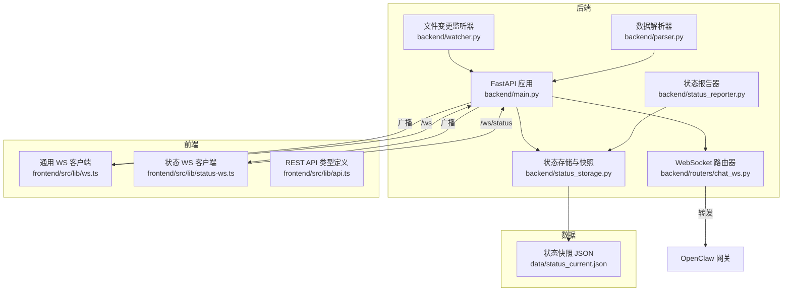
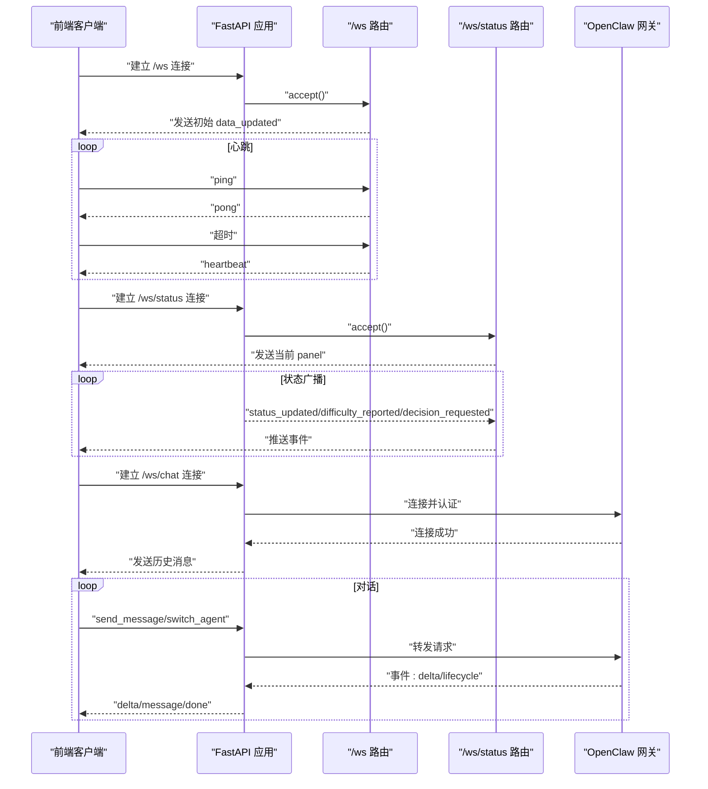
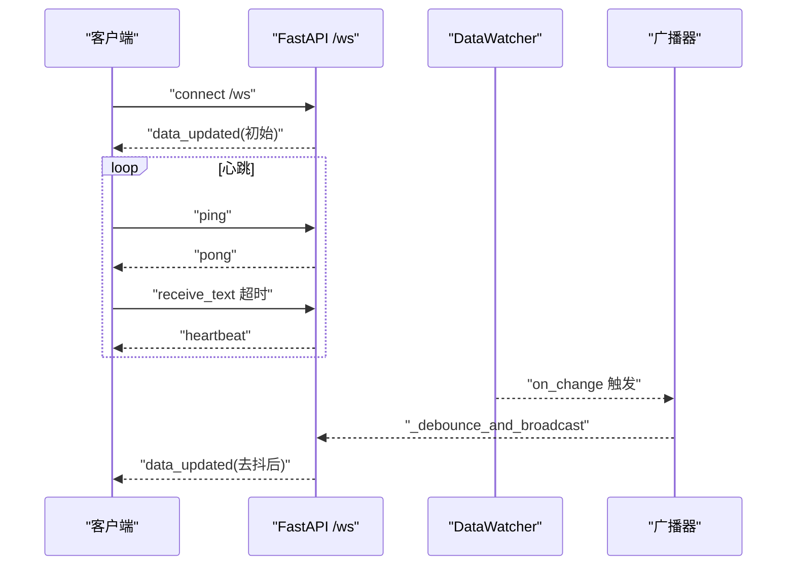
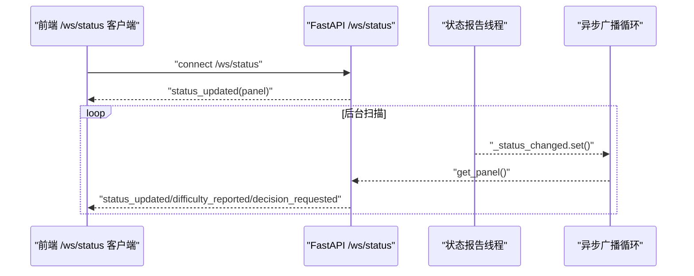
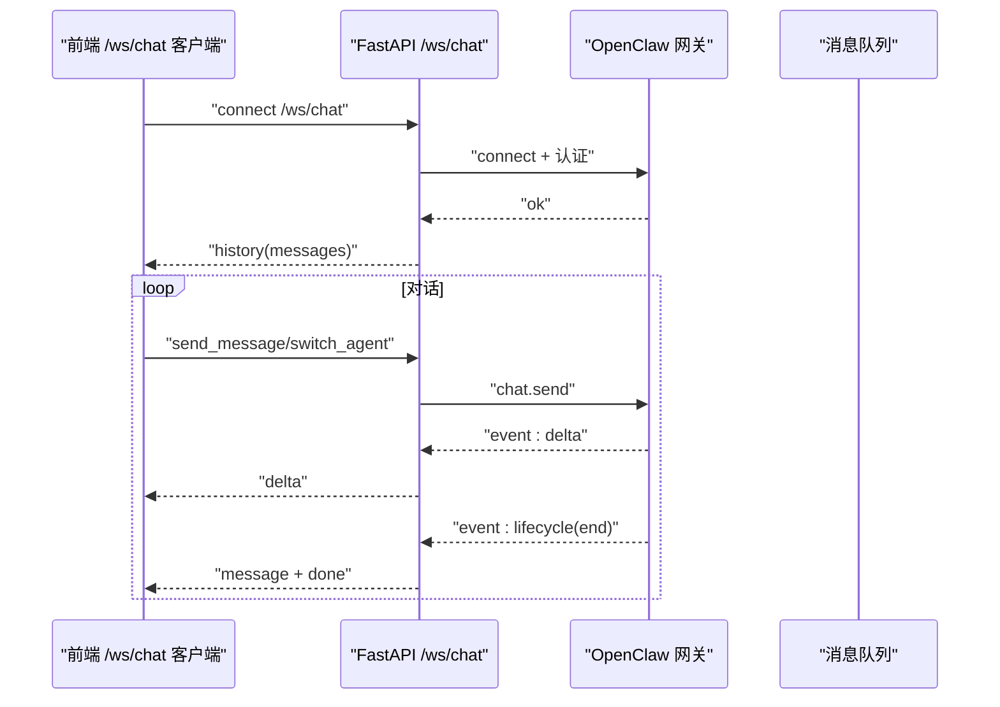
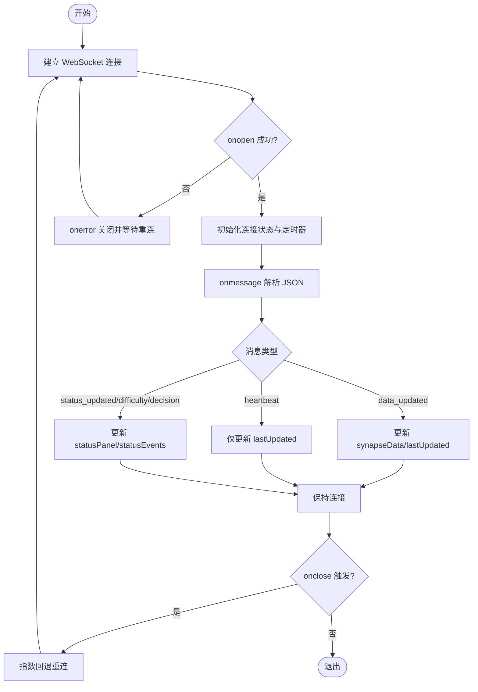
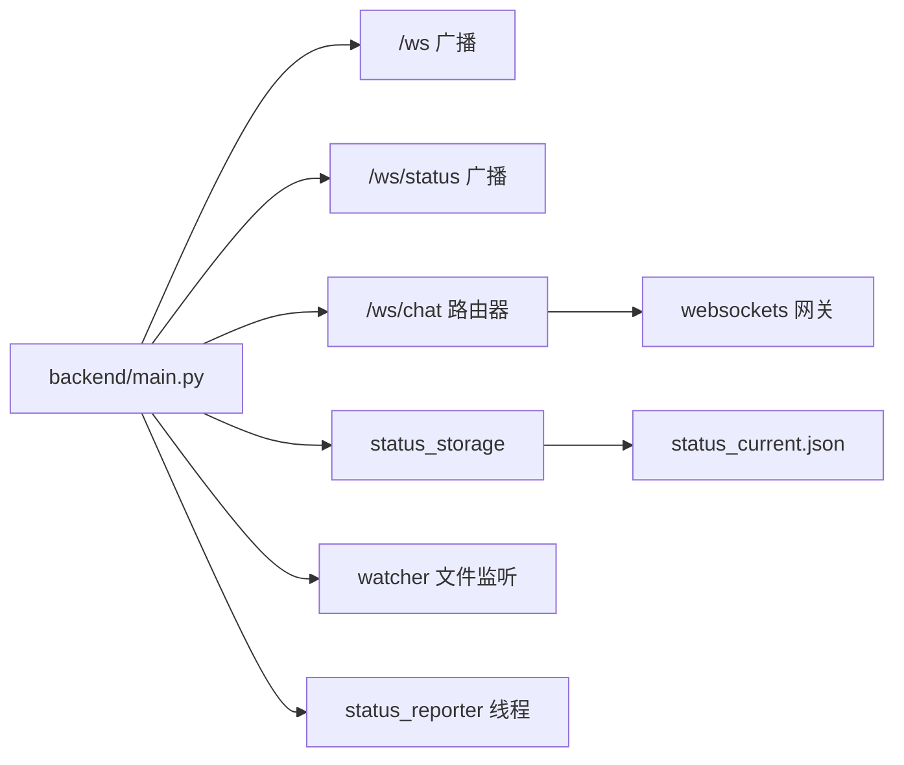

# WebSocket 通信

<cite>
**本文引用的文件**
- [backend/main.py](file://backend/main.py)
- [backend/routers/chat_ws.py](file://backend/routers/chat_ws.py)
- [backend/status_reporter.py](file://backend/status_reporter.py)
- [backend/status_storage.py](file://backend/status_storage.py)
- [backend/watcher.py](file://backend/watcher.py)
- [backend/parser.py](file://backend/parser.py)
- [frontend/src/lib/ws.ts](file://frontend/src/lib/ws.ts)
- [frontend/src/lib/status-ws.ts](file://frontend/src/lib/status-ws.ts)
- [frontend/src/lib/api.ts](file://frontend/src/lib/api.ts)
- [data/status_current.json](file://data/status_current.json)
- [run.sh](file://run.sh)
</cite>

## 目录
1. [简介](#简介)
2. [项目结构](#项目结构)
3. [核心组件](#核心组件)
4. [架构总览](#架构总览)
5. [详细组件分析](#详细组件分析)
6. [依赖关系分析](#依赖关系分析)
7. [性能与并发特性](#性能与并发特性)
8. [故障排查与监控](#故障排查与监控)
9. [结论](#结论)
10. [附录](#附录)

## 简介
本文件面向 SynapseOS 2.0 的 WebSocket 通信系统，系统性阐述实时通信协议、事件处理机制与连接管理策略。重点覆盖以下方面：
- 三类 WebSocket 通道：通用数据通道 /ws、状态通道 /ws/status、工作台聊天通道 /ws/chat 的功能与用途
- 客户端与服务端的实现细节、消息格式与事件类型
- 连接建立、心跳检测、错误处理与重连机制
- 流式响应处理、会话管理与并发连接的实现
- 调试工具与监控方法，以及性能优化建议

## 项目结构
后端采用 FastAPI 提供 REST API 与 WebSocket 服务；前端使用 Svelte Store 管理 WebSocket 连接与状态更新。数据层通过文件系统与定时扫描实现状态快照与历史记录持久化。

图表来源
- [backend/main.py:396-477](file://backend/main.py#L396-L477)
- [backend/routers/chat_ws.py:174-318](file://backend/routers/chat_ws.py#L174-L318)
- [backend/status_storage.py:102-127](file://backend/status_storage.py#L102-L127)
- [backend/status_reporter.py:258-266](file://backend/status_reporter.py#L258-L266)
- [backend/watcher.py:8-52](file://backend/watcher.py#L8-L52)
- [backend/parser.py:441-509](file://backend/parser.py#L441-509)
- [frontend/src/lib/ws.ts:19-84](file://frontend/src/lib/ws.ts#L19-L84)
- [frontend/src/lib/status-ws.ts:12-78](file://frontend/src/lib/status-ws.ts#L12-L78)
- [frontend/src/lib/api.ts:151-181](file://frontend/src/lib/api.ts#L151-L181)
- [data/status_current.json:1-59](file://data/status_current.json#L1-L59)

章节来源
- [backend/main.py:184-495](file://backend/main.py#L184-L495)
- [backend/routers/chat_ws.py:1-318](file://backend/routers/chat_ws.py#L1-L318)
- [backend/status_storage.py:1-236](file://backend/status_storage.py#L1-L236)
- [backend/status_reporter.py:1-274](file://backend/status_reporter.py#L1-L274)
- [backend/watcher.py:1-52](file://backend/watcher.py#L1-L52)
- [backend/parser.py:1-509](file://backend/parser.py#L1-L509)
- [frontend/src/lib/ws.ts:1-84](file://frontend/src/lib/ws.ts#L1-L84)
- [frontend/src/lib/status-ws.ts:1-78](file://frontend/src/lib/status-ws.ts#L1-L78)
- [frontend/src/lib/api.ts:1-181](file://frontend/src/lib/api.ts#L1-L181)
- [data/status_current.json:1-59](file://data/status_current.json#L1-L59)
- [run.sh:72-117](file://run.sh#L72-L117)

## 核心组件
- 通用数据通道 /ws：向连接的客户端推送“data_updated”事件，携带完整的 mission/tasks/blockers/decisions/team 数据；支持 ping/pong 与心跳检测。
- 状态通道 /ws/status：向连接的客户端推送“status_updated”“difficulty_reported”“decision_requested”等事件，携带 panel 与单条 report；支持 ping/pong 与心跳检测。
- 工作台聊天通道 /ws/chat：桥接本地 OpenClaw 网关，加载最近对话历史，转发用户消息，流式返回 assistant 的增量 delta，结束时汇总为完整 message 并发送 done。
- 文件变更监听与去抖：通过 DataWatcher 监听 data 目录变化，触发 debounce-and-broadcast，降低广播频率。
- 状态报告与存储：后台线程定期扫描任务文件生成状态快照，写入 status_current.json，并广播到 /ws/status 客户端。
- 前端 WebSocket 客户端：分别维护 /ws 与 /ws/status 的连接，实现指数回退重连、心跳更新时间戳、事件分发到 Svelte Store。

章节来源
- [backend/main.py:44-93](file://backend/main.py#L44-L93)
- [backend/main.py:68-84](file://backend/main.py#L68-L84)
- [backend/main.py:86-93](file://backend/main.py#L86-L93)
- [backend/main.py:105-117](file://backend/main.py#L105-L117)
- [backend/main.py:145-160](file://backend/main.py#L145-L160)
- [backend/main.py:396-477](file://backend/main.py#L396-L477)
- [backend/routers/chat_ws.py:174-318](file://backend/routers/chat_ws.py#L174-L318)
- [backend/watcher.py:8-52](file://backend/watcher.py#L8-L52)
- [backend/status_reporter.py:258-266](file://backend/status_reporter.py#L258-L266)
- [backend/status_storage.py:102-127](file://backend/status_storage.py#L102-L127)
- [frontend/src/lib/ws.ts:19-84](file://frontend/src/lib/ws.ts#L19-L84)
- [frontend/src/lib/status-ws.ts:12-78](file://frontend/src/lib/status-ws.ts#L12-L78)

## 架构总览
系统采用“后端事件驱动 + 前端订阅”的模式：
- 后端在应用生命周期内启动文件监听与状态报告线程，将变更与状态快照广播至对应 WebSocket 客户端。
- 前端通过独立的 WebSocket 客户端分别订阅通用数据与状态面板，接收事件并更新 UI。
- 工作台聊天通道作为网关桥接，负责与本地 OpenClaw 网关交互，实现消息转发与流式响应。

图表来源
- [backend/main.py:396-477](file://backend/main.py#L396-L477)
- [backend/routers/chat_ws.py:174-318](file://backend/routers/chat_ws.py#L174-L318)

## 详细组件分析

### 通用数据通道 /ws
- 连接建立：接受 WebSocket 连接后立即发送一次“data_updated”事件，包含 mission/tasks/blockers/decisions/team 的完整数据。
- 心跳与保活：客户端每 30 秒发送一次“ping”，服务端返回“pong”；若超时则发送“heartbeat”以维持连接活跃。
- 广播机制：当数据目录发生变化时，经去抖（300ms）后统一广播“data_updated”事件，避免频繁刷新。
- 断开清理：捕获 WebSocketDisconnect 与异常，清理连接列表并输出日志。

图表来源
- [backend/main.py:396-440](file://backend/main.py#L396-L440)
- [backend/main.py:61-93](file://backend/main.py#L61-L93)
- [backend/watcher.py:8-52](file://backend/watcher.py#L8-L52)

章节来源
- [backend/main.py:396-440](file://backend/main.py#L396-L440)
- [backend/main.py:61-93](file://backend/main.py#L61-L93)
- [backend/watcher.py:8-52](file://backend/watcher.py#L8-L52)

### 状态通道 /ws/status
- 连接建立：接受 WebSocket 连接后立即发送一次“status_updated”，payload 中包含 panel（agents 列表与 staleness 标记）。
- 事件类型：
  - “status_updated”：常规面板更新
  - “difficulty_reported”：某 agent 报告 difficulty
  - “decision_requested”：某 agent 请求决策
- 心跳与保活：与 /ws 相同，保持连接稳定。
- 广播机制：后台线程每 60 秒扫描任务文件生成状态快照，通过事件信号触发异步广播循环，周期性推送最新 panel。

图表来源
- [backend/main.py:442-477](file://backend/main.py#L442-L477)
- [backend/main.py:105-117](file://backend/main.py#L105-L117)
- [backend/main.py:145-160](file://backend/main.py#L145-L160)
- [backend/status_reporter.py:258-266](file://backend/status_reporter.py#L258-L266)
- [backend/status_storage.py:102-127](file://backend/status_storage.py#L102-L127)

章节来源
- [backend/main.py:442-477](file://backend/main.py#L442-L477)
- [backend/main.py:105-117](file://backend/main.py#L105-L117)
- [backend/main.py:145-160](file://backend/main.py#L145-L160)
- [backend/status_reporter.py:258-266](file://backend/status_reporter.py#L258-L266)
- [backend/status_storage.py:102-127](file://backend/status_storage.py#L102-L127)

### 工作台聊天通道 /ws/chat
- 连接与认证：连接本地 OpenClaw 网关，按协议发送 connect 请求并校验返回。
- 会话管理：根据 agent 映射维护 sessionKey，必要时创建会话；支持切换 agent 并重新加载历史。
- 历史加载：从会话 JSONL 转录文件中读取最近 N 条 user/assistant 消息，过滤无意义回复。
- 流式响应：
  - 监听网关事件，当 stream 为 assistant 时，增量 delta 通过“delta”事件推送给前端。
  - lifecycle 事件中当 phase=end 时，汇总缓冲区内容为“message”事件，并发送“done”。
- 错误处理：网关连接关闭或异常时，清理资源并关闭前端连接。

图表来源
- [backend/routers/chat_ws.py:174-318](file://backend/routers/chat_ws.py#L174-L318)
- [backend/routers/chat_ws.py:117-135](file://backend/routers/chat_ws.py#L117-L135)
- [backend/routers/chat_ws.py:187-200](file://backend/routers/chat_ws.py#L187-L200)

章节来源
- [backend/routers/chat_ws.py:174-318](file://backend/routers/chat_ws.py#L174-L318)
- [backend/routers/chat_ws.py:53-115](file://backend/routers/chat_ws.py#L53-L115)

### 前端 WebSocket 客户端
- 通用 WS 客户端（/ws）：
  - 自动计算 ws/wss 协议与主机地址，连接后设置连接状态与数据 Store。
  - 收到“data_updated”更新全局数据与时间戳；收到“heartbeat”仅更新时间戳。
  - 断线后指数回退重连，最大延迟上限控制。
- 状态 WS 客户端（/ws/status）：
  - 连接后接收“status_updated”“difficulty_reported”“decision_requested”，分别更新面板与事件 Store。
  - 断线后同样指数回退重连。

图表来源
- [frontend/src/lib/ws.ts:26-70](file://frontend/src/lib/ws.ts#L26-L70)
- [frontend/src/lib/status-ws.ts:18-64](file://frontend/src/lib/status-ws.ts#L18-L64)

章节来源
- [frontend/src/lib/ws.ts:19-84](file://frontend/src/lib/ws.ts#L19-L84)
- [frontend/src/lib/status-ws.ts:12-78](file://frontend/src/lib/status-ws.ts#L12-L78)

### 消息格式与事件类型
- 通用通道 /ws
  - 事件类型：“data_updated”“heartbeat”“pong”
  - payload 结构：包含完整业务数据与时间戳
- 状态通道 /ws/status
  - 事件类型：“status_updated”“difficulty_reported”“decision_requested”
  - payload 结构：包含 panel（agents 列表）与可选 report
- 工作台通道 /ws/chat
  - 事件类型：history、delta、message、done
  - payload 结构：history 包含 messages 与 agent；delta/message 包含 role/content/timestamp

章节来源
- [backend/main.py:89-93](file://backend/main.py#L89-L93)
- [backend/main.py:154-158](file://backend/main.py#L154-L158)
- [backend/routers/chat_ws.py:209-253](file://backend/routers/chat_ws.py#L209-L253)

## 依赖关系分析
- 组件耦合
  - /ws 与 /ws/status 共享 FastAPI 应用实例，分别维护独立的连接列表与广播逻辑。
  - /ws/chat 通过 websockets 库与本地网关交互，内部使用 asyncio Queue 与任务分离读取与处理。
  - 状态快照与历史由 status_storage 提供，status_reporter 负责生成与写入，二者通过线程与异步事件协同。
- 外部依赖
  - FastAPI、uvicorn、websockets、watchfiles、frontmatter 等库
- 潜在风险
  - 广播循环中未做连接健康检查，可能产生无效写入；建议在发送前检查连接状态。
  - /ws/chat 的网关读取任务在连接断开时需要更明确的错误传播与重连策略。

图表来源
- [backend/main.py:396-477](file://backend/main.py#L396-L477)
- [backend/routers/chat_ws.py:174-318](file://backend/routers/chat_ws.py#L174-L318)
- [backend/status_storage.py:102-127](file://backend/status_storage.py#L102-L127)
- [backend/watcher.py:8-52](file://backend/watcher.py#L8-L52)
- [backend/status_reporter.py:258-266](file://backend/status_reporter.py#L258-L266)

章节来源
- [backend/main.py:396-477](file://backend/main.py#L396-L477)
- [backend/routers/chat_ws.py:174-318](file://backend/routers/chat_ws.py#L174-L318)
- [backend/status_storage.py:102-127](file://backend/status_storage.py#L102-L127)
- [backend/watcher.py:8-52](file://backend/watcher.py#L8-L52)
- [backend/status_reporter.py:258-266](file://backend/status_reporter.py#L258-L266)

## 性能与并发特性
- 广播去抖：/ws 采用 300ms 去抖，合并短时间内多次变更，减少广播压力。
- 异步广播：/ws/status 使用事件信号与异步任务轮询，避免阻塞主线程。
- 并发连接：维护独立的连接列表，广播时遍历并尝试发送，异常连接在本轮清理。
- 流式处理：/ws/chat 使用 asyncio.Queue 与独立 reader 任务，避免阻塞主消息循环。
- I/O 优化：状态快照与历史以 JSON/JSONL 存储，读写简单高效；建议后续引入压缩或分页查询以降低内存占用。

章节来源
- [backend/main.py:31-36](file://backend/main.py#L31-L36)
- [backend/main.py:61-93](file://backend/main.py#L61-L93)
- [backend/main.py:145-160](file://backend/main.py#L145-L160)
- [backend/routers/chat_ws.py:187-200](file://backend/routers/chat_ws.py#L187-L200)

## 故障排查与监控
- 后端日志
  - /ws 连接与断开、异常堆栈打印；/ws/status 广播错误；/ws/chat 网关读取错误。
  - 建议：将日志输出到文件并配置轮转，便于定位问题。
- 前端调试
  - 控制台输出连接状态、重连延时与解析错误；可在 onerror 中触发 UI 提示。
- 监控指标
  - 连接数：维护 connected_clients 与 status_clients 数量
  - 响应时间：记录去抖前后的时间差与广播耗时
  - 状态面板 staleness：基于 last_report_at 与阈值判断
- 建议
  - 添加连接存活探测（ping/pong）失败次数统计与自动断开
  - 对广播失败的连接进行延迟清理，避免阻塞后续广播
  - 对 /ws/chat 增加重连与重试策略，确保网关异常时的可用性

章节来源
- [backend/main.py:432-439](file://backend/main.py#L432-L439)
- [backend/main.py:471-476](file://backend/main.py#L471-L476)
- [backend/routers/chat_ws.py:197-200](file://backend/routers/chat_ws.py#L197-L200)
- [backend/status_storage.py:102-127](file://backend/status_storage.py#L102-L127)

## 结论
SynapseOS 2.0 的 WebSocket 通信系统通过清晰的通道划分与事件模型，实现了通用数据、状态面板与工作台聊天的实时联动。系统在连接管理、心跳保活、去抖广播与流式响应方面具备良好实现，同时通过前端 Store 与后端广播解耦，提升了可维护性与扩展性。建议进一步完善错误处理与监控指标，以提升生产环境的稳定性与可观测性。

## 附录
- 启动与运行
  - 使用 run.sh 脚本一键启动后端与前端，查看日志与状态
- 数据样例
  - status_current.json 展示了 agents 的当前状态与 staleness 标记

章节来源
- [run.sh:72-117](file://run.sh#L72-L117)
- [data/status_current.json:1-59](file://data/status_current.json#L1-L59)