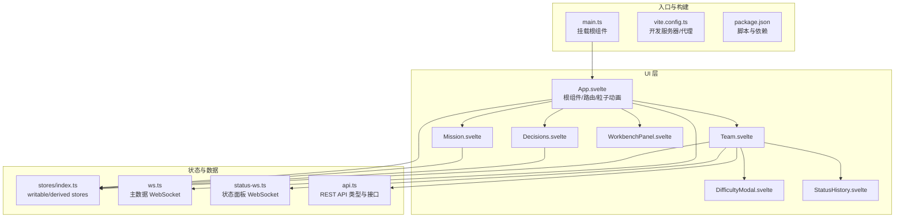
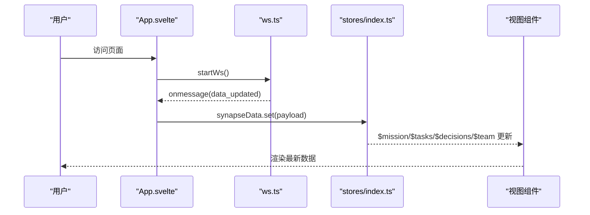
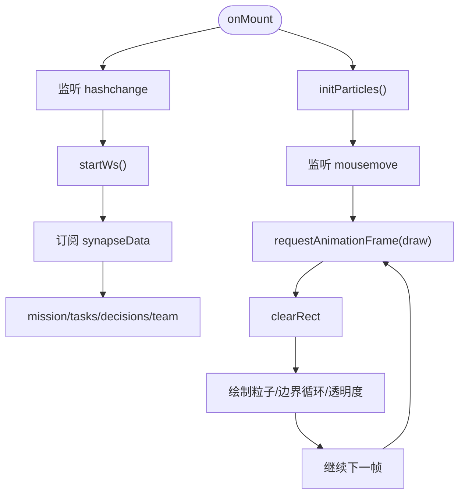
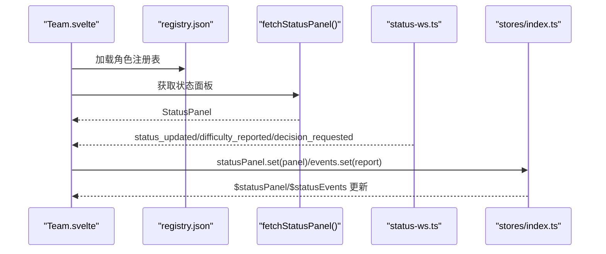
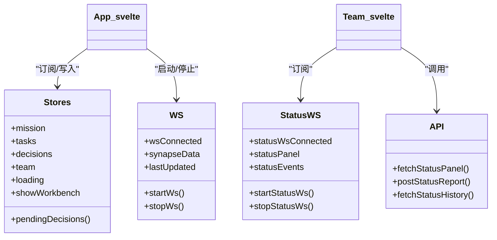
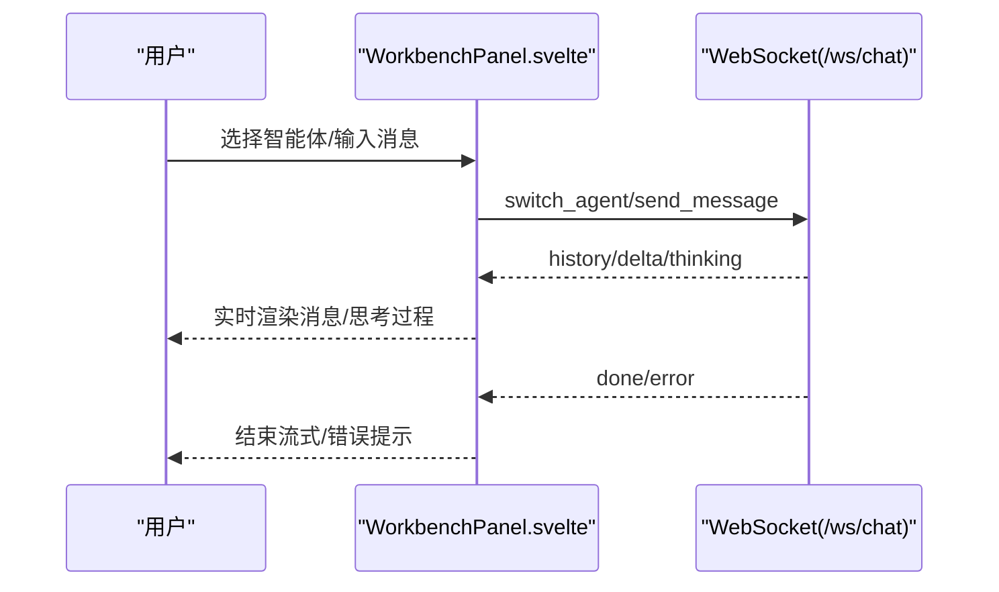
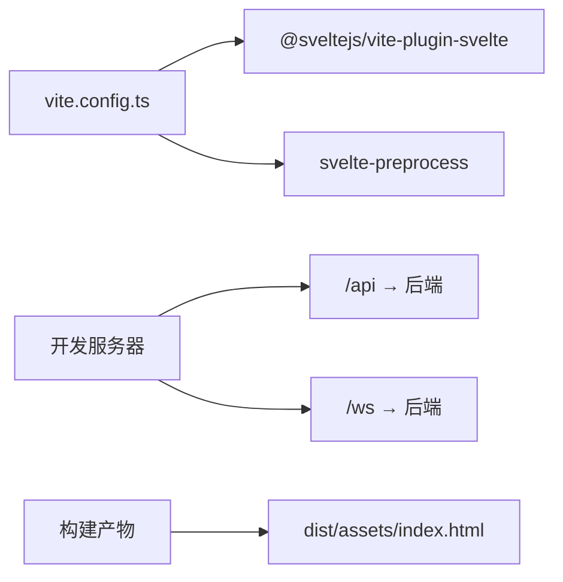

# Svelte 应用架构

<cite>
**本文引用的文件**
- [frontend/src/App.svelte](file://frontend/src/App.svelte)
- [frontend/src/main.ts](file://frontend/src/main.ts)
- [frontend/src/app.css](file://frontend/src/app.css)
- [frontend/src/lib/stores/index.ts](file://frontend/src/lib/stores/index.ts)
- [frontend/src/lib/ws.ts](file://frontend/src/lib/ws.ts)
- [frontend/src/lib/status-ws.ts](file://frontend/src/lib/status-ws.ts)
- [frontend/src/lib/api.ts](file://frontend/src/lib/api.ts)
- [frontend/src/views/Mission.svelte](file://frontend/src/views/Mission.svelte)
- [frontend/src/views/Decisions.svelte](file://frontend/src/views/Decisions.svelte)
- [frontend/src/views/Team.svelte](file://frontend/src/views/Team.svelte)
- [frontend/src/views/WorkbenchPanel.svelte](file://frontend/src/views/WorkbenchPanel.svelte)
- [frontend/src/views/DifficultyModal.svelte](file://frontend/src/views/DifficultyModal.svelte)
- [frontend/src/views/StatusHistory.svelte](file://frontend/src/views/StatusHistory.svelte)
- [frontend/package.json](file://frontend/package.json)
- [frontend/vite.config.ts](file://frontend/vite.config.ts)
</cite>

## 目录
1. [简介](#简介)
2. [项目结构](#项目结构)
3. [核心组件](#核心组件)
4. [架构总览](#架构总览)
5. [详细组件分析](#详细组件分析)
6. [依赖关系分析](#依赖关系分析)
7. [性能考量](#性能考量)
8. [故障排查指南](#故障排查指南)
9. [结论](#结论)
10. [附录](#附录)

## 简介
本文件面向 SynapseOS 2.0 的前端 Svelte 应用，系统性梳理其架构设计、组件层次、MVVM 模式实现、路由机制、生命周期管理、响应式数据绑定、状态管理与组件通信、粒子动画系统、Canvas 渲染优化与性能考虑，并提供扩展与维护建议。目标读者既包括前端工程师，也包括对技术细节感兴趣的非专业读者。

## 项目结构
前端采用 Vite + Svelte 技术栈，使用 TailwindCSS 提供样式基础，构建时通过预处理器进行编译。应用以 App.svelte 为根组件，通过 hash-based 路由在 Mission、Decisions、Team 之间切换；同时集成 WebSocket 实时数据流与粒子动画背景。

**图表来源**
- [frontend/src/main.ts:1-9](file://frontend/src/main.ts#L1-L9)
- [frontend/src/App.svelte:1-290](file://frontend/src/App.svelte#L1-L290)
- [frontend/src/lib/stores/index.ts:1-46](file://frontend/src/lib/stores/index.ts#L1-L46)
- [frontend/src/lib/ws.ts:1-84](file://frontend/src/lib/ws.ts#L1-L84)
- [frontend/src/lib/status-ws.ts:1-78](file://frontend/src/lib/status-ws.ts#L1-L78)
- [frontend/src/lib/api.ts:1-181](file://frontend/src/lib/api.ts#L1-L181)
- [frontend/src/views/Mission.svelte:1-239](file://frontend/src/views/Mission.svelte#L1-L239)
- [frontend/src/views/Decisions.svelte:1-142](file://frontend/src/views/Decisions.svelte#L1-L142)
- [frontend/src/views/Team.svelte:1-507](file://frontend/src/views/Team.svelte#L1-L507)
- [frontend/src/views/WorkbenchPanel.svelte:1-365](file://frontend/src/views/WorkbenchPanel.svelte#L1-L365)
- [frontend/src/views/DifficultyModal.svelte:1-175](file://frontend/src/views/DifficultyModal.svelte#L1-L175)
- [frontend/src/views/StatusHistory.svelte:1-191](file://frontend/src/views/StatusHistory.svelte#L1-L191)
- [frontend/vite.config.ts:1-23](file://frontend/vite.config.ts#L1-L23)
- [frontend/package.json:1-24](file://frontend/package.json#L1-L24)

**章节来源**
- [frontend/src/main.ts:1-9](file://frontend/src/main.ts#L1-L9)
- [frontend/vite.config.ts:1-23](file://frontend/vite.config.ts#L1-L23)
- [frontend/package.json:1-24](file://frontend/package.json#L1-L24)

## 核心组件
- 根组件 App.svelte：负责 hash 路由、粒子动画、全局导航、WebSocket 数据订阅、工作台面板触发与时间戳格式化。
- 视图组件：
  - Mission：使命概览、任务统计、里程碑与任务列表。
  - Decisions：待决策事项的排序与汇总。
  - Team：团队角色总览、在线状态、困难与决策标记、历史与难度上报弹窗。
- 状态与数据：
  - stores：集中管理 mission、tasks、blockers、decisions、team、loading、showWorkbench 等可观察状态与派生状态。
  - ws：主数据 WebSocket，接收 data_updated/heartbeat 并写入 synapseData。
  - status-ws：状态面板 WebSocket，接收 status_updated/difficulty_reported/decision_requested。
  - api：REST 接口类型与 fetch 方法封装。

**章节来源**
- [frontend/src/App.svelte:1-290](file://frontend/src/App.svelte#L1-L290)
- [frontend/src/views/Mission.svelte:1-239](file://frontend/src/views/Mission.svelte#L1-L239)
- [frontend/src/views/Decisions.svelte:1-142](file://frontend/src/views/Decisions.svelte#L1-L142)
- [frontend/src/views/Team.svelte:1-507](file://frontend/src/views/Team.svelte#L1-L507)
- [frontend/src/lib/stores/index.ts:1-46](file://frontend/src/lib/stores/index.ts#L1-L46)
- [frontend/src/lib/ws.ts:1-84](file://frontend/src/lib/ws.ts#L1-L84)
- [frontend/src/lib/status-ws.ts:1-78](file://frontend/src/lib/status-ws.ts#L1-L78)
- [frontend/src/lib/api.ts:1-181](file://frontend/src/lib/api.ts#L1-L181)

## 架构总览
应用采用 MVVM 模式：
- Model：由 stores 与 WebSocket 提供的数据模型（mission、tasks、decisions、team 等），以及 API 返回的类型定义。
- View：Svelte 组件树，基于响应式表达式与 store 订阅自动渲染。
- ViewModel：store 的派生状态与组件内部的响应式计算，如 Mission 中的任务状态统计、Decisions 中的排序逻辑。

路由机制：
- 使用 hash-based 路由，根据 location.hash 切换当前 tab，支持“使命”“待决策”“团队”三个视图。
- 导航链接与激活态通过 isActive 辅助函数判断。

组件通信：
- App.svelte 订阅 synapseData，将数据分发至 mission、tasks、decisions、team 等 store，各子组件通过 $store 读取。
- Team 与状态面板独立的 status-ws，用于实时更新团队状态。
- WorkbenchPanel 与 Chat WebSocket 交互，实现多智能体对话与流式输出。

**图表来源**
- [frontend/src/App.svelte:119-141](file://frontend/src/App.svelte#L119-L141)
- [frontend/src/lib/ws.ts:43-55](file://frontend/src/lib/ws.ts#L43-L55)
- [frontend/src/lib/stores/index.ts:6-12](file://frontend/src/lib/stores/index.ts#L6-L12)

**章节来源**
- [frontend/src/App.svelte:11-31](file://frontend/src/App.svelte#L11-L31)
- [frontend/src/lib/ws.ts:26-70](file://frontend/src/lib/ws.ts#L26-L70)
- [frontend/src/lib/stores/index.ts:1-46](file://frontend/src/lib/stores/index.ts#L1-L46)

## 详细组件分析

### 根组件 App.svelte
职责与特性：
- hash 路由：解析 location.hash，映射到 mission/decisions/team；提供 isActive 判断当前导航激活态。
- 生命周期：onMount 订阅 hashchange、启动 WebSocket、初始化粒子动画；onDestroy 清理事件、停止 WebSocket、取消动画帧与 ResizeObserver。
- 粒子动画：Canvas 初始化、鼠标交互、边界循环、requestAnimationFrame 循环绘制；窗口尺寸变化时重设画布。
- 全局导航：顶部导航栏，触发工作台面板；显示 WebSocket 连接状态与最后更新时间。
- 数据绑定：订阅 synapseData，将 payload 写入对应 store，驱动视图更新。

**图表来源**
- [frontend/src/App.svelte:119-141](file://frontend/src/App.svelte#L119-L141)
- [frontend/src/App.svelte:36-117](file://frontend/src/App.svelte#L36-L117)
- [frontend/src/lib/ws.ts:43-55](file://frontend/src/lib/ws.ts#L43-L55)

**章节来源**
- [frontend/src/App.svelte:1-290](file://frontend/src/App.svelte#L1-L290)

### 视图组件：Mission
- 响应式计算：统计任务状态分布与完成率；根据任务优先级与状态生成徽章与进度环。
- 渲染结构：使命卡片、统计面板、里程碑列表、任务列表；加载态占位。
- 与 store 的绑定：$mission、$tasks、$loading。

**章节来源**
- [frontend/src/views/Mission.svelte:1-239](file://frontend/src/views/Mission.svelte#L1-L239)
- [frontend/src/lib/stores/index.ts:6-12](file://frontend/src/lib/stores/index.ts#L6-L12)

### 视图组件：Decisions
- 响应式计算：按“待决策优先、再按优先级”排序；统计待决策与已决策数量。
- 渲染结构：标题、摘要卡片、决策列表、空态提示。
- 与 store 的绑定：$decisions、$loading。

**章节来源**
- [frontend/src/views/Decisions.svelte:1-142](file://frontend/src/views/Decisions.svelte#L1-L142)
- [frontend/src/lib/stores/index.ts:9, 32-34:32-34](file://frontend/src/lib/stores/index.ts#L9-L9;file://frontend/src/lib/stores/index.ts#L32-L34)

### 视图组件：Team
- 复杂数据整合：合并 registry 与 status panel，按 agent_id 与名称模糊匹配，生成角色卡片。
- 域与角色分组：按基础设施、在线/离线业务、增长、市场域组织；支持折叠/展开。
- 实时状态：status-ws 推送的 panel 与事件；定时刷新 registry 与面板。
- 交互：打开历史侧边栏、打开难度弹窗、刷新按钮。

**图表来源**
- [frontend/src/views/Team.svelte:48-73](file://frontend/src/views/Team.svelte#L48-L73)
- [frontend/src/views/Team.svelte:244-253](file://frontend/src/views/Team.svelte#L244-L253)
- [frontend/src/lib/status-ws.ts:35-49](file://frontend/src/lib/status-ws.ts#L35-L49)
- [frontend/src/lib/api.ts:151-154](file://frontend/src/lib/api.ts#L151-L154)

**章节来源**
- [frontend/src/views/Team.svelte:1-507](file://frontend/src/views/Team.svelte#L1-L507)
- [frontend/src/lib/status-ws.ts:1-78](file://frontend/src/lib/status-ws.ts#L1-L78)
- [frontend/src/lib/api.ts:100-181](file://frontend/src/lib/api.ts#L100-L181)

### 状态与数据层
- stores：mission、tasks、blockers、decisions、team、loading、error、statusPanel、statusHistory、showWorkbench 等；派生状态如 completedTasks/pendingTasks/openBlockers/pendingDecisions/agentsWithDifficulties 等。
- ws：连接 /ws，处理 data_updated/heartbeat，维护重连策略，暴露 startWs/stopWs。
- status-ws：连接 /ws/status，处理 status_updated/difficulty_reported/decision_requested，维护重连策略，暴露 startStatusWs/stopStatusWs。
- api：定义 Mission/Task/Blocker/Decision/TeamMember/StatusReport/AgentStatus/StatusPanel 等接口；提供 fetchMission/fetchTasks/fetchBlockers/fetchDecisions/fetchTeam/fetchStatusPanel/postStatusReport/fetchStatusHistory。

**图表来源**
- [frontend/src/lib/stores/index.ts:1-46](file://frontend/src/lib/stores/index.ts#L1-L46)
- [frontend/src/lib/ws.ts:1-84](file://frontend/src/lib/ws.ts#L1-L84)
- [frontend/src/lib/status-ws.ts:1-78](file://frontend/src/lib/status-ws.ts#L1-L78)
- [frontend/src/lib/api.ts:100-181](file://frontend/src/lib/api.ts#L100-L181)

**章节来源**
- [frontend/src/lib/stores/index.ts:1-46](file://frontend/src/lib/stores/index.ts#L1-L46)
- [frontend/src/lib/ws.ts:1-84](file://frontend/src/lib/ws.ts#L1-L84)
- [frontend/src/lib/status-ws.ts:1-78](file://frontend/src/lib/status-ws.ts#L1-L78)
- [frontend/src/lib/api.ts:1-181](file://frontend/src/lib/api.ts#L1-L181)

### 工作台面板与聊天系统
- WorkbenchPanel：多智能体（果爸、苏珊、里德）对话界面，支持消息历史、流式 delta 输出、思考过程展示、排队与智能滚动。
- 通信流程：连接 /ws/chat，发送 switch_agent/send_message，接收 history/delta/thinking/done/error，维护 agentState 与队列。

**图表来源**
- [frontend/src/views/WorkbenchPanel.svelte:82-145](file://frontend/src/views/WorkbenchPanel.svelte#L82-L145)
- [frontend/src/views/WorkbenchPanel.svelte:148-209](file://frontend/src/views/WorkbenchPanel.svelte#L148-L209)

**章节来源**
- [frontend/src/views/WorkbenchPanel.svelte:1-365](file://frontend/src/views/WorkbenchPanel.svelte#L1-L365)

### 难度上报与历史侧边栏
- DifficultyModal：选择困难类型与严重程度，填写任务关联与解决建议，提交到 /api/status/report。
- StatusHistory：筛选 agent/type，分页加载历史记录，展示类型图标与时间戳。

**章节来源**
- [frontend/src/views/DifficultyModal.svelte:1-175](file://frontend/src/views/DifficultyModal.svelte#L1-L175)
- [frontend/src/views/StatusHistory.svelte:1-191](file://frontend/src/views/StatusHistory.svelte#L1-L191)
- [frontend/src/lib/api.ts:156-180](file://frontend/src/lib/api.ts#L156-L180)

## 依赖关系分析
- 构建与运行：Vite 插件与预处理，开发服务器代理到后端；生产环境同源 WebSocket。
- 依赖：Svelte 4、TailwindCSS、autoprefixer、postcss、ws（测试/工具）、svelte-routing（路由库）。
- 代理配置：/api → 后端 HTTP，/ws → 后端 WebSocket。

**图表来源**
- [frontend/vite.config.ts:1-23](file://frontend/vite.config.ts#L1-L23)
- [frontend/package.json:11-22](file://frontend/package.json#L11-L22)

**章节来源**
- [frontend/vite.config.ts:1-23](file://frontend/vite.config.ts#L1-L23)
- [frontend/package.json:1-24](file://frontend/package.json#L1-L24)

## 性能考量
- 响应式计算与派生状态：
  - Mission 中的任务状态统计与进度计算为局部响应式，避免全局重绘。
  - Team 中的 reportedMap/allCards/domainGroups 等为惰性计算，减少不必要的数组操作。
- WebSocket 重连与节流：
  - ws 与 status-ws 均实现指数退避重连，断线自动恢复。
  - App.svelte 订阅 synapseData 后统一 set 到多个 store，避免重复解析。
- Canvas 动画优化：
  - 使用 requestAnimationFrame 控制帧率；仅在可见区域绘制；ResizeObserver 监听容器尺寸变化，避免全量重算。
  - 粒子边界循环与轻微阻尼，保证视觉流畅与 CPU 友好。
- DOM 与渲染：
  - 使用 TailwindCSS 的原子类，减少自定义样式开销。
  - 列表渲染使用 key（如按 roleKey）提升 diff 效率。
- 网络请求：
  - Team 定时刷新与 registry 回退策略，降低单次失败影响。
  - StatusHistory 分页加载，控制单次传输大小。

[本节为通用性能指导，不直接分析具体文件，故无章节来源]

## 故障排查指南
- WebSocket 连接异常：
  - 检查 ws/status-ws 的 onclose/onerror 日志，确认代理是否正确转发到后端。
  - 确认协议（http/https）与 host 是否一致，避免跨域与 wss/ws 不匹配。
- 数据不同步：
  - 确认 synapseData 的 data_updated 是否到达；检查 App.svelte 的订阅与 set 逻辑。
  - Team 的 status-panel 未更新时，检查 status-ws 的连接与消息类型。
- 粒子动画卡顿：
  - 检查 requestAnimationFrame 是否被频繁中断；确认画布尺寸变化是否导致过度重绘。
- 聊天面板无响应：
  - 确认 /ws/chat 是否可达；检查消息类型（history/delta/thinking/done/error）是否正确处理。
- 样式与主题：
  - 检查 app.css 中变量与 Tailwind 配置；确认 glass-card、neon 等类是否生效。

**章节来源**
- [frontend/src/lib/ws.ts:57-70](file://frontend/src/lib/ws.ts#L57-L70)
- [frontend/src/lib/status-ws.ts:51-64](file://frontend/src/lib/status-ws.ts#L51-L64)
- [frontend/src/App.svelte:119-141](file://frontend/src/App.svelte#L119-L141)
- [frontend/src/views/WorkbenchPanel.svelte:82-145](file://frontend/src/views/WorkbenchPanel.svelte#L82-L145)
- [frontend/src/app.css:1-165](file://frontend/src/app.css#L1-L165)

## 结论
该 Svelte 应用以 App.svelte 为核心，结合 hash 路由、WebSocket 实时数据与 Canvas 粒子动画，形成清晰的 MVVM 架构。通过集中式 store 与派生状态实现高效响应式渲染，配合独立的状态面板与聊天 WebSocket，满足多场景协作与可视化需求。建议在扩展时遵循现有模式：统一数据入口、最小化订阅范围、合理使用派生状态与防抖/节流策略，并持续关注 Canvas 与 WebSocket 的性能表现。

[本节为总结性内容，不直接分析具体文件，故无章节来源]

## 附录
- 扩展建议：
  - 新增视图：在 App.svelte 的路由表中添加新路径，新建对应 Svelte 组件并在 stores 中新增必要 store。
  - 新增 WebSocket：参考 ws.ts/status-ws.ts 的模式，新增连接、消息处理与重连逻辑，并在 App.svelte 或对应组件中订阅。
  - 新增 API：在 api.ts 中声明接口与方法，组件中通过 $store 与 fetch 结合使用。
  - 性能优化：对长列表使用虚拟滚动；对高频计算使用 memoization；对 Canvas 使用更精细的脏矩形更新。
- 维护要点：
  - 保持 store 的单一职责，避免跨模块耦合。
  - 对外暴露的 API 与 WebSocket 接口需明确版本与兼容策略。
  - 为关键流程补充单元测试与 E2E 场景（如聊天面板、Team 列表渲染）。

[本节为通用建议，不直接分析具体文件，故无章节来源]