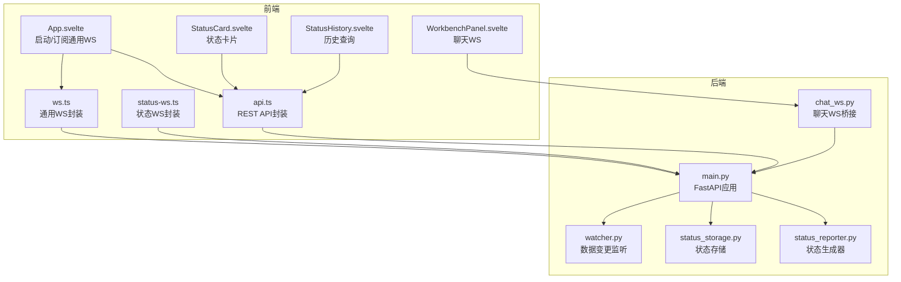
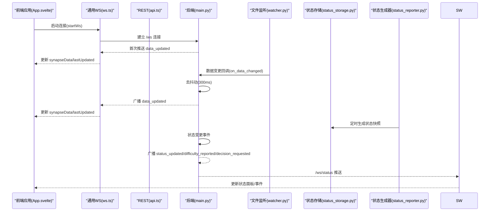
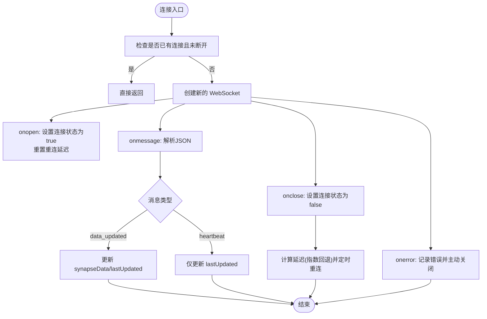
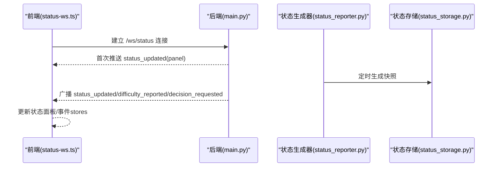
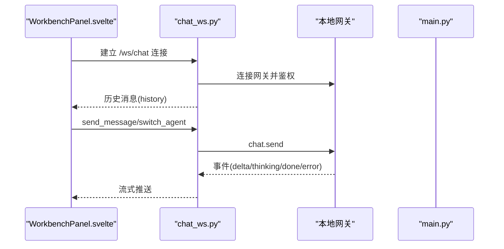
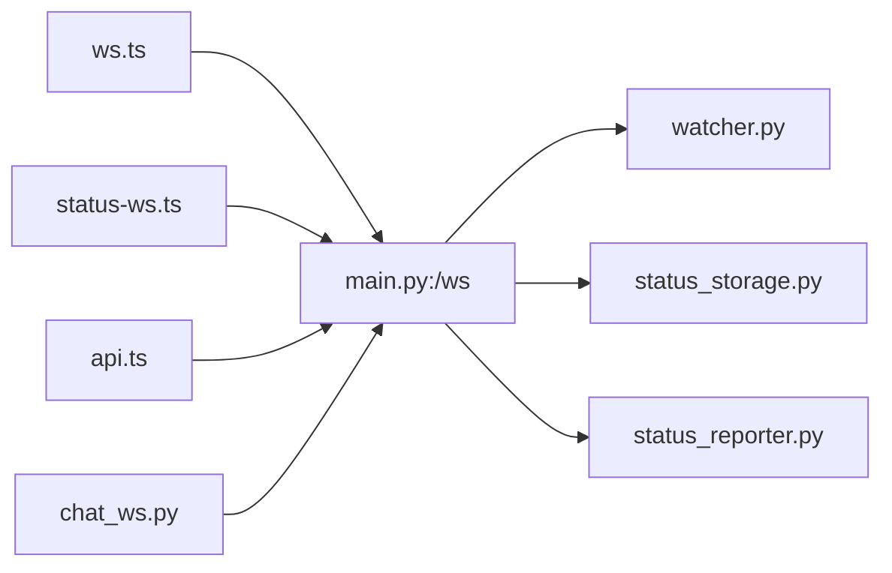

# WebSocket 通信集成

<cite>
**本文引用的文件**
- [ws.ts](file://frontend/src/lib/ws.ts)
- [status-ws.ts](file://frontend/src/lib/status-ws.ts)
- [api.ts](file://frontend/src/lib/api.ts)
- [chat_ws.py](file://backend/routers/chat_ws.py)
- [main.py](file://backend/main.py)
- [watcher.py](file://backend/watcher.py)
- [status_storage.py](file://backend/status_storage.py)
- [status_reporter.py](file://backend/status_reporter.py)
- [App.svelte](file://frontend/src/App.svelte)
- [WorkbenchPanel.svelte](file://frontend/src/views/WorkbenchPanel.svelte)
- [StatusCard.svelte](file://frontend/src/views/StatusCard.svelte)
- [StatusHistory.svelte](file://frontend/src/views/StatusHistory.svelte)
</cite>

## 目录
1. [简介](#简介)
2. [项目结构](#项目结构)
3. [核心组件](#核心组件)
4. [架构总览](#架构总览)
5. [详细组件分析](#详细组件分析)
6. [依赖分析](#依赖分析)
7. [性能考虑](#性能考虑)
8. [故障排除指南](#故障排除指南)
9. [结论](#结论)
10. [附录](#附录)

## 简介
本文件系统性梳理 SynapseOS 2.0 的 WebSocket 通信集成，覆盖实时数据同步、状态更新通知与用户交互响应三大场景。重点包括：
- 通用 WebSocket 通信（前端 ws.ts 与后端 /ws）
- 状态更新 WebSocket（前端 status-ws.ts 与后端 /ws/status）
- REST API 集成（前端 api.ts 与后端 REST 端点）
- 连接管理、消息格式、错误处理与重连机制
- 实时数据同步、状态面板更新、聊天对话流式传输
- 调试方法、性能监控与故障排除

## 项目结构
前端通过 Svelte 应用启动 WebSocket 连接，并订阅实时数据；后端基于 FastAPI 提供 WebSocket 与 REST API，结合文件监听与状态生成器实现数据驱动的实时推送。



图表来源
- [App.svelte:119-141](file://frontend/src/App.svelte#L119-L141)
- [WorkbenchPanel.svelte:205-213](file://frontend/src/views/WorkbenchPanel.svelte#L205-L213)
- [ws.ts:72-83](file://frontend/src/lib/ws.ts#L72-L83)
- [status-ws.ts:66-77](file://frontend/src/lib/status-ws.ts#L66-L77)
- [api.ts:75-180](file://frontend/src/lib/api.ts#L75-L180)
- [main.py:396-477](file://backend/main.py#L396-L477)
- [chat_ws.py:206-385](file://backend/routers/chat_ws.py#L206-L385)
- [watcher.py:8-51](file://backend/watcher.py#L8-L51)
- [status_storage.py:102-126](file://backend/status_storage.py#L102-L126)
- [status_reporter.py:258-266](file://backend/status_reporter.py#L258-L266)

章节来源
- [App.svelte:119-141](file://frontend/src/App.svelte#L119-L141)
- [main.py:396-477](file://backend/main.py#L396-L477)

## 核心组件
- 通用 WebSocket（/ws）
  - 前端：ws.ts 提供连接、消息解析、心跳与重连逻辑，向 Svelte stores 写入实时数据。
  - 后端：/ws 接收客户端连接，首次推送全量数据，随后周期性发送心跳，支持 ping/pong。
- 状态更新 WebSocket（/ws/status）
  - 前端：status-ws.ts 提供独立连接，接收状态面板与事件更新，分别写入 stores。
  - 后端：/ws/status 接收连接，首次推送当前面板，周期性心跳，支持 ping/pong。
- REST API
  - 前端：api.ts 封装 /api/* 请求，包括任务、决策、团队、状态面板与历史。
  - 后端：/api/mission、/api/tasks、/api/blockers、/api/decisions、/api/team、/api/status/* 等端点。

章节来源
- [ws.ts:1-84](file://frontend/src/lib/ws.ts#L1-L84)
- [status-ws.ts:1-78](file://frontend/src/lib/status-ws.ts#L1-L78)
- [api.ts:1-181](file://frontend/src/lib/api.ts#L1-L181)
- [main.py:396-477](file://backend/main.py#L396-L477)

## 架构总览
后端通过 DataWatcher 监听数据目录变化，触发去抖动广播；状态生成器定时扫描任务文件，生成状态快照并通过 /ws/status 广播。前端通过 ws.ts 与 status-ws.ts 订阅两类实时通道，配合 api.ts 的 REST 接口实现完整的实时协作体验。



图表来源
- [App.svelte:119-141](file://frontend/src/App.svelte#L119-L141)
- [ws.ts:26-83](file://frontend/src/lib/ws.ts#L26-L83)
- [status-ws.ts:18-77](file://frontend/src/lib/status-ws.ts#L18-L77)
- [main.py:61-94](file://backend/main.py#L61-L94)
- [watcher.py:21-34](file://backend/watcher.py#L21-L34)
- [status_storage.py:102-126](file://backend/status_storage.py#L102-L126)
- [status_reporter.py:258-266](file://backend/status_reporter.py#L258-L266)

## 详细组件分析

### 通用 WebSocket 通信（ws.ts）
- 连接建立
  - 自动根据协议选择 ws/wss，目标路径 /ws。
  - 防止重复连接，连接成功后清除重连计时器。
- 消息处理
  - data_updated：更新 synapseData 与 lastUpdated。
  - heartbeat：刷新 lastUpdated。
- 错误与重连
  - onclose/onerror 触发指数回退重连，上限 10 秒。
  - stopWs 主动关闭并清理。
- 与前端集成
  - App.svelte 在 onMount 启动 startWs，在 onDestroy 停止 stopWs。
  - 订阅 synapseData 将数据分发到 mission/tasks/decisions/team stores。



图表来源
- [ws.ts:26-83](file://frontend/src/lib/ws.ts#L26-L83)
- [App.svelte:119-141](file://frontend/src/App.svelte#L119-L141)

章节来源
- [ws.ts:1-84](file://frontend/src/lib/ws.ts#L1-L84)
- [App.svelte:119-141](file://frontend/src/App.svelte#L119-L141)

### 状态更新 WebSocket（status-ws.ts）
- 连接建立
  - 目标路径 /ws/status，独立于通用 WS。
- 消息处理
  - status_updated：更新状态面板。
  - difficulty_reported/decision_requested：更新状态事件。
- 错误与重连
  - 与通用 WS 类似，指数回退重连至上限 10 秒。
- 与前端集成
  - StatusCard.svelte 与 StatusHistory.svelte 读取 stores 并渲染。



图表来源
- [status-ws.ts:18-77](file://frontend/src/lib/status-ws.ts#L18-L77)
- [main.py:442-477](file://backend/main.py#L442-L477)
- [status_reporter.py:258-266](file://backend/status_reporter.py#L258-L266)
- [status_storage.py:102-126](file://backend/status_storage.py#L102-L126)

章节来源
- [status-ws.ts:1-78](file://frontend/src/lib/status-ws.ts#L1-L78)
- [StatusCard.svelte:1-170](file://frontend/src/views/StatusCard.svelte#L1-L170)
- [StatusHistory.svelte:1-191](file://frontend/src/views/StatusHistory.svelte#L1-L191)

### REST API 集成（api.ts）
- 通用数据接口
  - /api/mission、/api/tasks、/api/blockers、/api/decisions、/api/team
- 状态接口
  - /api/status/panel、/api/status/history、/api/status/report、/api/status/{agent_id}
  - 支持按 agent_id/type/task_id/from_time/to_time/page/limit 过滤历史。
- 与后端对应
  - 后端 main.py 提供对应端点，部分端点会触发 /ws 或 /ws/status 的广播。

```mermaid
classDiagram
class ApiTs {
+fetchMission() Promise<Mission>
+fetchTasks() Promise<Task[]>
+fetchBlockers() Promise<Blocker[]>
+fetchDecisions() Promise<Decision[]>
+fetchTeam() Promise<TeamMember[]>
+fetchStatusPanel() Promise<StatusPanel>
+postStatusReport(data) Promise<{success, report_id}>
+fetchStatusHistory(params) Promise<StatusHistoryResponse>
}
class MainPy {
+GET /api/mission
+GET /api/tasks
+GET /api/blockers
+GET /api/decisions
+GET /api/team
+POST /api/status/report
+GET /api/status/panel
+GET /api/status/history
+GET /api/status/{agent_id}
}
ApiTs --> MainPy : "HTTP请求"
```

图表来源
- [api.ts:75-180](file://frontend/src/lib/api.ts#L75-L180)
- [main.py:200-385](file://backend/main.py#L200-L385)

章节来源
- [api.ts:1-181](file://frontend/src/lib/api.ts#L1-L181)
- [main.py:200-385](file://backend/main.py#L200-L385)

### 聊天 WebSocket（/ws/chat）
- 前端 WorkbenchPanel.svelte 使用独立的聊天 WS（ws/chat），用于与网关通信。
- 后端 chat_ws.py 作为桥接层，连接本地网关，转发消息并流式返回 delta/thinking/done/error。
- 支持会话切换与历史加载，基于会话键与 runId 映射确保跨代理正确路由。



图表来源
- [WorkbenchPanel.svelte:82-149](file://frontend/src/views/WorkbenchPanel.svelte#L82-L149)
- [chat_ws.py:206-385](file://backend/routers/chat_ws.py#L206-L385)

章节来源
- [WorkbenchPanel.svelte:1-369](file://frontend/src/views/WorkbenchPanel.svelte#L1-L369)
- [chat_ws.py:1-385](file://backend/routers/chat_ws.py#L1-L385)

## 依赖分析
- 前端
  - ws.ts 与 status-ws.ts 依赖浏览器 WebSocket API，维护独立连接与重连策略。
  - api.ts 依赖 fetch，封装 REST 请求。
  - App.svelte 作为入口，负责生命周期内启动/停止 WS 并订阅 stores。
- 后端
  - main.py 注册 /ws 与 /ws/status，维护客户端列表并广播消息。
  - watcher.py 监听 data 目录变化，触发去抖动广播。
  - status_reporter.py 定时扫描任务文件，生成状态快照并写入 status_storage.py。
  - chat_ws.py 作为独立路由，桥接本地网关，支持多代理会话与流式输出。



图表来源
- [ws.ts:1-84](file://frontend/src/lib/ws.ts#L1-L84)
- [status-ws.ts:1-78](file://frontend/src/lib/status-ws.ts#L1-L78)
- [api.ts:1-181](file://frontend/src/lib/api.ts#L1-L181)
- [main.py:396-477](file://backend/main.py#L396-L477)
- [watcher.py:8-51](file://backend/watcher.py#L8-L51)
- [status_storage.py:102-126](file://backend/status_storage.py#L102-L126)
- [status_reporter.py:258-266](file://backend/status_reporter.py#L258-L266)
- [chat_ws.py:206-385](file://backend/routers/chat_ws.py#L206-L385)

章节来源
- [main.py:396-477](file://backend/main.py#L396-L477)
- [watcher.py:8-51](file://backend/watcher.py#L8-L51)
- [status_storage.py:102-126](file://backend/status_storage.py#L102-L126)
- [status_reporter.py:258-266](file://backend/status_reporter.py#L258-L266)
- [chat_ws.py:206-385](file://backend/routers/chat_ws.py#L206-L385)

## 性能考虑
- 去抖动广播
  - 后端对数据变更采用 300ms 去抖动，减少频繁广播带来的网络与前端渲染压力。
- 心跳与保活
  - 通用 WS 与状态 WS 在超时未收到消息时发送 heartbeat，前端据此刷新 lastUpdated。
- 连接重连
  - 指数回退（上限 10 秒）降低服务器压力，避免雪崩效应。
- 流式传输
  - 聊天 WS 采用 delta/thinking 流式推送，前端即时渲染，提升交互体验。
- 存储与历史
  - 状态历史采用 JSONL 追加写入，支持分页与过滤，避免一次性加载大量数据。

章节来源
- [main.py:61-94](file://backend/main.py#L61-L94)
- [ws.ts:49-63](file://frontend/src/lib/ws.ts#L49-L63)
- [status-ws.ts:38-57](file://frontend/src/lib/status-ws.ts#L38-L57)
- [chat_ws.py:267-312](file://backend/routers/chat_ws.py#L267-L312)
- [status_storage.py:139-192](file://backend/status_storage.py#L139-L192)

## 故障排除指南
- 连接失败
  - 检查协议与主机：ws.ts/status-ws.ts 会根据 location.protocol 自动选择 ws/wss。
  - 查看浏览器控制台日志：[ws] / [ws:status] 错误输出。
  - 确认后端端口与路由：/ws 与 /ws/status 是否正常启动。
- 无数据更新
  - 确认 DataWatcher 是否运行：watcher.py 输出“started watching”。
  - 检查 data 目录是否存在变更，确认去抖动时间（300ms）后是否触发广播。
- 状态不刷新
  - 确认 status_reporter.py 是否定时执行，检查 status_storage.py 的快照与历史文件。
  - REST 端点 /api/status/report 是否被调用以触发广播。
- 聊天异常
  - 检查本地网关连接与鉴权：chat_ws.py 会打印连接与鉴权错误。
  - 确认会话键与 runId 映射是否正确，避免跨代理事件错配。
- 性能问题
  - 减少不必要的前端订阅与渲染，合理使用 Svelte stores。
  - 控制历史查询的 page/limit，避免一次性加载过多记录。

章节来源
- [ws.ts:33-69](file://frontend/src/lib/ws.ts#L33-L69)
- [status-ws.ts:25-63](file://frontend/src/lib/status-ws.ts#L25-L63)
- [main.py:120-181](file://backend/main.py#L120-L181)
- [watcher.py:36-51](file://backend/watcher.py#L36-L51)
- [status_reporter.py:105-117](file://backend/status_reporter.py#L105-L117)
- [chat_ws.py:149-167](file://backend/routers/chat_ws.py#L149-L167)

## 结论
SynapseOS 2.0 的 WebSocket 通信体系通过通用 WS 与状态 WS 双通道实现数据与状态的实时同步，结合 REST API 提供完整的前后端交互能力。后端以文件监听与状态生成器为核心，确保数据驱动的实时推送；前端通过 stores 与组件解耦，实现高效的数据绑定与渲染。整体架构具备良好的扩展性与可维护性，适合在复杂协作场景中持续演进。

## 附录
- 调试建议
  - 前端：开启浏览器开发者工具 Network 面板观察 WS 连接与消息；Console 查看连接状态与错误。
  - 后端：查看 main.py 与 chat_ws.py 的日志输出，确认连接、鉴权与广播流程。
- 监控指标
  - 连接数：/ws 与 /ws/status 的客户端数量。
  - 广播频率：data_updated 与 status_updated 的推送间隔与负载。
  - 历史查询：/api/status/history 的分页与过滤性能。
- 最佳实践
  - 前端：统一管理 WS 生命周期，避免重复连接与内存泄漏。
  - 后端：合理设置去抖动与心跳参数，保障稳定性与性能平衡。