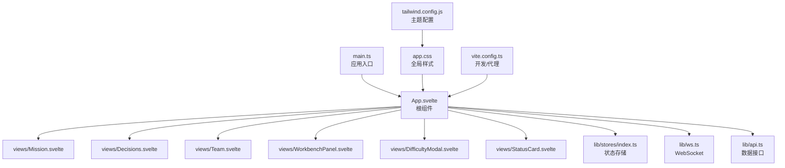
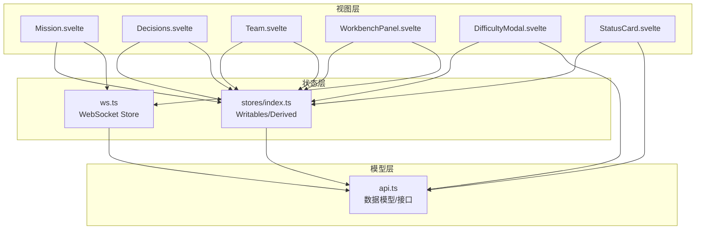
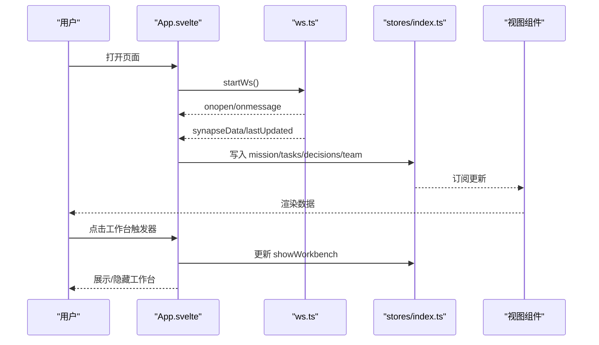
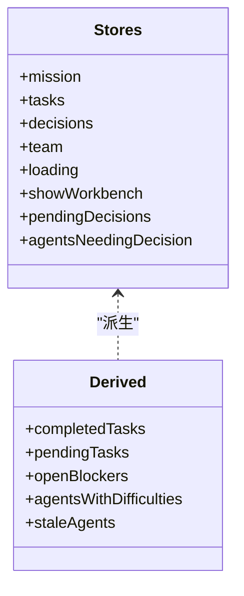
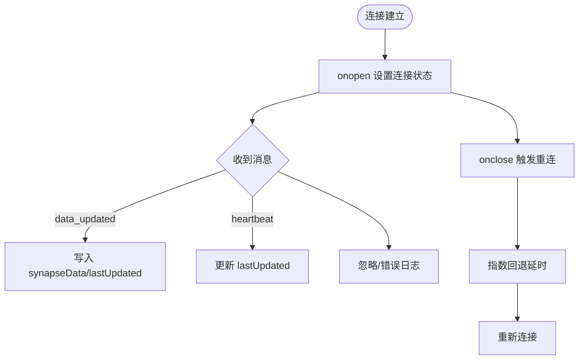
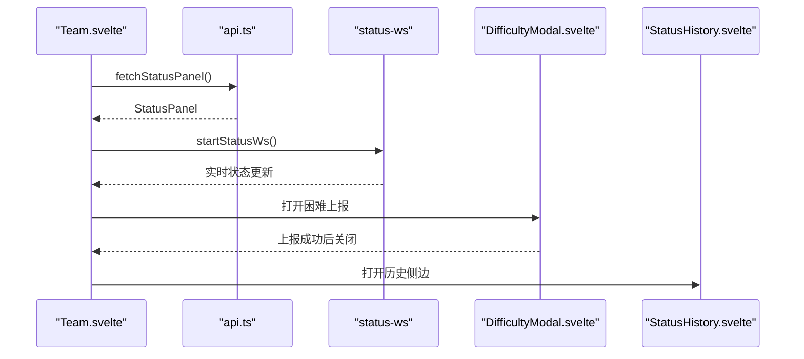
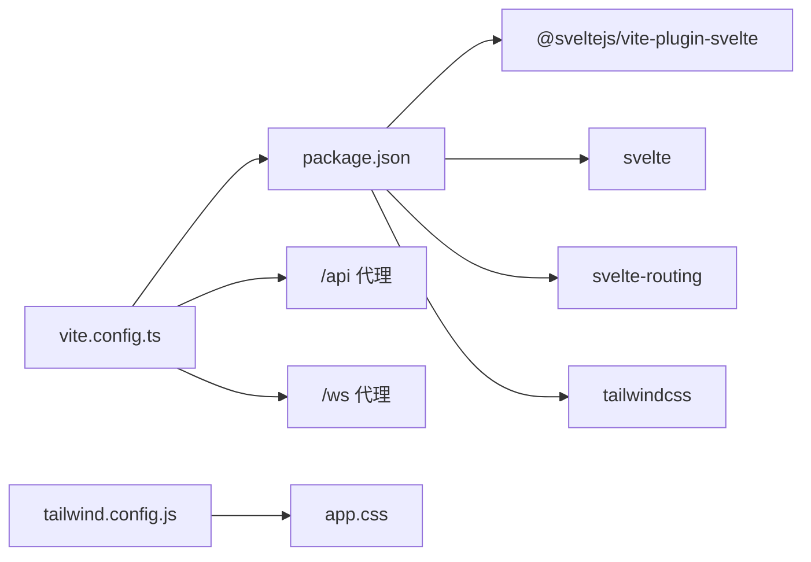

# 前端应用

<cite>
**本文引用的文件**
- [frontend/src/main.ts](file://frontend/src/main.ts)
- [frontend/src/App.svelte](file://frontend/src/App.svelte)
- [frontend/src/lib/stores/index.ts](file://frontend/src/lib/stores/index.ts)
- [frontend/src/lib/api.ts](file://frontend/src/lib/api.ts)
- [frontend/src/lib/ws.ts](file://frontend/src/lib/ws.ts)
- [frontend/src/views/Mission.svelte](file://frontend/src/views/Mission.svelte)
- [frontend/src/views/Decisions.svelte](file://frontend/src/views/Decisions.svelte)
- [frontend/src/views/Team.svelte](file://frontend/src/views/Team.svelte)
- [frontend/src/views/WorkbenchPanel.svelte](file://frontend/src/views/WorkbenchPanel.svelte)
- [frontend/src/views/DifficultyModal.svelte](file://frontend/src/views/DifficultyModal.svelte)
- [frontend/src/views/StatusCard.svelte](file://frontend/src/views/StatusCard.svelte)
- [frontend/src/app.css](file://frontend/src/app.css)
- [frontend/package.json](file://frontend/package.json)
- [frontend/vite.config.ts](file://frontend/vite.config.ts)
- [frontend/tailwind.config.js](file://frontend/tailwind.config.js)
</cite>

## 目录
1. [简介](#简介)
2. [项目结构](#项目结构)
3. [核心组件](#核心组件)
4. [架构总览](#架构总览)
5. [组件详解](#组件详解)
6. [依赖关系分析](#依赖关系分析)
7. [性能考量](#性能考量)
8. [故障排查指南](#故障排查指南)
9. [结论](#结论)
10. [附录](#附录)

## 简介
本文件为 SynapseOS 2.0 前端应用的架构与实现文档，面向 Svelte 技术栈与 MVVM 模式，系统化阐述应用结构、组件层次、状态管理、视图实现、样式系统与响应式设计，并给出 UI 组件的外观、行为与交互规范。文档同时覆盖 WebSocket 实时通信、路由与导航、工作台面板、模态与侧边栏交互、无障碍与可访问性建议，以及性能优化与故障排查要点。

## 项目结构
前端采用 Vite + Svelte + TailwindCSS 技术栈，构建于 TypeScript 之上，通过 Svelte Store 实现响应式状态管理，以组件化方式组织视图层。项目关键目录与职责如下：
- src/main.ts：应用入口，挂载根组件 App.svelte
- src/App.svelte：应用根组件，负责页面布局、导航、粒子背景动画、WebSocket 数据订阅与工作台面板控制
- src/lib/stores/index.ts：集中定义与导出 Svelte Writable/Derived Store，承载 mission、tasks、decisions、team、loading、showWorkbench 等状态
- src/lib/api.ts：定义数据模型与后端 API 方法（任务、决策、团队、状态面板、历史等）
- src/lib/ws.ts：封装 WebSocket 连接、心跳与数据推送，维护连接状态与最后更新时间
- src/views/*：视图组件，包含 Mission、Decisions、Team、WorkbenchPanel、DifficultyModal、StatusCard 等
- src/app.css：全局样式与 Tailwind 扩展变量、动画与通用类
- vite.config.ts：开发服务器与代理配置（/api → /ws → 后端）
- tailwind.config.js：主题色板、字体族、阴影与插件扩展

**图表来源**
- [frontend/src/main.ts:1-9](file://frontend/src/main.ts#L1-L9)
- [frontend/src/App.svelte:1-290](file://frontend/src/App.svelte#L1-L290)
- [frontend/src/lib/stores/index.ts:1-46](file://frontend/src/lib/stores/index.ts#L1-L46)
- [frontend/src/lib/api.ts:1-181](file://frontend/src/lib/api.ts#L1-L181)
- [frontend/src/lib/ws.ts:1-84](file://frontend/src/lib/ws.ts#L1-L84)
- [frontend/src/views/Mission.svelte:1-239](file://frontend/src/views/Mission.svelte#L1-L239)
- [frontend/src/views/Decisions.svelte:1-142](file://frontend/src/views/Decisions.svelte#L1-L142)
- [frontend/src/views/Team.svelte:1-507](file://frontend/src/views/Team.svelte#L1-L507)
- [frontend/src/views/WorkbenchPanel.svelte:1-364](file://frontend/src/views/WorkbenchPanel.svelte#L1-L364)
- [frontend/src/views/DifficultyModal.svelte:1-175](file://frontend/src/views/DifficultyModal.svelte#L1-L175)
- [frontend/src/views/StatusCard.svelte:1-170](file://frontend/src/views/StatusCard.svelte#L1-L170)
- [frontend/src/app.css:1-165](file://frontend/src/app.css#L1-L165)
- [frontend/tailwind.config.js:1-40](file://frontend/tailwind.config.js#L1-L40)
- [frontend/vite.config.ts:1-23](file://frontend/vite.config.ts#L1-L23)

**章节来源**
- [frontend/src/main.ts:1-9](file://frontend/src/main.ts#L1-L9)
- [frontend/src/App.svelte:1-290](file://frontend/src/App.svelte#L1-L290)
- [frontend/package.json:1-24](file://frontend/package.json#L1-L24)
- [frontend/vite.config.ts:1-23](file://frontend/vite.config.ts#L1-L23)
- [frontend/tailwind.config.js:1-40](file://frontend/tailwind.config.js#L1-L40)

## 核心组件
- 根组件 App.svelte
  - 功能：页面布局、导航、粒子背景动画、WebSocket 订阅、工作台面板开关、Tab 路由
  - 关键点：hash 路由解析、粒子动画初始化与清理、订阅 synapseData 并写入 stores
- 状态存储 stores
  - mission、tasks、blockers、decisions、team、loading、error
  - 衍生状态：completedTasks、pendingTasks、openBlockers、pendingDecisions、agentsWithDifficulties、agentsNeedingDecision、staleAgents
- WebSocket 服务 ws
  - 连接管理、重连策略、心跳与数据推送、连接状态与最后更新时间
- 视图组件
  - Mission：使命概览、任务统计、里程碑与任务列表
  - Decisions：待决策/已决策汇总与列表
  - Team：团队角色卡片、难度/待决策标记、历史与困难上报
  - WorkbenchPanel：聊天工作台，支持多 Agent、流式输出、智能滚动
  - DifficultyModal：上报困难表单
  - StatusCard：单个 Agent 状态卡片（作为 Team 子组件）

**章节来源**
- [frontend/src/App.svelte:1-290](file://frontend/src/App.svelte#L1-L290)
- [frontend/src/lib/stores/index.ts:1-46](file://frontend/src/lib/stores/index.ts#L1-L46)
- [frontend/src/lib/ws.ts:1-84](file://frontend/src/lib/ws.ts#L1-L84)
- [frontend/src/views/Mission.svelte:1-239](file://frontend/src/views/Mission.svelte#L1-L239)
- [frontend/src/views/Decisions.svelte:1-142](file://frontend/src/views/Decisions.svelte#L1-L142)
- [frontend/src/views/Team.svelte:1-507](file://frontend/src/views/Team.svelte#L1-L507)
- [frontend/src/views/WorkbenchPanel.svelte:1-364](file://frontend/src/views/WorkbenchPanel.svelte#L1-L364)
- [frontend/src/views/DifficultyModal.svelte:1-175](file://frontend/src/views/DifficultyModal.svelte#L1-L175)
- [frontend/src/views/StatusCard.svelte:1-170](file://frontend/src/views/StatusCard.svelte#L1-L170)

## 架构总览
应用采用 MVVM 模式：
- Model：lib/api.ts 定义的数据模型与后端 API
- ViewModel：lib/stores/index.ts 与 lib/ws.ts 提供的状态与订阅
- View：Svelte 组件（views/*）渲染与交互
- 通信：WebSocket 实时推送数据；HTTP 请求获取静态/面板数据；组件间通过 Store 与事件传递

**图表来源**
- [frontend/src/views/Mission.svelte:1-239](file://frontend/src/views/Mission.svelte#L1-L239)
- [frontend/src/views/Decisions.svelte:1-142](file://frontend/src/views/Decisions.svelte#L1-L142)
- [frontend/src/views/Team.svelte:1-507](file://frontend/src/views/Team.svelte#L1-L507)
- [frontend/src/views/WorkbenchPanel.svelte:1-364](file://frontend/src/views/WorkbenchPanel.svelte#L1-L364)
- [frontend/src/views/DifficultyModal.svelte:1-175](file://frontend/src/views/DifficultyModal.svelte#L1-L175)
- [frontend/src/views/StatusCard.svelte:1-170](file://frontend/src/views/StatusCard.svelte#L1-L170)
- [frontend/src/lib/stores/index.ts:1-46](file://frontend/src/lib/stores/index.ts#L1-L46)
- [frontend/src/lib/ws.ts:1-84](file://frontend/src/lib/ws.ts#L1-L84)
- [frontend/src/lib/api.ts:1-181](file://frontend/src/lib/api.ts#L1-L181)

## 组件详解

### 根组件 App.svelte
- 导航与路由
  - 使用 location.hash 解析当前 Tab，支持 mission、decisions、team
  - 导航链接根据当前 Tab 切换激活态
- 粒子背景动画
  - 初始化 Canvas，绘制带鼠标引力的小球，ResizeObserver 自适应窗口
  - 生命周期内注册/清理事件与动画帧
- 实时数据与工作台
  - 订阅 synapseData，将后端推送的 mission/tasks/decisions/team 写入对应 Store
  - 控制工作台面板显隐，结合 pendingDecisions 数量显示徽标
- 头部信息
  - 显示 WebSocket 连接状态与最后更新时间，格式化时间显示

**图表来源**
- [frontend/src/App.svelte:119-141](file://frontend/src/App.svelte#L119-L141)
- [frontend/src/lib/ws.ts:26-70](file://frontend/src/lib/ws.ts#L26-L70)
- [frontend/src/lib/stores/index.ts:6-11](file://frontend/src/lib/stores/index.ts#L6-L11)

**章节来源**
- [frontend/src/App.svelte:1-290](file://frontend/src/App.svelte#L1-L290)
- [frontend/src/lib/ws.ts:1-84](file://frontend/src/lib/ws.ts#L1-L84)
- [frontend/src/lib/stores/index.ts:1-46](file://frontend/src/lib/stores/index.ts#L1-L46)

### 状态管理与 Store
- 核心 Store
  - mission、tasks、blockers、decisions、team、loading、error
  - 衍生 Store：completedTasks、pendingTasks、openBlockers、pendingDecisions、agentsWithDifficulties、agentsNeedingDecision、staleAgents
- 作用
  - 作为单一数据源，驱动视图响应式更新
  - 通过订阅与更新，实现跨组件共享状态与解耦

**图表来源**
- [frontend/src/lib/stores/index.ts:6-46](file://frontend/src/lib/stores/index.ts#L6-L46)

**章节来源**
- [frontend/src/lib/stores/index.ts:1-46](file://frontend/src/lib/stores/index.ts#L1-L46)

### WebSocket 通信与实时推送
- 连接与断线重连
  - 自动协议选择（ws/wss），指数回退重连，最大延迟上限
- 消息类型
  - data_updated：推送 mission/tasks/decisions/team 数据与时间戳
  - heartbeat：心跳更新 lastUpdated
- 状态
  - wsConnected：连接状态
  - lastUpdated：最后更新时间

**图表来源**
- [frontend/src/lib/ws.ts:26-70](file://frontend/src/lib/ws.ts#L26-L70)

**章节来源**
- [frontend/src/lib/ws.ts:1-84](file://frontend/src/lib/ws.ts#L1-L84)

### 视图组件：Mission
- 功能
  - 使命卡片、进度环、统计面板、团队概览、里程碑与任务列表
- 响应式与计算
  - 基于 tasks 计算状态分布与完成百分比
  - 优先级与状态映射，动态样式类
- 加载与占位
  - loading 下使用骨架屏占位

**章节来源**
- [frontend/src/views/Mission.svelte:1-239](file://frontend/src/views/Mission.svelte#L1-L239)

### 视图组件：Decisions
- 功能
  - 决策汇总与列表，按状态与优先级排序
- 交互
  - 统计 pending/decided 数量，无待决策时展示鼓励语

**章节来源**
- [frontend/src/views/Decisions.svelte:1-142](file://frontend/src/views/Decisions.svelte#L1-L142)

### 视图组件：Team
- 功能
  - 域与角色卡片、在线/未报到/空缺状态可视化
  - 困难/待决策标记、历史查看与困难上报
- 数据融合
  - 合并 registry 与 status panel，支持 agent_id 与名称模糊匹配
- 实时刷新
  - 定时刷新面板与 registry，WebSocket 连接状态指示

**图表来源**
- [frontend/src/views/Team.svelte:244-253](file://frontend/src/views/Team.svelte#L244-L253)
- [frontend/src/views/DifficultyModal.svelte:26-60](file://frontend/src/views/DifficultyModal.svelte#L26-L60)

**章节来源**
- [frontend/src/views/Team.svelte:1-507](file://frontend/src/views/Team.svelte#L1-L507)
- [frontend/src/views/DifficultyModal.svelte:1-175](file://frontend/src/views/DifficultyModal.svelte#L1-L175)

### 视图组件：WorkbenchPanel
- 功能
  - 多 Agent 聊天工作台，支持切换 Agent、消息历史、流式输出、思考过程展开
- 交互
  - 智能滚动、新消息提示、排队消息、快捷键发送
- 状态
  - 连接状态指示、正在回复标识、等待首包闪烁

**章节来源**
- [frontend/src/views/WorkbenchPanel.svelte:1-364](file://frontend/src/views/WorkbenchPanel.svelte#L1-L364)

### 视图组件：DifficultyModal
- 功能
  - 困难上报表单，提交至后端 status report 接口
- 交互
  - 类型选择、严重程度、关联任务、描述与解决方案
  - 成功后自动关闭

**章节来源**
- [frontend/src/views/DifficultyModal.svelte:1-175](file://frontend/src/views/DifficultyModal.svelte#L1-L175)

### 视图组件：StatusCard
- 功能
  - 单个 Agent 状态卡片，包含头像、任务、进展、困难与待决策、历史/困难操作
- 设计
  - 根据状态动态设置边框颜色与发光效果

**章节来源**
- [frontend/src/views/StatusCard.svelte:1-170](file://frontend/src/views/StatusCard.svelte#L1-L170)

## 依赖关系分析
- 构建与工具
  - Vite 插件：@sveltejs/vite-plugin-svelte、svelte-preprocess
  - 样式：TailwindCSS、PostCSS、autoprefixer
  - 依赖：svelte、svelte-routing
- 开发服务器
  - 代理 /api → 后端 HTTP，/ws → 后端 WebSocket
- 样式体系
  - Tailwind 主题色板、字体族、阴影与自定义动画
  - 全局类：glass-card、neon-*、status-badge、pulse-glow 等

**图表来源**
- [frontend/package.json:1-24](file://frontend/package.json#L1-L24)
- [frontend/vite.config.ts:1-23](file://frontend/vite.config.ts#L1-L23)
- [frontend/tailwind.config.js:1-40](file://frontend/tailwind.config.js#L1-L40)
- [frontend/src/app.css:1-165](file://frontend/src/app.css#L1-L165)

**章节来源**
- [frontend/package.json:1-24](file://frontend/package.json#L1-L24)
- [frontend/vite.config.ts:1-23](file://frontend/vite.config.ts#L1-L23)
- [frontend/tailwind.config.js:1-40](file://frontend/tailwind.config.js#L1-L40)
- [frontend/src/app.css:1-165](file://frontend/src/app.css#L1-L165)

## 性能考量
- 响应式计算
  - 使用 $: 声明式计算，避免重复遍历；对大列表使用派生 Store 过滤
- 动画与渲染
  - 粒子动画使用 requestAnimationFrame 与 ResizeObserver，注意在 onMount/onDestroy 中清理
  - 视图使用骨架屏减少首屏闪烁
- 网络与缓存
  - WebSocket 心跳与增量更新，降低轮询成本
  - 代理配置减少跨域与额外握手
- 样式与体积
  - Tailwind 按需引入与自定义变量，避免未使用类导致体积膨胀

[本节为通用指导，不直接分析具体文件]

## 故障排查指南
- WebSocket 不可用
  - 检查 /ws 代理是否正确指向后端；确认协议（ws/wss）与主机一致
  - 查看连接状态与重连日志，确认后端是否正常推送 data_updated/heartbeat
- 数据未更新
  - 确认 synapseData 订阅是否生效；检查 stores 写入逻辑
  - 核对后端推送字段与前端类型定义一致性
- 视图空白或加载异常
  - 检查 loading 状态与条件渲染分支
  - 确认任务/决策/团队数据结构与视图字段映射
- 工作台无法发送消息
  - 检查 /ws/chat 地址与连接状态；确认消息类型与队列处理流程
- 样式异常
  - 确认 Tailwind 配置与类名拼写；检查全局变量与动画类

**章节来源**
- [frontend/src/lib/ws.ts:19-70](file://frontend/src/lib/ws.ts#L19-L70)
- [frontend/src/App.svelte:119-141](file://frontend/src/App.svelte#L119-L141)
- [frontend/vite.config.ts:13-20](file://frontend/vite.config.ts#L13-L20)

## 结论
本前端应用以 Svelte 为核心，结合 TailwindCSS 与 TypeScript，采用 MVVM 模式实现清晰的视图与状态分离。通过 Store 管理 mission/tasks/decisions/team 等核心数据，配合 WebSocket 实现实时更新；视图组件围绕 Mission、Decisions、Team、WorkbenchPanel 等场景构建，具备良好的可读性与可扩展性。样式系统统一、动画与交互细节完善，满足赛博朋克风格与现代 Web 的可用性要求。

## 附录

### 视图组件外观与交互清单
- Mission
  - 外观：玻璃卡片、进度环、状态徽章、里程碑与任务列表
  - 交互：加载骨架屏、任务状态与优先级展示
- Decisions
  - 外观：汇总卡片、待决策/已决策徽章
  - 交互：按状态与优先级排序、无数据友好提示
- Team
  - 外观：域分组卡片、在线/未报到/空缺状态、困难/待决策标记
  - 交互：历史侧边栏、困难上报模态、定时刷新
- WorkbenchPanel
  - 外观：多 Agent 标签页、消息气泡、思考过程折叠
  - 交互：智能滚动、新消息提示、排队消息与移除
- DifficultyModal
  - 外观：表单卡片、类型与严重程度选择
  - 交互：提交成功反馈、自动关闭
- StatusCard
  - 外观：头像、任务、进展、困难/待决策徽章
  - 交互：历史/困难操作按钮

**章节来源**
- [frontend/src/views/Mission.svelte:1-239](file://frontend/src/views/Mission.svelte#L1-L239)
- [frontend/src/views/Decisions.svelte:1-142](file://frontend/src/views/Decisions.svelte#L1-L142)
- [frontend/src/views/Team.svelte:1-507](file://frontend/src/views/Team.svelte#L1-L507)
- [frontend/src/views/WorkbenchPanel.svelte:1-364](file://frontend/src/views/WorkbenchPanel.svelte#L1-L364)
- [frontend/src/views/DifficultyModal.svelte:1-175](file://frontend/src/views/DifficultyModal.svelte#L1-L175)
- [frontend/src/views/StatusCard.svelte:1-170](file://frontend/src/views/StatusCard.svelte#L1-L170)

### 响应式设计与无障碍建议
- 响应式设计
  - 使用 Tailwind 断点类实现网格与布局自适应
  - 文本与图标在不同屏幕尺寸下保持可读性
- 无障碍合规性
  - 为交互元素提供可感知的焦点与键盘可达性
  - 为动态内容提供语义化标签与 ARIA 属性（如模态遮罩、状态徽章）
  - 为动画提供“减少动效”偏好设置（系统级或用户偏好）
  - 为颜色对比度不足的区域补充文本提示或替代方案

[本节为通用指导，不直接分析具体文件]