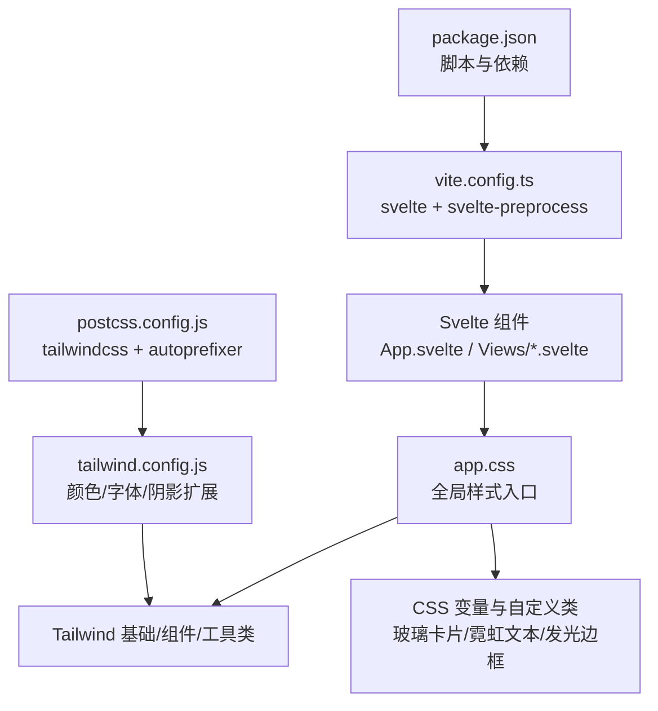
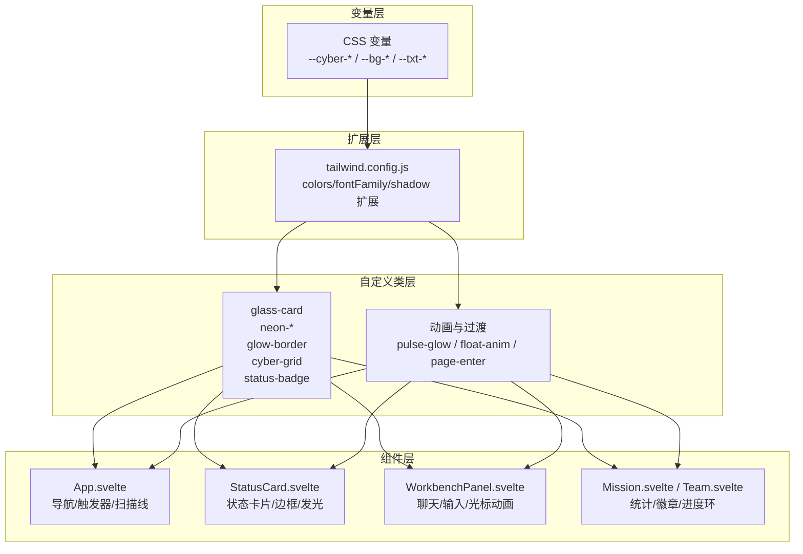
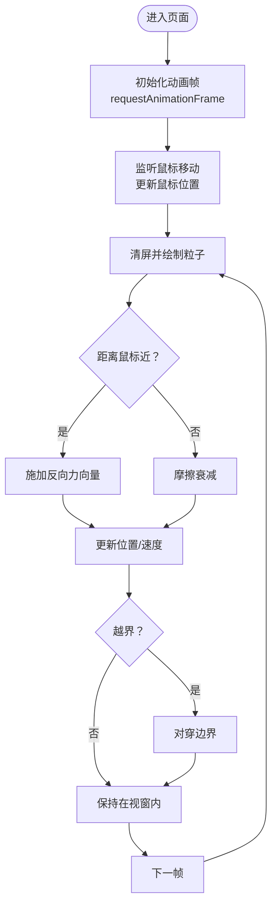
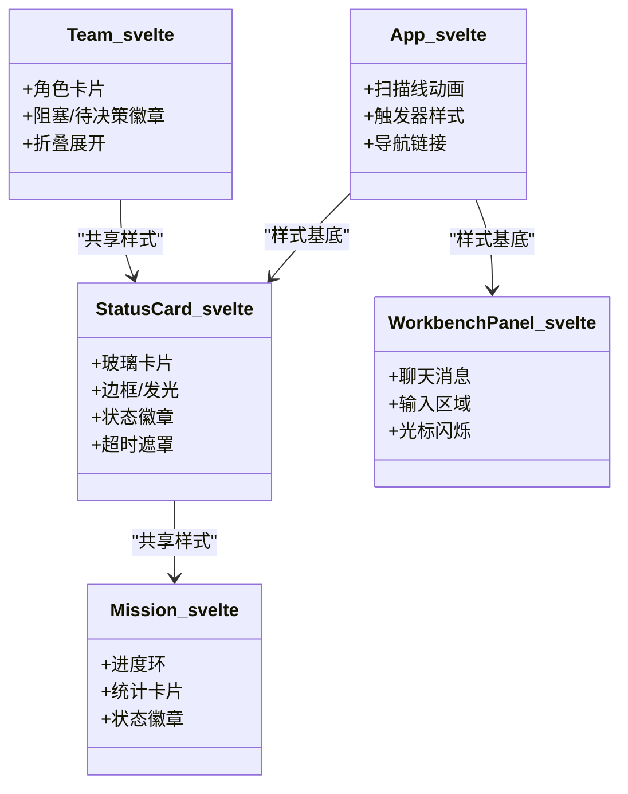
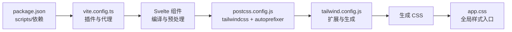

# 样式系统与主题

<cite>
**本文引用的文件**
- [app.css](file://frontend/src/app.css)
- [tailwind.config.js](file://frontend/tailwind.config.js)
- [postcss.config.js](file://frontend/postcss.config.js)
- [package.json](file://frontend/package.json)
- [vite.config.ts](file://frontend/vite.config.ts)
- [App.svelte](file://frontend/src/App.svelte)
- [StatusCard.svelte](file://frontend/src/views/StatusCard.svelte)
- [WorkbenchPanel.svelte](file://frontend/src/views/WorkbenchPanel.svelte)
- [Mission.svelte](file://frontend/src/views/Mission.svelte)
- [Team.svelte](file://frontend/src/views/Team.svelte)
- [stores/index.ts](file://frontend/src/lib/stores/index.ts)
</cite>

## 目录
1. [引言](#引言)
2. [项目结构](#项目结构)
3. [核心组件](#核心组件)
4. [架构总览](#架构总览)
5. [详细组件分析](#详细组件分析)
6. [依赖关系分析](#依赖关系分析)
7. [性能考量](#性能考量)
8. [故障排查指南](#故障排查指南)
9. [结论](#结论)
10. [附录](#附录)

## 引言
本文件面向 SynapseOS 2.0 的样式系统与主题，系统化阐述赛博朋克风格的设计理念、颜色体系与视觉元素；详解 Tailwind CSS 的配置与扩展、自定义样式类与响应式实现；记录 CSS 变量、动画与过渡效果；说明主题切换与暗色模式支持现状及建议；提供样式定制指南、组件样式规范与设计系统文档；并说明 PostCSS 配置、构建优化与样式打包策略。

## 项目结构
前端样式相关文件集中在 frontend/src 与根目录配置中，采用“原子化 + 自定义扩展”的混合策略：
- 全局样式入口：app.css 引入 Tailwind 基础、组件与工具类，并定义 CSS 变量与自定义样式类
- Tailwind 扩展：tailwind.config.js 定义颜色、字体族与阴影扩展
- 构建链路：postcss.config.js 配置 tailwindcss 与 autoprefixer；Vite 通过 svelte-preprocess 预处理；package.json 提供脚本与依赖

**图表来源**
- [app.css:1-165](file://frontend/src/app.css#L1-L165)
- [tailwind.config.js:1-40](file://frontend/tailwind.config.js#L1-L40)
- [postcss.config.js:1-7](file://frontend/postcss.config.js#L1-L7)
- [vite.config.ts:1-23](file://frontend/vite.config.ts#L1-L23)
- [package.json:1-24](file://frontend/package.json#L1-L24)

**章节来源**
- [app.css:1-165](file://frontend/src/app.css#L1-L165)
- [tailwind.config.js:1-40](file://frontend/tailwind.config.js#L1-L40)
- [postcss.config.js:1-7](file://frontend/postcss.config.js#L1-L7)
- [vite.config.ts:1-23](file://frontend/vite.config.ts#L1-L23)
- [package.json:1-24](file://frontend/package.json#L1-L24)

## 核心组件
- 赛博朋克色彩体系：以深蓝背景与高亮霓虹色为主，强调冷色调与科技感
- 自定义样式类：玻璃卡片、霓虹文本、发光边框、网格背景、滚动条、页面进入动画、粒子画布
- 动画与过渡：脉冲光效、浮动、扫描线、打点闪烁、输入光标闪烁、页面入场
- 主题与暗色模式：当前以深色背景与高对比文本为主，未见显式的明暗主题切换逻辑

**章节来源**
- [app.css:5-165](file://frontend/src/app.css#L5-L165)
- [tailwind.config.js:6-35](file://frontend/tailwind.config.js#L6-L35)

## 架构总览
样式系统由“变量层 + Tailwind 扩展层 + 自定义类层 + 组件层”构成，组件通过原子化类与自定义类组合实现一致的赛博朋克风格。

**图表来源**
- [app.css:5-165](file://frontend/src/app.css#L5-L165)
- [tailwind.config.js:4-36](file://frontend/tailwind.config.js#L4-L36)
- [App.svelte:156-289](file://frontend/src/App.svelte#L156-L289)
- [StatusCard.svelte:64-169](file://frontend/src/views/StatusCard.svelte#L64-L169)
- [WorkbenchPanel.svelte:254-368](file://frontend/src/views/WorkbenchPanel.svelte#L254-L368)
- [Mission.svelte:37-238](file://frontend/src/views/Mission.svelte#L37-L238)
- [Team.svelte:260-506](file://frontend/src/views/Team.svelte#L260-L506)

## 详细组件分析

### 设计理念与颜色方案
- 赛博朋克风格：深蓝背景（--bg-deep）、高对比文字（--txt-primary），搭配霓虹色系（--cyber-cyan、--cyber-violet、--cyber-amber、--cyber-green、--cyber-red）
- 字体体系：Orbitron（标题）、Rajdhani（正文）、Inter（常规）、JetBrains Mono（代码/等宽）、Noto Sans SC（中文）
- 阴影扩展：cyan、violet、cyan-lg，用于强调科技感与层次

**章节来源**
- [app.css:5-30](file://frontend/src/app.css#L5-L30)
- [tailwind.config.js:24-35](file://frontend/tailwind.config.js#L24-L35)

### Tailwind 配置与扩展
- content 范围：扫描 index.html 与 src 下的 Svelte/JS/TS 文件，确保按需生成样式
- colors 扩展：新增 cyber/bg/txt 三组语义化颜色，便于跨组件统一
- fontFamily 扩展：引入多语言字体族，满足国际化需求
- boxShadow 扩展：提供 cyan/violet/cyan-lg 阴影，配合发光效果

**章节来源**
- [tailwind.config.js:3-36](file://frontend/tailwind.config.js#L3-L36)

### 自定义样式类与视觉元素
- 玻璃卡片（glass-card）：半透明背景、backdrop-filter 模糊、细边框与阴影，hover 加强发光
- 霓虹文本（neon-*）：多色文本与外发光，营造赛博朋克氛围
- 发光边框（glow-border）：内/外发光增强科技感
- 网格背景（cyber-grid）：微弱圆点纹理，提升背景层次
- 滚动条（::-webkit-scrollbar）：窄条 + 霓虹色拇指
- 页面进入动画（page-enter）：淡入 + 上移
- 粒子画布（#particle-canvas）：全局固定定位，用于动态背景

**章节来源**
- [app.css:32-165](file://frontend/src/app.css#L32-L165)

### 动画与过渡效果
- 脉冲光效（pulse-glow）：常用于状态点与徽章
- 浮动（float-anim）：用于强调元素的呼吸感
- 页面入场（page-enter）：组件首次渲染的淡入动画
- 扫描线（scanline）：顶部横向扫描，模拟 CRT 显示器
- 打点与光标闪烁：聊天输入中的“思考中”与输入光标闪烁

**图表来源**
- [App.svelte:36-117](file://frontend/src/App.svelte#L36-L117)

**章节来源**
- [App.svelte:228-289](file://frontend/src/App.svelte#L228-L289)
- [WorkbenchPanel.svelte:355-368](file://frontend/src/views/WorkbenchPanel.svelte#L355-L368)

### 响应式设计实现
- 使用 Tailwind 响应式前缀（sm/md/lg）控制网格列数与布局断点
- 组件内部根据数据状态动态选择类名，保证在不同屏幕尺寸下保持一致的视觉节奏

**章节来源**
- [Mission.svelte:104-127](file://frontend/src/views/Mission.svelte#L104-L127)
- [Team.svelte:336-341](file://frontend/src/views/Team.svelte#L336-L341)

### 主题切换机制与暗色模式支持
- 现状：未发现显式的明/暗主题切换逻辑与持久化存储
- 建议：可引入 CSS 变量主题映射与用户偏好存储，在 :root 中切换 --theme-* 变量，或通过类名切换（如 data-theme="dark"）

**章节来源**
- [app.css:5-16](file://frontend/src/app.css#L5-L16)
- [tailwind.config.js:6-23](file://frontend/tailwind.config.js#L6-L23)

### 组件样式规范与设计系统
- 统一容器：glass-card 作为通用卡片基底，配合 hover 缩放与边框发光
- 状态徽章：status-badge 作为状态标识，结合状态类（status-completed/pending/in_progress/blocked）实现语义化着色
- 导航链接：nav-link 提供统一的悬停与激活态样式
- 进度与统计：Mission 中使用 SVG 进度环与统计卡片，配合渐变与霓虹色强调关键指标

**图表来源**
- [App.svelte:156-289](file://frontend/src/App.svelte#L156-L289)
- [StatusCard.svelte:64-169](file://frontend/src/views/StatusCard.svelte#L64-L169)
- [WorkbenchPanel.svelte:254-368](file://frontend/src/views/WorkbenchPanel.svelte#L254-L368)
- [Mission.svelte:37-238](file://frontend/src/views/Mission.svelte#L37-L238)
- [Team.svelte:260-506](file://frontend/src/views/Team.svelte#L260-L506)

**章节来源**
- [App.svelte:156-289](file://frontend/src/App.svelte#L156-L289)
- [StatusCard.svelte:64-169](file://frontend/src/views/StatusCard.svelte#L64-L169)
- [WorkbenchPanel.svelte:254-368](file://frontend/src/views/WorkbenchPanel.svelte#L254-L368)
- [Mission.svelte:37-238](file://frontend/src/views/Mission.svelte#L37-L238)
- [Team.svelte:260-506](file://frontend/src/views/Team.svelte#L260-L506)

## 依赖关系分析
- 构建链路：Vite 通过 svelte-preprocess 处理 Svelte 组件；PostCSS 应用 tailwindcss 与 autoprefixer；Tailwind 读取配置生成所需类
- 依赖版本：Tailwind CSS、PostCSS、Autoprefixer、Vite、Svelte

**图表来源**
- [package.json:6-19](file://frontend/package.json#L6-L19)
- [vite.config.ts:1-23](file://frontend/vite.config.ts#L1-L23)
- [postcss.config.js:1-7](file://frontend/postcss.config.js#L1-L7)
- [tailwind.config.js:1-40](file://frontend/tailwind.config.js#L1-L40)
- [app.css:1-3](file://frontend/src/app.css#L1-L3)

**章节来源**
- [package.json:6-19](file://frontend/package.json#L6-L19)
- [vite.config.ts:1-23](file://frontend/vite.config.ts#L1-L23)
- [postcss.config.js:1-7](file://frontend/postcss.config.js#L1-L7)
- [tailwind.config.js:1-40](file://frontend/tailwind.config.js#L1-L40)
- [app.css:1-3](file://frontend/src/app.css#L1-L3)

## 性能考量
- 按需生成：Tailwind content 范围明确，避免生成冗余样式
- 动画优化：CSS 动画与 GPU 加速属性（backdrop-filter、box-shadow）需关注设备兼容性与性能
- 构建优化：PostCSS 插件链简洁，autoprefixer 与 tailwindcss 即可满足需求
- 图片与字体：建议使用现代格式（WebP/WOFF2）与子集化字体，减少首屏体积

## 故障排查指南
- 样式未生效
  - 检查 app.css 是否正确引入 Tailwind 指令
  - 确认 tailwind.config.js 的 content 路径覆盖到目标组件
  - 清理缓存并重新构建
- 动画异常
  - 检查 keyframes 是否被裁剪（确认类名拼写与使用）
  - 确认浏览器对 backdrop-filter 的支持情况
- 响应式布局错乱
  - 核对断点前缀与容器宽度
  - 检查是否存在冲突的自定义样式覆盖

**章节来源**
- [app.css:1-3](file://frontend/src/app.css#L1-L3)
- [tailwind.config.js:3-3](file://frontend/tailwind.config.js#L3-L3)
- [postcss.config.js:1-7](file://frontend/postcss.config.js#L1-L7)

## 结论
SynapseOS 2.0 的样式系统以 Tailwind 为核心，结合自定义 CSS 变量与类，形成统一的赛博朋克视觉语言。组件层通过原子化与语义化类实现一致性与可维护性。建议后续补充主题切换与暗色模式支持，并持续优化动画与构建性能，以提升跨设备体验。

## 附录

### 样式定制指南
- 颜色扩展：在 tailwind.config.js 的 colors 下新增语义化命名，避免直接使用十六进制
- 字体扩展：在 fontFamily 中添加中英文字体族，确保中文字形清晰
- 动画扩展：在 app.css 中集中管理 keyframes，避免重复定义
- 响应式断点：优先使用 Tailwind 内置断点，必要时在组件内局部调整

**章节来源**
- [tailwind.config.js:24-35](file://frontend/tailwind.config.js#L24-L35)
- [app.css:129-153](file://frontend/src/app.css#L129-L153)

### 组件样式规范清单
- 卡片：统一使用 glass-card，hover 缩放与边框发光
- 状态：使用 status-badge 与状态类，确保语义化与可访问性
- 导航：nav-link 提供统一的激活态与悬停态
- 输入：输入框与按钮使用一致的边框/阴影与过渡

**章节来源**
- [StatusCard.svelte:64-169](file://frontend/src/views/StatusCard.svelte#L64-L169)
- [Mission.svelte:104-127](file://frontend/src/views/Mission.svelte#L104-L127)
- [App.svelte:172-206](file://frontend/src/App.svelte#L172-L206)

### 设计系统文档要点
- 色彩：深蓝背景（--bg-deep）、霓虹高亮（--cyber-*）、次级文字（--txt-secondary）
- 字体：标题（Orbitron）、正文（Rajdhani）、代码（JetBrains Mono）、中文（Noto Sans SC）
- 阴影：cyan/violet/cyan-lg 三档科技感阴影
- 动效：脉冲光效、浮动、扫描线、打点与光标闪烁

**章节来源**
- [app.css:5-30](file://frontend/src/app.css#L5-L30)
- [tailwind.config.js:24-35](file://frontend/tailwind.config.js#L24-L35)