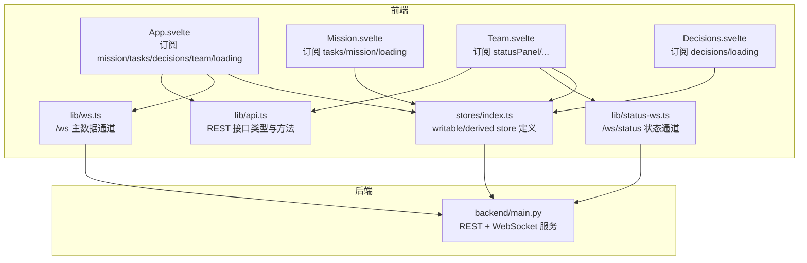
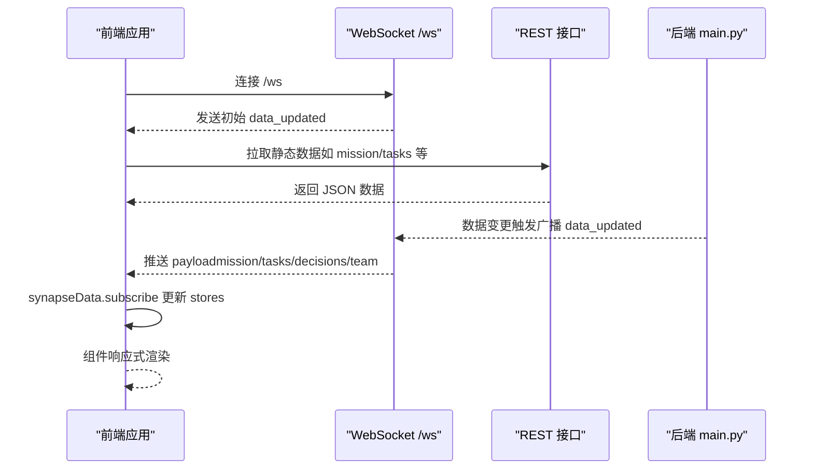
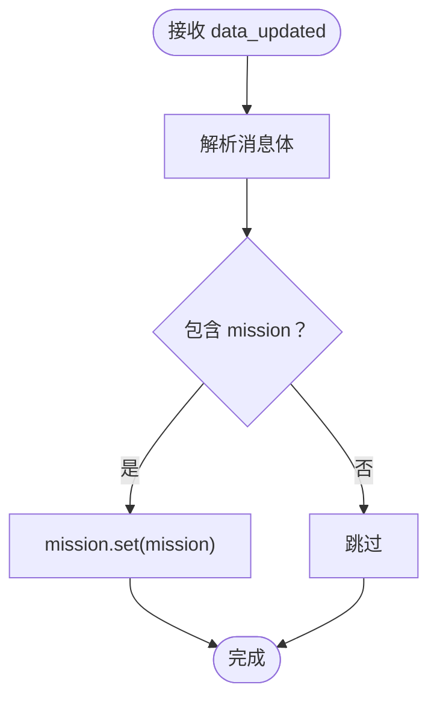
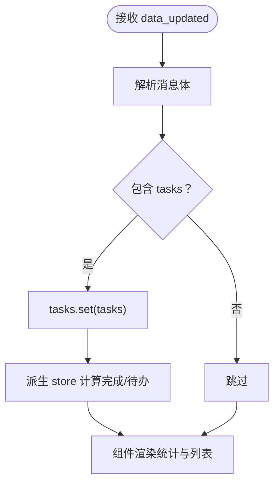
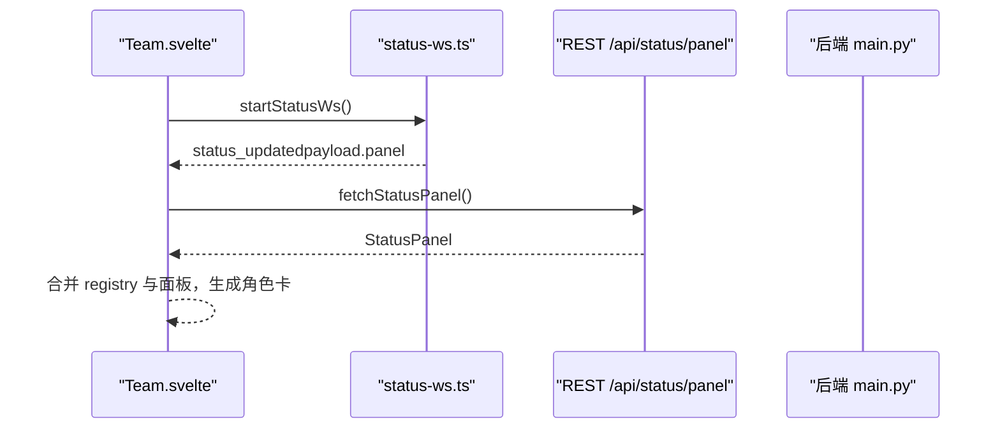
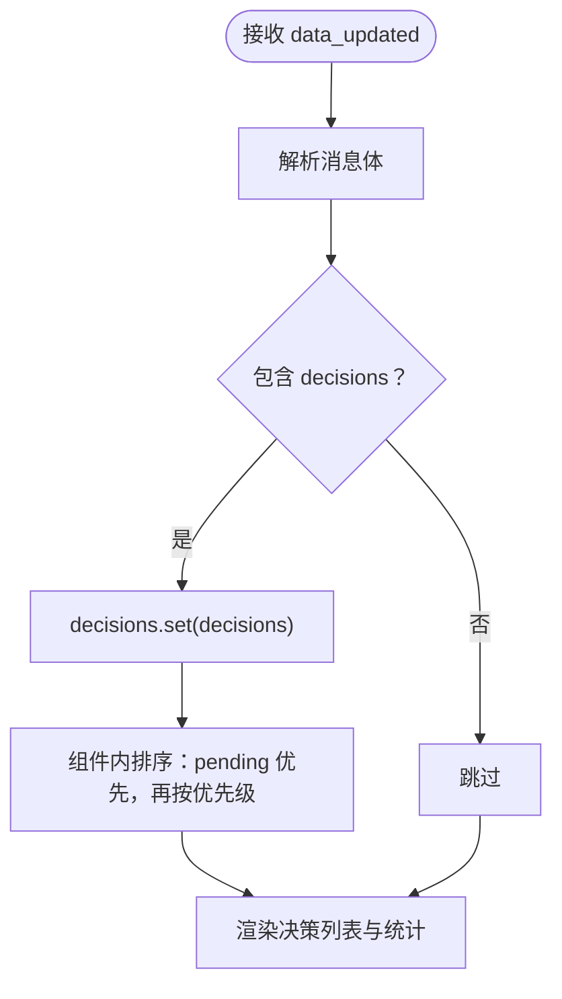
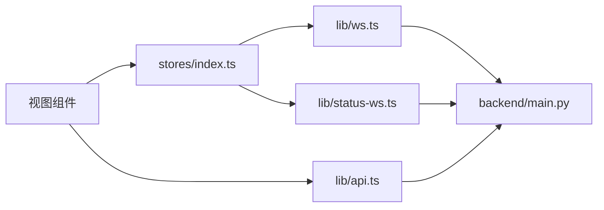

# 状态管理机制

<cite>
**本文引用的文件**
- [stores/index.ts](file://frontend/src/lib/stores/index.ts)
- [api.ts](file://frontend/src/lib/api.ts)
- [App.svelte](file://frontend/src/App.svelte)
- [Mission.svelte](file://frontend/src/views/Mission.svelte)
- [Team.svelte](file://frontend/src/views/Team.svelte)
- [Decisions.svelte](file://frontend/src/views/Decisions.svelte)
- [ws.ts](file://frontend/src/lib/ws.ts)
- [status-ws.ts](file://frontend/src/lib/status-ws.ts)
- [main.py](file://backend/main.py)
</cite>

## 目录
1. [引言](#引言)
2. [项目结构](#项目结构)
3. [核心组件](#核心组件)
4. [架构总览](#架构总览)
5. [详细组件分析](#详细组件分析)
6. [依赖分析](#依赖分析)
7. [性能考虑](#性能考虑)
8. [故障排查指南](#故障排查指南)
9. [结论](#结论)
10. [附录](#附录)

## 引言
本文件系统性梳理 SynapseOS 2.0 前端的状态管理机制，围绕 Svelte stores 的设计模式、响应式数据绑定与状态更新流程展开，重点覆盖以下模块：
- mission store：使命数据管理
- tasks store：任务状态跟踪
- team store：团队成员信息
- decisions store：待决策处理
并结合 WebSocket 实时通道、派生 store、订阅机制、错误处理与性能优化策略，给出最佳实践与扩展建议。

## 项目结构
前端采用“store 集中定义 + 组件订阅”的分层组织方式：
- stores/index.ts：集中导出所有 writable/derived stores，并提供派生计算
- views/*：视图组件通过 $store 语法订阅 store，实现响应式渲染
- lib/api.ts：REST API 类型与接口定义，用于拉取静态数据
- lib/ws.ts 与 lib/status-ws.ts：两类 WebSocket 通道，分别负责主数据流与状态面板流
- backend/main.py：后端 FastAPI 服务，提供 REST 与 WebSocket 接口，驱动前端状态更新

图表来源
- [App.svelte:1-290](file://frontend/src/App.svelte#L1-L290)
- [Mission.svelte:1-239](file://frontend/src/views/Mission.svelte#L1-L239)
- [Team.svelte:1-507](file://frontend/src/views/Team.svelte#L1-L507)
- [Decisions.svelte:1-142](file://frontend/src/views/Decisions.svelte#L1-L142)
- [stores/index.ts:1-46](file://frontend/src/lib/stores/index.ts#L1-L46)
- [api.ts:1-181](file://frontend/src/lib/api.ts#L1-L181)
- [ws.ts:1-84](file://frontend/src/lib/ws.ts#L1-L84)
- [status-ws.ts:1-78](file://frontend/src/lib/status-ws.ts#L1-L78)
- [main.py:1-495](file://backend/main.py#L1-L495)

章节来源
- [stores/index.ts:1-46](file://frontend/src/lib/stores/index.ts#L1-L46)
- [App.svelte:1-290](file://frontend/src/App.svelte#L1-L290)
- [ws.ts:1-84](file://frontend/src/lib/ws.ts#L1-L84)
- [status-ws.ts:1-78](file://frontend/src/lib/status-ws.ts#L1-L78)
- [api.ts:1-181](file://frontend/src/lib/api.ts#L1-L181)
- [main.py:1-495](file://backend/main.py#L1-L495)

## 核心组件
- mission store：可写 store，承载当前 mission 数据；在 App.svelte 中通过 WebSocket 订阅更新
- tasks store：可写 store，承载任务列表；Mission.svelte 中进行统计与进度计算
- decisions store：可写 store，承载待决策列表；Decisions.svelte 中排序与展示
- team store：可写 store，承载团队成员列表；Team.svelte 中进行角色映射与状态聚合
- statusPanel store：可写 store，承载状态面板；Team.svelte 通过 status-ws.ts 订阅更新
- 派生 store：
  - completedTasks/pendingTasks/openBlockers/pendingDecisions：基于 tasks/blockers/decisions 的过滤
  - agentsWithDifficulties/agentsNeedingDecision/staleAgents：基于 statusPanel 的筛选

章节来源
- [stores/index.ts:6-46](file://frontend/src/lib/stores/index.ts#L6-L46)
- [Mission.svelte:1-239](file://frontend/src/views/Mission.svelte#L1-L239)
- [Decisions.svelte:1-142](file://frontend/src/views/Decisions.svelte#L1-L142)
- [Team.svelte:1-507](file://frontend/src/views/Team.svelte#L1-L507)

## 架构总览
前端通过两条 WebSocket 通道与后端保持实时同步：
- /ws：主数据通道，推送 mission/tasks/decisions/team 的聚合数据
- /ws/status：状态面板通道，推送 statusPanel 与事件（难度上报、决策请求）

图表来源
- [ws.ts:1-84](file://frontend/src/lib/ws.ts#L1-L84)
- [App.svelte:119-141](file://frontend/src/App.svelte#L119-L141)
- [main.py:396-440](file://backend/main.py#L396-L440)

章节来源
- [ws.ts:1-84](file://frontend/src/lib/ws.ts#L1-L84)
- [App.svelte:119-141](file://frontend/src/App.svelte#L119-L141)
- [main.py:396-440](file://backend/main.py#L396-L440)

## 详细组件分析

### mission store（使命数据）
- 设计要点
  - 使用 writable 存储 mission 对象，初始值为 null
  - 通过 WebSocket 接收 data_updated 消息，将 mission 字段设置到 store
  - App.svelte 中订阅 synapseData，解构 mission 并 set 到 mission store
- 初始化与更新
  - 首次连接 /ws 即收到初始 payload，随后数据变更持续推送
- 错误处理
  - WebSocket 解析异常会打印错误日志，不影响后续连接重试
- 性能建议
  - mission 数据体量较小，无需额外去抖；若未来引入复杂嵌套，可考虑浅拷贝与字段选择

图表来源
- [ws.ts:43-55](file://frontend/src/lib/ws.ts#L43-L55)
- [App.svelte:125-133](file://frontend/src/App.svelte#L125-L133)

章节来源
- [stores/index.ts:6-6](file://frontend/src/lib/stores/index.ts#L6-L6)
- [App.svelte:125-133](file://frontend/src/App.svelte#L125-L133)
- [ws.ts:43-55](file://frontend/src/lib/ws.ts#L43-L55)

### tasks store（任务状态跟踪）
- 设计要点
  - 使用 writable 存储任务数组，初始为空数组
  - Mission.svelte 中对任务进行统计与进度计算，使用 $tasks 读取
  - 派生 store completedTasks/pendingTasks 基于任务状态过滤
- 初始化与更新
  - 通过 /ws 的 data_updated 推送 tasks 数组，set 到 tasks store
- 错误处理
  - 任务数据格式异常时，组件侧通过条件渲染避免崩溃
- 性能建议
  - 大量任务时，建议在组件侧做虚拟滚动与分页；store 层保持扁平数组

图表来源
- [ws.ts:43-55](file://frontend/src/lib/ws.ts#L43-L55)
- [App.svelte:125-133](file://frontend/src/App.svelte#L125-L133)
- [stores/index.ts:23-28](file://frontend/src/lib/stores/index.ts#L23-L28)

章节来源
- [stores/index.ts:7-28](file://frontend/src/lib/stores/index.ts#L7-L28)
- [Mission.svelte:1-239](file://frontend/src/views/Mission.svelte#L1-L239)
- [App.svelte:125-133](file://frontend/src/App.svelte#L125-L133)

### team store（团队成员信息）
- 设计要点
  - 使用 writable 存储 team 成员数组，初始为空数组
  - Team.svelte 通过 status-ws.ts 订阅 /ws/status，更新 statusPanel
  - 通过 fetchStatusPanel 与 /api/status/panel 获取静态面板数据
- 初始化与更新
  - /ws/status 推送 status_updated 时，更新 statusPanel；Team.svelte 再进行角色映射与统计
- 错误处理
  - fetchStatusPanel 失败时记录错误并继续渲染占位
- 性能建议
  - statusPanel 数据量可控；若角色卡牌增多，建议组件侧做分组与懒加载

图表来源
- [Team.svelte:244-253](file://frontend/src/views/Team.svelte#L244-L253)
- [status-ws.ts:18-64](file://frontend/src/lib/status-ws.ts#L18-L64)
- [api.ts:151-154](file://frontend/src/lib/api.ts#L151-L154)
- [main.py:442-477](file://backend/main.py#L442-L477)

章节来源
- [stores/index.ts:10-10](file://frontend/src/lib/stores/index.ts#L10-L10)
- [Team.svelte:1-507](file://frontend/src/views/Team.svelte#L1-L507)
- [status-ws.ts:1-78](file://frontend/src/lib/status-ws.ts#L1-L78)
- [api.ts:1-181](file://frontend/src/lib/api.ts#L1-L181)
- [main.py:442-477](file://backend/main.py#L442-L477)

### decisions store（待决策处理）
- 设计要点
  - 使用 writable 存储 decisions 数组，初始为空数组
  - Decisions.svelte 中对决策项进行排序与统计：按状态优先（pending 在前），再按优先级
  - 派生 store pendingDecisions 基于决策状态过滤
- 初始化与更新
  - 通过 /ws 的 data_updated 推送 decisions 数组，set 到 decisions store
- 错误处理
  - 组件侧对空列表与加载态进行友好提示
- 性能建议
  - 决策项数量有限，排序开销低；若需扩展，可在 store 层维护有序索引

图表来源
- [ws.ts:43-55](file://frontend/src/lib/ws.ts#L43-L55)
- [App.svelte:125-133](file://frontend/src/App.svelte#L125-L133)
- [Decisions.svelte:22-28](file://frontend/src/views/Decisions.svelte#L22-L28)
- [stores/index.ts:32-34](file://frontend/src/lib/stores/index.ts#L32-L34)

章节来源
- [stores/index.ts:9-34](file://frontend/src/lib/stores/index.ts#L9-L34)
- [Decisions.svelte:1-142](file://frontend/src/views/Decisions.svelte#L1-L142)
- [App.svelte:125-133](file://frontend/src/App.svelte#L125-L133)

### 派生 store（派生计算）
- completedTasks/pendingTasks/openBlockers/pendingDecisions：基于基础 store 的过滤
- agentsWithDifficulties/agentsNeedingDecision/staleAgents：基于 statusPanel 的筛选
- 设计原则
  - 读取 $store 形式的响应式值，自动在依赖变化时重新计算
  - 避免在派生 store 中进行昂贵操作，必要时拆分为多个轻量派生 store

章节来源
- [stores/index.ts:23-46](file://frontend/src/lib/stores/index.ts#L23-L46)

### 订阅机制与生命周期
- App.svelte 在 onMount 中：
  - 启动 /ws，订阅 synapseData，将 mission/tasks/decisions/team/loading 设置到对应 store
  - 注册 hashchange 与窗口尺寸监听，清理资源
- Team.svelte 在 onMount 中：
  - 启动 /ws/status，周期性刷新 statusPanel 与 registry
- 生命周期清理
  - stopWs/stopStatusWs 清理定时器与 WebSocket

章节来源
- [App.svelte:119-141](file://frontend/src/App.svelte#L119-L141)
- [Team.svelte:244-253](file://frontend/src/views/Team.svelte#L244-L253)
- [ws.ts:72-83](file://frontend/src/lib/ws.ts#L72-L83)
- [status-ws.ts:66-77](file://frontend/src/lib/status-ws.ts#L66-L77)

## 依赖分析
- 组件与 store 的耦合
  - views/* 仅依赖 stores/index.ts 导出的 store，降低跨组件耦合
  - 派生 store 仅依赖基础 store，保持高内聚
- 外部依赖
  - WebSocket 通道与后端 REST API
  - 后端通过 DataWatcher 监听文件变化，触发广播与状态快照更新

图表来源
- [stores/index.ts:1-46](file://frontend/src/lib/stores/index.ts#L1-L46)
- [ws.ts:1-84](file://frontend/src/lib/ws.ts#L1-L84)
- [status-ws.ts:1-78](file://frontend/src/lib/status-ws.ts#L1-L78)
- [api.ts:1-181](file://frontend/src/lib/api.ts#L1-L181)
- [main.py:1-495](file://backend/main.py#L1-L495)

章节来源
- [stores/index.ts:1-46](file://frontend/src/lib/stores/index.ts#L1-L46)
- [main.py:1-495](file://backend/main.py#L1-L495)

## 性能考虑
- 去抖与批量推送
  - 后端对数据变更进行去抖（300ms）后再广播，减少频繁推送
- 心跳与断线重连
  - WebSocket 通道支持心跳与指数退避重连，提升稳定性
- 组件侧优化
  - 大列表使用虚拟滚动与分页
  - 派生计算尽量轻量，避免在派生 store 中执行复杂逻辑
- 网络与缓存
  - 静态数据可通过 REST 接口获取，WebSocket 仅用于实时增量更新
  - 建议在 store 层增加本地缓存策略（如 IndexedDB）以支持离线回放与恢复

## 故障排查指南
- WebSocket 连接问题
  - 检查 /ws 与 /ws/status 的 URL 构造是否正确（协议与主机）
  - 查看控制台日志中的连接/关闭/错误事件
- 数据不更新
  - 确认后端 DataWatcher 是否正常运行，文件变更是否触发广播
  - 检查前端 synapseData 订阅是否生效
- 状态面板异常
  - 确认 /api/status/panel 返回的面板数据结构一致
  - 检查 Team.svelte 中的匹配逻辑（agent_id 与 agent_name 去括号匹配）
- 决策更新失败
  - 确认 PATCH /api/decisions/{id} 请求是否成功写入任务文件

章节来源
- [ws.ts:19-83](file://frontend/src/lib/ws.ts#L19-L83)
- [status-ws.ts:12-77](file://frontend/src/lib/status-ws.ts#L12-L77)
- [Team.svelte:113-123](file://frontend/src/views/Team.svelte#L113-L123)
- [main.py:224-298](file://backend/main.py#L224-L298)

## 结论
SynapseOS 2.0 的状态管理以 Svelte stores 为核心，结合两条 WebSocket 通道与 REST 接口，实现了使命、任务、团队与决策的实时可视化与交互。通过集中式 store 定义、派生计算与组件订阅，系统在可维护性与性能之间取得平衡。建议在后续迭代中引入本地持久化、更细粒度的去抖策略与组件级性能监控，以进一步增强用户体验与系统鲁棒性。

## 附录
- 最佳实践
  - 将 store 作为单一事实来源，避免组件内部重复缓存
  - 对大数组使用派生 store 过滤，而非在组件内多次遍历
  - WebSocket 消息统一解析与校验，异常时降级渲染
- 扩展指南
  - 新增 store 时，同时提供派生 store 与类型定义
  - 对关键流程（如决策更新）增加幂等与回滚策略
  - 引入状态持久化与历史回放能力，支持离线场景