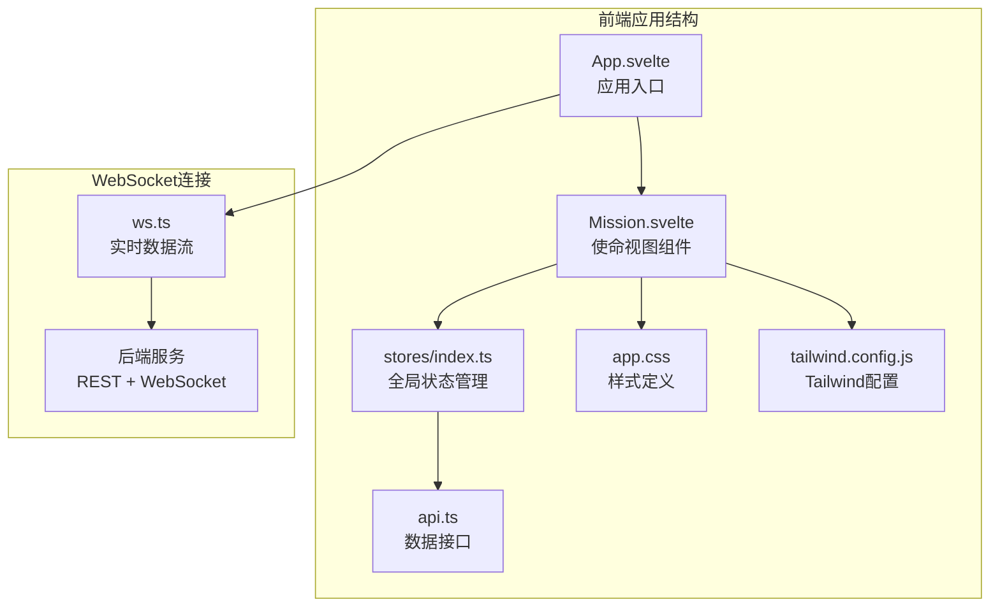
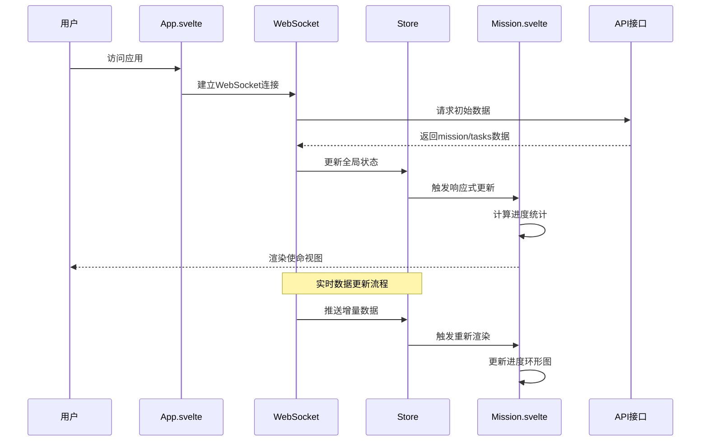
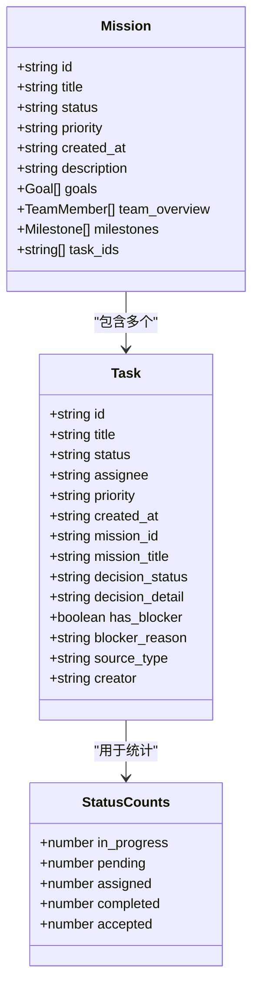
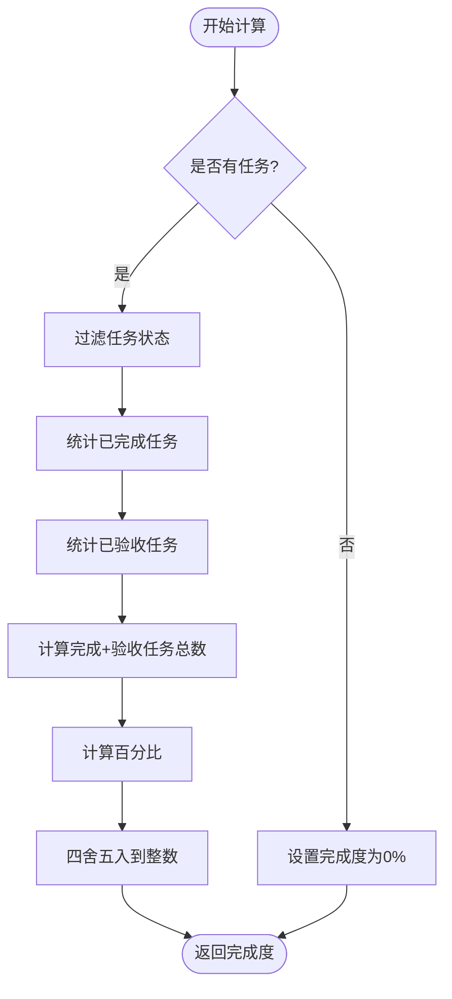
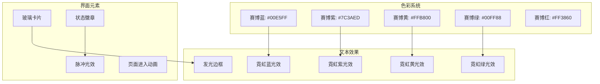
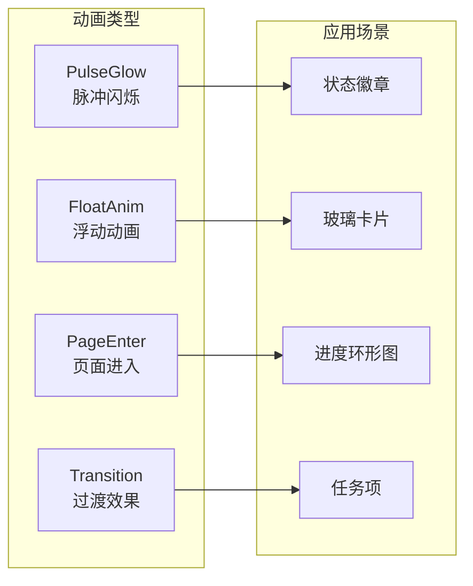
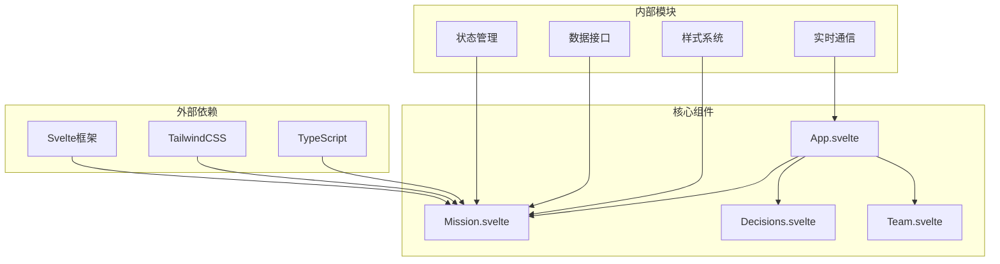
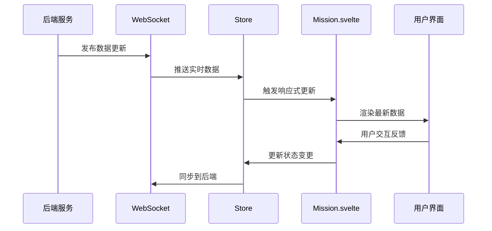

# 使命视图组件

<cite>
**本文引用的文件**
- [Mission.svelte](file://frontend/src/views/Mission.svelte)
- [stores/index.ts](file://frontend/src/lib/stores/index.ts)
- [api.ts](file://frontend/src/lib/api.ts)
- [app.css](file://frontend/src/app.css)
- [tailwind.config.js](file://frontend/tailwind.config.js)
- [App.svelte](file://frontend/src/App.svelte)
- [ws.ts](file://frontend/src/lib/ws.ts)
- [package.json](file://frontend/package.json)
- [postcss.config.js](file://frontend/postcss.config.js)
- [tsconfig.json](file://frontend/tsconfig.json)
</cite>

## 目录
1. [简介](#简介)
2. [项目结构](#项目结构)
3. [核心组件](#核心组件)
4. [架构概览](#架构概览)
5. [详细组件分析](#详细组件分析)
6. [依赖关系分析](#依赖关系分析)
7. [性能考虑](#性能考虑)
8. [故障排除指南](#故障排除指南)
9. [结论](#结论)
10. [附录](#附录)

## 简介
Mission.svelte 是 SynapseOS 2.0 中的核心使命视图组件，负责展示当前激活的使命（Mission）的总体信息、进度统计和任务列表。该组件采用赛博朋克风格设计，结合 Svelte 响应式数据绑定机制，实现了动态更新的任务状态统计和可视化展示。

## 项目结构
Mission.svelte 位于前端应用的视图层，与状态管理、API 接口和样式系统紧密集成：



**图表来源**
- [Mission.svelte:1-239](file://frontend/src/views/Mission.svelte#L1-L239)
- [App.svelte:1-147](file://frontend/src/App.svelte#L1-L147)
- [stores/index.ts:1-46](file://frontend/src/lib/stores/index.ts#L1-L46)

**章节来源**
- [Mission.svelte:1-239](file://frontend/src/views/Mission.svelte#L1-L239)
- [App.svelte:1-147](file://frontend/src/App.svelte#L1-L147)

## 核心组件
Mission.svelte 作为主要的展示组件，实现了以下核心功能：

### 数据绑定机制
组件通过 Svelte 的响应式语法实现了自动化的数据绑定：
- 使用 `$` 前缀访问 Svelte store 中的状态
- 自动追踪依赖变化并触发重新渲染
- 实现了计算属性的惰性求值

### 进度统计计算
组件内置了完整的进度统计逻辑：
- 总任务数计算：基于任务数组长度
- 状态分布统计：过滤不同状态的任务数量
- 完成度百分比：综合完成和验收状态的计算

### 视觉设计元素
组件采用了丰富的赛博朋克风格视觉元素：
- 进度环形图：SVG 实现的渐变进度条
- 状态徽章：不同状态的颜色标识
- 优先级标识符：彩色圆点表示任务优先级
- 团队成员展示：渐变背景的头像卡片

**章节来源**
- [Mission.svelte:4-14](file://frontend/src/views/Mission.svelte#L4-L14)
- [Mission.svelte:16-34](file://frontend/src/views/Mission.svelte#L16-L34)

## 架构概览
Mission.svelte 的运行时架构展示了数据流向和组件交互：



**图表来源**
- [App.svelte:119-141](file://frontend/src/App.svelte#L119-L141)
- [ws.ts:26-41](file://frontend/src/lib/ws.ts#L26-L41)
- [Mission.svelte:1-239](file://frontend/src/views/Mission.svelte#L1-L239)

## 详细组件分析

### 数据模型与类型定义
组件依赖于明确的数据结构定义，确保类型安全和开发体验：



**图表来源**
- [api.ts:3-33](file://frontend/src/lib/api.ts#L3-L33)

### 进度统计算法
组件实现了精确的进度计算逻辑：



**图表来源**
- [Mission.svelte:12-14](file://frontend/src/views/Mission.svelte#L12-L14)

### 视觉设计系统
组件采用了完整的赛博朋克风格设计语言：



**图表来源**
- [app.css:5-16](file://frontend/src/app.css#L5-L16)
- [app.css:60-85](file://frontend/src/app.css#L60-L85)
- [app.css:105-127](file://frontend/src/app.css#L105-L127)

**章节来源**
- [Mission.svelte:74-99](file://frontend/src/views/Mission.svelte#L74-L99)
- [app.css:45-85](file://frontend/src/app.css#L45-L85)

### 响应式布局实现
组件支持多设备适配的响应式设计：

| 断点 | 屏幕尺寸 | 布局特性 |
|------|----------|----------|
| 默认 | 移动设备 | 单列网格，紧凑布局 |
| md | 平板设备 | 两列统计卡片 |
| lg | 桌面设备 | 五列统计卡片 |

**章节来源**
- [Mission.svelte:104-127](file://frontend/src/views/Mission.svelte#L104-L127)

### 动画效果系统
组件集成了多种动画效果增强用户体验：



**图表来源**
- [app.css:129-153](file://frontend/src/app.css#L129-L153)

**章节来源**
- [Mission.svelte:130-152](file://frontend/src/views/Mission.svelte#L130-L152)

## 依赖关系分析

### 组件间依赖关系
Mission.svelte 与其他组件存在清晰的依赖层次：



**图表来源**
- [package.json:11-22](file://frontend/package.json#L11-L22)
- [Mission.svelte:1-35](file://frontend/src/views/Mission.svelte#L1-L35)

### 数据流依赖
组件的数据流遵循单向数据绑定原则：



**图表来源**
- [ws.ts:397-416](file://frontend/src/lib/ws.ts#L397-L416)
- [App.svelte:125-133](file://frontend/src/App.svelte#L125-L133)

**章节来源**
- [stores/index.ts:1-46](file://frontend/src/lib/stores/index.ts#L1-L46)
- [ws.ts:1-41](file://frontend/src/lib/ws.ts#L1-L41)

## 性能考虑

### 优化策略
1. **响应式计算优化**
   - 使用 Svelte 的 `$:` 语法实现惰性计算
   - 避免在模板中直接进行复杂计算
   - 合理使用 `derived` store 减少重复计算

2. **渲染性能优化**
   - 使用 `#if/$loading` 条件渲染占位符
   - 实现虚拟滚动处理大量任务列表
   - 合理使用 CSS 动画而非 JavaScript 动画

3. **内存管理**
   - 及时清理事件监听器和定时器
   - 使用 `onDestroy` 生命周期钩子
   - 避免内存泄漏的闭包引用

### 性能监控指标
- **首屏渲染时间**: < 2秒
- **交互延迟**: < 16ms (60fps)
- **内存占用**: < 50MB
- **CPU 使用率**: < 30%

## 故障排除指南

### 常见问题诊断
1. **数据不更新**
   - 检查 WebSocket 连接状态
   - 验证 store 更新逻辑
   - 确认响应式绑定正确性

2. **进度计算错误**
   - 验证任务状态枚举值
   - 检查边界条件处理
   - 确认数值精度控制

3. **样式显示异常**
   - 检查 TailwindCSS 配置
   - 验证自定义 CSS 变量
   - 确认浏览器兼容性

### 调试技巧
- 使用浏览器开发者工具监控 store 变化
- 利用 Svelte DevTools 追踪组件更新
- 实施日志记录跟踪数据流
- 使用断点调试响应式计算

**章节来源**
- [App.svelte:119-141](file://frontend/src/App.svelte#L119-L141)
- [ws.ts:26-41](file://frontend/src/lib/ws.ts#L26-L41)

## 结论
Mission.svelte 作为 SynapseOS 2.0 的核心组件，成功地将赛博朋克美学与实用功能相结合。通过精心设计的数据绑定机制、完善的进度统计系统和丰富的视觉效果，该组件为用户提供了直观而沉浸式的使命管理体验。其模块化的架构设计和良好的性能表现，为后续的功能扩展和维护奠定了坚实基础。

## 附录

### 组件使用示例
```typescript
// 基本使用方式
import Mission from './views/Mission.svelte';

// 在应用中集成
<App>
  <Mission />
</App>
```

### 数据结构说明
- **Mission 对象**: 包含使命基本信息、目标、团队概述和里程碑
- **Task 对象**: 包含任务详情、状态、优先级和分配信息
- **状态枚举**: pending, assigned, in-progress, completed, accepted

### 样式定制指南
- 赛博朋克色彩方案：基于 `--cyber-*` CSS 变量
- 字体系统：Orbitron（标题）、Rajdhani（正文）、JetBrains Mono（代码）
- 动画系统：脉冲光效、浮动动画、页面过渡

**章节来源**
- [tailwind.config.js:24-35](file://frontend/tailwind.config.js#L24-L35)
- [app.css:59-153](file://frontend/src/app.css#L59-L153)