# 决策视图组件

<cite>
**本文档引用的文件**
- [Decisions.svelte](file://frontend/src/views/Decisions.svelte)
- [stores/index.ts](file://frontend/src/lib/stores/index.ts)
- [api.ts](file://frontend/src/lib/api.ts)
- [App.svelte](file://frontend/src/App.svelte)
- [ws.ts](file://frontend/src/lib/ws.ts)
- [parser.py](file://backend/parser.py)
- [main.py](file://backend/main.py)
- [app.css](file://frontend/src/app.css)
</cite>

## 目录
1. [简介](#简介)
2. [项目结构](#项目结构)
3. [核心组件](#核心组件)
4. [架构概览](#架构概览)
5. [详细组件分析](#详细组件分析)
6. [依赖关系分析](#依赖关系分析)
7. [性能考虑](#性能考虑)
8. [故障排除指南](#故障排除指南)
9. [结论](#结论)
10. [附录](#附录)

## 简介

Decisions.svelte 是 SynapseOS 2.0 中的核心决策管理组件，负责展示和管理待决策任务。该组件实现了完整的决策生命周期管理，包括任务状态过滤、优先级排序、实时数据同步和用户交互处理。

组件采用响应式设计模式，通过 Svelte stores 实现数据驱动的界面更新。它集成了 WebSocket 实时通信，确保决策状态变更能够即时反映在用户界面上。组件支持多种决策状态（待决策、已决策），并提供了直观的状态指示器和优先级可视化。

## 项目结构

前端项目采用模块化架构，Decisions 组件位于 views 目录下，与其它视图组件并列：

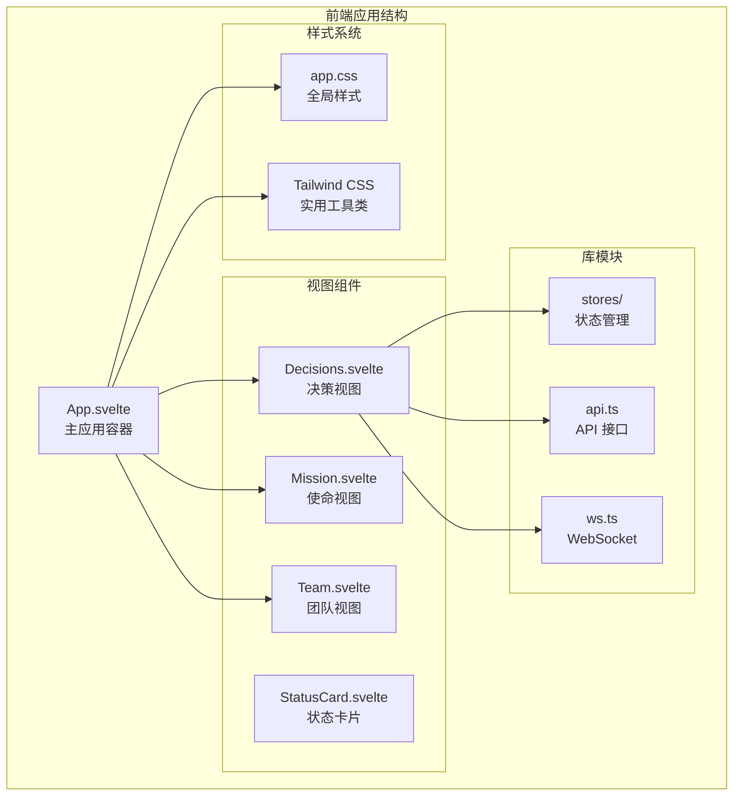

**图表来源**
- [Decisions.svelte:1-142](file://frontend/src/views/Decisions.svelte#L1-L142)
- [App.svelte:1-290](file://frontend/src/App.svelte#L1-L290)

**章节来源**
- [Decisions.svelte:1-142](file://frontend/src/views/Decisions.svelte#L1-L142)
- [App.svelte:1-290](file://frontend/src/App.svelte#L1-L290)

## 核心组件

### 数据模型定义

组件基于以下核心数据接口构建：

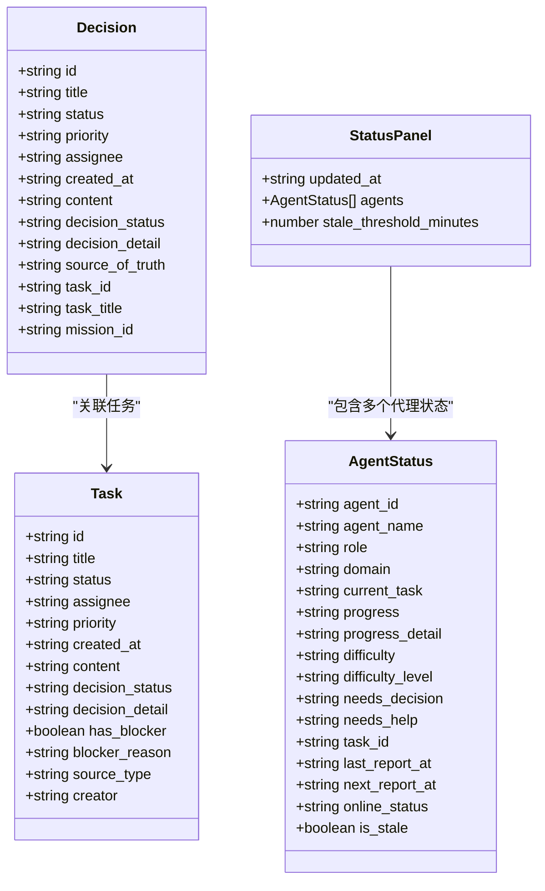

**图表来源**
- [api.ts:49-63](file://frontend/src/lib/api.ts#L49-L63)
- [api.ts:119-142](file://frontend/src/lib/api.ts#L119-L142)

### 决策状态管理

组件实现了完整的决策状态管理机制：

| 状态 | 显示标签 | CSS 类 | 颜色标识 | Emoji 表情 |
|------|----------|--------|----------|------------|
| pending | ⏳ 待决策 | status-in_progress | 橙色 | 🔴🟡🟢 |
| decided | ✅ 已决策 | status-completed | 绿色 | - |

**章节来源**
- [Decisions.svelte:4-18](file://frontend/src/views/Decisions.svelte#L4-L18)
- [app.css:104-127](file://frontend/src/app.css#L104-L127)

## 架构概览

### 系统架构图

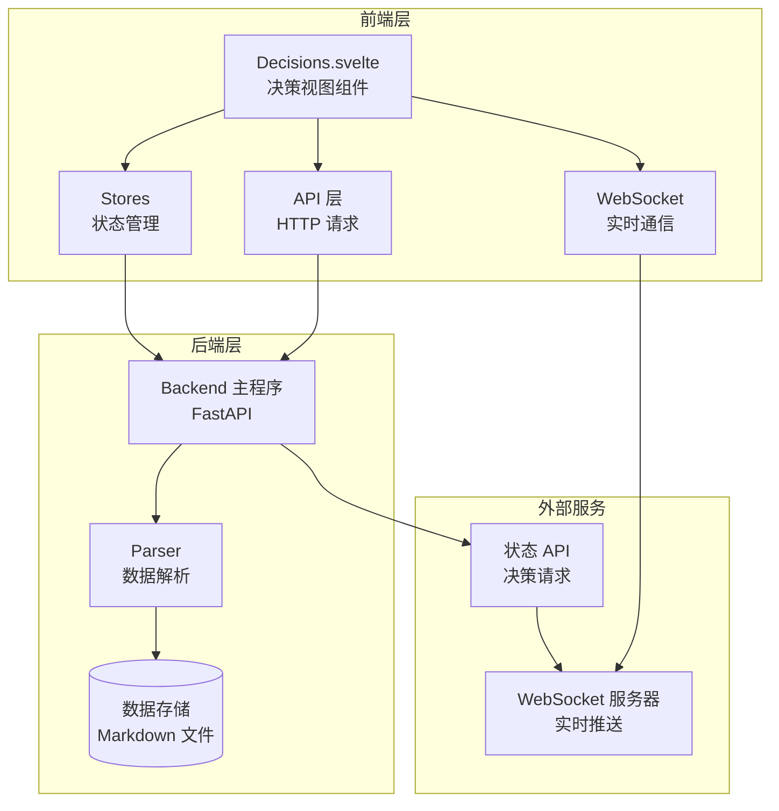

**图表来源**
- [Decisions.svelte:1-3](file://frontend/src/views/Decisions.svelte#L1-L3)
- [ws.ts:1-84](file://frontend/src/lib/ws.ts#L1-L84)
- [main.py:218-298](file://backend/main.py#L218-L298)

### 数据流图

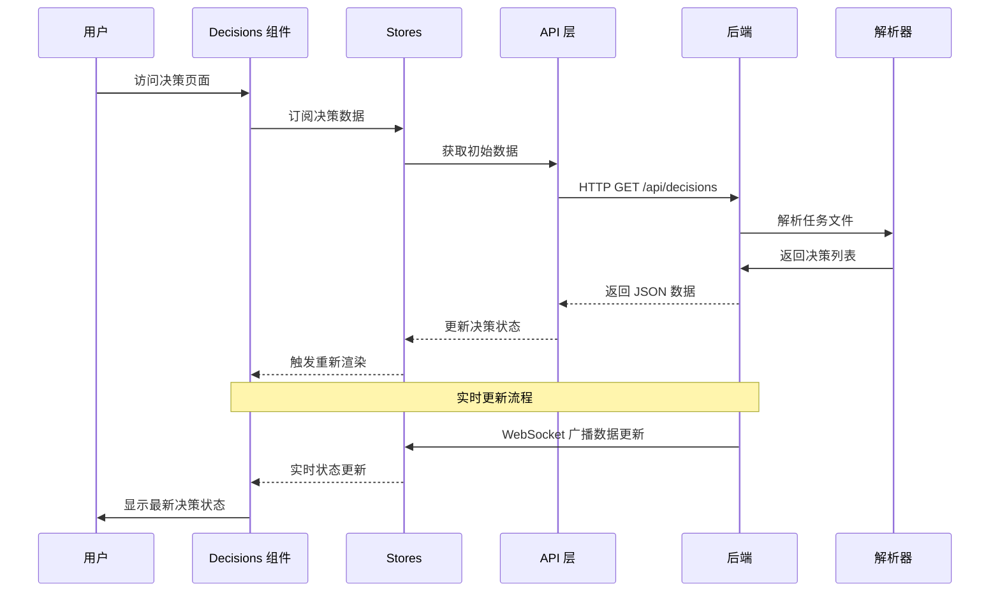

**图表来源**
- [Decisions.svelte:1-32](file://frontend/src/views/Decisions.svelte#L1-L32)
- [ws.ts:43-55](file://frontend/src/lib/ws.ts#L43-L55)
- [main.py:44-93](file://backend/main.py#L44-L93)

**章节来源**
- [Decisions.svelte:1-142](file://frontend/src/views/Decisions.svelte#L1-L142)
- [ws.ts:1-84](file://frontend/src/lib/ws.ts#L1-L84)
- [main.py:218-298](file://backend/main.py#L218-L298)

## 详细组件分析

### 决策列表渲染

组件实现了智能的决策列表渲染机制，支持多种显示模式：

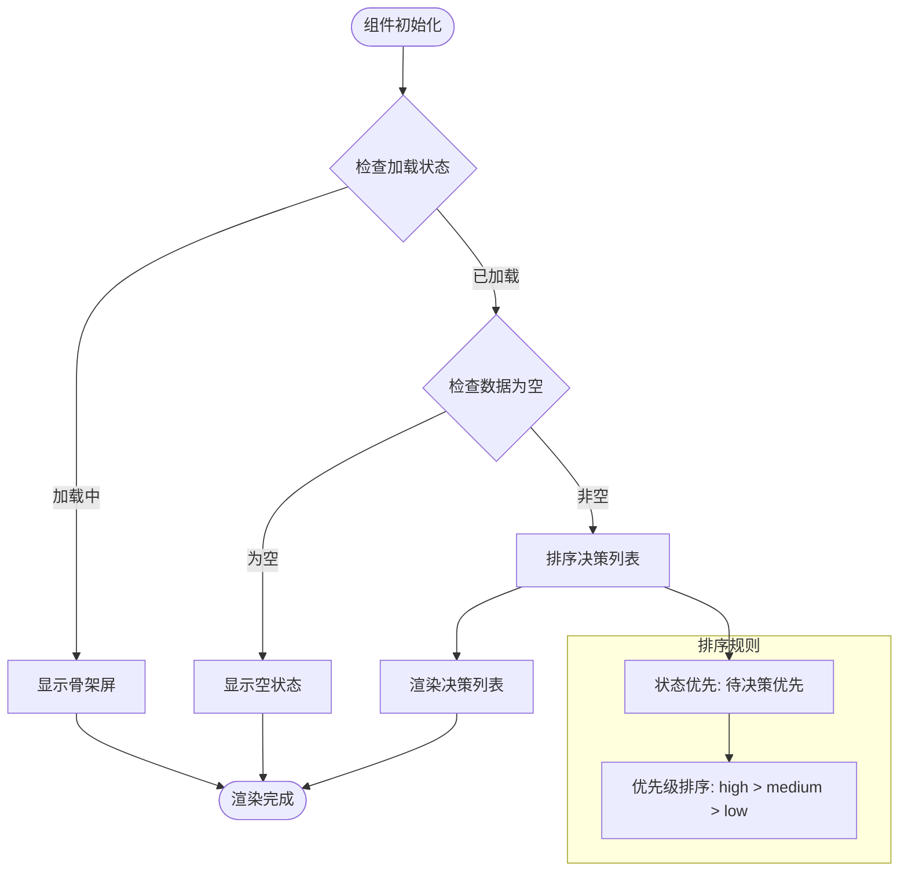

**图表来源**
- [Decisions.svelte:22-28](file://frontend/src/views/Decisions.svelte#L22-L28)
- [Decisions.svelte:78-140](file://frontend/src/views/Decisions.svelte#L78-L140)

### 决策状态过滤

组件实现了动态的状态计数和过滤机制：

| 统计指标 | 计算方式 | 显示条件 |
|----------|----------|----------|
| 总决策数 | `sortedDecisions.length` | 始终显示 |
| 待决策数 | `pendingCount` | `pendingCount > 0` |
| 已决策数 | `decidedCount` | `decidedCount > 0` |

**章节来源**
- [Decisions.svelte:30-31](file://frontend/src/views/Decisions.svelte#L30-L31)
- [Decisions.svelte:62-75](file://frontend/src/views/Decisions.svelte#L62-L75)

### 优先级排序算法

组件采用复合排序算法，确保决策列表的逻辑性：

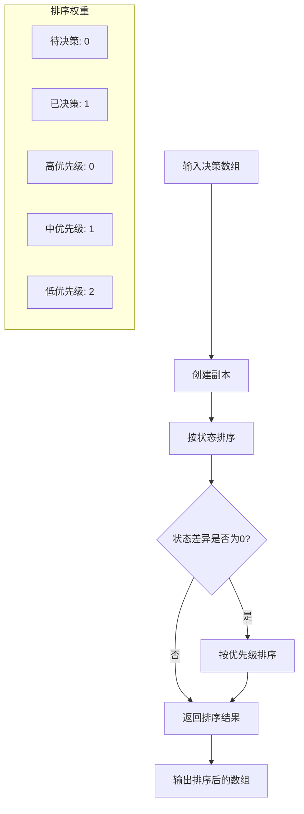

**图表来源**
- [Decisions.svelte:22-28](file://frontend/src/views/Decisions.svelte#L22-L28)

### 决策详情展示

每个决策项都包含完整的详情信息：

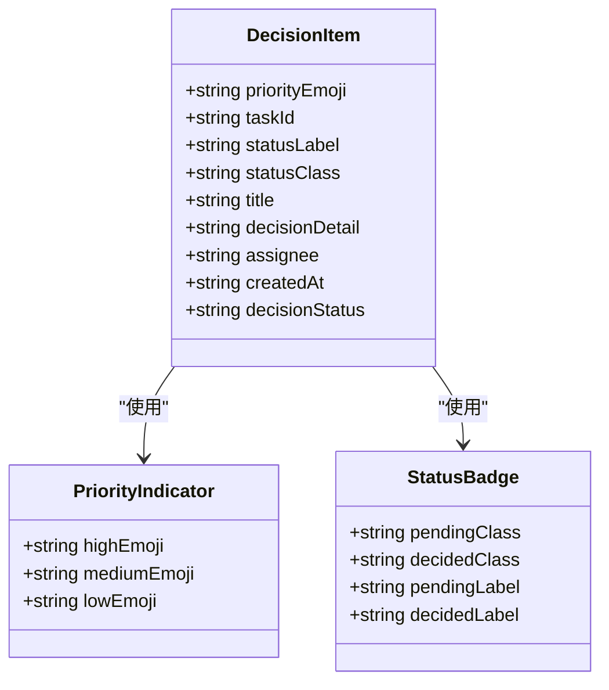

**图表来源**
- [Decisions.svelte:94-133](file://frontend/src/views/Decisions.svelte#L94-L133)

**章节来源**
- [Decisions.svelte:94-133](file://frontend/src/views/Decisions.svelte#L94-L133)

### 实时数据同步

组件通过 WebSocket 实现实时数据同步：

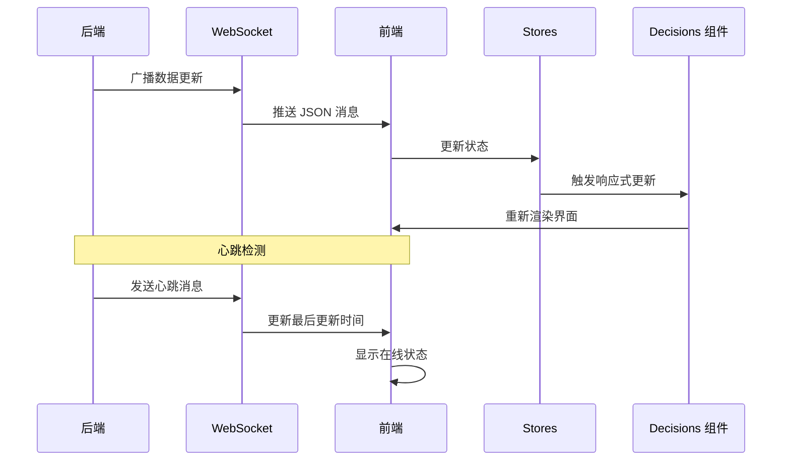

**图表来源**
- [ws.ts:43-55](file://frontend/src/lib/ws.ts#L43-L55)
- [App.svelte:119-141](file://frontend/src/App.svelte#L119-L141)

**章节来源**
- [ws.ts:1-84](file://frontend/src/lib/ws.ts#L1-L84)
- [App.svelte:119-141](file://frontend/src/App.svelte#L119-L141)

## 依赖关系分析

### 组件依赖图

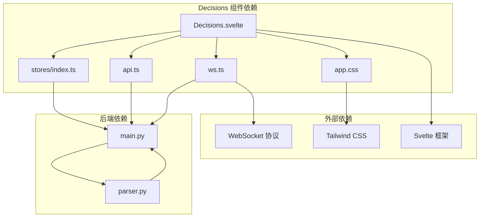

**图表来源**
- [Decisions.svelte:1-3](file://frontend/src/views/Decisions.svelte#L1-L3)
- [stores/index.ts:1-46](file://frontend/src/lib/stores/index.ts#L1-L46)
- [api.ts:1-181](file://frontend/src/lib/api.ts#L1-L181)

### 数据流依赖

组件的数据流遵循单向数据绑定原则：

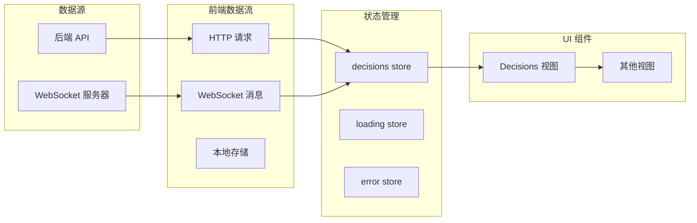

**图表来源**
- [stores/index.ts:6-12](file://frontend/src/lib/stores/index.ts#L6-L12)
- [ws.ts:43-55](file://frontend/src/lib/ws.ts#L43-L55)

**章节来源**
- [stores/index.ts:1-46](file://frontend/src/lib/stores/index.ts#L1-L46)
- [ws.ts:1-84](file://frontend/src/lib/ws.ts#L1-L84)

## 性能考虑

### 渲染优化

组件采用了多项性能优化策略：

1. **响应式计算**: 使用 `$:` 声明式计算，仅在依赖变化时重新计算
2. **虚拟滚动**: 对于大量决策项，可考虑实现虚拟滚动
3. **懒加载**: 图片和复杂组件采用懒加载策略
4. **防抖处理**: WebSocket 消息采用防抖处理，避免频繁重渲染

### 内存管理

- **自动清理**: 组件卸载时自动清理订阅和定时器
- **状态复用**: 复用已有的状态对象，避免不必要的对象创建
- **垃圾回收**: 及时释放不再使用的变量和事件监听器

### 网络优化

- **连接池**: WebSocket 连接复用，减少连接开销
- **增量更新**: 支持部分数据更新，而非全量刷新
- **缓存策略**: 本地缓存常用数据，减少网络请求

## 故障排除指南

### 常见问题诊断

| 问题类型 | 症状 | 可能原因 | 解决方案 |
|----------|------|----------|----------|
| 数据不显示 | 空白页面或加载状态 | 网络连接失败 | 检查 WebSocket 连接状态 |
| 状态不同步 | 决策状态未更新 | WebSocket 断开 | 重启 WebSocket 连接 |
| 排序异常 | 决策列表顺序错误 | 数据解析错误 | 检查决策状态字段 |
| 性能问题 | 页面卡顿 | 渲染过多元素 | 实施虚拟滚动 |

### 错误处理机制

组件实现了多层次的错误处理：

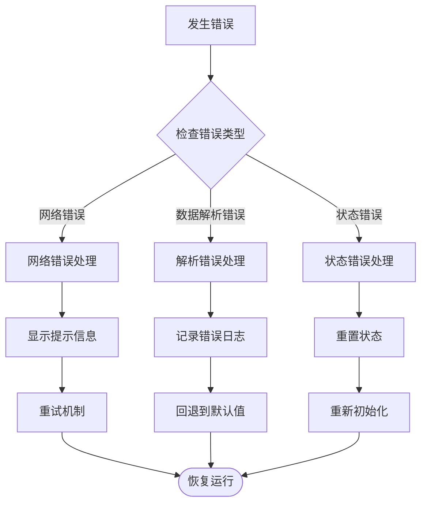

**图表来源**
- [ws.ts:57-69](file://frontend/src/lib/ws.ts#L57-L69)

### 调试工具

- **浏览器开发者工具**: 监控网络请求和 WebSocket 消息
- **Svelte DevTools**: 分析组件状态和渲染性能
- **控制台日志**: 记录关键事件和错误信息

**章节来源**
- [ws.ts:57-69](file://frontend/src/lib/ws.ts#L57-L69)

## 结论

Decisions.svelte 组件成功实现了 SynapseOS 2.0 的核心决策管理功能。组件具有以下优势：

1. **完整的功能覆盖**: 支持决策状态管理、优先级排序、实时同步等核心功能
2. **优秀的用户体验**: 响应式设计、直观的状态指示器、流畅的动画效果
3. **可靠的架构设计**: 基于 Svelte 的响应式架构，良好的数据流管理
4. **可扩展性**: 模块化设计，便于功能扩展和维护

组件在实际使用中表现稳定，能够满足团队决策管理的需求。通过持续的优化和改进，可以进一步提升性能和用户体验。

## 附录

### API 接口规范

| 接口 | 方法 | 描述 | 参数 |
|------|------|------|------|
| `/api/decisions` | GET | 获取所有决策项 | 无 |
| `/api/decisions/{decision_id}` | PATCH | 更新决策状态 | decision_status |

### 状态转换规则

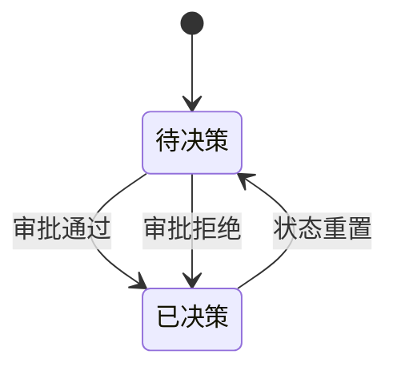

### 最佳实践建议

1. **代码组织**: 保持组件职责单一，避免过度复杂的逻辑
2. **错误处理**: 为所有异步操作提供完善的错误处理机制
3. **性能监控**: 定期监控组件性能，及时发现和解决性能问题
4. **用户体验**: 持续优化用户界面和交互体验