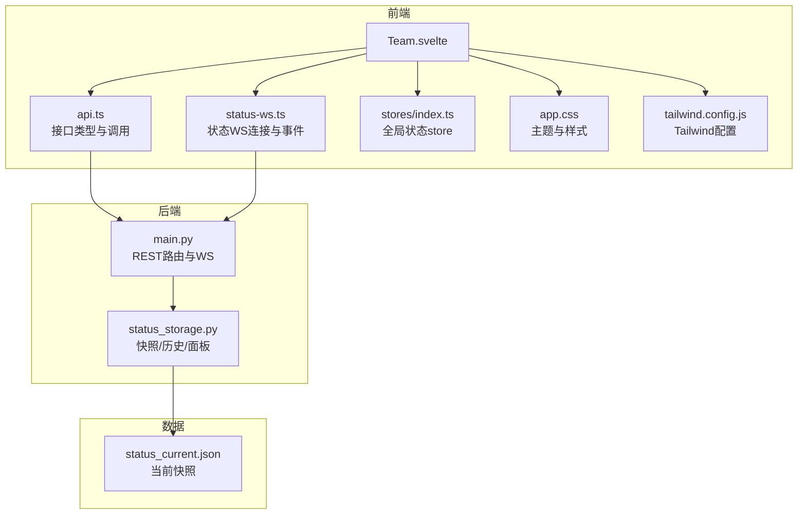
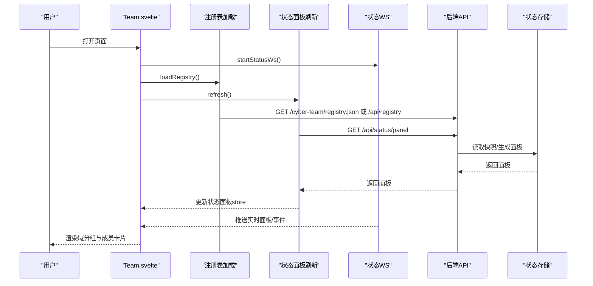
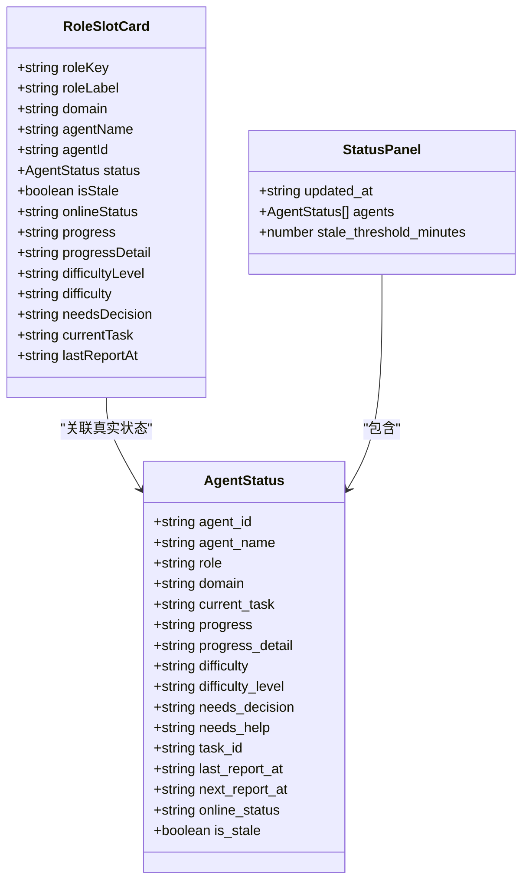
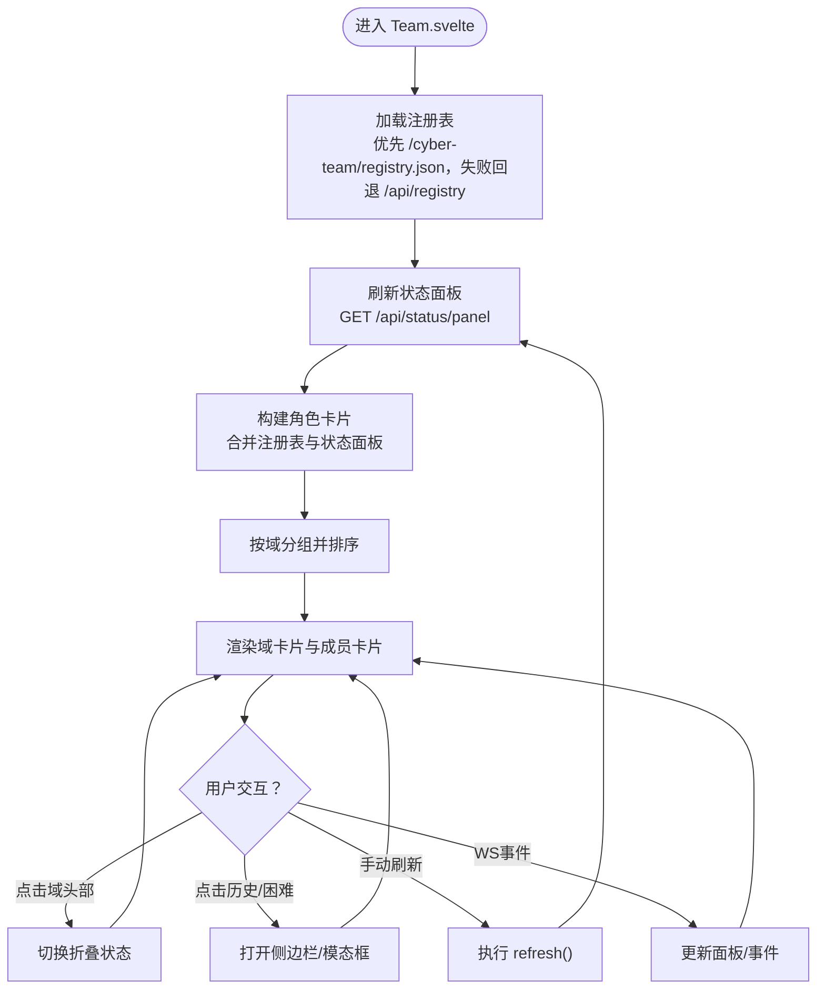
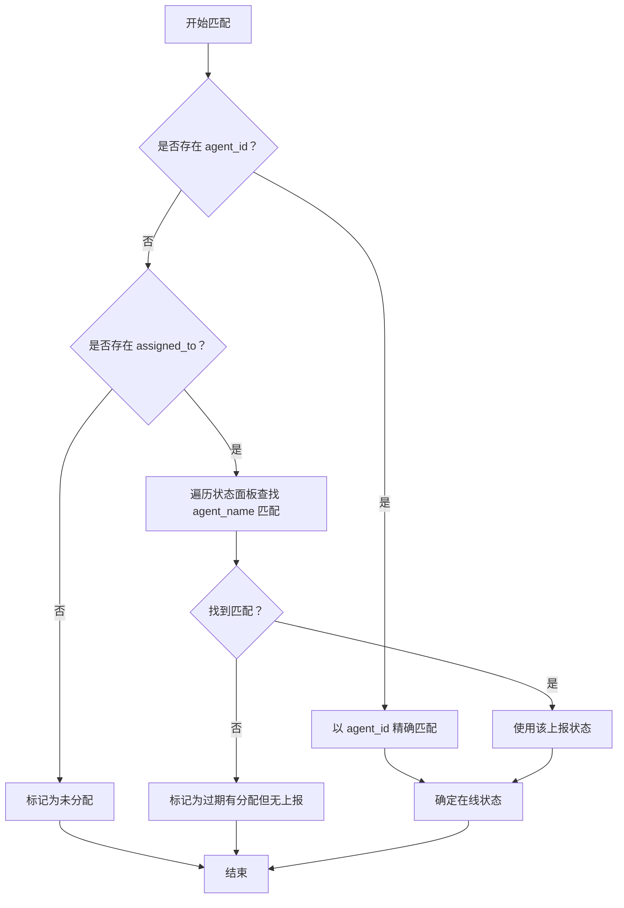
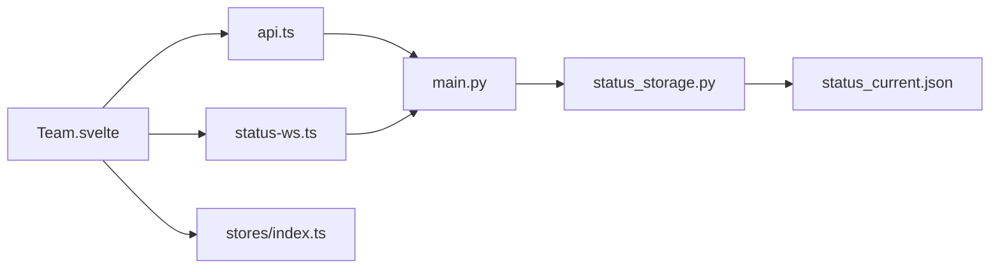

# 团队视图组件

<cite>
**本文引用的文件**
- [Team.svelte](file://frontend/src/views/Team.svelte)
- [api.ts](file://frontend/src/lib/api.ts)
- [status-ws.ts](file://frontend/src/lib/status-ws.ts)
- [stores/index.ts](file://frontend/src/lib/stores/index.ts)
- [app.css](file://frontend/src/app.css)
- [tailwind.config.js](file://frontend/tailwind.config.js)
- [package.json](file://frontend/package.json)
- [main.py](file://backend/main.py)
- [status_storage.py](file://backend/status_storage.py)
- [status_current.json](file://data/status_current.json)
</cite>

## 目录
1. [简介](#简介)
2. [项目结构](#项目结构)
3. [核心组件](#核心组件)
4. [架构概览](#架构概览)
5. [详细组件分析](#详细组件分析)
6. [依赖关系分析](#依赖关系分析)
7. [性能考虑](#性能考虑)
8. [故障排查指南](#故障排查指南)
9. [结论](#结论)
10. [附录](#附录)

## 简介
本文件为 SynapseOS 2.0 的 Team.svelte 团队视图组件的实现文档。该组件负责展示团队成员的角色分配、在线状态、工作负载与关键问题，并通过实时 WebSocket 与轮询机制实现动态更新。组件支持按“域”分组展示，提供成员头像占位符、状态指示器、任务进度与困难/待决策提示，并提供历史与困难弹窗入口。

## 项目结构
Team.svelte 位于前端 Svelte 应用的视图层，配合 API 层与 WebSocket 层实现数据拉取与实时推送；后端提供 REST API 与专用状态 WebSocket，存储层维护当前快照与历史记录。

图表来源
- [Team.svelte:1-507](file://frontend/src/views/Team.svelte#L1-L507)
- [api.ts:1-181](file://frontend/src/lib/api.ts#L1-L181)
- [status-ws.ts:1-78](file://frontend/src/lib/status-ws.ts#L1-L78)
- [stores/index.ts:1-46](file://frontend/src/lib/stores/index.ts#L1-L46)
- [app.css:1-165](file://frontend/src/app.css#L1-L165)
- [tailwind.config.js:1-40](file://frontend/tailwind.config.js#L1-L40)
- [main.py:300-495](file://backend/main.py#L300-L495)
- [status_storage.py:1-236](file://backend/status_storage.py#L1-L236)
- [status_current.json:1-59](file://data/status_current.json#L1-L59)

章节来源
- [Team.svelte:1-507](file://frontend/src/views/Team.svelte#L1-L507)
- [api.ts:1-181](file://frontend/src/lib/api.ts#L1-L181)
- [status-ws.ts:1-78](file://frontend/src/lib/status-ws.ts#L1-L78)
- [stores/index.ts:1-46](file://frontend/src/lib/stores/index.ts#L1-L46)
- [app.css:1-165](file://frontend/src/app.css#L1-L165)
- [tailwind.config.js:1-40](file://frontend/tailwind.config.js#L1-L40)
- [main.py:300-495](file://backend/main.py#L300-L495)
- [status_storage.py:1-236](file://backend/status_storage.py#L1-L236)
- [status_current.json:1-59](file://data/status_current.json#L1-L59)

## 核心组件
- 组件职责
  - 加载角色注册表（registry），合并后端状态面板（status panel）。
  - 计算每个角色槽位的在线状态、难度级别、是否需要决策、最近报到时间等。
  - 提供按域分组、折叠展开、刷新与实时连接状态指示。
  - 提供打开“历史”和“困难”详情的交互入口。
- 关键数据结构
  - 角色槽位卡片（RoleSlotCard）：包含角色键、角色标签、域、分配的成员信息、真实上报状态、是否过期、在线状态、进度与详情、难度等级与内容、是否需要决策、当前任务、最后报到时间等。
  - AgentStatus：后端上报的成员状态，包含成员标识、名称、角色、域、当前任务、进度、难度、是否需要决策、任务ID、最后/下次报到时间、在线状态与是否过期。
  - StatusPanel：聚合后的状态面板，包含更新时间、成员数组与过期阈值。
- 视觉呈现
  - 域标题使用带颜色与图标的徽标，域内统计点阵用于快速识别在线/过期/未分配情况。
  - 成员卡片采用玻璃态背景、悬停缩放、边框与背景色区分在线/过期/阻塞/待决策状态。
  - 头像占位符使用姓名首字符，支持中英文与括号内姓名的兼容处理。
  - 状态指示器使用圆点与脉冲动画表示在线，过期使用琥珀色，未分配使用浅色。
  - 进度标签映射为中文可读文本，便于非技术用户理解。
- 交互功能
  - 实时 WebSocket：连接状态以圆点与文字显示，断线自动重连。
  - 定时刷新：每 30 秒刷新一次状态面板与注册表，保证数据新鲜度。
  - 历史与困难：点击卡片上的按钮打开侧边栏或模态框，展示对应成员的历史与困难详情。
- 响应式布局
  - 使用 Tailwind 的网格系统在不同屏幕尺寸下自适应列数（1/2/3）。
  - 卡片采用统一的圆角、模糊背景与阴影，确保在深色主题下的可读性。
- 样式定制
  - 主题色变量集中于 CSS 变量与 Tailwind 扩展，支持统一风格。
  - 提供脉冲动画、玻璃卡片、霓虹文字等视觉元素，增强赛博朋克风格。
- 性能优化
  - 使用 Svelte 响应式计算避免重复渲染。
  - 仅在必要时触发刷新与 WS 连接，减少网络与 CPU 开销。
  - 注册表与状态面板的合并逻辑在组件内部完成，降低外部依赖复杂度。

章节来源
- [Team.svelte:1-507](file://frontend/src/views/Team.svelte#L1-L507)
- [api.ts:100-181](file://frontend/src/lib/api.ts#L100-L181)
- [status-ws.ts:1-78](file://frontend/src/lib/status-ws.ts#L1-L78)
- [stores/index.ts:1-46](file://frontend/src/lib/stores/index.ts#L1-L46)
- [app.css:1-165](file://frontend/src/app.css#L1-L165)
- [tailwind.config.js:1-40](file://frontend/tailwind.config.js#L1-L40)

## 架构概览
Team.svelte 通过以下流程实现团队视图的完整功能：

图表来源
- [Team.svelte:48-73](file://frontend/src/views/Team.svelte#L48-L73)
- [status-ws.ts:18-68](file://frontend/src/lib/status-ws.ts#L18-L68)
- [main.py:307-352](file://backend/main.py#L307-L352)
- [status_storage.py:102-126](file://backend/status_storage.py#L102-L126)

章节来源
- [Team.svelte:244-253](file://frontend/src/views/Team.svelte#L244-L253)
- [status-ws.ts:1-78](file://frontend/src/lib/status-ws.ts#L1-L78)
- [main.py:307-352](file://backend/main.py#L307-L352)
- [status_storage.py:102-126](file://backend/status_storage.py#L102-L126)

## 详细组件分析

### 数据模型与类型
- 角色槽位卡片（RoleSlotCard）
  - 字段：roleKey、roleLabel、domain、agentName、agentId、status、isStale、onlineStatus、progress、progressDetail、difficultyLevel、difficulty、needsDecision、currentTask、lastReportAt。
  - 用途：承载单个角色槽位的完整信息，用于渲染卡片与统计。
- AgentStatus
  - 字段：agent_id、agent_name、role、domain、current_task、progress、progress_detail、difficulty、difficulty_level、needs_decision、needs_help、task_id、last_report_at、next_report_at、online_status、is_stale。
  - 用途：后端上报的真实状态，作为实时数据源。
- StatusPanel
  - 字段：updated_at、agents（AgentStatus 数组）、stale_threshold_minutes。
  - 用途：聚合后的状态面板，包含过期阈值与成员集合。
- 注册表（registry）
  - 字段：roleKey 对应的分配信息（agentId、assigned_to 等）。
  - 用途：提供角色槽位与成员的静态映射，用于初始填充与匹配。

图表来源
- [Team.svelte:93-176](file://frontend/src/views/Team.svelte#L93-L176)
- [api.ts:101-142](file://frontend/src/lib/api.ts#L101-L142)

章节来源
- [Team.svelte:93-176](file://frontend/src/views/Team.svelte#L93-L176)
- [api.ts:101-142](file://frontend/src/lib/api.ts#L101-L142)

### 视觉呈现与交互
- 域分组与折叠
  - 使用 DOMAIN_META 提供域元信息（名称、表情符号、颜色、描述）。
  - 使用 collapsed 记录每个域的折叠状态，点击域头部切换。
- 成员卡片
  - 在线/过期/未分配/阻塞/待决策状态通过边框与背景色区分。
  - 头像占位符使用 initials 函数提取姓名首字符，支持中英文与括号姓名。
  - 显示当前任务、进度标签、难度/待决策徽章与最后报到时间。
- 实时与刷新
  - WS 连接状态以圆点与文字显示，断线自动重连。
  - 每 30 秒刷新一次状态面板与注册表，避免长时间不更新。
- 历史与困难
  - 打开历史侧边栏与困难模态框，均通过全局 store 控制显示与目标成员。

图表来源
- [Team.svelte:48-73](file://frontend/src/views/Team.svelte#L48-L73)
- [Team.svelte:125-176](file://frontend/src/views/Team.svelte#L125-L176)
- [Team.svelte:342-505](file://frontend/src/views/Team.svelte#L342-L505)
- [Team.svelte:234-242](file://frontend/src/views/Team.svelte#L234-L242)

章节来源
- [Team.svelte:15-21](file://frontend/src/views/Team.svelte#L15-L21)
- [Team.svelte:125-176](file://frontend/src/views/Team.svelte#L125-L176)
- [Team.svelte:342-505](file://frontend/src/views/Team.svelte#L342-L505)
- [Team.svelte:234-242](file://frontend/src/views/Team.svelte#L234-L242)

### 数据合并与匹配策略
- 匹配顺序
  - 优先使用 agent_id 精确匹配。
  - 若无 agent_id，则尝试基于 assigned_to 与 agent_name 的双向包含匹配。
  - 再次尝试去掉括号内容后的纯名匹配（处理“Reed（里德）”与“Susan（苏珊）”等）。
- 在线状态判定
  - 存在真实上报：若 is_stale 为真则标记为“过期”，否则为“在线”。
  - 有分配但无上报：标记为“过期”。
  - 无分配：标记为“未分配”。

图表来源
- [Team.svelte:133-146](file://frontend/src/views/Team.svelte#L133-L146)
- [Team.svelte:148-154](file://frontend/src/views/Team.svelte#L148-L154)

章节来源
- [Team.svelte:113-123](file://frontend/src/views/Team.svelte#L113-L123)
- [Team.svelte:133-154](file://frontend/src/views/Team.svelte#L133-L154)

### 统计与状态标签
- 统计指标
  - 总槽位、已分配、在线、过期、未分配、阻塞、待决策。
- 状态标签映射
  - progressLabel 将 progress 值映射为中文标签（规划中/开发中/测试中/部署中/已完成/空闲）。
- 时间显示
  - timeAgo 将 ISO 时间转换为“刚刚/XX分钟前/XX小时前”的人性化时间戳。

章节来源
- [Team.svelte:196-226](file://frontend/src/views/Team.svelte#L196-L226)

## 依赖关系分析
- 组件耦合
  - Team.svelte 依赖 api.ts 的 StatusPanel/AgentStatus 类型与 fetchStatusPanel。
  - 依赖 status-ws.ts 的 statusPanel、statusWsConnected 与 startStatusWs。
  - 依赖 stores/index.ts 的 showHistorySidebar、showDifficultyModal、statusDetailAgent。
- 外部依赖
  - Tailwind CSS 与自定义 CSS 变量提供主题与动画。
  - Svelte 响应式语法与 store 自动驱动 UI 更新。
- 后端集成
  - 注册表：优先从静态路径 /cyber-team/registry.json 获取，失败回退到 /api/registry。
  - 状态面板：GET /api/status/panel。
  - 实时 WS：/ws/status，接收 status_updated/difficulty_reported/decision_requested 事件。
  - 存储：status_current.json 作为快照，status_storage.py 提供快照与历史管理。

图表来源
- [Team.svelte:1-8](file://frontend/src/views/Team.svelte#L1-L8)
- [api.ts:1-181](file://frontend/src/lib/api.ts#L1-L181)
- [status-ws.ts:1-78](file://frontend/src/lib/status-ws.ts#L1-L78)
- [stores/index.ts:1-46](file://frontend/src/lib/stores/index.ts#L1-L46)
- [main.py:307-352](file://backend/main.py#L307-L352)
- [status_storage.py:1-236](file://backend/status_storage.py#L1-L236)
- [status_current.json:1-59](file://data/status_current.json#L1-L59)

章节来源
- [Team.svelte:1-8](file://frontend/src/views/Team.svelte#L1-L8)
- [api.ts:1-181](file://frontend/src/lib/api.ts#L1-L181)
- [status-ws.ts:1-78](file://frontend/src/lib/status-ws.ts#L1-L78)
- [stores/index.ts:1-46](file://frontend/src/lib/stores/index.ts#L1-L46)
- [main.py:307-352](file://backend/main.py#L307-L352)
- [status_storage.py:1-236](file://backend/status_storage.py#L1-L236)
- [status_current.json:1-59](file://data/status_current.json#L1-L59)

## 性能考虑
- 渲染优化
  - 使用 Svelte 响应式计算（$:）避免不必要的重渲染，仅在依赖变化时重建 computed 结果。
  - 域分组与排序在组件内部完成，减少外部库依赖。
- 网络与资源
  - 注册表与状态面板每 30 秒刷新一次，平衡实时性与性能。
  - WS 断线自动指数回退重连，最大延迟不超过 10 秒，避免频繁重连风暴。
- 存储与计算
  - 合并与匹配逻辑在前端完成，避免后端复杂计算。
  - 过期检测在后端完成，前端仅消费结果，减少前端计算负担。

## 故障排查指南
- 无法加载注册表
  - 现象：控制台警告“registry load failed”。
  - 排查：确认 /cyber-team/registry.json 是否存在且可访问；若不存在，检查 /api/registry 是否可用。
- 状态面板为空或长时间不变
  - 现象：卡片显示“空闲/未分配”，统计为 0。
  - 排查：确认 /api/status/panel 能返回有效面板；检查后端 status_storage.py 的快照文件 status_current.json 是否存在且格式正确。
- 实时 WS 不生效
  - 现象：连接状态始终为“离线”，卡片不随上报更新。
  - 排查：确认 /ws/status 路由可达；检查浏览器网络面板 WebSocket 握手与消息；查看后端日志是否有异常。
- 折叠状态丢失
  - 现象：刷新后域折叠状态恢复默认。
  - 说明：collapsed 为组件内局部状态，刷新会重置。若需持久化，可在 store 中保存折叠状态。
- 中文姓名显示异常
  - 现象：头像占位符显示为问号或异常字符。
  - 排查：确认 agentName 的编码与正则处理；initials 会过滤非中文/英文字母，必要时调整规则。

章节来源
- [Team.svelte:48-61](file://frontend/src/views/Team.svelte#L48-L61)
- [Team.svelte:64-73](file://frontend/src/views/Team.svelte#L64-L73)
- [status-ws.ts:51-63](file://frontend/src/lib/status-ws.ts#L51-L63)
- [status_storage.py:62-68](file://backend/status_storage.py#L62-L68)
- [status_current.json:1-59](file://data/status_current.json#L1-L59)

## 结论
Team.svelte 通过清晰的数据模型、简洁的合并策略与丰富的视觉反馈，实现了对团队成员角色、在线状态与工作负载的直观展示。结合实时 WebSocket 与定时刷新机制，组件在保证用户体验的同时兼顾了性能与可维护性。建议后续可引入注册表与面板的持久化折叠状态、更细粒度的权限控制与多语言支持，以进一步提升可用性。

## 附录
- 主题与样式
  - CSS 变量集中定义赛博朋克风格色彩；Tailwind 配置扩展了 cyber/bg/txt 系列颜色与字体族。
  - 提供玻璃卡片、脉冲光效、霓虹文字等通用类，便于复用。
- 依赖与构建
  - 前端使用 Svelte 4、TailwindCSS 与 Vite；后端使用 FastAPI 与 Uvicorn。
  - package.json 提供开发与构建脚本，便于本地调试与打包预览。

章节来源
- [app.css:5-16](file://frontend/src/app.css#L5-L16)
- [tailwind.config.js:6-35](file://frontend/tailwind.config.js#L6-L35)
- [package.json:1-24](file://frontend/package.json#L1-L24)