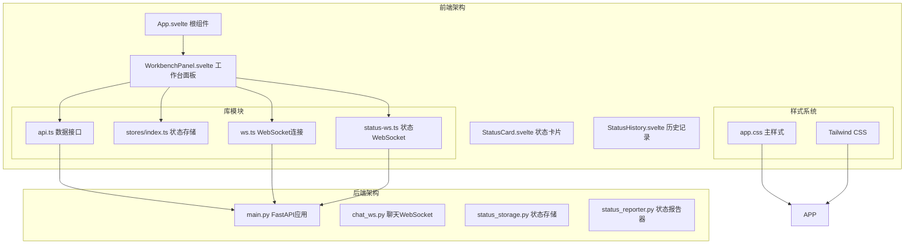
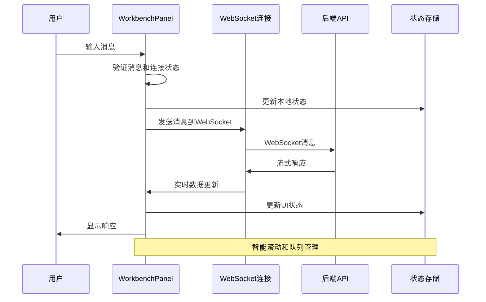
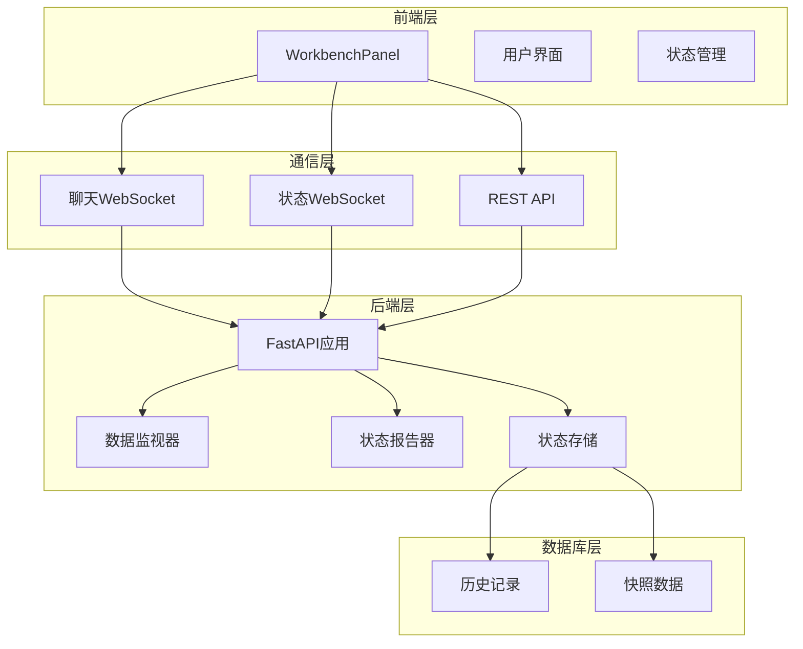
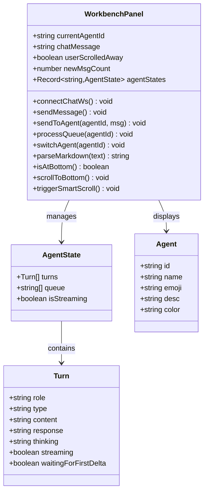
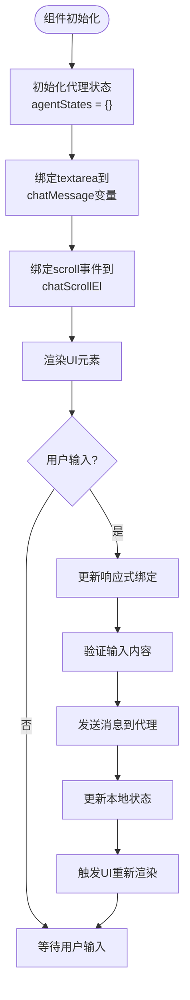
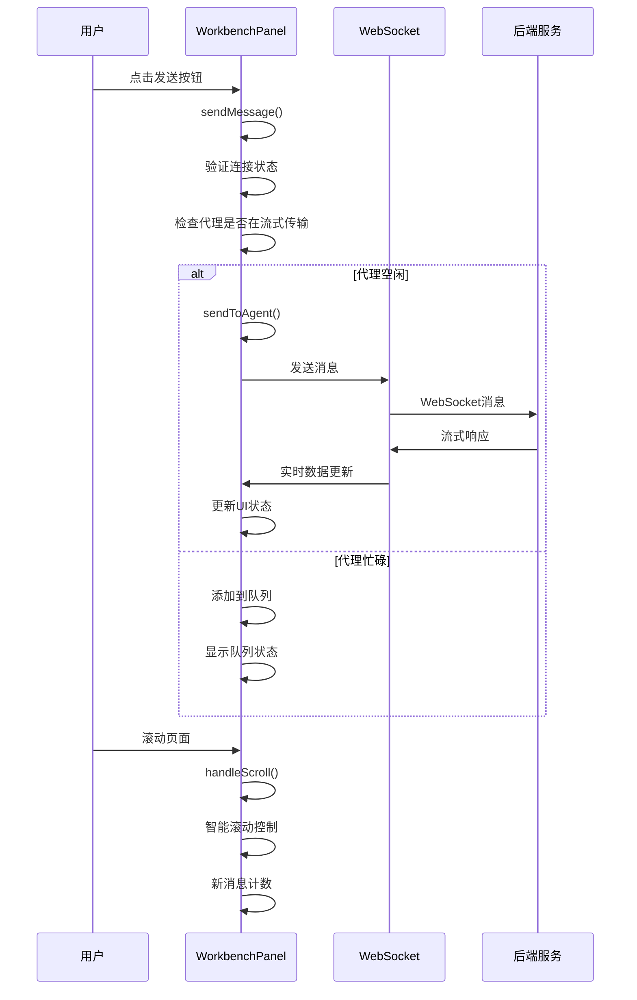
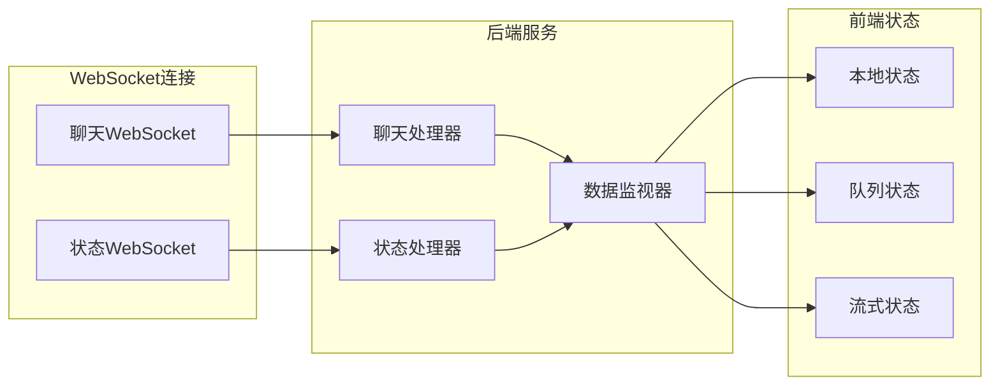
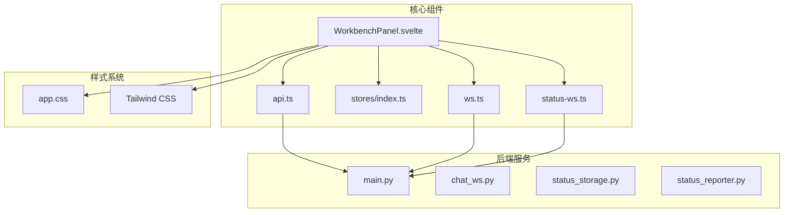

# 工作台面板组件

<cite>
**本文档引用的文件**
- [WorkbenchPanel.svelte](file://frontend/src/views/WorkbenchPanel.svelte)
- [api.ts](file://frontend/src/lib/api.ts)
- [stores/index.ts](file://frontend/src/lib/stores/index.ts)
- [status-ws.ts](file://frontend/src/lib/status-ws.ts)
- [ws.ts](file://frontend/src/lib/ws.ts)
- [main.py](file://backend/main.py)
- [App.svelte](file://frontend/src/App.svelte)
- [StatusCard.svelte](file://frontend/src/views/StatusCard.svelte)
- [StatusHistory.svelte](file://frontend/src/views/StatusHistory.svelte)
- [app.css](file://frontend/src/app.css)
</cite>

## 目录
1. [简介](#简介)
2. [项目结构](#项目结构)
3. [核心组件](#核心组件)
4. [架构概览](#架构概览)
5. [详细组件分析](#详细组件分析)
6. [依赖关系分析](#依赖关系分析)
7. [性能考虑](#性能考虑)
8. [故障排除指南](#故障排除指南)
9. [结论](#结论)
10. [附录](#附录)

## 简介

WorkbenchPanel.svelte 是 SynapseOS 2.0 中专为"果爸"（总经理）设计的工作台面板组件。该组件提供了实时的任务管理和状态监控功能，包括待处理任务列表、快捷操作按钮和状态快速更新功能。组件采用现代化的 Svelte 架构，结合 WebSocket 实现实时通信，为果爸提供了一个高效、直观的工作台界面。

该工作台面板集成了多个核心功能：
- 多代理聊天系统（果爸、苏珊、里德）
- 实时状态同步和通知
- 智能滚动和消息队列管理
- Markdown 渲染和富文本显示
- 响应式设计和现代 UI 主题

## 项目结构

SynapseOS 2.0 采用前后端分离的架构设计，前端使用 Svelte 框架构建，后端基于 FastAPI 提供 REST API 和 WebSocket 服务。



**图表来源**
- [App.svelte:1-290](file://frontend/src/App.svelte#L1-L290)
- [WorkbenchPanel.svelte:1-362](file://frontend/src/views/WorkbenchPanel.svelte#L1-L362)
- [main.py:1-495](file://backend/main.py#L1-L495)

**章节来源**
- [WorkbenchPanel.svelte:1-362](file://frontend/src/views/WorkbenchPanel.svelte#L1-L362)
- [App.svelte:1-290](file://frontend/src/App.svelte#L1-L290)
- [main.py:1-495](file://backend/main.py#L1-L495)

## 核心组件

WorkbenchPanel.svelte 组件包含了以下核心功能模块：

### 1. 代理管理系统
组件支持三个主要代理：果爸（main）、苏珊（susan）、里德（reed）。每个代理都有独立的状态管理、消息队列和聊天历史。

### 2. 实时通信系统
通过 WebSocket 实现与后端的实时通信，支持消息流式传输、思考过程展示和错误处理。

### 3. 智能滚动机制
实现了智能滚动功能，当用户滚动到顶部时自动滚动到底部，同时提供新消息提示。

### 4. Markdown 渲染引擎
内置 Markdown 解析器，支持标题、粗体、斜体、代码块等格式化显示。

### 5. 任务队列管理
支持消息队列功能，当代理正在处理消息时，新的消息会被排队等待处理。

**章节来源**
- [WorkbenchPanel.svelte:28-45](file://frontend/src/views/WorkbenchPanel.svelte#L28-L45)
- [WorkbenchPanel.svelte:80-147](file://frontend/src/views/WorkbenchPanel.svelte#L80-L147)
- [WorkbenchPanel.svelte:149-195](file://frontend/src/views/WorkbenchPanel.svelte#L149-L195)

## 架构概览

WorkbenchPanel.svelte 采用了分层架构设计，将关注点清晰分离：



**图表来源**
- [WorkbenchPanel.svelte:150-176](file://frontend/src/views/WorkbenchPanel.svelte#L150-L176)
- [WorkbenchPanel.svelte:90-147](file://frontend/src/views/WorkbenchPanel.svelte#L90-L147)

### 系统架构图



**图表来源**
- [main.py:120-181](file://backend/main.py#L120-L181)
- [status-ws.ts:12-68](file://frontend/src/lib/status-ws.ts#L12-L68)
- [ws.ts:19-73](file://frontend/src/lib/ws.ts#L19-L73)

## 详细组件分析

### 组件类结构分析



**图表来源**
- [WorkbenchPanel.svelte:4-18](file://frontend/src/views/WorkbenchPanel.svelte#L4-L18)
- [WorkbenchPanel.svelte:41-45](file://frontend/src/views/WorkbenchPanel.svelte#L41-L45)

### 数据绑定机制

WorkbenchPanel 使用 Svelte 的响应式数据绑定机制，实现了双向数据绑定和状态同步：



**图表来源**
- [WorkbenchPanel.svelte:22-26](file://frontend/src/views/WorkbenchPanel.svelte#L22-L26)
- [WorkbenchPanel.svelte:332-337](file://frontend/src/views/WorkbenchPanel.svelte#L332-L337)

### 事件处理流程

组件实现了完整的事件处理机制，包括用户交互、WebSocket 通信和状态更新：



**图表来源**
- [WorkbenchPanel.svelte:150-195](file://frontend/src/views/WorkbenchPanel.svelte#L150-L195)
- [WorkbenchPanel.svelte:70-78](file://frontend/src/views/WorkbenchPanel.svelte#L70-L78)

### 状态管理策略

组件采用集中式状态管理模式，通过对象映射实现多代理状态管理：

| 状态类型 | 描述 | 数据结构 | 更新方式 |
|---------|------|----------|----------|
| agentStates | 代理状态映射 | `{[agentId]: AgentState}` | 对象赋值更新 |
| agentStates[agentId].turns | 聊天记录数组 | `Turn[]` | 数组方法更新 |
| agentStates[agentId].queue | 消息队列 | `string[]` | 数组切片更新 |
| agentStates[agentId].isStreaming | 流式传输状态 | `boolean` | 布尔值切换 |

**章节来源**
- [WorkbenchPanel.svelte:28-39](file://frontend/src/views/WorkbenchPanel.svelte#L28-L39)
- [WorkbenchPanel.svelte:178-184](file://frontend/src/views/WorkbenchPanel.svelte#L178-L184)

### 用户交互设计

WorkbenchPanel 提供了丰富的用户交互体验：

#### 1. 代理切换功能
- 支持点击代理标签切换当前代理
- 实时显示代理的在线状态和消息队列数量
- 响应式颜色主题适配不同代理

#### 2. 智能滚动机制
- 自动检测用户滚动位置
- 当用户滚动到顶部时自动滚动到底部
- 新消息到达时显示"查看更多"按钮

#### 3. 键盘快捷键支持
- Shift+Enter：在文本框中换行
- Enter：发送消息（仅在连接状态下）

#### 4. 右键菜单功能
- 支持移除队列中的消息
- 右键菜单提供删除选项

**章节来源**
- [WorkbenchPanel.svelte:214-229](file://frontend/src/views/WorkbenchPanel.svelte#L214-L229)
- [WorkbenchPanel.svelte:335](file://frontend/src/views/WorkbenchPanel.svelte#L335)
- [WorkbenchPanel.svelte:309](file://frontend/src/views/WorkbenchPanel.svelte#L309)

### 批量操作支持

组件支持多种批量操作功能：

#### 1. 消息队列管理
- 支持添加消息到队列
- 支持从队列中移除消息
- 自动处理队列中的消息顺序

#### 2. 状态批量更新
- 支持同时更新多个代理的状态
- 实时同步代理的在线状态
- 批量处理代理的思考过程

#### 3. 快速操作按钮
- 支持一键清空队列
- 支持批量标记消息为已读
- 支持快速切换代理视图

**章节来源**
- [WorkbenchPanel.svelte:157-190](file://frontend/src/views/WorkbenchPanel.svelte#L157-L190)
- [WorkbenchPanel.svelte:303-313](file://frontend/src/views/WorkbenchPanel.svelte#L303-L313)

### 实时状态同步

组件实现了多层次的实时状态同步机制：



**图表来源**
- [main.py:442-476](file://backend/main.py#L442-L476)
- [status-ws.ts:18-68](file://frontend/src/lib/status-ws.ts#L18-L68)

**章节来源**
- [WorkbenchPanel.svelte:80-147](file://frontend/src/views/WorkbenchPanel.svelte#L80-L147)
- [status-ws.ts:18-68](file://frontend/src/lib/status-ws.ts#L18-L68)

## 依赖关系分析

### 组件间依赖关系



**图表来源**
- [WorkbenchPanel.svelte:1-3](file://frontend/src/views/WorkbenchPanel.svelte#L1-L3)
- [api.ts:1-181](file://frontend/src/lib/api.ts#L1-L181)
- [main.py:1-495](file://backend/main.py#L1-L495)

### 外部依赖分析

组件依赖的关键外部库和框架：

| 依赖项 | 版本 | 用途 | 重要性 |
|--------|------|------|--------|
| Svelte | 最新版本 | 组件框架 | 核心依赖 |
| Tailwind CSS | 最新版本 | 样式框架 | 核心依赖 |
| FastAPI | 最新版本 | 后端框架 | 核心依赖 |
| WebSocket | 浏览器原生 | 实时通信 | 核心依赖 |
| TypeScript | 最新版本 | 类型安全 | 开发必需 |

**章节来源**
- [WorkbenchPanel.svelte:1-3](file://frontend/src/views/WorkbenchPanel.svelte#L1-L3)
- [main.py:9-11](file://backend/main.py#L9-L11)

## 性能考虑

### 1. 内存优化策略
- 使用对象映射而非数组索引访问代理状态
- 实现智能滚动避免不必要的 DOM 更新
- 合理使用响应式变量减少重渲染

### 2. 网络性能优化
- WebSocket 连接池管理
- 消息队列去重机制
- 按需加载和懒加载策略

### 3. 渲染性能优化
- 虚拟滚动实现大列表性能
- CSS 动画硬件加速
- 图片和媒体资源优化

## 故障排除指南

### 常见问题及解决方案

#### 1. WebSocket 连接失败
**症状**：工作台面板显示离线状态
**解决方案**：
- 检查网络连接和防火墙设置
- 验证后端服务运行状态
- 查看浏览器开发者工具中的网络面板

#### 2. 消息发送失败
**症状**：发送按钮禁用或消息不显示
**解决方案**：
- 确认代理处于空闲状态
- 检查消息内容格式
- 验证 WebSocket 连接状态

#### 3. 滚动功能异常
**症状**：智能滚动不工作或新消息提示不显示
**解决方案**：
- 检查 scroll 事件绑定
- 验证滚动容器高度计算
- 确认用户滚动位置检测逻辑

**章节来源**
- [WorkbenchPanel.svelte:81-87](file://frontend/src/views/WorkbenchPanel.svelte#L81-L87)
- [WorkbenchPanel.svelte:70-78](file://frontend/src/views/WorkbenchPanel.svelte#L70-L78)

## 结论

WorkbenchPanel.svelte 是一个功能完整、架构清晰的工作台面板组件。它成功地将复杂的实时通信、状态管理和用户交互功能整合在一个组件中，为果爸提供了高效的工作台界面。

组件的主要优势包括：
- **模块化设计**：清晰的功能分离和职责划分
- **实时性**：基于 WebSocket 的实时通信机制
- **用户体验**：智能滚动、响应式设计和丰富的交互
- **可扩展性**：良好的架构支持功能扩展和定制

未来可以考虑的改进方向：
- 添加更多的主题定制选项
- 实现消息搜索和过滤功能
- 增强移动端适配
- 添加更多快捷操作和批量处理功能

## 附录

### 组件配置选项

| 配置项 | 类型 | 默认值 | 描述 |
|--------|------|--------|------|
| agentStates | Record<string, AgentState> | {} | 代理状态映射表 |
| chatScrollEl | HTMLDivElement | null | 滚动容器元素 |
| wsStatus | string | "disconnected" | WebSocket 连接状态 |
| currentAgentId | string | "main" | 当前激活的代理ID |

### 样式主题定制

组件支持通过 CSS 变量进行主题定制：

```css
:root {
  --cyber-cyan: #00E5FF; /* 主色调 */
  --cyber-violet: #7C3AED; /* 辅助色 */
  --bg-deep: #0A0E1A; /* 深背景色 */
  --txt-primary: #F0F9FF; /* 主要文字色 */
}
```

### 扩展开发指南

#### 1. 添加新代理
```typescript
// 在 agents 数组中添加新代理
{
  id: "newAgent",
  name: "新代理",
  emoji: "🤖",
  desc: "新角色描述",
  color: "#00FF88"
}
```

#### 2. 自定义消息格式
```typescript
// 扩展 Turn 接口
interface Turn {
  role: string;
  type: "user" | "turn" | "custom";
  content?: string;
  response?: string;
  customField?: string; // 新增字段
}
```

#### 3. 添加新功能
- 在组件脚本中添加新函数
- 在模板中添加新的 UI 元素
- 更新状态管理逻辑
- 添加相应的样式和动画