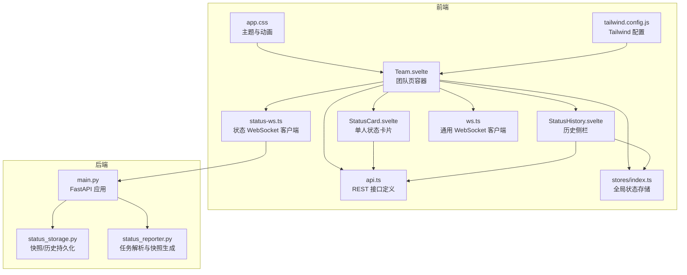
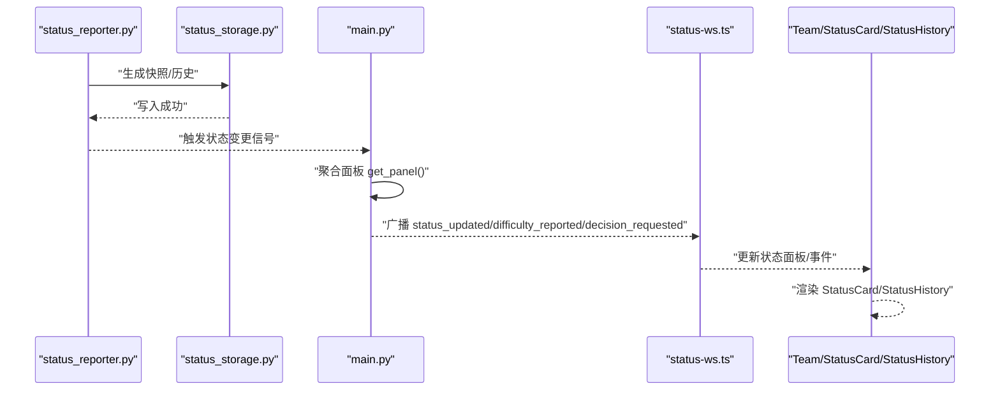
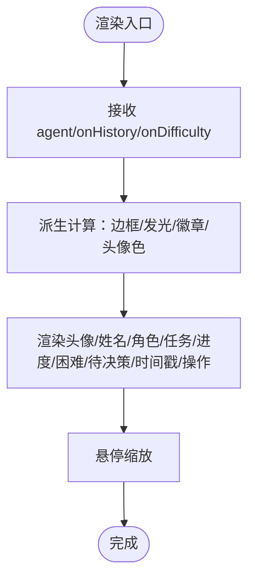
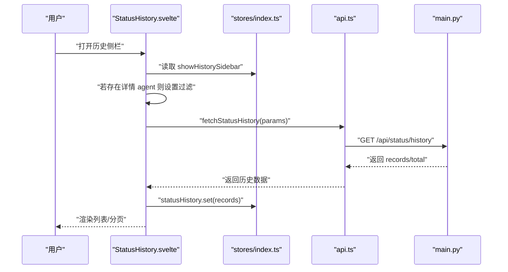
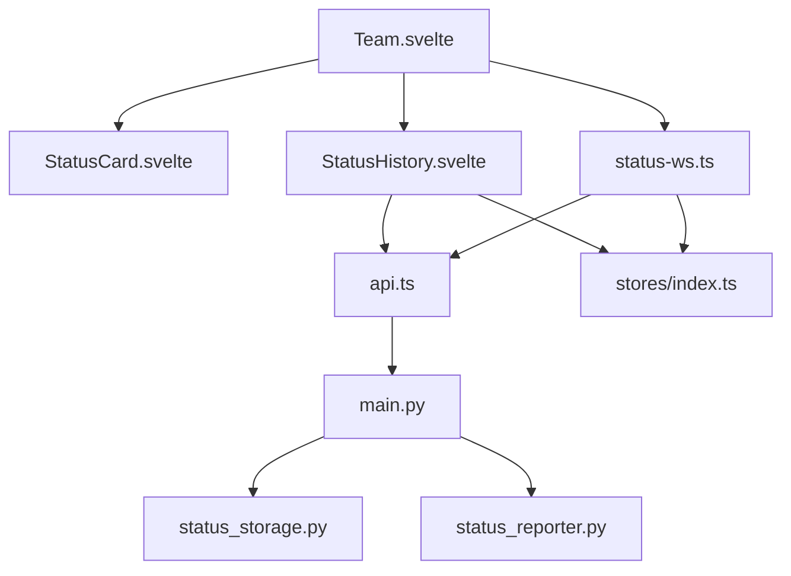

# 状态展示组件

<cite>
**本文引用的文件**
- [StatusCard.svelte](file://frontend/src/views/StatusCard.svelte)
- [StatusHistory.svelte](file://frontend/src/views/StatusHistory.svelte)
- [Team.svelte](file://frontend/src/views/Team.svelte)
- [api.ts](file://frontend/src/lib/api.ts)
- [stores/index.ts](file://frontend/src/lib/stores/index.ts)
- [status-ws.ts](file://frontend/src/lib/status-ws.ts)
- [ws.ts](file://frontend/src/lib/ws.ts)
- [app.css](file://frontend/src/app.css)
- [tailwind.config.js](file://frontend/tailwind.config.js)
- [main.py](file://backend/main.py)
- [status_storage.py](file://backend/status_storage.py)
- [status_reporter.py](file://backend/status_reporter.py)
</cite>

## 目录
1. [简介](#简介)
2. [项目结构](#项目结构)
3. [核心组件](#核心组件)
4. [架构总览](#架构总览)
5. [组件详解](#组件详解)
6. [依赖关系分析](#依赖关系分析)
7. [性能考量](#性能考量)
8. [故障排查指南](#故障排查指南)
9. [结论](#结论)
10. [附录](#附录)

## 简介
本文件面向 SynapseOS 2.0 的状态展示组件集合，聚焦以下目标：
- 详细说明 StatusCard 如何以卡片形式展示单个成员的状态信息，包括状态徽章、时间戳与简要描述。
- 记录 StatusHistory 如何展示状态历史记录，包括时间线布局、历史对比与趋势分析。
- 描述两个组件的数据绑定方式、状态更新机制与实时同步功能。
- 提供组件的视觉设计规范、响应式布局与动画效果。
- 给出组件的使用场景、集成方式与性能优化建议。

## 项目结构
前端采用 Svelte + TailwindCSS 架构，后端基于 FastAPI 提供 REST 与 WebSocket 服务。状态数据由后端解析任务文件生成快照与历史，并通过专用状态 WebSocket 实时广播。



**图表来源**
- [Team.svelte](file://frontend/src/views/Team.svelte)
- [StatusCard.svelte](file://frontend/src/views/StatusCard.svelte)
- [StatusHistory.svelte](file://frontend/src/views/StatusHistory.svelte)
- [api.ts](file://frontend/src/lib/api.ts)
- [stores/index.ts](file://frontend/src/lib/stores/index.ts)
- [status-ws.ts](file://frontend/src/lib/status-ws.ts)
- [ws.ts](file://frontend/src/lib/ws.ts)
- [app.css](file://frontend/src/app.css)
- [tailwind.config.js](file://frontend/tailwind.config.js)
- [main.py](file://backend/main.py)
- [status_storage.py](file://backend/status_storage.py)
- [status_reporter.py](file://backend/status_reporter.py)

**章节来源**
- [Team.svelte](file://frontend/src/views/Team.svelte)
- [StatusCard.svelte](file://frontend/src/views/StatusCard.svelte)
- [StatusHistory.svelte](file://frontend/src/views/StatusHistory.svelte)
- [api.ts](file://frontend/src/lib/api.ts)
- [stores/index.ts](file://frontend/src/lib/stores/index.ts)
- [status-ws.ts](file://frontend/src/lib/status-ws.ts)
- [ws.ts](file://frontend/src/lib/ws.ts)
- [app.css](file://frontend/src/app.css)
- [tailwind.config.js](file://frontend/tailwind.config.js)
- [main.py](file://backend/main.py)
- [status_storage.py](file://backend/status_storage.py)
- [status_reporter.py](file://backend/status_reporter.py)

## 核心组件
- StatusCard：展示单个成员的当前状态，包含头像、角色领域、当前任务、进展、困难/待决策状态、时间戳与操作入口。
- StatusHistory：以侧栏抽屉形式展示历史记录，支持筛选、分页与加载态，呈现汇报、困难与决策三类事件的时间线。

**章节来源**
- [StatusCard.svelte](file://frontend/src/views/StatusCard.svelte)
- [StatusHistory.svelte](file://frontend/src/views/StatusHistory.svelte)

## 架构总览
状态数据流自后端解析任务文件生成快照与历史，通过专用 WebSocket 广播给前端；前端通过状态存储与组件绑定实现实时更新。



**图表来源**
- [status_reporter.py](file://backend/status_reporter.py)
- [status_storage.py](file://backend/status_storage.py)
- [main.py](file://backend/main.py)
- [status-ws.ts](file://frontend/src/lib/status-ws.ts)
- [Team.svelte](file://frontend/src/views/Team.svelte)
- [StatusCard.svelte](file://frontend/src/views/StatusCard.svelte)
- [StatusHistory.svelte](file://frontend/src/views/StatusHistory.svelte)

## 组件详解

### StatusCard 组件
- 数据模型与绑定
  - 输入属性：agent（AgentStatus）、onHistory、onDifficulty。
  - 使用派生计算：根据难度等级、是否需要决策、是否超时等动态决定边框颜色、发光效果与徽章文本。
  - 时间戳：基于 last_report_at 计算“多久之前”。
- 视觉与交互
  - 头像：按 agent_id 选择渐变色，底部在线状态点支持脉冲动画。
  - 进度：多语言标签映射，支持简要详情。
  - 困难/待决策：两列网格徽章，阻塞/需要决策时高亮。
  - 操作：历史与困难入口，回调传递 agentId。
- 动画与样式
  - 卡片悬停缩放、玻璃态背景、发光边框与脉冲点。
  - Tailwind 自定义主题色与动效类。



**图表来源**
- [StatusCard.svelte](file://frontend/src/views/StatusCard.svelte)
- [app.css](file://frontend/src/app.css)
- [tailwind.config.js](file://frontend/tailwind.config.js)

**章节来源**
- [StatusCard.svelte](file://frontend/src/views/StatusCard.svelte)
- [app.css](file://frontend/src/app.css)
- [tailwind.config.js](file://frontend/tailwind.config.js)

### StatusHistory 组件
- 数据加载与过滤
  - 依赖 stores：showHistorySidebar、statusDetailAgent、statusHistory、statusHistoryLoading。
  - 打开时自动加载：支持按 agent_id 与 type 过滤，分页参数 page/limit。
  - 加载态：骨架屏。
- 展示与交互
  - 列表项：类型图标/标签、时间戳、任务 ID、进度/困难/决策/需求摘要。
  - 分页：上一页/下一页。
  - 关闭：清除过滤条件与详情 agent。
- 视觉与动画
  - 抽屉侧栏、玻璃态卡片、列表悬停边框变化。



**图表来源**
- [StatusHistory.svelte](file://frontend/src/views/StatusHistory.svelte)
- [stores/index.ts](file://frontend/src/lib/stores/index.ts)
- [api.ts](file://frontend/src/lib/api.ts)
- [main.py](file://backend/main.py)

**章节来源**
- [StatusHistory.svelte](file://frontend/src/views/StatusHistory.svelte)
- [stores/index.ts](file://frontend/src/lib/stores/index.ts)
- [api.ts](file://frontend/src/lib/api.ts)
- [main.py](file://backend/main.py)

### 数据绑定、状态更新与实时同步
- 前端状态存储
  - stores/index.ts：statusPanel、statusHistory、statusHistoryLoading、statusDetailAgent、showHistorySidebar、showDifficultyModal 等。
- 状态 WebSocket
  - status-ws.ts：连接 /ws/status，监听 status_updated、difficulty_reported、decision_requested，分别更新面板与事件。
  - Team.svelte：在 onMount 启动状态 WebSocket，周期性刷新面板，合并注册表与状态面板，驱动 StatusCard 渲染。
- REST 接口
  - api.ts：fetchStatusPanel、fetchStatusHistory、postStatusReport 等。
- 后端广播
  - main.py：后台线程定期运行 status_reporter，写入快照并广播状态更新；收到上报请求时根据内容类型广播不同事件。

```mermaid
graph LR
subgraph "前端"
S1["status-ws.ts"] --> P1["statusPanel"]
S1 --> E1["statusEvents"]
T1["Team.svelte"] --> P1
T1 --> C1["StatusCard.svelte"]
H1["StatusHistory.svelte"] --> P1
H1 --> S2["stores/index.ts"]
end
subgraph "后端"
R1["status_reporter.py"] --> M1["main.py"]
M1 --> S3["status_storage.py"]
M1 --> WS1["/ws/status"]
end
P1 <- --> WS1
E1 <- --> WS1
```

**图表来源**
- [status-ws.ts](file://frontend/src/lib/status-ws.ts)
- [Team.svelte](file://frontend/src/views/Team.svelte)
- [StatusCard.svelte](file://frontend/src/views/StatusCard.svelte)
- [StatusHistory.svelte](file://frontend/src/views/StatusHistory.svelte)
- [stores/index.ts](file://frontend/src/lib/stores/index.ts)
- [main.py](file://backend/main.py)
- [status_storage.py](file://backend/status_storage.py)
- [status_reporter.py](file://backend/status_reporter.py)

**章节来源**
- [status-ws.ts](file://frontend/src/lib/status-ws.ts)
- [Team.svelte](file://frontend/src/views/Team.svelte)
- [StatusCard.svelte](file://frontend/src/views/StatusCard.svelte)
- [StatusHistory.svelte](file://frontend/src/views/StatusHistory.svelte)
- [stores/index.ts](file://frontend/src/lib/stores/index.ts)
- [main.py](file://backend/main.py)
- [status_storage.py](file://backend/status_storage.py)
- [status_reporter.py](file://backend/status_reporter.py)

### 视觉设计规范、响应式布局与动画效果
- 主题色与字体
  - 自定义变量：cyber-cyan、cyber-violet、cyber-amber、cyber-green、cyber-red、bg-deep/mid/light、txt-primary/secondary。
  - 字体：Orbitron/Rajdhani/Inter/JetBrains Mono/Noto Sans SC。
- 卡片与边框
  - glass-card：模糊背景、细边框、阴影；hover 增强。
  - 边框与发光：根据状态动态切换，阻塞/待决策时高亮。
- 动画
  - pulse-glow：脉冲光点。
  - float-anim：浮动动画。
  - page-enter：页面进入动画。
- 响应式
  - Team.svelte 使用网格布局，随屏幕尺寸调整列数；StatusHistory 为固定宽度抽屉。

**章节来源**
- [app.css](file://frontend/src/app.css)
- [tailwind.config.js](file://frontend/tailwind.config.js)
- [Team.svelte](file://frontend/src/views/Team.svelte)
- [StatusHistory.svelte](file://frontend/src/views/StatusHistory.svelte)

### 使用场景与集成方式
- 使用场景
  - StatusCard：团队页角色卡片区域，展示单个成员实时状态与快速入口。
  - StatusHistory：点击“历史”打开侧栏，查看某成员或全量的历史记录，支持筛选与分页。
- 集成方式
  - Team.svelte 作为容器，负责启动状态 WebSocket、拉取注册表与面板、渲染 StatusCard 列表。
  - StatusCard 通过回调触发全局状态（如 showHistorySidebar、statusDetailAgent）以打开历史侧栏。
  - StatusHistory 依赖全局状态与 REST 接口加载历史数据。

**章节来源**
- [Team.svelte](file://frontend/src/views/Team.svelte)
- [StatusCard.svelte](file://frontend/src/views/StatusCard.svelte)
- [StatusHistory.svelte](file://frontend/src/views/StatusHistory.svelte)
- [stores/index.ts](file://frontend/src/lib/stores/index.ts)
- [api.ts](file://frontend/src/lib/api.ts)

## 依赖关系分析
- 组件耦合
  - Team.svelte 与 StatusCard：容器-子组件关系，通过 props 传入 agent 与回调。
  - StatusHistory 与 stores：读取/写入全局状态，依赖 API 获取数据。
- 外部依赖
  - WebSocket：/ws（通用）、/ws/status（状态专用）。
  - REST：/api/status/panel、/api/status/history、/api/status/report 等。
- 数据一致性
  - 后端通过 get_panel() 计算 is_stale，前端据此渲染视觉状态。



**图表来源**
- [Team.svelte](file://frontend/src/views/Team.svelte)
- [StatusCard.svelte](file://frontend/src/views/StatusCard.svelte)
- [StatusHistory.svelte](file://frontend/src/views/StatusHistory.svelte)
- [status-ws.ts](file://frontend/src/lib/status-ws.ts)
- [api.ts](file://frontend/src/lib/api.ts)
- [stores/index.ts](file://frontend/src/lib/stores/index.ts)
- [main.py](file://backend/main.py)
- [status_storage.py](file://backend/status_storage.py)
- [status_reporter.py](file://backend/status_reporter.py)

**章节来源**
- [Team.svelte](file://frontend/src/views/Team.svelte)
- [StatusCard.svelte](file://frontend/src/views/StatusCard.svelte)
- [StatusHistory.svelte](file://frontend/src/views/StatusHistory.svelte)
- [status-ws.ts](file://frontend/src/lib/status-ws.ts)
- [api.ts](file://frontend/src/lib/api.ts)
- [stores/index.ts](file://frontend/src/lib/stores/index.ts)
- [main.py](file://backend/main.py)
- [status_storage.py](file://backend/status_storage.py)
- [status_reporter.py](file://backend/status_reporter.py)

## 性能考量
- 前端
  - 状态 WebSocket：独立通道减少无关广播，降低渲染压力。
  - 组件粒度：StatusCard 仅渲染必要字段，避免大对象深拷贝。
  - 列表渲染：StatusHistory 使用分页与骨架屏，控制一次性渲染数量。
- 后端
  - 任务解析：status_reporter 每 60 秒扫描，避免频繁 IO。
  - 广播去抖：通用数据变更使用 debounce，状态变更直接广播。
  - 历史查询：按需过滤与反向排序，限制每页最大条数。

**章节来源**
- [main.py](file://backend/main.py)
- [status_reporter.py](file://backend/status_reporter.py)
- [StatusHistory.svelte](file://frontend/src/views/StatusHistory.svelte)
- [api.ts](file://frontend/src/lib/api.ts)

## 故障排查指南
- WebSocket 连接异常
  - 检查 status-ws.ts 连接日志与 reconnectDelay 指数退避。
  - 确认 /ws/status 是否可达，浏览器网络面板观察握手与心跳。
- 状态不更新
  - 确认后端 status_reporter 是否正常运行，面板是否写入快照。
  - 前端 onMount 是否调用 startStatusWs，是否订阅 statusPanel。
- 历史为空或分页异常
  - 检查 /api/status/history 参数与 limit 上限。
  - 确认 statusHistoryLoading 与 statusHistory 的状态同步。
- 样式与动画问题
  - 检查 Tailwind 配置与 app.css 是否正确构建。
  - 确认 glass-card、pulse-glow、float-anim 等类是否生效。

**章节来源**
- [status-ws.ts](file://frontend/src/lib/status-ws.ts)
- [main.py](file://backend/main.py)
- [StatusHistory.svelte](file://frontend/src/views/StatusHistory.svelte)
- [api.ts](file://frontend/src/lib/api.ts)
- [app.css](file://frontend/src/app.css)
- [tailwind.config.js](file://frontend/tailwind.config.js)

## 结论
StatusCard 与 StatusHistory 通过统一的状态 WebSocket 与 REST 接口，实现了从任务解析到实时展示的闭环。组件职责清晰、数据流明确，配合 Tailwind 主题与动画，提供了良好的可读性与交互体验。建议在大规模团队场景下进一步优化分页与缓存策略，确保渲染性能与用户体验。

## 附录
- 关键接口与数据模型
  - StatusPanel、AgentStatus、StatusReport、StatusHistoryResponse。
  - /api/status/panel、/api/status/history、/api/status/report、/api/status/difficulty。
- WebSocket 类型
  - status_updated、difficulty_reported、decision_requested、heartbeat。

**章节来源**
- [api.ts](file://frontend/src/lib/api.ts)
- [main.py](file://backend/main.py)