# 视图组件实现

<cite>
**本文档引用的文件**
- [Mission.svelte](file://frontend/src/views/Mission.svelte)
- [Decisions.svelte](file://frontend/src/views/Decisions.svelte)
- [Team.svelte](file://frontend/src/views/Team.svelte)
- [WorkbenchPanel.svelte](file://frontend/src/views/WorkbenchPanel.svelte)
- [StatusCard.svelte](file://frontend/src/views/StatusCard.svelte)
- [StatusHistory.svelte](file://frontend/src/views/StatusHistory.svelte)
- [DifficultyModal.svelte](file://frontend/src/views/DifficultyModal.svelte)
- [App.svelte](file://frontend/src/App.svelte)
- [index.ts](file://frontend/src/lib/stores/index.ts)
- [api.ts](file://frontend/src/lib/api.ts)
- [status-ws.ts](file://frontend/src/lib/status-ws.ts)
- [app.css](file://frontend/src/app.css)
</cite>

## 目录
1. [简介](#简介)
2. [项目结构](#项目结构)
3. [核心组件](#核心组件)
4. [架构概览](#架构概览)
5. [详细组件分析](#详细组件分析)
6. [依赖分析](#依赖分析)
7. [性能考虑](#性能考虑)
8. [故障排除指南](#故障排除指南)
9. [结论](#结论)

## 简介

SynapseOS 2.0 是一个基于 Svelte 的赛博朋克风格管理系统，专注于使命管理、团队协作和智能工作台功能。本项目提供了完整的前端组件实现，包括任务展示、决策管理、团队状态监控和果爸工作台等核心功能。

该系统采用现代前端技术栈，结合赛博朋克美学设计，为用户提供沉浸式的数字工作体验。组件间通过响应式数据流和 WebSocket 实时通信实现高效协作。

## 项目结构

前端项目采用模块化组织方式，主要分为以下层次：

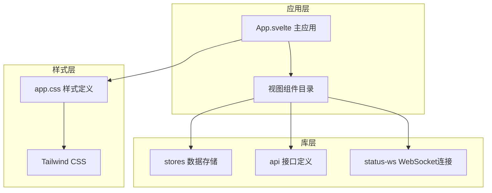

**图表来源**
- [App.svelte:1-290](file://frontend/src/App.svelte#L1-L290)
- [index.ts:1-46](file://frontend/src/lib/stores/index.ts#L1-L46)

**章节来源**
- [App.svelte:1-290](file://frontend/src/App.svelte#L1-L290)
- [index.ts:1-46](file://frontend/src/lib/stores/index.ts#L1-L46)

## 核心组件

系统包含以下核心视图组件：

### 任务管理组件
- **Mission**: 使命任务展示组件，提供任务状态可视化和进度跟踪
- **Decisions**: 待决策事项管理组件，集中处理需要果爸拍板的重要事项

### 团队协作组件
- **Team**: 团队状态监控组件，实时显示团队成员状态和工作进展
- **StatusCard**: 单个团队成员状态卡片组件
- **StatusHistory**: 团队成员历史记录展示组件

### 智能工作台组件
- **WorkbenchPanel**: 果爸工作台组件，提供多代理聊天和任务协调功能

**章节来源**
- [Mission.svelte:1-239](file://frontend/src/views/Mission.svelte#L1-L239)
- [Decisions.svelte:1-142](file://frontend/src/views/Decisions.svelte#L1-L142)
- [Team.svelte:1-507](file://frontend/src/views/Team.svelte#L1-L507)
- [WorkbenchPanel.svelte:1-369](file://frontend/src/views/WorkbenchPanel.svelte#L1-L369)

## 架构概览

系统采用分层架构设计，各组件通过清晰的接口进行通信：

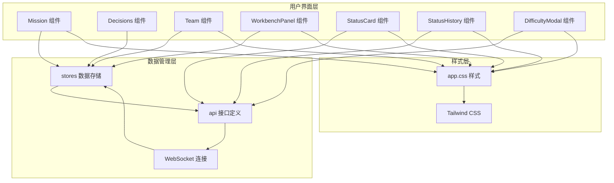

**图表来源**
- [App.svelte:1-290](file://frontend/src/App.svelte#L1-L290)
- [index.ts:1-46](file://frontend/src/lib/stores/index.ts#L1-L46)
- [api.ts:1-181](file://frontend/src/lib/api.ts#L1-L181)
- [status-ws.ts:1-78](file://frontend/src/lib/status-ws.ts#L1-L78)

## 详细组件分析

### Mission 组件分析

Mission 组件是系统的核心任务展示组件，负责显示使命的总体状态和详细信息。

#### 功能职责
- 展示使命基本信息（标题、描述、创建时间）
- 显示任务完成进度和状态统计
- 展示团队成员信息和角色分工
- 显示里程碑进度和任务列表

#### 数据绑定机制
组件通过 Svelte 响应式语法实现数据绑定：

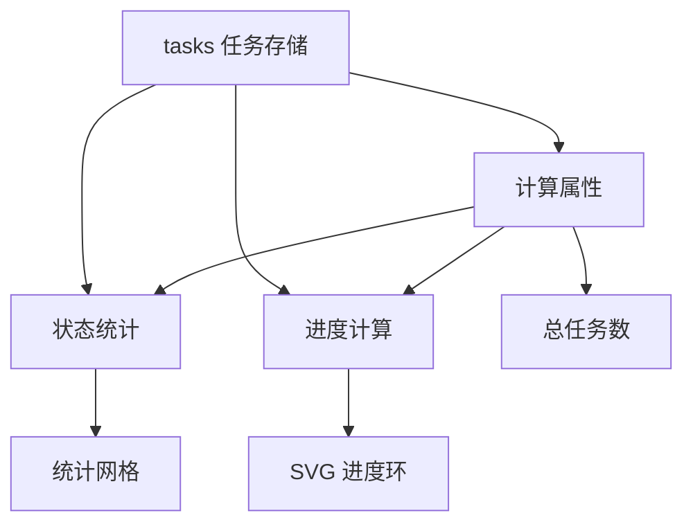

**图表来源**
- [Mission.svelte:1-239](file://frontend/src/views/Mission.svelte#L1-L239)
- [index.ts:1-46](file://frontend/src/lib/stores/index.ts#L1-L46)

#### 用户交互模式
- 点击任务项查看详情
- 查看团队成员头像和角色信息
- 浏览里程碑进度状态
- 查看任务优先级和状态标签

**章节来源**
- [Mission.svelte:1-239](file://frontend/src/views/Mission.svelte#L1-L239)

### Decisions 组件分析

Decisions 组件专门用于管理需要果爸决策的重要事项。

#### 功能职责
- 展示所有待决策事项
- 提供决策事项的优先级排序
- 显示决策状态和详细信息
- 统计待决策和已决策的数量

#### 排序算法
组件实现了智能排序逻辑，优先显示待决策事项，并按优先级排序：

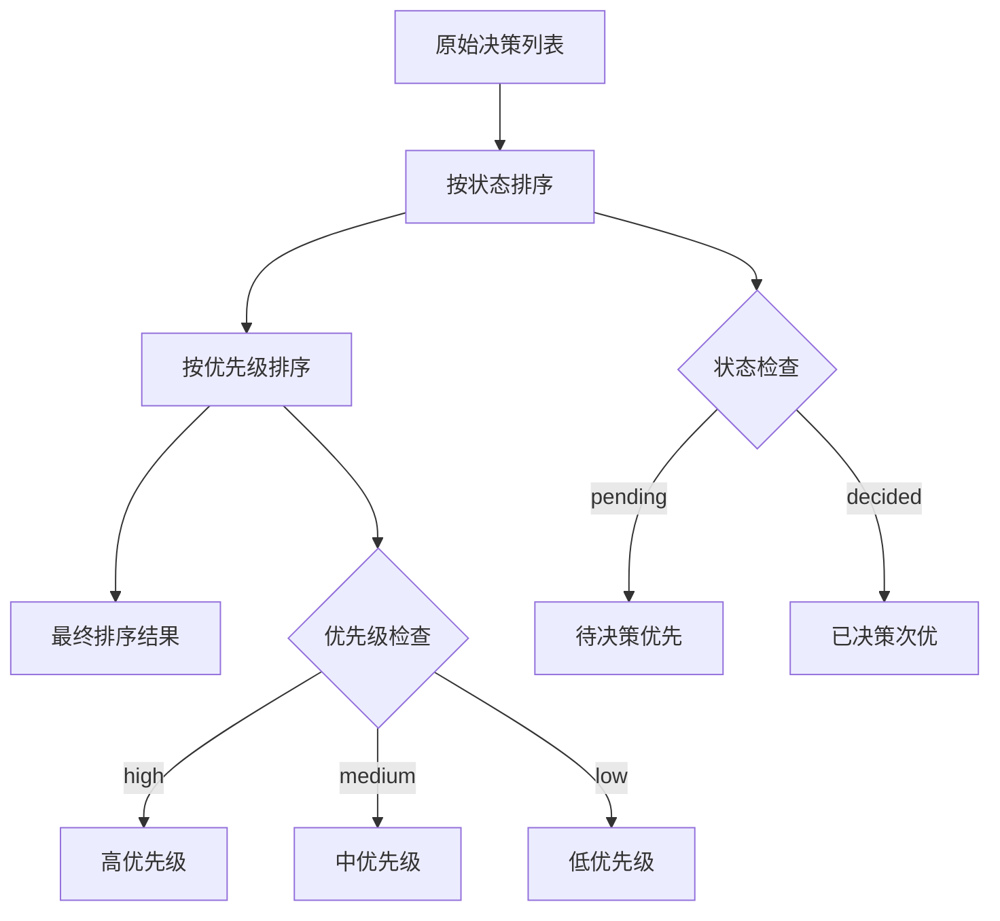

**图表来源**
- [Decisions.svelte:1-142](file://frontend/src/views/Decisions.svelte#L1-L142)

#### 用户交互模式
- 查看决策事项详情
- 点击查看详情内容
- 浏览决策状态变化
- 查看创建时间和负责人信息

**章节来源**
- [Decisions.svelte:1-142](file://frontend/src/views/Decisions.svelte#L1-L142)

### Team 组件分析

Team 组件是系统最复杂的组件之一，负责实时监控整个团队的状态。

#### 核心功能架构

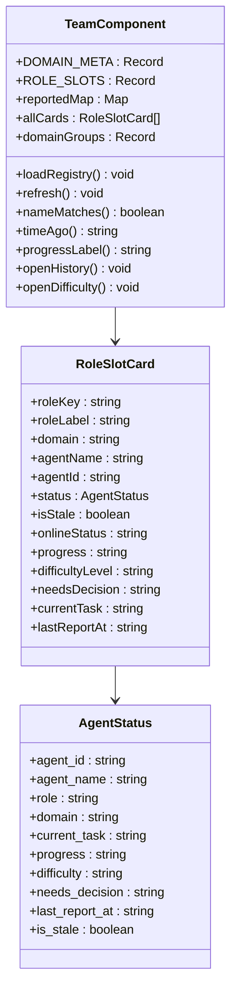

**图表来源**
- [Team.svelte:1-507](file://frontend/src/views/Team.svelte#L1-L507)

#### 数据整合流程
Team 组件实现了复杂的数据整合逻辑：

1. **注册表加载**: 从 `/cyber-team/registry.json` 或 `/api/registry` 加载角色配置
2. **状态面板获取**: 通过 `fetchStatusPanel()` 获取实时状态
3. **数据匹配**: 将注册表中的角色分配与实际上报状态进行匹配
4. **状态计算**: 计算在线、离线、阻塞等状态统计

#### 实时通信机制
组件通过 WebSocket 实现状态实时更新：

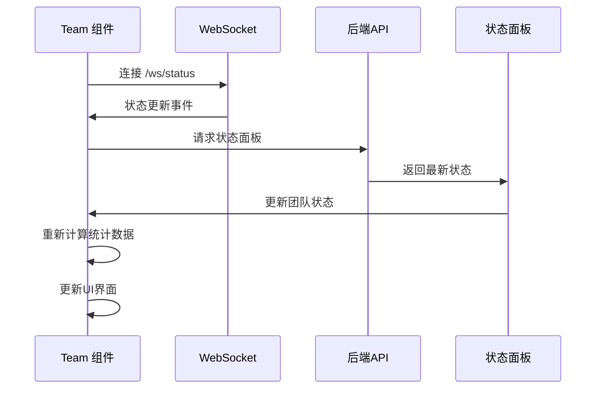

**图表来源**
- [Team.svelte:64-73](file://frontend/src/views/Team.svelte#L64-L73)
- [status-ws.ts:18-64](file://frontend/src/lib/status-ws.ts#L18-L64)

**章节来源**
- [Team.svelte:1-507](file://frontend/src/views/Team.svelte#L1-L507)
- [status-ws.ts:1-78](file://frontend/src/lib/status-ws.ts#L1-L78)

### WorkbenchPanel 组件分析

WorkbenchPanel 组件提供果爸工作台功能，支持多代理聊天和任务协调。

#### 多代理聊天架构

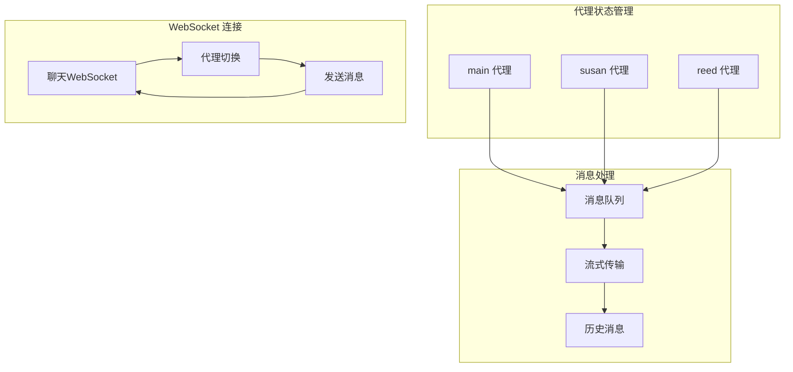

**图表来源**
- [WorkbenchPanel.svelte:1-369](file://frontend/src/views/WorkbenchPanel.svelte#L1-L369)

#### 智能滚动机制
组件实现了智能滚动功能，确保用户不会错过新消息：

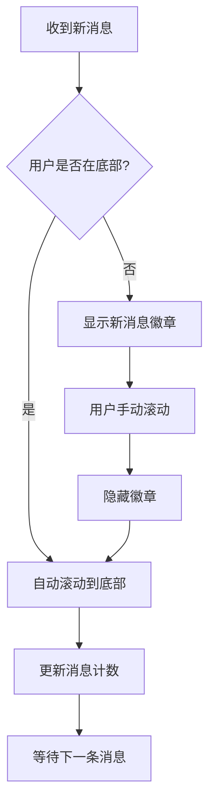

**图表来源**
- [WorkbenchPanel.svelte:63-79](file://frontend/src/views/WorkbenchPanel.svelte#L63-L79)

#### Markdown 渲染功能
组件内置了完整的 Markdown 渲染功能，支持多种格式：

- 标题层级 (#, ##, ###)
- 粗体和斜体文本
- 代码块和行内代码
- 列表格式
- 自定义样式渲染

**章节来源**
- [WorkbenchPanel.svelte:1-369](file://frontend/src/views/WorkbenchPanel.svelte#L1-L369)

### StatusCard 组件分析

StatusCard 组件是 Team 组件中的单个团队成员状态卡片。

#### 状态指示系统

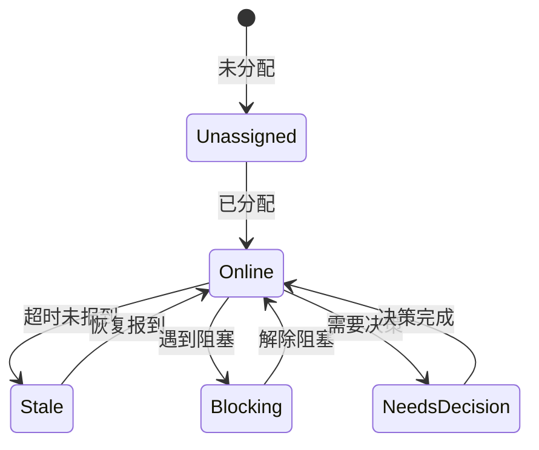

#### 样式定制机制
组件通过动态类名实现丰富的视觉效果：

- **边框颜色**: 根据状态动态变化（绿色在线、橙色阻塞、灰色未分配）
- **发光效果**: 阻塞状态具有脉冲发光效果
- **头像渐变**: 不同代理使用不同的渐变色彩
- **透明度**: 未分配状态使用半透明背景

**章节来源**
- [StatusCard.svelte:1-170](file://frontend/src/views/StatusCard.svelte#L1-L170)

### StatusHistory 组件分析

StatusHistory 组件提供团队成员的历史记录查询功能。

#### 过滤和分页机制

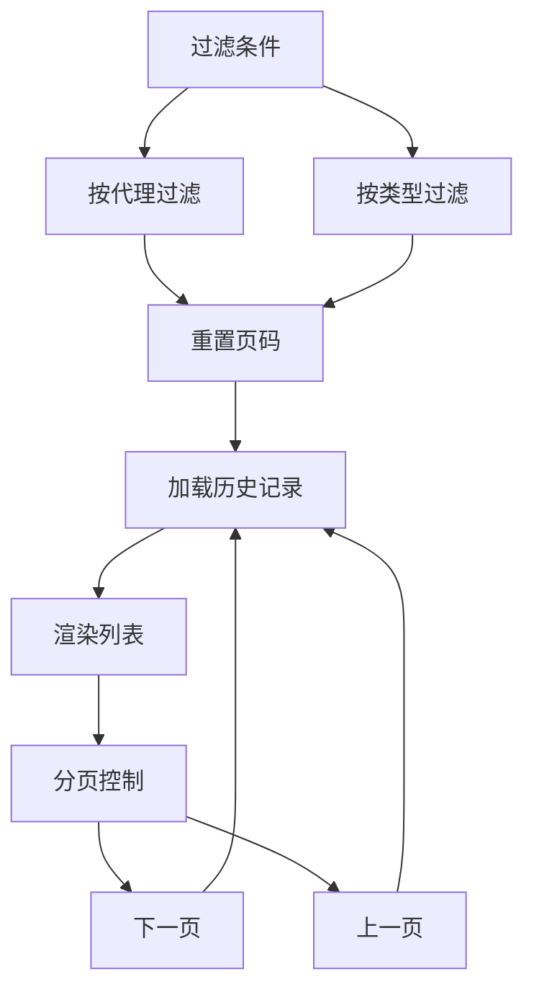

**图表来源**
- [StatusHistory.svelte:1-191](file://frontend/src/views/StatusHistory.svelte#L1-L191)

#### 时间显示优化
组件实现了人性化的时间显示逻辑：
- 刚刚（小于1分钟）
- X分钟前（小于60分钟）
- X小时前（小于24小时）
- X天前（大于等于24小时）

**章节来源**
- [StatusHistory.svelte:1-191](file://frontend/src/views/StatusHistory.svelte#L1-L191)

## 依赖分析

系统组件间的依赖关系如下：

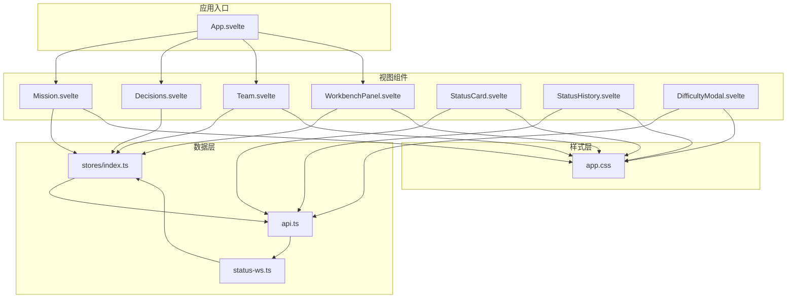

**图表来源**
- [App.svelte:1-290](file://frontend/src/App.svelte#L1-L290)
- [index.ts:1-46](file://frontend/src/lib/stores/index.ts#L1-L46)
- [api.ts:1-181](file://frontend/src/lib/api.ts#L1-L181)
- [status-ws.ts:1-78](file://frontend/src/lib/status-ws.ts#L1-L78)

**章节来源**
- [App.svelte:1-290](file://frontend/src/App.svelte#L1-L290)
- [index.ts:1-46](file://frontend/src/lib/stores/index.ts#L1-L46)

## 性能考虑

### 渲染优化策略

1. **虚拟滚动**: 对于大量数据的列表，可以考虑实现虚拟滚动以减少 DOM 元素数量
2. **懒加载**: 图片和大内容采用懒加载策略
3. **防抖节流**: 输入框和搜索功能使用防抖，滚动事件使用节流
4. **组件缓存**: 对于不经常变化的内容使用 Svelte 的 `this` 组件缓存

### WebSocket 连接管理

- **自动重连**: 实现指数退避算法避免频繁重连
- **连接状态监控**: 实时显示连接状态，提供用户反馈
- **消息去重**: 避免重复处理相同的消息

### 内存管理

- **定时器清理**: 组件销毁时清理所有定时器
- **事件监听器**: 使用 Svelte 的 `onDestroy` 生命周期清理事件监听
- **WebSocket 关闭**: 组件卸载时正确关闭 WebSocket 连接

## 故障排除指南

### 常见问题及解决方案

#### WebSocket 连接失败
**症状**: 状态面板无法更新，显示离线状态
**解决方案**:
1. 检查后端 WebSocket 服务是否正常运行
2. 确认浏览器允许 WebSocket 连接
3. 检查网络防火墙设置
4. 查看浏览器开发者工具中的网络面板

#### 数据加载超时
**症状**: 页面长时间显示加载状态
**解决方案**:
1. 检查 API 服务器响应时间
2. 实现请求超时机制
3. 添加重试逻辑
4. 提供错误边界组件

#### 样式显示异常
**症状**: 组件样式错乱或颜色不正确
**解决方案**:
1. 检查 Tailwind CSS 配置
2. 确认自定义 CSS 类名正确
3. 验证响应式断点设置
4. 检查浏览器兼容性

**章节来源**
- [status-ws.ts:51-64](file://frontend/src/lib/status-ws.ts#L51-L64)
- [Team.svelte:244-253](file://frontend/src/views/Team.svelte#L244-L253)

## 结论

SynapseOS 2.0 的视图组件系统展现了现代前端开发的最佳实践。通过合理的组件拆分、清晰的数据流管理和优雅的用户界面设计，系统为用户提供了流畅的使用体验。

### 主要优势

1. **模块化设计**: 组件职责明确，便于维护和扩展
2. **响应式数据流**: 基于 Svelte 的响应式编程模型，数据更新自动反映到 UI
3. **实时通信**: 通过 WebSocket 实现实时状态同步
4. **赛博朋克美学**: 独特的视觉风格与功能完美结合
5. **性能优化**: 合理的渲染策略和内存管理

### 技术亮点

- **智能排序算法**: Decisions 组件的优先级排序逻辑
- **实时状态监控**: Team 组件的 WebSocket 实时更新机制
- **多代理聊天**: WorkbenchPanel 的复杂消息处理系统
- **状态卡片设计**: StatusCard 的动态样式定制能力
- **历史记录管理**: StatusHistory 的过滤和分页功能

该系统为类似的企业协作平台提供了优秀的参考实现，其组件化架构和响应式设计理念值得在其他项目中借鉴和应用。