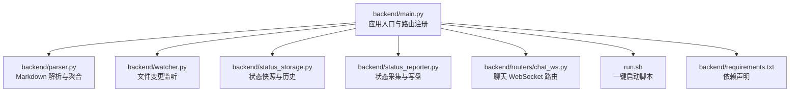
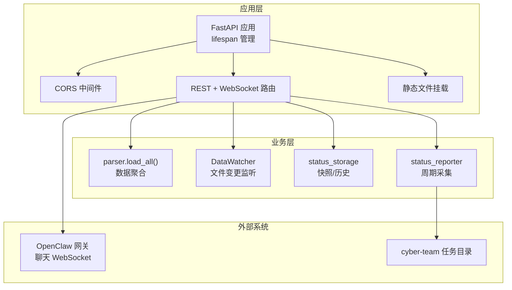
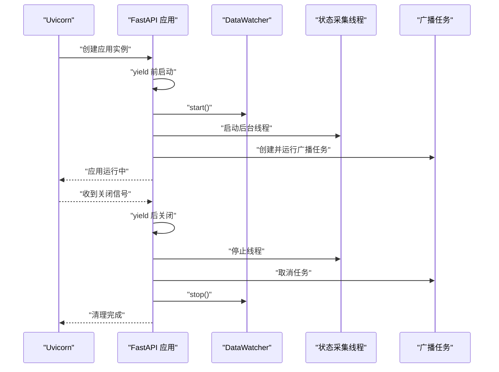
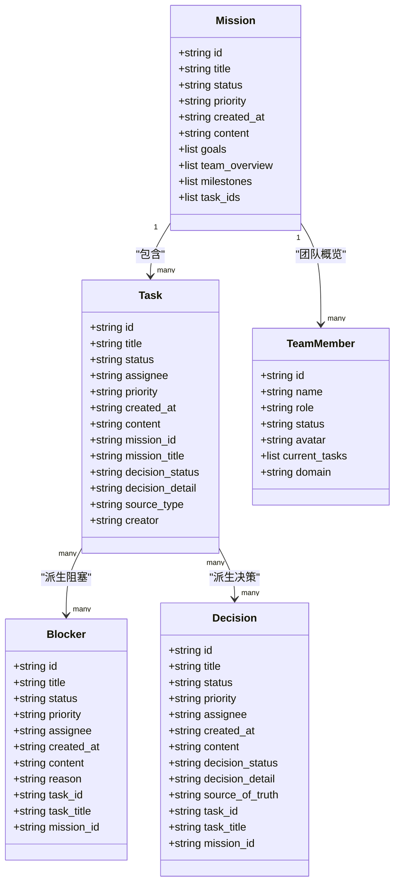
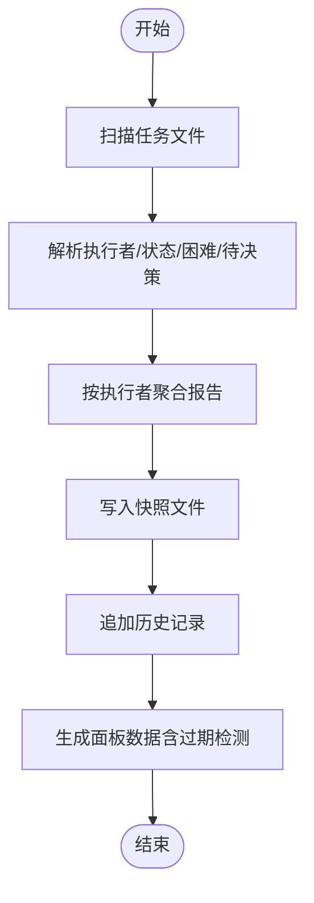
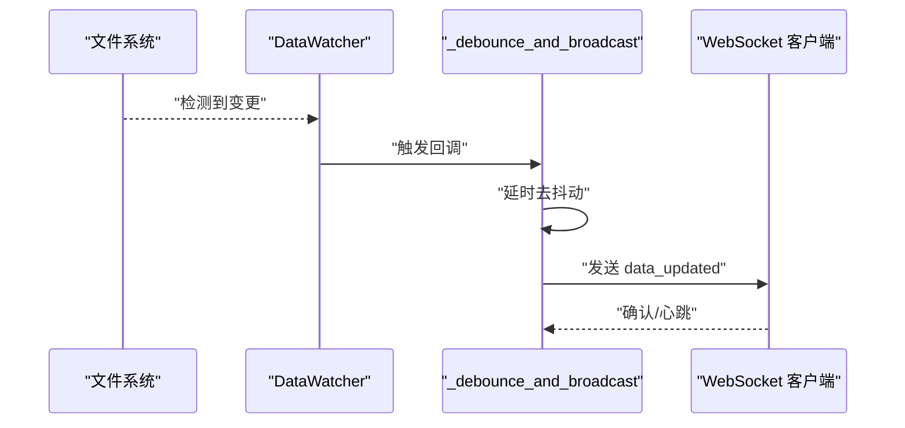
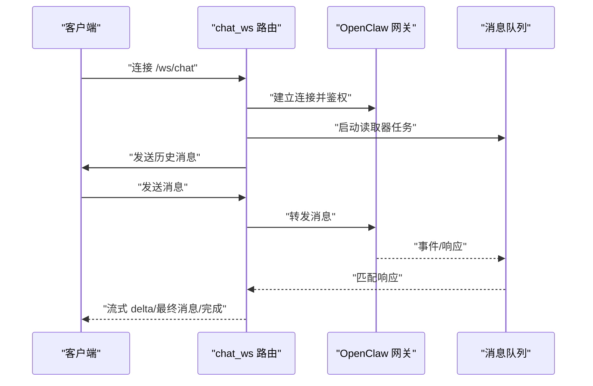
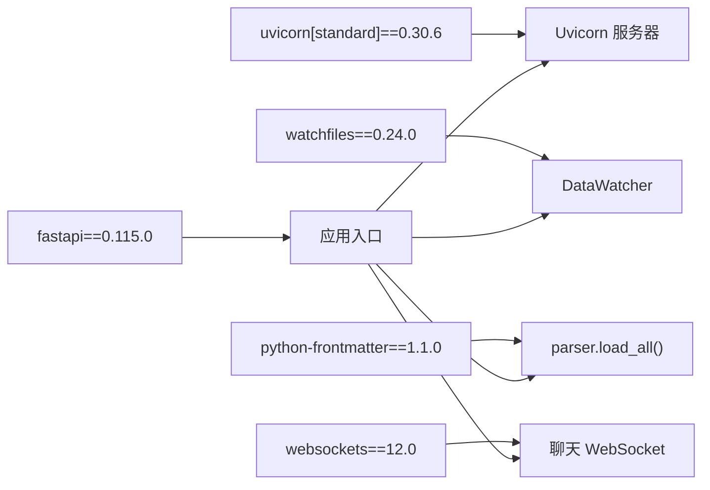

# FastAPI 应用配置

<cite>
**本文引用的文件**
- [backend/main.py](file://backend/main.py)
- [backend/parser.py](file://backend/parser.py)
- [backend/routers/chat_ws.py](file://backend/routers/chat_ws.py)
- [backend/status_reporter.py](file://backend/status_reporter.py)
- [backend/status_storage.py](file://backend/status_storage.py)
- [backend/watcher.py](file://backend/watcher.py)
- [backend/requirements.txt](file://backend/requirements.txt)
- [run.sh](file://run.sh)
</cite>

## 目录
1. [简介](#简介)
2. [项目结构](#项目结构)
3. [核心组件](#核心组件)
4. [架构总览](#架构总览)
5. [详细组件分析](#详细组件分析)
6. [依赖分析](#依赖分析)
7. [性能考虑](#性能考虑)
8. [故障排查指南](#故障排查指南)
9. [结论](#结论)
10. [附录](#附录)

## 简介
本文件面向 SynapseOS 2.0 的 FastAPI 后端应用，系统性梳理应用初始化、生命周期管理、CORS 跨域与中间件、路由注册、静态文件挂载、异常处理策略，并给出扩展方法、性能优化建议与最佳实践。文档严格基于仓库源码进行分析，避免臆测，确保可操作性与可追溯性。

## 项目结构
后端采用“入口文件 + 子模块”的分层组织：
- 入口与应用主体：backend/main.py
- 数据解析与聚合：backend/parser.py
- 状态采集与存储：backend/status_reporter.py、backend/status_storage.py
- 文件变更监听：backend/watcher.py
- 聊天 WebSocket 路由：backend/routers/chat_ws.py
- 运行脚本：run.sh
- 依赖声明：backend/requirements.txt

图表来源
- [backend/main.py:184-197](file://backend/main.py#L184-L197)
- [backend/parser.py:1-20](file://backend/parser.py#L1-L20)
- [backend/watcher.py:1-20](file://backend/watcher.py#L1-L20)
- [backend/status_storage.py:1-20](file://backend/status_storage.py#L1-L20)
- [backend/status_reporter.py:1-20](file://backend/status_reporter.py#L1-L20)
- [backend/routers/chat_ws.py:1-20](file://backend/routers/chat_ws.py#L1-L20)
- [run.sh:72-95](file://run.sh#L72-L95)
- [backend/requirements.txt:1-6](file://backend/requirements.txt#L1-L6)

章节来源
- [backend/main.py:184-197](file://backend/main.py#L184-L197)
- [run.sh:72-95](file://run.sh#L72-L95)
- [backend/requirements.txt:1-6](file://backend/requirements.txt#L1-L6)

## 核心组件
- 应用实例与生命周期：通过 lifespan 管理后台线程、异步任务与资源释放。
- CORS 中间件：全局允许跨域请求，便于前端本地开发。
- 路由注册：包含 REST API 与 WebSocket 端点；同时注册独立的聊天 WebSocket 路由器。
- 静态文件挂载：在存在构建产物时挂载前端 dist 目录，否则提供根路径回退响应。
- 数据流：文件变更监听触发数据广播；状态采集线程周期性更新快照；WebSocket 广播最新数据。

章节来源
- [backend/main.py:184-197](file://backend/main.py#L184-L197)
- [backend/main.py:120-182](file://backend/main.py#L120-L182)
- [backend/main.py:479-488](file://backend/main.py#L479-L488)

## 架构总览
应用采用 FastAPI + Uvicorn，结合 WebSocket 实时推送与静态文件服务，形成“数据驱动 + 实时通信”的架构。

图表来源
- [backend/main.py:184-197](file://backend/main.py#L184-L197)
- [backend/main.py:120-182](file://backend/main.py#L120-L182)
- [backend/main.py:479-488](file://backend/main.py#L479-L488)
- [backend/parser.py:441-509](file://backend/parser.py#L441-L509)
- [backend/watcher.py:8-52](file://backend/watcher.py#L8-L52)
- [backend/status_storage.py:62-127](file://backend/status_storage.py#L62-L127)
- [backend/status_reporter.py:258-267](file://backend/status_reporter.py#L258-L267)
- [backend/routers/chat_ws.py:174-349](file://backend/routers/chat_ws.py#L174-L349)

## 详细组件分析

### 应用初始化与生命周期管理
- 应用实例创建：使用 FastAPI 构造函数并注入 lifespan。
- 生命周期钩子：
  - 启动阶段：初始化 DataWatcher 并注册回调；立即执行一次状态报告；启动后台线程每 60 秒扫描任务文件；启动异步广播任务监听状态变更事件。
  - 关闭阶段：设置停止信号、取消广播任务、等待后台线程结束、停止文件监听器。

图表来源
- [backend/main.py:120-182](file://backend/main.py#L120-L182)
- [backend/watcher.py:36-52](file://backend/watcher.py#L36-L52)

章节来源
- [backend/main.py:120-182](file://backend/main.py#L120-L182)
- [backend/watcher.py:8-52](file://backend/watcher.py#L8-L52)

### CORS 跨域配置与中间件设置
- 全局启用 CORS 中间件，允许任意来源、凭据、方法与头，便于前端本地开发与跨域访问。
- 该中间件在应用实例上一次性注册，影响所有路由。

章节来源
- [backend/main.py:187-193](file://backend/main.py#L187-L193)

### 路由注册与静态文件挂载
- 路由注册：
  - 注册聊天 WebSocket 路由器（/ws/chat）。
  - 注册多个 REST API 端点（/api/mission、/api/tasks、/api/blockers、/api/decisions、/api/team、/api/registry、/api/status/* 等）。
  - 注册两个 WebSocket 端点：/ws（数据更新通道）、/ws/status（状态更新通道）。
- 静态文件挂载：
  - 若存在前端 dist 目录，则挂载为根路径静态文件，支持 HTML 服务。
  - 否则提供根路径回退响应。

章节来源
- [backend/main.py:194-197](file://backend/main.py#L194-L197)
- [backend/main.py:396-477](file://backend/main.py#L396-L477)
- [backend/main.py:479-488](file://backend/main.py#L479-L488)

### 异常处理策略
- WebSocket 端点：
  - 对客户端断开进行优雅捕获；对未知异常打印堆栈并清理连接。
  - 心跳检测：超时发送心跳消息，维持连接活性。
- 聊天 WebSocket：
  - 网关连接失败抛出异常；读取器任务异常处理；会话切换与消息转发过程中对错误进行反馈。
- 数据变更广播：
  - 发送失败时收集死连接并清理，避免阻塞后续广播。

章节来源
- [backend/main.py:430-440](file://backend/main.py#L430-L440)
- [backend/main.py:460-476](file://backend/main.py#L460-L476)
- [backend/routers/chat_ws.py:194-200](file://backend/routers/chat_ws.py#L194-L200)
- [backend/routers/chat_ws.py:335-349](file://backend/routers/chat_ws.py#L335-L349)
- [backend/main.py:48-59](file://backend/main.py#L48-L59)

### 数据模型与解析
- 数据类：Mission、Task、Blocker、Decision、TeamMember，用于结构化表示任务与团队信息。
- 解析流程：扫描任务目录，解析任务文件，提取状态、优先级、执行者、决策与困难等字段，构建任务列表、阻塞项、决策项与团队成员列表。
- 聚合输出：将任务与任务所属使命关联，补充里程碑信息，形成统一的数据视图。

图表来源
- [backend/parser.py:17-92](file://backend/parser.py#L17-L92)

章节来源
- [backend/parser.py:17-92](file://backend/parser.py#L17-L92)
- [backend/parser.py:441-509](file://backend/parser.py#L441-L509)

### 状态采集与存储
- 状态采集：扫描任务目录，解析执行者、状态、困难与待决策，生成 agent 级别状态报告。
- 快照与历史：将最新状态写入 status_current.json，历史记录追加到 status_history.jsonl。
- 面板查询：加载快照并进行“过期”检测，标注在线状态。

图表来源
- [backend/status_reporter.py:189-244](file://backend/status_reporter.py#L189-L244)
- [backend/status_storage.py:62-127](file://backend/status_storage.py#L62-L127)
- [backend/status_storage.py:139-193](file://backend/status_storage.py#L139-L193)

章节来源
- [backend/status_reporter.py:189-244](file://backend/status_reporter.py#L189-L244)
- [backend/status_storage.py:62-127](file://backend/status_storage.py#L62-L127)
- [backend/status_storage.py:139-193](file://backend/status_storage.py#L139-L193)

### 文件变更监听与广播
- DataWatcher 使用异步文件监控库，检测目录变更后触发回调。
- 回调触发去抖动广播：在固定时间窗口内合并多次变更，减少广播频率。
- 广播通道：
  - /ws：推送完整数据视图。
  - /ws/status：推送状态面板数据。

图表来源
- [backend/watcher.py:29-35](file://backend/watcher.py#L29-L35)
- [backend/main.py:86-94](file://backend/main.py#L86-L94)
- [backend/main.py:44-94](file://backend/main.py#L44-L94)

章节来源
- [backend/watcher.py:29-35](file://backend/watcher.py#L29-L35)
- [backend/main.py:86-94](file://backend/main.py#L86-L94)
- [backend/main.py:44-94](file://backend/main.py#L44-L94)

### 聊天 WebSocket（工作台桥接）
- 功能概述：连接 OpenClaw 网关，转发用户消息，流式回传 delta 与最终消息，支持代理切换与历史加载。
- 连接与认证：建立网关连接并通过鉴权参数完成握手。
- 事件处理：根据事件类型（agent/chat）分发 delta、thinking、lifecycle 结束与错误信息。
- 历史加载：从会话转录文件读取最近消息，按会话键映射不同代理。

图表来源
- [backend/routers/chat_ws.py:174-349](file://backend/routers/chat_ws.py#L174-L349)
- [backend/routers/chat_ws.py:117-136](file://backend/routers/chat_ws.py#L117-L136)
- [backend/routers/chat_ws.py:213-287](file://backend/routers/chat_ws.py#L213-L287)

章节来源
- [backend/routers/chat_ws.py:174-349](file://backend/routers/chat_ws.py#L174-L349)

## 依赖分析
- FastAPI：Web 框架与路由、WebSocket 支持。
- Uvicorn：ASGI 服务器，配合 run.sh 启动。
- watchfiles：异步文件监控，用于 DataWatcher。
- python-frontmatter：解析 Markdown frontmatter。
- websockets：与 OpenClaw 网关建立 WebSocket 连接。

图表来源
- [backend/requirements.txt:1-6](file://backend/requirements.txt#L1-L6)
- [backend/main.py:184-197](file://backend/main.py#L184-L197)
- [backend/watcher.py:4](file://backend/watcher.py#L4)
- [backend/parser.py:4](file://backend/parser.py#L4)
- [backend/routers/chat_ws.py:14](file://backend/routers/chat_ws.py#L14)

章节来源
- [backend/requirements.txt:1-6](file://backend/requirements.txt#L1-L6)

## 性能考虑
- 去抖动广播：通过延时合并多次变更，降低广播频率与网络负载。
- 心跳与超时：WebSocket 端点内置心跳与超时处理，提升连接稳定性。
- 异步并发：使用 asyncio 与异步任务处理广播与网关读取，避免阻塞。
- 静态文件缓存：生产环境建议启用浏览器缓存与 CDN。
- I/O 优化：状态快照与历史文件采用 JSON/JSONL，建议定期压缩与轮转。
- 线程与事件循环：后台线程与事件循环分离，避免阻塞主事件循环。

[本节为通用性能建议，无需特定文件来源]

## 故障排查指南
- WebSocket 断连与清理：
  - 检查客户端是否正确处理断开事件；确认广播逻辑中对异常连接的清理。
- 状态面板过期：
  - 检查快照文件更新时间与过期阈值配置；确认状态采集线程正常运行。
- 文件变更未触发：
  - 检查 DataWatcher 监听目录与权限；确认变更事件是否被正确通知。
- 聊天 WebSocket 无响应：
  - 检查网关连接与鉴权参数；确认消息队列读取器任务未退出。
- CORS 问题：
  - 生产环境建议限制 allow_origins 与 allow_methods，避免安全风险。

章节来源
- [backend/main.py:48-59](file://backend/main.py#L48-L59)
- [backend/status_storage.py:102-127](file://backend/status_storage.py#L102-L127)
- [backend/watcher.py:29-35](file://backend/watcher.py#L29-L35)
- [backend/routers/chat_ws.py:194-200](file://backend/routers/chat_ws.py#L194-L200)
- [backend/main.py:187-193](file://backend/main.py#L187-L193)

## 结论
SynapseOS 2.0 的 FastAPI 应用通过清晰的生命周期管理、完善的 WebSocket 广播与静态文件服务、以及可扩展的路由与中间件体系，实现了数据驱动的实时协作平台。建议在生产环境中收紧 CORS 配置、引入更细粒度的异常处理与日志分级，并对 I/O 与网络层进行持续优化。

[本节为总结性内容，无需特定文件来源]

## 附录

### 启动与运行
- 使用一键脚本启动后端与前端服务，自动安装依赖并输出访问地址与日志位置。
- 后端默认监听 0.0.0.0:8000，可通过 run.sh 查看日志。

章节来源
- [run.sh:72-95](file://run.sh#L72-L95)
- [run.sh:120-138](file://run.sh#L120-L138)
- [run.sh:162-170](file://run.sh#L162-L170)

### 扩展指南
- 添加新的中间件：在应用实例上继续调用 add_middleware，例如添加限流、认证或日志中间件。
- 新增 REST API：在 main.py 中新增路由装饰器与处理函数，遵循现有命名与返回格式。
- 新增 WebSocket：在 main.py 中新增 websocket 装饰器端点，或创建新的路由器模块并在 main.py 中 include_router。
- 自定义 CORS：调整 allow_origins、allow_methods、allow_headers 等参数，满足生产安全要求。
- 静态文件扩展：若需挂载额外目录，可在 main.py 中再次调用 mount 并指定 html=True。

章节来源
- [backend/main.py:187-193](file://backend/main.py#L187-L193)
- [backend/main.py:194-197](file://backend/main.py#L194-L197)
- [backend/main.py:479-488](file://backend/main.py#L479-L488)