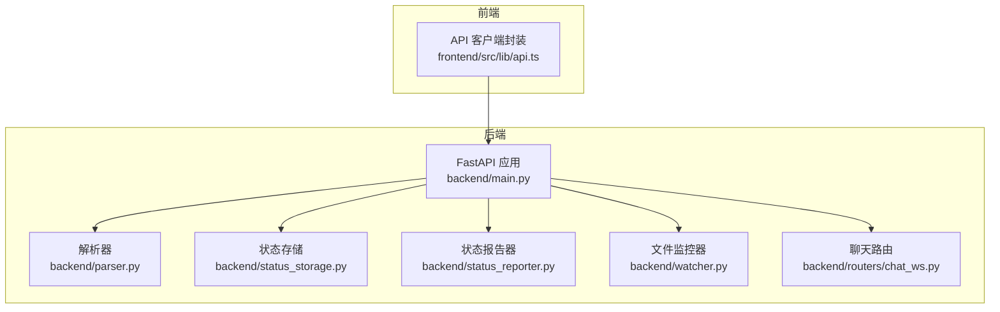
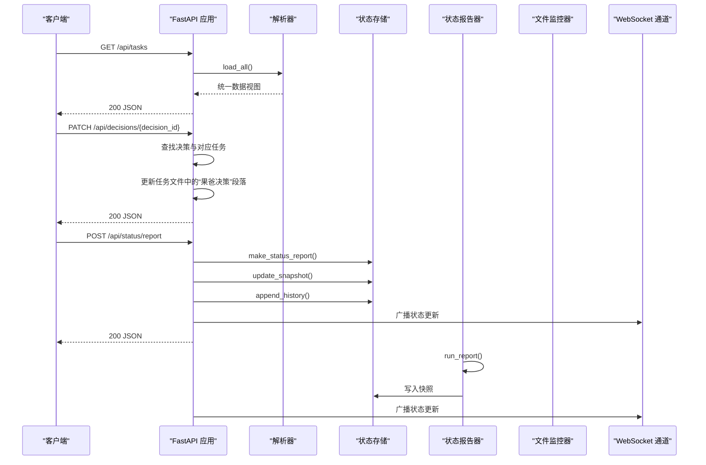
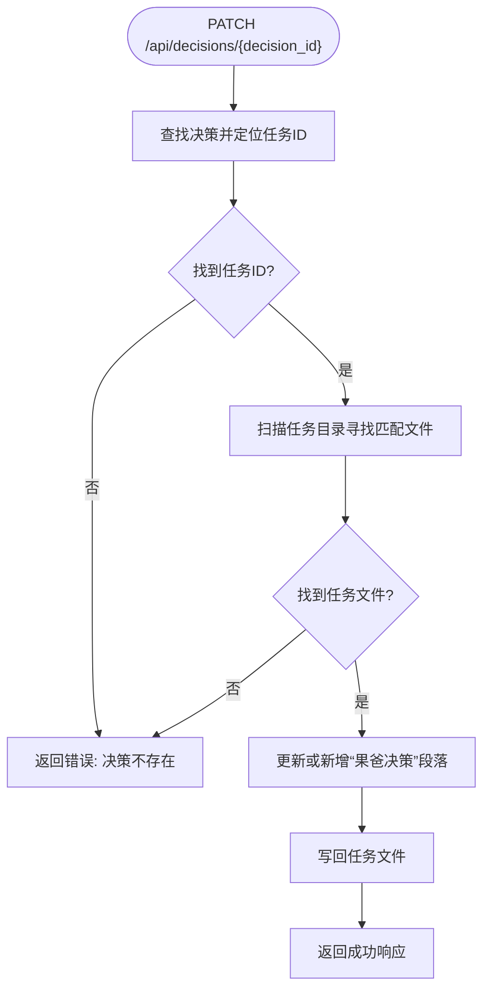
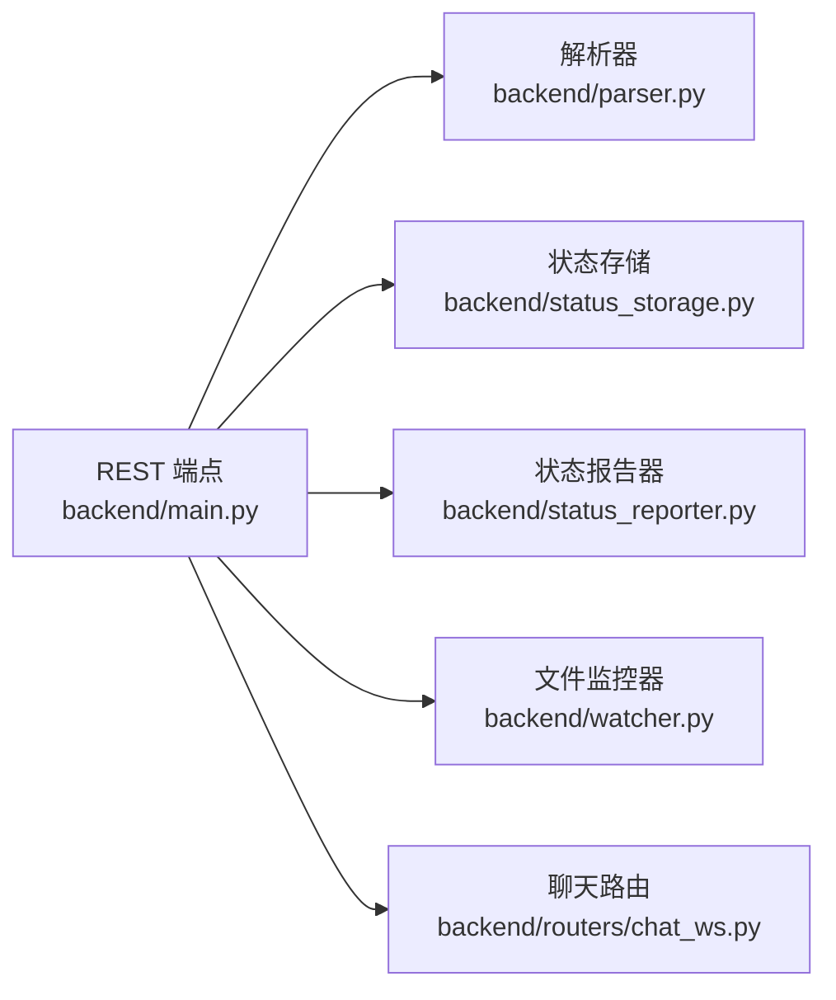
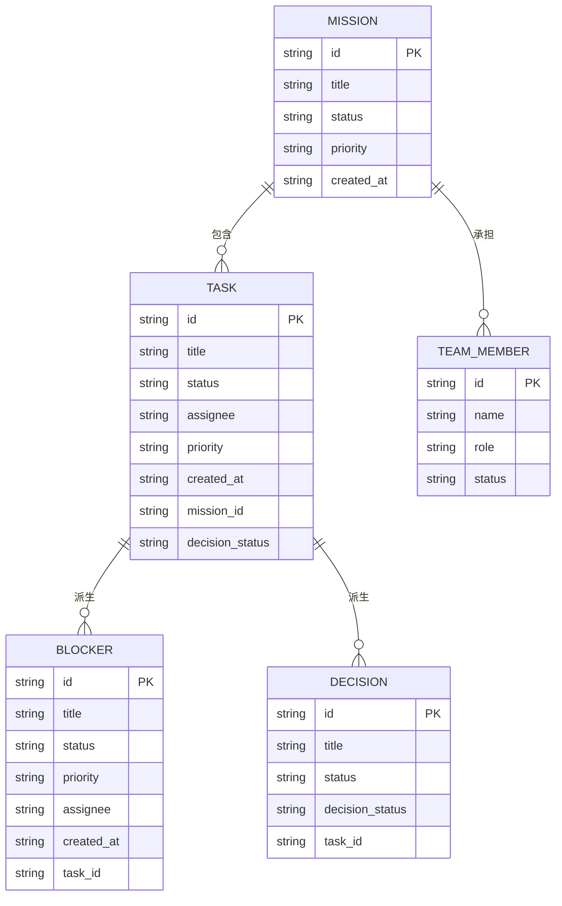

# REST API 端点

<cite>
**本文引用的文件**
- [backend/main.py](file://backend/main.py)
- [backend/parser.py](file://backend/parser.py)
- [backend/status_storage.py](file://backend/status_storage.py)
- [backend/status_reporter.py](file://backend/status_reporter.py)
- [backend/watcher.py](file://backend/watcher.py)
- [backend/routers/chat_ws.py](file://backend/routers/chat_ws.py)
- [frontend/src/lib/api.ts](file://frontend/src/lib/api.ts)
</cite>

## 目录
1. [简介](#简介)
2. [项目结构](#项目结构)
3. [核心组件](#核心组件)
4. [架构总览](#架构总览)
5. [详细端点规范](#详细端点规范)
6. [依赖关系分析](#依赖关系分析)
7. [性能与可用性](#性能与可用性)
8. [故障排查指南](#故障排查指南)
9. [结论](#结论)
10. [附录](#附录)

## 简介
本文件为 SynapseOS 2.0 的 REST API 参考文档，覆盖所有公开 HTTP 端点，包括：
- GET /api/mission
- GET /api/tasks
- GET /api/blockers
- GET /api/decisions
- GET /api/team
- GET /api/registry
- PATCH /api/decisions/{decision_id}
- POST /api/status/report
- GET /api/status/panel
- GET /api/status/history
- GET /api/status/{agent_id}
- POST /api/status/difficulty
- WebSocket /ws
- WebSocket /ws/status
- WebSocket /ws/chat

文档详细说明每个端点的请求参数、响应格式、状态码与错误处理，并提供 cURL 示例与前端调用方式的最佳实践。

## 项目结构
后端采用 FastAPI 提供 REST 与 WebSocket 服务，数据来源于本地 Markdown 文档目录（默认路径可通过环境变量配置），通过解析器聚合为统一的数据视图；状态面板由后台定时扫描任务文件生成快照并持久化，支持历史查询与实时广播。



图表来源
- [backend/main.py:184-495](file://backend/main.py#L184-L495)
- [backend/parser.py:440-509](file://backend/parser.py#L440-L509)
- [backend/status_storage.py:1-236](file://backend/status_storage.py#L1-L236)
- [backend/status_reporter.py:1-274](file://backend/status_reporter.py#L1-L274)
- [backend/watcher.py:1-52](file://backend/watcher.py#L1-L52)
- [backend/routers/chat_ws.py:1-365](file://backend/routers/chat_ws.py#L1-L365)
- [frontend/src/lib/api.ts:1-181](file://frontend/src/lib/api.ts#L1-L181)

章节来源
- [backend/main.py:184-495](file://backend/main.py#L184-L495)
- [backend/parser.py:440-509](file://backend/parser.py#L440-L509)
- [frontend/src/lib/api.ts:1-181](file://frontend/src/lib/api.ts#L1-L181)

## 核心组件
- 数据加载与聚合：解析器负责读取任务与使命 Markdown，构建统一数据模型并生成 blockers、decisions、team 等派生集合。
- 状态快照与历史：状态报告器周期性扫描任务文件，生成 agents 快照；状态存储模块负责写入当前快照与历史日志。
- 文件变更监听：文件监控器在数据目录发生变更时触发回调，用于通知 WebSocket 广播。
- REST 与 WebSocket：FastAPI 提供 REST 端点与多条 WebSocket 频道，分别承载数据同步、状态面板与聊天桥接。

章节来源
- [backend/parser.py:16-509](file://backend/parser.py#L16-L509)
- [backend/status_storage.py:1-236](file://backend/status_storage.py#L1-L236)
- [backend/status_reporter.py:1-274](file://backend/status_reporter.py#L1-L274)
- [backend/watcher.py:1-52](file://backend/watcher.py#L1-L52)

## 架构总览


图表来源
- [backend/main.py:200-394](file://backend/main.py#L200-L394)
- [backend/parser.py:440-509](file://backend/parser.py#L440-L509)
- [backend/status_storage.py:32-193](file://backend/status_storage.py#L32-L193)
- [backend/status_reporter.py:258-266](file://backend/status_reporter.py#L258-L266)

## 详细端点规范

### GET /api/mission
- 描述：获取当前使命信息。
- 响应：mission 对象（若未找到则返回默认结构）。
- 状态码：200。
- 错误：无特定错误返回。
- 示例 cURL：
  ```bash
  curl -X GET http://localhost:8000/api/mission
  ```

章节来源
- [backend/main.py:200-204](file://backend/main.py#L200-L204)

### GET /api/tasks
- 描述：获取所有任务列表。
- 响应：数组，元素为任务对象。
- 状态码：200。
- 错误：无特定错误返回。
- 示例 cURL：
  ```bash
  curl -X GET "http://localhost:8000/api/tasks"
  ```

章节来源
- [backend/main.py:206-210](file://backend/main.py#L206-L210)

### GET /api/blockers
- 描述：获取阻塞事项列表（由待决策的任务派生）。
- 响应：数组，元素为阻塞对象。
- 状态码：200。
- 错误：无特定错误返回。
- 示例 cURL：
  ```bash
  curl -X GET "http://localhost:8000/api/blockers"
  ```

章节来源
- [backend/main.py:212-216](file://backend/main.py#L212-L216)

### GET /api/decisions
- 描述：获取决策列表（由任务中的“果爸决策”派生）。
- 响应：数组，元素为决策对象。
- 状态码：200。
- 错误：无特定错误返回。
- 示例 cURL：
  ```bash
  curl -X GET "http://localhost:8000/api/decisions"
  ```

章节来源
- [backend/main.py:218-222](file://backend/main.py#L218-L222)

### PATCH /api/decisions/{decision_id}
- 描述：更新指定决策的状态（例如批准/拒绝）。实现逻辑会根据决策 ID 查找对应任务文件，然后在任务 Markdown 中的“果爸决策”段落中添加或更新决策结果与时间戳。
- 路径参数：
  - decision_id: string（必填）
- 请求体：
  - decision_status: string（可选，默认值为 decided）
- 响应：
  - success: boolean
  - decision_id: string
  - task_id: string
- 状态码：
  - 200：成功
  - 404：决策不存在时返回错误信息
- 错误处理：
  - 若找不到对应决策，返回包含错误信息的对象。
- 示例 cURL：
  ```bash
  curl -X PATCH "http://localhost:8000/api/decisions/{decision_id}" \
    -H "Content-Type: application/json" \
    -d '{"decision_status":"decided"}'
  ```
- 数据持久化流程：
  - 解析器从任务 Markdown 中提取“果爸决策”段落，若不存在则新增；存在则替换对应字段。
  - 更新后写回原任务文件，随后文件变更触发 WebSocket 广播与后台状态快照刷新。



图表来源
- [backend/main.py:224-298](file://backend/main.py#L224-L298)

章节来源
- [backend/main.py:224-298](file://backend/main.py#L224-L298)

### GET /api/team
- 描述：获取团队成员列表（基于使命与任务分配）。
- 响应：数组，元素为团队成员对象。
- 状态码：200。
- 错误：无特定错误返回。
- 示例 cURL：
  ```bash
  curl -X GET "http://localhost:8000/api/team"
  ```

章节来源
- [backend/main.py:301-305](file://backend/main.py#L301-L305)

### GET /api/registry
- 描述：获取完整的团队注册表（角色槽位与分配）。
- 响应：JSON 对象（若文件不存在则返回空对象）。
- 状态码：200。
- 错误：无特定错误返回。
- 示例 cURL：
  ```bash
  curl -X GET "http://localhost:8000/api/registry"
  ```

章节来源
- [backend/main.py:307-315](file://backend/main.py#L307-L315)

### POST /api/status/report
- 描述：员工提交状态报告，系统生成报告、更新快照并写入历史，同时向 WebSocket 广播状态更新。
- 请求体字段：
  - agent_id: string（必填）
  - agent_name: string（必填）
  - role: string（必填）
  - domain: string（必填）
  - current_task: string（必填）
  - progress: string（必填）
  - progress_detail: string（必填）
  - difficulty: string|null（可选）
  - difficulty_level: "none"|"minor"|"blocking"（可选）
  - needs_decision: string|null（可选）
  - needs_help: string|null（可选）
  - task_id: string（必填）
  - type: "report"|"difficulty"|"decision"（可选，自动推断）
  - metadata: object（可选）
- 响应：
  - success: boolean
  - report_id: string
  - next_report_at: string
- 状态码：200。
- 错误：无特定错误返回。
- 示例 cURL：
  ```bash
  curl -X POST "http://localhost:8000/api/status/report" \
    -H "Content-Type: application/json" \
    -d '{
      "agent_id":"susan","agent_name":"苏珊","role":"主设计师","domain":"infrastructure",
      "current_task":"状态面板 UI 设计","progress":"developing","progress_detail":"设计稿完成 60%",
      "difficulty":null,"difficulty_level":"none","needs_decision":null,"needs_help":null,"task_id":"task-infra-004"
    }'
  ```

章节来源
- [backend/main.py:318-347](file://backend/main.py#L318-L347)

### GET /api/status/panel
- 描述：获取所有员工的实时状态面板（含在线状态与过期检测）。
- 响应：包含 updated_at、agents 数组与阈值。
- 状态码：200。
- 错误：无特定错误返回。
- 示例 cURL：
  ```bash
  curl -X GET "http://localhost:8000/api/status/panel"
  ```

章节来源
- [backend/main.py:349-353](file://backend/main.py#L349-L353)

### GET /api/status/history
- 描述：分页获取状态历史，支持按 agent_id、type、from_time、to_time、task_id 过滤。
- 查询参数：
  - agent_id: string（可选）
  - type: string（可选）
  - from_time: string（可选）
  - to_time: string（可选）
  - task_id: string（可选）
  - page: number（可选，默认 1）
  - limit: number（可选，默认 20，最大 100）
- 响应：
  - total: number
  - page: number
  - limit: number
  - records: StatusReport[]
- 状态码：200。
- 错误：无特定错误返回。
- 示例 cURL：
  ```bash
  curl -X GET "http://localhost:8000/api/status/history?page=1&limit=20&agent_id=susan"
  ```

章节来源
- [backend/main.py:355-375](file://backend/main.py#L355-L375)

### GET /api/status/{agent_id}
- 描述：获取单个员工的状态。
- 路径参数：
  - agent_id: string（必填）
- 响应：AgentStatus 或错误对象。
- 状态码：
  - 200：成功
  - 404：未找到该员工
- 错误：当 agent_id 不存在时返回错误对象与 404。
- 示例 cURL：
  ```bash
  curl -X GET "http://localhost:8000/api/status/susan"
  ```

章节来源
- [backend/main.py:377-385](file://backend/main.py#L377-L385)

### POST /api/status/difficulty
- 描述：专门用于报告困难的便捷端点，内部将 type 强制设置为 difficulty 并转发至通用报告接口。
- 请求体：与 POST /api/status/report 相同，但 type 将被覆盖为 difficulty。
- 响应：与通用报告接口一致。
- 状态码：200。
- 示例 cURL：
  ```bash
  curl -X POST "http://localhost:8000/api/status/difficulty" \
    -H "Content-Type: application/json" \
    -d '{
      "agent_id":"reed","agent_name":"里德","role":"开发者","domain":"infrastructure",
      "current_task":"状态上报 API 开发","progress":"developing","progress_detail":"后端 API 完成 80%",
      "difficulty":"WebSocket 在高频消息场景下偶现断连","difficulty_level":"blocking","needs_decision":null,"needs_help":null,"task_id":"task-infra-004"
    }'
  ```

章节来源
- [backend/main.py:387-394](file://backend/main.py#L387-L394)

### WebSocket /ws
- 描述：通用数据通道，连接后立即推送当前数据快照，随后在数据变更时通过去抖动机制推送增量更新。
- 事件类型：
  - data_updated：payload 为完整数据视图。
  - heartbeat：心跳包。
- 示例 cURL（使用浏览器或 WebSocket 客户端）：
  ```bash
  wscat -c ws://localhost:8000/ws
  ```

章节来源
- [backend/main.py:396-440](file://backend/main.py#L396-L440)

### WebSocket /ws/status
- 描述：状态面板专用通道，连接后立即推送当前面板，随后在状态变化时推送更新。
- 事件类型：
  - status_updated：payload 为面板数据。
  - difficulty_reported：当报告包含 difficulty 时触发。
  - decision_requested：当报告包含 needs_decision 时触发。
  - heartbeat：心跳包。
- 示例 cURL：
  ```bash
  wscat -c ws://localhost:8000/ws/status
  ```

章节来源
- [backend/main.py:442-477](file://backend/main.py#L442-L477)

### WebSocket /ws/chat
- 描述：聊天桥接通道，连接后从会话历史加载最近消息，随后将网关事件流式转发至客户端。
- 事件类型：
  - history：初始历史消息。
  - delta：流式文本片段。
  - thinking：推理阶段文本。
  - done：流式结束。
  - error：错误。
- 示例 cURL：
  ```bash
  wscat -c ws://localhost:8000/ws/chat
  ```

章节来源
- [backend/routers/chat_ws.py:186-365](file://backend/routers/chat_ws.py#L186-L365)

## 依赖关系分析
- 端点与模块耦合：
  - GET /api/* 系列端点依赖解析器生成统一数据视图。
  - PATCH /api/decisions/* 直接操作任务 Markdown 文件，耦合度较高，需谨慎处理文件权限与并发。
  - POST /api/status/report 依赖状态存储与 WebSocket 广播。
- 外部依赖：
  - 文件系统：CYBER_TEAM_DIR 指定的 Markdown 数据目录。
  - 网关 WebSocket：/ws/chat 依赖外部网关服务。
- 循环依赖：未发现循环导入。



图表来源
- [backend/main.py:184-495](file://backend/main.py#L184-L495)
- [backend/parser.py:440-509](file://backend/parser.py#L440-L509)
- [backend/status_storage.py:1-236](file://backend/status_storage.py#L1-L236)
- [backend/status_reporter.py:1-274](file://backend/status_reporter.py#L1-L274)
- [backend/watcher.py:1-52](file://backend/watcher.py#L1-L52)
- [backend/routers/chat_ws.py:1-365](file://backend/routers/chat_ws.py#L1-L365)

章节来源
- [backend/main.py:184-495](file://backend/main.py#L184-L495)

## 性能与可用性
- 去抖动广播：数据变更后通过去抖动机制合并多次变更，降低 WebSocket 压力。
- 分页与限制：历史查询限制每页最大数量，避免大页导致的内存压力。
- 状态快照：定期扫描任务文件生成快照，减少实时解析成本。
- 并发与锁：PATCH 决策直接写文件，建议在生产环境中配合文件锁或队列避免并发写冲突。

[本节为通用指导，无需列出具体文件来源]

## 故障排查指南
- 端口占用
  - 确认 8000 端口未被占用，或修改运行脚本中的端口。
- 数据目录不可见
  - 确认 CYBER_TEAM_DIR 环境变量指向正确的 Markdown 目录，且包含 missions 与 tasks 子目录。
- WebSocket 断连
  - 使用心跳事件检查连接健康；若频繁断连，检查网络与防火墙策略。
- 决策更新失败
  - 确认任务文件中存在匹配的文件名与任务 ID；检查文件权限与磁盘空间。
- 状态历史为空
  - 确认状态报告已成功写入历史文件；检查时间范围与过滤条件。

章节来源
- [backend/main.py:396-477](file://backend/main.py#L396-L477)
- [backend/status_storage.py:138-193](file://backend/status_storage.py#L138-L193)

## 结论
SynapseOS 2.0 的 REST API 以简洁清晰的方式暴露核心数据与状态能力，结合 WebSocket 实现实时更新。PATCH /api/decisions/{decision_id} 提供了直接的数据持久化入口，适合在工作流中快速落地决策。建议在生产环境中加强文件写入的并发控制与错误恢复能力，并合理配置数据目录与网关连接参数。

[本节为总结性内容，无需列出具体文件来源]

## 附录

### 常见使用场景与最佳实践
- 获取全量数据：首次加载时调用 GET /api/mission、/api/tasks、/api/blockers、/api/decisions、/api/team。
- 实时协作：订阅 /ws 获取数据更新；订阅 /ws/status 获取状态面板更新。
- 提交状态：POST /api/status/report 或 POST /api/status/difficulty。
- 更新决策：PATCH /api/decisions/{decision_id}，确保传入正确的 decision_status。
- 前端集成：参考前端 API 封装，使用 fetch 与 URLSearchParams 构造查询参数。

章节来源
- [frontend/src/lib/api.ts:75-181](file://frontend/src/lib/api.ts#L75-L181)

### 数据模型概览


图表来源
- [backend/parser.py:16-92](file://backend/parser.py#L16-L92)