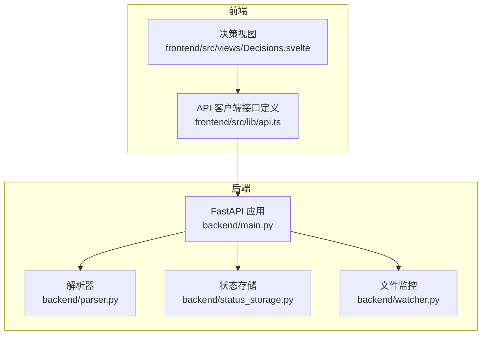
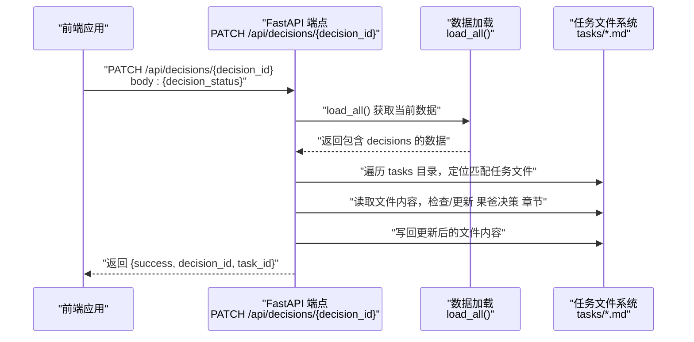
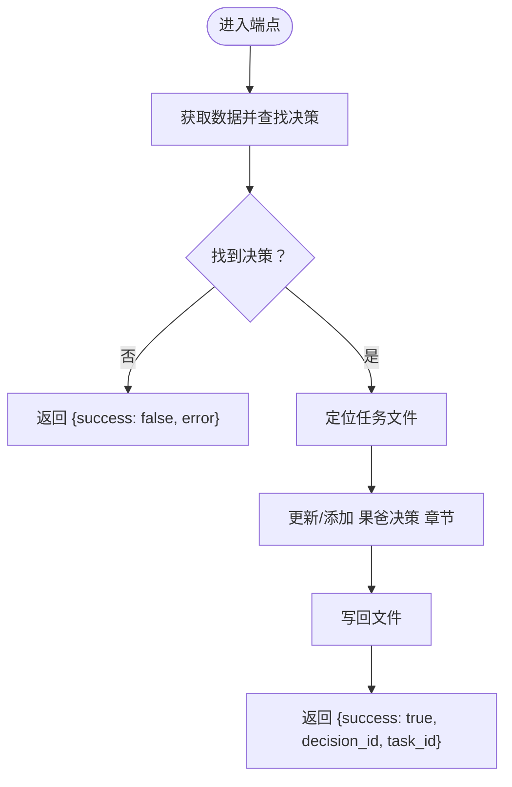
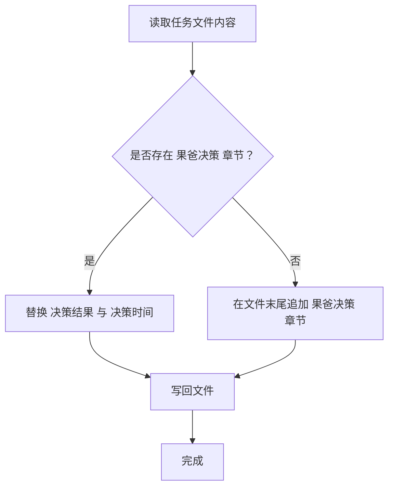
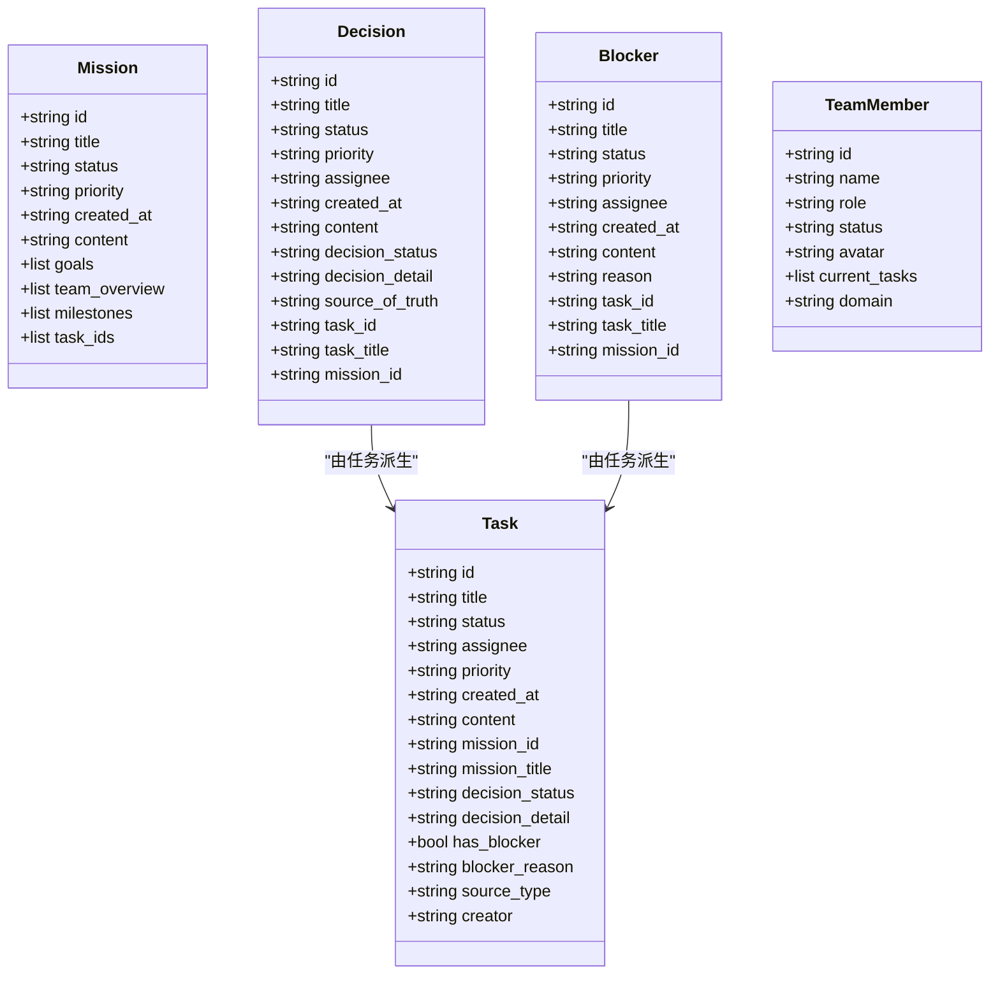
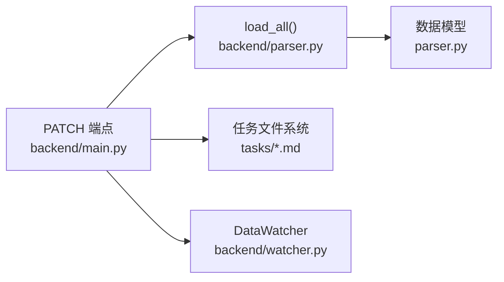

# 决策管理端点

<cite>
**本文引用的文件**
- [backend/main.py](file://backend/main.py)
- [backend/parser.py](file://backend/parser.py)
- [backend/status_storage.py](file://backend/status_storage.py)
- [backend/watcher.py](file://backend/watcher.py)
- [frontend/src/views/Decisions.svelte](file://frontend/src/views/Decisions.svelte)
- [frontend/src/lib/api.ts](file://frontend/src/lib/api.ts)
</cite>

## 目录
1. [简介](#简介)
2. [项目结构](#项目结构)
3. [核心组件](#核心组件)
4. [架构概览](#架构概览)
5. [详细组件分析](#详细组件分析)
6. [依赖分析](#依赖分析)
7. [性能考虑](#性能考虑)
8. [故障排查指南](#故障排查指南)
9. [结论](#结论)
10. [附录](#附录)

## 简介
本文档聚焦于 SynapseOS 2.0 的决策管理 REST API 端点，重点覆盖 PATCH /api/decisions/{decision_id} 的实现细节。内容涵盖：
- 决策更新流程与任务文件解析机制
- Markdown 内容修改逻辑（果爸决策章节）
- 请求参数格式、响应结构与错误处理
- 决策状态更新的完整生命周期（从决策创建到任务文件持久化）
- 实际调用示例与常见问题解决方案

## 项目结构
后端采用 FastAPI 提供 REST API，并通过解析器读取并构建“cyber-team”目录下的任务与决策数据；前端通过 Svelte 组件展示决策列表与状态。

图表来源
- [backend/main.py:184-495](file://backend/main.py#L184-L495)
- [backend/parser.py:440-509](file://backend/parser.py#L440-L509)
- [backend/status_storage.py:1-236](file://backend/status_storage.py#L1-L236)
- [backend/watcher.py:1-52](file://backend/watcher.py#L1-L52)
- [frontend/src/views/Decisions.svelte:1-142](file://frontend/src/views/Decisions.svelte#L1-L142)
- [frontend/src/lib/api.ts:1-181](file://frontend/src/lib/api.ts#L1-L181)

章节来源
- [backend/main.py:184-495](file://backend/main.py#L184-L495)
- [frontend/src/views/Decisions.svelte:1-142](file://frontend/src/views/Decisions.svelte#L1-L142)
- [frontend/src/lib/api.ts:1-181](file://frontend/src/lib/api.ts#L1-L181)

## 核心组件
- 决策管理端点：PATCH /api/decisions/{decision_id}
- 数据加载与解析：parser.load_all() 与各数据类（Mission/Task/Blocker/Decision/TeamMember）
- 任务文件监控：DataWatcher 用于检测任务文件变更并触发广播
- 状态存储：status_storage 提供快照与历史记录的读写

章节来源
- [backend/main.py:224-298](file://backend/main.py#L224-L298)
- [backend/parser.py:16-92](file://backend/parser.py#L16-L92)
- [backend/parser.py:440-509](file://backend/parser.py#L440-L509)
- [backend/watcher.py:8-52](file://backend/watcher.py#L8-L52)
- [backend/status_storage.py:62-100](file://backend/status_storage.py#L62-L100)

## 架构概览
决策管理端点的调用链路如下：
- 前端通过 API 客户端发起 PATCH 请求
- 后端根据 decision_id 查找对应任务 ID
- 后端在任务目录中定位匹配的任务文件
- 在任务文件中添加或更新“果爸决策”章节
- 将变更写回任务文件，返回成功状态

图表来源
- [backend/main.py:224-298](file://backend/main.py#L224-L298)
- [backend/parser.py:440-509](file://backend/parser.py#L440-L509)

## 详细组件分析

### PATCH /api/decisions/{decision_id} 端点
- 功能：更新指定决策的状态（如批准/拒绝），并在对应任务文件中写入“果爸决策”章节。
- 请求方法与路径：PATCH /api/decisions/{decision_id}
- 请求体字段：
  - decision_status：字符串，可选值为 "pending" 或 "decided"。默认值为 "decided"。
- 响应字段：
  - success：布尔值，表示操作是否成功
  - decision_id：传入的决策 ID
  - task_id：与该决策关联的任务 ID
  - error：当决策不存在时返回错误信息
- 错误处理：
  - 若未找到对应决策，返回错误提示
  - 文件系统异常将导致更新失败，但端点仍返回结构化响应

图表来源
- [backend/main.py:224-298](file://backend/main.py#L224-L298)

章节来源
- [backend/main.py:224-298](file://backend/main.py#L224-L298)

### 任务文件解析与“果爸决策”章节
- 解析器负责从任务 Markdown 文件中提取元数据与状态，并生成决策对象。
- “果爸决策”章节的识别与更新逻辑：
  - 若存在“果爸决策”章节，则替换其中的“决策结果”和“决策时间”
  - 若不存在，则在文件末尾追加新的“果爸决策”章节
- 时间戳使用 UTC ISO 8601 格式

图表来源
- [backend/main.py:256-296](file://backend/main.py#L256-L296)

章节来源
- [backend/main.py:256-296](file://backend/main.py#L256-L296)

### 数据模型与派生
- 数据模型定义在 parser 中，包括 Mission、Task、Blocker、Decision、TeamMember。
- 决策对象由任务中的“果爸决策”章节派生而来，包含决策状态与详情。
- load_all() 负责扫描 missions 与 tasks 目录，构建完整的数据结构。

图表来源
- [backend/parser.py:16-92](file://backend/parser.py#L16-L92)

章节来源
- [backend/parser.py:16-92](file://backend/parser.py#L16-L92)
- [backend/parser.py:416-437](file://backend/parser.py#L416-L437)
- [backend/parser.py:440-509](file://backend/parser.py#L440-L509)

### 前端集成与展示
- 前端通过 Decisions.svelte 展示决策列表，按状态与优先级排序。
- 前端通过 api.ts 的 fetchDecisions() 获取决策数据。
- 前端不直接调用 PATCH /api/decisions/{decision_id}，而是通过用户交互触发业务流程（例如在 UI 中选择“批准/拒绝”后，由上层逻辑发起更新请求）。

章节来源
- [frontend/src/views/Decisions.svelte:1-142](file://frontend/src/views/Decisions.svelte#L1-L142)
- [frontend/src/lib/api.ts:90-93](file://frontend/src/lib/api.ts#L90-L93)

## 依赖分析
- 端点依赖：
  - 数据加载：load_all() 返回包含 decisions 的数据结构
  - 文件系统：任务文件位于 CYBER_TEAM_DIR/tasks 下
- 解析器依赖：
  - frontmatter 用于解析 Markdown 前言元数据
  - 正则表达式用于提取字段与表格
- 监控与广播：
  - DataWatcher 通过异步文件监控触发数据更新广播
- 状态存储：
  - 与决策管理端点无直接耦合，但共同服务于面板与实时更新

图表来源
- [backend/main.py:224-298](file://backend/main.py#L224-L298)
- [backend/parser.py:440-509](file://backend/parser.py#L440-L509)
- [backend/watcher.py:8-52](file://backend/watcher.py#L8-L52)

章节来源
- [backend/main.py:224-298](file://backend/main.py#L224-L298)
- [backend/parser.py:440-509](file://backend/parser.py#L440-L509)
- [backend/watcher.py:8-52](file://backend/watcher.py#L8-L52)

## 性能考虑
- 文件系统访问：端点每次更新都会读取并写回任务文件，建议在高并发场景下增加缓存或批量写入策略。
- 字符串处理：正则与逐行扫描在大文件上可能成为瓶颈，建议对任务文件大小与结构进行约束。
- 异步广播：文件变更触发的广播与状态更新互不影响，但需避免重复写入导致的抖动。

## 故障排查指南
- 决策不存在
  - 现象：返回 {success: false, error: "decision not found"}
  - 排查：确认 decision_id 是否存在于 /api/decisions 的返回数据中
- 任务文件未找到
  - 现象：端点无法定位匹配的任务文件
  - 排查：确认 CYBER_TEAM_DIR/tasks 下存在与任务 ID 匹配的文件名
- 文件写入失败
  - 现象：端点返回成功但文件未更新
  - 排查：检查文件权限、磁盘空间与并发写入冲突
- 果爸决策章节格式不一致
  - 现象：更新后章节内容未被正确识别
  - 排查：确保章节标题与字段格式符合解析约定（如“决策结果”、“决策时间”）

章节来源
- [backend/main.py:241-242](file://backend/main.py#L241-L242)
- [backend/main.py:256-296](file://backend/main.py#L256-L296)

## 结论
PATCH /api/decisions/{decision_id} 端点通过解析器与文件系统协作，实现了从决策到任务文件的闭环更新。其设计简洁、职责明确，适合在小规模团队中快速落地。若需扩展至大规模并发场景，建议引入缓存、批处理与更严格的文件锁机制。

## 附录

### 请求与响应规范
- 请求
  - 方法：PATCH
  - 路径：/api/decisions/{decision_id}
  - 请求体：
    - decision_status：字符串，可选值 "pending" 或 "decided"（默认 "decided"）
- 响应
  - 成功：{success: true, decision_id: string, task_id: string}
  - 失败：{success: false, error: string}

章节来源
- [backend/main.py:224-298](file://backend/main.py#L224-L298)

### 决策状态生命周期
- 创建：任务文件中出现“果爸决策”章节即派生出决策对象
- 更新：PATCH 端点更新任务文件中的“果爸决策”章节
- 可见性：前端通过 /api/decisions 获取最新决策列表

章节来源
- [backend/parser.py:416-437](file://backend/parser.py#L416-L437)
- [backend/parser.py:440-509](file://backend/parser.py#L440-L509)
- [frontend/src/lib/api.ts:90-93](file://frontend/src/lib/api.ts#L90-L93)