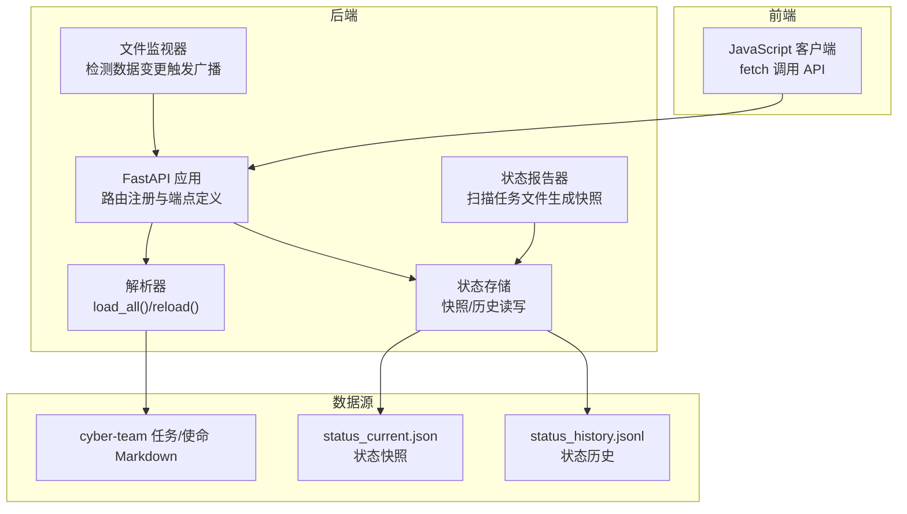
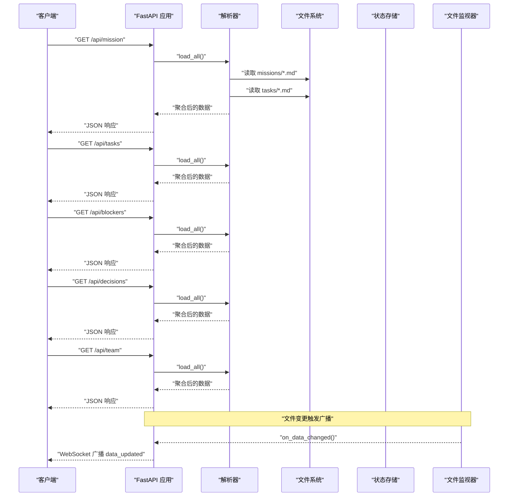
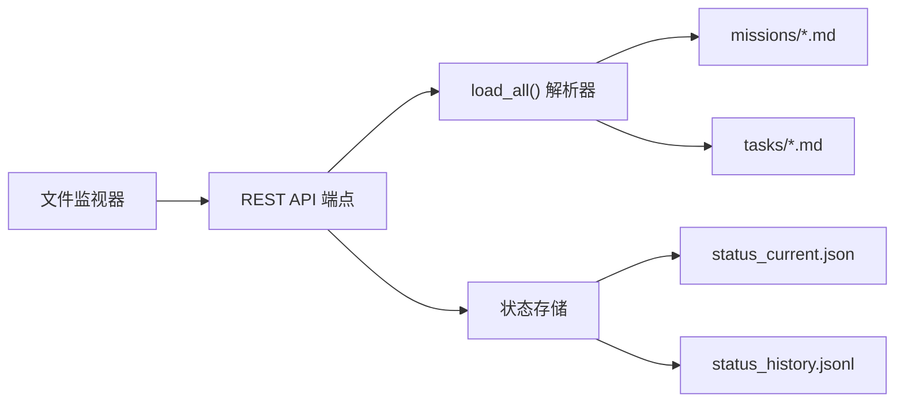
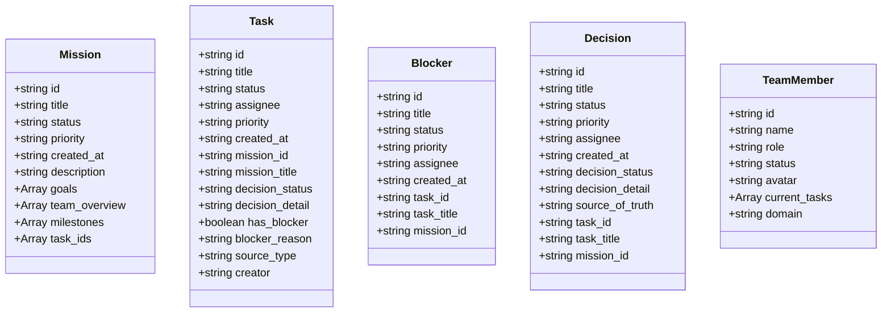
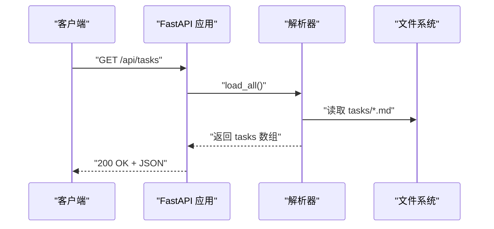
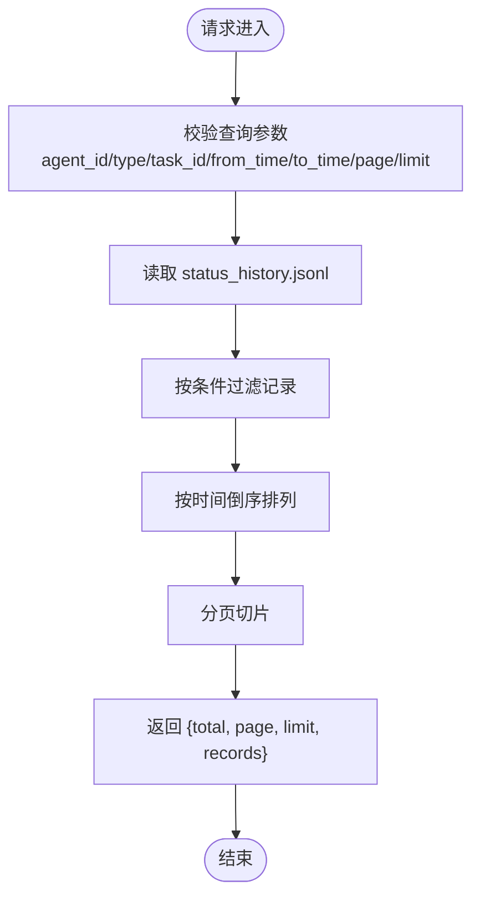

# 数据查询端点

<cite>
**本文引用的文件**
- [backend/main.py](file://backend/main.py)
- [backend/parser.py](file://backend/parser.py)
- [backend/status_storage.py](file://backend/status_storage.py)
- [backend/status_reporter.py](file://backend/status_reporter.py)
- [backend/watcher.py](file://backend/watcher.py)
- [frontend/src/lib/api.ts](file://frontend/src/lib/api.ts)
- [data/status_current.json](file://data/status_current.json)
- [data/status_history.jsonl](file://data/status_history.jsonl)
</cite>

## 目录
1. [简介](#简介)
2. [项目结构](#项目结构)
3. [核心组件](#核心组件)
4. [架构总览](#架构总览)
5. [详细组件分析](#详细组件分析)
6. [依赖分析](#依赖分析)
7. [性能考量](#性能考量)
8. [故障排查指南](#故障排查指南)
9. [结论](#结论)
10. [附录](#附录)

## 简介
本文件面向 SynapseOS 2.0 的数据查询 REST API，聚焦以下端点：
- GET /api/mission
- GET /api/tasks
- GET /api/blockers
- GET /api/decisions
- GET /api/team

文档将说明每个端点的实现机制、返回数据结构与字段含义、示例响应、数据加载流程、缓存与性能特性，并提供 cURL 请求示例与 JavaScript 客户端调用方式，帮助开发者正确获取与处理这些数据。

## 项目结构
后端采用 FastAPI 提供 REST API 与 WebSocket，前端通过 fetch 调用后端接口。数据来源为 cyber-team Markdown 文档，经解析器聚合为统一的业务视图；状态面板与历史由独立的状态存储模块维护。

图表来源
- [backend/main.py](file://backend/main.py)
- [backend/parser.py](file://backend/parser.py)
- [backend/status_storage.py](file://backend/status_storage.py)
- [backend/status_reporter.py](file://backend/status_reporter.py)
- [backend/watcher.py](file://backend/watcher.py)
- [frontend/src/lib/api.ts](file://frontend/src/lib/api.ts)
- [data/status_current.json](file://data/status_current.json)
- [data/status_history.jsonl](file://data/status_history.jsonl)

章节来源
- [backend/main.py](file://backend/main.py)
- [backend/parser.py](file://backend/parser.py)
- [backend/status_storage.py](file://backend/status_storage.py)
- [backend/status_reporter.py](file://backend/status_reporter.py)
- [backend/watcher.py](file://backend/watcher.py)
- [frontend/src/lib/api.ts](file://frontend/src/lib/api.ts)
- [data/status_current.json](file://data/status_current.json)
- [data/status_history.jsonl](file://data/status_history.jsonl)

## 核心组件
- FastAPI 应用与路由：在应用生命周期内注册 REST 路由，提供数据查询端点与状态相关接口。
- 解析器：从 cyber-team 目录读取 Markdown 文件，解析为 Mission、Task、Blocker、Decision、TeamMember 等领域对象，并聚合为统一数据结构。
- 状态存储：负责状态快照（JSON）与历史（JSONL）的读写、分页查询与过期检测。
- 状态报告器：周期性扫描任务文件，生成状态快照，供前端实时展示。
- 文件监视器：监控数据目录变化，触发广播通知。
- 前端 API 封装：定义 TypeScript 类型与 fetch 方法，便于在前端消费后端数据。

章节来源
- [backend/main.py](file://backend/main.py)
- [backend/parser.py](file://backend/parser.py)
- [backend/status_storage.py](file://backend/status_storage.py)
- [backend/status_reporter.py](file://backend/status_reporter.py)
- [backend/watcher.py](file://backend/watcher.py)
- [frontend/src/lib/api.ts](file://frontend/src/lib/api.ts)

## 架构总览
下图展示了数据查询端点的调用链路与数据来源。

图表来源
- [backend/main.py](file://backend/main.py)
- [backend/parser.py](file://backend/parser.py)
- [backend/watcher.py](file://backend/watcher.py)

## 详细组件分析

### GET /api/mission
- 功能：返回当前使命（Mission）的聚合数据。
- 实现机制：
  - 路由处理器直接调用全局数据加载函数，从解析器获取聚合数据，返回 mission 字段。
  - 若未找到 mission，默认返回一个最小化的 mission 对象。
- 数据结构要点：
  - mission.id、title、status、priority、created_at 等基础字段。
  - 可能包含 description、goals、team_overview、milestones、task_ids 等扩展字段。
- 示例响应（字段示意）：
  - id: "mission-001"
  - title: "SynapseOS 2.0"
  - status: "active"
  - priority: "high"
  - created_at: "2026-03-25T23:55:35+08:00"
  - description: "系统概览与背景说明"
  - goals: [{ title: "...", detail: "..." }]
  - team_overview: [{ role: "...", member: "...", duty: "..." }]
  - milestones: [{ id: "...", title: "...", status: "..." }]
  - task_ids: ["task-xxx", "task-yyy"]
- 性能与缓存：
  - 每次请求都会重新加载数据，解析器会扫描 missions 与 tasks 目录并构建视图。
  - 无内置内存缓存，适合小规模数据与低频访问。
- cURL 示例：
  - curl -i http://localhost:8000/api/mission
- JavaScript 客户端调用：
  - 使用封装的 fetchMission() 获取并解析为 Mission 类型。

章节来源
- [backend/main.py](file://backend/main.py)
- [backend/parser.py](file://backend/parser.py)
- [frontend/src/lib/api.ts](file://frontend/src/lib/api.ts)

### GET /api/tasks
- 功能：返回所有任务（Task）列表。
- 实现机制：
  - 路由处理器调用全局数据加载函数，返回 tasks 数组。
- 数据结构要点：
  - id、title、status、assignee、priority、created_at 等基础字段。
  - mission_id、mission_title、decision_status、decision_detail、has_blocker、blocker_reason、source_type、creator 等派生/关联字段。
- 示例响应（字段示意）：
  - id: "task-infra-002"
  - title: "UI/UX 设计规范（赛博感 + 消除焦虑）"
  - status: "in-progress"
  - assignee: "苏珊 + 里德"
  - priority: "high"
  - created_at: "2026-03-25T23:55:35+08:00"
  - mission_id: "mission-001"
  - decision_status: "pending"
  - decision_detail: "..."
  - has_blocker: true
  - blocker_reason: "等待果爸最终决策"
  - source_type: "real-business"
  - creator: "果爸"
- 性能与缓存：
  - 每次请求都会重新解析任务文件，解析成本与任务数量呈线性关系。
- cURL 示例：
  - curl -i http://localhost:8000/api/tasks
- JavaScript 客户端调用：
  - 使用封装的 fetchTasks() 获取并解析为 Task[] 类型。

章节来源
- [backend/main.py](file://backend/main.py)
- [backend/parser.py](file://backend/parser.py)
- [frontend/src/lib/api.ts](file://frontend/src/lib/api.ts)

### GET /api/blockers
- 功能：返回阻塞项（Blocker）列表，通常来源于等待决策的任务。
- 实现机制：
  - 路由处理器调用全局数据加载函数，返回 blockers 数组。
  - blockers 由解析器基于任务的决策状态推导生成。
- 数据结构要点：
  - id、title、status、priority、assignee、created_at 等基础字段。
  - content、reason、task_id、task_title、mission_id 等派生/关联字段。
- 示例响应（字段示意）：
  - id: "blocker-001"
  - title: "待果爸决策: UI/UX 设计规范（赛博感 + 消除焦虑）"
  - status: "open"
  - priority: "high"
  - assignee: "苏珊 + 里德"
  - created_at: "2026-03-25T23:55:35+08:00"
  - reason: "任务 task-infra-002 等待果爸最终决策才能推进"
  - task_id: "task-infra-002"
  - mission_id: "mission-001"
- 性能与缓存：
  - 每次请求都会重新解析任务并推导阻塞项。
- cURL 示例：
  - curl -i http://localhost:8000/api/blockers
- JavaScript 客户端调用：
  - 使用封装的 fetchBlockers() 获取并解析为 Blocker[] 类型。

章节来源
- [backend/main.py](file://backend/main.py)
- [backend/parser.py](file://backend/parser.py)
- [frontend/src/lib/api.ts](file://frontend/src/lib/api.ts)

### GET /api/decisions
- 功能：返回决策（Decision）列表，通常来源于任务中的“果爸决策”部分。
- 实现机制：
  - 路由处理器调用全局数据加载函数，返回 decisions 数组。
  - decisions 由解析器基于任务的决策状态推导生成。
- 数据结构要点：
  - id、title、status、priority、assignee、created_at 等基础字段。
  - content、decision_status、decision_detail、source_of_truth、task_id、task_title、mission_id 等派生/关联字段。
- 示例响应（字段示意）：
  - id: "decision-001"
  - title: "UI/UX 设计规范（赛博感 + 消除焦虑）"
  - status: "pending"
  - priority: "high"
  - assignee: "果爸"
  - created_at: "2026-03-25T23:55:35+08:00"
  - decision_status: "pending"
  - decision_detail: "..."
  - source_of_truth: ""
  - task_id: "task-infra-002"
  - mission_id: "mission-001"
- 性能与缓存：
  - 每次请求都会重新解析任务并推导决策项。
- cURL 示例：
  - curl -i http://localhost:8000/api/decisions
- JavaScript 客户端调用：
  - 使用封装的 fetchDecisions() 获取并解析为 Decision[] 类型。

章节来源
- [backend/main.py](file://backend/main.py)
- [backend/parser.py](file://backend/parser.py)
- [frontend/src/lib/api.ts](file://frontend/src/lib/api.ts)

### GET /api/team
- 功能：返回团队成员（TeamMember）列表，包含成员的角色、状态与当前任务。
- 实现机制：
  - 路由处理器调用全局数据加载函数，返回 team 数组。
  - team 由解析器基于 mission 的团队概览与任务分配推导生成。
- 数据结构要点：
  - id、name、role、status、avatar、current_tasks、domain 等字段。
  - current_tasks 为任务摘要数组，包含 id、title、status。
- 示例响应（字段示意）：
  - id: "member-01"
  - name: "果爸"
  - role: "董事长"
  - status: "在线"
  - avatar: "..."
  - current_tasks: [{ id: "task-infra-003", title: "...", status: "in-progress" }]
  - domain: ""
- 性能与缓存：
  - 每次请求都会重新解析任务并推导团队视图。
- cURL 示例：
  - curl -i http://localhost:8000/api/team
- JavaScript 客户端调用：
  - 使用封装的 fetchTeam() 获取并解析为 TeamMember[] 类型。

章节来源
- [backend/main.py](file://backend/main.py)
- [backend/parser.py](file://backend/parser.py)
- [frontend/src/lib/api.ts](file://frontend/src/lib/api.ts)

### PATCH /api/decisions/{decision_id}
- 功能：更新指定决策的状态（如 approve/reject），并同步到对应任务文件的“果爸决策”区块。
- 实现机制：
  - 先定位目标决策对应的 task_id；
  - 在 tasks 目录中查找匹配的任务文件；
  - 更新或新增“果爸决策”区块中的决策结果与时间戳；
  - 写回文件并返回更新结果。
- 注意事项：
  - 该操作会直接修改任务 Markdown 文件，属于写操作，需谨慎使用。
  - 若未找到决策或任务文件，返回错误信息。
- cURL 示例：
  - curl -X PATCH http://localhost:8000/api/decisions/decision-001 -H "Content-Type: application/json" -d '{"decision_status":"decided"}'

章节来源
- [backend/main.py](file://backend/main.py)

## 依赖分析
- 端点与解析器的耦合：所有查询端点均依赖解析器的 load_all()，后者负责从文件系统读取并聚合数据。
- 状态相关依赖：状态面板与历史查询依赖状态存储模块，与查询端点同属后端服务。
- 文件监视器：监控数据目录变化，触发广播，间接影响前端实时数据更新。

图表来源
- [backend/main.py](file://backend/main.py)
- [backend/parser.py](file://backend/parser.py)
- [backend/status_storage.py](file://backend/status_storage.py)
- [backend/watcher.py](file://backend/watcher.py)
- [data/status_current.json](file://data/status_current.json)
- [data/status_history.jsonl](file://data/status_history.jsonl)

章节来源
- [backend/main.py](file://backend/main.py)
- [backend/parser.py](file://backend/parser.py)
- [backend/status_storage.py](file://backend/status_storage.py)
- [backend/watcher.py](file://backend/watcher.py)
- [data/status_current.json](file://data/status_current.json)
- [data/status_history.jsonl](file://data/status_history.jsonl)

## 性能考量
- 数据加载成本：
  - 解析器每次请求都会扫描 missions 与 tasks 目录，解析 Markdown 并构建视图，复杂度与文件数量近似线性。
- 缓存策略：
  - 查询端点未内置内存缓存，建议在前端或网关层增加缓存或条件请求（ETag/If-None-Match）以减少重复传输。
- 广播与实时性：
  - 文件监视器检测到数据变更后，会去抖后广播 data_updated 事件，前端可据此刷新视图，降低轮询开销。
- 状态面板与历史：
  - 状态面板与历史查询基于本地 JSON/JSONL 文件，读取成本较低；历史查询支持分页与多条件过滤，注意 limit 上限控制。

[本节为通用性能建议，无需特定文件引用]

## 故障排查指南
- 端点返回空数组或默认值：
  - 检查 cyber-team 目录是否存在且包含有效的 Markdown 文件。
  - 确认解析器能够正确识别 missions 与 tasks 目录。
- PATCH 决策失败：
  - 确认任务文件存在且包含“果爸决策”区块或可添加该区块。
  - 检查任务文件命名与路径是否符合解析器预期。
- 状态面板不更新：
  - 确认状态报告器已运行并定期扫描任务文件。
  - 检查 status_current.json 是否被正确写入。
- WebSocket 未接收数据：
  - 确认文件监视器已启动并注册回调。
  - 检查去抖参数与网络延迟是否导致广播延迟。

章节来源
- [backend/main.py](file://backend/main.py)
- [backend/parser.py](file://backend/parser.py)
- [backend/status_storage.py](file://backend/status_storage.py)
- [backend/status_reporter.py](file://backend/status_reporter.py)
- [backend/watcher.py](file://backend/watcher.py)

## 结论
- 查询端点围绕解析器提供的统一数据视图工作，具备清晰的职责分离与可扩展性。
- 对于高频查询，建议在前端或网关层引入缓存与条件请求，以降低解析与传输成本。
- 状态面板与历史查询提供了更丰富的运营视角，建议结合 WebSocket 广播实现低延迟的实时更新。

[本节为总结性内容，无需特定文件引用]

## 附录

### 数据模型类图（TypeScript）

图表来源
- [frontend/src/lib/api.ts](file://frontend/src/lib/api.ts)

### 端点调用序列图（示例：GET /api/tasks）

图表来源
- [backend/main.py](file://backend/main.py)
- [backend/parser.py](file://backend/parser.py)

### 状态面板与历史查询流程

图表来源
- [backend/status_storage.py](file://backend/status_storage.py)