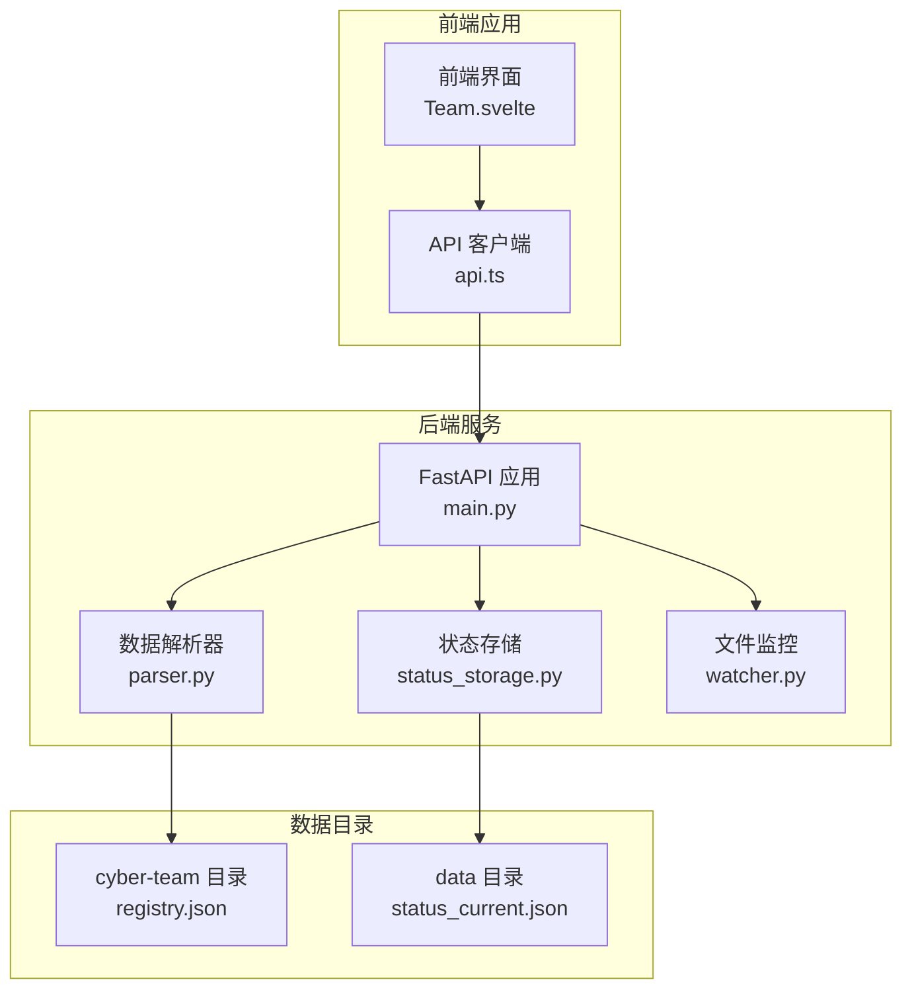
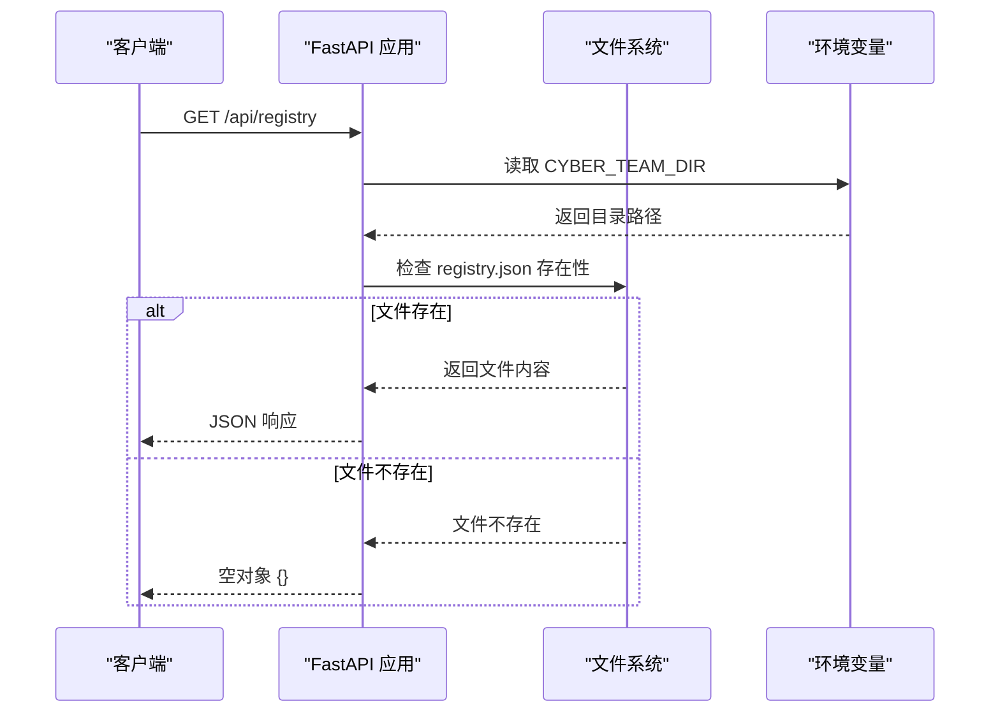
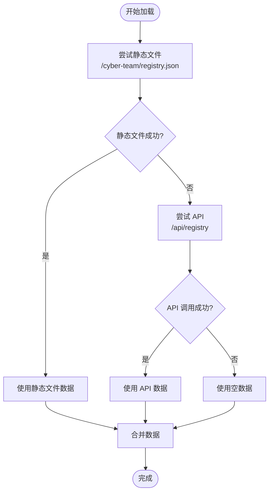
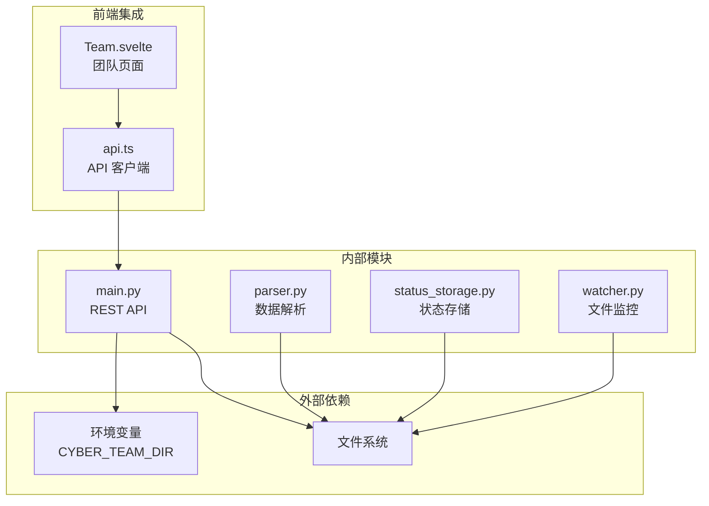

# 注册表查询端点

<cite>
**本文档引用的文件**
- [backend/main.py](file://backend/main.py)
- [backend/parser.py](file://backend/parser.py)
- [backend/status_storage.py](file://backend/status_storage.py)
- [backend/watcher.py](file://backend/watcher.py)
- [frontend/src/views/Team.svelte](file://frontend/src/views/Team.svelte)
- [frontend/src/lib/api.ts](file://frontend/src/lib/api.ts)
- [run.sh](file://run.sh)
</cite>

## 目录
1. [简介](#简介)
2. [项目结构](#项目结构)
3. [核心组件](#核心组件)
4. [架构概览](#架构概览)
5. [详细组件分析](#详细组件分析)
6. [依赖分析](#依赖分析)
7. [性能考虑](#性能考虑)
8. [故障排除指南](#故障排除指南)
9. [结论](#结论)
10. [附录](#附录)

## 简介
本文档详细说明 SynapseOS 2.0 中的注册表查询 REST API 端点，重点介绍 GET /api/registry 端点的功能、实现原理、文件系统访问机制和错误处理策略。该端点用于返回完整的 cyber-team 角色槽位和分配信息，为前端团队页面提供角色分配数据支持。

## 项目结构
SynapseOS 2.0 采用前后端分离的架构设计，后端使用 FastAPI 提供 REST API，前端使用 Svelte 构建用户界面。注册表查询端点位于后端服务中，通过环境变量配置的 cyber-team 目录提供数据。



**图表来源**
- [backend/main.py:185-495](file://backend/main.py#L185-L495)
- [backend/parser.py:1-509](file://backend/parser.py#L1-L509)
- [backend/status_storage.py:1-236](file://backend/status_storage.py#L1-L236)

**章节来源**
- [backend/main.py:1-495](file://backend/main.py#L1-L495)
- [run.sh:120-135](file://run.sh#L120-L135)

## 核心组件
注册表查询端点的核心组件包括：

### 主要端点实现
- **GET /api/registry**: 返回完整的 cyber-team 角色槽位和分配信息
- **环境变量配置**: CYBER_TEAM_DIR 指定 cyber-team 目录位置
- **文件系统访问**: 直接读取 registry.json 文件内容
- **错误处理**: 文件不存在时返回空对象

### 数据结构定义
后端使用 Python 数据类定义了完整的数据模型，包括：
- Mission: 使命信息
- Task: 任务信息  
- Blocker: 阻塞项
- Decision: 决策信息
- TeamMember: 团队成员信息

**章节来源**
- [backend/main.py:307-315](file://backend/main.py#L307-L315)
- [backend/parser.py:17-92](file://backend/parser.py#L17-L92)

## 架构概览
注册表查询端点在整个系统中的位置和交互关系如下：



**图表来源**
- [backend/main.py:307-315](file://backend/main.py#L307-L315)

**章节来源**
- [backend/main.py:27-31](file://backend/main.py#L27-L31)
- [backend/main.py:307-315](file://backend/main.py#L307-L315)

## 详细组件分析

### 注册表查询端点实现
注册表查询端点实现了以下功能特性：

#### 端点定义
- **HTTP 方法**: GET
- **路径**: /api/registry  
- **返回值**: JSON 对象或空对象
- **认证**: 无需认证
- **CORS**: 允许跨域请求

#### 实现逻辑
1. 从环境变量 CYBER_TEAM_DIR 获取 cyber-team 目录路径
2. 构造 registry.json 文件路径
3. 检查文件是否存在
4. 如果存在则读取并解析 JSON
5. 如果不存在则返回空对象

#### 错误处理策略
- 文件不存在：返回空对象 {}
- 文件读取异常：返回空对象
- 编码错误：返回空对象

**章节来源**
- [backend/main.py:307-315](file://backend/main.py#L307-L315)

### 前端集成实现
前端团队页面通过以下方式集成注册表查询端点：

#### 降级策略
前端实现了双路径加载策略：
1. 首先尝试从 `/cyber-team/registry.json` 直接访问静态文件
2. 如果失败则回退到 `/api/registry` REST API 调用

#### 数据合并逻辑
前端将注册表数据与实时状态面板数据进行合并：
- 支持 agent_id 精确匹配
- 支持 agent_name 去括号后匹配
- 支持双向包含匹配（处理中英文混写）



**图表来源**
- [frontend/src/views/Team.svelte:48-61](file://frontend/src/views/Team.svelte#L48-L61)

**章节来源**
- [frontend/src/views/Team.svelte:48-61](file://frontend/src/views/Team.svelte#L48-L61)

### 数据模型分析
注册表文件包含以下关键字段：

#### 角色槽位定义
- **roleKey**: 角色唯一标识符
- **roleLabel**: 角色显示名称
- **domain**: 所属业务域

#### 分配信息
- **agentId**: 分配给的代理 ID
- **assigned_to**: 分配给的人员姓名
- **domain**: 角色所属域

#### 前端角色映射
系统预定义了标准的角色槽位映射：
- **基础设施域**: 架构师、设计师、产品设计
- **在线业务域**: 架构师、开发者  
- **离线业务域**: 架构师、开发者
- **增长域**: 架构师、开发者
- **市场域**: 架构师、开发者

**章节来源**
- [frontend/src/views/Team.svelte:23-45](file://frontend/src/views/Team.svelte#L23-L45)

## 依赖分析
注册表查询端点的依赖关系和耦合度分析：



**图表来源**
- [backend/main.py:27-31](file://backend/main.py#L27-L31)
- [backend/parser.py:10-13](file://backend/parser.py#L10-L13)

### 模块间耦合度
- **低耦合**: 注册表端点只依赖环境变量和文件系统
- **单向依赖**: 前端依赖后端 API，后端不依赖前端
- **可替换性**: 文件系统访问可替换为数据库或其他存储

**章节来源**
- [backend/main.py:185-495](file://backend/main.py#L185-L495)

## 性能考虑
注册表查询端点的性能特性和优化建议：

### 性能特征
- **响应时间**: 文件系统读取，响应时间极短
- **内存占用**: JSON 解析后的对象大小取决于数据量
- **并发处理**: FastAPI 异步处理，支持高并发请求
- **缓存策略**: 前端实现 30 秒轮询刷新

### 优化建议
1. **文件系统优化**: 使用 SSD 存储 registry.json 文件
2. **网络传输**: 启用 HTTP 压缩减少传输体积
3. **缓存层**: 添加 Redis 缓存层减少磁盘 I/O
4. **分页策略**: 对于大型注册表考虑分页返回
5. **ETag 支持**: 添加条件请求支持

## 故障排除指南
常见问题和解决方案：

### 端点访问问题
- **404 错误**: 检查 CYBER_TEAM_DIR 环境变量设置
- **500 错误**: 检查 registry.json 文件权限和格式
- **空响应**: 确认文件存在且包含有效 JSON

### 前端集成问题
- **静态文件加载失败**: 检查 Nginx/Apache 静态文件配置
- **API 回退失败**: 检查 CORS 配置和网络连接
- **数据合并错误**: 验证 agent_id 和 agent_name 格式

### 环境配置问题
- **目录权限**: 确保应用用户对 cyber-team 目录有读取权限
- **文件编码**: 确认 registry.json 使用 UTF-8 编码
- **路径分隔符**: 注意不同操作系统的路径分隔符差异

**章节来源**
- [backend/main.py:307-315](file://backend/main.py#L307-L315)
- [frontend/src/views/Team.svelte:48-61](file://frontend/src/views/Team.svelte#L48-L61)

## 结论
注册表查询端点作为 SynapseOS 2.0 的核心数据接口，提供了简洁高效的角色槽位和分配信息查询能力。其设计体现了以下特点：

1. **简单可靠**: 直接文件系统访问，实现简单，维护成本低
2. **灵活部署**: 通过环境变量配置，支持多种部署场景
3. **前后端解耦**: 前后端通过 REST API 通信，便于独立开发和部署
4. **容错处理**: 完善的错误处理机制，确保系统稳定性

该端点为团队管理提供了坚实的数据基础，支持实时状态监控和角色分配管理。

## 附录

### API 定义
- **端点**: GET /api/registry
- **请求参数**: 无
- **响应格式**: JSON 对象或空对象 {}
- **状态码**: 200 成功，500 服务器错误

### 响应示例
```json
{
  "infrastructure-architect": {
    "roleKey": "infrastructure-architect",
    "roleLabel": "架构师",
    "domain": "infrastructure",
    "agentId": "reed",
    "assigned_to": "里德",
    "domain": "infrastructure"
  },
  "infrastructure-designer": {
    "roleKey": "infrastructure-designer", 
    "roleLabel": "设计师",
    "domain": "infrastructure",
    "agentId": "susan",
    "assigned_to": "苏珊",
    "domain": "infrastructure"
  }
}
```

### 客户端集成示例
```typescript
// 前端调用示例
async function loadRegistry() {
  try {
    const r = await fetch("/cyber-team/registry.json");
    if (r.ok) {
      return await r.json();
    } else {
      const r2 = await fetch("/api/registry");
      return r2.ok ? await r2.json() : {};
    }
  } catch (e) {
    console.warn("注册表加载失败:", e);
    return {};
  }
}
```

**章节来源**
- [frontend/src/views/Team.svelte:48-61](file://frontend/src/views/Team.svelte#L48-L61)
- [frontend/src/lib/api.ts:95-98](file://frontend/src/lib/api.ts#L95-L98)