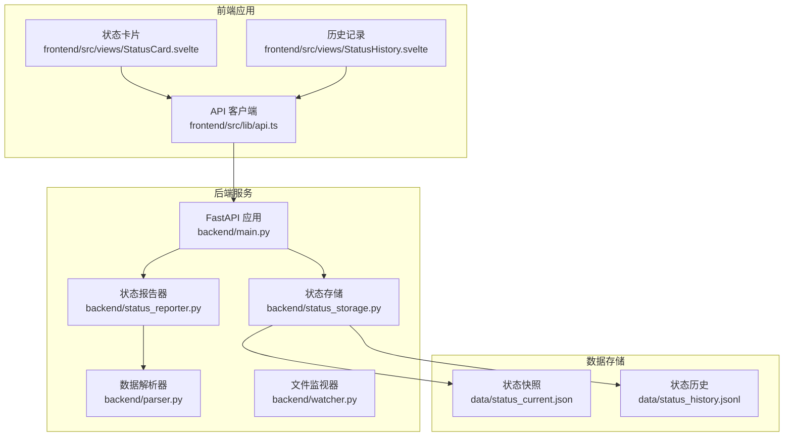
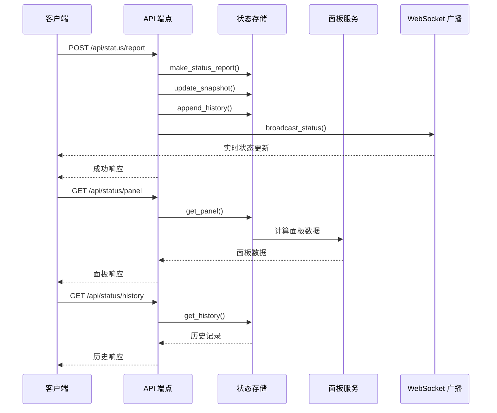
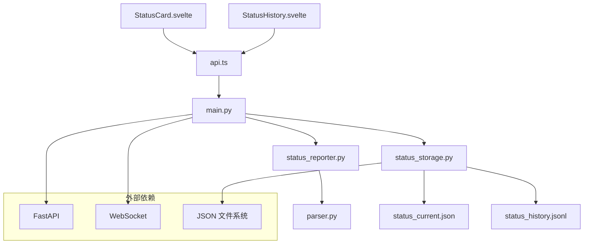

# 状态管理端点

<cite>
**本文档引用的文件**
- [backend/main.py](file://backend/main.py)
- [backend/status_storage.py](file://backend/status_storage.py)
- [backend/status_reporter.py](file://backend/status_reporter.py)
- [backend/parser.py](file://backend/parser.py)
- [backend/watcher.py](file://backend/watcher.py)
- [data/status_current.json](file://data/status_current.json)
- [data/status_history.jsonl](file://data/status_history.jsonl)
- [frontend/src/lib/api.ts](file://frontend/src/lib/api.ts)
- [frontend/src/views/StatusCard.svelte](file://frontend/src/views/StatusCard.svelte)
- [frontend/src/views/StatusHistory.svelte](file://frontend/src/views/StatusHistory.svelte)
</cite>

## 目录
1. [简介](#简介)
2. [项目结构](#项目结构)
3. [核心组件](#核心组件)
4. [架构概览](#架构概览)
5. [详细组件分析](#详细组件分析)
6. [依赖关系分析](#依赖关系分析)
7. [性能考虑](#性能考虑)
8. [故障排除指南](#故障排除指南)
9. [结论](#结论)

## 简介

SynapseOS 2.0 状态管理系统是一个基于 FastAPI 构建的实时状态监控平台，专门用于跟踪和展示团队成员的工作状态。该系统通过自动扫描任务文件来生成状态报告，并提供多种 REST API 端点来查询和管理状态数据。

系统的核心功能包括：
- 实时状态报告生成和存储
- 历史记录查询和过滤
- 面板数据聚合和展示
- WebSocket 实时推送
- 多种状态事件类型处理

## 项目结构



**图表来源**
- [backend/main.py:185-495](file://backend/main.py#L185-L495)
- [backend/status_storage.py:1-236](file://backend/status_storage.py#L1-L236)
- [backend/status_reporter.py:1-274](file://backend/status_reporter.py#L1-L274)

**章节来源**
- [backend/main.py:1-495](file://backend/main.py#L1-L495)
- [backend/status_storage.py:1-236](file://backend/status_storage.py#L1-L236)
- [backend/status_reporter.py:1-274](file://backend/status_reporter.py#L1-L274)

## 核心组件

### 状态存储模块
状态存储模块负责管理状态数据的持久化存储，包括当前状态快照和历史记录。

**关键特性：**
- JSON 格式存储，易于解析和查询
- 支持增量更新和批量操作
- 提供数据验证和类型转换
- 支持历史记录的分页查询

**章节来源**
- [backend/status_storage.py:33-193](file://backend/status_storage.py#L33-L193)

### 状态报告器
状态报告器负责从任务文件中提取状态信息，生成标准化的状态报告。

**核心功能：**
- 解析 Markdown 任务文件
- 提取执行者、状态、困难、决策等信息
- 生成标准化的状态报告结构
- 支持多执行者任务的聚合

**章节来源**
- [backend/status_reporter.py:189-244](file://backend/status_reporter.py#L189-L244)

### 数据解析器
数据解析器负责解析整个 cyber-team 目录中的数据，构建完整的项目视图。

**处理能力：**
- 解析任务文件中的各种字段
- 提取决策状态和阻塞信息
- 构建团队成员和里程碑数据
- 支持多种数据格式和编码

**章节来源**
- [backend/parser.py:203-343](file://backend/parser.py#L203-L343)

## 架构概览



**图表来源**
- [backend/main.py:318-394](file://backend/main.py#L318-L394)
- [backend/status_storage.py:102-193](file://backend/status_storage.py#L102-L193)

## 详细组件分析

### POST /api/status/report 端点

#### 功能概述
员工提交状态报告的主要入口点，支持标准状态报告、困难报告和决策请求。

#### 请求参数
| 参数名 | 类型 | 必需 | 描述 | 默认值 |
|--------|------|------|------|--------|
| agent_id | string | 是 | 员工唯一标识符 | 无 |
| agent_name | string | 否 | 员工姓名 | 空字符串 |
| role | string | 否 | 员工角色 | 空字符串 |
| domain | string | 否 | 工作领域 | 空字符串 |
| current_task | string | 否 | 当前任务描述 | 空字符串 |
| progress | string | 否 | 进展状态 | "idle" |
| progress_detail | string | 否 | 进展详情 | 空字符串 |
| difficulty | string | 否 | 困难描述 | null |
| difficulty_level | string | 否 | 困难级别 | "none" |
| needs_decision | string | 否 | 需要决策的内容 | null |
| needs_help | string | 否 | 需要帮助的内容 | null |
| task_id | string | 否 | 任务ID | 空字符串 |
| metadata | object | 否 | 自定义元数据 | 空对象 |
| type | string | 否 | 报告类型 | "report" |

#### 响应格式
```json
{
  "success": true,
  "report_id": "rpt_20260323_164215_susan",
  "next_report_at": "2026-03-26T00:16:14.792036+08:00"
}
```

#### 状态事件类型
根据报告内容自动确定事件类型：
- **status_updated**: 标准状态报告
- **difficulty_reported**: 困难报告
- **decision_requested**: 决策请求

#### 数据验证规则
- `agent_id` 必须存在且非空
- `progress` 必须是预定义状态之一
- `difficulty_level` 必须是 "none"、"minor" 或 "blocking"
- 时间戳使用 ISO 8601 格式

**章节来源**
- [backend/main.py:318-347](file://backend/main.py#L318-L347)
- [backend/status_storage.py:33-58](file://backend/status_storage.py#L33-L58)

### GET /api/status/panel 端点

#### 功能概述
获取所有员工的实时状态面板数据，包含在线状态检测和过期时间计算。

#### 响应格式
```json
{
  "updated_at": "2026-03-26T00:01:14.792831+08:00",
  "agents": [
    {
      "agent_id": "susan",
      "agent_name": "苏珊",
      "role": "产品设计师",
      "domain": "infrastructure",
      "current_task": "SynapseOS 2.0 UI/UX 设计规范",
      "progress": "developing",
      "progress_detail": "[task-infra-002] 进行中",
      "difficulty": null,
      "difficulty_level": "none",
      "needs_decision": null,
      "needs_help": null,
      "task_id": "task-infra-002",
      "last_report_at": "2026-03-26T00:01:14.791702+08:00",
      "next_report_at": "2026-03-26T00:16:14.791740+08:00",
      "online_status": "online",
      "is_stale": false
    }
  ],
  "stale_threshold_minutes": 5
}
```

#### 面板数据聚合逻辑
1. **过期检测**: 基于 `last_report_at` 和 `stale_threshold_minutes` 计算
2. **在线状态**: "online"(正常) 或 "stale"(过期)
3. **状态合并**: 同一员工的多个任务信息合并

**章节来源**
- [backend/main.py:349-353](file://backend/main.py#L349-L353)
- [backend/status_storage.py:102-127](file://backend/status_storage.py#L102-L127)

### GET /api/status/history 端点

#### 功能概述
获取状态历史记录，支持多种过滤条件和分页机制。

#### 查询参数
| 参数名 | 类型 | 必需 | 描述 | 默认值 |
|--------|------|------|------|--------|
| agent_id | string | 否 | 员工ID过滤 | 无 |
| type | string | 否 | 报告类型过滤 | 无 |
| from_time | string | 否 | 开始时间过滤 | 无 |
| to_time | string | 否 | 结束时间过滤 | 无 |
| task_id | string | 否 | 任务ID过滤 | 无 |
| page | integer | 否 | 页码 | 1 |
| limit | integer | 否 | 每页数量 | 20 (最大100) |

#### 响应格式
```json
{
  "total": 150,
  "page": 1,
  "limit": 20,
  "records": [
    {
      "report_id": "rpt_20260323_164215_susan",
      "agent_id": "susan",
      "agent_name": "苏珊",
      "role": "主设计师",
      "domain": "infrastructure",
      "current_task": "状态面板 UI 设计",
      "progress": "developing",
      "progress_detail": "设计稿完成 60%，准备对接 API",
      "difficulty": null,
      "difficulty_level": "none",
      "needs_decision": "汇报间隔选 15 分钟还是 20 分钟？",
      "needs_help": null,
      "task_id": "task-infra-004",
      "metadata": {},
      "type": "decision",
      "created_at": "2026-03-23T16:42:15.977048+08:00"
    }
  ]
}
```

#### 过滤机制
- **精确匹配**: `agent_id`、`type`、`task_id`
- **范围过滤**: `from_time`、`to_time` 支持时间范围查询
- **顺序**: 历史记录按时间倒序排列

#### 分页机制
- **页码**: 从 1 开始
- **限制**: 最大 100 条记录/页
- **总记录数**: `total` 字段提供总数

**章节来源**
- [backend/main.py:355-375](file://backend/main.py#L355-L375)
- [backend/status_storage.py:146-193](file://backend/status_storage.py#L146-L193)

### GET /api/status/{agent_id} 端点

#### 功能概述
获取指定员工的当前状态信息。

#### 路径参数
| 参数名 | 类型 | 必需 | 描述 |
|--------|------|------|------|
| agent_id | string | 是 | 员工唯一标识符 |

#### 响应格式
返回单个员工的完整状态信息，格式与面板数据中的单个员工条目相同。

#### 错误处理
- **404 Not Found**: 当员工不存在时返回错误信息

**章节来源**
- [backend/main.py:377-384](file://backend/main.py#L377-L384)

### POST /api/status/difficulty 端点

#### 功能概述
专门用于报告困难的端点，简化了困难报告的提交流程。

#### 请求参数
支持标准状态报告的所有参数，自动设置：
- `type`: "difficulty"
- `difficulty_level`: 如果未指定，默认为 "minor"

#### 响应格式
与标准报告端点相同，包含成功状态和报告ID。

#### 使用场景
当员工遇到技术困难或工作阻碍时，使用此端点快速上报。

**章节来源**
- [backend/main.py:387-394](file://backend/main.py#L387-L394)

## 依赖关系分析



**图表来源**
- [backend/main.py:17-21](file://backend/main.py#L17-L21)
- [backend/status_storage.py:10-13](file://backend/status_storage.py#L10-L13)

### 组件耦合度分析

**高内聚组件：**
- `status_storage.py`: 状态数据管理，职责单一明确
- `status_reporter.py`: 状态报告生成，逻辑集中

**松耦合接口：**
- API 端点与存储层通过函数接口分离
- 前端通过标准化 API 接口访问后端服务

**潜在循环依赖：**
- 无直接循环依赖，各模块职责清晰分离

**章节来源**
- [backend/main.py:17-21](file://backend/main.py#L17-L21)
- [backend/status_storage.py:10-13](file://backend/status_storage.py#L10-L13)

## 性能考虑

### 数据存储优化
- **增量更新**: 使用 `update_snapshot()` 进行局部更新，避免全量写入
- **内存缓存**: `get_panel()` 计算在线状态，减少重复计算
- **文件格式**: JSONL 格式便于流式读取和追加写入

### 查询性能
- **索引策略**: 历史记录按时间倒序存储，查询时可快速定位
- **分页限制**: 限制每页最大记录数，防止内存溢出
- **过滤优化**: 支持多字段过滤，但建议合理使用以提高效率

### 并发处理策略
- **线程安全**: 状态报告器在独立线程中运行，避免阻塞主事件循环
- **异步广播**: WebSocket 广播使用异步队列，支持高并发连接
- **文件锁**: JSON 文件读写采用原子操作，确保数据一致性

### 缓存机制
- **面板缓存**: `get_panel()` 计算结果可被多次复用
- **历史缓存**: 历史记录按时间排序，支持快速分页访问

## 故障排除指南

### 常见问题及解决方案

**问题 1: 状态报告未显示**
- 检查 `CYBER_TEAM_DIR` 环境变量是否正确设置
- 确认任务文件格式符合要求
- 验证 WebSocket 连接状态

**问题 2: 历史记录查询为空**
- 检查 `status_history.jsonl` 文件是否存在
- 验证查询参数格式（ISO 8601 时间格式）
- 确认过滤条件是否过于严格

**问题 3: 面板数据显示异常**
- 检查 `status_current.json` 文件完整性
- 验证 `last_report_at` 时间戳格式
- 确认 `STALE_THRESHOLD_MINUTES` 配置是否合理

### 调试工具
- **日志输出**: 系统会在关键操作处输出调试信息
- **文件监控**: `DataWatcher` 监控数据目录变化
- **状态检查**: 通过 `/api/status/panel` 端点检查当前状态

**章节来源**
- [backend/watcher.py:21-35](file://backend/watcher.py#L21-L35)
- [backend/status_storage.py:62-69](file://backend/status_storage.py#L62-L69)

## 结论

SynapseOS 2.0 状态管理系统通过模块化的设计实现了高效的状态管理和实时监控。系统的主要优势包括：

**技术优势：**
- 清晰的模块分离和职责划分
- 高效的数据存储和查询机制
- 完善的实时通信支持
- 灵活的过滤和分页功能

**扩展性特点：**
- 易于添加新的状态事件类型
- 支持自定义元数据字段
- 可配置的阈值和间隔参数
- 标准化的 API 接口设计

**未来改进建议：**
- 添加数据库支持以提高大规模数据处理能力
- 实现更细粒度的权限控制
- 增加状态统计和报表功能
- 优化 WebSocket 连接池管理

该系统为团队协作提供了强大的技术支持，能够有效提升项目透明度和沟通效率。