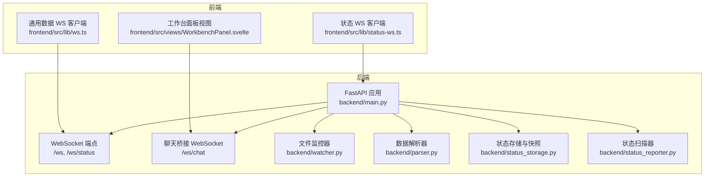
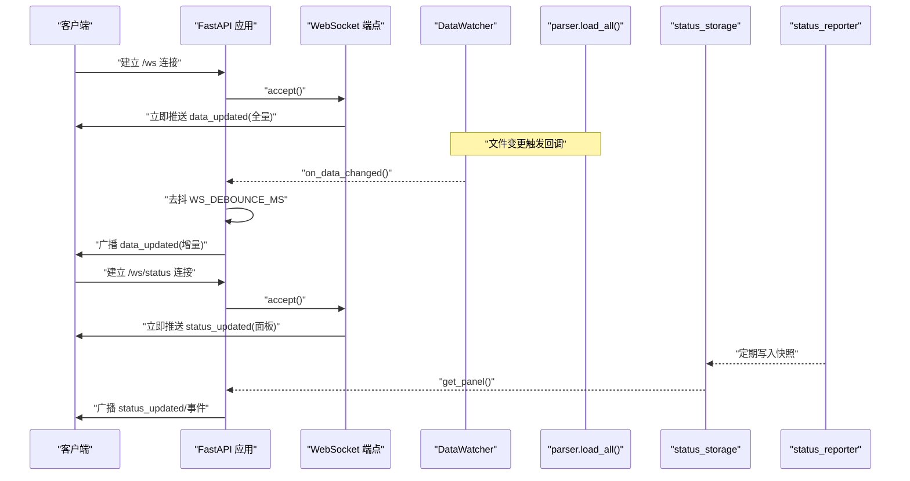
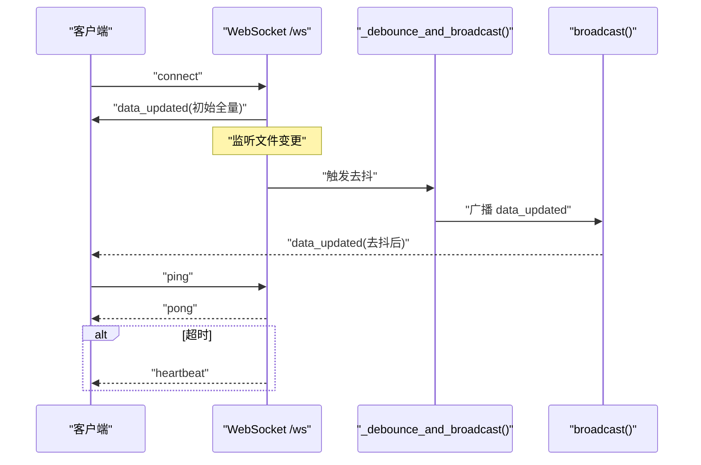
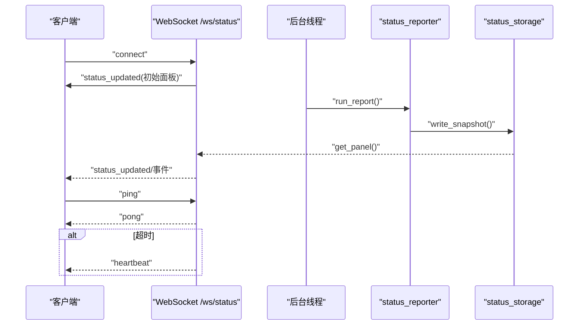
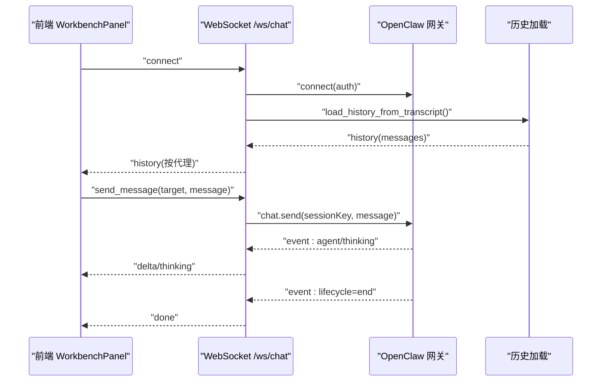
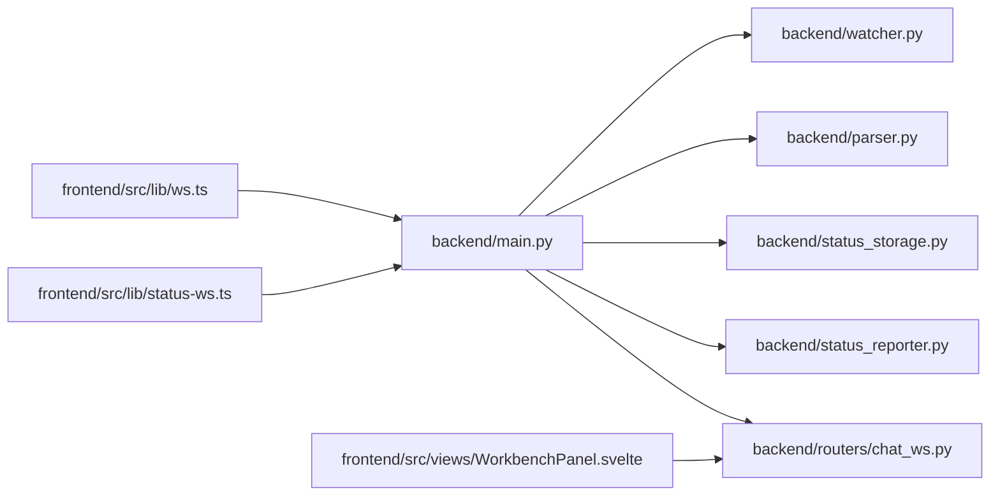

# WebSocket 服务

<cite>
**本文引用的文件**
- [backend/main.py](file://backend/main.py)
- [backend/routers/chat_ws.py](file://backend/routers/chat_ws.py)
- [backend/parser.py](file://backend/parser.py)
- [backend/watcher.py](file://backend/watcher.py)
- [backend/status_storage.py](file://backend/status_storage.py)
- [backend/status_reporter.py](file://backend/status_reporter.py)
- [frontend/src/lib/ws.ts](file://frontend/src/lib/ws.ts)
- [frontend/src/lib/status-ws.ts](file://frontend/src/lib/status-ws.ts)
- [frontend/src/views/WorkbenchPanel.svelte](file://frontend/src/views/WorkbenchPanel.svelte)
</cite>

## 目录
1. [简介](#简介)
2. [项目结构](#项目结构)
3. [核心组件](#核心组件)
4. [架构总览](#架构总览)
5. [详细组件分析](#详细组件分析)
6. [依赖关系分析](#依赖关系分析)
7. [性能与并发](#性能与并发)
8. [故障排查指南](#故障排查指南)
9. [结论](#结论)
10. [附录](#附录)

## 简介
本文件面向 SynapseOS 2.0 的 WebSocket 服务，系统性梳理两个 WebSocket 端点：
- /ws：数据更新广播通道，向所有连接的客户端推送业务数据变更。
- /ws/status：状态面板更新通道，向订阅客户端推送状态面板与事件。

文档覆盖连接管理、心跳与断线重连、客户端去活处理、消息格式与事件类型、实时通信协议、性能优化与并发管理、错误处理策略，并提供前后端交互示例路径，帮助开发者快速上手与扩展。

## 项目结构
后端采用 FastAPI 提供 REST API 与 WebSocket 服务，前端通过 Svelte 组件与 WebSocket 交互。数据来源由文件系统监控与解析器统一产出，状态面板由后台定时扫描任务文件生成。

图表来源
- [backend/main.py:396-477](file://backend/main.py#L396-L477)
- [backend/routers/chat_ws.py:174-353](file://backend/routers/chat_ws.py#L174-L353)
- [backend/watcher.py:8-52](file://backend/watcher.py#L8-L52)
- [backend/parser.py:441-509](file://backend/parser.py#L441-L509)
- [backend/status_storage.py:102-127](file://backend/status_storage.py#L102-L127)
- [backend/status_reporter.py:258-267](file://backend/status_reporter.py#L258-L267)
- [frontend/src/lib/ws.ts:26-84](file://frontend/src/lib/ws.ts#L26-L84)
- [frontend/src/lib/status-ws.ts:18-78](file://frontend/src/lib/status-ws.ts#L18-L78)
- [frontend/src/views/WorkbenchPanel.svelte:82-149](file://frontend/src/views/WorkbenchPanel.svelte#L82-L149)

章节来源
- [backend/main.py:396-477](file://backend/main.py#L396-L477)
- [backend/routers/chat_ws.py:174-353](file://backend/routers/chat_ws.py#L174-L353)
- [frontend/src/lib/ws.ts:26-84](file://frontend/src/lib/ws.ts#L26-L84)
- [frontend/src/lib/status-ws.ts:18-78](file://frontend/src/lib/status-ws.ts#L18-L78)
- [frontend/src/views/WorkbenchPanel.svelte:82-149](file://frontend/src/views/WorkbenchPanel.svelte#L82-L149)

## 核心组件
- 数据更新广播通道（/ws）
  - 连接接入后立即推送一次全量数据；随后按 WS_DEBOUNCE_MS 去抖后批量广播。
  - 心跳：超时未收到客户端 ping 时，自动发送 heartbeat；客户端可发送 ping 获取 pong。
  - 断线重连：客户端侧实现指数回退重连；清理失效连接。
- 状态面板更新通道（/ws/status）
  - 连接接入后立即推送当前面板；后台通过线程扫描任务文件，触发异步广播。
  - 支持多种事件类型：status_updated、difficulty_reported、decision_requested。
  - 心跳与断线重连策略同上。
- 聊天桥接 WebSocket（/ws/chat）
  - 连接后加载历史消息；支持多代理切换与会话管理；流式 delta 推送。
  - 与网关（OpenClaw）建立连接，请求/响应匹配，跨流事件路由。
- 文件监控与解析
  - DataWatcher 监控数据目录变化，触发回调；parser 统一解析任务/使命/团队等数据。
- 状态存储与扫描
  - status_storage 提供快照与历史存取；status_reporter 扫描任务文件生成状态快照。

章节来源
- [backend/main.py:44-93](file://backend/main.py#L44-L93)
- [backend/main.py:442-477](file://backend/main.py#L442-L477)
- [backend/routers/chat_ws.py:174-353](file://backend/routers/chat_ws.py#L174-L353)
- [backend/watcher.py:8-52](file://backend/watcher.py#L8-L52)
- [backend/parser.py:441-509](file://backend/parser.py#L441-L509)
- [backend/status_storage.py:102-127](file://backend/status_storage.py#L102-L127)
- [backend/status_reporter.py:258-267](file://backend/status_reporter.py#L258-L267)

## 架构总览
WebSocket 服务与数据层解耦，通过应用生命周期统一管理连接与广播。数据更新通道基于文件变更事件驱动，状态通道基于定时扫描驱动。

图表来源
- [backend/main.py:61-93](file://backend/main.py#L61-L93)
- [backend/main.py:105-161](file://backend/main.py#L105-L161)
- [backend/watcher.py:21-34](file://backend/watcher.py#L21-L34)
- [backend/parser.py:441-509](file://backend/parser.py#L441-L509)
- [backend/status_storage.py:102-127](file://backend/status_storage.py#L102-L127)
- [backend/status_reporter.py:258-267](file://backend/status_reporter.py#L258-L267)

## 详细组件分析

### 数据更新广播通道（/ws）
- 连接管理
  - 接入后立即推送一次全量数据；维护全局连接列表，断开时清理。
- 心跳与保活
  - 客户端发送 ping，服务端返回 pong；超时未收到则发送 heartbeat。
- 去抖与广播
  - 使用去抖任务在 WS_DEBOUNCE_MS 后统一广播，降低频繁刷新带来的压力。
- 断线重连与客户端去活
  - 客户端侧实现指数回退重连；服务端在发送异常时清理失效连接。

图表来源
- [backend/main.py:396-440](file://backend/main.py#L396-L440)
- [backend/main.py:61-93](file://backend/main.py#L61-L93)
- [backend/main.py:44-60](file://backend/main.py#L44-L60)

章节来源
- [backend/main.py:396-440](file://backend/main.py#L396-L440)
- [backend/main.py:44-60](file://backend/main.py#L44-L60)
- [frontend/src/lib/ws.ts:26-84](file://frontend/src/lib/ws.ts#L26-L84)

### 状态面板更新通道（/ws/status）
- 连接管理
  - 接入后立即推送当前面板；维护独立连接列表。
- 事件类型
  - status_updated：面板整体更新。
  - difficulty_reported：某代理报告困难。
  - decision_requested：某代理请求决策。
- 广播机制
  - 后台线程每 60 秒扫描任务文件，生成快照并触发异步广播。
- 心跳与断线重连
  - 与 /ws 类似的心跳与重连策略。

图表来源
- [backend/main.py:442-477](file://backend/main.py#L442-L477)
- [backend/main.py:105-161](file://backend/main.py#L105-L161)
- [backend/status_reporter.py:258-267](file://backend/status_reporter.py#L258-L267)
- [backend/status_storage.py:102-127](file://backend/status_storage.py#L102-L127)

章节来源
- [backend/main.py:442-477](file://backend/main.py#L442-L477)
- [backend/main.py:105-161](file://backend/main.py#L105-L161)
- [frontend/src/lib/status-ws.ts:18-78](file://frontend/src/lib/status-ws.ts#L18-L78)

### 聊天桥接 WebSocket（/ws/chat）
- 连接与历史
  - 建立与网关的 WebSocket 连接；加载最近历史消息并推送给客户端。
- 会话与代理
  - 支持多代理（main/susan/reed），按代理维护会话键与运行 ID 映射，防止跨流事件。
- 流式事件
  - 支持 agent/thinking/lifecycle 等事件；delta 事件用于流式输出，done 事件结束一次流。
- 请求/响应匹配
  - 使用请求 ID 匹配响应，确保事件路由正确。

图表来源
- [backend/routers/chat_ws.py:174-353](file://backend/routers/chat_ws.py#L174-L353)
- [frontend/src/views/WorkbenchPanel.svelte:82-149](file://frontend/src/views/WorkbenchPanel.svelte#L82-L149)

章节来源
- [backend/routers/chat_ws.py:174-353](file://backend/routers/chat_ws.py#L174-L353)
- [frontend/src/views/WorkbenchPanel.svelte:82-149](file://frontend/src/views/WorkbenchPanel.svelte#L82-L149)

### 消息格式与事件类型
- 通用字段
  - type：消息类型字符串。
  - payload：消息载荷对象。
  - timestamp：ISO 时间戳字符串。
- /ws 事件
  - data_updated：全量/增量数据。
  - heartbeat：心跳包。
  - pong：对 ping 的响应。
- /ws/status 事件
  - status_updated：面板更新。
  - difficulty_reported：困难报告。
  - decision_requested：决策请求。
- /ws/chat 事件
  - history：历史消息列表。
  - delta：流式文本片段。
  - thinking：推理/思考片段。
  - done：一次流结束。
  - error：错误信息。
- /ws/chat 请求
  - send_message：发送消息至指定代理。
  - switch_agent：切换当前代理。

章节来源
- [backend/main.py:396-440](file://backend/main.py#L396-L440)
- [backend/main.py:442-477](file://backend/main.py#L442-L477)
- [backend/routers/chat_ws.py:216-279](file://backend/routers/chat_ws.py#L216-L279)
- [backend/routers/chat_ws.py:307-337](file://backend/routers/chat_ws.py#L307-L337)

### 实时通信协议与示例路径
- 建立 /ws 连接
  - 前端示例路径：[frontend/src/lib/ws.ts:26-84](file://frontend/src/lib/ws.ts#L26-L84)
- 发送消息与处理事件（/ws）
  - 前端示例路径：[frontend/src/lib/ws.ts:43-55](file://frontend/src/lib/ws.ts#L43-L55)
- 建立 /ws/status 连接
  - 前端示例路径：[frontend/src/lib/status-ws.ts:18-78](file://frontend/src/lib/status-ws.ts#L18-L78)
- 发送消息与处理事件（/ws/status）
  - 前端示例路径：[frontend/src/lib/status-ws.ts:35-49](file://frontend/src/lib/status-ws.ts#L35-L49)
- 建立 /ws/chat 连接
  - 前端示例路径：[frontend/src/views/WorkbenchPanel.svelte:82-149](file://frontend/src/views/WorkbenchPanel.svelte#L82-L149)
- 发送消息与处理事件（/ws/chat）
  - 前端示例路径：[frontend/src/views/WorkbenchPanel.svelte:152-183](file://frontend/src/views/WorkbenchPanel.svelte#L152-L183)

## 依赖关系分析
- 后端模块耦合
  - main.py 依赖 watcher、parser、status_storage、status_reporter。
  - chat_ws.py 依赖 websockets、gateway 配置与会话映射。
- 前端模块耦合
  - ws.ts 与 status-ws.ts 分别与各自端点交互。
  - WorkbenchPanel.svelte 与 /ws/chat 交互，负责 UI 渲染与用户输入。

图表来源
- [backend/main.py:185-197](file://backend/main.py#L185-L197)
- [backend/routers/chat_ws.py:13-28](file://backend/routers/chat_ws.py#L13-L28)
- [frontend/src/lib/ws.ts:15-24](file://frontend/src/lib/ws.ts#L15-L24)
- [frontend/src/lib/status-ws.ts:12-16](file://frontend/src/lib/status-ws.ts#L12-L16)
- [frontend/src/views/WorkbenchPanel.svelte:82-87](file://frontend/src/views/WorkbenchPanel.svelte#L82-L87)

章节来源
- [backend/main.py:185-197](file://backend/main.py#L185-L197)
- [backend/routers/chat_ws.py:13-28](file://backend/routers/chat_ws.py#L13-L28)
- [frontend/src/lib/ws.ts:15-24](file://frontend/src/lib/ws.ts#L15-L24)
- [frontend/src/lib/status-ws.ts:12-16](file://frontend/src/lib/status-ws.ts#L12-L16)
- [frontend/src/views/WorkbenchPanel.svelte:82-87](file://frontend/src/views/WorkbenchPanel.svelte#L82-L87)

## 性能与并发
- 去抖广播
  - /ws 使用 WS_DEBOUNCE_MS（毫秒级）去抖，减少高频变更导致的广播风暴。
- 连接清理
  - 广播时捕获异常并移除失效连接，避免阻塞后续广播。
- 异步广播循环
  - /ws/status 使用独立异步任务监听状态变更事件，避免阻塞主事件循环。
- 并发连接管理
  - 维护独立的连接列表（connected_clients、status_clients），分别广播，隔离影响。
- I/O 与 CPU
  - 文件监控与解析在后台线程/协程中执行，避免阻塞 WebSocket 事件循环。
- 建议
  - 对于高并发场景，可考虑连接池、限速与背压策略；对大消息分片传输；对客户端进行白名单与速率限制。

章节来源
- [backend/main.py:31-36](file://backend/main.py#L31-L36)
- [backend/main.py:44-60](file://backend/main.py#L44-L60)
- [backend/main.py:68-84](file://backend/main.py#L68-L84)
- [backend/main.py:145-161](file://backend/main.py#L145-L161)

## 故障排查指南
- 连接问题
  - 检查 CORS 配置是否允许来源；确认端口与协议（ws/wss）一致。
  - 查看后端日志中连接数与清理动作。
- 心跳与保活
  - 若客户端长时间无响应，服务端会发送 heartbeat；检查客户端是否正确处理。
  - 客户端 ping/pong 逻辑需与服务端超时阈值匹配。
- 断线重连
  - 客户端指数回退重连；若仍失败，检查网络与代理配置。
- /ws/chat
  - 确认网关地址与令牌配置；检查会话键映射与 runId 路由。
  - 关注历史加载与流式事件的边界条件（空内容、错误事件）。
- 状态面板
  - 确认后台线程正常运行；检查任务文件是否存在与权限；核对快照写入与读取。

章节来源
- [backend/main.py:187-193](file://backend/main.py#L187-L193)
- [backend/main.py:418-440](file://backend/main.py#L418-L440)
- [backend/main.py:460-476](file://backend/main.py#L460-L476)
- [backend/routers/chat_ws.py:117-135](file://backend/routers/chat_ws.py#L117-L135)
- [backend/routers/chat_ws.py:220-281](file://backend/routers/chat_ws.py#L220-L281)

## 结论
SynapseOS 2.0 的 WebSocket 服务通过清晰的通道分离与去抖广播策略，实现了高效的数据更新与状态面板实时推送。结合前端的断线重连与流式渲染，提供了良好的用户体验。建议在生产环境中进一步完善连接限流、消息分片与错误恢复策略，以应对更高并发与更复杂的业务场景。

## 附录
- 关键实现参考路径
  - /ws 连接与广播：[backend/main.py:396-440](file://backend/main.py#L396-L440)
  - /ws/status 连接与广播：[backend/main.py:442-477](file://backend/main.py#L442-L477)
  - /ws/chat 连接与事件：[backend/routers/chat_ws.py:174-353](file://backend/routers/chat_ws.py#L174-L353)
  - 文件监控与解析：[backend/watcher.py:8-52](file://backend/watcher.py#L8-L52)、[backend/parser.py:441-509](file://backend/parser.py#L441-L509)
  - 状态存储与扫描：[backend/status_storage.py:102-127](file://backend/status_storage.py#L102-L127)、[backend/status_reporter.py:258-267](file://backend/status_reporter.py#L258-L267)
  - 前端 WS 客户端：[frontend/src/lib/ws.ts:26-84](file://frontend/src/lib/ws.ts#L26-L84)、[frontend/src/lib/status-ws.ts:18-78](file://frontend/src/lib/status-ws.ts#L18-L78)
  - 聊天桥接前端：[frontend/src/views/WorkbenchPanel.svelte:82-149](file://frontend/src/views/WorkbenchPanel.svelte#L82-L149)