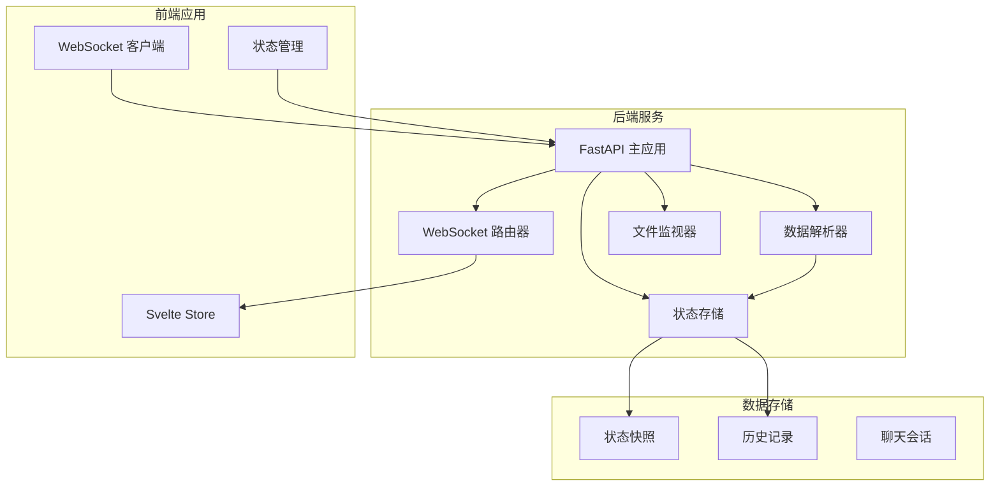
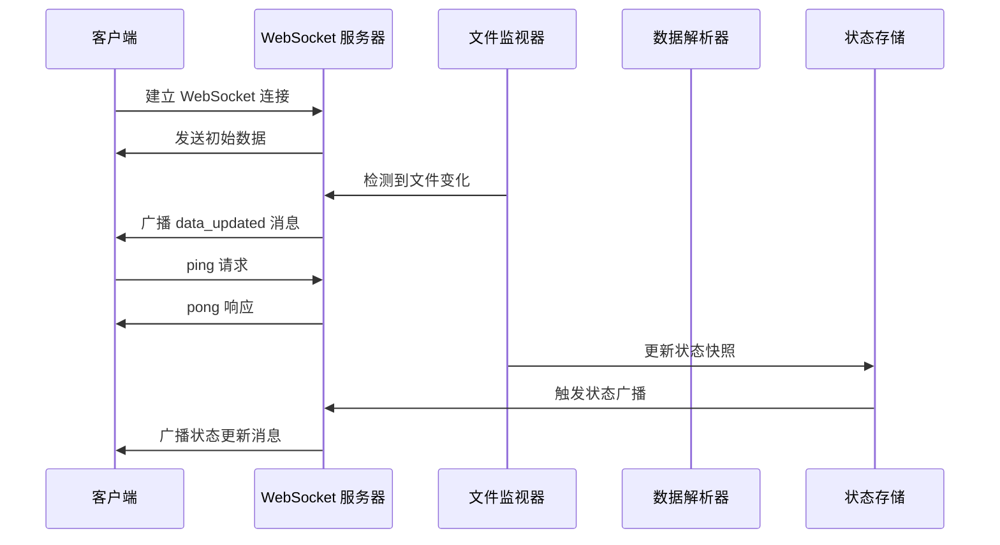
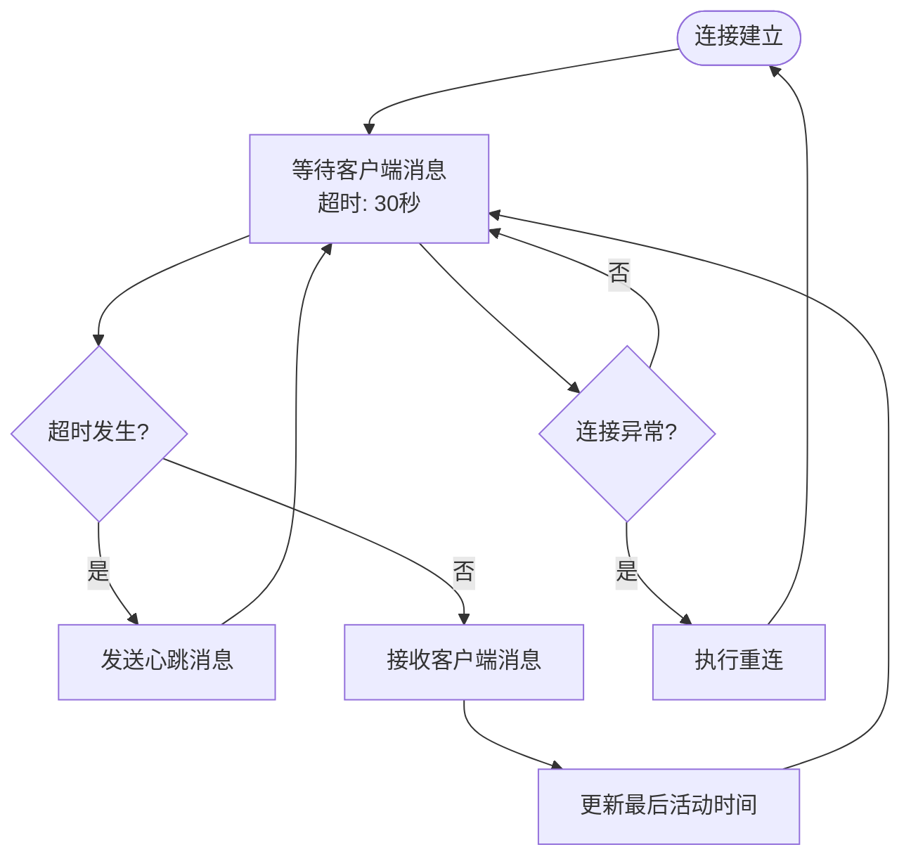
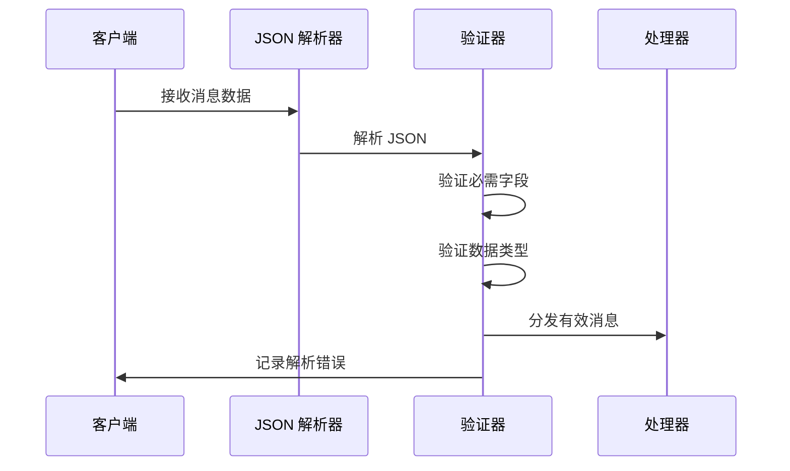

# WebSocket 消息格式规范

<cite>
**本文档引用的文件**
- [backend/main.py](file://backend/main.py)
- [backend/routers/chat_ws.py](file://backend/routers/chat_ws.py)
- [frontend/src/lib/ws.ts](file://frontend/src/lib/ws.ts)
- [frontend/src/lib/status-ws.ts](file://frontend/src/lib/status-ws.ts)
- [backend/parser.py](file://backend/parser.py)
- [backend/watcher.py](file://backend/watcher.py)
- [backend/status_reporter.py](file://backend/status_reporter.py)
- [backend/status_storage.py](file://backend/status_storage.py)
- [data/status_current.json](file://data/status_current.json)
- [data/status_history.jsonl](file://data/status_history.jsonl)
</cite>

## 目录
1. [简介](#简介)
2. [项目结构](#项目结构)
3. [核心组件](#核心组件)
4. [架构概览](#架构概览)
5. [详细组件分析](#详细组件分析)
6. [消息格式规范](#消息格式规范)
7. [依赖关系分析](#依赖关系分析)
8. [性能考虑](#性能考虑)
9. [故障排除指南](#故障排除指南)
10. [结论](#结论)

## 简介

SynapseOS 2.0 是一个基于 WebSocket 的实时数据同步系统，提供了两个主要的 WebSocket 通道：通用数据更新通道和状态更新通道。该系统实现了高效的数据推送机制，支持实时的任务状态监控、决策请求和困难报告功能。

系统采用 FastAPI 作为后端框架，结合异步编程模型，实现了低延迟的数据传输和自动重连机制。前端通过 Svelte 应用程序实时接收和显示来自后端的数据更新。

## 项目结构

系统采用模块化的项目结构，主要分为以下几个部分：



**图表来源**
- [backend/main.py:1-495](file://backend/main.py#L1-L495)
- [frontend/src/lib/ws.ts:1-84](file://frontend/src/lib/ws.ts#L1-L84)

**章节来源**
- [backend/main.py:1-495](file://backend/main.py#L1-L495)
- [frontend/src/lib/ws.ts:1-84](file://frontend/src/lib/ws.ts#L1-L84)

## 核心组件

系统的核心组件包括：

### WebSocket 服务器组件
- **主 WebSocket 通道** (`/ws`): 提供通用数据更新消息
- **状态 WebSocket 通道** (`/ws/status`): 专门用于状态更新消息
- **聊天 WebSocket 通道** (`/ws/chat`): 支持多代理聊天功能

### 数据处理组件
- **文件监视器**: 监控数据文件变化，触发数据更新
- **状态报告器**: 解析任务文件生成状态报告
- **状态存储**: 管理状态快照和历史记录

### 前端组件
- **数据更新客户端**: 处理通用数据更新消息
- **状态更新客户端**: 处理状态更新、困难报告和决策请求
- **聊天客户端**: 处理多代理聊天消息

**章节来源**
- [backend/main.py:396-477](file://backend/main.py#L396-L477)
- [backend/routers/chat_ws.py:206-386](file://backend/routers/chat_ws.py#L206-L386)

## 架构概览

系统采用分层架构设计，实现了清晰的职责分离：



**图表来源**
- [backend/main.py:120-182](file://backend/main.py#L120-L182)
- [backend/watcher.py:29-35](file://backend/watcher.py#L29-L35)

## 详细组件分析

### WebSocket 服务器实现

#### 通用数据更新通道
通用数据更新通道负责向所有连接的客户端广播系统数据的实时更新。该通道实现了以下特性：

- **初始数据同步**: 新连接的客户端会立即收到完整的数据快照
- **去抖动机制**: 防止频繁的数据更新导致的过度广播
- **心跳保活**: 自动发送心跳消息保持连接活跃
- **错误处理**: 容错处理断开的客户端连接

#### 状态更新通道
状态更新通道专门用于实时状态监控，支持多种状态消息类型：

- **状态更新**: 普通的状态面板更新
- **困难报告**: 员工报告工作困难
- **决策请求**: 需要管理层决策的任务

#### 聊天 WebSocket 通道
聊天通道支持多代理聊天功能，实现了：

- **多代理会话管理**: 支持多个代理同时进行聊天
- **流式响应**: 实时显示聊天响应的流式输出
- **会话历史**: 加载和显示聊天历史记录
- **运行 ID 路由**: 正确路由不同代理的聊天消息

**章节来源**
- [backend/main.py:396-477](file://backend/main.py#L396-L477)
- [backend/routers/chat_ws.py:206-386](file://backend/routers/chat_ws.py#L206-L386)

## 消息格式规范

### 通用数据更新消息

#### data_updated 消息格式

**消息结构**
```json
{
  "type": "data_updated",
  "payload": {
    "mission": {
      "id": "string",
      "title": "string",
      "status": "string",
      "priority": "string",
      "created_at": "string",
      "content": "string",
      "description": "string",
      "goals": [],
      "team_overview": [],
      "milestones": []
    },
    "tasks": [],
    "blockers": [],
    "decisions": [],
    "team": []
  },
  "timestamp": "2026-03-25T23:59:14.787666+08:00"
}
```

**字段说明**
- `type`: 消息类型，固定为 "data_updated"
- `payload`: 包含完整的系统数据对象
- `timestamp`: UTC 时间戳，ISO 8601 格式

**使用场景**
- 新客户端连接时的初始数据同步
- 数据文件发生变化后的增量更新
- 前端界面的实时数据刷新

#### heartbeat 消息格式

**消息结构**
```json
{
  "type": "heartbeat",
  "timestamp": "2026-03-25T23:59:14.787666+08:00"
}
```

**字段说明**
- `type`: 消息类型，固定为 "heartbeat"
- `timestamp`: 心跳时间戳，UTC 时间

**使用场景**
- 服务器主动发送的心跳保活消息
- 客户端超时检测机制

### 状态更新消息

#### status_updated 消息格式

**消息结构**
```json
{
  "type": "status_updated",
  "payload": {
    "panel": {
      "updated_at": "2026-03-25T23:59:14.787666+08:00",
      "agents": [
        {
          "agent_id": "string",
          "agent_name": "string",
          "role": "string",
          "domain": "string",
          "current_task": "string",
          "progress": "string",
          "progress_detail": "string",
          "difficulty": "string|null",
          "difficulty_level": "string",
          "needs_decision": "string|null",
          "needs_help": "string|null",
          "task_id": "string",
          "last_report_at": "string",
          "next_report_at": "string",
          "online_status": "string",
          "is_stale": boolean
        }
      ],
      "stale_threshold_minutes": 5
    }
  },
  "timestamp": "2026-03-25T23:59:14.787666+08:00"
}
```

**字段说明**
- `type`: 消息类型，固定为 "status_updated"
- `payload`: 包含状态面板数据
- `timestamp`: UTC 时间戳

**使用场景**
- 状态面板的完整数据更新
- 新客户端连接时的状态同步

#### difficulty_reported 消息格式

**消息结构**
```json
{
  "type": "difficulty_reported",
  "payload": {
    "agent_id": "string",
    "report": {
      "report_id": "string",
      "agent_id": "string",
      "agent_name": "string",
      "role": "string",
      "domain": "string",
      "current_task": "string",
      "progress": "string",
      "progress_detail": "string",
      "difficulty": "string",
      "difficulty_level": "string",
      "needs_decision": "string|null",
      "needs_help": "string|null",
      "task_id": "string",
      "metadata": {},
      "type": "difficulty",
      "created_at": "2026-03-25T23:59:14.787666+08:00"
    },
    "panel": {
      "updated_at": "2026-03-25T23:59:14.787666+08:00",
      "agents": [],
      "stale_threshold_minutes": 5
    }
  },
  "timestamp": "2026-03-25T23:59:14.787666+08:00"
}
```

**字段说明**
- `type`: 消息类型，固定为 "difficulty_reported"
- `payload`: 包含困难报告详情和更新后的状态面板
- `timestamp`: UTC 时间戳

**使用场景**
- 员工报告工作困难时的通知
- 管理层查看困难情况的实时更新

#### decision_requested 消息格式

**消息结构**
```json
{
  "type": "decision_requested",
  "payload": {
    "agent_id": "string",
    "report": {
      "report_id": "string",
      "agent_id": "string",
      "agent_name": "string",
      "role": "string",
      "domain": "string",
      "current_task": "string",
      "progress": "string",
      "progress_detail": "string",
      "difficulty": "string|null",
      "difficulty_level": "string",
      "needs_decision": "string",
      "needs_help": "string|null",
      "task_id": "string",
      "metadata": {},
      "type": "decision",
      "created_at": "2026-03-25T23:59:14.787666+08:00"
    },
    "panel": {
      "updated_at": "2026-03-25T23:59:14.787666+08:00",
      "agents": [],
      "stale_threshold_minutes": 5
    }
  },
  "timestamp": "2026-03-25T23:59:14.787666+08:00"
}
```

**字段说明**
- `type`: 消息类型，固定为 "decision_requested"
- `payload`: 包含决策请求详情和更新后的状态面板
- `timestamp`: UTC 时间戳

**使用场景**
- 员工请求管理层决策时的通知
- 管理层查看待决策事项的实时更新

#### 聊天消息格式

##### delta 消息
```json
{
  "type": "delta",
  "content": "string",
  "agent": "string"
}
```

##### thinking 消息
```json
{
  "type": "thinking",
  "content": "string",
  "agent": "string"
}
```

##### done 消息
```json
{
  "type": "done",
  "agent": "string"
}
```

##### error 消息
```json
{
  "type": "error",
  "content": "string",
  "agent": "string"
}
```

##### history 消息
```json
{
  "type": "history",
  "messages": [],
  "agent": "string"
}
```

**章节来源**
- [backend/main.py:86-93](file://backend/main.py#L86-L93)
- [backend/main.py:153-158](file://backend/main.py#L153-L158)
- [backend/main.py:332-340](file://backend/main.py#L332-L340)
- [backend/routers/chat_ws.py:268-312](file://backend/routers/chat_ws.py#L268-L312)

## 消息序列化规则

### JSON 序列化配置

系统在消息序列化时采用了特定的配置规则：

1. **字符编码处理**: 使用 `ensure_ascii=False` 参数确保非 ASCII 字符正确编码
2. **时间戳格式**: 统一使用 ISO 8601 格式的 UTC 时间戳
3. **字段命名**: 采用小驼峰命名法，保持前后端一致性

### 错误消息格式

系统支持多种错误消息格式：

#### WebSocket 连接错误
```json
{
  "type": "error",
  "content": "连接错误详情",
  "agent": "string"
}
```

#### 解析错误
```json
{
  "type": "error",
  "content": "JSON 解析错误",
  "agent": "string"
}
```

**章节来源**
- [backend/main.py:44-59](file://backend/main.py#L44-L59)
- [backend/main.py:68-84](file://backend/main.py#L68-L84)

## 时间戳和保活机制

### 时间戳格式

系统统一使用 ISO 8601 格式的 UTC 时间戳：

- **格式**: `"YYYY-MM-DDTHH:MM:SS.ffffff+HH:MM"`
- **示例**: `"2026-03-25T23:59:14.787666+08:00"`
- **时区**: 使用带时区偏移量的格式

### 客户端去活检测机制

系统实现了多层次的连接保活机制：

#### 心跳保活
- **超时时间**: 30 秒
- **心跳频率**: 超时触发时自动发送
- **保活消息**: `"ping"` 和 `"pong"` 消息

#### 断线重连
- **重连延迟**: 初始 1 秒，指数增长至最大 10 秒
- **重连策略**: 指数退避算法
- **最大重连次数**: 无限制，但有最大延迟限制



**图表来源**
- [backend/main.py:418-429](file://backend/main.py#L418-L429)
- [frontend/src/lib/ws.ts:26-70](file://frontend/src/lib/ws.ts#L26-L70)

**章节来源**
- [backend/main.py:418-468](file://backend/main.py#L418-L468)
- [frontend/src/lib/ws.ts:26-84](file://frontend/src/lib/ws.ts#L26-L84)

## 消息验证规则

### 基础验证规则

1. **必需字段验证**
   - 所有消息必须包含 `type` 字段
   - `data_updated` 和 `status_updated` 消息必须包含 `payload` 字段
   - 所有消息必须包含 `timestamp` 字段

2. **类型验证**
   - `type` 字段必须为字符串类型
   - `timestamp` 字段必须为有效的 ISO 8601 时间戳
   - `payload` 字段必须为 JSON 对象

3. **内容验证**
   - 数据更新消息的 `payload` 必须包含完整的系统数据结构
   - 状态更新消息的 `payload` 必须包含有效的状态面板数据

### 前端验证实现

前端客户端实现了消息解析和验证：



**图表来源**
- [frontend/src/lib/ws.ts:43-55](file://frontend/src/lib/ws.ts#L43-L55)
- [frontend/src/lib/status-ws.ts:35-49](file://frontend/src/lib/status-ws.ts#L35-L49)

**章节来源**
- [frontend/src/lib/ws.ts:43-55](file://frontend/src/lib/ws.ts#L43-L55)
- [frontend/src/lib/status-ws.ts:35-49](file://frontend/src/lib/status-ws.ts#L35-L49)

## 调试工具使用指南

### 日志记录

系统实现了全面的日志记录机制：

#### 后端日志
- **连接状态**: 记录客户端连接和断开事件
- **消息处理**: 记录消息接收、解析和发送过程
- **错误处理**: 记录异常和错误信息
- **性能监控**: 记录处理时间和资源使用情况

#### 前端日志
- **连接状态**: 记录 WebSocket 连接状态变化
- **消息处理**: 记录消息接收和处理过程
- **错误诊断**: 记录解析错误和网络问题

### 调试建议

1. **启用详细日志**: 在开发环境中启用详细的日志记录
2. **监控连接状态**: 使用浏览器开发者工具监控 WebSocket 连接
3. **验证消息格式**: 使用 JSON 验证工具检查消息格式
4. **测试保活机制**: 验证心跳和重连机制的正常工作

**章节来源**
- [backend/main.py:432-435](file://backend/main.py#L432-L435)
- [frontend/src/lib/ws.ts:33-35](file://frontend/src/lib/ws.ts#L33-L35)

## 依赖关系分析

### 组件依赖图

```mermaid
graph TB
subgraph "WebSocket 通道"
WS1[/ws 通用数据]
WS2[/ws/status 状态更新]
WS3[/ws/chat 聊天功能]
end
subgraph "数据处理层"
Parser[数据解析器]
Watcher[文件监视器]
Reporter[状态报告器]
Storage[状态存储]
end
subgraph "前端应用"
Frontend[前端应用]
Store[状态存储]
end
WS1 --> Parser
WS2 --> Reporter
WS2 --> Storage
WS3 --> Parser
Parser --> Watcher
Watcher --> WS1
Reporter --> Storage
Storage --> WS2
Frontend --> WS1
Frontend --> WS2
Frontend --> Store
```

**图表来源**
- [backend/main.py:15-21](file://backend/main.py#L15-L21)
- [backend/watcher.py:8-16](file://backend/watcher.py#L8-L16)
- [backend/status_reporter.py:15-22](file://backend/status_reporter.py#L15-L22)

### 数据流分析

系统实现了高效的数据流管理：

1. **文件变更检测**: 文件监视器实时检测数据文件变化
2. **数据解析**: 解析器将文件内容转换为结构化数据
3. **消息广播**: WebSocket 服务器将数据更新广播给所有客户端
4. **状态管理**: 前端应用维护本地状态并与服务器同步

**章节来源**
- [backend/watcher.py:29-35](file://backend/watcher.py#L29-L35)
- [backend/parser.py:441-503](file://backend/parser.py#L441-L503)

## 性能考虑

### 广播优化

系统采用了多种优化策略来提高性能：

1. **去抖动机制**: 防止频繁的数据更新导致的过度广播
2. **批量处理**: 将多个更新合并为单个广播消息
3. **连接池管理**: 有效管理客户端连接，清理断开的连接

### 内存管理

- **连接跟踪**: 动态跟踪和清理断开的连接
- **消息队列**: 使用异步队列处理消息传递
- **资源释放**: 确保在异常情况下正确释放资源

### 网络优化

- **压缩传输**: 使用高效的 JSON 序列化减少传输大小
- **心跳保活**: 保持连接活跃避免中间设备断开连接
- **错误恢复**: 实现自动重连机制提高系统可靠性

## 故障排除指南

### 常见问题及解决方案

#### 连接问题
- **症状**: 客户端无法连接到 WebSocket 服务器
- **原因**: 网络配置、防火墙设置或服务器未启动
- **解决方案**: 检查服务器状态、网络连接和防火墙配置

#### 消息丢失
- **症状**: 客户端接收不到某些消息
- **原因**: 网络中断或客户端处理异常
- **解决方案**: 实现重连机制和消息确认机制

#### 性能问题
- **症状**: 系统响应缓慢或内存占用过高
- **原因**: 过多的客户端连接或频繁的数据更新
- **解决方案**: 实施连接限制和优化数据更新频率

### 调试步骤

1. **检查服务器日志**: 查看后端应用程序的错误日志
2. **验证网络连接**: 使用网络工具检查 WebSocket 连接状态
3. **测试消息格式**: 验证消息格式是否符合规范
4. **监控资源使用**: 监控 CPU、内存和网络使用情况

**章节来源**
- [backend/main.py:432-435](file://backend/main.py#L432-L435)
- [frontend/src/lib/ws.ts:57-69](file://frontend/src/lib/ws.ts#L57-L69)

## 结论

SynapseOS 2.0 的 WebSocket 消息格式规范提供了一个完整、可靠且高效的实时数据同步解决方案。系统通过精心设计的消息格式、严格的验证规则和完善的保活机制，确保了数据传输的准确性和系统的稳定性。

该规范支持多种消息类型，满足了不同场景下的需求，包括通用数据更新、状态监控、困难报告和聊天功能。通过合理的架构设计和性能优化，系统能够在高并发环境下保持良好的性能表现。

未来可以考虑进一步优化的方向包括消息压缩、连接池管理和更精细的错误处理机制，以进一步提升系统的性能和可靠性。