# /ws 数据更新通道

<cite>
**本文档引用的文件**
- [backend/main.py](file://backend/main.py)
- [backend/watcher.py](file://backend/watcher.py)
- [backend/parser.py](file://backend/parser.py)
- [backend/status_storage.py](file://backend/status_storage.py)
- [backend/status_reporter.py](file://backend/status_reporter.py)
- [frontend/src/lib/ws.ts](file://frontend/src/lib/ws.ts)
- [frontend/src/lib/status-ws.ts](file://frontend/src/lib/status-ws.ts)
</cite>

## 目录
1. [简介](#简介)
2. [项目结构](#项目结构)
3. [核心组件](#核心组件)
4. [架构概览](#架构概览)
5. [详细组件分析](#详细组件分析)
6. [消息格式规范](#消息格式规范)
7. [连接建立流程](#连接建立流程)
8. [初始数据推送机制](#初始数据推送机制)
9. [心跳保持策略](#心跳保持策略)
10. [连接池管理](#连接池管理)
11. [异常处理与断线清理](#异常处理与断线清理)
12. [客户端使用指南](#客户端使用指南)
13. [性能考虑](#性能考虑)
14. [故障排除指南](#故障排除指南)
15. [结论](#结论)

## 简介

/ws WebSocket 数据更新通道是 SynapseOS 2.0 的核心实时通信组件，负责向所有连接的客户端广播数据更新事件。该通道实现了任务、使命、团队和阻塞信息的实时同步，确保前端界面能够及时反映后端数据的变化。

该系统采用 FastAPI 框架构建，支持异步 WebSocket 连接，通过文件监控机制检测数据变化，并在检测到变化时自动向所有连接的客户端推送最新的数据状态。

## 项目结构

SynapseOS 2.0 的 WebSocket 实现分布在以下关键文件中：

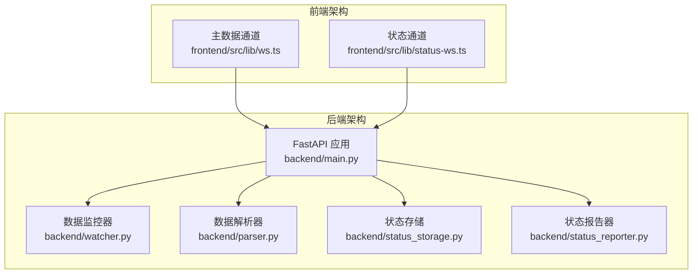

**图表来源**
- [backend/main.py:1-495](file://backend/main.py#L1-L495)
- [backend/watcher.py:1-52](file://backend/watcher.py#L1-L52)
- [frontend/src/lib/ws.ts:1-84](file://frontend/src/lib/ws.ts#L1-L84)

**章节来源**
- [backend/main.py:1-495](file://backend/main.py#L1-L495)
- [backend/watcher.py:1-52](file://backend/watcher.py#L1-L52)
- [frontend/src/lib/ws.ts:1-84](file://frontend/src/lib/ws.ts#L1-L84)

## 核心组件

### WebSocket 服务器组件

系统包含两个主要的 WebSocket 通道：

1. **主数据通道** (`/ws`)
   - 广播任务、使命、团队和阻塞信息的实时更新
   - 支持心跳保持和断线重连
   - 提供初始数据推送功能

2. **状态通道** (`/ws/status`)
   - 专门用于员工状态更新的实时通道
   - 支持不同类型的状态事件（状态更新、困难报告、决策请求）

### 数据监控与广播组件

系统通过文件监控机制实现数据变化的实时检测：

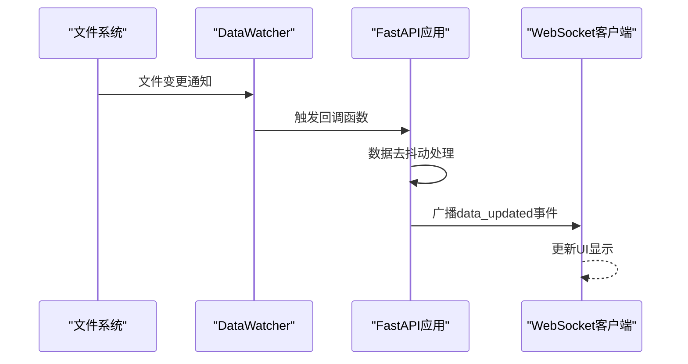

**图表来源**
- [backend/watcher.py:29-35](file://backend/watcher.py#L29-L35)
- [backend/main.py:61-94](file://backend/main.py#L61-L94)

**章节来源**
- [backend/main.py:33-94](file://backend/main.py#L33-L94)
- [backend/watcher.py:8-52](file://backend/watcher.py#L8-L52)

## 架构概览

整个 WebSocket 系统采用分层架构设计，实现了清晰的关注点分离：

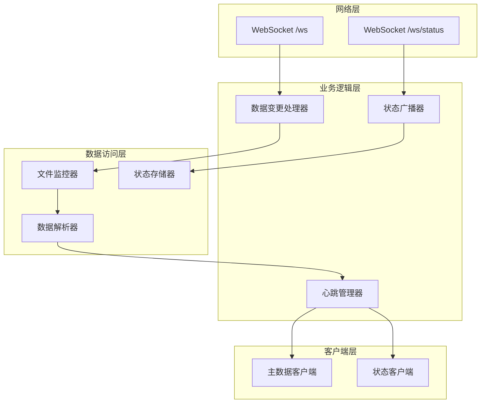

**图表来源**
- [backend/main.py:396-477](file://backend/main.py#L396-L477)
- [backend/watcher.py:8-52](file://backend/watcher.py#L8-L52)

## 详细组件分析

### 主数据通道 (/ws)

主数据通道负责向客户端广播所有核心业务数据的实时更新：

#### 连接管理

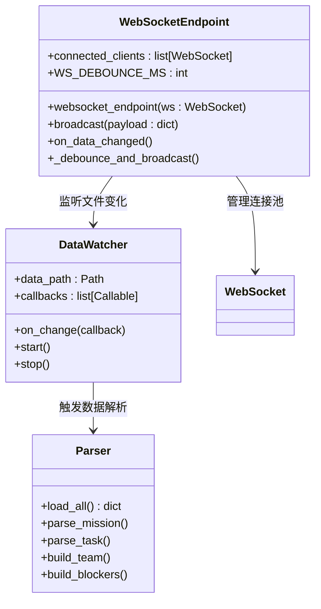

**图表来源**
- [backend/main.py:33-94](file://backend/main.py#L33-L94)
- [backend/watcher.py:8-52](file://backend/watcher.py#L8-L52)
- [backend/parser.py:441-509](file://backend/parser.py#L441-L509)

#### 数据广播机制

系统实现了智能的数据去抖动机制，避免频繁的重复广播：

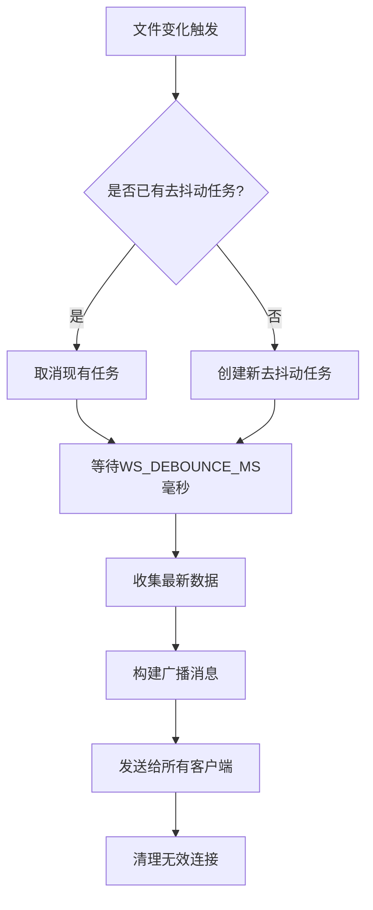

**图表来源**
- [backend/main.py:61-94](file://backend/main.py#L61-L94)

**章节来源**
- [backend/main.py:396-440](file://backend/main.py#L396-L440)
- [backend/main.py:44-94](file://backend/main.py#L44-L94)

### 状态通道 (/ws/status)

状态通道专门处理员工状态更新，支持多种事件类型：

#### 事件类型定义

| 事件类型 | 描述 | Payload 结构 |
|---------|------|-------------|
| `status_updated` | 状态面板更新 | `{panel: StatusPanel}` |
| `difficulty_reported` | 困难报告 | `{agent_id: string, report: StatusReport, panel: StatusPanel}` |
| `decision_requested` | 决策请求 | `{agent_id: string, report: StatusReport, panel: StatusPanel}` |

#### 状态面板数据模型

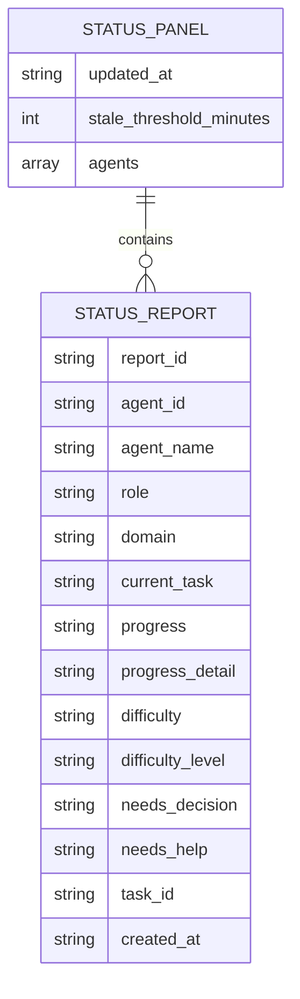

**图表来源**
- [backend/status_storage.py:102-127](file://backend/status_storage.py#L102-L127)
- [backend/status_storage.py:33-58](file://backend/status_storage.py#L33-L58)

**章节来源**
- [backend/main.py:442-477](file://backend/main.py#L442-L477)
- [backend/status_storage.py:102-127](file://backend/status_storage.py#L102-L127)

## 消息格式规范

### 通用消息结构

所有 WebSocket 消息都遵循统一的 JSON 格式：

```json
{
  "type": "string",
  "payload": {},
  "timestamp": "ISO8601字符串"
}
```

### 主数据通道消息格式

#### data_updated 事件

```json
{
  "type": "data_updated",
  "payload": {
    "mission": {
      "id": "string",
      "title": "string",
      "status": "string",
      "priority": "string",
      "created_at": "string",
      "content": "string",
      "description": "string",
      "goals": [],
      "team_overview": [],
      "milestones": []
    },
    "tasks": [
      {
        "id": "string",
        "title": "string",
        "status": "string",
        "assignee": "string",
        "priority": "string",
        "created_at": "string",
        "content": "string",
        "mission_id": "string",
        "mission_title": "string",
        "decision_status": "string",
        "decision_detail": "string",
        "has_blocker": "boolean",
        "blocker_reason": "string",
        "source_type": "string",
        "creator": "string"
      }
    ],
    "blockers": [
      {
        "id": "string",
        "title": "string",
        "status": "string",
        "priority": "string",
        "assignee": "string",
        "created_at": "string",
        "content": "string",
        "reason": "string",
        "task_id": "string",
        "task_title": "string",
        "mission_id": "string"
      }
    ],
    "decisions": [
      {
        "id": "string",
        "title": "string",
        "status": "string",
        "priority": "string",
        "assignee": "string",
        "created_at": "string",
        "content": "string",
        "decision_status": "string",
        "decision_detail": "string",
        "source_of_truth": "string",
        "task_id": "string",
        "task_title": "string",
        "mission_id": "string"
      }
    ],
    "team": [
      {
        "id": "string",
        "name": "string",
        "role": "string",
        "status": "string",
        "avatar": "string",
        "current_tasks": []
      }
    ]
  },
  "timestamp": "2024-01-01T00:00:00Z"
}
```

#### heartbeat 事件

```json
{
  "type": "heartbeat",
  "timestamp": "2024-01-01T00:00:00Z"
}
```

### 状态通道消息格式

#### status_updated 事件

```json
{
  "type": "status_updated",
  "payload": {
    "panel": {
      "updated_at": "string",
      "stale_threshold_minutes": 5,
      "agents": [
        {
          "agent_id": "string",
          "agent_name": "string",
          "role": "string",
          "domain": "string",
          "current_task": "string",
          "progress": "string",
          "progress_detail": "string",
          "difficulty": "string",
          "difficulty_level": "string",
          "needs_decision": "string",
          "needs_help": "string",
          "task_id": "string",
          "last_report_at": "string",
          "next_report_at": "string",
          "online_status": "string",
          "is_stale": "boolean"
        }
      ]
    }
  },
  "timestamp": "2024-01-01T00:00:00Z"
}
```

#### difficulty_reported 事件

```json
{
  "type": "difficulty_reported",
  "payload": {
    "agent_id": "string",
    "report": {
      "report_id": "string",
      "agent_id": "string",
      "agent_name": "string",
      "role": "string",
      "domain": "string",
      "current_task": "string",
      "progress": "string",
      "progress_detail": "string",
      "difficulty": "string",
      "difficulty_level": "string",
      "needs_decision": "string",
      "needs_help": "string",
      "task_id": "string",
      "created_at": "string"
    },
    "panel": {
      "updated_at": "string",
      "stale_threshold_minutes": 5,
      "agents": []
    }
  },
  "timestamp": "2024-01-01T00:00:00Z"
}
```

**章节来源**
- [backend/main.py:89-93](file://backend/main.py#L89-L93)
- [backend/main.py:453-457](file://backend/main.py#L453-L457)
- [backend/main.py:332-340](file://backend/main.py#L332-L340)

## 连接建立流程

### 客户端连接步骤

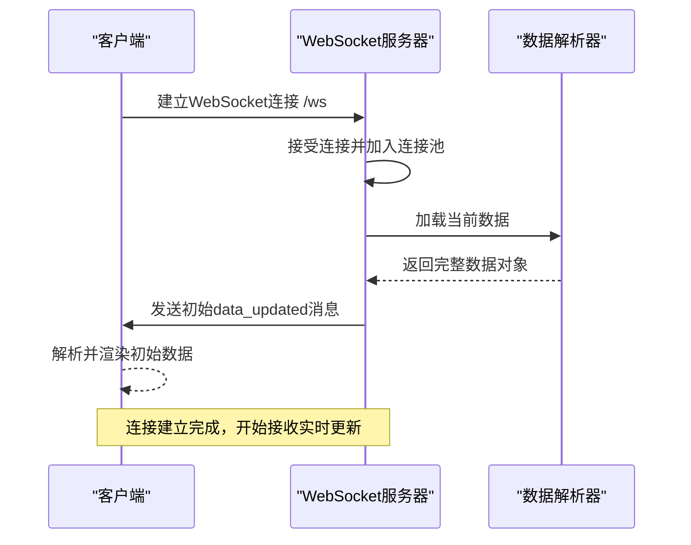

**图表来源**
- [backend/main.py:398-417](file://backend/main.py#L398-L417)

### 服务器端连接处理

服务器端的连接建立流程包括以下关键步骤：

1. **连接接受**：服务器接受新的 WebSocket 连接
2. **客户端注册**：将连接添加到全局连接池
3. **初始数据加载**：从数据解析器获取当前完整数据
4. **初始数据推送**：向新连接的客户端推送完整数据
5. **心跳监听**：开始监听客户端的心跳消息

**章节来源**
- [backend/main.py:396-440](file://backend/main.py#L396-L440)

## 初始数据推送机制

### 数据加载流程

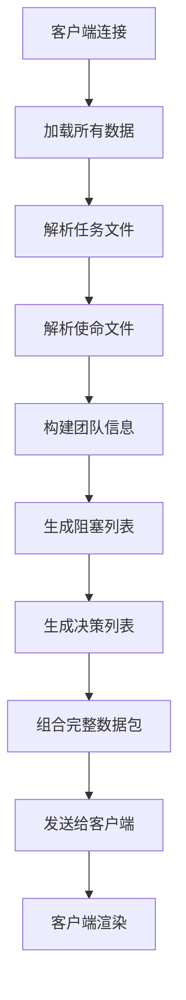

**图表来源**
- [backend/parser.py:441-509](file://backend/parser.py#L441-L509)

### 数据解析器功能

数据解析器负责从 Markdown 文件中提取结构化数据：

#### 任务解析

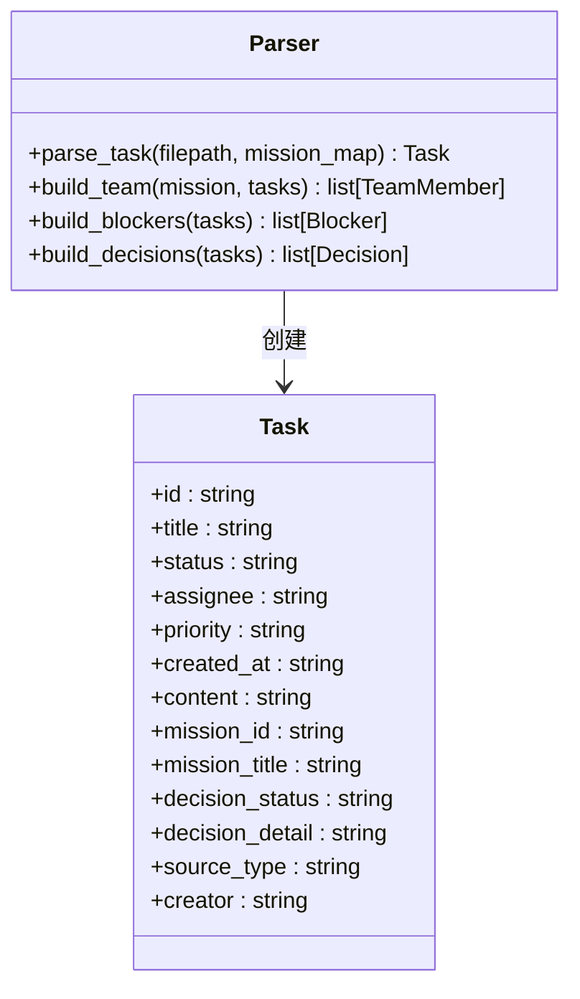

**图表来源**
- [backend/parser.py:32-81](file://backend/parser.py#L32-L81)
- [backend/parser.py:203-343](file://backend/parser.py#L203-L343)

**章节来源**
- [backend/parser.py:441-509](file://backend/parser.py#L441-L509)

## 心跳保持策略

### 心跳机制实现

系统实现了双向心跳机制，确保连接的稳定性和可靠性：

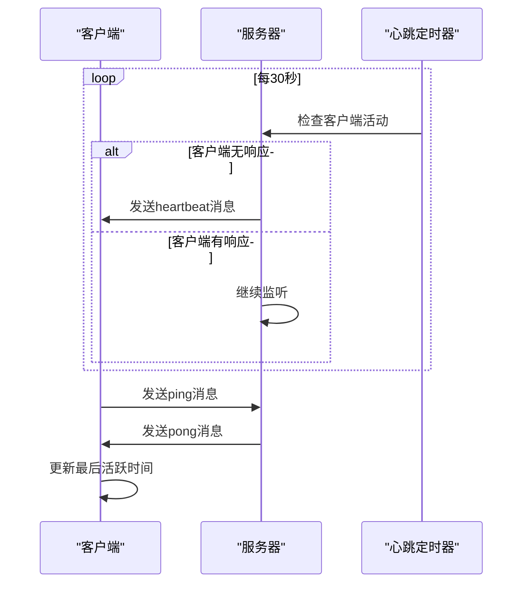

**图表来源**
- [backend/main.py:419-430](file://backend/main.py#L419-L430)

### 心跳消息格式

#### Ping 请求

```json
{
  "type": "ping",
  "timestamp": "2024-01-01T00:00:00Z"
}
```

#### Pong 响应

```json
{
  "type": "pong",
  "timestamp": "2024-01-01T00:00:00Z"
}
```

#### Heartbeat 心跳

```json
{
  "type": "heartbeat",
  "timestamp": "2024-01-01T00:00:00Z"
}
```

**章节来源**
- [backend/main.py:419-430](file://backend/main.py#L419-L430)

## 连接池管理

### 连接池设计

系统维护两个独立的连接池，分别处理不同类型的 WebSocket 连接：

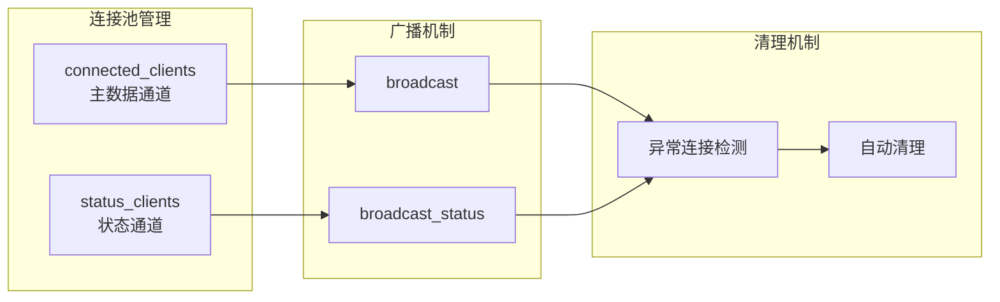

**图表来源**
- [backend/main.py:33-84](file://backend/main.py#L33-L84)

### 连接池操作

#### 添加连接

当新的 WebSocket 连接建立时，系统会：
1. 接受连接请求
2. 将连接添加到相应的连接池
3. 记录连接数量统计

#### 移除连接

当连接断开或出现异常时，系统会：
1. 捕获连接异常
2. 从连接池中移除失效连接
3. 清理相关资源

#### 广播消息

系统提供了两种广播机制：

1. **主数据广播** (`broadcast`)
   - 遍历所有连接的客户端
   - 发送 data_updated 事件
   - 处理发送异常并清理无效连接

2. **状态广播** (`broadcast_status`)
   - 遍历状态通道的客户端
   - 发送不同类型的状态事件
   - 处理发送异常并清理无效连接

**章节来源**
- [backend/main.py:44-84](file://backend/main.py#L44-L84)

## 异常处理与断线清理

### 异常处理策略

系统实现了多层次的异常处理机制：

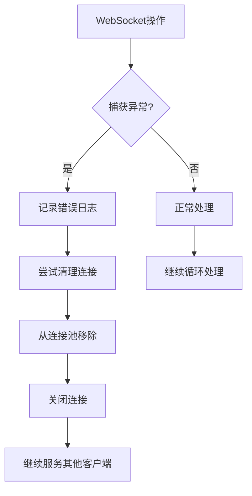

### 断线清理机制

#### 自动清理流程

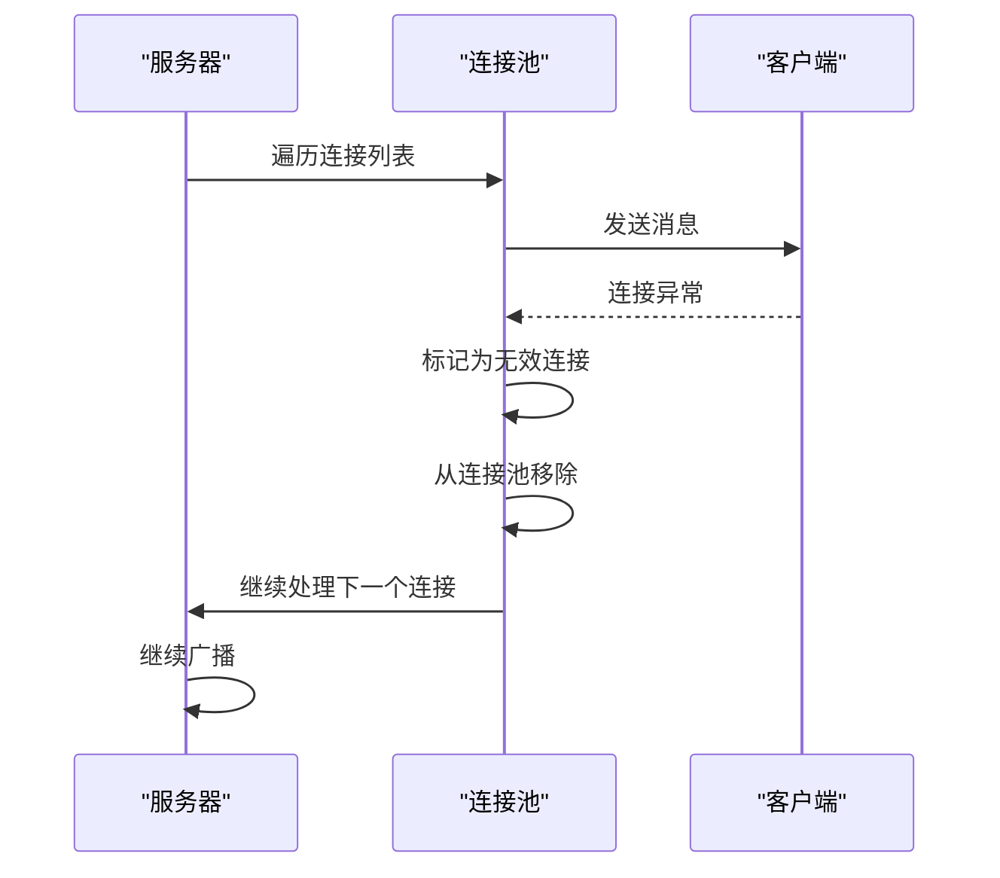

**图表来源**
- [backend/main.py:48-58](file://backend/main.py#L48-L58)

### 错误恢复机制

系统提供了完善的错误恢复机制：

1. **连接异常恢复**：检测到连接异常时自动清理并继续服务
2. **广播失败处理**：单个连接发送失败不影响整体广播
3. **资源清理**：确保异常断开的连接释放所有占用的资源

**章节来源**
- [backend/main.py:44-84](file://backend/main.py#L44-L84)

## 客户端使用指南

### 主数据通道客户端

#### 连接建立

```typescript
// 基础连接URL构造
function getWsUrl(): string {
  const protocol = location.protocol === "https:" ? "wss:" : "ws:";
  const host = location.host;
  return `${protocol}//${host}/ws`;
}

// 连接建立
function connect(): void {
  ws = new WebSocket(getWsUrl());
  
  ws.onopen = () => {
    console.log("[ws] connected");
    wsConnected.set(true);
  };
}
```

#### 消息处理

```typescript
ws.onmessage = (event) => {
  try {
    const msg = JSON.parse(event.data);
    if (msg.type === "data_updated") {
      synapseData.set(msg.payload);
      lastUpdated.set(msg.timestamp);
    } else if (msg.type === "heartbeat") {
      lastUpdated.set(msg.timestamp);
    }
  } catch (e) {
    console.error("[ws] parse error", e);
  }
};
```

#### 心跳保持

```typescript
// 客户端心跳实现
function sendPing(): void {
  if (ws && ws.readyState === WebSocket.OPEN) {
    ws.send(JSON.stringify({ type: "ping" }));
  }
}

// 设置定时心跳
setInterval(sendPing, 25000); // 每25秒发送一次ping
```

**章节来源**
- [frontend/src/lib/ws.ts:19-70](file://frontend/src/lib/ws.ts#L19-L70)

### 状态通道客户端

#### 连接建立

```typescript
// 状态通道连接URL
function getWsUrl(): string {
  const protocol = location.protocol === "https:" ? "wss:" : "ws:";
  const host = location.host;
  return `${protocol}//${host}/ws/status`;
}

// 状态消息处理
ws.onmessage = (event) => {
  try {
    const msg = JSON.parse(event.data);
    if (msg.type === "status_updated" || 
        msg.type === "difficulty_reported" || 
        msg.type === "decision_requested") {
      if (msg.payload?.panel) {
        statusPanel.set(msg.payload.panel);
      }
      if (msg.payload?.report) {
        statusEvents.set(msg.payload.report);
      }
    }
  } catch (e) {
    console.error("[ws:status] parse error", e);
  }
};
```

**章节来源**
- [frontend/src/lib/status-ws.ts:12-68](file://frontend/src/lib/status-ws.ts#L12-L68)

## 性能考虑

### 去抖动机制

系统实现了智能的去抖动机制，避免频繁的数据更新：

- **去抖动延迟**：300毫秒
- **批量处理**：在去抖动窗口内收集所有数据变化
- **单次广播**：将批量数据合并为单次广播

### 连接池优化

- **内存管理**：自动清理无效连接
- **并发控制**：异步处理多个客户端的消息
- **资源复用**：重用数据解析结果

### 数据压缩

对于大量数据传输，可以考虑实现数据压缩机制：
- 使用 gzip 压缩 JSON 数据
- 实现增量更新而非全量更新
- 优化数据结构减少传输体积

## 故障排除指南

### 常见问题诊断

#### 连接无法建立

**症状**：客户端无法连接到 WebSocket 服务器

**可能原因**：
1. 服务器未启动或端口不可用
2. CORS 配置问题
3. 反向代理配置错误

**解决方案**：
1. 检查服务器日志输出
2. 验证端口监听状态
3. 确认 CORS 配置允许跨域访问

#### 数据更新延迟

**症状**：客户端收到的数据比实际数据更新滞后

**可能原因**：
1. 去抖动机制导致的延迟
2. 文件监控器响应延迟
3. 网络传输延迟

**解决方案**：
1. 调整 WS_DEBOUNCE_MS 参数
2. 检查文件系统监控器状态
3. 优化网络连接质量

#### 心跳超时

**症状**：客户端频繁断线重连

**可能原因**：
1. 网络不稳定
2. 服务器负载过高
3. 客户端心跳设置不当

**解决方案**：
1. 检查网络连接稳定性
2. 监控服务器 CPU 和内存使用率
3. 调整客户端心跳间隔

### 日志分析

系统提供了详细的日志输出，便于问题诊断：

```python
# 连接建立日志
print(f"[ws] connected, total clients: {len(connected_clients)}")

# 数据广播日志
print(f"[ws] broadcasting to {len(connected_clients)} clients")

# 错误处理日志
print(f"[ws] error: {e}")

# 清理日志
print(f"[ws] cleaned up, remaining: {len(connected_clients)}")
```

**章节来源**
- [backend/main.py:401-440](file://backend/main.py#L401-L440)

## 结论

/ws WebSocket 数据更新通道是 SynapseOS 2.0 实时数据同步系统的核心组件，具有以下特点：

### 技术优势

1. **实时性**：通过文件监控和去抖动机制实现实时数据更新
2. **可靠性**：完善的异常处理和断线清理机制确保系统稳定性
3. **可扩展性**：模块化的架构设计支持功能扩展
4. **易用性**：标准化的消息格式和清晰的 API 接口

### 架构特色

1. **双通道设计**：主数据通道和状态通道分离，职责明确
2. **智能广播**：基于连接池的高效广播机制
3. **心跳保持**：双向心跳机制确保连接稳定性
4. **自动清理**：异常连接自动清理，防止资源泄漏

### 应用价值

该 WebSocket 通道为 SynapseOS 2.0 提供了强大的实时数据同步能力，支持：
- 任务状态的实时更新
- 团队协作信息的即时共享
- 员工工作状态的可视化展示
- 决策过程的透明化管理

通过合理的设计和实现，该系统能够满足复杂业务场景下的实时数据同步需求，为用户提供流畅的交互体验。