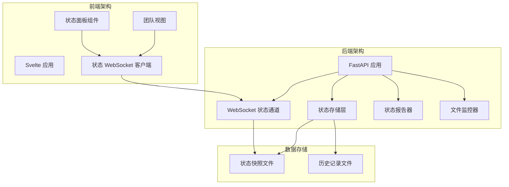
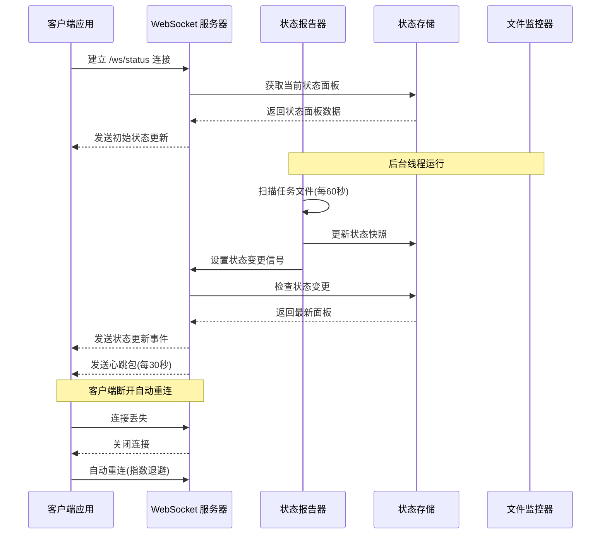
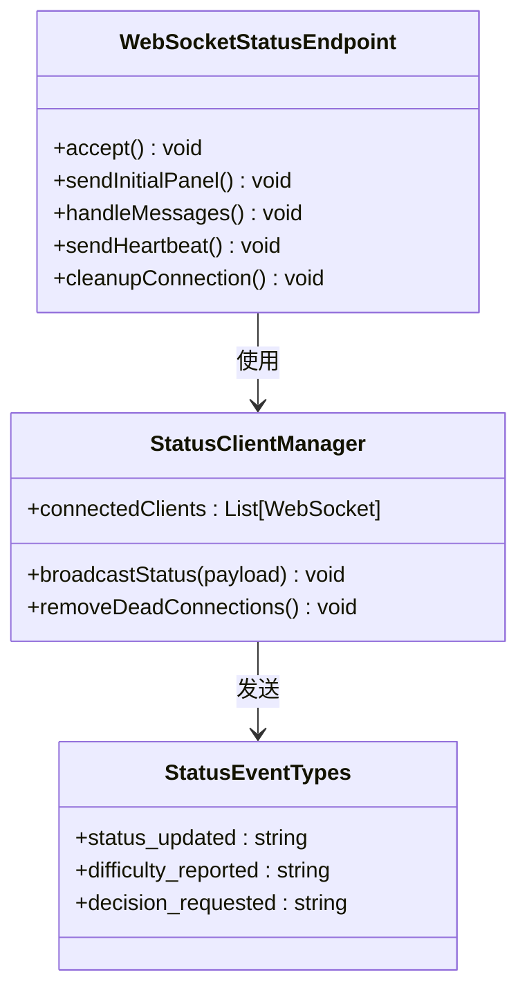
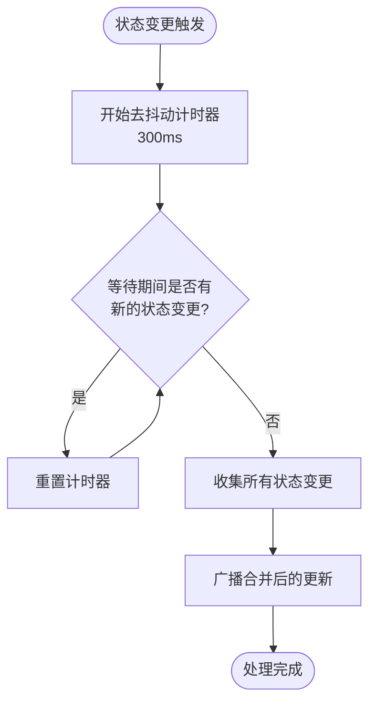
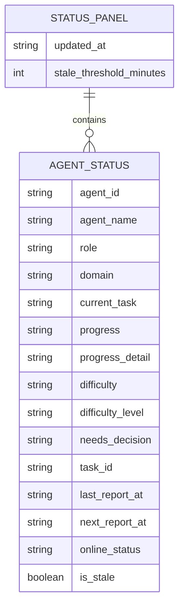
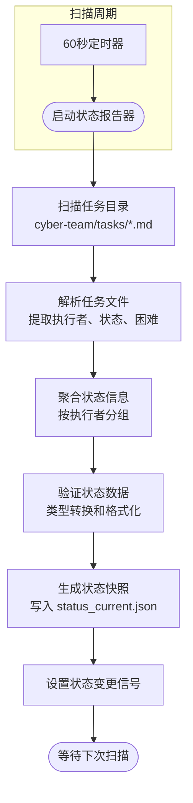
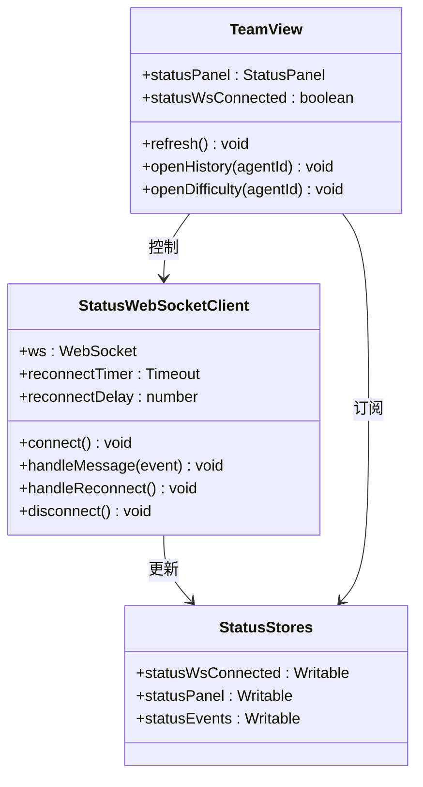
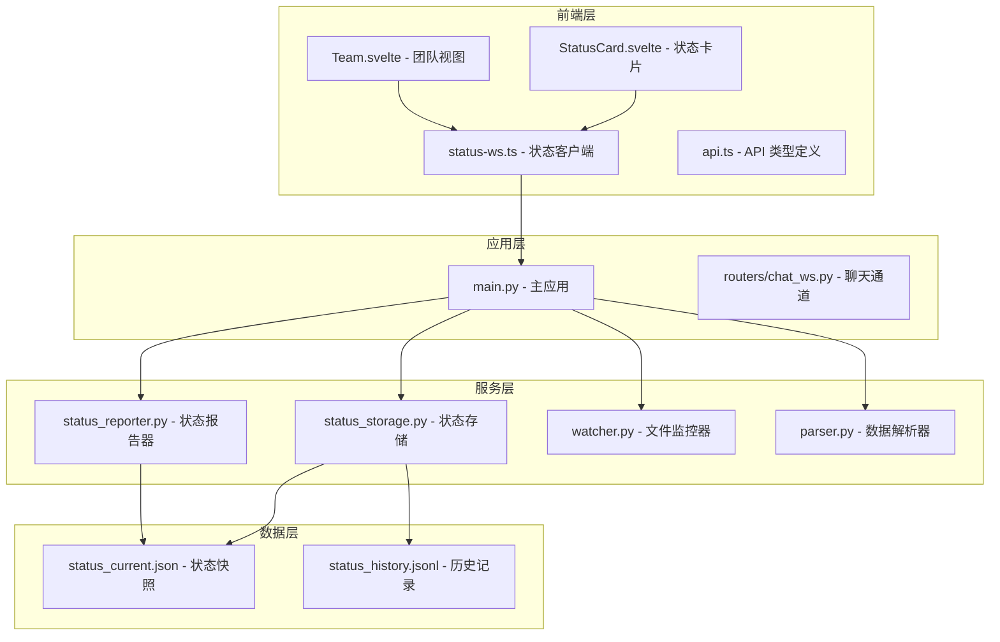
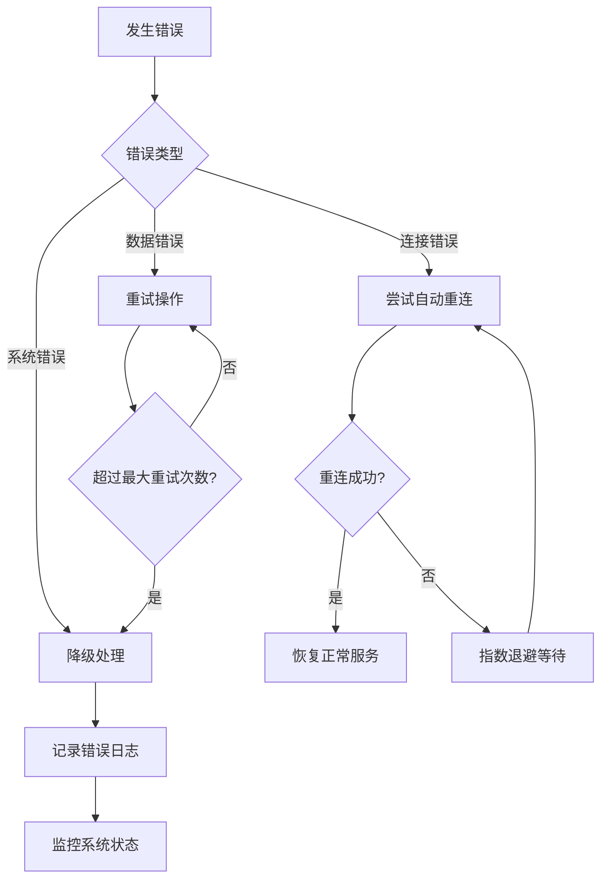
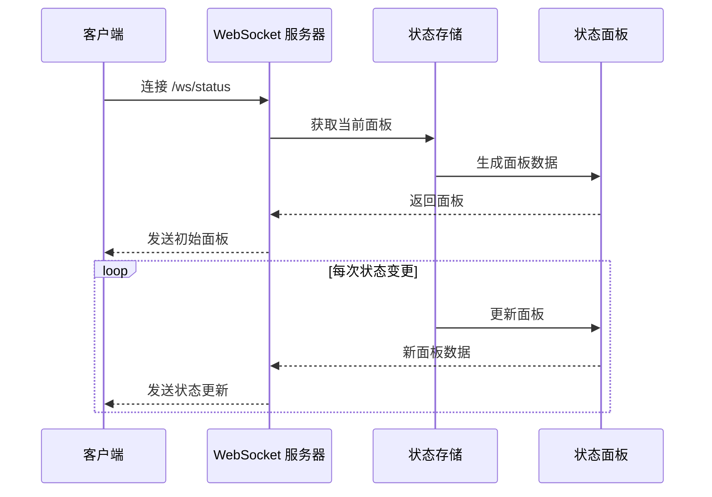

# /ws/status 状态更新通道

<cite>
**本文档引用的文件**
- [backend/main.py](file://backend/main.py)
- [backend/status_reporter.py](file://backend/status_reporter.py)
- [backend/status_storage.py](file://backend/status_storage.py)
- [backend/watcher.py](file://backend/watcher.py)
- [backend/parser.py](file://backend/parser.py)
- [frontend/src/lib/status-ws.ts](file://frontend/src/lib/status-ws.ts)
- [frontend/src/lib/api.ts](file://frontend/src/lib/api.ts)
- [frontend/src/views/Team.svelte](file://frontend/src/views/Team.svelte)
- [frontend/src/views/StatusCard.svelte](file://frontend/src/views/StatusCard.svelte)
- [data/status_current.json](file://data/status_current.json)
</cite>

## 目录
1. [简介](#简介)
2. [项目结构](#项目结构)
3. [核心组件](#核心组件)
4. [架构概览](#架构概览)
5. [详细组件分析](#详细组件分析)
6. [依赖分析](#依赖分析)
7. [性能考虑](#性能考虑)
8. [故障排除指南](#故障排除指南)
9. [结论](#结论)
10. [附录](#附录)

## 简介
/ws/status 是 SynapseOS 2.0 的专用 WebSocket 状态更新通道，专门用于向客户端推送团队成员状态面板的实时更新。该通道实现了独立的 WebSocket 连接池，与通用的 /ws 数据更新通道分离，确保状态更新的高效性和可靠性。

该通道的核心功能包括：
- 实时推送团队成员状态面板更新
- 支持多种事件类型：状态更新、困难报告、决策请求
- 提供去抖动处理机制，避免频繁更新
- 实现并发连接管理和错误恢复策略
- 支持在线状态检测和超时处理

## 项目结构
SynapseOS 2.0 采用前后端分离的架构设计，状态更新通道位于后端 Python FastAPI 应用中，前端通过 Svelte 应用消费这些实时状态数据。



**图表来源**
- [backend/main.py:442-477](file://backend/main.py#L442-L477)
- [backend/status_storage.py:102-127](file://backend/status_storage.py#L102-L127)
- [frontend/src/lib/status-ws.ts:18-68](file://frontend/src/lib/status-ws.ts#L18-L68)

**章节来源**
- [backend/main.py:185-182](file://backend/main.py#L185-L182)
- [frontend/src/views/Team.svelte:244-253](file://frontend/src/views/Team.svelte#L244-L253)

## 核心组件
/ws/status 状态更新通道由多个核心组件协同工作，形成完整的实时状态推送系统。

### 后端核心组件
1. **WebSocket 端点处理器** - 处理 /ws/status 连接和消息传输
2. **状态存储层** - 管理状态快照和历史记录
3. **状态报告器** - 定时扫描任务文件生成状态报告
4. **文件监控器** - 监控数据变化触发更新
5. **去抖动机制** - 防止频繁更新造成性能问题

### 前端核心组件
1. **状态 WebSocket 客户端** - 管理 WebSocket 连接和消息处理
2. **状态面板存储** - 维护实时状态数据
3. **团队视图组件** - 展示团队状态信息
4. **错误恢复机制** - 自动重连和错误处理

**章节来源**
- [backend/main.py:33-34](file://backend/main.py#L33-L34)
- [backend/main.py:68-84](file://backend/main.py#L68-L84)
- [frontend/src/lib/status-ws.ts:4-6](file://frontend/src/lib/status-ws.ts#L4-L6)

## 架构概览
/ws/status 状态更新通道采用事件驱动的架构模式，通过后台线程定期扫描任务文件，生成状态快照，并通过 WebSocket 实时推送给所有连接的客户端。



**图表来源**
- [backend/main.py:105-117](file://backend/main.py#L105-L117)
- [backend/main.py:145-161](file://backend/main.py#L145-L161)
- [backend/main.py:442-477](file://backend/main.py#L442-L477)
- [frontend/src/lib/status-ws.ts:18-68](file://frontend/src/lib/status-ws.ts#L18-L68)

## 详细组件分析

### WebSocket 状态通道实现
/ws/status 通道实现了独立的 WebSocket 端点，专门用于状态更新推送。



**图表来源**
- [backend/main.py:442-477](file://backend/main.py#L442-L477)
- [backend/main.py:68-84](file://backend/main.py#L68-L84)

#### 连接生命周期管理
状态通道维护独立的客户端连接池，支持并发连接管理和优雅断开处理：

1. **连接建立** - 客户端连接时添加到状态客户端列表
2. **初始数据推送** - 发送当前状态面板的完整数据
3. **消息处理** - 处理 ping 请求和心跳维持
4. **断开清理** - 移除断开的连接并释放资源

#### 去抖动处理机制
为了防止频繁的状态更新造成网络拥塞，系统实现了 300ms 的去抖动延迟：



**图表来源**
- [backend/main.py:86-93](file://backend/main.py#L86-L93)
- [backend/main.py:31](file://backend/main.py#L31)

**章节来源**
- [backend/main.py:442-477](file://backend/main.py#L442-L477)
- [backend/main.py:61-93](file://backend/main.py#L61-L93)

### 状态数据模型
状态面板采用标准化的数据结构，包含完整的团队成员状态信息。

#### 状态面板数据结构


**图表来源**
- [frontend/src/lib/api.ts:138-142](file://frontend/src/lib/api.ts#L138-L142)
- [frontend/src/lib/api.ts:119-136](file://frontend/src/lib/api.ts#L119-L136)

#### 状态变更检测机制
系统实现了智能的状态变更检测，能够区分不同类型的状态更新：

1. **普通状态更新** - 标准的状态面板刷新
2. **困难报告** - 成员报告工作困难
3. **决策请求** - 成员请求上级决策

**章节来源**
- [backend/main.py:318-346](file://backend/main.py#L318-L346)
- [backend/status_storage.py:102-127](file://backend/status_storage.py#L102-L127)

### 状态报告器工作原理
状态报告器是整个状态更新系统的核心，负责定时扫描任务文件并生成状态报告。



**图表来源**
- [backend/status_reporter.py:189-243](file://backend/status_reporter.py#L189-L243)
- [backend/status_reporter.py:258-266](file://backend/status_reporter.py#L258-L266)

#### 任务文件解析逻辑
状态报告器通过复杂的正则表达式解析任务文件，提取关键信息：

1. **执行者识别** - 从任务文件中提取执行者姓名
2. **状态映射** - 将中文状态映射到标准化的 progress 值
3. **困难检测** - 识别并分类工作困难程度
4. **决策需求** - 检测是否需要上级决策

**章节来源**
- [backend/status_reporter.py:129-173](file://backend/status_reporter.py#L129-L173)
- [backend/status_reporter.py:50-66](file://backend/status_reporter.py#L50-L66)

### 前端状态客户端实现
前端使用 Svelte Store 管理状态 WebSocket 连接，实现了完整的错误恢复机制。



**图表来源**
- [frontend/src/lib/status-ws.ts:18-68](file://frontend/src/lib/status-ws.ts#L18-L68)
- [frontend/src/views/Team.svelte:244-253](file://frontend/src/views/Team.svelte#L244-L253)

#### 错误恢复策略
前端实现了智能的自动重连机制：

1. **指数退避重连** - 重连延迟按 1.5 倍递增，最大 10 秒
2. **连接状态监控** - 实时更新连接状态指示器
3. **消息处理容错** - 解析错误时记录日志但不中断连接
4. **资源清理** - 断开连接时清理定时器和 WebSocket 对象

**章节来源**
- [frontend/src/lib/status-ws.ts:51-63](file://frontend/src/lib/status-ws.ts#L51-L63)
- [frontend/src/views/Team.svelte:244-253](file://frontend/src/views/Team.svelte#L244-L253)

## 依赖分析
/ws/status 状态更新通道涉及多个模块间的复杂依赖关系，形成了清晰的分层架构。



**图表来源**
- [backend/main.py:17-21](file://backend/main.py#L17-L21)
- [backend/status_storage.py:10-13](file://backend/status_storage.py#L10-L13)
- [frontend/src/lib/status-ws.ts:1-6](file://frontend/src/lib/status-ws.ts#L1-L6)

### 模块耦合度分析
- **低耦合设计** - 后端各模块职责明确，通过接口交互
- **强内聚特性** - 状态相关功能集中在独立的模块中
- **依赖方向性** - 前端依赖后端 API，后端模块间单向依赖

### 外部依赖管理
系统对外部依赖进行了有效控制：
- **Python 依赖** - 使用标准库和必要的第三方库
- **前端依赖** - 通过 npm 管理，保持版本兼容性
- **文件系统依赖** - 通过环境变量配置数据目录位置

**章节来源**
- [backend/main.py:17-21](file://backend/main.py#L17-L21)
- [frontend/src/lib/api.ts:100-181](file://frontend/src/lib/api.ts#L100-L181)

## 性能考虑
/ws/status 状态更新通道在设计时充分考虑了性能优化，采用了多种策略确保系统的高效运行。

### 并发连接管理
系统支持多客户端并发连接，通过独立的连接池管理：

1. **连接池隔离** - 状态通道和数据通道使用不同的连接池
2. **内存优化** - 及时清理断开的连接，避免内存泄漏
3. **批量发送** - 合并多个客户端的消息发送操作

### 去抖动优化
300ms 的去抖动延迟有效减少了网络流量：
- **减少更新频率** - 防止短时间内多次状态变更
- **降低服务器负载** - 减少数据库读写操作
- **提升用户体验** - 避免界面闪烁和频繁更新

### 缓存策略
状态面板数据采用缓存机制：
- **内存缓存** - 状态快照存储在内存中快速访问
- **文件持久化** - 状态数据写入 JSON 文件持久存储
- **增量更新** - 仅更新发生变化的部分数据

### 网络优化
WebSocket 连接采用优化的网络策略：
- **心跳机制** - 30秒心跳包检测连接状态
- **自动重连** - 断线自动重连，指数退避策略
- **消息压缩** - 传输压缩减少带宽占用

## 故障排除指南
/ws/status 状态更新通道提供了完善的错误处理和故障排除机制。

### 常见问题诊断
1. **连接失败**
   - 检查 WebSocket 服务器是否正常运行
   - 验证防火墙和网络连接
   - 查看浏览器开发者工具的网络面板

2. **状态更新延迟**
   - 确认状态报告器是否正常运行
   - 检查任务文件是否正确更新
   - 验证去抖动机制是否正常工作

3. **数据不一致**
   - 检查状态快照文件是否损坏
   - 验证状态存储层的读写权限
   - 确认文件监控器是否正常工作

### 错误恢复策略
系统实现了多层次的错误恢复：



**图表来源**
- [frontend/src/lib/status-ws.ts:51-63](file://frontend/src/lib/status-ws.ts#L51-L63)
- [backend/main.py:430-440](file://backend/main.py#L430-L440)

### 日志监控
系统提供了详细的日志记录：
- **连接日志** - 记录连接建立和断开事件
- **状态日志** - 记录状态变更和更新事件
- **错误日志** - 记录异常情况和错误信息
- **性能日志** - 记录系统性能指标

**章节来源**
- [frontend/src/lib/status-ws.ts:25-63](file://frontend/src/lib/status-ws.ts#L25-L63)
- [backend/main.py:430-440](file://backend/main.py#L430-L440)

## 结论
/ws/status 状态更新通道是一个设计精良的实时状态推送系统，具有以下特点：

1. **架构清晰** - 采用分层设计，职责明确，易于维护
2. **性能优秀** - 实现了去抖动、缓存和批量处理等优化策略
3. **可靠性高** - 提供完整的错误处理和自动恢复机制
4. **扩展性强** - 模块化设计便于功能扩展和定制

该通道成功实现了团队成员状态面板的实时更新，为 SynapseOS 2.0 提供了强大的协作能力。通过合理的架构设计和优化策略，系统能够在高并发场景下保持稳定高效的运行。

## 附录

### API 事件类型定义
| 事件类型 | 描述 | Payload 结构 |
|---------|------|-------------|
| status_updated | 状态面板更新 | `{ panel: StatusPanel }` |
| difficulty_reported | 困难报告 | `{ agent_id: string, report: StatusReport, panel: StatusPanel }` |
| decision_requested | 决策请求 | `{ agent_id: string, report: StatusReport, panel: StatusPanel }` |

### 客户端连接示例
```typescript
// 基础连接
const ws = new WebSocket('ws://localhost:8000/ws/status');

// 带错误处理的连接
const connect = () => {
  const ws = new WebSocket('wss://your-domain.com/ws/status');
  
  ws.onopen = () => {
    console.log('连接已建立');
  };
  
  ws.onmessage = (event) => {
    const message = JSON.parse(event.data);
    handleStatusUpdate(message);
  };
  
  ws.onclose = () => {
    console.log('连接已断开，准备重连');
    setTimeout(connect, 1000); // 1秒后重连
  };
};
```

### 状态订阅处理流程


**图表来源**
- [backend/main.py:451-457](file://backend/main.py#L451-L457)
- [backend/status_storage.py:102-127](file://backend/status_storage.py#L102-L127)