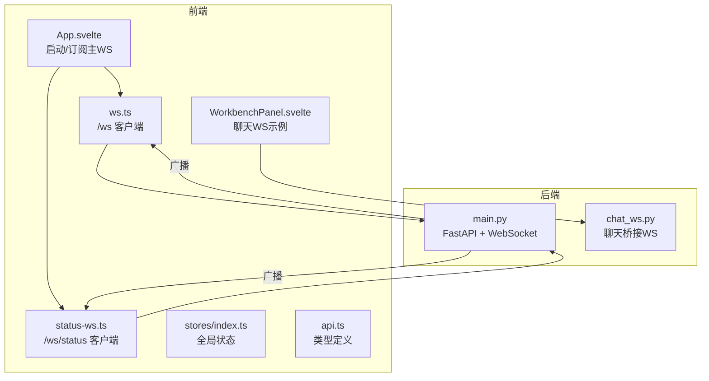
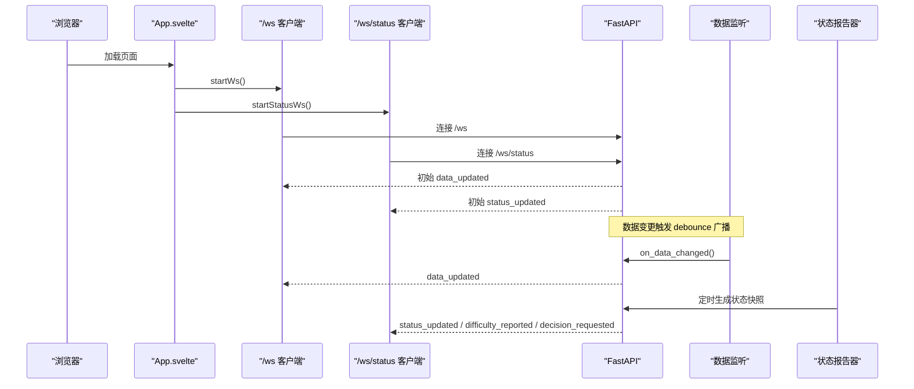
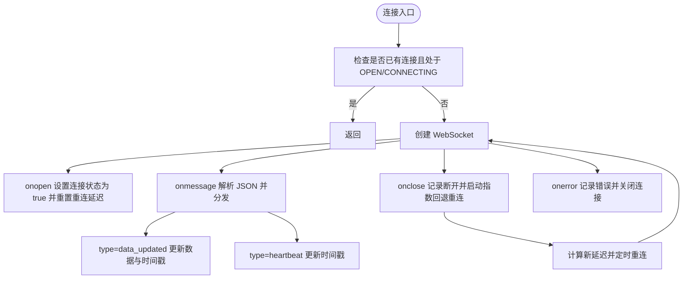
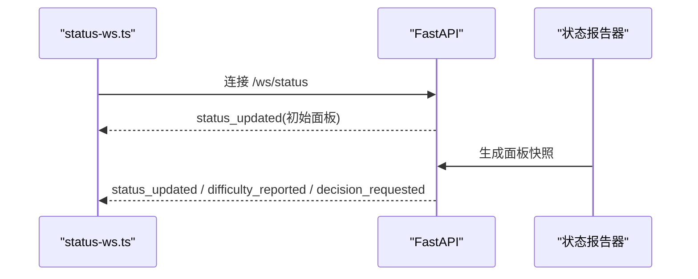
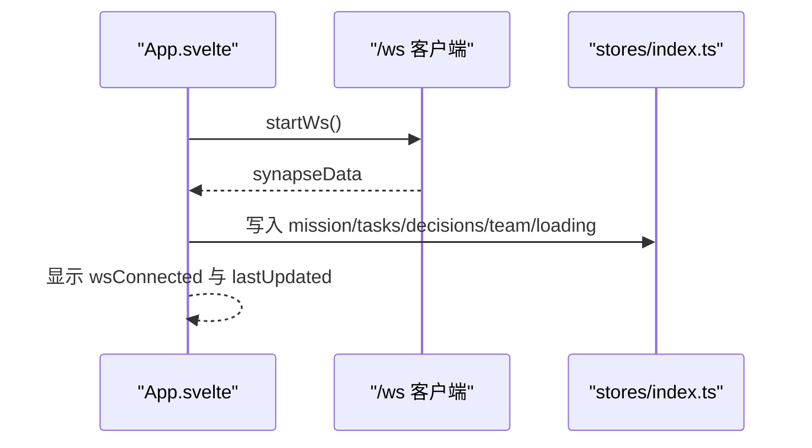
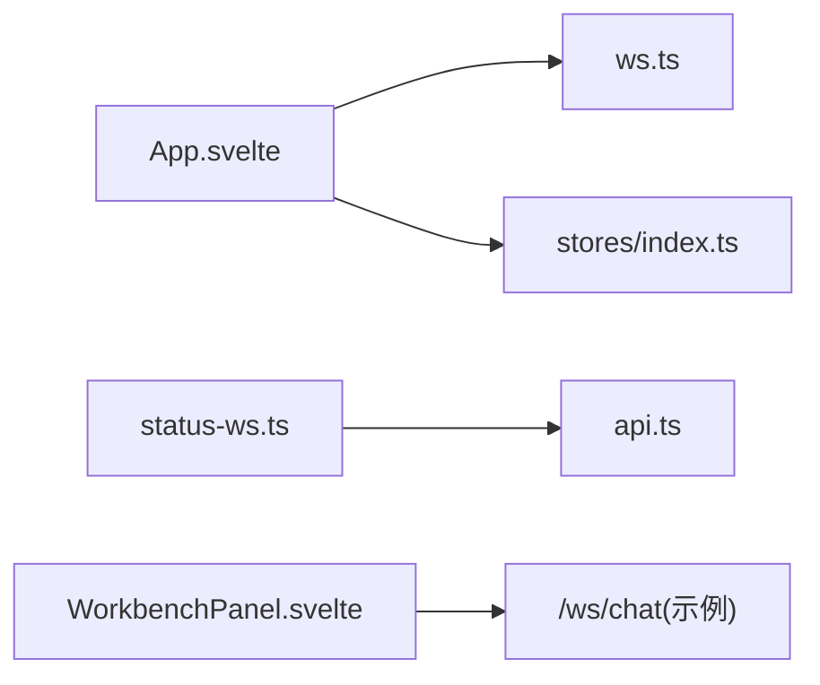

# 客户端集成指南

<cite>
**本文引用的文件列表**
- [ws.ts](file://frontend/src/lib/ws.ts)
- [status-ws.ts](file://frontend/src/lib/status-ws.ts)
- [api.ts](file://frontend/src/lib/api.ts)
- [stores/index.ts](file://frontend/src/lib/stores/index.ts)
- [App.svelte](file://frontend/src/App.svelte)
- [WorkbenchPanel.svelte](file://frontend/src/views/WorkbenchPanel.svelte)
- [main.py](file://backend/main.py)
- [chat_ws.py](file://backend/routers/chat_ws.py)
- [package.json](file://frontend/package.json)
</cite>

## 目录
1. [简介](#简介)
2. [项目结构](#项目结构)
3. [核心组件](#核心组件)
4. [架构总览](#架构总览)
5. [详细组件分析](#详细组件分析)
6. [依赖关系分析](#依赖关系分析)
7. [性能考量](#性能考量)
8. [故障排查指南](#故障排查指南)
9. [结论](#结论)
10. [附录](#附录)

## 简介
本指南面向在 Svelte 前端应用中集成 WebSocket 客户端的开发者，系统性讲解如何在浏览器环境中连接到后端提供的 /ws 与 /ws/status 两个通道，涵盖连接建立、事件监听、错误处理、状态管理、重连策略、心跳与超时处理、网络异常恢复、调试技巧、性能优化与常见问题解决。文档以仓库现有实现为依据，提供可直接参考的代码路径与最佳实践。

## 项目结构
前端采用 Svelte + Vite 架构，WebSocket 客户端位于前端 src/lib 下，分别负责主数据通道与状态面板通道；后端基于 FastAPI 提供 REST 与 WebSocket 服务，并通过后台线程定时生成状态快照，再广播到 /ws/status 通道。

图表来源
- [App.svelte:119-141](file://frontend/src/App.svelte#L119-L141)
- [ws.ts:26-70](file://frontend/src/lib/ws.ts#L26-L70)
- [status-ws.ts:18-64](file://frontend/src/lib/status-ws.ts#L18-L64)
- [main.py:397-477](file://backend/main.py#L397-L477)
- [chat_ws.py:206-386](file://backend/routers/chat_ws.py#L206-L386)

章节来源
- [App.svelte:119-141](file://frontend/src/App.svelte#L119-L141)
- [ws.ts:19-24](file://frontend/src/lib/ws.ts#L19-L24)
- [status-ws.ts:12-16](file://frontend/src/lib/status-ws.ts#L12-L16)
- [main.py:397-477](file://backend/main.py#L397-L477)

## 核心组件
- 主数据通道客户端（/ws）
  - 负责接收“数据更新”和“心跳”事件，更新 mission、tasks、decisions、team 等全局状态。
  - 实现指数回退重连、连接状态与最后更新时间维护。
  - 参考路径：[ws.ts:1-84](file://frontend/src/lib/ws.ts#L1-L84)

- 状态面板通道客户端（/ws/status）
  - 负责接收“状态更新”、“难度上报”、“决策请求”等事件，更新状态面板与事件流。
  - 同样具备指数回退重连与连接状态管理。
  - 参考路径：[status-ws.ts:1-78](file://frontend/src/lib/status-ws.ts#L1-L78)

- 全局状态与派生状态
  - 使用 Svelte writable/derived 组织 mission、tasks、blockers、decisions、team、loading、error 等。
  - 参考路径：[stores/index.ts:1-46](file://frontend/src/lib/stores/index.ts#L1-L46)

- 类型与 API
  - 定义 Mission、Task、Blocker、Decision、TeamMember、StatusPanel、StatusReport 等接口。
  - 参考路径：[api.ts:1-181](file://frontend/src/lib/api.ts#L1-L181)

- 应用入口与订阅
  - App.svelte 在挂载时启动 /ws 客户端，订阅 synapseData 并写入全局 stores。
  - 参考路径：[App.svelte:119-141](file://frontend/src/App.svelte#L119-L141)

章节来源
- [ws.ts:1-84](file://frontend/src/lib/ws.ts#L1-L84)
- [status-ws.ts:1-78](file://frontend/src/lib/status-ws.ts#L1-L78)
- [stores/index.ts:1-46](file://frontend/src/lib/stores/index.ts#L1-L46)
- [api.ts:1-181](file://frontend/src/lib/api.ts#L1-L181)
- [App.svelte:119-141](file://frontend/src/App.svelte#L119-L141)

## 架构总览
前端通过两个独立的 WebSocket 客户端分别连接后端的 /ws 与 /ws/status 通道。后端在生命周期内启动数据变更监听与状态报告器线程，将变更广播至各自通道。前端客户端负责解析消息类型、更新状态、维持连接与重连。

图表来源
- [App.svelte:119-141](file://frontend/src/App.svelte#L119-L141)
- [ws.ts:26-70](file://frontend/src/lib/ws.ts#L26-L70)
- [status-ws.ts:18-64](file://frontend/src/lib/status-ws.ts#L18-L64)
- [main.py:61-94](file://backend/main.py#L61-L94)
- [main.py:105-161](file://backend/main.py#L105-L161)

## 详细组件分析

### 主数据通道客户端（/ws）
- 连接建立
  - 自动根据协议选择 ws/wss，主机来自 location.host；开发环境通过代理转发到后端。
  - 参考路径：[ws.ts:getWsUrl:19-24](file://frontend/src/lib/ws.ts#L19-L24)

- 事件监听
  - onopen：设置连接状态为已连接，重置重连延迟。
  - onmessage：解析 JSON，处理 data_updated 与 heartbeat，更新 synapseData 与 lastUpdated。
  - onclose：记录断开日志，启动指数回退重连计时器。
  - onerror：记录错误并主动关闭连接。
  - 参考路径：[ws.ts:connect:26-70](file://frontend/src/lib/ws.ts#L26-L70)

- 状态管理
  - 使用 writable 存储 wsConnected、synapseData、lastUpdated。
  - 参考路径：[ws.ts:11-13](file://frontend/src/lib/ws.ts#L11-L13)

- 重连策略
  - 初始延迟 1s，每次失败乘以 1.5，上限 10s；成功后重置。
  - 参考路径：[ws.ts:57-64](file://frontend/src/lib/ws.ts#L57-L64)

- 心跳与超时
  - 后端在空闲时发送 heartbeat；前端未显式 ping，但可按需扩展。
  - 参考路径：[main.py:419-430](file://backend/main.py#L419-L430)

图表来源
- [ws.ts:26-70](file://frontend/src/lib/ws.ts#L26-L70)
- [main.py:419-430](file://backend/main.py#L419-L430)

章节来源
- [ws.ts:1-84](file://frontend/src/lib/ws.ts#L1-L84)
- [main.py:397-440](file://backend/main.py#L397-L440)

### 状态面板通道客户端（/ws/status）
- 连接与消息处理
  - 与 /ws 类似，但处理 status_updated、difficulty_reported、decision_requested 三类事件。
  - 更新 statusPanel 与 statusEvents。
  - 参考路径：[status-ws.ts:connect:18-64](file://frontend/src/lib/status-ws.ts#L18-L64)

- 重连与连接状态
  - 同步的指数回退与连接状态管理。
  - 参考路径：[status-ws.ts:4-6](file://frontend/src/lib/status-ws.ts#L4-L6)

- 后端广播策略
  - 后台线程每 60s 扫描任务文件生成状态快照，事件触发后异步广播。
  - 参考路径：[main.py:105-161](file://backend/main.py#L105-L161)

图表来源
- [status-ws.ts:18-64](file://frontend/src/lib/status-ws.ts#L18-L64)
- [main.py:105-161](file://backend/main.py#L105-L161)

章节来源
- [status-ws.ts:1-78](file://frontend/src/lib/status-ws.ts#L1-L78)
- [main.py:442-477](file://backend/main.py#L442-L477)

### 应用入口与状态订阅
- App.svelte 在 onMount 中启动 /ws 客户端，订阅 synapseData 并将数据写入全局 stores，同时显示连接状态与最后更新时间。
- 参考路径：[App.svelte:119-141](file://frontend/src/App.svelte#L119-L141)

图表来源
- [App.svelte:119-141](file://frontend/src/App.svelte#L119-L141)
- [ws.ts:11-13](file://frontend/src/lib/ws.ts#L11-L13)
- [stores/index.ts:6-21](file://frontend/src/lib/stores/index.ts#L6-L21)

章节来源
- [App.svelte:119-141](file://frontend/src/App.svelte#L119-L141)
- [stores/index.ts:1-46](file://frontend/src/lib/stores/index.ts#L1-L46)

### 聊天 WebSocket 客户端（示例）
- WorkbenchPanel.svelte 展示了如何在组件内直接使用原生 WebSocket 连接 /ws/chat，演示了历史加载、增量流式输出、思考过程展示、排队与智能滚动等交互细节。
- 参考路径：[WorkbenchPanel.svelte:81-147](file://frontend/src/views/WorkbenchPanel.svelte#L81-L147)

章节来源
- [WorkbenchPanel.svelte:1-362](file://frontend/src/views/WorkbenchPanel.svelte#L1-L362)

## 依赖关系分析
- 前端依赖
  - Svelte 4、Vite、TailwindCSS、svelte-routing。
  - 参考路径：[package.json:1-24](file://frontend/package.json#L1-L24)

- 前端模块间关系
  - App.svelte 依赖 ws.ts 与 stores/index.ts。
  - status-ws.ts 与 api.ts 协作提供状态面板类型与数据。
  - 参考路径：[App.svelte:3-4](file://frontend/src/App.svelte#L3-L4)

图表来源
- [App.svelte:3-4](file://frontend/src/App.svelte#L3-L4)
- [ws.ts:1-84](file://frontend/src/lib/ws.ts#L1-L84)
- [status-ws.ts:1-78](file://frontend/src/lib/status-ws.ts#L1-L78)
- [api.ts:1-181](file://frontend/src/lib/api.ts#L1-L181)
- [WorkbenchPanel.svelte:81-147](file://frontend/src/views/WorkbenchPanel.svelte#L81-L147)

章节来源
- [package.json:1-24](file://frontend/package.json#L1-L24)
- [App.svelte:3-4](file://frontend/src/App.svelte#L3-L4)

## 性能考量
- 广播去抖
  - 后端对数据变更进行 300ms 去抖后再广播，减少频繁更新带来的抖动。
  - 参考路径：[main.py:61-94](file://backend/main.py#L61-L94)

- 连接池与清理
  - 断线时清理死连接，避免资源泄漏。
  - 参考路径：[main.py:44-59](file://backend/main.py#L44-L59)

- 心跳与超时
  - 后端在空闲时发送 heartbeat；前端可扩展 ping/pong 以更早发现断线。
  - 参考路径：[main.py:419-430](file://backend/main.py#L419-L430)

- 状态派生计算
  - 使用 Svelte 的 derived 仅在依赖变化时重新计算，降低渲染成本。
  - 参考路径：[stores/index.ts:23-45](file://frontend/src/lib/stores/index.ts#L23-L45)

## 故障排查指南
- 连接无法建立
  - 检查前端 getWsUrl 是否正确拼接协议与主机；开发环境确保代理将 /ws 转发到后端。
  - 参考路径：[ws.ts:getWsUrl:19-24](file://frontend/src/lib/ws.ts#L19-L24)

- 重连风暴或过慢
  - 指数回退上限 10s，确认 onclose 分支是否被触发；必要时手动调用 stopWs 清理后重启。
  - 参考路径：[ws.ts:57-64](file://frontend/src/lib/ws.ts#L57-L64)

- 消息解析失败
  - 前端 onmessage 中有 try/catch，若出现 JSON 解析错误，检查后端消息格式。
  - 参考路径：[ws.ts:43-55](file://frontend/src/lib/ws.ts#L43-L55)

- 状态不更新
  - 确认后端状态报告器线程正常运行，且广播循环在 lifespan 结束后仍在运行。
  - 参考路径：[main.py:105-161](file://backend/main.py#L105-L161)

- 聊天 WS 不可用
  - /ws/chat 由 chat_ws.py 提供，需确保网关连接与会话键映射正确。
  - 参考路径：[chat_ws.py:149-167](file://backend/routers/chat_ws.py#L149-L167)

章节来源
- [ws.ts:19-70](file://frontend/src/lib/ws.ts#L19-L70)
- [main.py:105-161](file://backend/main.py#L105-L161)
- [chat_ws.py:149-167](file://backend/routers/chat_ws.py#L149-L167)

## 结论
本项目提供了成熟的双通道 WebSocket 客户端实现：主数据通道用于实时同步 mission/tasks 等业务数据，状态通道用于实时展示团队状态与事件。通过指数回退重连、心跳广播、派生状态与去抖广播，系统在复杂场景下仍能保持稳定与高效。建议在生产环境中进一步增强心跳 ping/pong、连接保活与错误统计，以提升可观测性与用户体验。

## 附录
- 代码示例路径（不直接展示代码内容）
  - 主数据通道连接与消息处理：[ws.ts:connect:26-70](file://frontend/src/lib/ws.ts#L26-L70)
  - 状态通道连接与消息处理：[status-ws.ts:connect:18-64](file://frontend/src/lib/status-ws.ts#L18-L64)
  - 应用入口启动与订阅：[App.svelte:119-141](file://frontend/src/App.svelte#L119-L141)
  - 类型定义与 API：[api.ts:1-181](file://frontend/src/lib/api.ts#L1-L181)
  - 全局状态组织：[stores/index.ts:1-46](file://frontend/src/lib/stores/index.ts#L1-L46)
  - 聊天 WS 示例：[WorkbenchPanel.svelte:81-147](file://frontend/src/views/WorkbenchPanel.svelte#L81-L147)
  - 后端广播与心跳：[main.py:61-94](file://backend/main.py#L61-L94), [main.py:419-430](file://backend/main.py#L419-L430)
  - 状态报告器线程：[main.py:105-161](file://backend/main.py#L105-L161)
  - 聊天桥接实现：[chat_ws.py:206-386](file://backend/routers/chat_ws.py#L206-L386)