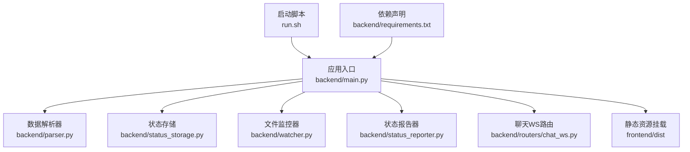
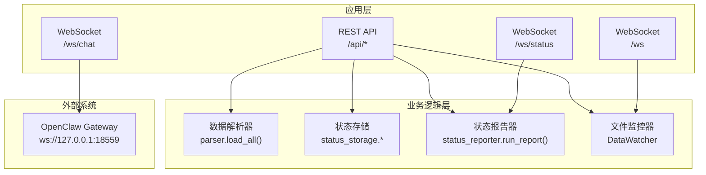
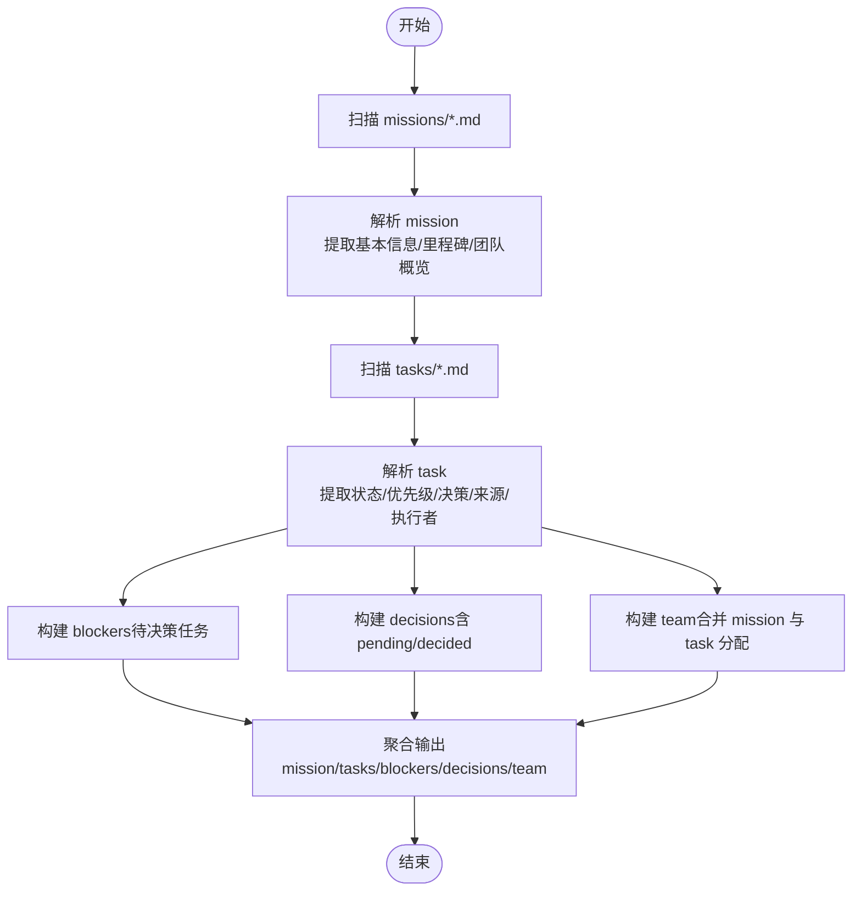
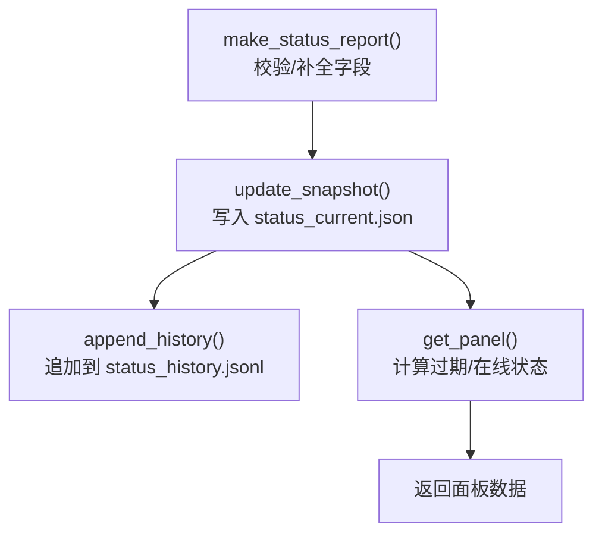
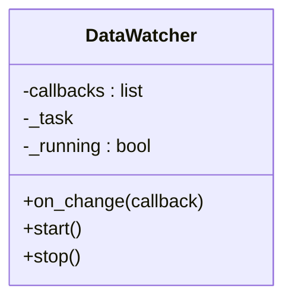
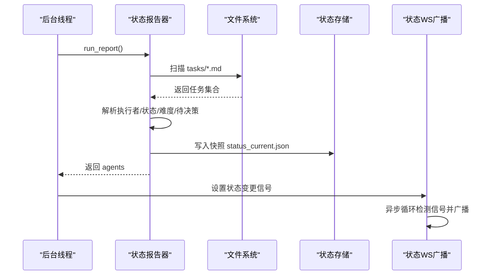
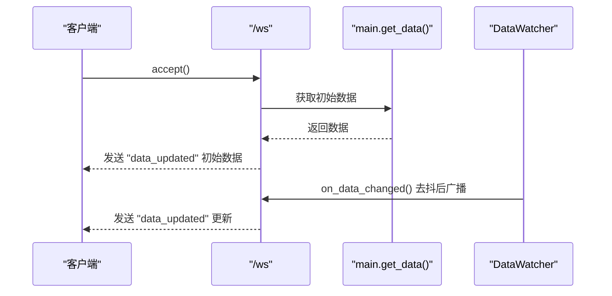
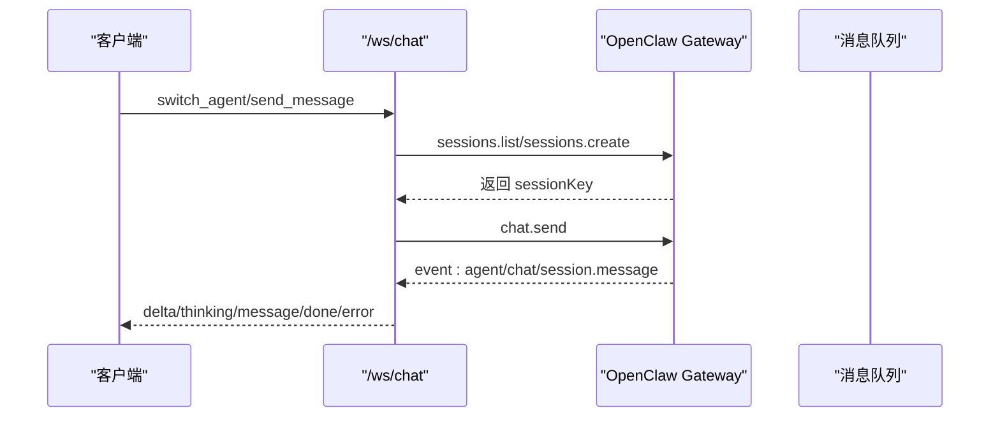
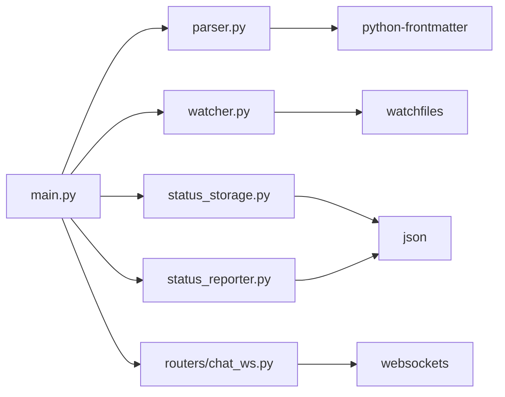

# 后端服务

<cite>
**本文引用的文件**
- [backend/main.py](file://backend/main.py)
- [backend/parser.py](file://backend/parser.py)
- [backend/status_storage.py](file://backend/status_storage.py)
- [backend/watcher.py](file://backend/watcher.py)
- [backend/status_reporter.py](file://backend/status_reporter.py)
- [backend/routers/chat_ws.py](file://backend/routers/chat_ws.py)
- [backend/requirements.txt](file://backend/requirements.txt)
- [run.sh](file://run.sh)
- [tests/test_chat_delta.py](file://tests/test_chat_delta.py)
- [tests/test_chat_delta2.py](file://tests/test_chat_delta2.py)
- [data/status_current.json](file://data/status_current.json)
- [data/status_history.jsonl](file://data/status_history.jsonl)
</cite>

## 目录
1. [简介](#简介)
2. [项目结构](#项目结构)
3. [核心组件](#核心组件)
4. [架构总览](#架构总览)
5. [详细组件分析](#详细组件分析)
6. [依赖关系分析](#依赖关系分析)
7. [性能与优化](#性能与优化)
8. [故障排查指南](#故障排查指南)
9. [结论](#结论)
10. [附录](#附录)

## 简介
本文件为 SynapseOS 2.0 后端服务的全面技术文档，覆盖 FastAPI 应用配置、WebSocket 服务实现、REST API 端点设计、数据解析器、状态存储与历史记录、文件监控系统、CORS 跨域配置、错误处理策略以及性能优化建议。文档同时提供 WebSocket 事件处理流程、消息格式与实时交互模式说明，并给出客户端实现参考路径与最佳实践。

## 项目结构
后端采用模块化组织：
- 应用入口与路由注册：backend/main.py
- 数据解析与聚合：backend/parser.py
- 状态快照与历史：backend/status_storage.py
- 任务文件监控：backend/watcher.py
- 状态报告生成：backend/status_reporter.py
- 聊天 WebSocket 桥接：backend/routers/chat_ws.py
- 依赖声明：backend/requirements.txt
- 启动脚本：run.sh
- 测试用例：tests/test_chat_delta.py、tests/test_chat_delta2.py
- 数据文件：data/status_current.json、data/status_history.jsonl

图表来源
- [backend/main.py:184-495](file://backend/main.py#L184-L495)
- [backend/parser.py:440-509](file://backend/parser.py#L440-L509)
- [backend/status_storage.py:1-236](file://backend/status_storage.py#L1-L236)
- [backend/watcher.py:1-52](file://backend/watcher.py#L1-L52)
- [backend/status_reporter.py:258-274](file://backend/status_reporter.py#L258-L274)
- [backend/routers/chat_ws.py:1-319](file://backend/routers/chat_ws.py#L1-L319)
- [run.sh:72-117](file://run.sh#L72-L117)
- [backend/requirements.txt:1-6](file://backend/requirements.txt#L1-L6)

章节来源
- [backend/main.py:184-495](file://backend/main.py#L184-L495)
- [run.sh:72-117](file://run.sh#L72-L117)

## 核心组件
- FastAPI 应用与生命周期管理：通过 lifespan 管理后台线程与异步任务，启动文件监控器与状态报告器线程；在关闭时清理资源。
- 数据解析器：读取 cyber-team 目录下的任务与使命 Markdown 文件，解析为结构化对象并聚合为统一数据视图。
- 状态存储：维护实时状态快照与历史记录，支持按条件分页查询与过期检测。
- 文件监控器：基于 watchfiles 异步监控数据目录变更，触发广播。
- 状态报告器：定时扫描任务文件，生成状态快照并写入 JSON 文件。
- WebSocket 服务：
  - /ws：向所有客户端广播数据更新事件，含心跳与 ping/pong。
  - /ws/status：向状态频道客户端广播状态面板更新事件。
  - /ws/chat：桥接 OpenClaw Gateway，转发消息、流式推送 delta、thinking、lifecycle 等事件。
- REST API：提供任务、决策、团队、状态面板、历史等接口，支持决策更新与注册表读取。

章节来源
- [backend/main.py:120-182](file://backend/main.py#L120-L182)
- [backend/parser.py:440-509](file://backend/parser.py#L440-L509)
- [backend/status_storage.py:62-193](file://backend/status_storage.py#L62-L193)
- [backend/watcher.py:8-52](file://backend/watcher.py#L8-L52)
- [backend/status_reporter.py:258-274](file://backend/status_reporter.py#L258-L274)
- [backend/routers/chat_ws.py:139-319](file://backend/routers/chat_ws.py#L139-L319)

## 架构总览
后端由 FastAPI 提供 REST 与 WebSocket 服务，内部通过解析器聚合数据，通过状态存储与报告器维护实时状态，通过文件监控器驱动数据更新广播。聊天 WebSocket 路由桥接外部 OpenClaw Gateway，实现流式消息与事件透传。

图表来源
- [backend/main.py:184-495](file://backend/main.py#L184-L495)
- [backend/parser.py:440-509](file://backend/parser.py#L440-L509)
- [backend/status_storage.py:62-193](file://backend/status_storage.py#L62-L193)
- [backend/status_reporter.py:258-274](file://backend/status_reporter.py#L258-L274)
- [backend/watcher.py:8-52](file://backend/watcher.py#L8-L52)
- [backend/routers/chat_ws.py:139-319](file://backend/routers/chat_ws.py#L139-L319)

## 详细组件分析

### FastAPI 应用与生命周期
- 应用初始化：设置标题、CORS 中间件（允许任意来源、方法与头），注册聊天 WebSocket 路由。
- 生命周期：
  - 启动：实例化 DataWatcher 并注册回调；立即执行一次状态报告；启动后台线程每 60 秒扫描任务文件；启动异步广播任务监听状态变化事件。
  - 关闭：停止广播任务、后台线程、文件监控器。
- 静态资源：挂载前端 dist 目录，若不存在则提供根路径简单响应。

章节来源
- [backend/main.py:184-182](file://backend/main.py#L184-L182)
- [backend/main.py:187-193](file://backend/main.py#L187-L193)
- [backend/main.py:194-197](file://backend/main.py#L194-L197)
- [backend/main.py:480-487](file://backend/main.py#L480-L487)

### 数据解析器（parser）
- 功能：解析 mission 与 task Markdown 文件，抽取元数据与结构化字段，构建 Mission、Task、Blocker、Decision、TeamMember 对象。
- 关键能力：
  - 解析 frontmatter 与正文表格，提取字段值。
  - 规范化任务状态、优先级、决策状态与来源类型。
  - 从任务中推导阻塞项与决策项，构建团队成员列表。
  - 聚合为统一数据视图，包含 mission、tasks、blockers、decisions、team。
- 使用：由 main.get_data() 调用，供 REST 与 WebSocket 广播使用。

图表来源
- [backend/parser.py:440-509](file://backend/parser.py#L440-L509)
- [backend/parser.py:123-437](file://backend/parser.py#L123-L437)

章节来源
- [backend/parser.py:16-92](file://backend/parser.py#L16-L92)
- [backend/parser.py:123-437](file://backend/parser.py#L123-L437)
- [backend/parser.py:440-509](file://backend/parser.py#L440-L509)

### 状态存储与历史（status_storage）
- 快照（status_current.json）：保存各 agent 的最新状态，包含进度、难度、需求帮助、任务 ID、下次上报时间等，并带在线状态与过期检测。
- 历史（status_history.jsonl）：按行存储历史报告，支持按 agent_id、type、时间范围、task_id 过滤与分页查询。
- 面板（panel）：加载快照并标注过期状态，用于前端实时展示。

图表来源
- [backend/status_storage.py:33-99](file://backend/status_storage.py#L33-L99)
- [backend/status_storage.py:102-126](file://backend/status_storage.py#L102-L126)
- [backend/status_storage.py:139-193](file://backend/status_storage.py#L139-L193)

章节来源
- [backend/status_storage.py:33-99](file://backend/status_storage.py#L33-L99)
- [backend/status_storage.py:102-126](file://backend/status_storage.py#L102-L126)
- [backend/status_storage.py:139-193](file://backend/status_storage.py#L139-L193)

### 文件监控器（watcher）
- 类 DataWatcher：封装异步监控、回调通知、启动/停止生命周期。
- 用途：监控数据目录变更，触发 on_data_changed，实现数据更新的去抖与广播。

图表来源
- [backend/watcher.py:8-52](file://backend/watcher.py#L8-L52)

章节来源
- [backend/watcher.py:8-52](file://backend/watcher.py#L8-L52)

### 状态报告器（status_reporter）
- 功能：扫描任务文件，解析执行者、状态、难度、待决策，生成 agents 报告并写入快照。
- 机制：定时线程每 60 秒运行一次，触发状态广播。

图表来源
- [backend/status_reporter.py:258-274](file://backend/status_reporter.py#L258-L274)
- [backend/main.py:105-161](file://backend/main.py#L105-L161)
- [backend/status_storage.py:246-256](file://backend/status_storage.py#L246-L256)

章节来源
- [backend/status_reporter.py:16-44](file://backend/status_reporter.py#L16-L44)
- [backend/status_reporter.py:189-243](file://backend/status_reporter.py#L189-L243)
- [backend/status_reporter.py:258-274](file://backend/status_reporter.py#L258-L274)

### WebSocket 服务
- /ws：向所有客户端广播“data_updated”事件，包含完整数据视图；支持 ping/pong 与心跳。
- /ws/status：向状态频道客户端广播“status_updated”或“difficulty_reported”/“decision_requested”事件；支持 ping/pong 与心跳。
- /ws/chat：桥接 OpenClaw Gateway，转发消息、流式推送 delta/thinking/lifecycle 等事件，支持会话切换与历史拉取。

图表来源
- [backend/main.py:396-440](file://backend/main.py#L396-L440)
- [backend/main.py:61-93](file://backend/main.py#L61-L93)
- [backend/watcher.py:21-34](file://backend/watcher.py#L21-L34)

图表来源
- [backend/routers/chat_ws.py:139-319](file://backend/routers/chat_ws.py#L139-L319)

章节来源
- [backend/main.py:396-477](file://backend/main.py#L396-L477)
- [backend/routers/chat_ws.py:139-319](file://backend/routers/chat_ws.py#L139-L319)

### REST API 端点清单
- 通用
  - GET /api/mission：返回 mission 数据
  - GET /api/tasks：返回任务列表
  - GET /api/blockers：返回阻塞项列表
  - GET /api/decisions：返回决策列表
  - PATCH /api/decisions/{decision_id}：更新决策状态（approve/reject），写回任务文件相应区域
  - GET /api/team：返回团队成员列表
  - GET /api/registry：返回注册表（角色与分配）

- 状态相关
  - POST /api/status/report：提交状态报告，写入快照与历史，并广播状态更新事件
  - GET /api/status/panel：获取状态面板（含过期检测）
  - GET /api/status/history：分页查询历史，支持 agent_id、type、from_time、to_time、task_id 过滤
  - GET /api/status/{agent_id}：获取单个 agent 状态
  - POST /api/status/difficulty：便捷端点，上报难度

- 认证与安全
  - 本项目未实现显式认证；如需保护端点，可在 FastAPI 层添加中间件或装饰器。

章节来源
- [backend/main.py:200-384](file://backend/main.py#L200-L384)

## 依赖关系分析
- 应用依赖：FastAPI、Uvicorn、watchfiles、python-frontmatter、websockets。
- 模块耦合：
  - main.py 依赖 parser、watcher、status_storage、status_reporter 与 chat_ws 路由。
  - parser 依赖 frontmatter 与正则解析工具。
  - status_storage 依赖 JSON 文件读写与时间处理。
  - watcher 依赖 watchfiles 异步监控。
  - chat_ws 路由依赖 websockets 与外部 Gateway。

图表来源
- [backend/requirements.txt:1-6](file://backend/requirements.txt#L1-L6)
- [backend/main.py:15-21](file://backend/main.py#L15-L21)

章节来源
- [backend/requirements.txt:1-6](file://backend/requirements.txt#L1-L6)
- [backend/main.py:15-21](file://backend/main.py#L15-L21)

## 性能与优化
- 去抖广播：对数据更新事件进行去抖（默认 300ms），减少频繁广播带来的网络与 CPU 压力。
- 异步与并发：使用 asyncio 与线程混合模型，后台线程负责周期性扫描，异步任务负责状态广播。
- 文件监控：watchfiles 提供高效的文件系统监控，避免轮询开销。
- WebSocket 心跳：/ws 与 /ws/status 支持 ping/pong 与心跳，维持长连接稳定。
- 历史查询限制：历史接口限制每页最大条数，防止大页导致内存压力。
- 建议优化：
  - 对于高频更新场景，可考虑引入消息队列（如 Redis Stream）进一步削峰。
  - 对解析器增加缓存策略，避免重复解析相同文件。
  - 对 WebSocket 广播增加速率限制与连接数上限控制。
  - 对历史查询增加索引字段（如 created_at）以提升过滤效率。

[本节为通用性能讨论，无需特定文件引用]

## 故障排查指南
- WebSocket 连接异常
  - 检查 /ws 与 /ws/status 是否正确接受连接与发送心跳。
  - 若出现断连，确认客户端是否定期发送 ping 或接收心跳。
- 状态更新不生效
  - 确认后台线程是否运行（每 60 秒扫描任务文件）。
  - 检查 status_current.json 是否被更新。
  - 确认状态广播任务是否在运行。
- 决策更新失败
  - 检查任务文件是否存在且包含目标 task_id。
  - 确认任务文件中“果爸决策”区域格式是否符合解析规则。
- 聊天 WebSocket
  - 确认 Gateway 地址与 Token 配置正确。
  - 使用测试脚本验证 delta 流式推送是否正常。
- 日志定位
  - 后端日志路径由 run.sh 维护，可通过 logs/synapse_backend.log 查看。

章节来源
- [backend/main.py:105-161](file://backend/main.py#L105-L161)
- [backend/main.py:396-477](file://backend/main.py#L396-L477)
- [run.sh:162-170](file://run.sh#L162-L170)

## 结论
SynapseOS 2.0 后端服务以 FastAPI 为核心，结合异步与线程混合架构，实现了高效的数据解析、状态存储与实时广播。WebSocket 通道覆盖数据更新、状态面板与聊天桥接三大场景，满足多用户协作与实时交互需求。通过去抖、心跳与限流等机制保障稳定性，配合测试脚本与日志便于问题定位与优化。

[本节为总结性内容，无需特定文件引用]

## 附录

### CORS 跨域配置
- 允许任意来源、方法与头，便于前端开发与跨域访问。

章节来源
- [backend/main.py:187-193](file://backend/main.py#L187-L193)

### 错误处理策略
- WebSocket：捕获连接断开与异常，清理客户端列表并输出错误日志。
- 文件监控：回调异常会被捕获并打印，不影响整体监控。
- 状态报告：异常被捕获并打印，不影响后台线程继续运行。

章节来源
- [backend/main.py:430-440](file://backend/main.py#L430-L440)
- [backend/watcher.py:26-27](file://backend/watcher.py#L26-L27)
- [backend/main.py:115-116](file://backend/main.py#L115-L116)

### 客户端实现参考
- REST API：直接调用 /api/* 端点，注意 /api/decisions/{decision_id} 的 PATCH 请求体包含决策状态字段。
- WebSocket：
  - /ws：订阅“data_updated”事件，处理初始数据与更新事件。
  - /ws/status：订阅“status_updated”、“difficulty_reported”、“decision_requested”事件。
  - /ws/chat：发送“switch_agent”或“send_message”，接收“delta”、“thinking”、“message”、“done”、“error”。

章节来源
- [backend/main.py:200-384](file://backend/main.py#L200-L384)
- [backend/main.py:396-477](file://backend/main.py#L396-L477)
- [backend/routers/chat_ws.py:139-319](file://backend/routers/chat_ws.py#L139-L319)

### 数据样例
- 状态快照样例：[data/status_current.json](file://data/status_current.json)
- 历史记录样例（前 3 条）：[data/status_history.jsonl:1-3](file://data/status_history.jsonl#L1-L3)

章节来源
- [data/status_current.json:1-59](file://data/status_current.json#L1-L59)
- [data/status_history.jsonl:1-3](file://data/status_history.jsonl#L1-L3)