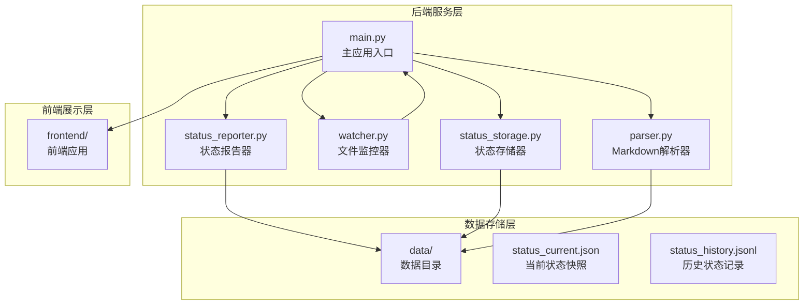
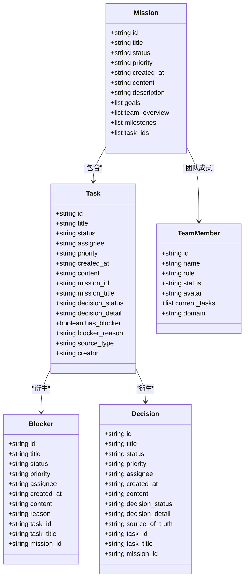
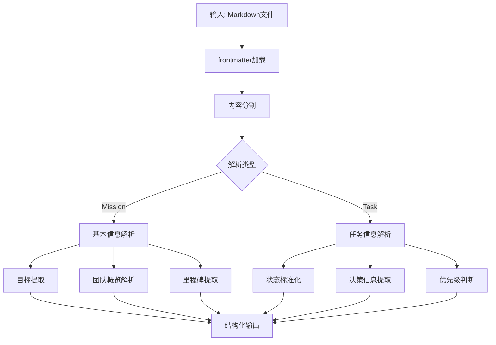
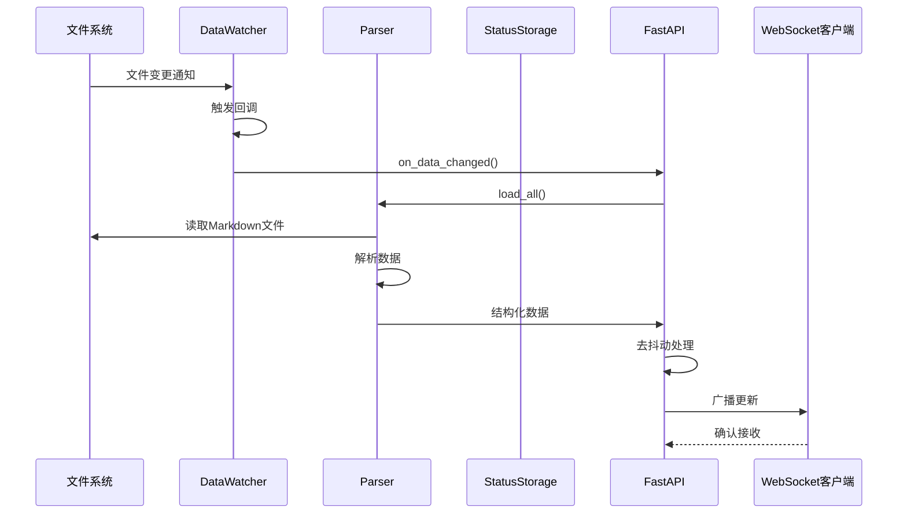
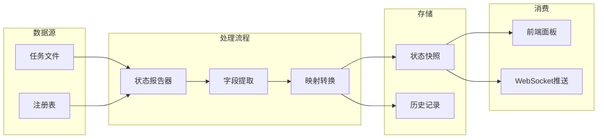
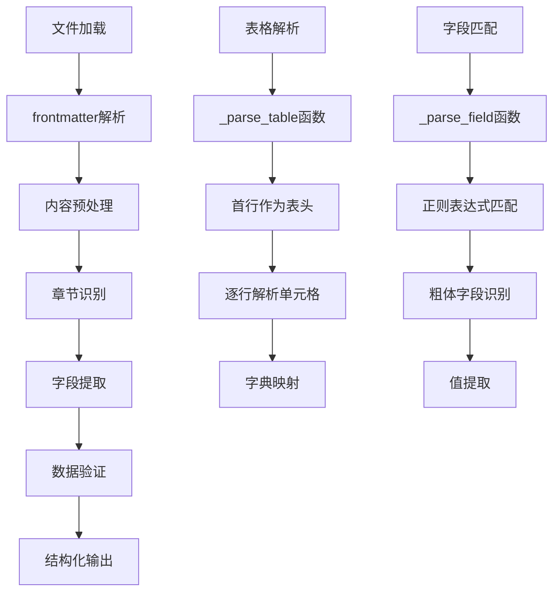
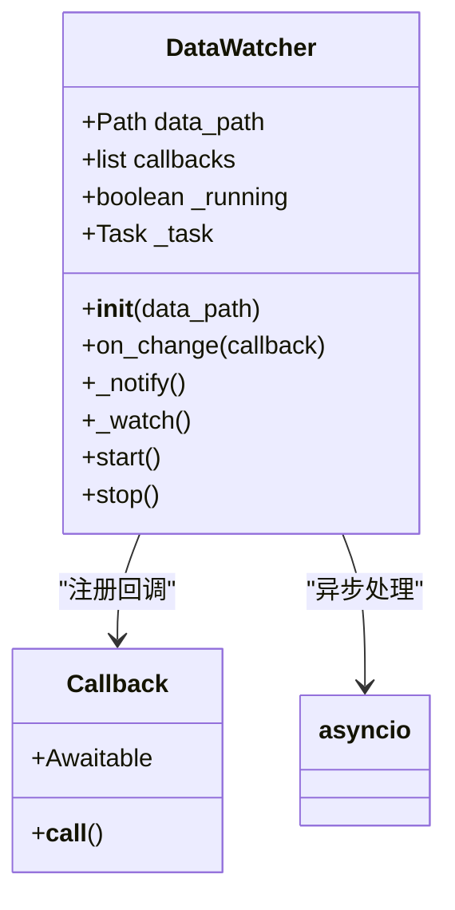
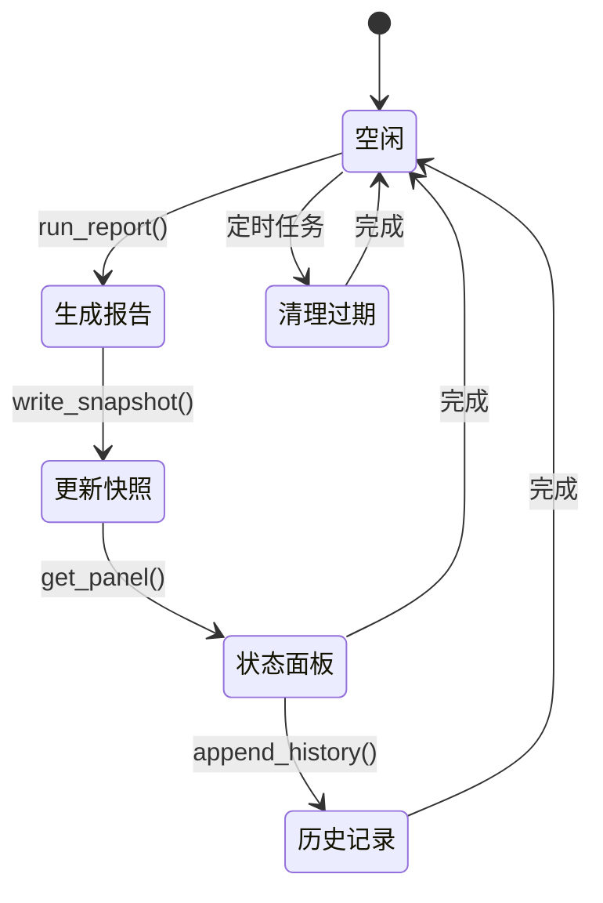
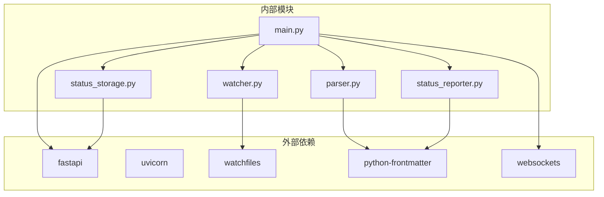

# 数据解析系统

<cite>
**本文档引用的文件**
- [parser.py](file://backend/parser.py)
- [watcher.py](file://backend/watcher.py)
- [main.py](file://backend/main.py)
- [status_storage.py](file://backend/status_storage.py)
- [status_reporter.py](file://backend/status_reporter.py)
- [status_current.json](file://data/status_current.json)
- [status_history.jsonl](file://data/status_history.jsonl)
- [requirements.txt](file://backend/requirements.txt)
- [run.sh](file://run.sh)
</cite>

## 目录
1. [简介](#简介)
2. [项目结构](#项目结构)
3. [核心组件](#核心组件)
4. [架构概览](#架构概览)
5. [详细组件分析](#详细组件分析)
6. [依赖关系分析](#依赖关系分析)
7. [性能考虑](#性能考虑)
8. [故障排除指南](#故障排除指南)
9. [结论](#结论)
10. [附录](#附录)

## 简介

SynapseOS 2.0 数据解析系统是一个专为赛博团队设计的实时数据处理平台，主要负责解析和转换 Markdown 格式的任务数据，为前端界面提供结构化的项目管理信息。该系统采用模块化设计，包含三个核心功能模块：Markdown 文件解析器、文件监控机制和状态管理系统。

系统的核心价值在于：
- **实时数据同步**：通过文件监控机制实现实时数据更新
- **多格式支持**：支持多种 Markdown 格式的数据源
- **智能数据转换**：将非结构化 Markdown 数据转换为结构化 JSON 格式
- **双向通信**：通过 WebSocket 提供实时数据推送

## 项目结构

项目采用清晰的分层架构，主要分为后端服务层、数据存储层和前端展示层：



**图表来源**
- [main.py:1-495](file://backend/main.py#L1-L495)
- [parser.py:1-509](file://backend/parser.py#L1-L509)
- [watcher.py:1-52](file://backend/watcher.py#L1-L52)

**章节来源**
- [main.py:1-495](file://backend/main.py#L1-L495)
- [parser.py:1-509](file://backend/parser.py#L1-L509)
- [watcher.py:1-52](file://backend/watcher.py#L1-L52)

## 核心组件

### 数据模型定义

系统定义了完整的数据模型体系，用于表示赛博团队的各种实体：



**图表来源**
- [parser.py:17-92](file://backend/parser.py#L17-L92)

### 解析器架构

Markdown 解析器采用模块化设计，支持多种数据格式的解析：



**图表来源**
- [parser.py:123-200](file://backend/parser.py#L123-L200)
- [parser.py:203-342](file://backend/parser.py#L203-L342)

**章节来源**
- [parser.py:17-92](file://backend/parser.py#L17-L92)
- [parser.py:123-342](file://backend/parser.py#L123-L342)

## 架构概览

系统采用异步事件驱动架构，实现了高效的实时数据处理：



**图表来源**
- [watcher.py:21-34](file://backend/watcher.py#L21-L34)
- [main.py:61-93](file://backend/main.py#L61-L93)
- [parser.py:441-503](file://backend/parser.py#L441-L503)

### 状态管理系统

状态管理系统负责维护团队成员的实时工作状态：



**图表来源**
- [status_reporter.py:189-243](file://backend/status_reporter.py#L189-L243)
- [status_storage.py:62-99](file://backend/status_storage.py#L62-L99)

**章节来源**
- [main.py:119-181](file://backend/main.py#L119-L181)
- [status_reporter.py:189-266](file://backend/status_reporter.py#L189-L266)
- [status_storage.py:62-126](file://backend/status_storage.py#L62-L126)

## 详细组件分析

### Markdown 文件解析器

#### 解析算法详解

解析器采用多阶段解析策略，确保能够准确提取各种格式的 Markdown 数据：



**图表来源**
- [parser.py:99-120](file://backend/parser.py#L99-L120)
- [parser.py:113-120](file://backend/parser.py#L113-L120)

#### 数据提取算法

系统实现了多种数据提取算法来处理不同的 Markdown 格式：

**基本信息提取算法**：
- 使用正则表达式匹配粗体字段格式
- 支持中英文冒号和中文冒号
- 实现字段值清理和标准化

**表格解析算法**：
- 识别以竖线开头的表格行
- 第一行作为表头，后续行作为数据
- 自动处理列数不匹配的情况

**目标和里程碑提取算法**：
- 使命目标使用数字序号和粗体标题
- 里程碑使用粗体标题和状态标识
- 实现状态自动识别和分类

**章节分割算法**：
- 识别二级标题作为章节边界
- 保持章节内容的完整性
- 支持嵌套的子章节结构

**章节来源**
- [parser.py:99-120](file://backend/parser.py#L99-L120)
- [parser.py:123-200](file://backend/parser.py#L123-L200)
- [parser.py:203-342](file://backend/parser.py#L203-L342)

### 文件监控机制 (DataWatcher)

#### 监控架构

DataWatcher 实现了一个高效的文件监控系统，基于 watchfiles 库提供异步文件变更检测：



**图表来源**
- [watcher.py:8-52](file://backend/watcher.py#L8-L52)

#### 变更检测机制

监控系统采用以下策略确保高效的数据变更检测：

**异步监控循环**：
- 使用 asyncio.create_task 创建后台监控任务
- 实现独立的监控循环，不影响主线程
- 支持优雅的停止和资源清理

**回调通知机制**：
- 支持多个回调函数注册
- 异步调用所有回调函数
- 错误隔离，单个回调失败不影响其他回调

**变更过滤**：
- 使用 watchfiles 库进行底层文件监控
- 自动过滤无关的文件系统事件
- 减少不必要的数据重新加载

**章节来源**
- [watcher.py:8-52](file://backend/watcher.py#L8-L52)

### 状态管理系统

#### 状态快照机制

状态管理系统实现了完整的状态快照和历史记录功能：



**图表来源**
- [status_reporter.py:258-266](file://backend/status_reporter.py#L258-L266)
- [status_storage.py:62-126](file://backend/status_storage.py#L62-L126)

#### 数据验证和转换

状态报告器实现了复杂的数据验证和转换逻辑：

**字段提取策略**：
- 优先从 frontmatter 中提取字段
- 支持多种字段格式和命名方式
- 实现字段值的智能清理和标准化

**执行者映射**：
- 支持中文和英文姓名映射
- 实现模糊匹配机制
- 处理多重执行者的情况

**状态转换**：
- 将任务状态映射为进度级别
- 支持多种状态表达方式
- 实现状态的标准化处理

**章节来源**
- [status_reporter.py:189-243](file://backend/status_reporter.py#L189-L243)
- [status_storage.py:62-126](file://backend/status_storage.py#L62-L126)

## 依赖关系分析

系统采用模块化设计，各组件之间的依赖关系清晰明确：



**图表来源**
- [requirements.txt:1-6](file://backend/requirements.txt#L1-L6)
- [main.py:15-21](file://backend/main.py#L15-L21)

### 组件耦合度分析

系统设计遵循低耦合高内聚的原则：

**核心模块独立性**：
- parser.py 专注于数据解析，与文件系统交互
- watcher.py 专注于文件监控，与异步框架交互  
- status_reporter.py 专注于状态生成，与任务文件交互
- status_storage.py 专注于数据持久化，与文件系统交互

**接口契约**：
- 所有模块通过明确定义的函数接口交互
- 数据传递采用标准化的 JSON 格式
- 错误处理采用统一的异常机制

**扩展性设计**：
- 支持新的数据格式通过添加新的解析函数
- 支持新的监控机制通过实现回调接口
- 支持新的存储后端通过实现存储接口

**章节来源**
- [requirements.txt:1-6](file://backend/requirements.txt#L1-L6)
- [main.py:15-21](file://backend/main.py#L15-L21)

## 性能考虑

### 内存优化策略

系统采用了多项内存优化技术：

**延迟加载机制**：
- 仅在需要时加载和解析文件
- 使用生成器模式处理大量数据
- 实现缓存机制避免重复解析

**数据结构优化**：
- 使用 dataclass 减少内存占用
- 采用列表推导式提高处理效率
- 实现对象池减少垃圾回收压力

### 并发处理优化

**异步并发**：
- 使用 asyncio 实现非阻塞 I/O
- 实现去抖动机制避免频繁更新
- 支持多客户端同时连接

**批处理优化**：
- 批量处理文件变更事件
- 合并相似的更新请求
- 实现背压机制防止系统过载

### 缓存策略

**多层缓存**：
- 内存缓存最近访问的数据
- 文件缓存解析后的结构化数据
- 数据库缓存历史状态记录

**缓存失效策略**：
- 基于时间的缓存过期
- 基于文件修改时间的缓存验证
- 手动缓存刷新机制

## 故障排除指南

### 常见问题诊断

**文件监控失效**：
- 检查 DataWatcher 是否正确初始化
- 验证回调函数是否正确注册
- 确认文件权限和路径配置

**解析错误**：
- 检查 Markdown 文件格式是否符合要求
- 验证 frontmatter 格式是否正确
- 确认特殊字符是否正确转义

**WebSocket 连接问题**：
- 检查网络连接和防火墙设置
- 验证 WebSocket 服务器是否正常运行
- 确认客户端连接参数配置

### 错误处理机制

系统实现了完善的错误处理和恢复机制：

**异常捕获**：
- 所有异步操作都包含异常处理
- 文件操作失败时提供降级策略
- 网络错误时实现重试机制

**日志记录**：
- 关键操作都有详细的日志记录
- 错误信息包含上下文信息
- 支持调试模式下的详细日志

**恢复策略**：
- 自动重启失败的服务
- 数据备份和恢复机制
- 系统健康检查和自愈能力

**章节来源**
- [watcher.py:21-28](file://backend/watcher.py#L21-L28)
- [main.py:44-58](file://backend/main.py#L44-L58)

## 结论

SynapseOS 2.0 数据解析系统是一个设计精良、功能完备的实时数据处理平台。系统通过模块化的设计、高效的解析算法和可靠的监控机制，成功地将非结构化的 Markdown 数据转换为结构化的业务数据。

### 主要优势

**实时性**：通过文件监控和 WebSocket 推送实现真正的实时数据更新
**可靠性**：完善的错误处理和恢复机制确保系统稳定运行
**可扩展性**：模块化设计支持轻松添加新的数据源和处理逻辑
**易用性**：简洁的 API 和清晰的文档降低使用门槛

### 技术亮点

**智能解析**：支持多种 Markdown 格式，自动识别和转换数据结构
**状态管理**：完整的状态快照和历史记录系统
**并发处理**：高效的异步并发处理能力
**性能优化**：多项优化策略确保系统高性能运行

## 附录

### 支持的数据格式

系统支持以下 Markdown 格式的数据源：

**使命文件格式**：
- 基本信息章节：包含使命ID、名称、状态、创建时间、描述
- 使命目标：使用编号列表和粗体标题
- 承担团队：使用表格格式
- 当前版本：使用粗体标题和状态标识

**任务文件格式**：
- 任务标题：支持多种标题格式
- 基本信息：状态、优先级、创建时间
- 任务执行：架构师和开发者信息
- 果爸决策：最终决策和真相源
- 来源类型：任务来源标识
- 创建者：任务创建人信息

### 字段映射规则

**状态映射**：
- "待启动" → "pending"
- "进行中" → "in-progress" 
- "已完成" → "completed"
- "规划中" → "planning"
- "开发中" → "developing"

**优先级映射**：
- 红色图标 → "high"
- 黄色图标 → "medium"
- 绿色图标 → "low"

**章节识别**：
- 二级标题：## 标题
- 三级标题：### 标题
- 列表项：- **字段**: 值

### 扩展新数据源指南

要扩展新的数据源，需要遵循以下步骤：

**1. 添加解析函数**：
```python
def parse_new_format(filepath: Path) -> Optional[NewDataType]:
    # 实现新的解析逻辑
    pass
```

**2. 更新主加载函数**：
```python
def load_all() -> dict:
    # 调用新的解析函数
    pass
```

**3. 添加数据模型**：
```python
@dataclass
class NewDataType:
    # 定义新的数据模型
    pass
```

**4. 配置文件监控**：
```python
watcher = DataWatcher(CYBER_TEAM_DIR)
watcher.on_change(on_data_changed)
```

### 性能优化建议

**1. 缓存策略**：
- 实现文件内容缓存
- 缓存解析后的结构化数据
- 使用 LRU 缓存管理内存

**2. 并发优化**：
- 使用 asyncio.gather 并行处理多个文件
- 实现批量处理减少 I/O 操作
- 优化数据库查询和索引

**3. 内存管理**：
- 及时释放不再使用的对象
- 使用生成器处理大数据集
- 监控内存使用情况

**4. 网络优化**：
- 实现连接池复用
- 优化 WebSocket 消息大小
- 使用压缩传输大文件