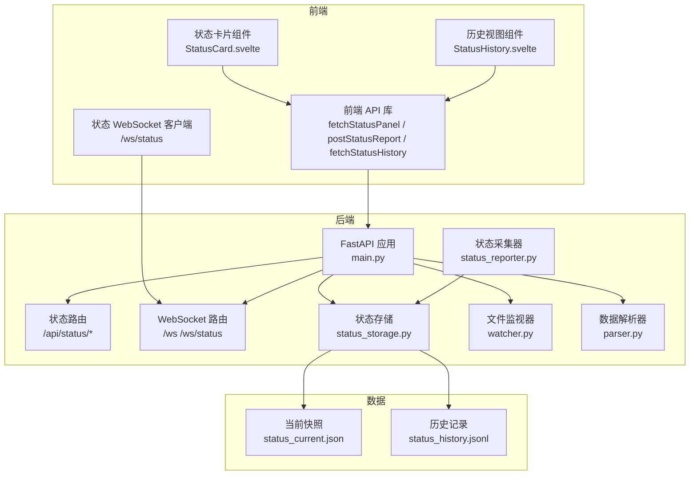
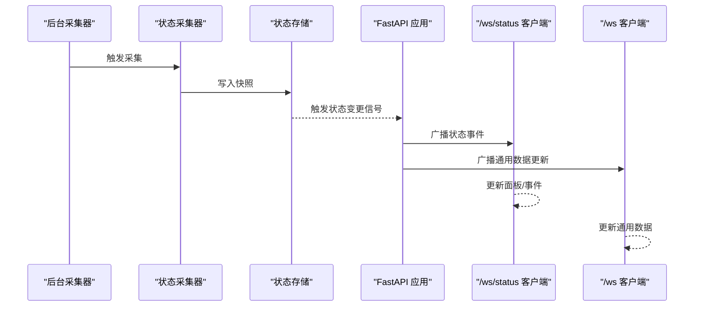
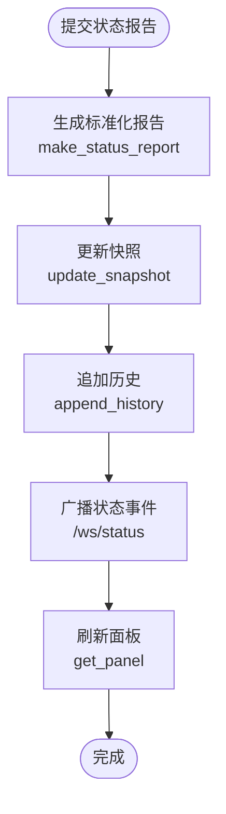
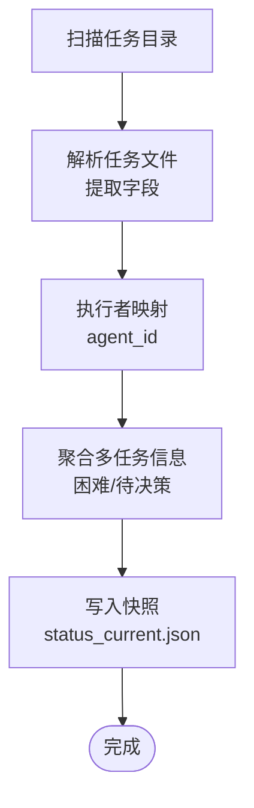
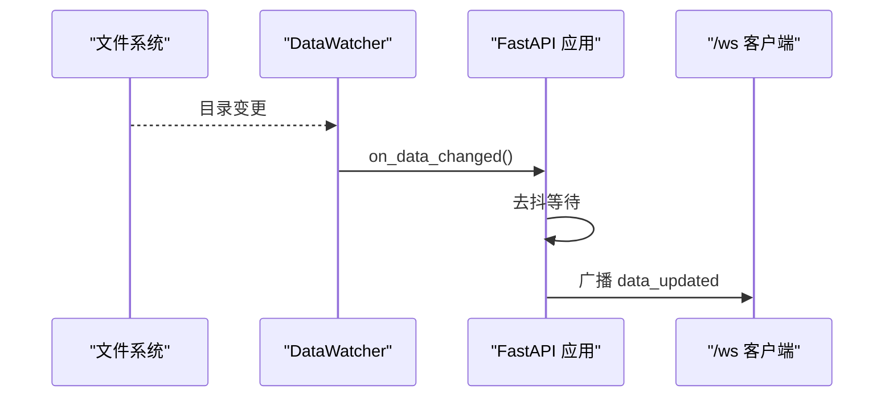
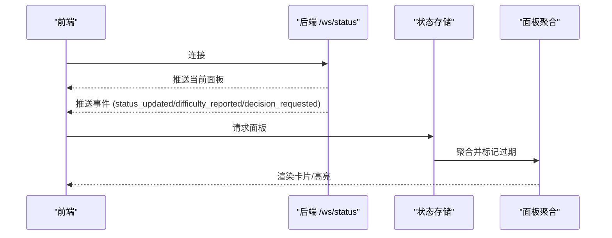
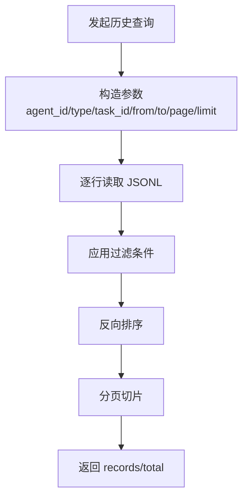
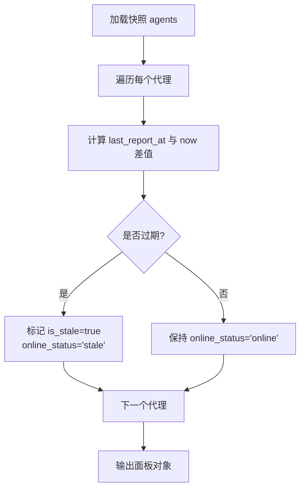
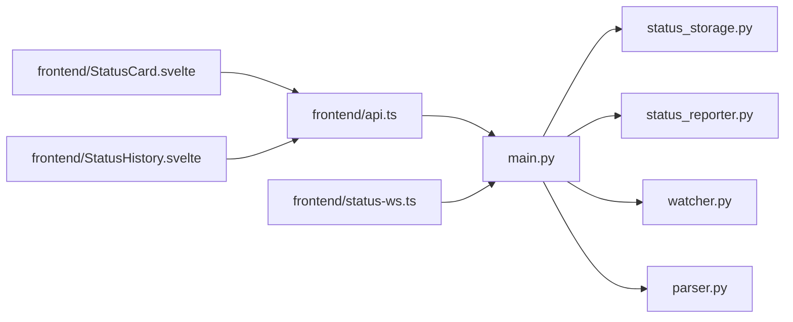

# 状态管理系统

<cite>
**本文引用的文件**
- [backend/status_storage.py](file://backend/status_storage.py)
- [backend/status_reporter.py](file://backend/status_reporter.py)
- [backend/watcher.py](file://backend/watcher.py)
- [backend/main.py](file://backend/main.py)
- [backend/parser.py](file://backend/parser.py)
- [data/status_current.json](file://data/status_current.json)
- [data/status_history.jsonl](file://data/status_history.jsonl)
- [frontend/src/lib/status-ws.ts](file://frontend/src/lib/status-ws.ts)
- [frontend/src/lib/api.ts](file://frontend/src/lib/api.ts)
- [frontend/src/views/StatusCard.svelte](file://frontend/src/views/StatusCard.svelte)
- [frontend/src/views/StatusHistory.svelte](file://frontend/src/views/StatusHistory.svelte)
</cite>

## 目录
1. [简介](#简介)
2. [项目结构](#项目结构)
3. [核心组件](#核心组件)
4. [架构总览](#架构总览)
5. [详细组件分析](#详细组件分析)
6. [依赖关系分析](#依赖关系分析)
7. [性能考量](#性能考量)
8. [故障排查指南](#故障排查指南)
9. [结论](#结论)
10. [附录](#附录)

## 简介
本文件面向 SynapseOS 2.0 的状态管理系统，系统通过解析任务 Markdown 数据生成状态快照与历史记录，并通过 WebSocket 实时推送状态面板与事件，支持前端卡片展示、历史查询与筛选、以及后台定时采集。本文档覆盖状态存储设计、快照与历史机制、面板聚合算法、实时更新机制、事件广播与客户端通知策略，并提供持久化与备份恢复建议及性能优化技巧。

## 项目结构
系统采用前后端分离架构：
- 后端使用 FastAPI 提供 REST API 与 WebSocket，负责状态采集、快照与历史持久化、事件广播。
- 前端使用 Svelte 构建状态面板与历史视图，通过 WebSocket 订阅状态更新，通过 REST API 查询历史。
- 数据层以 JSON/JSONL 文件形式存储当前快照与历史记录，位于 data 目录。

图表来源
- [backend/main.py:185-495](file://backend/main.py#L185-L495)
- [backend/status_storage.py:1-236](file://backend/status_storage.py#L1-L236)
- [backend/status_reporter.py:1-274](file://backend/status_reporter.py#L1-L274)
- [backend/watcher.py:1-52](file://backend/watcher.py#L1-L52)
- [backend/parser.py:1-509](file://backend/parser.py#L1-L509)
- [frontend/src/lib/api.ts:1-181](file://frontend/src/lib/api.ts#L1-L181)
- [frontend/src/lib/status-ws.ts:1-78](file://frontend/src/lib/status-ws.ts#L1-L78)
- [data/status_current.json:1-59](file://data/status_current.json#L1-L59)
- [data/status_history.jsonl:1-4](file://data/status_history.jsonl#L1-L4)

章节来源
- [backend/main.py:1-495](file://backend/main.py#L1-L495)
- [backend/status_storage.py:1-236](file://backend/status_storage.py#L1-L236)
- [backend/status_reporter.py:1-274](file://backend/status_reporter.py#L1-L274)
- [backend/watcher.py:1-52](file://backend/watcher.py#L1-L52)
- [backend/parser.py:1-509](file://backend/parser.py#L1-L509)
- [frontend/src/lib/api.ts:1-181](file://frontend/src/lib/api.ts#L1-L181)
- [frontend/src/lib/status-ws.ts:1-78](file://frontend/src/lib/status-ws.ts#L1-L78)
- [data/status_current.json:1-59](file://data/status_current.json#L1-L59)
- [data/status_history.jsonl:1-4](file://data/status_history.jsonl#L1-L4)

## 核心组件
- 状态存储模块：负责快照读写、历史追加与查询、面板聚合与过期检测。
- 状态采集器：定时扫描任务目录，解析 Markdown，生成状态报告并写入快照。
- 文件监视器：监听任务目录变化，触发数据更新广播。
- WebSocket 广播：向 /ws 发送通用数据更新，向 /ws/status 发送状态事件。
- 前端 API 与 WebSocket 客户端：封装 REST 与 WebSocket 调用，驱动 UI 组件。
- 数据解析器：解析任务与决策等 Markdown 内容，构建统一数据模型。

章节来源
- [backend/status_storage.py:1-236](file://backend/status_storage.py#L1-L236)
- [backend/status_reporter.py:1-274](file://backend/status_reporter.py#L1-L274)
- [backend/watcher.py:1-52](file://backend/watcher.py#L1-L52)
- [backend/main.py:1-495](file://backend/main.py#L1-L495)
- [frontend/src/lib/api.ts:1-181](file://frontend/src/lib/api.ts#L1-L181)
- [frontend/src/lib/status-ws.ts:1-78](file://frontend/src/lib/status-ws.ts#L1-L78)
- [backend/parser.py:1-509](file://backend/parser.py#L1-L509)

## 架构总览
系统通过“采集-存储-广播-消费”的闭环实现状态管理：
- 采集：后台线程每 60 秒扫描任务目录，解析生成状态报告并写入快照。
- 存储：快照写入 JSON 文件，历史追加写入 JSONL 文件。
- 广播：文件变化与状态变更分别触发通用数据更新与状态事件广播。
- 消费：前端订阅 /ws 获取通用数据，订阅 /ws/status 获取状态面板与事件；同时通过 REST API 查询历史。

图表来源
- [backend/status_reporter.py:105-117](file://backend/status_reporter.py#L105-L117)
- [backend/status_storage.py:71-99](file://backend/status_storage.py#L71-L99)
- [backend/main.py:145-161](file://backend/main.py#L145-L161)
- [frontend/src/lib/status-ws.ts:18-68](file://frontend/src/lib/status-ws.ts#L18-L68)

## 详细组件分析

### 状态存储模块（快照与历史）
- 快照设计
  - 结构：包含更新时间与按 agent_id 聚合的代理状态数组。
  - 字段：包含身份、角色、领域、当前任务、进度、难度、待决策、任务 ID、最近上报时间、下次上报时间、在线状态与是否过期等。
  - 过期检测：基于最近上报时间与阈值计算是否过期，用于面板渲染提示。
- 历史记录
  - 结构：每条记录为独立 JSON 对象，按时间顺序追加至 JSONL 文件。
  - 查询：支持按代理、类型、任务、时间范围分页查询，服务端反向排序后切片。
- 报告模型
  - 输入数据经规范化生成标准报告对象，自动根据是否存在难度或待决策字段推导类型。
- 示例路径
  - 创建报告：[make_status_report:33-58](file://backend/status_storage.py#L33-L58)
  - 更新快照：[update_snapshot:71-99](file://backend/status_storage.py#L71-L99)
  - 获取面板：[get_panel:102-126](file://backend/status_storage.py#L102-L126)
  - 追加历史：[append_history:139-143](file://backend/status_storage.py#L139-L143)
  - 查询历史：[get_history:146-192](file://backend/status_storage.py#L146-L192)

图表来源
- [backend/status_storage.py:33-58](file://backend/status_storage.py#L33-L58)
- [backend/status_storage.py:71-99](file://backend/status_storage.py#L71-L99)
- [backend/status_storage.py:139-143](file://backend/status_storage.py#L139-L143)
- [backend/main.py:318-346](file://backend/main.py#L318-L346)

章节来源
- [backend/status_storage.py:1-236](file://backend/status_storage.py#L1-L236)
- [data/status_current.json:1-59](file://data/status_current.json#L1-L59)
- [data/status_history.jsonl:1-4](file://data/status_history.jsonl#L1-L4)

### 状态采集器（定时扫描与聚合）
- 采集范围：扫描任务目录下的 Markdown 文件，忽略模板文件。
- 字段提取：从 Frontmatter 或表格行中提取状态、优先级、执行者、困难、待决策等字段。
- 执行者映射：将中文/英文名映射为 agent_id，并合并多个任务的困难与待决策信息。
- 输出：生成 agents 字典，写入快照文件。
- 示例路径
  - 解析单个任务：[_parse_task_file:129-173](file://backend/status_reporter.py#L129-L173)
  - 名称映射：[_name_to_agent_id:176-186](file://backend/status_reporter.py#L176-L186)
  - 聚合多任务：[gather_all_status_reports:189-243](file://backend/status_reporter.py#L189-L243)
  - 写入快照：[write_snapshot:246-255](file://backend/status_reporter.py#L246-L255)
  - 执行采集：[run_report:258-266](file://backend/status_reporter.py#L258-L266)

图表来源
- [backend/status_reporter.py:129-173](file://backend/status_reporter.py#L129-L173)
- [backend/status_reporter.py:176-186](file://backend/status_reporter.py#L176-L186)
- [backend/status_reporter.py:189-243](file://backend/status_reporter.py#L189-L243)
- [backend/status_reporter.py:246-255](file://backend/status_reporter.py#L246-L255)

章节来源
- [backend/status_reporter.py:1-274](file://backend/status_reporter.py#L1-L274)

### 文件监视器与数据更新广播
- 文件监视器：监控 data 目录变化，触发回调。
- 数据更新广播：对通用数据通道发送 data_updated 事件，带去抖延迟。
- 状态事件广播：后台线程设置事件标志，异步循环检测并广播 status_updated、difficulty_reported、decision_requested 等事件。
- 示例路径
  - 监听回调：[on_data_changed:61-66](file://backend/main.py#L61-L66)
  - 去抖广播：[_debounce_and_broadcast:86-93](file://backend/main.py#L86-L93)
  - 状态广播循环：[_status_broadcast_loop:145-161](file://backend/main.py#L145-L161)
  - 文件监视器类：[DataWatcher:8-51](file://backend/watcher.py#L8-L51)

图表来源
- [backend/watcher.py:29-34](file://backend/watcher.py#L29-L34)
- [backend/main.py:61-93](file://backend/main.py#L61-L93)

章节来源
- [backend/watcher.py:1-52](file://backend/watcher.py#L1-L52)
- [backend/main.py:61-181](file://backend/main.py#L61-L181)

### WebSocket 与实时更新机制
- 通用通道 /ws：连接后立即推送初始数据，心跳保持。
- 状态通道 /ws/status：连接后推送当前面板，随后接收状态事件。
- 事件类型：
  - status_updated：面板更新
  - difficulty_reported：出现困难
  - decision_requested：需要决策
- 前端 WebSocket 客户端：
  - 自动重连，指数退避，连接状态与面板/事件存入 Svelte stores。
- 示例路径
  - 通用 WebSocket：[/ws:397-440](file://backend/main.py#L397-L440)
  - 状态 WebSocket：[/ws/status:442-476](file://backend/main.py#L442-L476)
  - 前端连接逻辑：[startStatusWs:66-68](file://frontend/src/lib/status-ws.ts#L66-L68)
  - 事件处理与面板更新：[onmessage:35-45](file://frontend/src/lib/status-ws.ts#L35-L45)

图表来源
- [backend/main.py:442-476](file://backend/main.py#L442-L476)
- [frontend/src/lib/status-ws.ts:35-45](file://frontend/src/lib/status-ws.ts#L35-L45)
- [backend/status_storage.py:102-126](file://backend/status_storage.py#L102-L126)
- [frontend/src/views/StatusCard.svelte:1-170](file://frontend/src/views/StatusCard.svelte#L1-L170)

章节来源
- [backend/main.py:397-476](file://backend/main.py#L397-L476)
- [frontend/src/lib/status-ws.ts:1-78](file://frontend/src/lib/status-ws.ts#L1-L78)
- [frontend/src/views/StatusCard.svelte:1-170](file://frontend/src/views/StatusCard.svelte#L1-L170)

### 历史记录管理与查询
- 历史格式：每行一个 JSON 对象，便于流式读取与追加。
- 查询接口：支持按代理、类型、任务、时间范围分页查询，服务端反向排序后切片。
- 前端历史视图：支持筛选与分页，加载时显示占位动画。
- 示例路径
  - 追加历史：[append_history:139-143](file://backend/status_storage.py#L139-L143)
  - 查询历史：[get_history:146-192](file://backend/status_storage.py#L146-L192)
  - 前端查询封装：[fetchStatusHistory:165-180](file://frontend/src/lib/api.ts#L165-L180)
  - 历史视图组件：[StatusHistory.svelte:1-191](file://frontend/src/views/StatusHistory.svelte#L1-L191)

图表来源
- [backend/status_storage.py:146-192](file://backend/status_storage.py#L146-L192)
- [frontend/src/lib/api.ts:165-180](file://frontend/src/lib/api.ts#L165-L180)
- [frontend/src/views/StatusHistory.svelte:22-44](file://frontend/src/views/StatusHistory.svelte#L22-L44)

章节来源
- [backend/status_storage.py:139-192](file://backend/status_storage.py#L139-L192)
- [frontend/src/lib/api.ts:144-180](file://frontend/src/lib/api.ts#L144-L180)
- [frontend/src/views/StatusHistory.svelte:1-191](file://frontend/src/views/StatusHistory.svelte#L1-L191)

### 面板聚合算法
- 聚合输入：来自快照的 agents 数组。
- 过滤与标记：
  - 计算每个代理的最后上报时间与当前时间差，超过阈值标记为过期。
  - 过期则在线状态改为 stale，卡片边框高亮提示。
- 输出：包含 updated_at、agents 列表与过期阈值。
- 示例路径
  - 面板聚合：[get_panel:102-126](file://backend/status_storage.py#L102-L126)

图表来源
- [backend/status_storage.py:102-126](file://backend/status_storage.py#L102-L126)

章节来源
- [backend/status_storage.py:102-126](file://backend/status_storage.py#L102-L126)

### 状态变更事件与广播策略
- 事件类型判定：根据报告类型自动选择事件类型（普通/困难/决策）。
- 广播内容：包含事件类型、报告详情与最新面板。
- 客户端策略：前端订阅 /ws/status，收到事件后更新面板与事件 store，驱动 UI 即时反馈。
- 示例路径
  - 事件判定与广播：[api_status_report:318-346](file://backend/main.py#L318-L346)
  - 事件处理：[status-ws.ts:35-45](file://frontend/src/lib/status-ws.ts#L35-L45)

章节来源
- [backend/main.py:318-346](file://backend/main.py#L318-L346)
- [frontend/src/lib/status-ws.ts:35-45](file://frontend/src/lib/status-ws.ts#L35-L45)

### 前端状态卡片与历史视图
- 状态卡片：展示代理头像、角色、当前任务、进度、难度与待决策状态，过期与阻塞状态高亮。
- 历史视图：支持按代理与类型筛选，分页加载，显示时间相对人类可读文本。
- 示例路径
  - 状态卡片组件：[StatusCard.svelte:1-170](file://frontend/src/views/StatusCard.svelte#L1-L170)
  - 历史视图组件：[StatusHistory.svelte:1-191](file://frontend/src/views/StatusHistory.svelte#L1-L191)
  - API 封装：[api.ts:100-180](file://frontend/src/lib/api.ts#L100-L180)

章节来源
- [frontend/src/views/StatusCard.svelte:1-170](file://frontend/src/views/StatusCard.svelte#L1-L170)
- [frontend/src/views/StatusHistory.svelte:1-191](file://frontend/src/views/StatusHistory.svelte#L1-L191)
- [frontend/src/lib/api.ts:100-180](file://frontend/src/lib/api.ts#L100-L180)

## 依赖关系分析
- 后端模块耦合
  - main.py 依赖 status_storage、status_reporter、watcher、parser。
  - status_storage 依赖 data 目录文件。
  - status_reporter 依赖任务目录与 agent 映射。
  - watcher 依赖外部库 watchfiles。
- 前端模块耦合
  - api.ts 封装 REST 调用。
  - status-ws.ts 封装 WebSocket 连接与事件处理。
  - 组件通过 stores 与 WebSocket 交互。

图表来源
- [backend/main.py:17-21](file://backend/main.py#L17-L21)
- [frontend/src/lib/api.ts:1-181](file://frontend/src/lib/api.ts#L1-L181)
- [frontend/src/lib/status-ws.ts:1-78](file://frontend/src/lib/status-ws.ts#L1-L78)

章节来源
- [backend/main.py:17-21](file://backend/main.py#L17-L21)
- [frontend/src/lib/api.ts:1-181](file://frontend/src/lib/api.ts#L1-L181)
- [frontend/src/lib/status-ws.ts:1-78](file://frontend/src/lib/status-ws.ts#L1-L78)

## 性能考量
- I/O 与并发
  - 快照与历史写入为顺序 I/O，建议在高并发场景下引入写锁或队列串行化。
  - 历史查询逐行读取，建议限制分页大小与时间范围，避免全量扫描。
- 去抖与广播
  - 通用数据更新采用去抖策略，减少频繁广播。
  - 状态事件广播通过线程事件标志与异步循环解耦，降低阻塞。
- 前端渲染
  - 历史视图使用占位动画提升体验；卡片组件根据状态动态高亮，避免重复渲染。
- 建议
  - 对历史文件启用压缩或轮转策略，控制单文件大小。
  - 使用索引字段（如 created_at）辅助快速过滤，必要时引入轻量数据库。

[本节为通用性能建议，不直接分析具体文件]

## 故障排查指南
- WebSocket 连接问题
  - 检查 /ws 与 /ws/status 是否正常握手与心跳。
  - 查看前端日志与重连机制是否生效。
- 数据未更新
  - 确认后台采集线程是否运行，任务目录是否存在且可读。
  - 检查文件监视器是否监听到变更并触发回调。
- 历史查询为空
  - 确认历史文件存在且格式正确。
  - 检查查询参数（代理、类型、时间范围、分页）是否合理。
- 前端状态异常
  - 检查面板聚合逻辑与过期阈值配置。
  - 确认事件类型与 UI 映射一致。

章节来源
- [backend/main.py:397-476](file://backend/main.py#L397-L476)
- [frontend/src/lib/status-ws.ts:51-58](file://frontend/src/lib/status-ws.ts#L51-L58)
- [backend/watcher.py:29-34](file://backend/watcher.py#L29-L34)
- [backend/status_storage.py:146-192](file://backend/status_storage.py#L146-L192)
- [frontend/src/views/StatusCard.svelte:64-72](file://frontend/src/views/StatusCard.svelte#L64-L72)

## 结论
SynapseOS 2.0 的状态管理系统以简洁的 JSON/JSONL 文件为核心，结合定时采集、文件监视与 WebSocket 实时广播，实现了从数据采集到前端展示的完整闭环。快照与历史分离的设计便于扩展与维护，面板聚合与事件广播提升了用户体验。后续可在历史查询索引、I/O 串行化与数据库迁移等方面进一步优化。

[本节为总结性内容，不直接分析具体文件]

## 附录

### 状态数据持久化策略
- 快照文件：status_current.json，保存最新面板数据。
- 历史文件：status_history.jsonl，逐行追加历史记录。
- 建议
  - 定期备份 data 目录。
  - 对历史文件启用轮转与压缩，限制单文件大小。
  - 引入校验与回滚机制，确保数据一致性。

章节来源
- [data/status_current.json:1-59](file://data/status_current.json#L1-L59)
- [data/status_history.jsonl:1-4](file://data/status_history.jsonl#L1-L4)

### 备份与恢复方案
- 备份
  - 定时复制 data 目录至安全位置。
  - 历史文件可按日期归档。
- 恢复
  - 停止服务后替换 data 目录。
  - 恢复后重启服务，验证面板与历史查询可用。

章节来源
- [backend/main.py:120-181](file://backend/main.py#L120-L181)

### 性能优化技巧
- I/O 优化
  - 使用缓冲写入与批量追加。
  - 历史查询限制分页与时间范围。
- 广播优化
  - 通用数据更新去抖，状态事件按需广播。
- 前端优化
  - 组件懒加载与虚拟滚动（历史列表）。
  - 缓存最近面板数据，减少重复请求。

章节来源
- [backend/main.py:86-93](file://backend/main.py#L86-L93)
- [backend/status_storage.py:146-192](file://backend/status_storage.py#L146-L192)
- [frontend/src/views/StatusHistory.svelte:117-125](file://frontend/src/views/StatusHistory.svelte#L117-L125)

### 代码示例路径（提交状态报告、查询历史、处理状态变更）
- 提交状态报告
  - 后端入口：[POST /api/status/report:318-346](file://backend/main.py#L318-L346)
  - 报告模型：[make_status_report:33-58](file://backend/status_storage.py#L33-L58)
  - 更新快照：[update_snapshot:71-99](file://backend/status_storage.py#L71-L99)
  - 追加历史：[append_history:139-143](file://backend/status_storage.py#L139-L143)
- 查询历史记录
  - 后端接口：[GET /api/status/history:355-374](file://backend/main.py#L355-L374)
  - 查询实现：[get_history:146-192](file://backend/status_storage.py#L146-L192)
  - 前端封装：[fetchStatusHistory:165-180](file://frontend/src/lib/api.ts#L165-L180)
- 处理状态变更
  - WebSocket 广播：[/ws/status:442-476](file://backend/main.py#L442-L476)
  - 事件处理：[status-ws.ts:35-45](file://frontend/src/lib/status-ws.ts#L35-L45)
  - 面板聚合：[get_panel:102-126](file://backend/status_storage.py#L102-L126)

章节来源
- [backend/main.py:318-374](file://backend/main.py#L318-L374)
- [backend/status_storage.py:33-143](file://backend/status_storage.py#L33-L143)
- [frontend/src/lib/api.ts:151-180](file://frontend/src/lib/api.ts#L151-L180)
- [frontend/src/lib/status-ws.ts:35-45](file://frontend/src/lib/status-ws.ts#L35-L45)