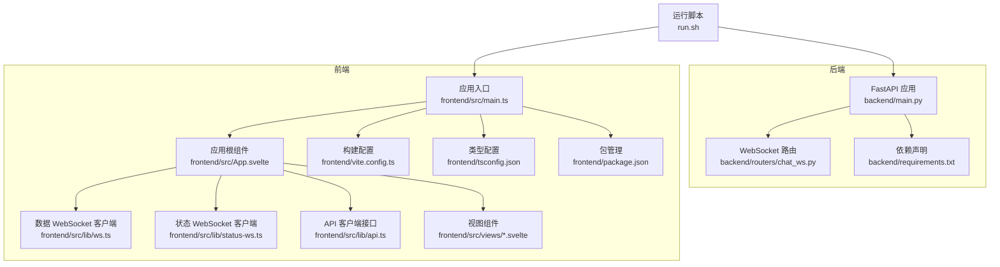
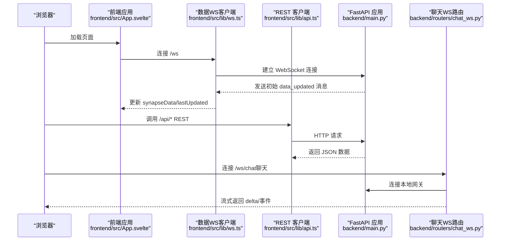
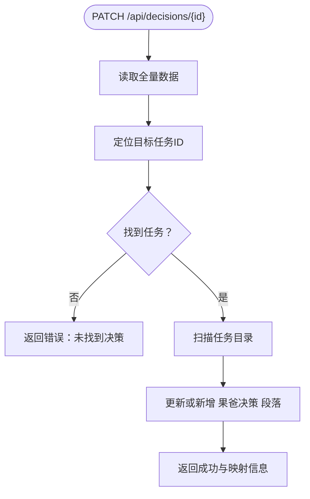
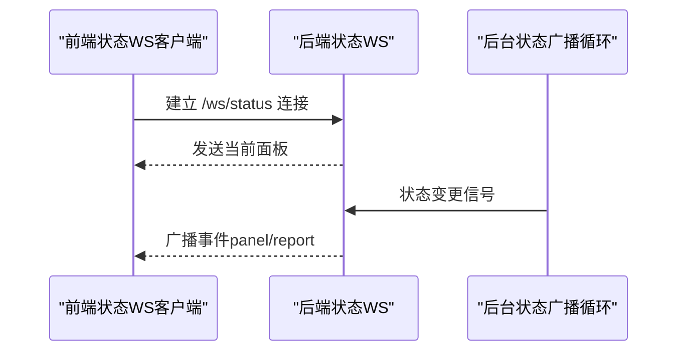
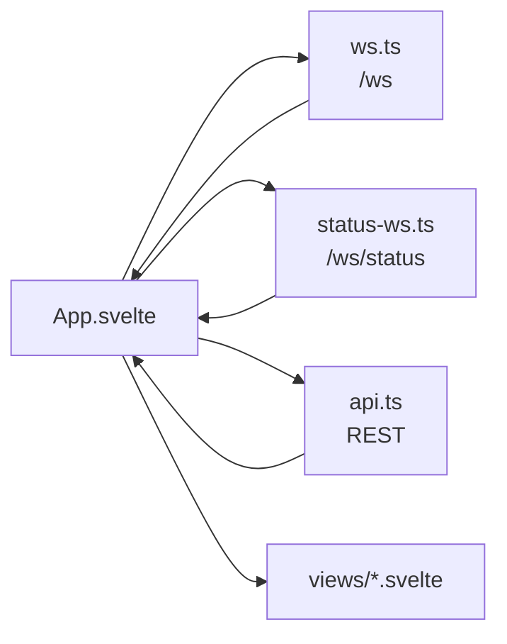
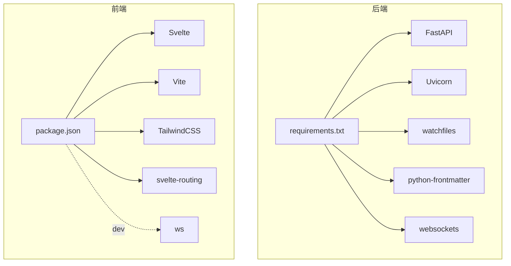

# 代码规范

<cite>
**本文引用的文件**
- [backend/main.py](file://backend/main.py)
- [backend/routers/chat_ws.py](file://backend/routers/chat_ws.py)
- [backend/requirements.txt](file://backend/requirements.txt)
- [frontend/src/lib/api.ts](file://frontend/src/lib/api.ts)
- [frontend/src/lib/ws.ts](file://frontend/src/lib/ws.ts)
- [frontend/src/lib/status-ws.ts](file://frontend/src/lib/status-ws.ts)
- [frontend/src/App.svelte](file://frontend/src/App.svelte)
- [frontend/src/views/Mission.svelte](file://frontend/src/views/Mission.svelte)
- [frontend/src/views/StatusCard.svelte](file://frontend/src/views/StatusCard.svelte)
- [frontend/src/main.ts](file://frontend/src/main.ts)
- [frontend/package.json](file://frontend/package.json)
- [frontend/tsconfig.json](file://frontend/tsconfig.json)
- [frontend/vite.config.ts](file://frontend/vite.config.ts)
- [run.sh](file://run.sh)
</cite>

## 目录
1. [简介](#简介)
2. [项目结构](#项目结构)
3. [核心组件](#核心组件)
4. [架构总览](#架构总览)
5. [详细组件分析](#详细组件分析)
6. [依赖分析](#依赖分析)
7. [性能考虑](#性能考虑)
8. [故障排查指南](#故障排查指南)
9. [结论](#结论)
10. [附录](#附录)

## 简介
本规范面向 SynapseOS 2.0 的代码库，覆盖后端 Python（FastAPI）、前端 TypeScript/Svelte 与 WebSocket 通信的编码标准、命名约定、缩进与注释、导入组织、路由设计原则、事件处理规范、组件结构规范、格式化工具配置与自动化检查流程，并给出文档字符串、错误处理与日志记录的最佳实践建议。本文所有技术要求均以仓库现有实现为依据提炼总结。

## 项目结构
- 后端采用 FastAPI 应用，通过生命周期管理启动数据观察器与状态报告线程；提供 REST API 与两条 WebSocket 通道：通用数据更新通道与专用状态更新通道。
- 前端基于 Vite + Svelte，使用 Svelte Store 管理全局状态，通过 WebSocket 实时接收数据与状态事件；路由采用哈希路由。
- 运行脚本统一管理前后端进程、日志与依赖安装。

图表来源
- [backend/main.py:184-198](file://backend/main.py#L184-L198)
- [backend/routers/chat_ws.py:186-365](file://backend/routers/chat_ws.py#L186-L365)
- [frontend/src/main.ts:1-9](file://frontend/src/main.ts#L1-L9)
- [frontend/src/App.svelte:1-290](file://frontend/src/App.svelte#L1-L290)
- [frontend/src/lib/ws.ts:1-84](file://frontend/src/lib/ws.ts#L1-L84)
- [frontend/src/lib/status-ws.ts:1-78](file://frontend/src/lib/status-ws.ts#L1-L78)
- [frontend/src/lib/api.ts:1-181](file://frontend/src/lib/api.ts#L1-L181)
- [frontend/vite.config.ts:1-23](file://frontend/vite.config.ts#L1-L23)
- [frontend/tsconfig.json:1-17](file://frontend/tsconfig.json#L1-L17)
- [frontend/package.json:1-24](file://frontend/package.json#L1-L24)
- [run.sh:1-192](file://run.sh#L1-L192)

章节来源
- [backend/main.py:184-198](file://backend/main.py#L184-L198)
- [frontend/src/App.svelte:1-290](file://frontend/src/App.svelte#L1-L290)
- [run.sh:1-192](file://run.sh#L1-L192)

## 核心组件
- 后端应用与生命周期
  - 使用 lifespan 管理后台线程与异步任务，确保在应用启动时初始化数据观察器与状态报告器，在关闭时正确清理资源。
  - 提供 REST API 接口用于获取任务、决策、团队等信息，以及状态面板与历史查询。
  - 提供两条 WebSocket 通道：通用数据通道与状态通道，分别广播全量数据与状态事件。
- WebSocket 路由
  - chat_ws 路由桥接本地网关，转发消息并流式返回 delta，支持多代理会话与跨代理事件路由。
- 前端应用
  - 使用 Svelte Store 管理连接状态、数据与时间戳；通过 ws.ts 与 status-ws.ts 分别连接两个 WebSocket 通道。
  - API 客户端封装 REST 请求，视图组件按功能拆分，采用哈希路由导航。

章节来源
- [backend/main.py:120-182](file://backend/main.py#L120-L182)
- [backend/main.py:200-394](file://backend/main.py#L200-L394)
- [backend/routers/chat_ws.py:186-365](file://backend/routers/chat_ws.py#L186-L365)
- [frontend/src/lib/ws.ts:1-84](file://frontend/src/lib/ws.ts#L1-L84)
- [frontend/src/lib/status-ws.ts:1-78](file://frontend/src/lib/status-ws.ts#L1-L78)
- [frontend/src/lib/api.ts:1-181](file://frontend/src/lib/api.ts#L1-L181)

## 架构总览
下图展示从浏览器到后端的请求链路与事件流：

图表来源
- [frontend/src/App.svelte:119-141](file://frontend/src/App.svelte#L119-L141)
- [frontend/src/lib/ws.ts:26-74](file://frontend/src/lib/ws.ts#L26-L74)
- [frontend/src/lib/api.ts:75-98](file://frontend/src/lib/api.ts#L75-L98)
- [backend/main.py:396-440](file://backend/main.py#L396-L440)
- [backend/routers/chat_ws.py:186-365](file://backend/routers/chat_ws.py#L186-L365)

## 详细组件分析

### 后端 FastAPI 应用与路由设计
- 生命周期管理
  - 在 lifespan 中启动 DataWatcher 与状态报告线程，应用关闭时取消广播任务、停止线程与 watcher。
- REST API 设计
  - 路径语义清晰：/api/mission、/api/tasks、/api/blockers、/api/decisions、/api/team、/api/registry。
  - 状态相关接口：/api/status/report、/api/status/panel、/api/status/history、/api/status/{agent_id}、/api/status/difficulty。
  - 参数校验与过滤：历史查询支持多维过滤与分页，限制每页最大条数。
- WebSocket 设计
  - /ws 广播全量数据，/ws/status 仅广播状态事件；心跳与 ping/pong 机制保证连接存活。
- 决策更新流程
  - PATCH /api/decisions/{decision_id}：根据决策 ID 查找对应任务文件并更新“果爸决策”段落。

图表来源
- [backend/main.py:224-298](file://backend/main.py#L224-L298)

章节来源
- [backend/main.py:120-182](file://backend/main.py#L120-L182)
- [backend/main.py:200-394](file://backend/main.py#L200-L394)
- [backend/main.py:396-477](file://backend/main.py#L396-L477)

### WebSocket 事件处理规范
- 通用数据通道
  - 连接建立后立即推送一次完整数据；后续通过防抖机制批量发送 data_updated；支持 ping/pong 与心跳。
- 状态通道
  - 连接后推送当前面板；后台线程检测状态变更后广播 status_updated、difficulty_reported 或 decision_requested。
- 聊天通道
  - 连接本地网关，维护 per-agent 会话键映射与 runId→agent 映射，确保事件不交叉；支持 delta、thinking、lifecycle 等事件类型。

图表来源
- [frontend/src/lib/status-ws.ts:18-64](file://frontend/src/lib/status-ws.ts#L18-L64)
- [backend/main.py:145-161](file://backend/main.py#L145-L161)
- [backend/main.py:68-83](file://backend/main.py#L68-L83)

章节来源
- [frontend/src/lib/ws.ts:1-84](file://frontend/src/lib/ws.ts#L1-L84)
- [frontend/src/lib/status-ws.ts:1-78](file://frontend/src/lib/status-ws.ts#L1-L78)
- [backend/main.py:442-477](file://backend/main.py#L442-L477)

### 前端组件结构与数据流
- 应用根组件
  - 使用哈希路由切换 mission/decisions/team；启动数据 WS；订阅 synapseData 并写入全局 store。
- 数据流
  - ws.ts 管理 /ws 连接，解析 data_updated/heartbeat；status-ws.ts 管理 /ws/status，解析面板与事件。
- 视图组件
  - Mission.svelte 展示使命概览与任务统计；StatusCard.svelte 展示单个代理的状态、难度与决策提示。

图表来源
- [frontend/src/App.svelte:1-290](file://frontend/src/App.svelte#L1-L290)
- [frontend/src/lib/ws.ts:1-84](file://frontend/src/lib/ws.ts#L1-L84)
- [frontend/src/lib/status-ws.ts:1-78](file://frontend/src/lib/status-ws.ts#L1-L78)
- [frontend/src/lib/api.ts:1-181](file://frontend/src/lib/api.ts#L1-L181)

章节来源
- [frontend/src/App.svelte:1-290](file://frontend/src/App.svelte#L1-L290)
- [frontend/src/views/Mission.svelte:1-239](file://frontend/src/views/Mission.svelte#L1-L239)
- [frontend/src/views/StatusCard.svelte:1-170](file://frontend/src/views/StatusCard.svelte#L1-L170)

### 类型与接口规范（TypeScript）
- 接口命名采用名词短语，首字母大写，如 Mission、Task、Blocker、Decision、TeamMember、StatusReport、AgentStatus、StatusPanel。
- 字段名遵循 camelCase，可选字段以 ? 结尾。
- REST 客户端函数以动词开头，如 fetchMission、fetchTasks、postStatusReport、fetchStatusHistory。

章节来源
- [frontend/src/lib/api.ts:1-181](file://frontend/src/lib/api.ts#L1-L181)

### Svelte 组件开发规范
- 组件文件命名采用帕斯卡命名法，如 Mission.svelte、StatusCard.svelte。
- 组件导出属性使用 export let，回调通过函数参数传递。
- 样式采用原子类与主题变量组合，避免内联复杂样式。
- 交互逻辑集中在<script>块中，模板保持简洁。

章节来源
- [frontend/src/views/Mission.svelte:1-239](file://frontend/src/views/Mission.svelte#L1-L239)
- [frontend/src/views/StatusCard.svelte:1-170](file://frontend/src/views/StatusCard.svelte#L1-L170)

### 命名约定与导入组织
- Python
  - 模块与函数使用 snake_case；类名使用 PascalCase；常量使用 UPPER_CASE；私有成员以下划线前缀。
  - 导入顺序：标准库 → 第三方库 → 项目内部模块；同组内按字母序排列。
- TypeScript
  - 变量与函数使用 camelCase；接口与类型使用 PascalCase；枚举项使用 UPPER_CASE。
- Svelte
  - 组件文件名使用 PascalCase；store 与工具函数使用 camelCase；常量使用 UPPER_CASE。

章节来源
- [backend/main.py:1-495](file://backend/main.py#L1-L495)
- [frontend/src/lib/api.ts:1-181](file://frontend/src/lib/api.ts#L1-L181)
- [frontend/src/lib/ws.ts:1-84](file://frontend/src/lib/ws.ts#L1-L84)
- [frontend/src/lib/status-ws.ts:1-78](file://frontend/src/lib/status-ws.ts#L1-L78)

### 注释与文档字符串
- Python
  - 模块顶部使用三引号文档字符串描述用途与职责。
  - 关键函数与复杂逻辑添加简要注释说明输入输出与边界条件。
- TypeScript
  - 公共接口与函数添加 JSDoc 风格注释，说明参数、返回值与异常。
- Svelte
  - 复杂逻辑在<script>块中添加行内注释，模板中使用简短注释说明布局意图。

章节来源
- [backend/main.py:1-495](file://backend/main.py#L1-L495)
- [backend/routers/chat_ws.py:1-365](file://backend/routers/chat_ws.py#L1-L365)
- [frontend/src/lib/api.ts:1-181](file://frontend/src/lib/api.ts#L1-L181)

### 错误处理与日志记录
- 后端
  - WebSocket 连接异常捕获并打印堆栈；后台线程与广播循环中对异常进行日志输出。
  - 决策更新失败时返回明确错误信息。
- 前端
  - WebSocket 连接断开自动重连，指数退避至上限；解析错误时记录控制台错误并关闭连接。
  - REST 请求错误通过返回状态与错误信息处理。

章节来源
- [backend/main.py:432-440](file://backend/main.py#L432-L440)
- [backend/main.py:241-243](file://backend/main.py#L241-L243)
- [frontend/src/lib/ws.ts:57-69](file://frontend/src/lib/ws.ts#L57-L69)
- [frontend/src/lib/status-ws.ts:51-63](file://frontend/src/lib/status-ws.ts#L51-L63)

## 依赖分析
- 后端依赖
  - FastAPI、Uvicorn、watchfiles、python-frontmatter、websockets。
- 前端依赖
  - Svelte、Vite、TailwindCSS、svelte-routing、ws（开发）。

图表来源
- [backend/requirements.txt:1-6](file://backend/requirements.txt#L1-L6)
- [frontend/package.json:1-24](file://frontend/package.json#L1-L24)

章节来源
- [backend/requirements.txt:1-6](file://backend/requirements.txt#L1-L6)
- [frontend/package.json:1-24](file://frontend/package.json#L1-L24)

## 性能考虑
- WebSocket 防抖
  - 后端对数据变更事件进行去抖处理，降低广播频率，提升吞吐与稳定性。
- 心跳与超时
  - 前端与后端均实现心跳与超时处理，避免连接空闲被中间设备回收。
- 批量广播
  - 后端聚合消息后一次性发送，减少网络往返与 CPU 占用。
- 前端渲染优化
  - 使用 Svelte 响应式语法与细粒度更新，避免不必要的重绘。

章节来源
- [backend/main.py:86-93](file://backend/main.py#L86-L93)
- [frontend/src/lib/ws.ts:42-51](file://frontend/src/lib/ws.ts#L42-L51)
- [frontend/src/App.svelte:119-141](file://frontend/src/App.svelte#L119-L141)

## 故障排查指南
- 后端日志
  - 使用 run.sh 输出日志路径，查看后端与前端日志最后若干行定位问题。
- WebSocket 断开
  - 检查前端重连逻辑与后端连接清理流程；确认心跳是否正常。
- 决策更新失败
  - 确认任务文件存在且包含目标任务 ID；检查“果爸决策”段落写入逻辑。
- 构建与运行
  - 确保依赖安装完成，端口未被占用；通过 run.sh status 检查进程状态。

章节来源
- [run.sh:162-170](file://run.sh#L162-L170)
- [frontend/src/lib/ws.ts:57-69](file://frontend/src/lib/ws.ts#L57-L69)
- [backend/main.py:241-243](file://backend/main.py#L241-L243)

## 结论
本规范以现有代码实现为基础，明确了 Python/FastAPI、TypeScript/Svelte 与 WebSocket 的编码与架构实践，建议在后续迭代中持续遵循命名、注释、错误处理与日志记录的一致性，以保障系统可维护性与可扩展性。

## 附录

### 代码格式化与自动化检查（建议）
- Python
  - 使用 Black 进行格式化；结合 flake8 或 ruff 进行静态检查；在 CI 中集成 pre-commit 钩子。
- TypeScript
  - 使用 Prettier 统一格式；结合 ESLint 进行规则约束；在 CI 中执行 lint 与类型检查。
- Svelte
  - 使用 Prettier + Svelte 插件；结合 ESLint 规则；在 CI 中执行构建与测试。
- 前端构建与代理
  - Vite 已配置代理将 /api 与 /ws 转发至后端，开发环境可直接联调。

章节来源
- [frontend/vite.config.ts:1-23](file://frontend/vite.config.ts#L1-L23)
- [frontend/tsconfig.json:1-17](file://frontend/tsconfig.json#L1-L17)
- [frontend/package.json:1-24](file://frontend/package.json#L1-L24)