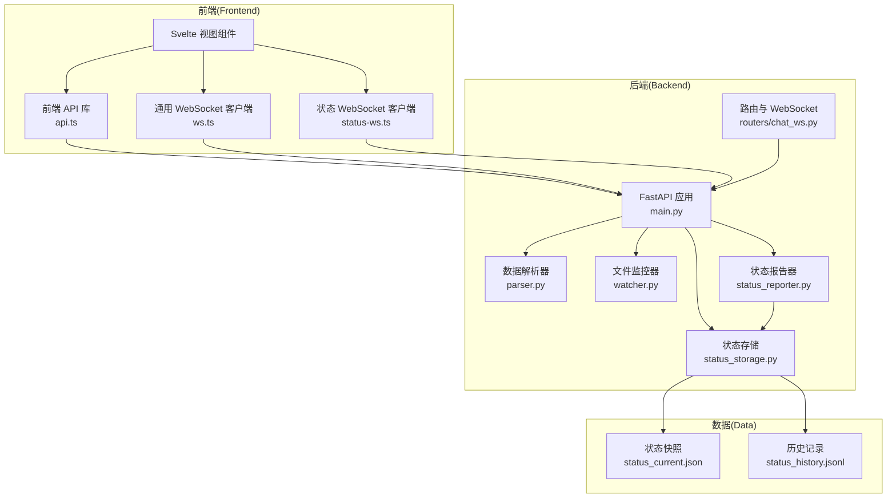
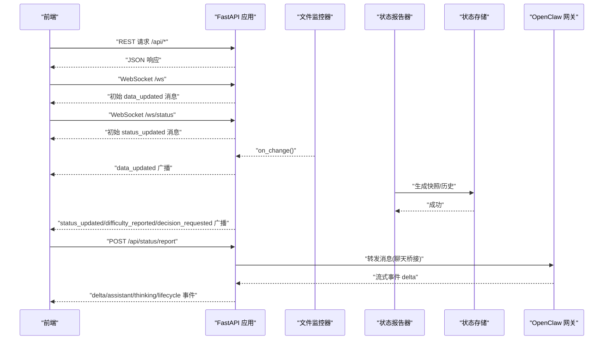
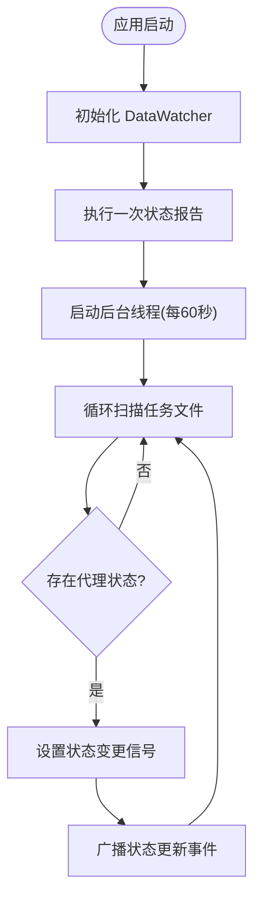
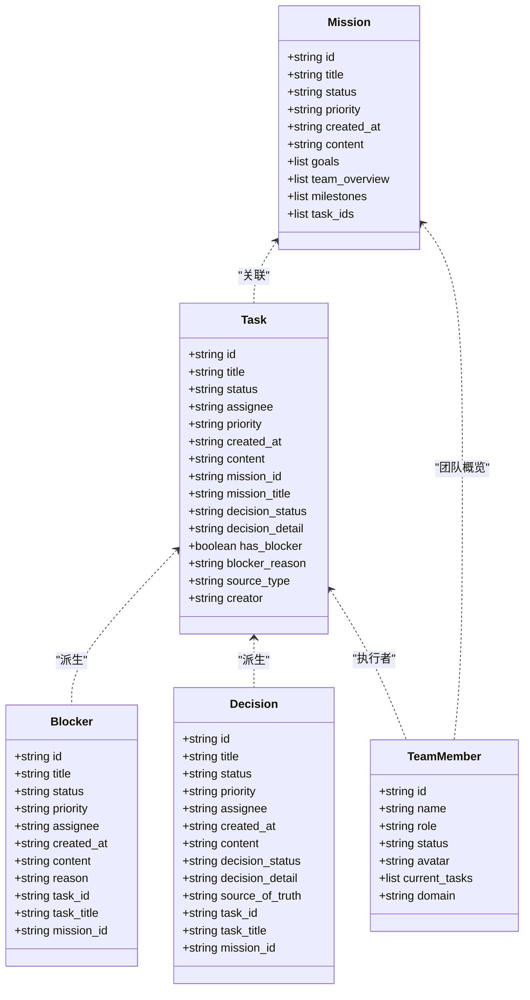
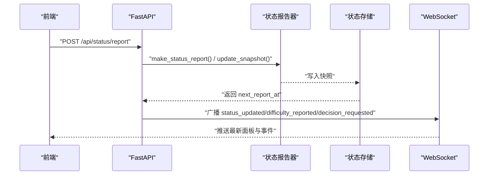
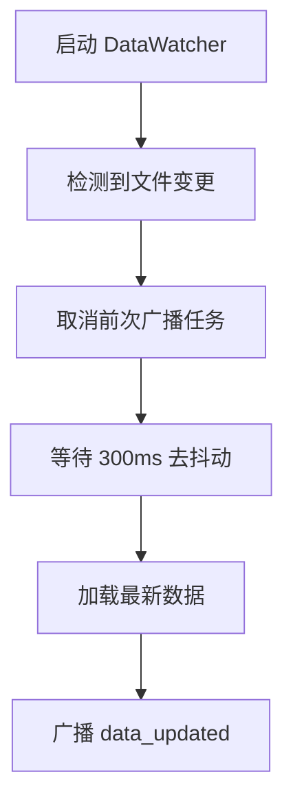
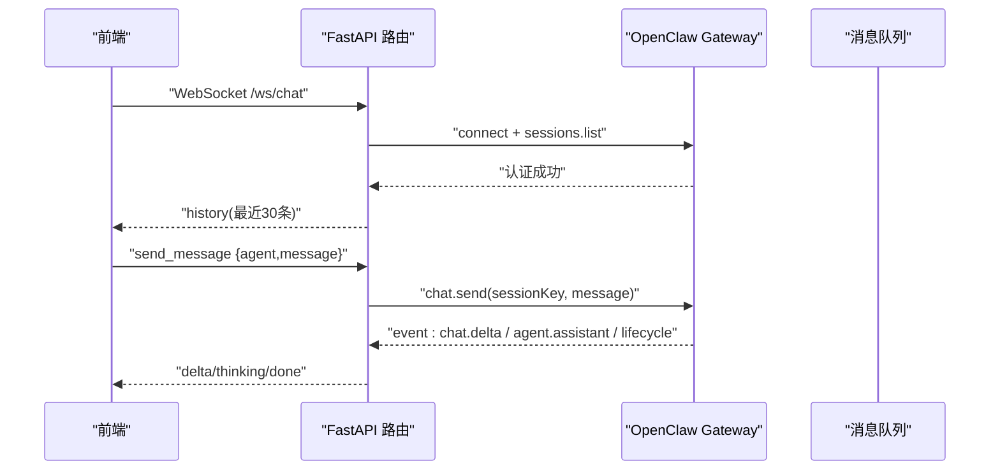
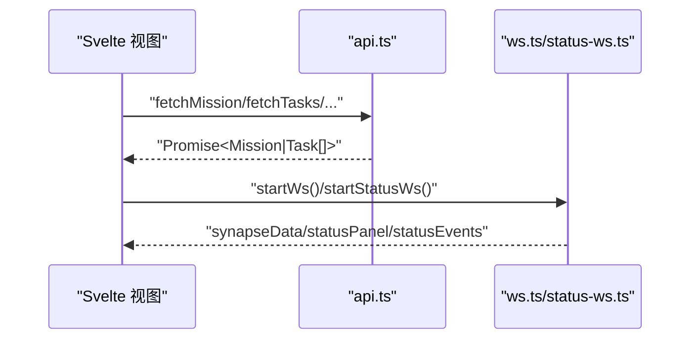
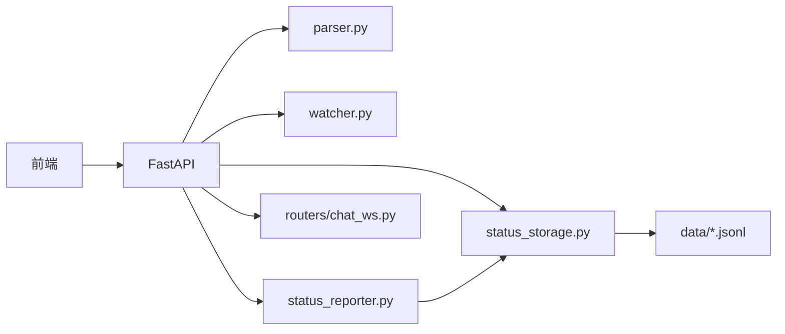

# 功能开发指南

<cite>
**本文档引用的文件**
- [backend/main.py](file://backend/main.py)
- [backend/parser.py](file://backend/parser.py)
- [backend/status_reporter.py](file://backend/status_reporter.py)
- [backend/status_storage.py](file://backend/status_storage.py)
- [backend/watcher.py](file://backend/watcher.py)
- [backend/routers/chat_ws.py](file://backend/routers/chat_ws.py)
- [frontend/src/lib/api.ts](file://frontend/src/lib/api.ts)
- [frontend/src/lib/ws.ts](file://frontend/src/lib/ws.ts)
- [frontend/src/lib/status-ws.ts](file://frontend/src/lib/status-ws.ts)
- [frontend/package.json](file://frontend/package.json)
- [tests/test_chat_delta.py](file://tests/test_chat_delta.py)
- [tests/test_chat_delta2.py](file://tests/test_chat_delta2.py)
- [run.sh](file://run.sh)
- [data/status_current.json](file://data/status_current.json)
- [data/status_history.jsonl](file://data/status_history.jsonl)
</cite>

## 目录
1. [简介](#简介)
2. [项目结构](#项目结构)
3. [核心组件](#核心组件)
4. [架构总览](#架构总览)
5. [详细组件分析](#详细组件分析)
6. [依赖分析](#依赖分析)
7. [性能考量](#性能考量)
8. [故障排查指南](#故障排查指南)
9. [结论](#结论)
10. [附录](#附录)

## 简介
本指南面向 SynapseOS 2.0 的功能开发与演进，覆盖后端 API 扩展、前端组件开发、WebSocket 事件处理、数据模型与状态管理、测试与文档、代码审查流程、版本兼容与迁移策略，以及模块化设计与插件化扩展思路。目标是帮助开发者在保持系统稳定性的同时，快速、安全地交付高质量功能。

## 项目结构
项目采用前后端分离架构：
- 后端基于 FastAPI，提供 REST API 与 WebSocket 服务，负责数据聚合、状态上报与持久化、文件变更监控与广播。
- 前端基于 Svelte，通过 REST 与 WebSocket 获取任务与状态数据，渲染视图并驱动交互。
- 数据层由 JSON/JSONL 文件与内存快照组成，支持历史记录与面板状态展示。
- 测试包含对聊天网关流式事件的专项验证脚本。

图表来源
- [backend/main.py:184-495](file://backend/main.py#L184-L495)
- [backend/routers/chat_ws.py:1-385](file://backend/routers/chat_ws.py#L1-L385)
- [backend/parser.py:440-509](file://backend/parser.py#L440-L509)
- [backend/watcher.py:1-52](file://backend/watcher.py#L1-L52)
- [backend/status_reporter.py:258-274](file://backend/status_reporter.py#L258-L274)
- [backend/status_storage.py:1-236](file://backend/status_storage.py#L1-L236)
- [frontend/src/lib/api.ts:1-181](file://frontend/src/lib/api.ts#L1-L181)
- [frontend/src/lib/ws.ts:1-84](file://frontend/src/lib/ws.ts#L1-L84)
- [frontend/src/lib/status-ws.ts:1-78](file://frontend/src/lib/status-ws.ts#L1-L78)
- [data/status_current.json:1-59](file://data/status_current.json#L1-L59)
- [data/status_history.jsonl:1-4](file://data/status_history.jsonl#L1-L4)

章节来源
- [backend/main.py:1-495](file://backend/main.py#L1-L495)
- [frontend/src/lib/api.ts:1-181](file://frontend/src/lib/api.ts#L1-L181)
- [frontend/src/lib/ws.ts:1-84](file://frontend/src/lib/ws.ts#L1-L84)
- [frontend/src/lib/status-ws.ts:1-78](file://frontend/src/lib/status-ws.ts#L1-L78)
- [backend/routers/chat_ws.py:1-385](file://backend/routers/chat_ws.py#L1-L385)
- [backend/parser.py:1-509](file://backend/parser.py#L1-L509)
- [backend/watcher.py:1-52](file://backend/watcher.py#L1-L52)
- [backend/status_reporter.py:1-274](file://backend/status_reporter.py#L1-L274)
- [backend/status_storage.py:1-236](file://backend/status_storage.py#L1-L236)
- [data/status_current.json:1-59](file://data/status_current.json#L1-L59)
- [data/status_history.jsonl:1-4](file://data/status_history.jsonl#L1-L4)

## 核心组件
- 后端应用与生命周期管理：注册中间件、CORS、路由、WebSocket 端点；启动文件监控与状态报告后台线程；提供静态资源托管。
- 数据解析与聚合：从 Markdown 任务与使命文件构建 Mission/Task/Blocker/Decision/TeamMember 结构，并输出统一数据视图。
- 状态上报与存储：接收前端状态报告，生成快照与历史记录，广播状态更新事件。
- 文件监控与广播：检测数据目录变化，去抖动后广播数据更新事件至 /ws。
- 聊天 WebSocket 网关桥接：连接 OpenClaw Gateway，转发消息，流式回传 delta 事件，维护会话与运行标识映射。
- 前端 API 与 WebSocket 客户端：封装 REST API 调用与 WebSocket 连接、心跳、重连与事件分发。

章节来源
- [backend/main.py:184-495](file://backend/main.py#L184-L495)
- [backend/parser.py:16-509](file://backend/parser.py#L16-L509)
- [backend/status_reporter.py:1-274](file://backend/status_reporter.py#L1-L274)
- [backend/status_storage.py:1-236](file://backend/status_storage.py#L1-L236)
- [backend/watcher.py:1-52](file://backend/watcher.py#L1-L52)
- [backend/routers/chat_ws.py:1-385](file://backend/routers/chat_ws.py#L1-L385)
- [frontend/src/lib/api.ts:1-181](file://frontend/src/lib/api.ts#L1-L181)
- [frontend/src/lib/ws.ts:1-84](file://frontend/src/lib/ws.ts#L1-L84)
- [frontend/src/lib/status-ws.ts:1-78](file://frontend/src/lib/status-ws.ts#L1-L78)

## 架构总览
后端采用异步事件循环与后台线程协同：
- FastAPI 异步处理 WebSocket 与 REST；
- 文件监控器使用异步迭代器监听文件变更；
- 状态报告器以固定周期扫描任务文件，生成快照并触发广播；
- 前端通过两条 WebSocket 频道订阅数据与状态更新。

图表来源
- [backend/main.py:119-182](file://backend/main.py#L119-L182)
- [backend/watcher.py:21-35](file://backend/watcher.py#L21-L35)
- [backend/status_reporter.py:258-274](file://backend/status_reporter.py#L258-L274)
- [backend/status_storage.py:32-136](file://backend/status_storage.py#L32-L136)
- [backend/routers/chat_ws.py:206-385](file://backend/routers/chat_ws.py#L206-L385)
- [frontend/src/lib/ws.ts:1-84](file://frontend/src/lib/ws.ts#L1-L84)
- [frontend/src/lib/status-ws.ts:1-78](file://frontend/src/lib/status-ws.ts#L1-L78)

## 详细组件分析

### 后端应用与路由
- 生命周期：启动时初始化 DataWatcher、立即执行一次状态报告、启动后台线程每 60 秒扫描任务文件；关闭时清理线程与监控任务。
- REST API：
  - 任务与使命：/api/mission、/api/tasks、/api/blockers、/api/decisions、/api/team。
  - 决策更新：/api/patch/decisions/{decision_id}，解析任务文件并写入“果爸决策”区块。
  - 状态 API：/api/status/report、/api/status/panel、/api/status/history、/api/status/{agent_id}、/api/status/difficulty。
- WebSocket：
  - /ws：发送初始数据，心跳 ping/pong，去抖动广播 data_updated。
  - /ws/status：发送状态面板，按事件类型广播 status_updated、difficulty_reported、decision_requested。

图表来源
- [backend/main.py:119-182](file://backend/main.py#L119-L182)
- [backend/status_reporter.py:105-117](file://backend/status_reporter.py#L105-L117)

章节来源
- [backend/main.py:184-495](file://backend/main.py#L184-L495)

### 数据解析与聚合（parser.py）
- 数据类：Mission、Task、Blocker、Decision、TeamMember，用于承载解析后的结构化数据。
- 解析流程：
  - 使命：解析基本信息、目标、团队概览、里程碑。
  - 任务：提取标题、状态、优先级、执行者、决策状态、来源类型、创建者；派生阻塞器与决策。
  - 团队：合并使命与任务中的成员信息，统计当前任务。
- 输出：统一的 mission、tasks、blockers、decisions、team 字典。

图表来源
- [backend/parser.py:16-92](file://backend/parser.py#L16-L92)

章节来源
- [backend/parser.py:1-509](file://backend/parser.py#L1-L509)

### 状态上报与存储（status_reporter.py、status_storage.py）
- 状态报告器：
  - 扫描任务文件，提取执行者、状态、难度、待决策等字段，生成 agents 报告。
  - 将报告写入 status_current.json 快照，供面板展示。
- 状态存储：
  - 生成并校验状态报告结构，更新快照，追加历史记录。
  - 提供面板查询与历史分页查询，支持多维过滤。
  - 提供演示数据种子，确保首次启动有可用数据。

图表来源
- [backend/main.py:317-347](file://backend/main.py#L317-L347)
- [backend/status_reporter.py:258-274](file://backend/status_reporter.py#L258-L274)
- [backend/status_storage.py:32-136](file://backend/status_storage.py#L32-L136)

章节来源
- [backend/status_reporter.py:1-274](file://backend/status_reporter.py#L1-L274)
- [backend/status_storage.py:1-236](file://backend/status_storage.py#L1-L236)
- [data/status_current.json:1-59](file://data/status_current.json#L1-L59)
- [data/status_history.jsonl:1-4](file://data/status_history.jsonl#L1-L4)

### 文件监控与广播（watcher.py、main.py）
- DataWatcher 使用异步文件监控库，检测目录变更后触发回调。
- 主应用在回调中取消之前的广播任务，创建新的去抖动任务，避免频繁广播；去抖动窗口默认 300ms。

图表来源
- [backend/watcher.py:21-35](file://backend/watcher.py#L21-L35)
- [backend/main.py:61-94](file://backend/main.py#L61-L94)

章节来源
- [backend/watcher.py:1-52](file://backend/watcher.py#L1-L52)
- [backend/main.py:1-182](file://backend/main.py#L1-L182)

### 聊天 WebSocket 网关桥接（routers/chat_ws.py）
- 连接 OpenClaw Gateway，鉴权后建立双向事件通道。
- 维护 per-agent 会话键映射，根据 runId 将事件路由到对应代理。
- 支持切换代理、读取历史、流式 delta 推送、思考过程与生命周期事件。

图表来源
- [backend/routers/chat_ws.py:206-385](file://backend/routers/chat_ws.py#L206-L385)
- [tests/test_chat_delta.py:1-280](file://tests/test_chat_delta.py#L1-L280)
- [tests/test_chat_delta2.py:1-281](file://tests/test_chat_delta2.py#L1-L281)

章节来源
- [backend/routers/chat_ws.py:1-385](file://backend/routers/chat_ws.py#L1-L385)
- [tests/test_chat_delta.py:1-280](file://tests/test_chat_delta.py#L1-L280)
- [tests/test_chat_delta2.py:1-281](file://tests/test_chat_delta2.py#L1-L281)

### 前端 API 与 WebSocket 客户端
- API 层：定义数据模型与 REST 方法，封装 fetch 请求。
- WebSocket 客户端：
  - ws.ts：通用频道，订阅 data_updated 与心跳，自动重连。
  - status-ws.ts：状态频道，订阅面板与事件，自动重连。
- 前端包配置：Svelte 生态与构建工具链。

图表来源
- [frontend/src/lib/api.ts:75-181](file://frontend/src/lib/api.ts#L75-L181)
- [frontend/src/lib/ws.ts:1-84](file://frontend/src/lib/ws.ts#L1-L84)
- [frontend/src/lib/status-ws.ts:1-78](file://frontend/src/lib/status-ws.ts#L1-L78)
- [frontend/package.json:1-24](file://frontend/package.json#L1-L24)

章节来源
- [frontend/src/lib/api.ts:1-181](file://frontend/src/lib/api.ts#L1-L181)
- [frontend/src/lib/ws.ts:1-84](file://frontend/src/lib/ws.ts#L1-L84)
- [frontend/src/lib/status-ws.ts:1-78](file://frontend/src/lib/status-ws.ts#L1-L78)
- [frontend/package.json:1-24](file://frontend/package.json#L1-L24)

## 依赖分析
- 后端依赖：FastAPI、websockets、watchfiles、frontmatter、uvicorn（生产运行）。
- 前端依赖：Svelte、svelte-routing、TailwindCSS、Vite。
- 数据依赖：本地 JSON/JSONL 文件，无需数据库。

图表来源
- [backend/main.py:1-495](file://backend/main.py#L1-L495)
- [backend/parser.py:1-509](file://backend/parser.py#L1-L509)
- [backend/watcher.py:1-52](file://backend/watcher.py#L1-L52)
- [backend/status_reporter.py:1-274](file://backend/status_reporter.py#L1-L274)
- [backend/status_storage.py:1-236](file://backend/status_storage.py#L1-L236)
- [backend/routers/chat_ws.py:1-385](file://backend/routers/chat_ws.py#L1-L385)
- [data/status_current.json:1-59](file://data/status_current.json#L1-L59)
- [data/status_history.jsonl:1-4](file://data/status_history.jsonl#L1-L4)

章节来源
- [backend/main.py:1-495](file://backend/main.py#L1-L495)
- [frontend/package.json:1-24](file://frontend/package.json#L1-L24)

## 性能考量
- 去抖动广播：/ws 对数据更新采用 300ms 去抖动，降低广播频率与前端重绘压力。
- 异步 I/O：文件监控与 WebSocket 事件均使用异步处理，避免阻塞。
- 状态快照：仅在后台线程扫描并写入快照，避免每次请求重复解析任务文件。
- 历史查询：JSONL 文本行顺序即时间倒序，分页时仅读取必要范围，限制每页最大条数。
- 前端重连：指数退避重连，上限 10s，减少网络波动下的资源消耗。

[本节为通用指导，无需特定文件分析]

## 故障排查指南
- 启动与日志
  - 使用一键脚本启动后端与前端，查看日志文件定位问题。
  - 检查后端依赖安装与端口占用情况。
- WebSocket 连接
  - /ws 与 /ws/status 需要正确握手与心跳；若断开，检查代理与网络代理配置。
  - 前端自动重连，观察控制台日志确认重连次数与延迟。
- 状态面板
  - 若面板为空，检查 status_current.json 是否生成；确认状态报告器后台线程是否运行。
  - 历史查询参数与时间范围需符合 ISO 时间格式。
- 聊天桥接
  - 确认 OpenClaw Gateway 地址与 Token 正确；参考测试脚本验证 delta 事件是否可达。
  - 注意 runId 映射，避免跨会话事件交叉污染。

章节来源
- [run.sh:1-192](file://run.sh#L1-L192)
- [frontend/src/lib/ws.ts:1-84](file://frontend/src/lib/ws.ts#L1-L84)
- [frontend/src/lib/status-ws.ts:1-78](file://frontend/src/lib/status-ws.ts#L1-L78)
- [backend/main.py:396-495](file://backend/main.py#L396-L495)
- [backend/status_reporter.py:258-274](file://backend/status_reporter.py#L258-L274)
- [tests/test_chat_delta.py:1-280](file://tests/test_chat_delta.py#L1-L280)
- [tests/test_chat_delta2.py:1-281](file://tests/test_chat_delta2.py#L1-L281)

## 结论
SynapseOS 2.0 通过清晰的模块划分与事件驱动架构，实现了数据与状态的实时同步。遵循本文档的功能开发流程与最佳实践，可在保证向后兼容的前提下，安全扩展新功能、优化性能并提升可维护性。

[本节为总结，无需特定文件分析]

## 附录

### 新功能开发流程（建议）
- 需求与设计
  - 明确数据模型扩展点与 API 边界；评估对 parser、status_reporter、status_storage 的影响。
  - 设计前端视图与交互，确定 WebSocket 事件类型与数据结构。
- 后端实现
  - 在 main.py 中新增路由或扩展现有端点；在 parser.py 中完善数据解析逻辑；在 status_storage.py 中扩展快照/历史结构。
  - 使用 DataWatcher 触发去抖动广播，或在合适时机主动广播。
- 前端实现
  - 在 api.ts 中补充数据模型与 API 方法；在 ws.ts 或 status-ws.ts 中处理事件；在 Svelte 组件中消费数据。
- 测试与验证
  - 编写单元与集成测试，覆盖 API 与 WebSocket 事件；使用测试脚本验证聊天网关流式事件。
- 文档与评审
  - 更新 README 与内部文档；走代码审查流程，关注兼容性与性能。
- 部署与回滚
  - 使用一键脚本验证部署；准备回滚策略与数据备份。

[本节为流程建议，无需特定文件分析]

### 版本兼容与迁移策略
- 向后兼容
  - 保持现有 API 响应字段稳定；新增字段时保留默认值；对可选字段提供兼容解析。
- 数据迁移
  - 对历史数据采用一次性迁移脚本；在 status_storage.py 中提供迁移函数入口。
- WebSocket 协议
  - 新增事件类型时，保持 payload 结构向后兼容；客户端侧做好未知事件忽略。
- 前端兼容
  - 新增组件时提供可选依赖；在 api.ts 中为新字段提供默认值。

[本节为通用指导，无需特定文件分析]

### 插件化与第三方集成
- 插件化设计
  - 将可替换的解析器、报告器抽象为接口；通过配置或环境变量选择实现。
- 第三方集成
  - 聊天网关采用独立路由与连接池；对外部服务变更保持隔离。
- 安全与鉴权
  - 对外部服务请求增加超时与限流；对敏感配置使用环境变量注入。

[本节为通用指导，无需特定文件分析]