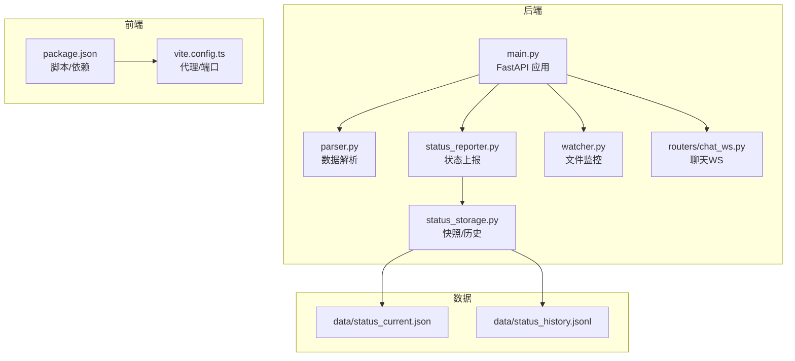
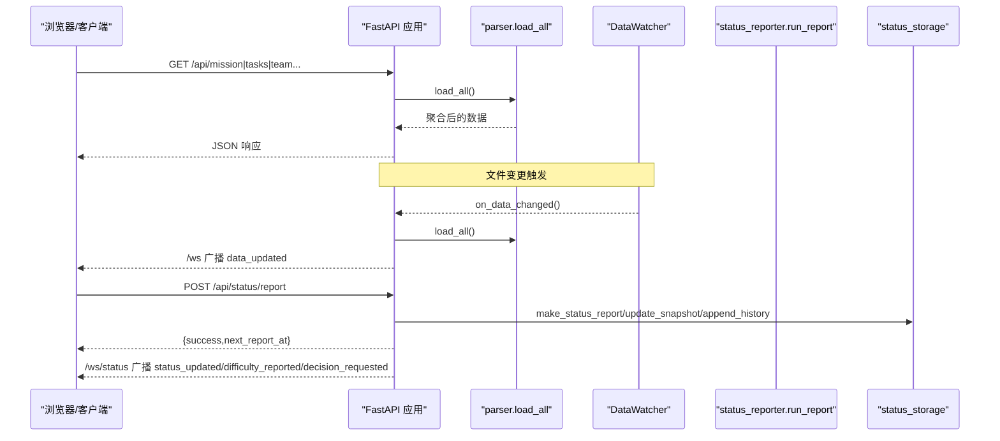
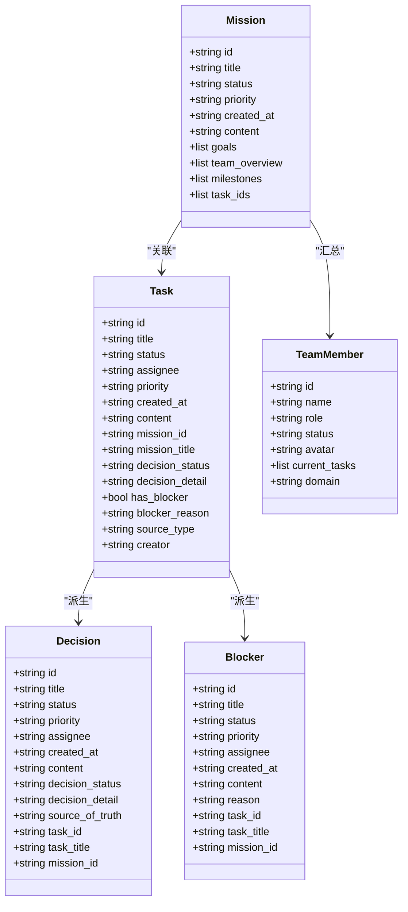
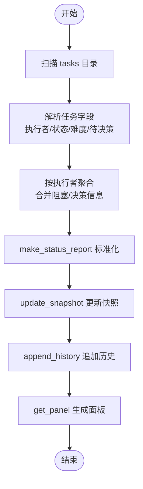
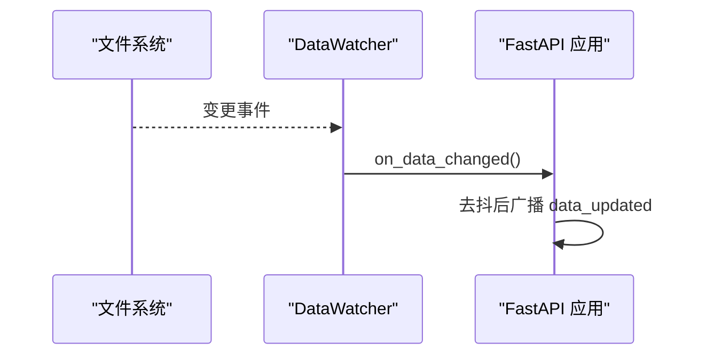
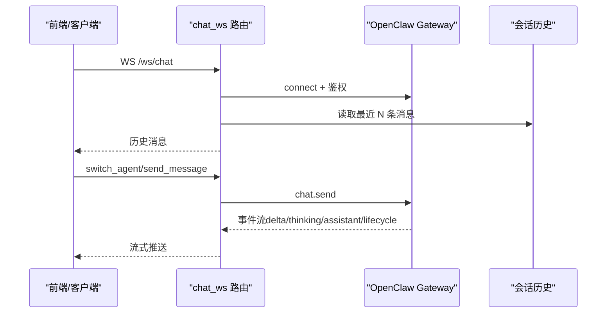
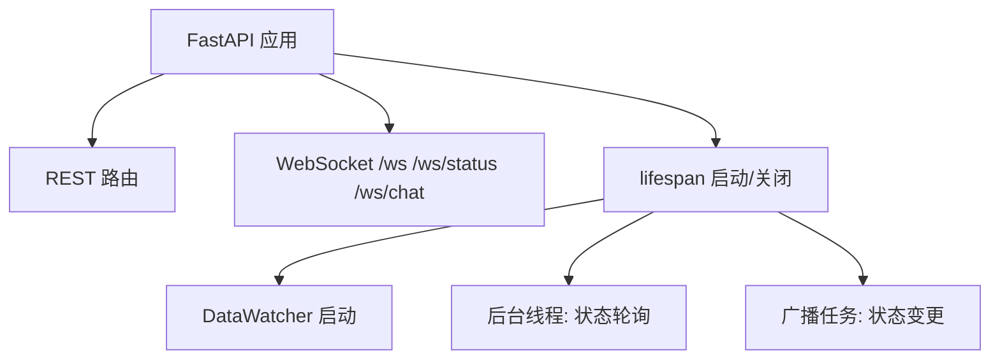
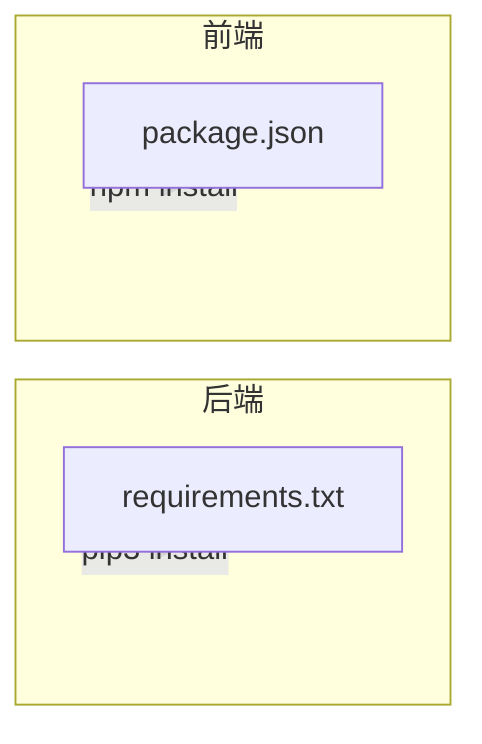

# 开发指南

<cite>
**本文引用的文件**   
- [backend/main.py](file://backend/main.py)
- [backend/parser.py](file://backend/parser.py)
- [backend/status_reporter.py](file://backend/status_reporter.py)
- [backend/status_storage.py](file://backend/status_storage.py)
- [backend/watcher.py](file://backend/watcher.py)
- [backend/routers/chat_ws.py](file://backend/routers/chat_ws.py)
- [backend/requirements.txt](file://backend/requirements.txt)
- [frontend/package.json](file://frontend/package.json)
- [frontend/vite.config.ts](file://frontend/vite.config.ts)
- [run.sh](file://run.sh)
- [tests/test_chat_delta.py](file://tests/test_chat_delta.py)
- [tests/test_chat_delta2.py](file://tests/test_chat_delta2.py)
- [data/status_current.json](file://data/status_current.json)
- [data/status_history.jsonl](file://data/status_history.jsonl)
</cite>

## 目录
1. [简介](#简介)
2. [项目结构](#项目结构)
3. [核心组件](#核心组件)
4. [架构总览](#架构总览)
5. [详细组件分析](#详细组件分析)
6. [依赖分析](#依赖分析)
7. [性能考虑](#性能考虑)
8. [故障排查指南](#故障排查指南)
9. [结论](#结论)
10. [附录](#附录)

## 简介
SynapseOS 2.0 是一个前后端分离的实时协作与状态可视化平台，后端基于 FastAPI + Uvicorn 提供 REST API 与 WebSocket，前端使用 Svelte + Vite 构建。系统通过解析 Markdown 数据目录中的“使命/任务/决策”等信息，构建统一的数据视图，并通过 WebSocket 实时广播；同时内置状态上报与历史记录能力，支持按代理人的实时面板展示。

## 项目结构
- backend：后端服务与数据处理
  - main.py：应用入口、路由注册、WebSocket、静态资源挂载
  - parser.py：Markdown 数据解析器，构建 Mission/Task/Blocker/Decision/TeamMember 等模型
  - status_reporter.py：扫描任务文件，生成状态快照并写入 data 目录
  - status_storage.py：状态快照与历史记录的持久化与查询
  - watcher.py：文件变更监控，触发数据更新广播
  - routers/chat_ws.py：工作台聊天 WebSocket，桥接到 OpenClaw Gateway
  - requirements.txt：Python 依赖清单
- frontend：前端工程
  - package.json：构建脚本与依赖
  - vite.config.ts：开发服务器与代理配置
  - src/views、src/lib 等：Svelte 组件与工具库
- data：运行时数据
  - status_current.json：当前状态快照
  - status_history.jsonl：历史记录（JSON Lines）
- tests：聊天流式推送测试脚本
- run.sh：一键启动/停止脚本

**图表来源**
- [backend/main.py:184-495](file://backend/main.py#L184-L495)
- [backend/parser.py:440-509](file://backend/parser.py#L440-L509)
- [backend/status_reporter.py:258-267](file://backend/status_reporter.py#L258-L267)
- [backend/status_storage.py:62-193](file://backend/status_storage.py#L62-L193)
- [backend/watcher.py:8-52](file://backend/watcher.py#L8-L52)
- [backend/routers/chat_ws.py:174-349](file://backend/routers/chat_ws.py#L174-L349)
- [frontend/package.json:1-24](file://frontend/package.json#L1-L24)
- [frontend/vite.config.ts:1-23](file://frontend/vite.config.ts#L1-L23)
- [data/status_current.json:1-59](file://data/status_current.json#L1-L59)
- [data/status_history.jsonl:1-4](file://data/status_history.jsonl#L1-L4)

**章节来源**
- [backend/main.py:184-495](file://backend/main.py#L184-L495)
- [frontend/package.json:1-24](file://frontend/package.json#L1-L24)
- [frontend/vite.config.ts:1-23](file://frontend/vite.config.ts#L1-L23)
- [run.sh:120-192](file://run.sh#L120-L192)

## 核心组件
- 应用生命周期与路由
  - 使用 lifespan 管理后台线程与异步任务，启动文件监控、首次状态报告、后台状态轮询与广播循环
  - 注册聊天 WebSocket 路由，提供 /ws、/ws/status、/ws/chat 等通道
- 数据解析与聚合
  - 解析 missions 与 tasks，构建 Mission、Task、Blocker、Decision、TeamMember 结构
  - 从任务中抽取决策状态、来源类型、创建者等字段，派生阻塞项与决策项
- 状态上报与存储
  - 定时扫描任务文件，生成状态快照并写入 data/status_current.json
  - 提供快照加载、面板组装（含过期检测）、历史追加与分页查询
- 文件变更监控
  - 异步监控数据目录，去抖后批量广播 data_updated 事件
- 聊天 WebSocket
  - 连接 OpenClaw Gateway，转发消息，流式回推 delta/assistant/lifecycle 等事件
  - 支持会话切换与历史消息加载

**章节来源**
- [backend/main.py:120-182](file://backend/main.py#L120-L182)
- [backend/parser.py:16-509](file://backend/parser.py#L16-L509)
- [backend/status_reporter.py:189-267](file://backend/status_reporter.py#L189-L267)
- [backend/status_storage.py:62-193](file://backend/status_storage.py#L62-L193)
- [backend/watcher.py:8-52](file://backend/watcher.py#L8-L52)
- [backend/routers/chat_ws.py:174-349](file://backend/routers/chat_ws.py#L174-L349)

## 架构总览
后端采用 FastAPI + Uvicorn，结合多线程与 asyncio 并行处理：
- 生命周期阶段：启动文件监控、执行初始状态报告、启动后台线程与广播任务
- 数据层：parser 负责解析 Markdown，status_reporter 负责生成快照，status_storage 负责持久化
- 通信层：REST API 提供数据查询，WebSocket 提供实时广播与聊天桥接

**图表来源**
- [backend/main.py:120-182](file://backend/main.py#L120-L182)
- [backend/parser.py:440-509](file://backend/parser.py#L440-L509)
- [backend/status_reporter.py:258-267](file://backend/status_reporter.py#L258-L267)
- [backend/status_storage.py:33-193](file://backend/status_storage.py#L33-L193)

## 详细组件分析

### 数据解析器（parser.py）
- 数据类：Mission、Task、Blocker、Decision、TeamMember，用于结构化存储
- 解析逻辑：
  - 任务解析：从 frontmatter 与正文抽取状态、优先级、执行者、决策状态、来源类型、创建者等
  - 决策与阻塞：根据决策状态派生 Decision 与 Blocker
  - 团队：从使命与任务中汇总成员及其当前任务
- 性能与复杂度：
  - 任务扫描与解析为 O(N)（N 为任务数量），字符串匹配与正则为线性
  - 表格解析与字段抽取为 O(L)（L 为内容长度）

**图表来源**
- [backend/parser.py:16-92](file://backend/parser.py#L16-L92)

**章节来源**
- [backend/parser.py:16-509](file://backend/parser.py#L16-L509)

### 状态上报与存储（status_reporter.py、status_storage.py）
- 上报流程：
  - 扫描 tasks 目录，解析每个任务的执行者、状态、难度、待决策等字段
  - 将执行者映射为 agent_id，合并多个任务的阻塞/决策信息
  - 写入 data/status_current.json，生成快照
- 存储与查询：
  - make_status_report：标准化报告结构，自动识别类型（report/difficulty/decision）
  - update_snapshot：更新快照并计算下次上报时间
  - get_panel：加载快照并标注过期状态
  - append_history：追加历史记录（JSON Lines）
  - get_history：按条件过滤与分页查询

**图表来源**
- [backend/status_reporter.py:189-267](file://backend/status_reporter.py#L189-L267)
- [backend/status_storage.py:33-193](file://backend/status_storage.py#L33-L193)

**章节来源**
- [backend/status_reporter.py:189-267](file://backend/status_reporter.py#L189-L267)
- [backend/status_storage.py:33-193](file://backend/status_storage.py#L33-L193)
- [data/status_current.json:1-59](file://data/status_current.json#L1-L59)
- [data/status_history.jsonl:1-4](file://data/status_history.jsonl#L1-L4)

### 文件变更监控（watcher.py）
- 功能：监控数据目录，检测变更后去抖并触发回调
- 关键点：回调在事件循环中异步通知，避免阻塞

**图表来源**
- [backend/watcher.py:21-35](file://backend/watcher.py#L21-L35)
- [backend/main.py:61-94](file://backend/main.py#L61-L94)

**章节来源**
- [backend/watcher.py:8-52](file://backend/watcher.py#L8-L52)
- [backend/main.py:61-94](file://backend/main.py#L61-L94)

### 聊天 WebSocket（routers/chat_ws.py）
- 连接 OpenClaw Gateway，鉴权后建立会话
- 支持：
  - 加载历史消息（从本地会话文件）
  - 切换代理（agent）并加载对应历史
  - 流式推送：delta、thinking、lifecycle、assistant 等事件
  - 错误处理与连接恢复

**图表来源**
- [backend/routers/chat_ws.py:174-349](file://backend/routers/chat_ws.py#L174-L349)

**章节来源**
- [backend/routers/chat_ws.py:174-349](file://backend/routers/chat_ws.py#L174-L349)

### 主应用（backend/main.py）
- 生命周期：启动文件监控、执行初始状态报告、启动后台线程与广播任务
- REST API：/api/mission、/api/tasks、/api/blockers、/api/decisions、/api/team、/api/registry
- 状态 API：/api/status/report、/api/status/panel、/api/status/history、/api/status/{agent_id}、/api/status/difficulty
- WebSocket：/ws（数据更新）、/ws/status（状态更新）、/ws/chat（聊天桥接）

**图表来源**
- [backend/main.py:184-495](file://backend/main.py#L184-L495)

**章节来源**
- [backend/main.py:184-495](file://backend/main.py#L184-L495)

## 依赖分析
- Python 依赖：FastAPI、Uvicorn、watchfiles、python-frontmatter、websockets
- 前端依赖：Vite、Svelte、TailwindCSS、autoprefixer、postcss
- 运行时：通过 run.sh 安装依赖并分别启动后端与前端，日志输出至 logs 目录

**图表来源**
- [backend/requirements.txt:1-6](file://backend/requirements.txt#L1-L6)
- [frontend/package.json:1-24](file://frontend/package.json#L1-L24)

**章节来源**
- [backend/requirements.txt:1-6](file://backend/requirements.txt#L1-L6)
- [frontend/package.json:1-24](file://frontend/package.json#L1-L24)
- [run.sh:58-117](file://run.sh#L58-L117)

## 性能考虑
- 去抖机制：对数据变更广播设置去抖时间，减少频繁广播带来的网络与 CPU 压力
- 异步与并发：文件监控与状态轮询使用 asyncio 与多线程，避免阻塞事件循环
- I/O 优化：状态快照与历史记录采用 JSON/JSON Lines，写入前确保目录存在，避免重复 IO
- 前端代理：Vite 代理将 /api 与 /ws 转发至后端，降低跨域与反向代理复杂度

**章节来源**
- [backend/main.py:31-36](file://backend/main.py#L31-L36)
- [backend/main.py:86-94](file://backend/main.py#L86-L94)
- [backend/status_storage.py:20-22](file://backend/status_storage.py#L20-L22)
- [frontend/vite.config.ts:11-22](file://frontend/vite.config.ts#L11-L22)

## 故障排查指南
- 启停与日志
  - 使用 run.sh start/stop/restart/logs/status 查看进程与日志
  - 后端日志：logs/synapse_backend.log；前端日志：logs/synapse_frontend.log
- WebSocket 连接
  - /ws：心跳与 ping/pong；/ws/status：状态面板；/ws/chat：聊天桥接
  - 若连接异常，检查后端生命周期与广播任务是否正常
- 状态上报
  - 确认 data/status_current.json 是否更新；检查 status_reporter 的扫描路径与权限
  - 历史记录位于 data/status_history.jsonl，逐条校验 JSON 格式
- 聊天流式推送
  - 使用 tests/test_chat_delta.py 与 tests/test_chat_delta2.py 验证 delta 事件是否正确推送
  - 关注 runId 一致性与事件类型（chat/agent/session.message）

**章节来源**
- [run.sh:120-192](file://run.sh#L120-L192)
- [backend/main.py:396-477](file://backend/main.py#L396-L477)
- [backend/status_reporter.py:258-267](file://backend/status_reporter.py#L258-L267)
- [data/status_current.json:1-59](file://data/status_current.json#L1-L59)
- [data/status_history.jsonl:1-4](file://data/status_history.jsonl#L1-L4)
- [tests/test_chat_delta.py:1-280](file://tests/test_chat_delta.py#L1-L280)
- [tests/test_chat_delta2.py:1-281](file://tests/test_chat_delta2.py#L1-L281)

## 结论
SynapseOS 2.0 通过清晰的模块划分与异步架构实现了高效的数据解析、状态上报与实时通信。建议在开发新功能时遵循现有模块边界与数据模型，保持解析规则一致，并在测试阶段利用 run.sh 与测试脚本验证端到端行为。

## 附录

### 开发环境设置
- 安装依赖
  - Python：pip3 安装 requirements.txt
  - Node.js：npm 安装 frontend 依赖
- 启动
  - ./run.sh start：启动后端与前端，查看日志与访问地址
  - ./run.sh stop/restart/logs/status：管理进程与查看状态
- 停止
  - ./run.sh stop：优雅关闭前后端进程

**章节来源**
- [backend/requirements.txt:1-6](file://backend/requirements.txt#L1-L6)
- [frontend/package.json:1-24](file://frontend/package.json#L1-L24)
- [run.sh:58-117](file://run.sh#L58-L117)
- [run.sh:120-192](file://run.sh#L120-L192)

### 代码规范与测试策略
- 代码规范
  - 后端：遵循 FastAPI 与 Python 通用风格，使用类型提示与数据类
  - 前端：Svelte 单文件组件，Vite 构建，TailwindCSS 样式
- 测试策略
  - 单元测试：可扩展 parser 与 status_storage 的解析与存储逻辑
  - 集成测试：使用 run.sh 启动后端，结合 tests/test_chat_delta.py 验证聊天流式推送
  - 端到端：通过浏览器访问前端页面，验证 WebSocket 广播与状态面板

**章节来源**
- [backend/parser.py:16-509](file://backend/parser.py#L16-L509)
- [backend/status_storage.py:33-193](file://backend/status_storage.py#L33-L193)
- [tests/test_chat_delta.py:1-280](file://tests/test_chat_delta.py#L1-L280)
- [tests/test_chat_delta2.py:1-281](file://tests/test_chat_delta2.py#L1-L281)

### 新功能开发指南
- 新增 REST API
  - 在 backend/main.py 中添加路由与处理函数，注意错误处理与返回结构
  - 如需实时广播，参考 /ws 与 /ws/status 的广播模式
- 新增数据模型
  - 在 parser.py 中定义数据类并在 load_all 中聚合
  - 在 status_storage 中扩展快照与历史处理逻辑
- 新增 WebSocket 功能
  - 在 routers/chat_ws.py 或新增路由中实现，注意事件类型与流式推送
- 插件开发规范
  - 通过文件监控与解析扩展数据源（如新增目录或字段）
  - 保持与既有数据模型兼容，避免破坏现有广播与存储

**章节来源**
- [backend/main.py:184-495](file://backend/main.py#L184-L495)
- [backend/parser.py:440-509](file://backend/parser.py#L440-L509)
- [backend/status_storage.py:62-193](file://backend/status_storage.py#L62-L193)
- [backend/routers/chat_ws.py:174-349](file://backend/routers/chat_ws.py#L174-L349)

### 版本控制、分支管理与发布
- 版本控制
  - 使用 Git 管理代码，建议采用主干保护与提交信息规范
- 分支管理
  - develop：日常开发；release：发布候选；main：稳定版本
- 发布流程
  - run.sh 提供一键启动与日志查看，可用于本地预检
  - 建议在 CI 中复用 run.sh 与测试脚本，确保端到端可用

**章节来源**
- [run.sh:120-192](file://run.sh#L120-L192)