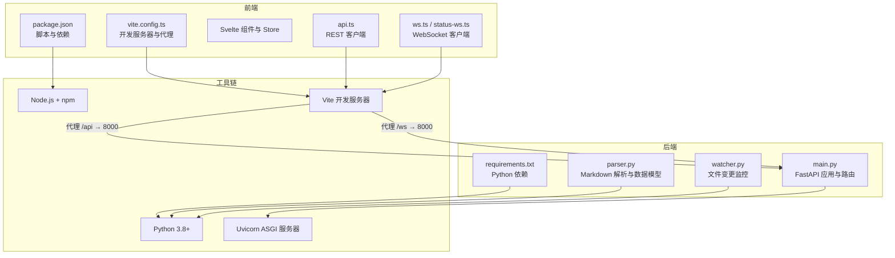
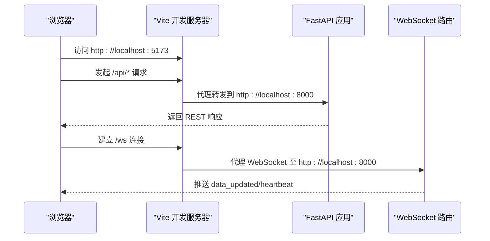
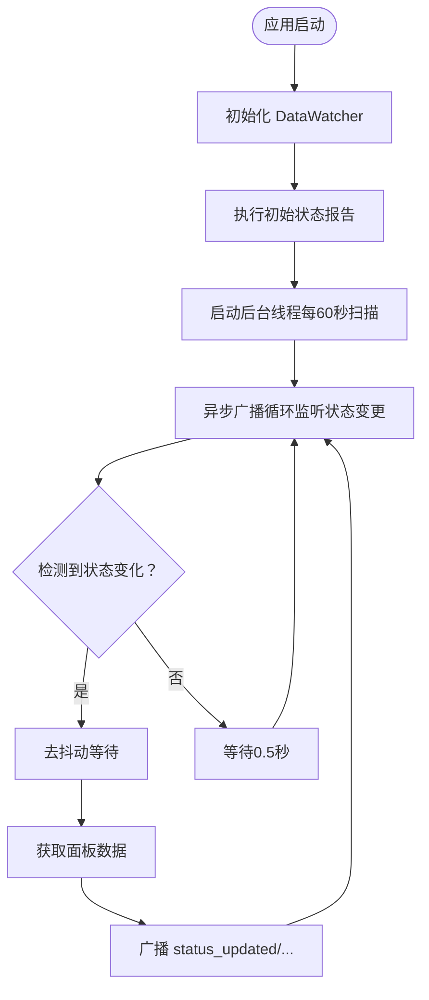
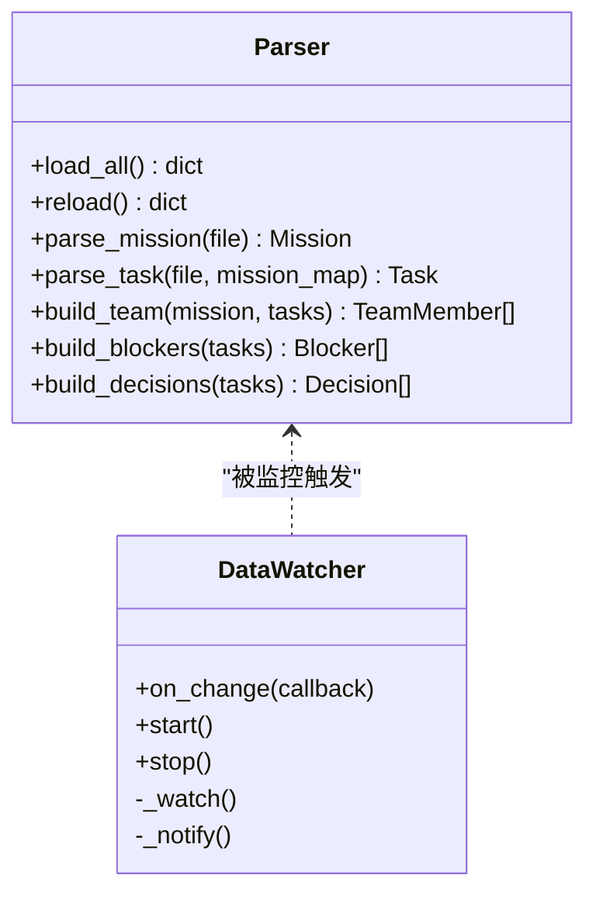
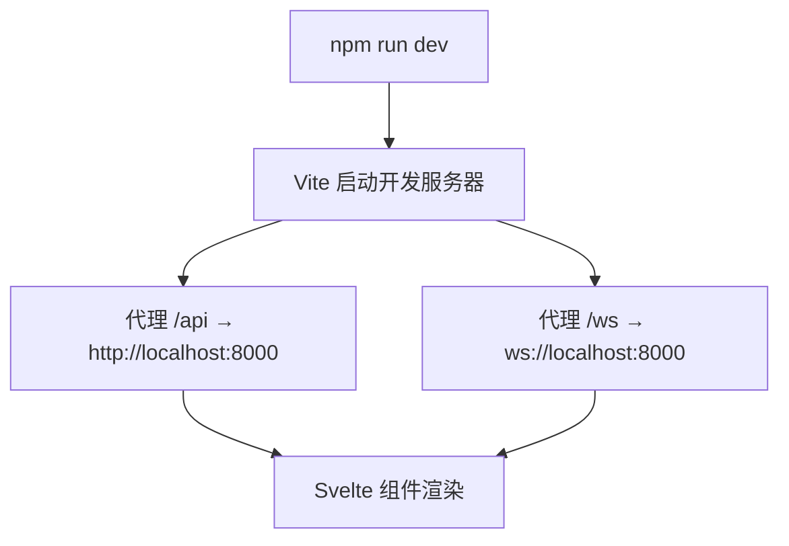
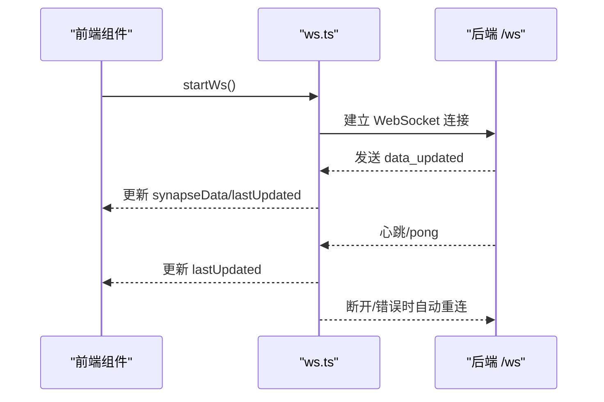
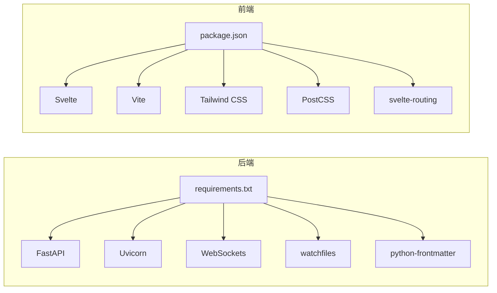

# 开发环境设置

<cite>
**本文引用的文件**
- [run.sh](file://run.sh)
- [backend/requirements.txt](file://backend/requirements.txt)
- [backend/main.py](file://backend/main.py)
- [backend/parser.py](file://backend/parser.py)
- [backend/watcher.py](file://backend/watcher.py)
- [frontend/package.json](file://frontend/package.json)
- [frontend/vite.config.ts](file://frontend/vite.config.ts)
- [frontend/tailwind.config.js](file://frontend/tailwind.config.js)
- [frontend/postcss.config.js](file://frontend/postcss.config.js)
- [frontend/tsconfig.json](file://frontend/tsconfig.json)
- [frontend/src/lib/ws.ts](file://frontend/src/lib/ws.ts)
- [frontend/src/lib/status-ws.ts](file://frontend/src/lib/status-ws.ts)
- [frontend/src/lib/api.ts](file://frontend/src/lib/api.ts)
</cite>

## 目录
1. [简介](#简介)
2. [项目结构](#项目结构)
3. [核心组件](#核心组件)
4. [架构概览](#架构概览)
5. [详细组件分析](#详细组件分析)
6. [依赖分析](#依赖分析)
7. [性能考虑](#性能考虑)
8. [故障排除指南](#故障排除指南)
9. [结论](#结论)
10. [附录](#附录)

## 简介
本指南面向 SynapseOS 2.0 的开发者，提供从零开始的开发环境搭建与运行说明。内容覆盖：
- Python 3.8+ 环境配置与虚拟环境建议
- Node.js 与包管理器准备
- 后端依赖安装（FastAPI、Uvicorn、WebSockets、文件监控）
- 前端依赖安装（Svelte、Vite、Tailwind CSS）
- 环境变量配置与 IDE 设置建议
- 开发服务器启动、热重载与调试
- 常见问题排查（权限、端口冲突、版本兼容）

## 项目结构
项目采用前后端分离架构：
- 后端使用 FastAPI 提供 REST API 与 WebSocket，静态资源由前端构建产物提供
- 前端基于 Svelte + Vite，通过代理将 /api 与 /ws 请求转发至后端
- 数据解析与文件监控在后端完成，前端通过 WebSocket 实时接收数据更新

图表来源
- [frontend/package.json:1-24](file://frontend/package.json#L1-L24)
- [frontend/vite.config.ts:1-23](file://frontend/vite.config.ts#L1-L23)
- [backend/requirements.txt:1-6](file://backend/requirements.txt#L1-L6)
- [backend/main.py:185-495](file://backend/main.py#L185-L495)
- [backend/parser.py:1-509](file://backend/parser.py#L1-L509)
- [backend/watcher.py:1-52](file://backend/watcher.py#L1-L52)

章节来源
- [run.sh:1-192](file://run.sh#L1-L192)
- [frontend/package.json:1-24](file://frontend/package.json#L1-L24)
- [frontend/vite.config.ts:1-23](file://frontend/vite.config.ts#L1-L23)
- [backend/requirements.txt:1-6](file://backend/requirements.txt#L1-L6)
- [backend/main.py:1-495](file://backend/main.py#L1-L495)
- [backend/parser.py:1-509](file://backend/parser.py#L1-L509)
- [backend/watcher.py:1-52](file://backend/watcher.py#L1-L52)

## 核心组件
- 后端应用与路由
  - 使用 FastAPI 构建 REST API 与 WebSocket 端点，启用 CORS 并挂载前端静态资源
  - 生命周期管理：启动时初始化文件监控与状态报告线程，关闭时清理资源
- 数据解析与存储
  - 读取指定目录下的 Markdown 文件，解析为统一的数据模型并生成面板、历史与快照
- 文件监控
  - 异步监控数据目录变更，触发去抖动广播
- 前端开发与代理
  - Vite 提供开发服务器，默认端口 5173；通过代理将 /api 与 /ws 转发至后端 8000 端口
  - Tailwind CSS 与 PostCSS 配置支持主题色与字体

章节来源
- [backend/main.py:185-495](file://backend/main.py#L185-L495)
- [backend/parser.py:441-509](file://backend/parser.py#L441-L509)
- [backend/watcher.py:8-52](file://backend/watcher.py#L8-L52)
- [frontend/vite.config.ts:1-23](file://frontend/vite.config.ts#L1-L23)
- [frontend/tailwind.config.js:1-40](file://frontend/tailwind.config.js#L1-L40)
- [frontend/postcss.config.js:1-7](file://frontend/postcss.config.js#L1-L7)

## 架构概览
下图展示开发模式下的请求流转：浏览器通过 Vite 代理访问后端 API 与 WebSocket。

图表来源
- [frontend/vite.config.ts:11-22](file://frontend/vite.config.ts#L11-L22)
- [backend/main.py:397-477](file://backend/main.py#L397-L477)

章节来源
- [frontend/vite.config.ts:1-23](file://frontend/vite.config.ts#L1-L23)
- [backend/main.py:397-477](file://backend/main.py#L397-L477)

## 详细组件分析

### 后端：FastAPI 应用与生命周期
- 应用初始化
  - 注册 CORS 中间件，允许任意来源
  - 包含聊天 WebSocket 路由
  - 挂载前端静态资源（若存在）
- 生命周期管理
  - 启动：初始化文件监控器，立即执行一次状态报告，启动后台线程每 60 秒扫描任务文件并广播状态更新
  - 关闭：停止后台任务、取消广播任务、停止文件监控
- WebSocket
  - /ws：向所有客户端广播数据更新，带心跳与去抖动
  - /ws/status：向状态频道客户端推送面板与事件

图表来源
- [backend/main.py:120-182](file://backend/main.py#L120-L182)
- [backend/main.py:61-94](file://backend/main.py#L61-L94)
- [backend/main.py:442-477](file://backend/main.py#L442-L477)

章节来源
- [backend/main.py:185-495](file://backend/main.py#L185-L495)

### 数据解析与文件监控
- 解析器
  - 从指定目录读取任务与使命 Markdown，提取元数据与字段，构建统一数据结构
  - 生成阻塞项、决策与团队成员列表
- 文件监控
  - 使用异步文件监控库监听数据目录，回调触发去抖动广播

图表来源
- [backend/parser.py:441-509](file://backend/parser.py#L441-L509)
- [backend/watcher.py:8-52](file://backend/watcher.py#L8-L52)

章节来源
- [backend/parser.py:1-509](file://backend/parser.py#L1-L509)
- [backend/watcher.py:1-52](file://backend/watcher.py#L1-L52)

### 前端：Vite、Svelte 与 Tailwind CSS
- 依赖与脚本
  - 开发脚本默认端口 5173，构建与预览脚本
  - 开发依赖包含 Svelte、Vite、Tailwind CSS、PostCSS 及其插件
- 开发服务器与代理
  - 将 /api 代理到后端 8000 端口，将 /ws 以 WebSocket 方式代理
- 主题与样式
  - Tailwind 配置定义颜色、字体与阴影主题，PostCSS 自动注入

图表来源
- [frontend/package.json:6-10](file://frontend/package.json#L6-L10)
- [frontend/vite.config.ts:11-22](file://frontend/vite.config.ts#L11-L22)
- [frontend/tailwind.config.js:1-40](file://frontend/tailwind.config.js#L1-L40)
- [frontend/postcss.config.js:1-7](file://frontend/postcss.config.js#L1-L7)

章节来源
- [frontend/package.json:1-24](file://frontend/package.json#L1-L24)
- [frontend/vite.config.ts:1-23](file://frontend/vite.config.ts#L1-L23)
- [frontend/tailwind.config.js:1-40](file://frontend/tailwind.config.js#L1-L40)
- [frontend/postcss.config.js:1-7](file://frontend/postcss.config.js#L1-L7)
- [frontend/tsconfig.json:1-17](file://frontend/tsconfig.json#L1-L17)

### WebSocket 客户端（前端）
- 数据通道 /ws
  - 连接建立后接收 data_updated，更新本地 Store，并处理心跳
  - 断线自动指数回退重连
- 状态通道 /ws/status
  - 连接建立后接收 status_updated、difficulty_reported、decision_requested 等事件，更新状态面板与事件

图表来源
- [frontend/src/lib/ws.ts:26-84](file://frontend/src/lib/ws.ts#L26-L84)
- [backend/main.py:397-440](file://backend/main.py#L397-L440)

章节来源
- [frontend/src/lib/ws.ts:1-84](file://frontend/src/lib/ws.ts#L1-L84)
- [frontend/src/lib/status-ws.ts:1-78](file://frontend/src/lib/status-ws.ts#L1-L78)
- [backend/main.py:442-477](file://backend/main.py#L442-L477)

## 依赖分析
- 后端依赖
  - FastAPI、Uvicorn、WebSockets、watchfiles、python-frontmatter
- 前端依赖
  - Svelte、Vite、Tailwind CSS、PostCSS、Svelte 路由等

图表来源
- [backend/requirements.txt:1-6](file://backend/requirements.txt#L1-L6)
- [frontend/package.json:11-22](file://frontend/package.json#L11-L22)

章节来源
- [backend/requirements.txt:1-6](file://backend/requirements.txt#L1-L6)
- [frontend/package.json:1-24](file://frontend/package.json#L1-L24)

## 性能考虑
- 去抖动广播
  - WebSocket 广播在短时间内多次变更时进行去抖动，降低网络与前端渲染压力
- 异步与线程
  - 文件监控与状态报告分别在异步事件循环与后台线程中运行，避免阻塞
- 静态资源
  - 前端构建产物由后端静态文件服务提供，减少额外代理层开销

章节来源
- [backend/main.py:61-94](file://backend/main.py#L61-L94)
- [backend/main.py:96-182](file://backend/main.py#L96-L182)

## 故障排除指南
- 依赖缺失
  - 确保已安装 python3、pip3、node、npm
  - 后端：pip3 install -r backend/requirements.txt
  - 前端：npm install
- 端口占用
  - 后端默认 8000，前端默认 5173；如被占用，修改相应配置或释放端口
- 权限问题
  - 确保对数据目录具有读写权限；后端会从环境变量指定的目录读取任务与使命文件
- 版本兼容性
  - Python 3.8+；Node.js 与 npm 版本需满足各依赖要求
- 日志与状态
  - 使用一键脚本查看日志与进程状态，便于定位问题

章节来源
- [run.sh:58-70](file://run.sh#L58-L70)
- [run.sh:162-185](file://run.sh#L162-L185)
- [backend/parser.py:10-13](file://backend/parser.py#L10-L13)

## 结论
按照本指南完成环境准备与依赖安装后，即可通过一键脚本或手动方式启动后端与前端开发服务器。借助 Vite 的热重载与 WebSocket 的实时推送，可高效进行功能开发与联调。

## 附录

### 开发环境设置步骤
- Python 环境
  - 安装 Python 3.8+
  - 建议使用虚拟环境隔离依赖
  - 安装后端依赖：pip3 install -r backend/requirements.txt
- Node.js 环境
  - 安装 Node.js 与 npm
  - 安装前端依赖：npm install
- 启动后端
  - 使用一键脚本：./run.sh start
  - 或手动启动：PYTHONPATH=backend: python3 -m uvicorn backend.main:app --host 0.0.0.0 --port 8000
- 启动前端
  - npm run dev（默认端口 5173）
- 访问
  - 前端：http://localhost:5173
  - 后端 API 文档：http://localhost:8000/docs
  - WebSocket：/ws 与 /ws/status

章节来源
- [run.sh:73-117](file://run.sh#L73-L117)
- [backend/requirements.txt:1-6](file://backend/requirements.txt#L1-L6)
- [frontend/package.json:6-10](file://frontend/package.json#L6-L10)
- [frontend/vite.config.ts:11-22](file://frontend/vite.config.ts#L11-L22)