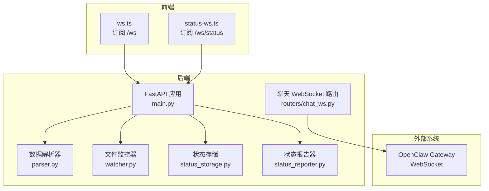
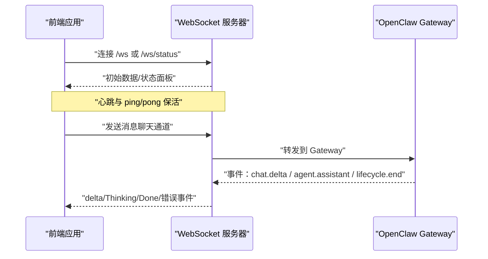
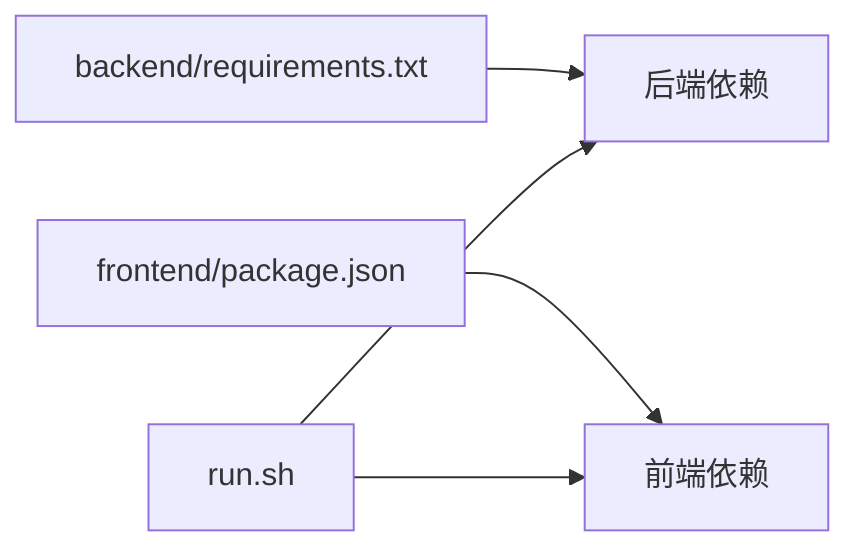

# 测试策略

<cite>
**本文引用的文件**
- [backend/main.py](file://backend/main.py)
- [backend/routers/chat_ws.py](file://backend/routers/chat_ws.py)
- [backend/parser.py](file://backend/parser.py)
- [backend/watcher.py](file://backend/watcher.py)
- [backend/status_storage.py](file://backend/status_storage.py)
- [backend/status_reporter.py](file://backend/status_reporter.py)
- [frontend/src/lib/ws.ts](file://frontend/src/lib/ws.ts)
- [frontend/src/lib/status-ws.ts](file://frontend/src/lib/status-ws.ts)
- [tests/test_chat_delta.py](file://tests/test_chat_delta.py)
- [tests/test_chat_delta2.py](file://tests/test_chat_delta2.py)
- [backend/requirements.txt](file://backend/requirements.txt)
- [frontend/package.json](file://frontend/package.json)
- [run.sh](file://run.sh)
</cite>

## 目录
1. [引言](#引言)
2. [项目结构](#项目结构)
3. [核心组件](#核心组件)
4. [架构总览](#架构总览)
5. [详细组件分析](#详细组件分析)
6. [依赖分析](#依赖分析)
7. [性能考虑](#性能考虑)
8. [故障排查指南](#故障排查指南)
9. [结论](#结论)
10. [附录](#附录)

## 引言
本测试策略面向 SynapseOS 2.0，覆盖 WebSocket 通信测试、AI 代理集成测试与实时数据流测试。目标是建立可重复、可扩展、可自动化的测试体系，确保：
- WebSocket 连接稳定性与心跳机制正确性
- AI 代理消息流式传输（delta）的完整性与去噪能力
- 实时状态面板与历史数据的准确性与一致性
- 单元测试、集成测试与端到端测试的协同与覆盖
- 性能指标与回归测试流程，以及测试自动化与持续集成配置

## 项目结构
项目采用前后端分离架构：
- 后端基于 FastAPI，提供 REST API 与 WebSocket 服务，负责数据解析、文件监控、状态快照与历史管理，并桥接 OpenClaw Gateway。
- 前端使用 Svelte，通过 WebSocket 订阅数据更新与状态面板变更，实现实时可视化。
- 测试包含对 Gateway 的直接测试脚本，用于验证流式消息与事件路由。

图表来源
- [backend/main.py:396-477](file://backend/main.py#L396-L477)
- [backend/routers/chat_ws.py:194-373](file://backend/routers/chat_ws.py#L194-L373)
- [backend/parser.py:440-509](file://backend/parser.py#L440-L509)
- [backend/watcher.py:8-52](file://backend/watcher.py#L8-L52)
- [backend/status_storage.py:102-236](file://backend/status_storage.py#L102-L236)
- [backend/status_reporter.py:189-267](file://backend/status_reporter.py#L189-L267)

章节来源
- [backend/main.py:1-495](file://backend/main.py#L1-L495)
- [frontend/src/lib/ws.ts:1-84](file://frontend/src/lib/ws.ts#L1-L84)
- [frontend/src/lib/status-ws.ts:1-78](file://frontend/src/lib/status-ws.ts#L1-L78)

## 核心组件
- WebSocket 服务
  - 数据通道：/ws，初始推送全量数据，周期性心跳与 ping/pong 保活。
  - 状态通道：/ws/status，推送状态面板与事件（含难度/决策）。
  - 聊天通道：/ws/chat，桥接 OpenClaw Gateway，支持会话切换、历史加载、delta 流式传输与错误处理。
- 数据层
  - 解析器：从 cyber-team 目录读取任务与使命 Markdown，构建 mission/tasks/blockers/decisions/team。
  - 监视器：监控数据目录变化，触发 debounce 并广播。
  - 状态存储：快照与历史持久化，支持面板查询与分页过滤。
  - 状态报告器：定时扫描任务文件，生成 agent 状态快照。
- 前端 WebSocket 客户端
  - 自动重连、心跳处理、消息解析与状态更新。

章节来源
- [backend/main.py:396-477](file://backend/main.py#L396-L477)
- [backend/routers/chat_ws.py:194-373](file://backend/routers/chat_ws.py#L194-L373)
- [backend/parser.py:440-509](file://backend/parser.py#L440-L509)
- [backend/watcher.py:8-52](file://backend/watcher.py#L8-L52)
- [backend/status_storage.py:102-236](file://backend/status_storage.py#L102-L236)
- [backend/status_reporter.py:189-267](file://backend/status_reporter.py#L189-L267)
- [frontend/src/lib/ws.ts:1-84](file://frontend/src/lib/ws.ts#L1-L84)
- [frontend/src/lib/status-ws.ts:1-78](file://frontend/src/lib/status-ws.ts#L1-L78)

## 架构总览
WebSocket 与 AI 代理集成的关键路径如下：
- 前端通过 /ws 与 /ws/status 订阅后端推送
- 后端通过 DataWatcher 触发数据更新广播；通过状态报告器定时生成状态快照并广播
- 聊天通道通过 /ws/chat 连接 OpenClaw Gateway，转发消息并回传 delta 事件

图表来源
- [backend/main.py:396-477](file://backend/main.py#L396-L477)
- [backend/routers/chat_ws.py:194-373](file://backend/routers/chat_ws.py#L194-L373)

## 详细组件分析

### WebSocket 通信测试
- 连接与保活
  - 验证 /ws 与 /ws/status 的握手成功、初始消息推送、心跳与 ping/pong。
  - 断线重连与清理逻辑（移除失效连接）。
- 消息格式与事件类型
  - data_updated、status_updated、difficulty_reported、decision_requested、heartbeat、pong。
- 错误处理
  - WebSocketDisconnect、超时、异常捕获与资源清理。

章节来源
- [backend/main.py:396-477](file://backend/main.py#L396-L477)
- [frontend/src/lib/ws.ts:26-84](file://frontend/src/lib/ws.ts#L26-L84)
- [frontend/src/lib/status-ws.ts:18-78](file://frontend/src/lib/status-ws.ts#L18-L78)

### AI 代理集成测试
- Gateway 连接与认证
  - 连接握手、认证参数、能力声明（tool-events）。
- 会话管理
  - sessions.list/sessions.create，按 agent 映射 session key。
- 消息发送与事件路由
  - chat.send 发送消息，跟踪 runId 与 idempotencyKey，区分 delta 与 final/error。
- 流式传输验证
  - 统计 delta 事件数量、文本拼接完整性、生命周期事件（lifecycle.end）。
- 并发与跨通道隔离
  - 多 agent 并发运行，runId→agent 映射防止交叉污染。

章节来源
- [backend/routers/chat_ws.py:137-373](file://backend/routers/chat_ws.py#L137-L373)
- [tests/test_chat_delta.py:21-280](file://tests/test_chat_delta.py#L21-L280)
- [tests/test_chat_delta2.py:21-281](file://tests/test_chat_delta2.py#L21-L281)

### 实时数据流测试
- 数据源变更
  - DataWatcher 监控数据目录，触发 debounce 并广播 data_updated。
- 状态面板与历史
  - 状态报告器定时扫描任务文件，生成快照与历史；前端 /ws/status 订阅状态事件。
- 面板查询与过滤
  - REST API 提供面板、历史、按 agent/type/task 时间范围过滤与分页。

章节来源
- [backend/watcher.py:8-52](file://backend/watcher.py#L8-L52)
- [backend/main.py:61-94](file://backend/main.py#L61-L94)
- [backend/status_storage.py:102-193](file://backend/status_storage.py#L102-L193)
- [backend/status_reporter.py:189-267](file://backend/status_reporter.py#L189-L267)

### 前端 WebSocket 客户端
- 自动重连与指数退避
- 心跳与 lastUpdated 更新
- 事件解析与 store 更新

章节来源
- [frontend/src/lib/ws.ts:1-84](file://frontend/src/lib/ws.ts#L1-L84)
- [frontend/src/lib/status-ws.ts:1-78](file://frontend/src/lib/status-ws.ts#L1-L78)

## 依赖分析
- 后端依赖
  - FastAPI、Uvicorn、watchfiles、python-frontmatter、websockets。
- 前端依赖
  - Svelte、TailwindCSS、Vite、ws（用于测试）。
- 运行脚本
  - run.sh 提供一键安装与启动后端/前端，日志输出与 PID 管理。

图表来源
- [backend/requirements.txt:1-6](file://backend/requirements.txt#L1-L6)
- [frontend/package.json:1-24](file://frontend/package.json#L1-L24)
- [run.sh:72-117](file://run.sh#L72-L117)

章节来源
- [backend/requirements.txt:1-6](file://backend/requirements.txt#L1-L6)
- [frontend/package.json:1-24](file://frontend/package.json#L1-L24)
- [run.sh:1-192](file://run.sh#L1-L192)

## 性能考虑
- WebSocket 广播与去抖
  - debounce 广播降低高频变更带来的压力，建议在测试中模拟高频变更场景，验证去抖窗口与批量推送行为。
- 心跳与保活
  - 前端与后端的心跳/pong 机制需在高延迟网络下验证稳定性。
- Gateway 连接与事件队列
  - 确保事件队列容量与超时设置合理，避免事件丢失或堆积。
- 历史与面板查询
  - 历史文件为 JSONL，查询需注意 I/O 与过滤开销，建议在测试中构造大体量历史数据集。

章节来源
- [backend/main.py:61-94](file://backend/main.py#L61-L94)
- [backend/routers/chat_ws.py:158-176](file://backend/routers/chat_ws.py#L158-L176)
- [backend/status_storage.py:146-193](file://backend/status_storage.py#L146-L193)

## 故障排查指南
- WebSocket 连接失败
  - 检查 CORS 配置、端口占用、防火墙与代理设置。
  - 前端重连策略与指数退避是否生效。
- Gateway 连接异常
  - 认证失败、协议版本不匹配、能力声明缺失。
  - 使用测试脚本验证握手与事件序列。
- 数据未更新
  - DataWatcher 是否启动、文件权限与路径是否正确。
  - 状态报告器定时任务是否运行。
- 前端状态不同步
  - 检查事件类型解析与 store 更新逻辑，确认 lastUpdated 是否更新。

章节来源
- [backend/main.py:187-193](file://backend/main.py#L187-L193)
- [tests/test_chat_delta.py:21-280](file://tests/test_chat_delta.py#L21-L280)
- [tests/test_chat_delta2.py:21-281](file://tests/test_chat_delta2.py#L21-L281)
- [frontend/src/lib/ws.ts:26-84](file://frontend/src/lib/ws.ts#L26-L84)
- [frontend/src/lib/status-ws.ts:18-78](file://frontend/src/lib/status-ws.ts#L18-L78)

## 结论
本测试策略围绕 WebSocket 通信、AI 代理集成与实时数据流三大核心，结合现有测试脚本与前端客户端，形成从单元到端到端的测试闭环。建议在 CI 中集成自动化测试与覆盖率统计，并将关键路径纳入回归测试清单。

## 附录

### 测试用例编写规范
- 命名规范
  - 前缀：test_ws_*、test_gateway_*、test_status_*、test_parser_*。
- 断言建议
  - 连接：握手成功、初始消息存在、心跳/pong 正常。
  - 流式：delta 数量、文本拼接完整性、lifecycle.end 触发。
  - 状态：面板字段、历史过滤与分页、去噪与合并。
- 数据准备
  - 准备最小化 cyber-team 数据集与会话历史文件，确保可复现。
  - 使用 seed 数据初始化状态快照，便于状态面板测试。
- 模拟环境
  - 使用本地 Gateway 地址与令牌，或通过容器/代理模拟。
  - 前端通过 Vite 开发服务器，后端通过 Uvicorn 运行。

章节来源
- [tests/test_chat_delta.py:1-280](file://tests/test_chat_delta.py#L1-L280)
- [tests/test_chat_delta2.py:1-281](file://tests/test_chat_delta2.py#L1-L281)
- [backend/status_storage.py:196-236](file://backend/status_storage.py#L196-L236)

### 单元测试、集成测试与端到端测试实施
- 单元测试
  - 解析器：解析 mission/task/blocker/decision/team 的边界条件与异常输入。
  - 存储：快照更新、历史追加、面板查询与过滤。
  - 监视器：文件变更检测与回调通知。
- 集成测试
  - WebSocket 与状态报告器联动，验证去抖与广播。
  - 聊天通道与 Gateway 的握手、会话管理与事件路由。
- 端到端测试
  - 前后端联调，覆盖用户操作链路：连接→订阅→消息发送→流式接收→状态更新。

章节来源
- [backend/parser.py:123-509](file://backend/parser.py#L123-L509)
- [backend/status_storage.py:62-193](file://backend/status_storage.py#L62-L193)
- [backend/watcher.py:8-52](file://backend/watcher.py#L8-L52)
- [backend/routers/chat_ws.py:137-373](file://backend/routers/chat_ws.py#L137-L373)

### WebSocket 连接测试、消息流式传输验证与错误处理
- 连接测试
  - 握手成功、初始数据推送、心跳/pong、断线重连。
- 流式传输
  - 统计 delta 事件、校验文本拼接、lifecycle.end 与 done 事件。
- 错误处理
  - 超时、异常、WebSocketDisconnect、Gateway 连接关闭。

章节来源
- [backend/main.py:396-477](file://backend/main.py#L396-L477)
- [tests/test_chat_delta.py:127-277](file://tests/test_chat_delta.py#L127-L277)
- [tests/test_chat_delta2.py:124-277](file://tests/test_chat_delta2.py#L124-L277)

### 测试覆盖率要求、性能测试指标与回归测试流程
- 覆盖率
  - 建议后端函数级覆盖率不低于 80%，关键路径（广播、事件路由、状态生成）不低于 90%。
- 性能
  - WebSocket 广播延迟、事件吞吐量、Gateway 连接超时与重试次数。
- 回归
  - 每次变更后运行核心测试套件，重点关注 WebSocket 保活、流式事件与状态面板一致性。

章节来源
- [backend/main.py:44-94](file://backend/main.py#L44-L94)
- [backend/routers/chat_ws.py:158-176](file://backend/routers/chat_ws.py#L158-L176)

### 测试自动化与持续集成配置
- 自动化
  - 使用 run.sh 启动后端与前端，统一日志输出。
  - 在 CI 中安装 Python 与 Node 依赖，运行测试脚本与覆盖率收集。
- 持续集成
  - 建议流水线步骤：安装依赖→启动后端→启动前端→运行测试→生成报告→清理进程。
- 报告
  - 生成 HTML/Coverage 报告，保留最近构建日志以便排查。

章节来源
- [run.sh:57-117](file://run.sh#L57-L117)
- [backend/requirements.txt:1-6](file://backend/requirements.txt#L1-L6)
- [frontend/package.json:6-18](file://frontend/package.json#L6-L18)