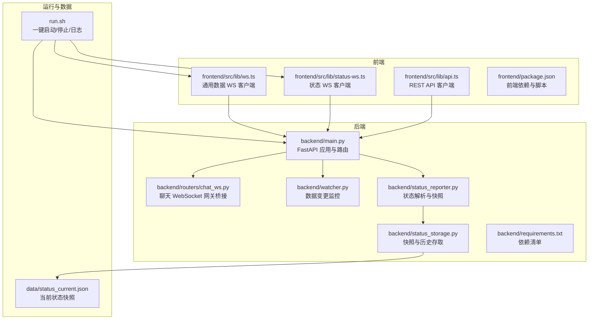
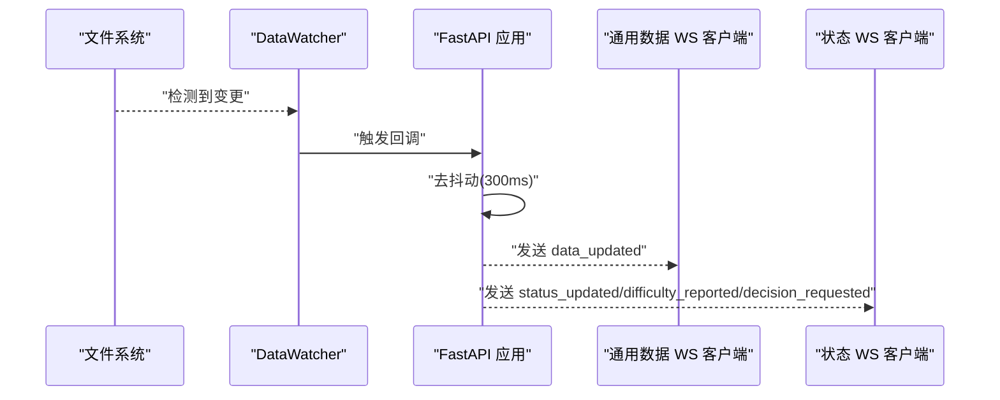
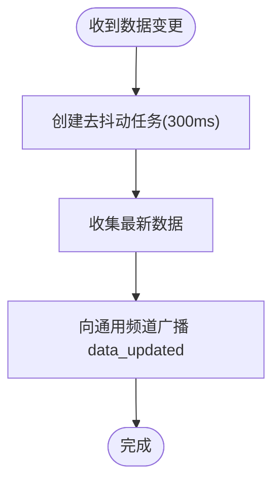
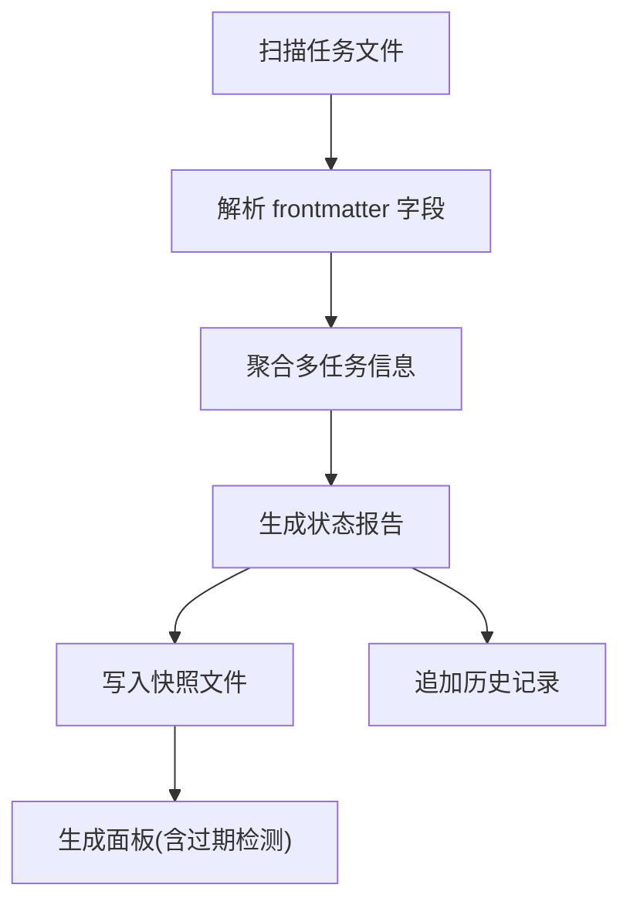
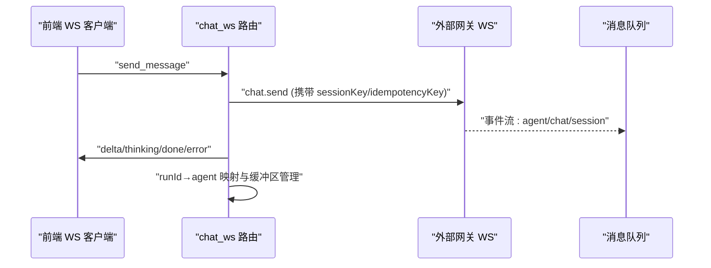
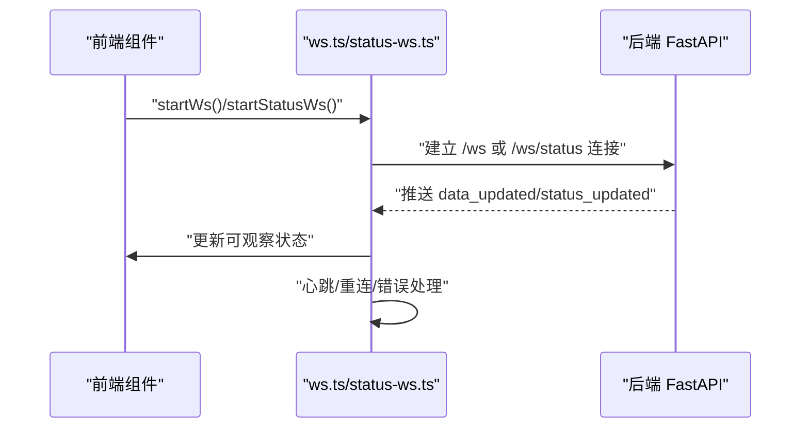
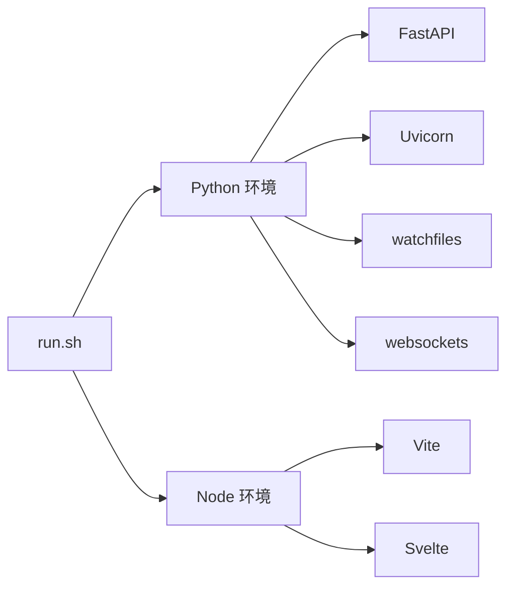

# 调试技巧

<cite>
**本文引用的文件**
- [backend/main.py](file://backend/main.py)
- [backend/routers/chat_ws.py](file://backend/routers/chat_ws.py)
- [backend/watcher.py](file://backend/watcher.py)
- [backend/status_reporter.py](file://backend/status_reporter.py)
- [backend/status_storage.py](file://backend/status_storage.py)
- [frontend/src/lib/ws.ts](file://frontend/src/lib/ws.ts)
- [frontend/src/lib/status-ws.ts](file://frontend/src/lib/status-ws.ts)
- [frontend/src/lib/api.ts](file://frontend/src/lib/api.ts)
- [run.sh](file://run.sh)
- [tests/test_chat_delta.py](file://tests/test_chat_delta.py)
- [tests/test_chat_delta2.py](file://tests/test_chat_delta2.py)
- [backend/requirements.txt](file://backend/requirements.txt)
- [frontend/package.json](file://frontend/package.json)
- [data/status_current.json](file://data/status_current.json)
</cite>

## 目录
1. [简介](#简介)
2. [项目结构](#项目结构)
3. [核心组件](#核心组件)
4. [架构总览](#架构总览)
5. [详细组件分析](#详细组件分析)
6. [依赖分析](#依赖分析)
7. [性能考虑](#性能考虑)
8. [故障排除指南](#故障排除指南)
9. [结论](#结论)
10. [附录](#附录)

## 简介
本指南面向 SynapseOS 2.0 的开发者与运维人员，提供系统化的调试与故障排除方法，覆盖以下主题：
- WebSocket 连接调试与实时数据流监控
- 状态同步问题排查（任务状态、困难与待决策）
- 日志分析、性能瓶颈识别与内存泄漏检测
- 前端调试工具、网络请求监控与 WebSocket 事件追踪
- 常见问题诊断流程、错误信息解读与修复方案
- 开发工具配置、断点设置与变量监视技巧
- 生产环境问题排查与性能优化建议

## 项目结构
系统由后端 FastAPI + WebSocket 服务、前端 Svelte 应用、状态存储与文件监控组成，并通过一键启动脚本统一管理。

**图表来源**
- [backend/main.py:184-495](file://backend/main.py#L184-L495)
- [backend/routers/chat_ws.py:206-385](file://backend/routers/chat_ws.py#L206-L385)
- [backend/watcher.py:8-52](file://backend/watcher.py#L8-L52)
- [backend/status_reporter.py:258-274](file://backend/status_reporter.py#L258-L274)
- [backend/status_storage.py:102-127](file://backend/status_storage.py#L102-L127)
- [frontend/src/lib/ws.ts:19-84](file://frontend/src/lib/ws.ts#L19-L84)
- [frontend/src/lib/status-ws.ts:12-78](file://frontend/src/lib/status-ws.ts#L12-L78)
- [frontend/src/lib/api.ts:151-181](file://frontend/src/lib/api.ts#L151-L181)
- [run.sh:72-117](file://run.sh#L72-L117)
- [data/status_current.json:1-59](file://data/status_current.json#L1-L59)

**章节来源**
- [backend/main.py:184-495](file://backend/main.py#L184-L495)
- [run.sh:72-117](file://run.sh#L72-L117)

## 核心组件
- 后端应用与路由
  - FastAPI 应用、CORS 中间件、静态资源挂载、WebSocket 终结点与 REST API。
  - 数据更新通道与状态更新通道分离，分别广播至不同客户端集合。
- 文件监控
  - 异步文件监控器，检测数据目录变更后触发回调，用于去抖动与批量广播。
- 状态解析与存储
  - 解析任务 Markdown 文件为状态报告，生成当前快照与历史记录；提供面板查询与分页历史接口。
- 聊天 WebSocket 网关桥接
  - 连接外部网关，转发消息、接收流式事件，按 runId/agent 映射去交叉污染。
- 前端 WebSocket 客户端
  - 通用数据 WS 客户端与状态 WS 客户端，分别订阅 /ws 与 /ws/status，自动重连与心跳处理。
- 一键启动脚本
  - 安装依赖、启动后端与前端、输出日志路径与访问地址。

**章节来源**
- [backend/main.py:39-182](file://backend/main.py#L39-L182)
- [backend/watcher.py:8-52](file://backend/watcher.py#L8-L52)
- [backend/status_reporter.py:189-244](file://backend/status_reporter.py#L189-L244)
- [backend/status_storage.py:102-193](file://backend/status_storage.py#L102-L193)
- [backend/routers/chat_ws.py:206-385](file://backend/routers/chat_ws.py#L206-L385)
- [frontend/src/lib/ws.ts:19-84](file://frontend/src/lib/ws.ts#L19-L84)
- [frontend/src/lib/status-ws.ts:12-78](file://frontend/src/lib/status-ws.ts#L12-L78)
- [run.sh:72-117](file://run.sh#L72-L117)

## 架构总览
系统采用“文件驱动 + WebSocket 广播 + 前端订阅”的模式：
- 文件监控器监听数据目录变化，触发去抖动广播，向通用数据频道推送。
- 独立的状态报告线程周期性扫描任务文件，生成面板并广播到状态频道。
- 前端通过两个 WebSocket 客户端分别订阅通用数据与状态更新，实现低延迟实时同步。

**图表来源**
- [backend/watcher.py:21-34](file://backend/watcher.py#L21-L34)
- [backend/main.py:61-93](file://backend/main.py#L61-L93)
- [backend/main.py:145-160](file://backend/main.py#L145-L160)
- [frontend/src/lib/ws.ts:43-55](file://frontend/src/lib/ws.ts#L43-L55)
- [frontend/src/lib/status-ws.ts:35-49](file://frontend/src/lib/status-ws.ts#L35-L49)

## 详细组件分析

### 后端 WebSocket 与广播机制
- 通用数据频道
  - 客户端连接后立即推送初始数据，随后周期性发送心跳；支持 ping/pong。
  - 断开清理：移除连接集合，避免内存泄漏。
- 状态频道
  - 客户端连接后推送当前面板；后台线程在状态变更时广播事件类型。
- 去抖动策略
  - 使用异步任务延时合并高频变更，降低广播频率与带宽占用。

**图表来源**
- [backend/main.py:61-93](file://backend/main.py#L61-L93)

**章节来源**
- [backend/main.py:396-477](file://backend/main.py#L396-L477)
- [backend/main.py:61-93](file://backend/main.py#L61-L93)

### 状态解析与存储
- 状态解析
  - 扫描任务目录，解析 frontmatter 字段，提取执行者、状态、难度、待决策等。
  - 将中文名映射为 agent_id，生成标准化状态报告。
- 快照与面板
  - 写入当前快照文件，计算在线状态与过期阈值；提供面板查询接口。
- 历史记录
  - 追加历史记录，支持按条件分页查询。

**图表来源**
- [backend/status_reporter.py:189-244](file://backend/status_reporter.py#L189-L244)
- [backend/status_storage.py:102-127](file://backend/status_storage.py#L102-L127)
- [backend/status_storage.py:139-193](file://backend/status_storage.py#L139-L193)

**章节来源**
- [backend/status_reporter.py:189-244](file://backend/status_reporter.py#L189-L244)
- [backend/status_storage.py:102-193](file://backend/status_storage.py#L102-L193)

### 聊天 WebSocket 网关桥接
- 连接与认证
  - 连接外部网关，发送 connect 请求并校验响应。
- 会话管理
  - 读取 sessions.json 获取 sessionKey，必要时创建会话；维护 agent→sessionKey 映射。
- 事件流式处理
  - 按 runId 将 agent 事件路由到对应客户端；支持 assistant/thinking/lifecycle/tool 等流。
  - 维护流式缓冲区，确保 delta 顺序拼接与生命周期结束清理。
- 错误处理
  - 网关连接异常、读取队列异常均记录并安全关闭。

**图表来源**
- [backend/routers/chat_ws.py:206-385](file://backend/routers/chat_ws.py#L206-L385)
- [tests/test_chat_delta.py:21-280](file://tests/test_chat_delta.py#L21-L280)
- [tests/test_chat_delta2.py:21-281](file://tests/test_chat_delta2.py#L21-L281)

**章节来源**
- [backend/routers/chat_ws.py:206-385](file://backend/routers/chat_ws.py#L206-L385)
- [tests/test_chat_delta.py:21-280](file://tests/test_chat_delta.py#L21-L280)
- [tests/test_chat_delta2.py:21-281](file://tests/test_chat_delta2.py#L21-L281)

### 前端 WebSocket 客户端
- 通用数据 WS
  - 自动重连、心跳处理、解析 data_updated 与 heartbeat，更新全局状态与最后更新时间。
- 状态 WS
  - 订阅状态更新、难度上报与待决策请求，更新面板与事件缓存。
- REST API
  - 提供任务、团队、状态面板、历史等接口封装。

**图表来源**
- [frontend/src/lib/ws.ts:26-84](file://frontend/src/lib/ws.ts#L26-L84)
- [frontend/src/lib/status-ws.ts:18-78](file://frontend/src/lib/status-ws.ts#L18-L78)
- [frontend/src/lib/api.ts:151-181](file://frontend/src/lib/api.ts#L151-L181)

**章节来源**
- [frontend/src/lib/ws.ts:26-84](file://frontend/src/lib/ws.ts#L26-L84)
- [frontend/src/lib/status-ws.ts:18-78](file://frontend/src/lib/status-ws.ts#L18-L78)
- [frontend/src/lib/api.ts:151-181](file://frontend/src/lib/api.ts#L151-L181)

## 依赖分析
- 后端依赖
  - FastAPI、Uvicorn、watchfiles、websockets、python-frontmatter。
- 前端依赖
  - Vite、Svelte、TailwindCSS、路由等。
- 运行脚本
  - 自动安装依赖、启动后端与前端、输出日志位置。

**图表来源**
- [backend/requirements.txt:1-6](file://backend/requirements.txt#L1-L6)
- [frontend/package.json:11-22](file://frontend/package.json#L11-L22)
- [run.sh:72-117](file://run.sh#L72-L117)

**章节来源**
- [backend/requirements.txt:1-6](file://backend/requirements.txt#L1-L6)
- [frontend/package.json:11-22](file://frontend/package.json#L11-L22)
- [run.sh:72-117](file://run.sh#L72-L117)

## 性能考虑
- 去抖动广播
  - 通用数据频道使用 300ms 去抖动，减少高频变更带来的广播压力。
- 状态报告线程
  - 后台线程每 60s 扫描任务文件，避免频繁 IO；事件信号量触发广播，降低轮询成本。
- 文件监控
  - 异步文件监控，变更即通知，避免轮询。
- 前端重连退避
  - 指数退避上限 10s，避免雪崩效应。
- 建议
  - 对于超大历史文件，考虑分片或压缩；对高并发客户端，评估连接池与消息批量化。

**章节来源**
- [backend/main.py:31-31](file://backend/main.py#L31-L31)
- [backend/main.py:105-117](file://backend/main.py#L105-L117)
- [backend/main.py:86-93](file://backend/main.py#L86-L93)
- [backend/watcher.py:31-34](file://backend/watcher.py#L31-L34)
- [frontend/src/lib/ws.ts:58-64](file://frontend/src/lib/ws.ts#L58-L64)

## 故障排除指南

### WebSocket 连接调试
- 常见症状
  - 连接失败、握手超时、断线重连频繁。
- 排查步骤
  - 检查后端日志与前端控制台错误输出。
  - 确认 CORS 设置允许来源，检查代理与反向代理配置。
  - 使用浏览器开发者工具 Network → WS 面板，观察帧与事件。
- 修复建议
  - 后端启用详细日志；前端实现指数退避与心跳保活；必要时调整超时参数。

**章节来源**
- [backend/main.py:187-193](file://backend/main.py#L187-L193)
- [frontend/src/lib/ws.ts:58-69](file://frontend/src/lib/ws.ts#L58-L69)
- [frontend/src/lib/status-ws.ts:51-63](file://frontend/src/lib/status-ws.ts#L51-L63)

### 实时数据流监控
- 通用数据频道
  - 关注 data_updated 与 heartbeat 类型；若长时间无心跳，检查去抖动与广播链路。
- 状态频道
  - 关注 status_updated、difficulty_reported、decision_requested；核对面板字段与过期阈值。
- 前端验证
  - 在浏览器控制台打印收到的消息类型与 payload 结构，确认数据一致性。

**章节来源**
- [frontend/src/lib/ws.ts:43-55](file://frontend/src/lib/ws.ts#L43-L55)
- [frontend/src/lib/status-ws.ts:35-49](file://frontend/src/lib/status-ws.ts#L35-L49)
- [backend/main.py:145-160](file://backend/main.py#L145-L160)

### 状态同步问题排查
- 任务状态未更新
  - 检查任务文件是否位于正确目录且命名符合要求；确认状态解析规则与字段映射。
- 面板显示过期
  - 核对 last_report_at 与当前时间差是否超过阈值；检查状态报告线程是否正常运行。
- 历史查询异常
  - 检查过滤参数与 JSONL 文件完整性；确认分页逻辑与时间范围。

**章节来源**
- [backend/status_reporter.py:189-244](file://backend/status_reporter.py#L189-L244)
- [backend/status_storage.py:102-127](file://backend/status_storage.py#L102-L127)
- [backend/status_storage.py:146-193](file://backend/status_storage.py#L146-L193)
- [data/status_current.json:1-59](file://data/status_current.json#L1-L59)

### 聊天 WebSocket 事件追踪
- 事件缺失
  - 使用测试脚本连接网关，精确追踪 runId，确认 chat 与 agent 事件流。
- 交叉污染
  - 确保 runId→agent 映射与缓冲区清理逻辑生效；避免多 agent 并发导致的错乱。
- 错误定位
  - 记录 connect、sessions.list/create、chat.send 的响应与事件序列，定位异常阶段。

**章节来源**
- [tests/test_chat_delta.py:21-280](file://tests/test_chat_delta.py#L21-L280)
- [tests/test_chat_delta2.py:21-281](file://tests/test_chat_delta2.py#L21-L281)
- [backend/routers/chat_ws.py:226-314](file://backend/routers/chat_ws.py#L226-L314)

### 日志分析方法
- 后端日志
  - 启动脚本将后端输出重定向到日志文件；关注连接、断开、错误与广播日志。
- 前端日志
  - 控制台输出连接状态、消息解析错误与重连信息。
- 建议
  - 使用日志聚合工具集中查看；对关键路径增加结构化日志。

**章节来源**
- [run.sh:16-21](file://run.sh#L16-L21)
- [run.sh:162-170](file://run.sh#L162-L170)
- [backend/main.py:401-440](file://backend/main.py#L401-L440)
- [backend/main.py:447-477](file://backend/main.py#L447-L477)

### 性能瓶颈识别
- CPU/内存
  - 观察状态报告线程与文件监控任务的执行时间；对解析与 IO 操作加计时。
- 网络
  - 监控 WS 帧大小与发送频率；对高频消息进行批量化或压缩。
- 建议
  - 对历史查询添加索引字段；对快照文件进行增量更新。

**章节来源**
- [backend/main.py:105-117](file://backend/main.py#L105-L117)
- [backend/watcher.py:31-34](file://backend/watcher.py#L31-L34)

### 内存泄漏检测技术
- 连接集合清理
  - 确保断开连接后从连接列表移除；对异常断开进行兜底清理。
- 任务与队列
  - 取消未完成任务与读取任务；关闭网关连接与队列。
- 建议
  - 使用内存分析工具定期采样；对长生命周期对象进行弱引用或显式释放。

**章节来源**
- [backend/main.py:48-58](file://backend/main.py#L48-L58)
- [backend/main.py:73-83](file://backend/main.py#L73-L83)
- [backend/routers/chat_ws.py:376-384](file://backend/routers/chat_ws.py#L376-L384)

### 前端调试工具使用
- 浏览器开发者工具
  - Network → WS：查看帧、事件与二进制负载；Console：查看错误与重连日志。
- Svelte 调试
  - 使用 Svelte DevTools 观察组件状态与 store 更新；结合日志定位渲染问题。
- 建议
  - 在关键节点打点日志，区分来自 WS 与 REST 的数据更新。

**章节来源**
- [frontend/src/lib/ws.ts:33-69](file://frontend/src/lib/ws.ts#L33-L69)
- [frontend/src/lib/status-ws.ts:25-63](file://frontend/src/lib/status-ws.ts#L25-L63)

### 网络请求监控
- REST API
  - 使用浏览器 Network 面板查看 /api/* 请求与响应；关注状态码与耗时。
- WebSocket
  - 记录消息类型与大小分布；统计丢包与重复。
- 建议
  - 对关键接口添加埋点与告警阈值。

**章节来源**
- [frontend/src/lib/api.ts:75-98](file://frontend/src/lib/api.ts#L75-L98)
- [frontend/src/lib/api.ts:151-181](file://frontend/src/lib/api.ts#L151-L181)

### 常见问题诊断流程
- 无数据更新
  - 步骤：检查文件监控是否运行、去抖动是否生效、WS 是否广播。
- 状态不同步
  - 步骤：核对任务文件字段、状态解析映射、快照写入与面板查询。
- 聊天无流式事件
  - 步骤：使用测试脚本追踪 runId、检查 sessions 与 chat.send 响应。
- 前端频繁重连
  - 步骤：检查心跳策略、超时设置与网络稳定性。

**章节来源**
- [backend/watcher.py:31-34](file://backend/watcher.py#L31-L34)
- [backend/main.py:86-93](file://backend/main.py#L86-L93)
- [backend/status_reporter.py:189-244](file://backend/status_reporter.py#L189-L244)
- [tests/test_chat_delta.py:21-280](file://tests/test_chat_delta.py#L21-L280)

### 错误信息解读与修复方案
- 连接失败
  - 可能原因：CORS、代理、证书；修复：调整中间件与反代配置。
- 广播异常
  - 可能原因：死连接未清理；修复：完善清理逻辑与异常捕获。
- 状态解析失败
  - 可能原因：frontmatter 格式不符；修复：规范化任务文件格式。
- 网关连接异常
  - 可能原因：认证失败、会话不存在；修复：检查 token 与 sessionKey。

**章节来源**
- [backend/main.py:187-193](file://backend/main.py#L187-L193)
- [backend/main.py:48-58](file://backend/main.py#L48-L58)
- [backend/routers/chat_ws.py:149-167](file://backend/routers/chat_ws.py#L149-L167)

### 开发工具配置、断点设置与变量监视
- 后端
  - 使用 IDE 断点于 WebSocket 处理函数与状态广播处；监视连接集合与去抖动任务。
- 前端
  - 在 store 更新处设置断点；监视 WS 状态与 payload。
- 测试脚本
  - 使用测试脚本模拟网关事件，验证事件路由与 runId 映射。

**章节来源**
- [backend/main.py:396-477](file://backend/main.py#L396-L477)
- [frontend/src/lib/ws.ts:43-55](file://frontend/src/lib/ws.ts#L43-L55)
- [tests/test_chat_delta2.py:21-281](file://tests/test_chat_delta2.py#L21-L281)

### 生产环境问题排查与性能优化建议
- 排查
  - 启用结构化日志与指标埋点；监控 WS 连接数与消息速率。
- 优化
  - 对热点接口与 WS 帧进行缓存与批量化；限制历史查询的分页大小；对状态报告线程进行限频。
- 建议
  - 使用容器编排与健康检查；对慢查询与阻塞操作进行隔离。

**章节来源**
- [backend/main.py:105-117](file://backend/main.py#L105-L117)
- [backend/status_storage.py:146-193](file://backend/status_storage.py#L146-L193)

## 结论
通过文件驱动的数据模型、清晰的 WebSocket 分层与完善的前端订阅机制，SynapseOS 2.0 实现了高效稳定的实时同步。遵循本文提供的调试与故障排除流程，可快速定位并解决连接、流式事件与状态同步问题；结合性能优化建议，可在生产环境中保持稳定与高性能。

## 附录
- 快速命令
  - 启动：./run.sh start
  - 停止：./run.sh stop
  - 重启：./run.sh restart
  - 日志：./run.sh logs
  - 状态：./run.sh status
- 依赖安装
  - 后端：pip3 install -r backend/requirements.txt
  - 前端：npm install（在 frontend 目录）

**章节来源**
- [run.sh:120-191](file://run.sh#L120-L191)
- [backend/requirements.txt:1-6](file://backend/requirements.txt#L1-6)
- [frontend/package.json:11-22](file://frontend/package.json#L11-L22)