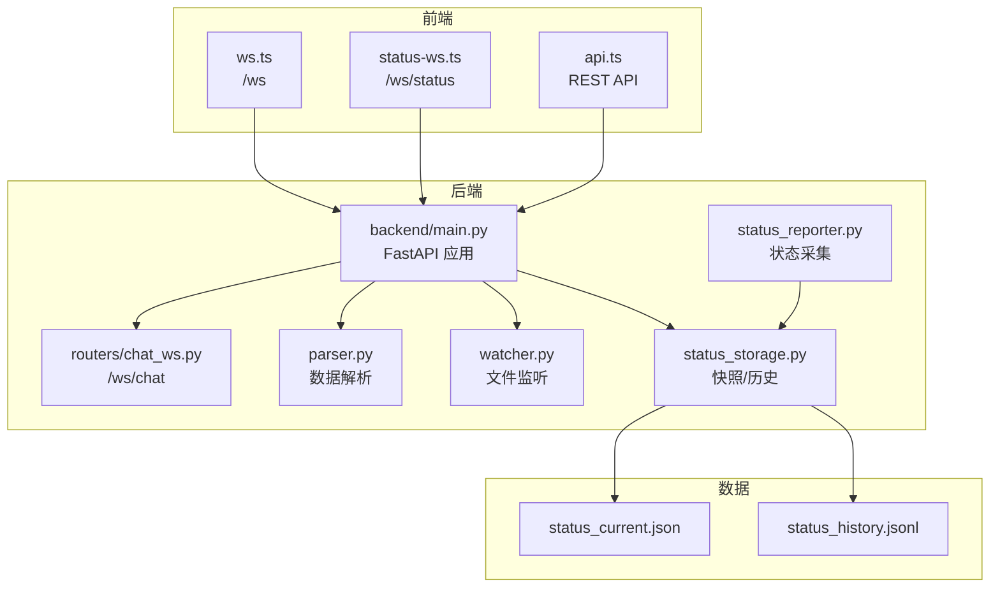
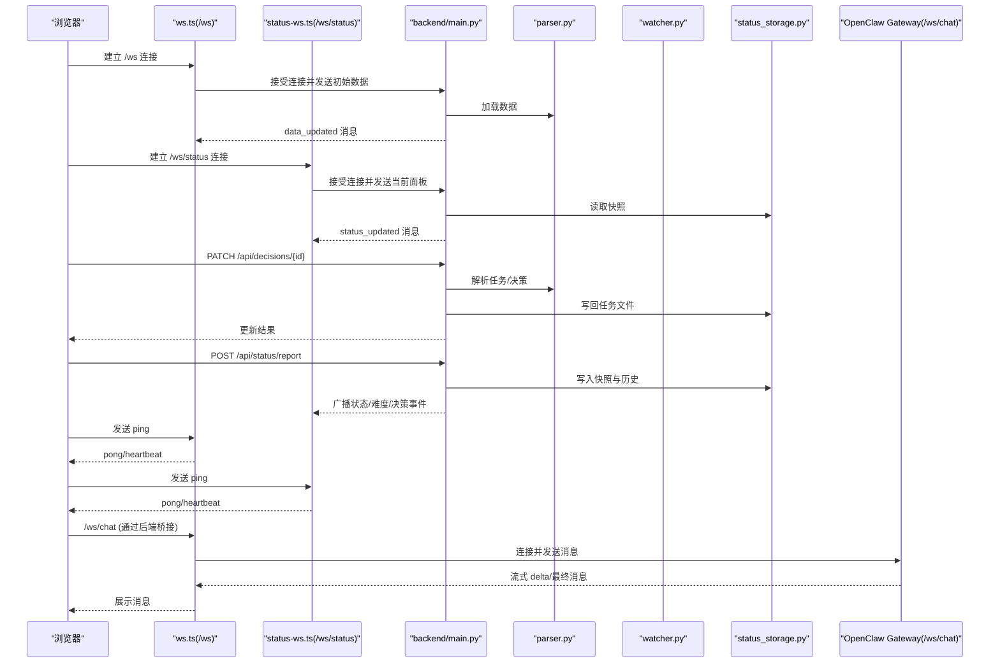
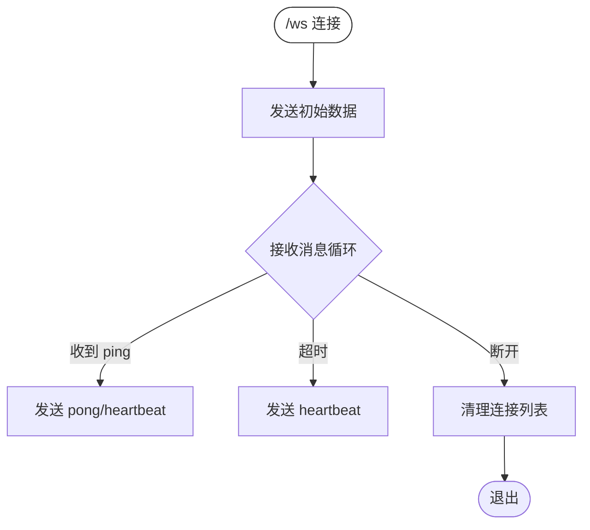
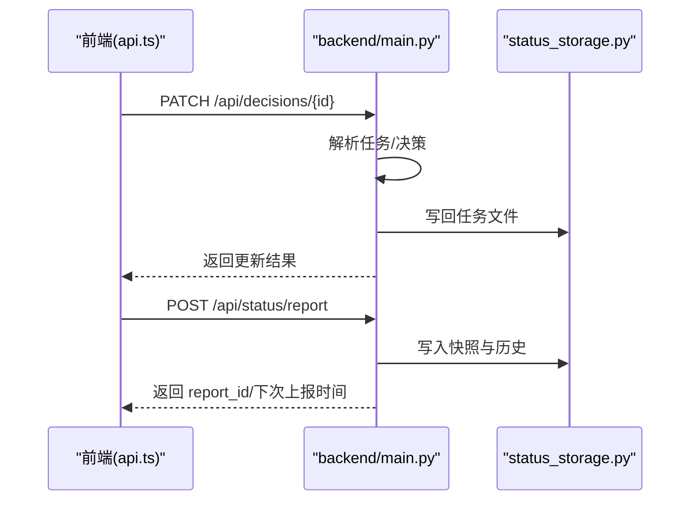
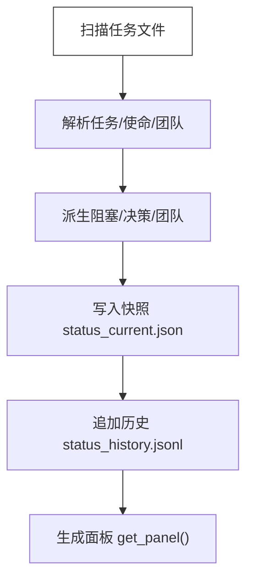
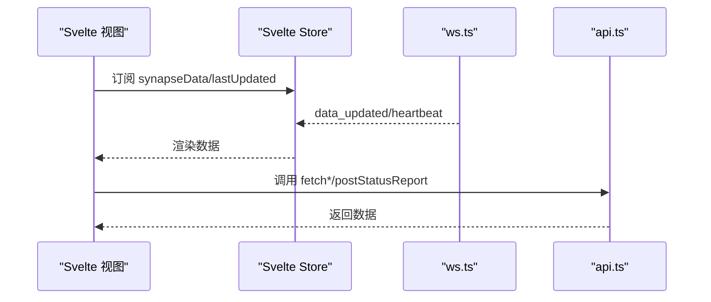
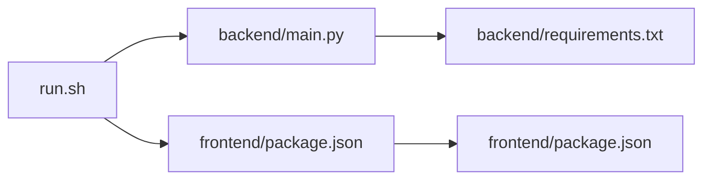

# 故障排除

<cite>
**本文引用的文件**   
- [backend/main.py](file://backend/main.py)
- [backend/routers/chat_ws.py](file://backend/routers/chat_ws.py)
- [backend/parser.py](file://backend/parser.py)
- [backend/watcher.py](file://backend/watcher.py)
- [backend/status_reporter.py](file://backend/status_reporter.py)
- [backend/status_storage.py](file://backend/status_storage.py)
- [frontend/src/lib/ws.ts](file://frontend/src/lib/ws.ts)
- [frontend/src/lib/status-ws.ts](file://frontend/src/lib/status-ws.ts)
- [frontend/src/lib/api.ts](file://frontend/src/lib/api.ts)
- [run.sh](file://run.sh)
- [tests/test_chat_delta.py](file://tests/test_chat_delta.py)
- [tests/test_chat_delta2.py](file://tests/test_chat_delta2.py)
- [data/status_current.json](file://data/status_current.json)
- [data/status_history.jsonl](file://data/status_history.jsonl)
- [backend/requirements.txt](file://backend/requirements.txt)
- [frontend/package.json](file://frontend/package.json)
</cite>

## 目录
1. [简介](#简介)
2. [项目结构](#项目结构)
3. [核心组件](#核心组件)
4. [架构总览](#架构总览)
5. [详细组件分析](#详细组件分析)
6. [依赖关系分析](#依赖关系分析)
7. [性能考虑](#性能考虑)
8. [故障排除指南](#故障排除指南)
9. [结论](#结论)
10. [附录](#附录)

## 简介
本故障排除文档面向 SynapseOS 2.0 的运维与开发人员，聚焦以下方面：
- WebSocket 连接问题诊断与修复
- API 调用失败排查与定位
- 前端渲染异常的根因分析
- 系统资源使用、内存泄漏检测与性能瓶颈识别
- 网络连接问题、文件权限错误与依赖冲突的解决步骤
- 调试工具使用、监控指标解读与告警处理流程

本指南基于仓库中的实际代码与运行脚本，提供可操作的排障步骤与可视化图示。

## 项目结构
SynapseOS 2.0 采用前后端分离架构：
- 后端：FastAPI + Uvicorn 提供 REST API 与 WebSocket 服务；负责数据解析、状态快照与历史存储、文件变更监听与广播。
- 前端：Svelte + Vite 构建，通过 WebSocket 与 REST API 获取数据，驱动视图渲染。
- 数据：本地 JSON/JSONL 文件用于状态快照与历史记录。

**图表来源**
- [backend/main.py:184-495](file://backend/main.py#L184-L495)
- [backend/routers/chat_ws.py:174-349](file://backend/routers/chat_ws.py#L174-L349)
- [backend/parser.py:440-509](file://backend/parser.py#L440-L509)
- [backend/watcher.py:8-52](file://backend/watcher.py#L8-L52)
- [backend/status_reporter.py:258-267](file://backend/status_reporter.py#L258-L267)
- [backend/status_storage.py:102-136](file://backend/status_storage.py#L102-L136)
- [frontend/src/lib/ws.ts:19-84](file://frontend/src/lib/ws.ts#L19-L84)
- [frontend/src/lib/status-ws.ts:12-78](file://frontend/src/lib/status-ws.ts#L12-L78)
- [frontend/src/lib/api.ts:75-180](file://frontend/src/lib/api.ts#L75-L180)

**章节来源**
- [backend/main.py:184-495](file://backend/main.py#L184-L495)
- [frontend/src/lib/ws.ts:19-84](file://frontend/src/lib/ws.ts#L19-L84)
- [frontend/src/lib/status-ws.ts:12-78](file://frontend/src/lib/status-ws.ts#L12-L78)
- [frontend/src/lib/api.ts:75-180](file://frontend/src/lib/api.ts#L75-L180)

## 核心组件
- WebSocket 通道
  - /ws：向客户端推送“数据更新”事件，含心跳与 ping/pong 机制。
  - /ws/status：向客户端推送“状态更新”事件，含难度/决策事件类型。
  - /ws/chat：桥接 OpenClaw Gateway，转发消息并流式回传 delta。
- REST API
  - /api/mission、/api/tasks、/api/blockers、/api/decisions、/api/team：获取业务数据。
  - /api/status/*：状态上报、面板查询、历史查询。
  - /api/decisions/{decision_id}：更新决策状态并写回任务文件。
- 数据层
  - parser：解析任务/使命/团队等 Markdown 数据，构建统一模型。
  - watcher：监听数据目录变化，触发去抖动广播。
  - status_reporter：扫描任务文件，生成状态快照。
  - status_storage：管理快照与历史记录，提供面板与分页查询。
- 前端
  - ws.ts：/ws 连接、重连、心跳处理。
  - status-ws.ts：/ws/status 连接、事件解析与面板更新。
  - api.ts：REST API 调用封装。

**章节来源**
- [backend/main.py:396-477](file://backend/main.py#L396-L477)
- [backend/routers/chat_ws.py:174-349](file://backend/routers/chat_ws.py#L174-L349)
- [backend/parser.py:440-509](file://backend/parser.py#L440-L509)
- [backend/watcher.py:8-52](file://backend/watcher.py#L8-L52)
- [backend/status_reporter.py:258-267](file://backend/status_reporter.py#L258-L267)
- [backend/status_storage.py:102-193](file://backend/status_storage.py#L102-L193)
- [frontend/src/lib/ws.ts:26-84](file://frontend/src/lib/ws.ts#L26-L84)
- [frontend/src/lib/status-ws.ts:18-78](file://frontend/src/lib/status-ws.ts#L18-L78)
- [frontend/src/lib/api.ts:75-180](file://frontend/src/lib/api.ts#L75-L180)

## 架构总览
下图展示从浏览器到后端再到网关的关键交互路径，以及数据在各模块间的流转。

**图表来源**
- [backend/main.py:396-477](file://backend/main.py#L396-L477)
- [backend/routers/chat_ws.py:174-349](file://backend/routers/chat_ws.py#L174-L349)
- [backend/parser.py:440-509](file://backend/parser.py#L440-L509)
- [backend/status_storage.py:102-193](file://backend/status_storage.py#L102-L193)
- [frontend/src/lib/ws.ts:26-84](file://frontend/src/lib/ws.ts#L26-L84)
- [frontend/src/lib/status-ws.ts:18-78](file://frontend/src/lib/status-ws.ts#L18-L78)

## 详细组件分析

### WebSocket 组件分析
- /ws 通道
  - 连接建立后立即推送初始数据；支持 ping/pong 与心跳；超时自动发送 heartbeat。
  - 断开清理连接列表，避免内存泄漏。
- /ws/status 通道
  - 连接建立后推送当前面板；后台线程周期性扫描任务文件，有更新即广播。
  - 支持多种事件类型：status_updated、difficulty_reported、decision_requested。
- /ws/chat 通道
  - 连接 OpenClaw Gateway，认证后维护消息队列；按事件类型流式回传 delta、thinking、最终消息与错误。
  - 支持会话切换与历史加载。

**图表来源**
- [backend/main.py:396-440](file://backend/main.py#L396-L440)

**章节来源**
- [backend/main.py:396-477](file://backend/main.py#L396-L477)
- [frontend/src/lib/ws.ts:26-84](file://frontend/src/lib/ws.ts#L26-L84)

### REST API 组件分析
- 数据查询接口
  - /api/mission、/api/tasks、/api/blockers、/api/decisions、/api/team：直接返回 parser 解析后的数据。
- 决策更新接口
  - PATCH /api/decisions/{decision_id}：根据决策 ID 定位任务文件，更新“果爸决策”段落并写回。
- 状态接口
  - POST /api/status/report：生成快照并广播事件。
  - GET /api/status/panel：获取面板数据（含在线状态与过期检测）。
  - GET /api/status/history：分页过滤查询历史记录。
  - GET /api/status/{agent_id}：查询单个代理状态。
  - POST /api/status/difficulty：便捷上报难度。

**图表来源**
- [backend/main.py:224-298](file://backend/main.py#L224-L298)
- [backend/main.py:318-346](file://backend/main.py#L318-L346)
- [backend/status_storage.py:33-99](file://backend/status_storage.py#L33-L99)

**章节来源**
- [backend/main.py:200-394](file://backend/main.py#L200-L394)
- [backend/status_storage.py:102-193](file://backend/status_storage.py#L102-L193)
- [frontend/src/lib/api.ts:75-180](file://frontend/src/lib/api.ts#L75-L180)

### 数据解析与状态管理
- parser
  - 解析任务/使命/团队等 Markdown，构建统一数据结构；派生阻塞与决策列表。
- watcher
  - 异步监听数据目录变化，回调去抖动后广播。
- status_reporter
  - 扫描任务文件，生成状态快照；写入 status_current.json。
- status_storage
  - 快照/历史持久化；面板计算在线状态与过期标记。

**图表来源**
- [backend/parser.py:440-509](file://backend/parser.py#L440-L509)
- [backend/status_reporter.py:189-243](file://backend/status_reporter.py#L189-L243)
- [backend/status_storage.py:246-266](file://backend/status_storage.py#L246-L266)

**章节来源**
- [backend/parser.py:440-509](file://backend/parser.py#L440-L509)
- [backend/watcher.py:8-52](file://backend/watcher.py#L8-L52)
- [backend/status_reporter.py:189-243](file://backend/status_reporter.py#L189-L243)
- [backend/status_storage.py:102-193](file://backend/status_storage.py#L102-L193)
- [data/status_current.json:1-59](file://data/status_current.json#L1-L59)
- [data/status_history.jsonl:1-4](file://data/status_history.jsonl#L1-L4)

### 前端渲染与 WebSocket 交互
- ws.ts
  - 自动重连策略；解析 data_updated/heartbeat；更新全局状态与最后更新时间。
- status-ws.ts
  - 解析 status_updated/difficulty_reported/decision_requested；更新面板与事件。
- api.ts
  - 封装 REST API 调用；支持分页与过滤参数。

**图表来源**
- [frontend/src/lib/ws.ts:43-55](file://frontend/src/lib/ws.ts#L43-L55)
- [frontend/src/lib/status-ws.ts:35-49](file://frontend/src/lib/status-ws.ts#L35-L49)
- [frontend/src/lib/api.ts:75-180](file://frontend/src/lib/api.ts#L75-L180)

**章节来源**
- [frontend/src/lib/ws.ts:26-84](file://frontend/src/lib/ws.ts#L26-L84)
- [frontend/src/lib/status-ws.ts:18-78](file://frontend/src/lib/status-ws.ts#L18-L78)
- [frontend/src/lib/api.ts:75-180](file://frontend/src/lib/api.ts#L75-L180)

## 依赖关系分析
- 后端依赖
  - FastAPI、Uvicorn、watchfiles、python-frontmatter、websockets。
- 前端依赖
  - Svelte、Vite、TailwindCSS、路由等。
- 运行脚本
  - run.sh 提供一键启动、停止、重启、查看日志与状态的功能，并设置日志输出文件。

**图表来源**
- [run.sh:72-117](file://run.sh#L72-L117)
- [backend/requirements.txt:1-6](file://backend/requirements.txt#L1-L6)
- [frontend/package.json:1-24](file://frontend/package.json#L1-L24)

**章节来源**
- [run.sh:72-117](file://run.sh#L72-L117)
- [backend/requirements.txt:1-6](file://backend/requirements.txt#L1-L6)
- [frontend/package.json:1-24](file://frontend/package.json#L1-L24)

## 性能考虑
- 去抖动广播
  - watcher 检测到文件变化后，通过去抖动任务延迟批量广播，降低广播频率与前端压力。
- 心跳与超时
  - WebSocket 侧通过 ping/pong 与 heartbeat 保持连接健康；超时自动发送心跳，避免空闲断连。
- 历史分页
  - 历史查询支持分页与过滤，限制每页最大条数，避免一次性传输过多数据。
- 会话与流式
  - /ws/chat 使用队列与超时控制，确保事件有序处理与及时清理。

**章节来源**
- [backend/main.py:61-93](file://backend/main.py#L61-L93)
- [backend/main.py:418-430](file://backend/main.py#L418-L430)
- [backend/main.py:459-468](file://backend/main.py#L459-L468)
- [backend/routers/chat_ws.py:138-156](file://backend/routers/chat_ws.py#L138-L156)
- [backend/status_storage.py:363-374](file://backend/status_storage.py#L363-L374)

## 故障排除指南

### 一、WebSocket 连接问题
- 症状
  - /ws 或 /ws/status 无法连接、频繁断开、无数据更新。
- 诊断步骤
  - 检查后端日志：确认连接建立、初始数据发送与清理逻辑是否执行。
  - 检查前端日志：确认 ws.ts/status-ws.ts 是否触发重连与心跳。
  - 网络代理：确认 /ws 由反向代理正确转发至后端。
  - 超时与心跳：确认前端是否收到 heartbeat，后端是否发送 ping/pong。
- 常见原因
  - 反向代理未透传 WebSocket 协议头。
  - 前端重连策略导致连接不稳定。
  - 后端广播异常导致连接被清理。
- 修复建议
  - 确保代理配置支持 WebSocket 升级与长连接。
  - 调整前端重连延迟上限与退避策略。
  - 检查后端广播函数与异常捕获，避免死连接。

**章节来源**
- [backend/main.py:396-477](file://backend/main.py#L396-L477)
- [frontend/src/lib/ws.ts:26-84](file://frontend/src/lib/ws.ts#L26-L84)
- [frontend/src/lib/status-ws.ts:18-78](file://frontend/src/lib/status-ws.ts#L18-L78)

### 二、API 调用失败
- 症状
  - /api/decisions/{id} 更新失败；/api/status/report 返回异常；/api/status/history 查询为空。
- 诊断步骤
  - 查看后端日志：确认任务文件是否存在、路径是否正确、写入是否成功。
  - 检查请求参数：确认 decision_id 与任务文件命名一致；POST 参数格式正确。
  - 校验数据文件：确认 status_current.json 与 status_history.jsonl 存在且可读写。
- 常见原因
  - 任务目录不存在或权限不足。
  - 任务文件未包含“果爸决策”段落，导致更新逻辑分支异常。
  - 历史查询参数过滤导致无记录。
- 修复建议
  - 确认 CYBER_TEAM_DIR 环境变量指向正确目录。
  - 确保任务文件包含所需字段与段落。
  - 使用 /api/status/panel 与 /api/status/{agent_id} 辅助核对状态。

**章节来源**
- [backend/main.py:224-298](file://backend/main.py#L224-L298)
- [backend/main.py:318-346](file://backend/main.py#L318-L346)
- [backend/status_storage.py:146-193](file://backend/status_storage.py#L146-L193)
- [data/status_current.json:1-59](file://data/status_current.json#L1-L59)
- [data/status_history.jsonl:1-4](file://data/status_history.jsonl#L1-L4)

### 三、前端渲染异常
- 症状
  - 页面空白、数据不更新、状态面板不显示。
- 诊断步骤
  - 检查浏览器控制台：确认 ws.ts 与 status-ws.ts 是否报错。
  - 检查 api.ts 请求：确认 REST API 返回 JSON 结构与类型定义一致。
  - 核对 Svelte 组件：确认订阅的 store 值是否更新。
- 常见原因
  - WebSocket URL 协议/host 不正确导致连接失败。
  - JSON 解析异常导致数据未更新。
  - 类型定义与后端返回不一致导致渲染错误。
- 修复建议
  - 确认 ws.ts/getWsUrl 生成的 URL 与后端一致。
  - 在 api.ts 中增加错误处理与日志输出。
  - 对齐接口类型定义，确保字段存在。

**章节来源**
- [frontend/src/lib/ws.ts:19-84](file://frontend/src/lib/ws.ts#L19-L84)
- [frontend/src/lib/status-ws.ts:12-78](file://frontend/src/lib/status-ws.ts#L12-L78)
- [frontend/src/lib/api.ts:75-180](file://frontend/src/lib/api.ts#L75-L180)

### 四、网络连接问题
- 症状
  - /ws/chat 无法连接 OpenClaw Gateway；流式消息缺失。
- 诊断步骤
  - 使用测试脚本验证 Gateway 连接与认证流程。
  - 检查网关地址与令牌配置是否正确。
  - 监听事件序列：确认 chat/agent/session.message 等事件是否到达。
- 常见原因
  - 网关未启动或端口占用。
  - 认证失败或缺少必要能力声明。
  - 会话键未正确获取或过期。
- 修复建议
  - 使用测试脚本逐段验证连接、会话与消息发送。
  - 确保会话键映射与目标代理一致。
  - 检查网关日志与防火墙策略。

**章节来源**
- [backend/routers/chat_ws.py:117-136](file://backend/routers/chat_ws.py#L117-L136)
- [tests/test_chat_delta.py:21-126](file://tests/test_chat_delta.py#L21-L126)
- [tests/test_chat_delta2.py:21-122](file://tests/test_chat_delta2.py#L21-L122)

### 五、文件权限错误
- 症状
  - 写入任务文件失败；无法创建/读取 status_current.json 或 status_history.jsonl。
- 诊断步骤
  - 检查数据目录权限：确认后端进程用户具备读写权限。
  - 检查 CYBER_TEAM_DIR 与 DATA_DIR 路径是否正确。
- 修复建议
  - 修改目录权限或调整运行用户。
  - 使用 status_storage 的种子数据功能初始化演示数据。

**章节来源**
- [backend/status_storage.py:196-236](file://backend/status_storage.py#L196-L236)
- [data/status_current.json:1-59](file://data/status_current.json#L1-L59)
- [data/status_history.jsonl:1-4](file://data/status_history.jsonl#L1-L4)

### 六、依赖冲突
- 症状
  - 启动失败或运行时报错；模块导入异常。
- 诊断步骤
  - 使用 run.sh 安装后端依赖；检查 requirements.txt 版本。
  - 检查前端依赖安装是否成功。
- 修复建议
  - 清理缓存后重新安装依赖。
  - 锁定兼容版本，避免冲突升级。

**章节来源**
- [run.sh:79-81](file://run.sh#L79-L81)
- [backend/requirements.txt:1-6](file://backend/requirements.txt#L1-L6)
- [frontend/package.json:1-24](file://frontend/package.json#L1-L24)

### 七、日志分析方法
- 后端日志
  - run.sh 输出到 logs/synapse_backend.log；关注连接、广播、错误与关闭日志。
- 前端日志
  - 浏览器控制台输出 ws 与 status-ws 的连接、重连与解析错误。
- 历史与快照
  - 通过 status_history.jsonl 与 status_current.json 核对状态变化与上报时间。

**章节来源**
- [run.sh:16-21](file://run.sh#L16-L21)
- [run.sh:165-169](file://run.sh#L165-L169)
- [data/status_current.json:1-59](file://data/status_current.json#L1-L59)
- [data/status_history.jsonl:1-4](file://data/status_history.jsonl#L1-L4)

### 八、性能优化技巧
- 减少广播频率
  - 合理设置去抖动时间，避免高频变更导致大量广播。
- 控制消息大小
  - 仅发送必要字段；对大文本进行截断或分页。
- 优化前端渲染
  - 使用 Svelte store 的细粒度更新，避免全量重渲染。
- 监控与告警
  - 基于后端日志与前端错误统计建立告警。

**章节来源**
- [backend/main.py:61-93](file://backend/main.py#L61-L93)
- [frontend/src/lib/ws.ts:43-55](file://frontend/src/lib/ws.ts#L43-L55)

### 九、调试工具使用指南
- 后端
  - 使用 run.sh 启动并查看日志；通过 /docs 访问 API 文档。
- 前端
  - 使用 Vite 开发服务器；启用浏览器调试工具观察网络与 WebSocket。
- 网关
  - 使用测试脚本验证 chat.send 与事件流，记录 runId 与事件序列。

**章节来源**
- [run.sh:129-134](file://run.sh#L129-L134)
- [tests/test_chat_delta.py:21-126](file://tests/test_chat_delta.py#L21-L126)
- [tests/test_chat_delta2.py:21-122](file://tests/test_chat_delta2.py#L21-L122)

### 十、监控指标与告警
- 指标建议
  - WebSocket 连接数、消息广播次数、API 响应时间与错误率、状态面板更新延迟。
- 告警建议
  - 连接断开率过高、广播失败、API 超时、状态面板过期比例上升。

[本节为通用指导，无需特定文件引用]

## 结论
通过结合后端日志、前端控制台与测试脚本，可快速定位 WebSocket、API 与前端渲染问题。建议在生产环境中启用日志轮转、性能监控与告警，配合合理的去抖动与心跳策略，保障系统稳定运行。

## 附录
- 快速检查清单
  - 后端：日志正常、端口开放、依赖安装、数据目录可写。
  - 前端：URL 正确、代理配置、浏览器控制台无错误。
  - 网关：地址与令牌正确、会话键有效、事件流完整。
  - 数据：status_current.json 与 status_history.jsonl 存在且可读写。

[本节为通用指导，无需特定文件引用]