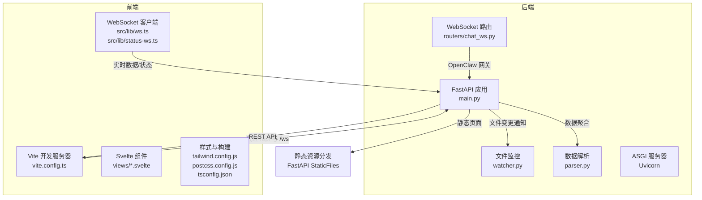
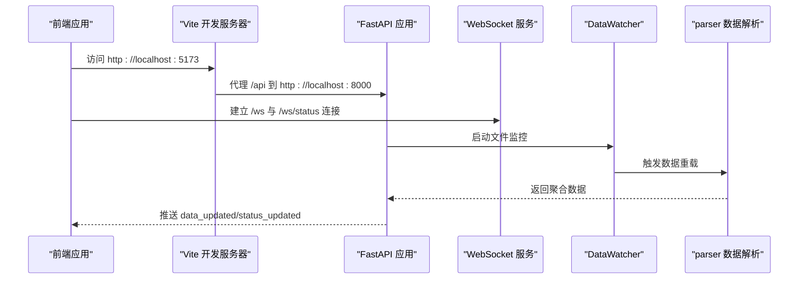
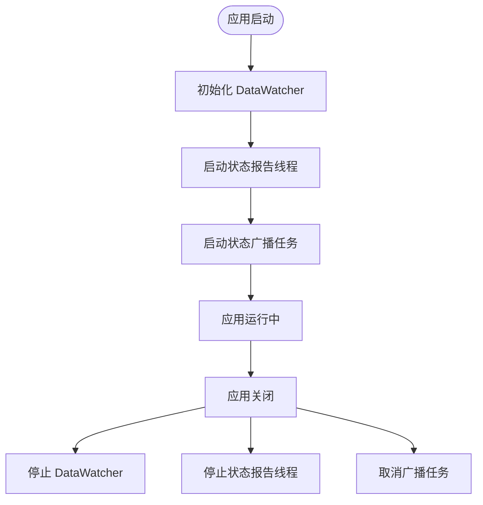
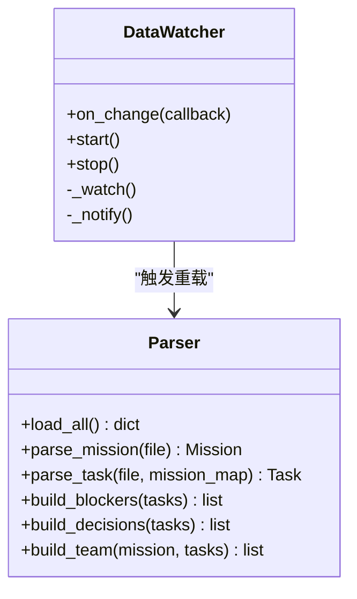
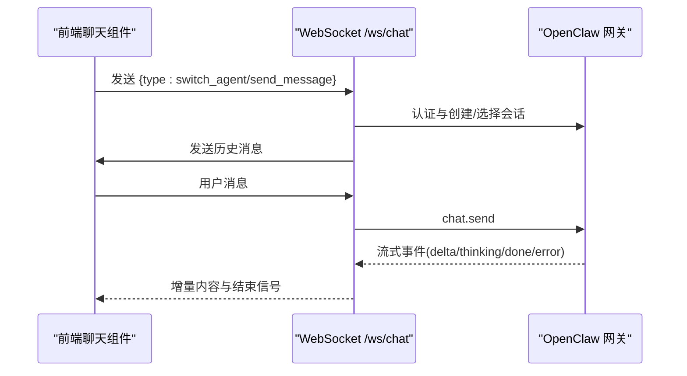
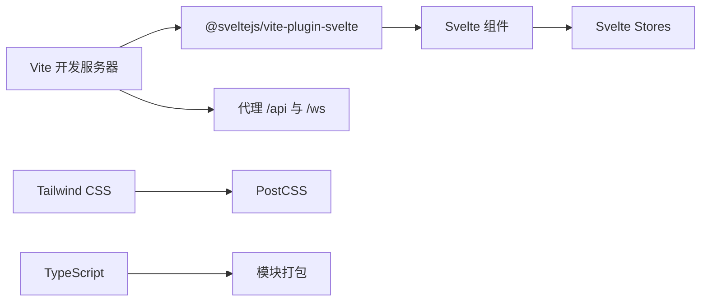
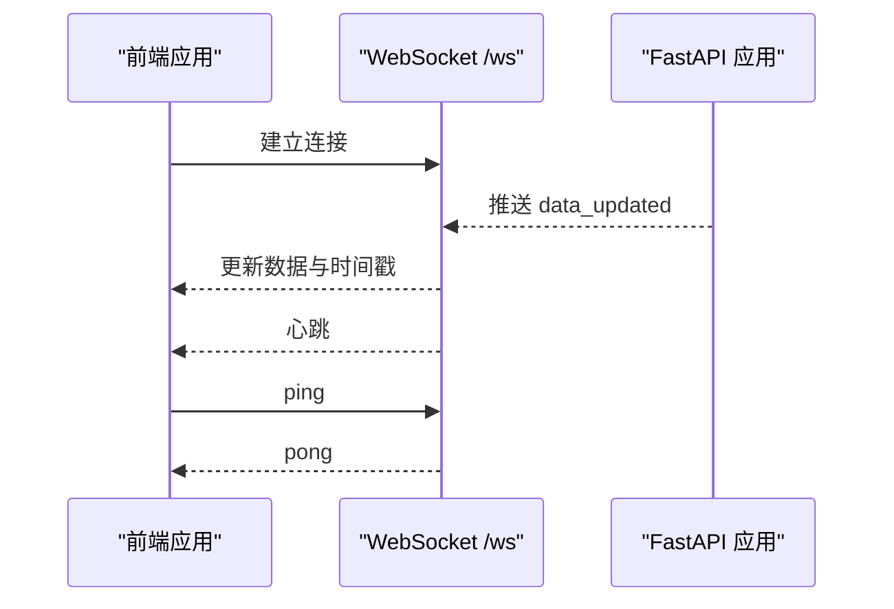
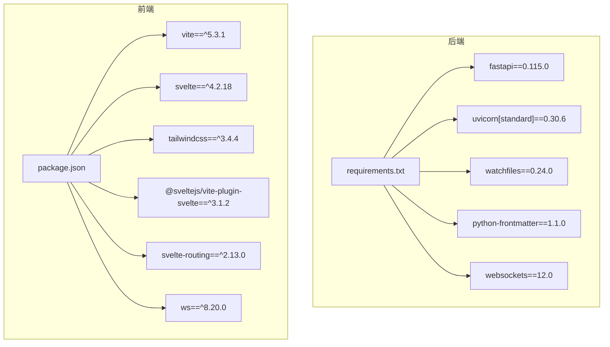

# 技术栈说明

<cite>
**本文引用的文件列表**
- [backend/requirements.txt](file://backend/requirements.txt)
- [backend/main.py](file://backend/main.py)
- [backend/watcher.py](file://backend/watcher.py)
- [backend/parser.py](file://backend/parser.py)
- [backend/routers/chat_ws.py](file://backend/routers/chat_ws.py)
- [frontend/package.json](file://frontend/package.json)
- [frontend/vite.config.ts](file://frontend/vite.config.ts)
- [frontend/tailwind.config.js](file://frontend/tailwind.config.js)
- [frontend/postcss.config.js](file://frontend/postcss.config.js)
- [frontend/tsconfig.json](file://frontend/tsconfig.json)
- [frontend/src/lib/ws.ts](file://frontend/src/lib/ws.ts)
- [frontend/src/lib/status-ws.ts](file://frontend/src/lib/status-ws.ts)
- [run.sh](file://run.sh)
</cite>

## 目录
1. [引言](#引言)
2. [项目结构](#项目结构)
3. [核心组件](#核心组件)
4. [架构总览](#架构总览)
5. [详细组件分析](#详细组件分析)
6. [依赖关系分析](#依赖关系分析)
7. [性能与并发特性](#性能与并发特性)
8. [开发环境与部署指南](#开发环境与部署指南)
9. [故障排查](#故障排查)
10. [结论](#结论)

## 引言
本文件面向 SynapseOS 2.0 的技术栈说明，聚焦后端与前端的关键技术选型与实现要点：
- 后端：FastAPI 框架、Uvicorn ASGI 服务器、WebSocket 协议支持、异步编程模型
- 前端：Svelte 框架、Vite 构建工具、Tailwind CSS 样式框架、TypeScript 类型系统
同时给出关键依赖库及版本要求、技术选型原因与优势、开发环境配置与依赖安装说明。

## 项目结构
项目采用前后端分离的目录组织方式，后端以 Python 为主，前端以 Svelte/Vite 为主，二者通过 WebSocket 和 REST API 进行交互，并通过 Vite 开发服务器代理到后端。

图表来源
- [backend/main.py:184-495](file://backend/main.py#L184-L495)
- [backend/routers/chat_ws.py:174-353](file://backend/routers/chat_ws.py#L174-L353)
- [backend/watcher.py:8-52](file://backend/watcher.py#L8-L52)
- [backend/parser.py:441-509](file://backend/parser.py#L441-L509)
- [frontend/vite.config.ts:1-23](file://frontend/vite.config.ts#L1-L23)
- [frontend/src/lib/ws.ts:1-84](file://frontend/src/lib/ws.ts#L1-L84)
- [frontend/src/lib/status-ws.ts:1-78](file://frontend/src/lib/status-ws.ts#L1-L78)

章节来源
- [backend/main.py:184-495](file://backend/main.py#L184-L495)
- [frontend/vite.config.ts:1-23](file://frontend/vite.config.ts#L1-L23)

## 核心组件
- 后端核心
  - FastAPI 应用与生命周期管理、CORS 中间件、REST API 端点、WebSocket 端点
  - 文件监控 DataWatcher：基于 watchfiles 的异步文件变更监听
  - 数据解析 parser：基于 python-frontmatter 的 Markdown 解析与实体建模
  - WebSocket 路由器：工作台聊天桥接 OpenClaw 网关
- 前端核心
  - Vite 开发服务器与代理配置
  - Svelte 组件与状态管理（stores）
  - Tailwind CSS 与 PostCSS 配置
  - TypeScript 编译配置

章节来源
- [backend/main.py:184-495](file://backend/main.py#L184-L495)
- [backend/watcher.py:8-52](file://backend/watcher.py#L8-L52)
- [backend/parser.py:1-509](file://backend/parser.py#L1-L509)
- [backend/routers/chat_ws.py:174-353](file://backend/routers/chat_ws.py#L174-L353)
- [frontend/vite.config.ts:1-23](file://frontend/vite.config.ts#L1-L23)
- [frontend/src/lib/ws.ts:1-84](file://frontend/src/lib/ws.ts#L1-L84)
- [frontend/src/lib/status-ws.ts:1-78](file://frontend/src/lib/status-ws.ts#L1-L78)

## 架构总览
后端采用 FastAPI + Uvicorn 的现代异步架构，提供 REST API 与两类 WebSocket 通道：
- /ws：数据更新通道，推送 mission/tasks/team/blockers/decisions 的聚合数据
- /ws/status：状态面板通道，推送 status panel 与事件（难度上报、决策请求等）
- /ws/chat：工作台聊天通道，桥接到 OpenClaw 网关，转发消息并流式返回响应

前端通过 Vite 提供开发体验，使用 Svelte 组件化 UI，Tailwind 实现风格定制，TypeScript 提供类型安全；WebSocket 客户端分别连接上述两条通道，实现数据与状态的实时同步。

图表来源
- [backend/main.py:120-182](file://backend/main.py#L120-L182)
- [backend/watcher.py:29-35](file://backend/watcher.py#L29-L35)
- [backend/parser.py:441-509](file://backend/parser.py#L441-L509)
- [frontend/vite.config.ts:13-20](file://frontend/vite.config.ts#L13-L20)
- [frontend/src/lib/ws.ts:19-74](file://frontend/src/lib/ws.ts#L19-L74)
- [frontend/src/lib/status-ws.ts:12-67](file://frontend/src/lib/status-ws.ts#L12-L67)

## 详细组件分析

### 后端：FastAPI + Uvicorn + WebSocket
- 应用与生命周期
  - 使用 lifespan 管理启动/关闭流程，初始化 DataWatcher、后台状态报告线程、广播任务
  - 注册 CORS 中间件，允许跨域访问
- REST API
  - 提供 mission/tasks/blockers/decisions/team/status/history 等接口
  - 支持 PATCH 更新决策（写回任务 Markdown 文件）
- WebSocket
  - /ws：首次连接即推送全量数据，心跳保持
  - /ws/status：推送状态面板与事件
  - /ws/chat：桥接 OpenClaw 网关，支持会话切换与增量流式输出

图表来源
- [backend/main.py:120-182](file://backend/main.py#L120-L182)

章节来源
- [backend/main.py:184-495](file://backend/main.py#L184-L495)

### 后端：文件监控与数据解析
- 文件监控 DataWatcher
  - 基于 watchfiles 的异步监控，回调触发数据重载与广播
- 数据解析 parser
  - 使用 python-frontmatter 解析 Markdown 元数据与正文
  - 定义 Mission/Task/Blocker/Decision/TeamMember 等数据类
  - 从任务文件中提取“果爸决策”、“优先级”、“来源类型”等字段
  - 生成 blockers、decisions、team 等派生数据

图表来源
- [backend/watcher.py:8-52](file://backend/watcher.py#L8-L52)
- [backend/parser.py:16-92](file://backend/parser.py#L16-L92)

章节来源
- [backend/watcher.py:8-52](file://backend/watcher.py#L8-L52)
- [backend/parser.py:1-509](file://backend/parser.py#L1-L509)

### 后端：WebSocket 路由（工作台聊天）
- 连接 OpenClaw 网关，鉴权后建立双向通信
- 读取本地会话历史（JSONL），按最近 N 条消息发送给前端
- 将用户消息转发至网关，按事件类型（agent/chat/lifecycle/thinking）流式回传增量内容
- 维护 runId → agent 的映射，避免跨会话混流

图表来源
- [backend/routers/chat_ws.py:174-353](file://backend/routers/chat_ws.py#L174-L353)

章节来源
- [backend/routers/chat_ws.py:174-353](file://backend/routers/chat_ws.py#L174-L353)

### 前端：Vite + Svelte + Tailwind + TypeScript
- Vite 配置
  - 插件：@sveltejs/vite-plugin-svelte、svelte-preprocess
  - 代理：/api → http://localhost:8000，/ws → ws://localhost:8000
- Svelte 组件
  - views 下包含多个视图组件（Mission、Team、WorkbenchPanel 等）
  - stores 管理 WebSocket 连接状态与数据
- Tailwind CSS
  - 自定义主题色板、字体族、阴影等
  - PostCSS 集成 Tailwind 与 Autoprefixer
- TypeScript
  - ESNext 目标、严格模式关闭、bundler 模块解析

图表来源
- [frontend/vite.config.ts:1-23](file://frontend/vite.config.ts#L1-L23)
- [frontend/tailwind.config.js:1-40](file://frontend/tailwind.config.js#L1-L40)
- [frontend/postcss.config.js:1-7](file://frontend/postcss.config.js#L1-L7)
- [frontend/tsconfig.json:1-17](file://frontend/tsconfig.json#L1-L17)

章节来源
- [frontend/vite.config.ts:1-23](file://frontend/vite.config.ts#L1-L23)
- [frontend/tailwind.config.js:1-40](file://frontend/tailwind.config.js#L1-L40)
- [frontend/postcss.config.js:1-7](file://frontend/postcss.config.js#L1-L7)
- [frontend/tsconfig.json:1-17](file://frontend/tsconfig.json#L1-L17)

### 前端：WebSocket 客户端
- /ws 客户端
  - 连接 /ws，接收 data_updated，更新 synapseData 与 lastUpdated
  - 心跳处理与断线重连
- /ws/status 客户端
  - 连接 /ws/status，接收 status_updated/difficulty_reported/decision_requested
  - 更新 statusPanel 与 statusEvents

图表来源
- [frontend/src/lib/ws.ts:19-74](file://frontend/src/lib/ws.ts#L19-L74)
- [backend/main.py:397-440](file://backend/main.py#L397-L440)

章节来源
- [frontend/src/lib/ws.ts:1-84](file://frontend/src/lib/ws.ts#L1-L84)
- [frontend/src/lib/status-ws.ts:1-78](file://frontend/src/lib/status-ws.ts#L1-L78)
- [backend/main.py:442-477](file://backend/main.py#L442-L477)

## 依赖关系分析
- 后端依赖
  - FastAPI、Uvicorn、watchfiles、python-frontmatter、websockets
- 前端依赖
  - Svelte、Vite、Tailwind CSS、svelte-routing、ws（用于测试或工具）

图表来源
- [backend/requirements.txt:1-6](file://backend/requirements.txt#L1-L6)
- [frontend/package.json:11-22](file://frontend/package.json#L11-L22)

章节来源
- [backend/requirements.txt:1-6](file://backend/requirements.txt#L1-L6)
- [frontend/package.json:11-22](file://frontend/package.json#L11-L22)

## 性能与并发特性
- 异步与并发
  - 后端使用 asyncio 事件循环与异步函数，WebSocket 广播与状态广播在独立任务中运行
  - 文件监控使用异步迭代器，避免阻塞
  - WebSocket 路由器内部使用 asyncio.Queue 与异步读取，保证高并发下的稳定性
- I/O 与 CPU 分离
  - 数据解析与文件监控为 I/O 密集场景，WebSocket 广播为网络 I/O
  - 状态报告线程与异步广播任务解耦，降低主线程压力
- 前端渲染与状态管理
  - Svelte 编译期优化，组件粒度小、更新局部化
  - Store 精准订阅，减少不必要重渲染

[本节为通用性能讨论，无需列出具体文件来源]

## 开发环境与部署指南
- 系统要求
  - Python 3、pip3、Node.js、npm
- 一键启动脚本
  - run.sh 提供 start/stop/restart/logs/status 子命令
  - 自动安装后端依赖（pip3 install -r requirements.txt），启动 uvicorn 与 Vite
  - 默认端口：后端 8000，前端 5173
- 依赖安装
  - 后端：pip3 install -r backend/requirements.txt
  - 前端：npm install
- 开发调试
  - 前端代理已配置 /api 与 /ws 到后端
  - FastAPI 文档地址：http://localhost:8000/docs

章节来源
- [run.sh:57-117](file://run.sh#L57-L117)
- [run.sh:120-191](file://run.sh#L120-L191)
- [backend/requirements.txt:1-6](file://backend/requirements.txt#L1-L6)
- [frontend/package.json:6-10](file://frontend/package.json#L6-L10)

## 故障排查
- WebSocket 断开与重连
  - 前端 /ws 与 /ws/status 客户端均实现指数退避重连逻辑
  - 检查浏览器控制台是否有连接错误或解析异常
- 后端日志
  - run.sh 输出后端/前端日志路径，可查看最后 30 行定位问题
- 文件监控无效
  - 确认 CYBER_TEAM_DIR 环境变量指向正确的数据目录
  - 检查 watchfiles 是否正常安装与运行
- OpenClaw 网关连接失败
  - 确认网关地址与 Token 配置正确
  - 检查网关是否在本地 18559 端口可用

章节来源
- [frontend/src/lib/ws.ts:57-74](file://frontend/src/lib/ws.ts#L57-L74)
- [frontend/src/lib/status-ws.ts:51-67](file://frontend/src/lib/status-ws.ts#L51-L67)
- [run.sh:162-170](file://run.sh#L162-L170)
- [backend/watcher.py:31-35](file://backend/watcher.py#L31-L35)
- [backend/routers/chat_ws.py:117-135](file://backend/routers/chat_ws.py#L117-L135)

## 结论
SynapseOS 2.0 的技术栈围绕“高性能异步后端 + 轻量前端”的目标设计：
- 后端：FastAPI + Uvicorn 提供高性能与自动生成 API 文档；WebSocket 双通道满足数据与状态实时性；watchfiles 与 python-frontmatter 提升数据读写与解析效率
- 前端：Svelte + Vite + Tailwind + TypeScript 构建现代化、可维护的界面与开发体验
- 一体化启动脚本简化开发与运维流程，便于快速迭代与协作