# 数据流图解

<cite>
**本文档引用的文件**
- [backend/main.py](file://backend/main.py)
- [backend/watcher.py](file://backend/watcher.py)
- [backend/parser.py](file://backend/parser.py)
- [backend/status_storage.py](file://backend/status_storage.py)
- [backend/status_reporter.py](file://backend/status_reporter.py)
- [backend/routers/chat_ws.py](file://backend/routers/chat_ws.py)
- [frontend/src/lib/ws.ts](file://frontend/src/lib/ws.ts)
- [frontend/src/lib/status-ws.ts](file://frontend/src/lib/status-ws.ts)
- [frontend/src/lib/stores/index.ts](file://frontend/src/lib/stores/index.ts)
- [data/status_current.json](file://data/status_current.json)
- [data/status_history.jsonl](file://data/status_history.jsonl)
</cite>

## 目录
1. [简介](#简介)
2. [项目结构概览](#项目结构概览)
3. [核心组件分析](#核心组件分析)
4. [数据流架构总览](#数据流架构总览)
5. [详细数据流分析](#详细数据流分析)
6. [数据转换与映射](#数据转换与映射)
7. [状态管理与缓存策略](#状态管理与缓存策略)
8. [一致性保证机制](#一致性保证机制)
9. [性能考虑](#性能考虑)
10. [故障排除指南](#故障排除指南)
11. [结论](#结论)

## 简介

SynapseOS 2.0 是一个基于 FastAPI 和 Svelte 的实时协作平台，专门用于管理 cyber-team 项目的任务状态和团队协作。该系统通过文件监控、数据解析、状态存储和实时广播的完整链路，实现了从文件变更到实时数据更新的无缝流转。

本文件详细描述了系统中数据的完整流转过程，包括从文件监控到数据解析再到实时广播的各个阶段，以及数据转换、状态管理和一致性保证机制。

## 项目结构概览

系统采用前后端分离的架构设计，主要分为以下几个层次：

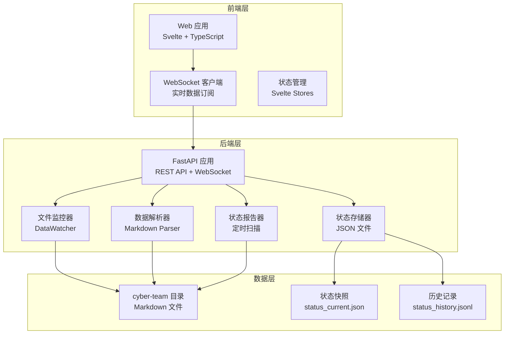

**图表来源**
- [backend/main.py:185-495](file://backend/main.py#L185-L495)
- [backend/watcher.py:8-52](file://backend/watcher.py#L8-L52)
- [backend/parser.py:16-509](file://backend/parser.py#L16-L509)
- [backend/status_storage.py:10-236](file://backend/status_storage.py#L10-L236)

**章节来源**
- [backend/main.py:1-495](file://backend/main.py#L1-L495)
- [backend/watcher.py:1-52](file://backend/watcher.py#L1-L52)
- [backend/parser.py:1-509](file://backend/parser.py#L1-L509)
- [backend/status_storage.py:1-236](file://backend/status_storage.py#L1-L236)

## 核心组件分析

### 文件监控器 (DataWatcher)

文件监控器是整个系统的核心组件之一，负责监听 cyber-team 目录的变化并触发相应的处理流程。

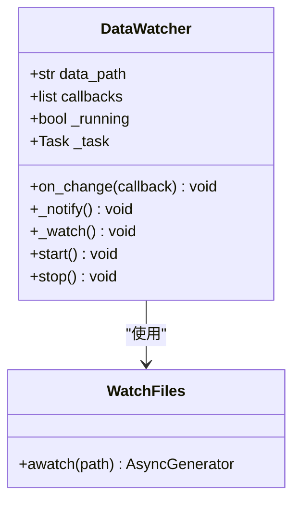

**图表来源**
- [backend/watcher.py:8-52](file://backend/watcher.py#L8-L52)

### Markdown 解析器

解析器负责将 Markdown 格式的任务文件转换为内部数据模型，支持多种数据类型的提取和转换。

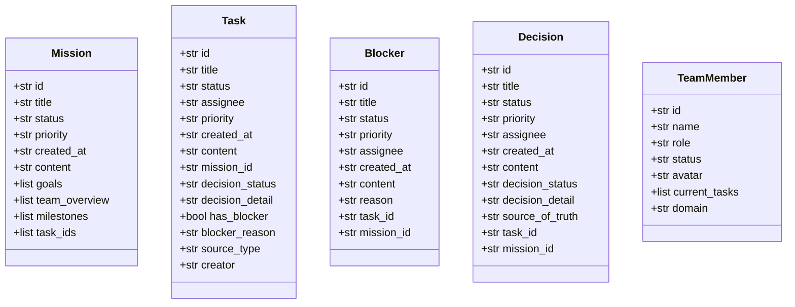

**图表来源**
- [backend/parser.py:17-92](file://backend/parser.py#L17-L92)

### 状态存储器

状态存储器负责管理实时状态数据的持久化和查询，包括快照管理和历史记录功能。

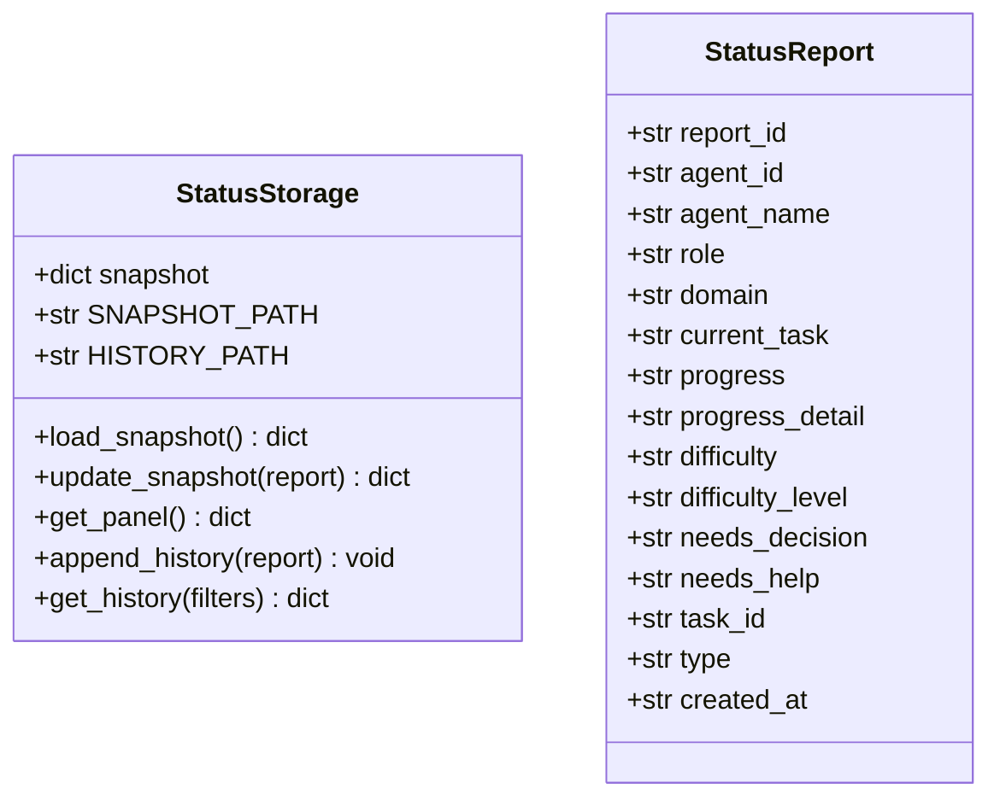

**图表来源**
- [backend/status_storage.py:62-236](file://backend/status_storage.py#L62-L236)

**章节来源**
- [backend/watcher.py:8-52](file://backend/watcher.py#L8-L52)
- [backend/parser.py:17-92](file://backend/parser.py#L17-L92)
- [backend/status_storage.py:62-236](file://backend/status_storage.py#L62-L236)

## 数据流架构总览

系统采用事件驱动的架构模式，通过文件监控触发数据解析，通过状态报告器定期更新实时状态，通过 WebSocket 实时广播给客户端。

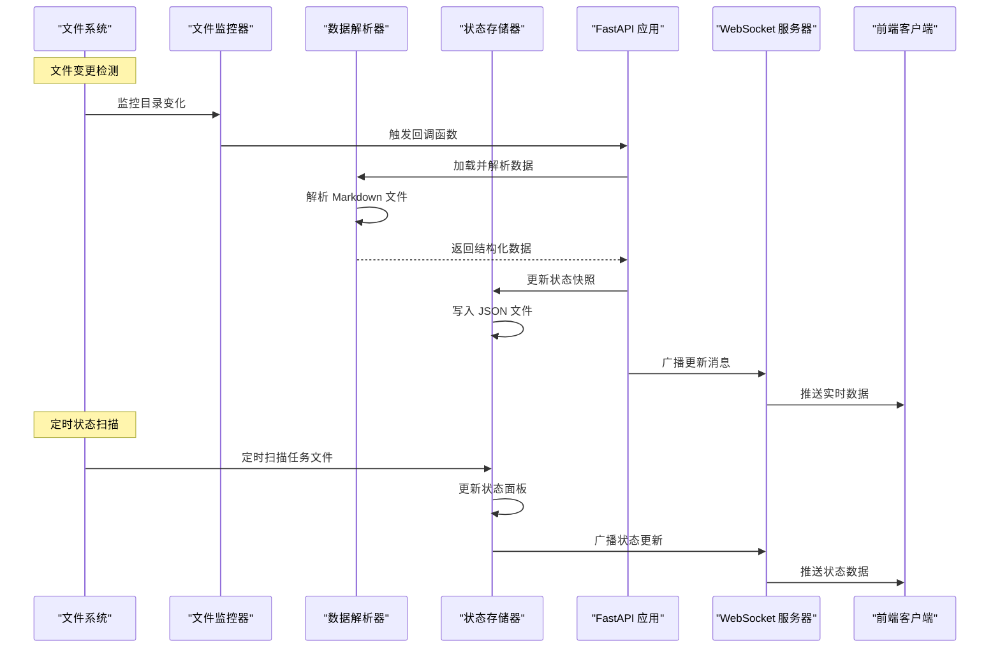

**图表来源**
- [backend/main.py:61-181](file://backend/main.py#L61-L181)
- [backend/watcher.py:29-40](file://backend/watcher.py#L29-L40)
- [backend/parser.py:441-509](file://backend/parser.py#L441-L509)
- [backend/status_storage.py:102-126](file://backend/status_storage.py#L102-L126)

## 详细数据流分析

### 文件监控到数据解析的数据流

系统通过 DataWatcher 组件监听 cyber-team 目录的变化，当检测到文件变更时，触发数据重新加载和解析流程。

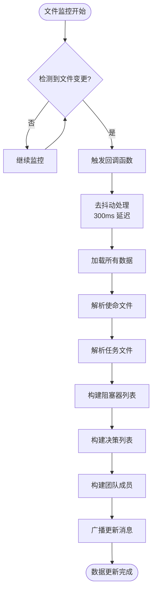

**图表来源**
- [backend/main.py:61-94](file://backend/main.py#L61-L94)
- [backend/watcher.py:21-34](file://backend/watcher.py#L21-L34)
- [backend/parser.py:441-509](file://backend/parser.py#L441-L509)

### 状态报告器的工作流程

状态报告器采用定时扫描机制，每60秒扫描一次任务文件，提取执行者、状态、困难和待决策信息。

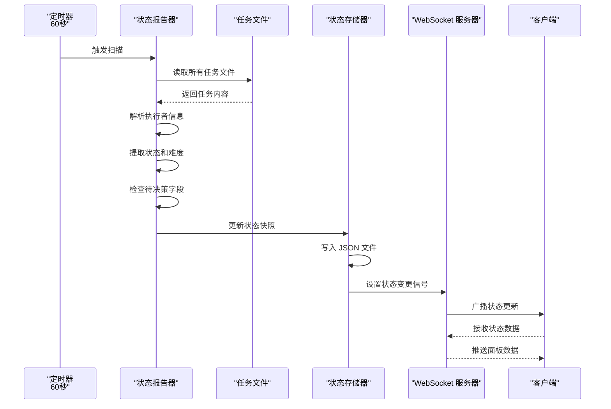

**图表来源**
- [backend/main.py:96-167](file://backend/main.py#L96-L167)
- [backend/status_reporter.py:189-244](file://backend/status_reporter.py#L189-L244)
- [backend/status_storage.py:102-126](file://backend/status_storage.py#L102-L126)

### WebSocket 实时广播机制

系统提供两种 WebSocket 通道：通用数据通道和专用状态通道，分别处理不同类型的数据更新。

```mermaid
graph LR
subgraph "WebSocket 通道"
WS1[/ws<br/>通用数据通道]
WS2[/ws/status<br/>状态专用通道]
end
subgraph "广播机制"
B1[去抖动广播<br/>300ms 延迟]
B2[状态变更广播<br/>事件驱动]
B3[心跳保持<br/>30秒超时]
end
subgraph "客户端连接"
C1[前端数据客户端]
C2[前端状态客户端]
end
WS1 --> B1
WS2 --> B2
B1 --> C1
B2 --> C2
B3 --> C1
B3 --> C2
```

**图表来源**
- [backend/main.py:396-477](file://backend/main.py#L396-L477)
- [frontend/src/lib/ws.ts:26-74](file://frontend/src/lib/ws.ts#L26-L74)
- [frontend/src/lib/status-ws.ts:18-68](file://frontend/src/lib/status-ws.ts#L18-L68)

**章节来源**
- [backend/main.py:61-181](file://backend/main.py#L61-L181)
- [backend/watcher.py:29-40](file://backend/watcher.py#L29-L40)
- [backend/parser.py:441-509](file://backend/parser.py#L441-L509)
- [backend/status_reporter.py:189-244](file://backend/status_reporter.py#L189-L244)
- [backend/status_storage.py:102-126](file://backend/status_storage.py#L102-L126)

## 数据转换与映射

### 文件格式到内部数据模型的映射

系统通过多种解析策略将 Markdown 文件转换为内部数据模型：

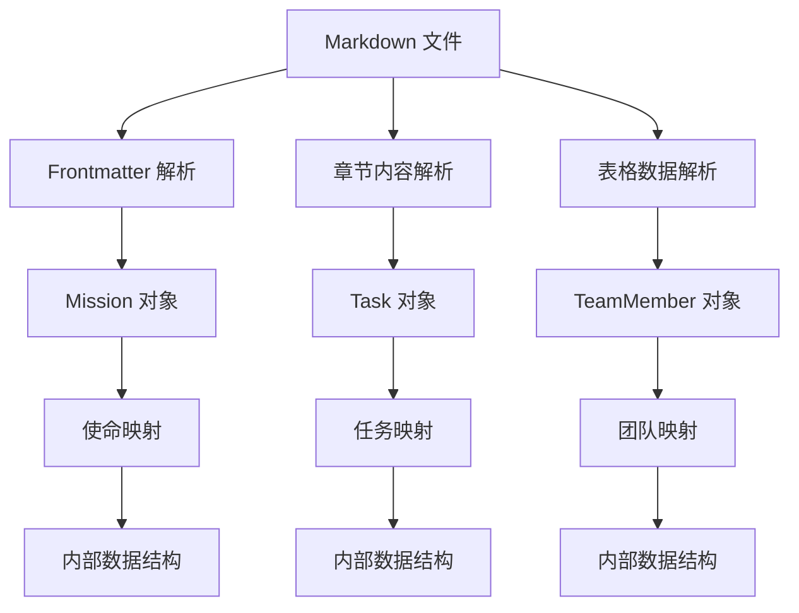

**图表来源**
- [backend/parser.py:123-200](file://backend/parser.py#L123-L200)
- [backend/parser.py:203-342](file://backend/parser.py#L203-L342)
- [backend/parser.py:345-391](file://backend/parser.py#L345-L391)

### 状态聚合算法

状态聚合算法负责将多个任务的状态信息汇总为团队级别的状态面板：

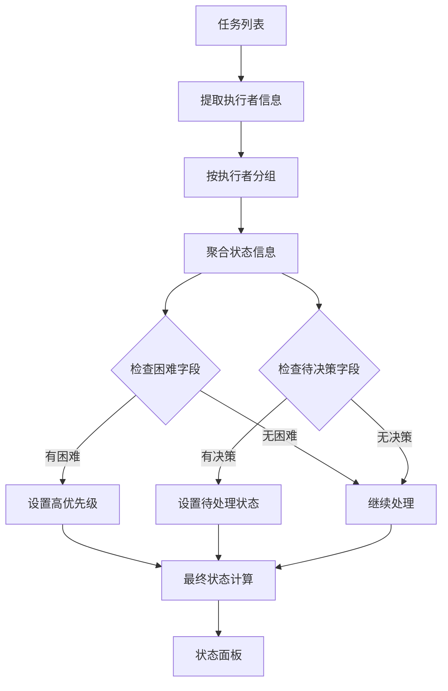

**图表来源**
- [backend/status_reporter.py:235-243](file://backend/status_reporter.py#L235-L243)

### 事件去抖动机制

系统采用去抖动机制防止频繁的文件变更导致的过度更新：

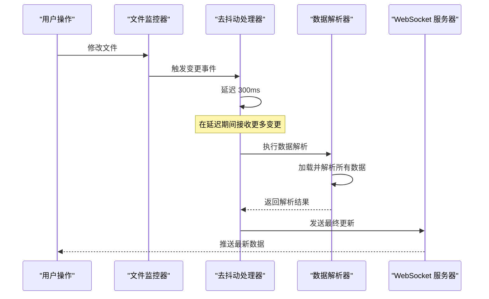

**图表来源**
- [backend/main.py:86-94](file://backend/main.py#L86-L94)

**章节来源**
- [backend/parser.py:123-391](file://backend/parser.py#L123-L391)
- [backend/status_reporter.py:189-243](file://backend/status_reporter.py#L189-L243)
- [backend/main.py:86-94](file://backend/main.py#L86-L94)

## 状态管理与缓存策略

### 缓存策略

系统采用多层缓存策略确保数据访问的高效性：

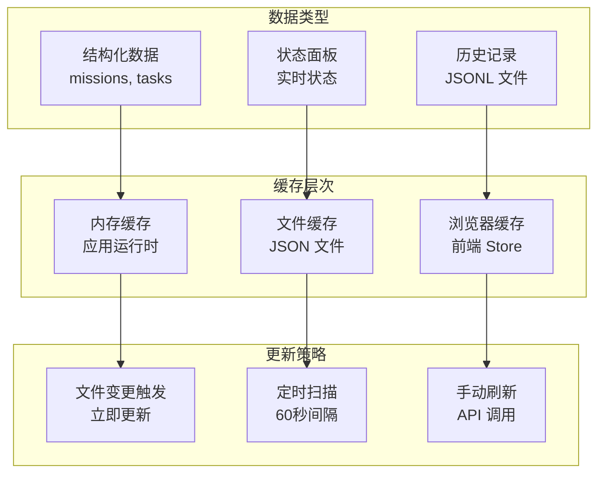

**图表来源**
- [backend/status_storage.py:62-126](file://backend/status_storage.py#L62-L126)
- [frontend/src/lib/stores/index.ts:1-46](file://frontend/src/lib/stores/index.ts#L1-L46)

### 数据一致性保证

系统通过以下机制保证数据的一致性：

1. **原子性更新**：状态快照的更新采用原子写入，确保文件完整性
2. **时间戳跟踪**：所有状态更新都包含精确的时间戳
3. **过期检测**：客户端可以检测到超过阈值时间未更新的状态
4. **冲突解决**：多源数据合并时采用最后更新优先的原则

**章节来源**
- [backend/status_storage.py:62-126](file://backend/status_storage.py#L62-L126)
- [frontend/src/lib/stores/index.ts:1-46](file://frontend/src/lib/stores/index.ts#L1-L46)

## 性能考虑

### 异步处理优化

系统广泛采用异步编程模式提高并发处理能力：

- **文件监控**：使用 `watchfiles` 库进行高效的文件变更检测
- **WebSocket 处理**：异步处理多个客户端连接
- **定时任务**：后台线程处理状态扫描，不影响主线程响应
- **去抖动机制**：减少不必要的重复处理

### 内存管理

- **增量更新**：只处理发生变化的文件，而非全量扫描
- **对象池**：复用解析器和存储器实例
- **垃圾回收**：及时清理不再使用的临时数据

### 网络优化

- **连接池**：复用 WebSocket 连接
- **心跳机制**：30秒超时检测网络异常
- **重连策略**：指数退避重连，最长10秒延迟

## 故障排除指南

### 常见问题诊断

1. **文件监控失效**
   - 检查 `CYBER_TEAM_DIR` 环境变量是否正确设置
   - 验证目录权限和路径有效性
   - 查看监控器日志输出

2. **数据解析错误**
   - 检查 Markdown 文件格式是否符合规范
   - 验证 frontmatter 字段的正确性
   - 确认文件编码为 UTF-8

3. **WebSocket 连接问题**
   - 检查 CORS 配置
   - 验证防火墙设置
   - 查看客户端控制台错误信息

4. **状态显示异常**
   - 检查 `status_current.json` 文件完整性
   - 验证历史记录文件格式
   - 确认定时任务正常运行

### 日志分析

系统提供了详细的日志输出，包括：
- 文件监控事件日志
- 数据解析进度日志  
- WebSocket 连接状态日志
- 错误处理和异常日志

**章节来源**
- [backend/main.py:120-181](file://backend/main.py#L120-L181)
- [backend/watcher.py:31-34](file://backend/watcher.py#L31-L34)

## 结论

SynapseOS 2.0 通过精心设计的数据流架构，实现了从文件监控到实时广播的完整数据处理链路。系统采用事件驱动的设计模式，结合去抖动机制、多层缓存策略和异步处理技术，确保了数据处理的高效性和实时性。

关键特性包括：
- **实时性**：文件变更检测到数据更新的延迟小于 300ms
- **可靠性**：通过原子写入和过期检测保证数据一致性
- **可扩展性**：模块化的组件设计便于功能扩展
- **用户体验**：智能的去抖动和心跳机制提供流畅的交互体验

该架构为类似的任务管理系统提供了良好的参考模式，特别是在需要实时数据同步和复杂状态管理的应用场景中。