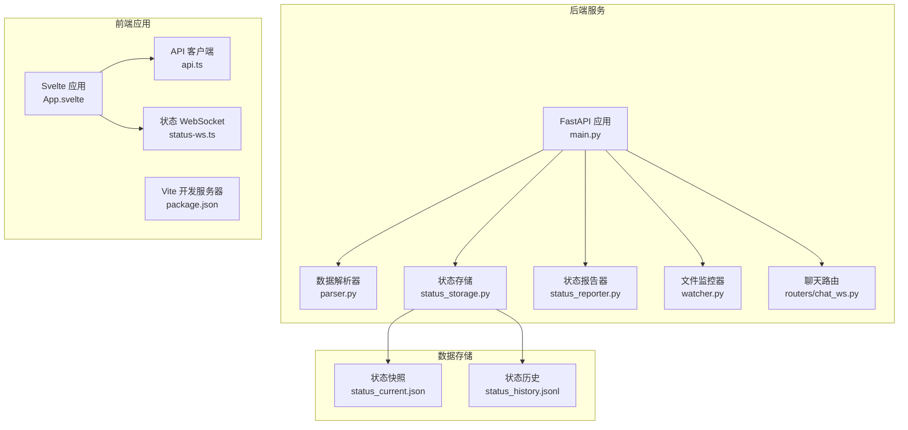
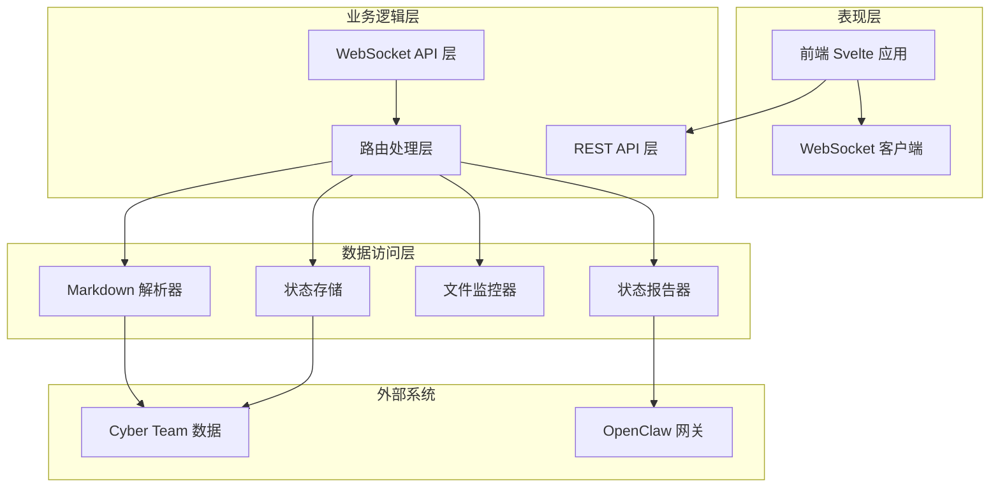
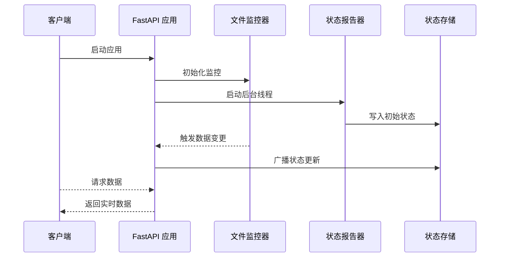
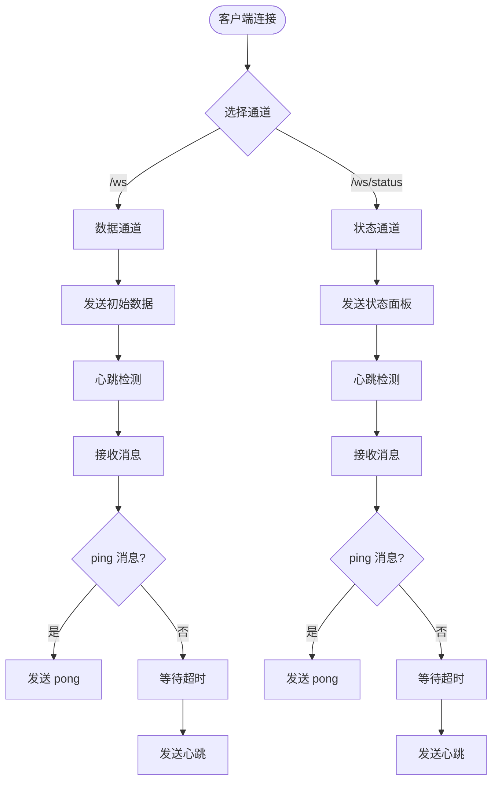
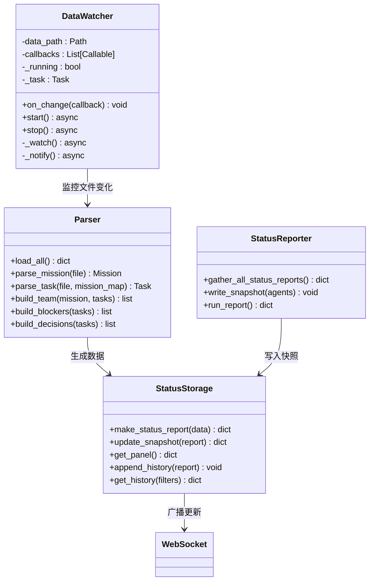
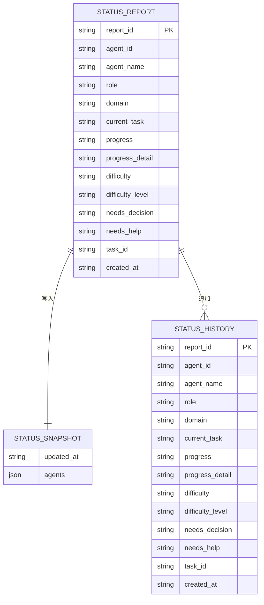
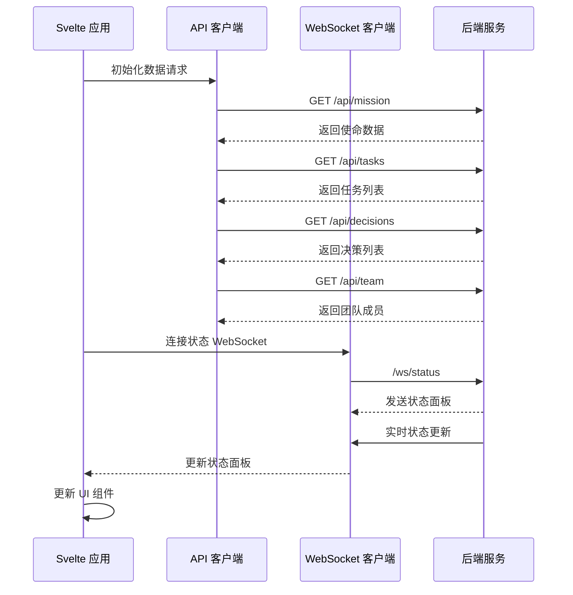
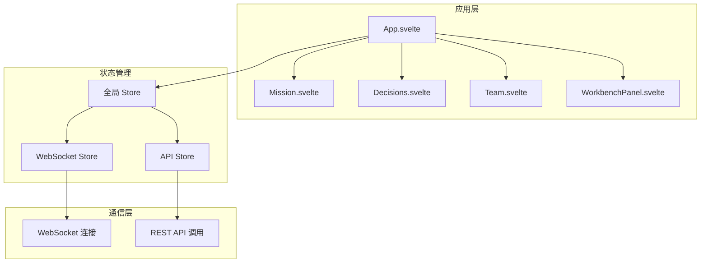
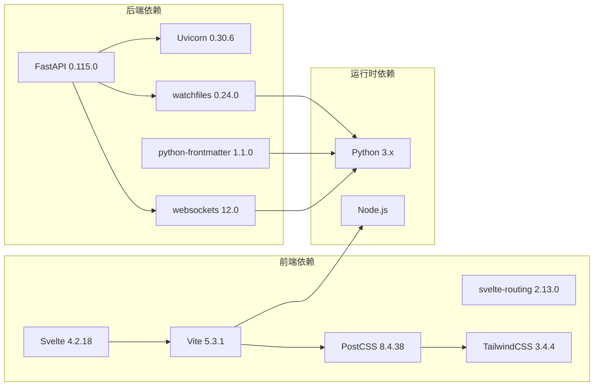
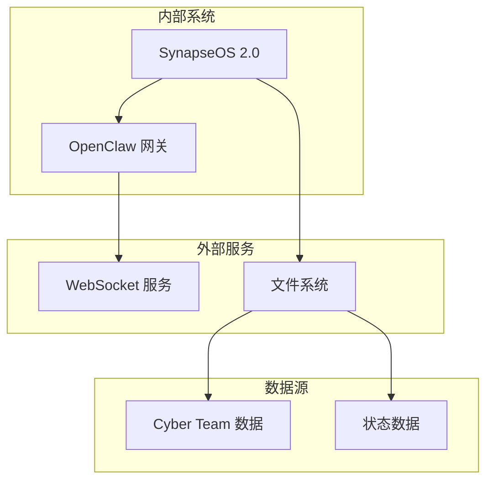

# 整体架构设计

<cite>
**本文档引用的文件**
- [backend/main.py](file://backend/main.py)
- [backend/parser.py](file://backend/parser.py)
- [backend/status_storage.py](file://backend/status_storage.py)
- [backend/status_reporter.py](file://backend/status_reporter.py)
- [backend/watcher.py](file://backend/watcher.py)
- [backend/routers/chat_ws.py](file://backend/routers/chat_ws.py)
- [backend/requirements.txt](file://backend/requirements.txt)
- [frontend/src/lib/api.ts](file://frontend/src/lib/api.ts)
- [frontend/src/lib/status-ws.ts](file://frontend/src/lib/status-ws.ts)
- [frontend/src/App.svelte](file://frontend/src/App.svelte)
- [frontend/src/main.ts](file://frontend/src/main.ts)
- [frontend/package.json](file://frontend/package.json)
- [run.sh](file://run.sh)
</cite>

## 目录
1. [引言](#引言)
2. [项目结构](#项目结构)
3. [核心组件](#核心组件)
4. [架构总览](#架构总览)
5. [详细组件分析](#详细组件分析)
6. [依赖关系分析](#依赖关系分析)
7. [性能考虑](#性能考虑)
8. [故障排除指南](#故障排除指南)
9. [结论](#结论)

## 引言
SynapseOS 2.0 是一个基于前后端分离架构的实时协作与状态监控平台。后端采用 FastAPI 提供 REST API 和 WebSocket 服务，前端使用 Svelte 构建响应式用户界面。系统通过文件监控机制实现事件驱动的数据更新，并通过 WebSocket 实现实时通信。该文档详细阐述了系统的分层架构、微服务风格的设计原则、事件驱动机制以及性能优化策略。

## 项目结构
项目采用清晰的分层组织：
- backend/: FastAPI 后端服务，包含核心业务逻辑、数据解析、状态管理
- frontend/: Svelte 前端应用，包含组件化 UI 和实时通信
- data/: 状态数据存储目录
- logs/: 应用日志目录
- tests/: 单元测试文件
- run.sh: 一键启动脚本

**图表来源**
- [backend/main.py:185-495](file://backend/main.py#L185-L495)
- [frontend/src/App.svelte:1-290](file://frontend/src/App.svelte#L1-L290)

**章节来源**
- [run.sh:120-192](file://run.sh#L120-L192)

## 核心组件
系统由以下核心组件构成：

### 后端核心组件
- **FastAPI 应用**: 提供 REST API 和 WebSocket 服务
- **数据解析器**: 解析 Markdown 格式的任务和使命数据
- **状态存储**: 管理状态快照和历史记录
- **状态报告器**: 定时扫描任务文件生成状态报告
- **文件监控器**: 监控数据文件变化触发更新
- **聊天路由**: 连接 OpenClaw 网关的 WebSocket 服务

### 前端核心组件
- **Svelte 应用**: 主应用容器和路由管理
- **API 客户端**: REST API 调用封装
- **状态 WebSocket**: 实时状态更新订阅
- **Vite 开发服务器**: 前端构建和热重载

**章节来源**
- [backend/main.py:185-495](file://backend/main.py#L185-L495)
- [frontend/src/App.svelte:1-290](file://frontend/src/App.svelte#L1-L290)

## 架构总览
SynapseOS 2.0 采用分层架构模式，实现了表现层、业务逻辑层和数据访问层的清晰分离。

**图表来源**
- [backend/main.py:185-495](file://backend/main.py#L185-L495)
- [backend/routers/chat_ws.py:174-349](file://backend/routers/chat_ws.py#L174-L349)

### 分层架构设计理念
1. **表现层**: 负责用户交互和数据展示，使用 Svelte 组件化架构
2. **业务逻辑层**: 提供统一的 API 接口，处理业务规则和数据转换
3. **数据访问层**: 封装数据读写操作，提供抽象的数据访问接口

### 前后端分离架构实现
- **后端**: FastAPI 提供 REST API 和 WebSocket 服务
- **前端**: Svelte 构建静态资源，通过 fetch API 与后端通信
- **静态资源**: 后端直接托管前端构建产物

**章节来源**
- [backend/main.py:480-495](file://backend/main.py#L480-L495)
- [frontend/src/lib/api.ts:75-181](file://frontend/src/lib/api.ts#L75-L181)

## 详细组件分析

### FastAPI 应用架构
后端应用采用生命周期管理和异步处理模式：

**图表来源**
- [backend/main.py:120-182](file://backend/main.py#L120-L182)
- [backend/watcher.py:29-40](file://backend/watcher.py#L29-L40)

#### WebSocket 实时通信
系统提供两种 WebSocket 通道：
- `/ws`: 数据更新通道，推送任务和使命数据
- `/ws/status`: 状态更新通道，推送实时状态面板

**图表来源**
- [backend/main.py:396-477](file://backend/main.py#L396-L477)

**章节来源**
- [backend/main.py:396-477](file://backend/main.py#L396-L477)

### 数据解析与状态管理
系统采用事件驱动架构，通过文件监控实现数据变更的实时响应：

**图表来源**
- [backend/watcher.py:8-52](file://backend/watcher.py#L8-L52)
- [backend/parser.py:441-509](file://backend/parser.py#L441-L509)
- [backend/status_storage.py:33-236](file://backend/status_storage.py#L33-L236)
- [backend/status_reporter.py:189-267](file://backend/status_reporter.py#L189-L267)

#### 状态面板设计
状态面板包含实时状态信息和过期检测功能：

**图表来源**
- [backend/status_storage.py:33-193](file://backend/status_storage.py#L33-L193)

**章节来源**
- [backend/status_storage.py:102-127](file://backend/status_storage.py#L102-L127)

### 前端架构设计
前端采用 Svelte 组件化架构，实现响应式数据绑定和实时状态更新：

**图表来源**
- [frontend/src/App.svelte:119-141](file://frontend/src/App.svelte#L119-L141)
- [frontend/src/lib/status-ws.ts:18-68](file://frontend/src/lib/status-ws.ts#L18-L68)

#### 组件交互模式
前端应用通过以下模式实现组件间通信：

**图表来源**
- [frontend/src/App.svelte:1-290](file://frontend/src/App.svelte#L1-L290)
- [frontend/src/lib/status-ws.ts:1-78](file://frontend/src/lib/status-ws.ts#L1-L78)

**章节来源**
- [frontend/src/App.svelte:1-290](file://frontend/src/App.svelte#L1-L290)

### 微服务风格设计
系统采用微服务风格的设计原则，实现模块化和松耦合：

#### 模块职责划分
- **数据解析模块**: 负责解析 Markdown 数据格式
- **状态管理模块**: 管理状态快照和历史记录
- **监控模块**: 监控文件变化并触发更新
- **报告模块**: 定时生成状态报告
- **通信模块**: 处理 WebSocket 连接和消息传递

#### 松耦合设计
- 各模块通过明确定义的接口进行交互
- 数据通过标准化的 JSON 格式传输
- 异步处理避免阻塞主线程
- 生命周期管理确保资源正确释放

**章节来源**
- [backend/parser.py:1-509](file://backend/parser.py#L1-L509)
- [backend/status_storage.py:1-236](file://backend/status_storage.py#L1-L236)

## 依赖关系分析

**图表来源**
- [backend/requirements.txt:1-6](file://backend/requirements.txt#L1-L6)
- [frontend/package.json:11-23](file://frontend/package.json#L11-L23)

### 外部系统集成
系统集成了多个外部服务：

**图表来源**
- [backend/routers/chat_ws.py:18-28](file://backend/routers/chat_ws.py#L18-L28)

**章节来源**
- [backend/requirements.txt:1-6](file://backend/requirements.txt#L1-L6)
- [frontend/package.json:11-23](file://frontend/package.json#L11-L23)

## 性能考虑
系统在设计时充分考虑了性能优化：

### 异步处理优化
- 使用 asyncio 实现非阻塞 I/O 操作
- WebSocket 连接池管理减少资源消耗
- 文件监控采用异步轮询避免阻塞

### 缓存策略
- 状态面板数据本地缓存
- WebSocket 连接状态持久化
- 历史数据分页加载

### 资源管理
- 生命周期管理确保资源正确释放
- 连接超时和心跳机制防止资源泄漏
- 线程池管理后台任务

## 故障排除指南
常见问题及解决方案：

### WebSocket 连接问题
- **问题**: WebSocket 连接频繁断开
- **原因**: 心跳检测超时或网络不稳定
- **解决**: 检查网络连接，调整心跳间隔

### 数据同步延迟
- **问题**: 前端数据显示滞后
- **原因**: 文件监控延迟或 WebSocket 缓冲
- **解决**: 检查文件权限，重启监控服务

### API 响应缓慢
- **问题**: REST API 响应时间过长
- **原因**: 数据量过大或数据库查询复杂
- **解决**: 优化查询条件，增加索引

**章节来源**
- [backend/main.py:420-477](file://backend/main.py#L420-L477)
- [frontend/src/lib/status-ws.ts:18-68](file://frontend/src/lib/status-ws.ts#L18-L68)

## 结论
SynapseOS 2.0 通过清晰的分层架构、前后端分离设计和事件驱动机制，构建了一个高效、可扩展的实时协作平台。系统采用微服务风格的设计原则，实现了模块化和松耦合，为后续的功能扩展和维护提供了良好的基础。通过异步处理和优化的资源管理策略，系统在保证实时性的同时也具备了良好的性能表现。