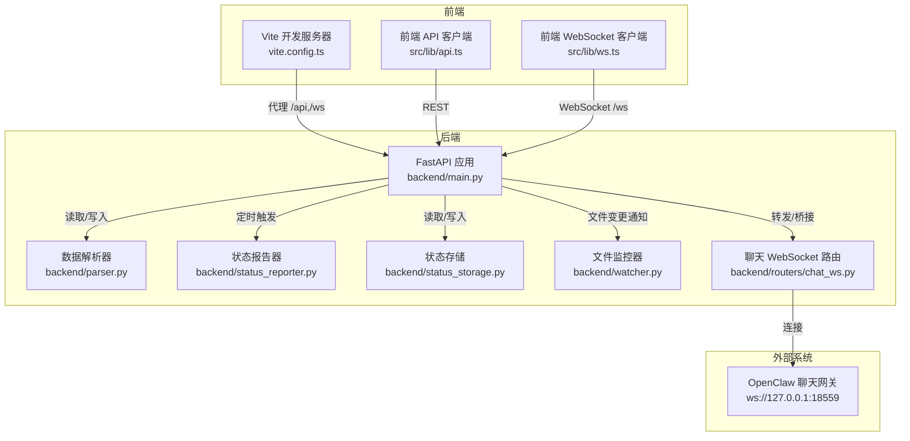
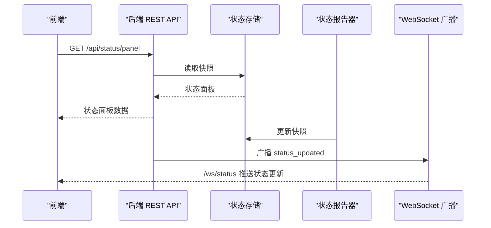
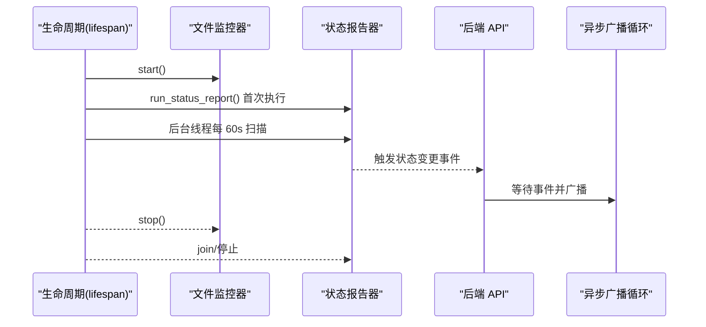
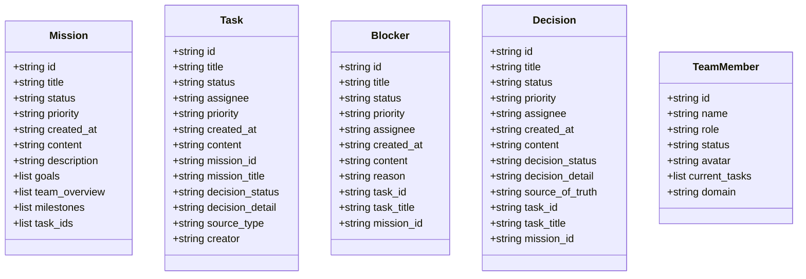
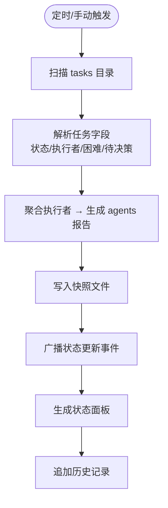
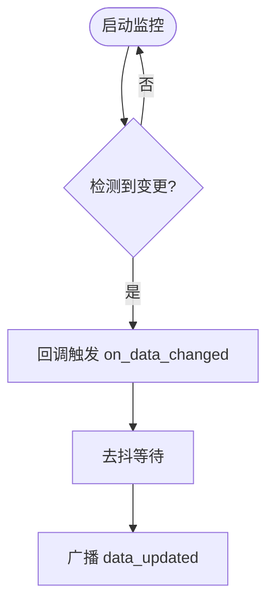
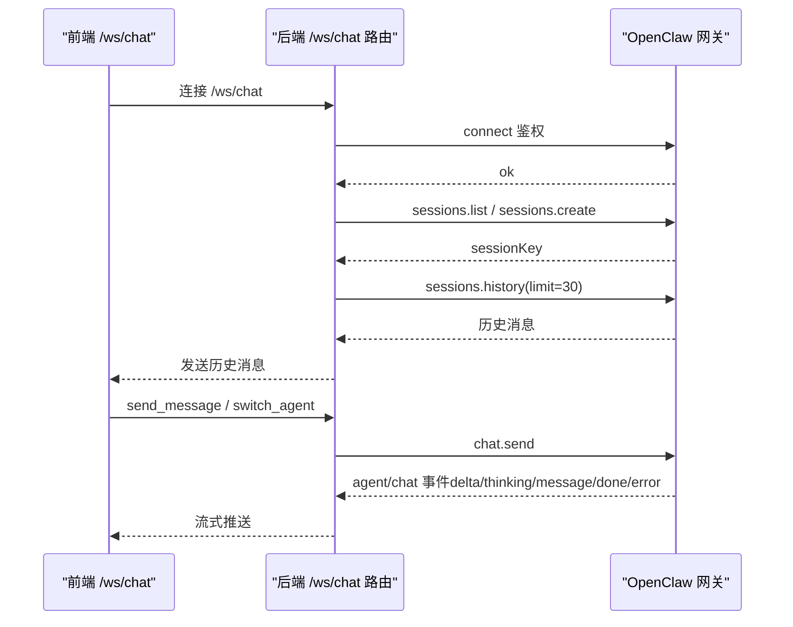
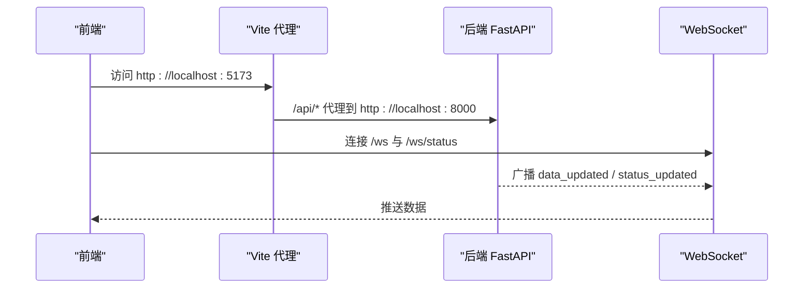
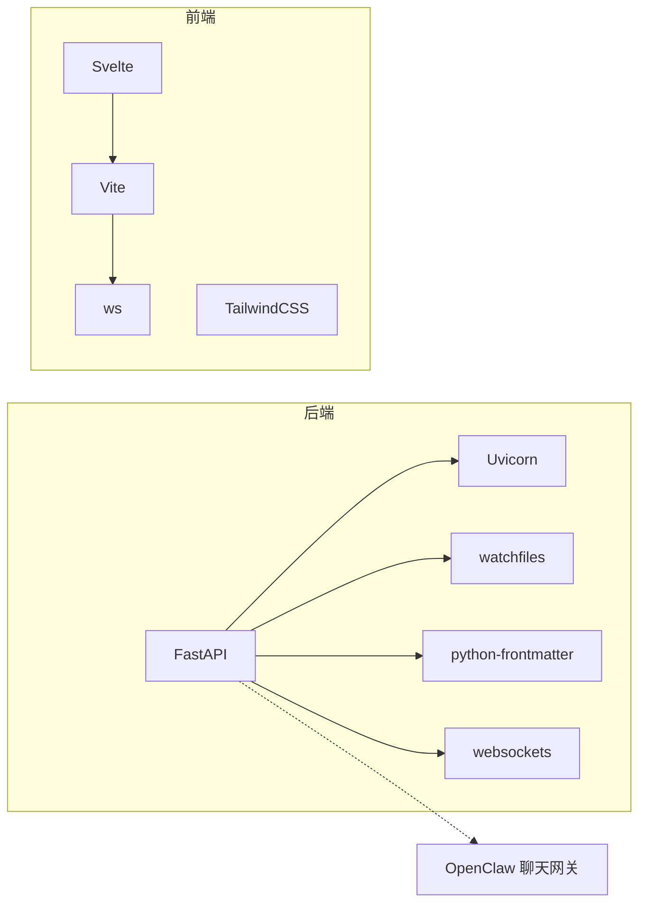

# 系统架构

<cite>
**本文引用的文件**
- [backend/main.py](file://backend/main.py)
- [backend/parser.py](file://backend/parser.py)
- [backend/status_reporter.py](file://backend/status_reporter.py)
- [backend/status_storage.py](file://backend/status_storage.py)
- [backend/watcher.py](file://backend/watcher.py)
- [backend/routers/chat_ws.py](file://backend/routers/chat_ws.py)
- [backend/requirements.txt](file://backend/requirements.txt)
- [frontend/package.json](file://frontend/package.json)
- [frontend/src/lib/api.ts](file://frontend/src/lib/api.ts)
- [frontend/src/lib/ws.ts](file://frontend/src/lib/ws.ts)
- [frontend/vite.config.ts](file://frontend/vite.config.ts)
- [run.sh](file://run.sh)
- [data/status_current.json](file://data/status_current.json)
- [tests/test_chat_delta.py](file://tests/test_chat_delta.py)
</cite>

## 目录
1. [简介](#简介)
2. [项目结构](#项目结构)
3. [核心组件](#核心组件)
4. [架构总览](#架构总览)
5. [详细组件分析](#详细组件分析)
6. [依赖关系分析](#依赖关系分析)
7. [性能与可扩展性](#性能与可扩展性)
8. [故障排查指南](#故障排查指南)
9. [结论](#结论)
10. [附录](#附录)

## 简介
SynapseOS 2.0 是一个前后端分离的实时协作与状态可视化平台，采用微服务风格的模块化设计与事件驱动模式。后端基于 FastAPI + Uvicorn 提供 REST API 与 WebSocket 服务，前端使用 Svelte + Vite 构建，通过 WebSocket 实时接收数据更新，并通过 REST API 获取静态数据与状态历史。系统通过文件监控与定时任务实现事件驱动的数据刷新与状态快照，同时通过独立的聊天 WebSocket 网关桥接 OpenClaw 的工作台能力。

## 项目结构
- 后端
  - 主应用入口与路由：backend/main.py
  - 数据解析器：backend/parser.py
  - 状态报告与存储：backend/status_reporter.py、backend/status_storage.py
  - 文件监控：backend/watcher.py
  - 聊天 WebSocket 路由：backend/routers/chat_ws.py
  - 依赖声明：backend/requirements.txt
- 前端
  - 应用入口与构建配置：frontend/src/lib/api.ts、frontend/src/lib/ws.ts、frontend/vite.config.ts
  - 依赖声明：frontend/package.json
- 运维与示例
  - 启动脚本：run.sh
  - 示例状态快照：data/status_current.json
  - 聊天流式测试：tests/test_chat_delta.py

图表来源
- [backend/main.py:184-495](file://backend/main.py#L184-L495)
- [backend/parser.py:440-509](file://backend/parser.py#L440-L509)
- [backend/status_reporter.py:258-267](file://backend/status_reporter.py#L258-L267)
- [backend/status_storage.py:62-136](file://backend/status_storage.py#L62-L136)
- [backend/watcher.py:8-52](file://backend/watcher.py#L8-L52)
- [backend/routers/chat_ws.py:139-319](file://backend/routers/chat_ws.py#L139-L319)
- [frontend/src/lib/api.ts:75-181](file://frontend/src/lib/api.ts#L75-L181)
- [frontend/src/lib/ws.ts:19-84](file://frontend/src/lib/ws.ts#L19-L84)
- [frontend/vite.config.ts:11-22](file://frontend/vite.config.ts#L11-L22)

章节来源
- [backend/main.py:184-495](file://backend/main.py#L184-L495)
- [frontend/vite.config.ts:11-22](file://frontend/vite.config.ts#L11-L22)

## 核心组件
- FastAPI 应用与生命周期管理：负责 REST API、WebSocket、静态资源挂载与应用生命周期（启动/关闭）。
- 数据解析器：从 Markdown 任务与使命文件中抽取结构化数据，构建任务、决策、阻塞与团队视图。
- 状态报告器：周期性扫描任务文件，生成状态快照并写入本地 JSON，支持“困难”“待决策”等事件类型。
- 状态存储：维护实时状态面板与历史记录，提供查询与分页能力。
- 文件监控器：异步监控数据目录变化，触发广播与状态刷新。
- 聊天 WebSocket 路由：桥接 OpenClaw 聊天网关，实现会话管理、历史拉取与流式响应。
- 前端 API 客户端与 WebSocket 客户端：封装 REST 与 WebSocket 调用，管理连接与重连策略。

章节来源
- [backend/main.py:184-495](file://backend/main.py#L184-L495)
- [backend/parser.py:440-509](file://backend/parser.py#L440-L509)
- [backend/status_reporter.py:258-267](file://backend/status_reporter.py#L258-L267)
- [backend/status_storage.py:62-136](file://backend/status_storage.py#L62-L136)
- [backend/watcher.py:8-52](file://backend/watcher.py#L8-L52)
- [backend/routers/chat_ws.py:139-319](file://backend/routers/chat_ws.py#L139-L319)
- [frontend/src/lib/api.ts:75-181](file://frontend/src/lib/api.ts#L75-L181)
- [frontend/src/lib/ws.ts:19-84](file://frontend/src/lib/ws.ts#L19-L84)

## 架构总览
- 高层设计
  - 前后端分离：前端通过 REST 与 WebSocket 与后端交互；后端不直接渲染页面，静态资源由后端挂载或由前端独立运行。
  - 微服务风格：各模块职责清晰，解析、状态、监控、聊天分别独立，通过事件与接口耦合。
  - 事件驱动：文件监控与定时任务驱动数据刷新与状态广播；WebSocket 广播实时推送。
- 系统边界
  - 内部：SynapseOS 2.0 自身的数据目录、状态快照与历史文件。
  - 外部：OpenClaw 聊天网关（WebSocket），用于工作台对话与流式输出。
- 数据流向
  - 任务/使命文件 → 解析器 → 结构化数据 → REST API 与 WebSocket 广播。
  - 任务文件 → 状态报告器 → 状态快照 → 状态面板 WebSocket 广播。
  - 前端 → REST API 查询 → 后端读取快照/历史。
  - 前端 → 聊天 WebSocket → 后端 → OpenClaw 网关 → 流式响应回前端。

图表来源
- [backend/main.py:317-385](file://backend/main.py#L317-L385)
- [backend/status_storage.py:102-127](file://backend/status_storage.py#L102-L127)
- [backend/status_reporter.py:258-267](file://backend/status_reporter.py#L258-L267)

## 详细组件分析

### 后端应用与生命周期（FastAPI）
- 职责
  - 注册 CORS、静态文件挂载、WebSocket 路由注册。
  - 生命周期管理：启动时初始化文件监控、首次状态报告、后台线程；关闭时清理资源。
  - REST API：任务、决策、团队、注册表、状态面板、历史查询等。
  - WebSocket：通用数据更新通道与专用状态通道。
- 关键流程
  - 启动：DataWatcher 启动监听；run_status_report 首次执行；后台线程每 60 秒扫描任务文件；异步广播循环监听状态变更事件。
  - 关闭：停止后台线程、取消广播任务、停止文件监控。
- 事件驱动
  - 文件变更 → on_data_changed → 去抖后广播 data_updated。
  - 状态报告器写入快照 → 设置事件标志 → 异步广播 status_updated/difficulty_reported/decision_requested。

图表来源
- [backend/main.py:119-182](file://backend/main.py#L119-L182)
- [backend/watcher.py:36-52](file://backend/watcher.py#L36-L52)
- [backend/status_reporter.py:105-117](file://backend/status_reporter.py#L105-L117)

章节来源
- [backend/main.py:119-182](file://backend/main.py#L119-L182)
- [backend/main.py:184-495](file://backend/main.py#L184-L495)

### 数据解析器（Markdown → 结构化数据）
- 职责
  - 从 missions 与 tasks 目录加载 Markdown 文件，解析元数据与正文，构建 Mission、Task、Blocker、Decision、TeamMember 等模型。
  - 从任务文件中提取“果爸决策”“来源类型”“创建者”等字段，派生阻塞与决策视图。
- 复杂度与优化
  - 时间复杂度：O(N)（N 为任务/使命数量），按目录遍历与正则解析。
  - 优化：缓存解析结果、减少重复 IO；对大文本截断以控制内存占用。
- 数据模型

图表来源
- [backend/parser.py:17-92](file://backend/parser.py#L17-L92)

章节来源
- [backend/parser.py:440-509](file://backend/parser.py#L440-L509)

### 状态报告器与存储
- 状态报告器
  - 扫描 tasks 目录，解析任务状态、执行者、困难等级、待决策等，生成 agents 报告并写入快照文件。
  - 提供 run_report 供 API 调用或定时任务调用。
- 状态存储
  - 维护当前快照与历史 JSONL 文件，提供面板查询、历史过滤与分页。
  - 面板包含在线状态检测（stale）与下次上报时间计算。
- 事件类型
  - 根据报告内容自动判定事件类型：status_updated、difficulty_reported、decision_requested。

图表来源
- [backend/status_reporter.py:189-244](file://backend/status_reporter.py#L189-L244)
- [backend/status_storage.py:62-136](file://backend/status_storage.py#L62-L136)
- [backend/main.py:317-347](file://backend/main.py#L317-L347)

章节来源
- [backend/status_reporter.py:258-267](file://backend/status_reporter.py#L258-L267)
- [backend/status_storage.py:102-193](file://backend/status_storage.py#L102-L193)
- [backend/main.py:317-385](file://backend/main.py#L317-L385)

### 文件监控器
- 职责
  - 使用 watchfiles 异步监控数据目录，回调触发去抖后的广播。
- 特性
  - 去抖机制：WS_DEBOUNCE_MS 控制合并频繁变更。
  - 错误处理：回调异常不影响监控循环。

图表来源
- [backend/watcher.py:29-35](file://backend/watcher.py#L29-L35)
- [backend/main.py:61-94](file://backend/main.py#L61-L94)

章节来源
- [backend/watcher.py:8-52](file://backend/watcher.py#L8-L52)
- [backend/main.py:61-94](file://backend/main.py#L61-L94)

### 聊天 WebSocket 路由（OpenClaw 网关桥接）
- 职责
  - 连接 OpenClaw WebSocket 网关，鉴权后建立会话。
  - 拉取历史消息、切换代理、转发用户消息、流式回传 delta/thinking/message/end 等事件。
- 会话管理
  - 通过 AGENT_SESSION_KEYS 映射不同代理的会话键，确保多代理隔离。
- 错误处理
  - 网关连接异常、超时、错误事件均在前端以 error 类型提示。

图表来源
- [backend/routers/chat_ws.py:139-319](file://backend/routers/chat_ws.py#L139-L319)
- [tests/test_chat_delta.py:21-280](file://tests/test_chat_delta.py#L21-L280)

章节来源
- [backend/routers/chat_ws.py:139-319](file://backend/routers/chat_ws.py#L139-L319)
- [tests/test_chat_delta.py:21-280](file://tests/test_chat_delta.py#L21-L280)

### 前端集成
- API 客户端
  - 封装 /api/* 接口，包括任务、决策、团队、状态面板、历史查询等。
- WebSocket 客户端
  - 连接 /ws（数据更新）与 /ws/status（状态更新），处理心跳、去抖更新与重连。
- 开发代理
  - Vite 代理将 /api → backend:8000，/ws → backend:8000 的 WebSocket。

图表来源
- [frontend/src/lib/api.ts:75-181](file://frontend/src/lib/api.ts#L75-L181)
- [frontend/src/lib/ws.ts:19-84](file://frontend/src/lib/ws.ts#L19-L84)
- [frontend/vite.config.ts:11-22](file://frontend/vite.config.ts#L11-L22)

章节来源
- [frontend/src/lib/api.ts:75-181](file://frontend/src/lib/api.ts#L75-L181)
- [frontend/src/lib/ws.ts:19-84](file://frontend/src/lib/ws.ts#L19-L84)
- [frontend/vite.config.ts:11-22](file://frontend/vite.config.ts#L11-L22)

## 依赖关系分析
- 技术栈
  - 后端：FastAPI、Uvicorn、watchfiles、python-frontmatter、websockets。
  - 前端：Svelte、Vite、TailwindCSS、ws。
- 第三方集成
  - OpenClaw 聊天网关：WebSocket 协议，支持流式事件（agent/chat/session.message）。
- 版本兼容性
  - 后端依赖版本在 requirements.txt 中明确；前端依赖在 package.json 中声明。
- 外部依赖与约束
  - 需要本地 OpenClaw 网关（ws://127.0.0.1:18559）可用，否则聊天功能不可用。
  - 需要可访问的 cyber-team 数据目录（默认路径可通过环境变量配置）。

图表来源
- [backend/requirements.txt:1-6](file://backend/requirements.txt#L1-L6)
- [frontend/package.json:11-23](file://frontend/package.json#L11-L23)

章节来源
- [backend/requirements.txt:1-6](file://backend/requirements.txt#L1-L6)
- [frontend/package.json:11-23](file://frontend/package.json#L11-L23)

## 性能与可扩展性
- 性能特性
  - 去抖广播：WS_DEBOUNCE_MS 减少频繁变更导致的广播风暴。
  - 异步 I/O：watchfiles 与 asyncio 提升并发处理能力。
  - 历史查询分页：限制每页最大条数，避免一次性加载过多历史。
- 可扩展性建议
  - 状态面板与历史查询可引入数据库（如 SQLite/PostgreSQL）替代 JSON/JSONL，提升查询效率与并发能力。
  - 文件监控可扩展为消息队列（如 Kafka/RabbitMQ）以支持分布式部署与多实例协调。
  - 聊天网关可引入连接池与超时重试策略，增强稳定性。
  - 前端可引入缓存策略与增量更新，降低渲染压力。
- 基础设施要求
  - CPU：轻量级，适合单机部署。
  - 内存：解析与广播场景下约 512MB~1GB。
  - 存储：JSON/JSONL 文件较小，磁盘空间需求低。
  - 网络：本地 OpenClaw 网关可达，WebSocket 与 HTTP 服务暴露于内网或反向代理后对外提供。

[本节为通用性能讨论，无需特定文件来源]

## 故障排查指南
- 启动与日志
  - 使用 run.sh start 启动后，查看 logs/synapse_backend.log 与 logs/synapse_frontend.log。
  - 使用 run.sh status 检查进程状态。
- WebSocket 连接问题
  - 前端 /ws：检查 Vite 代理配置是否正确指向 backend:8000。
  - 前端 /ws/status：确认后端广播循环是否运行。
- 聊天功能问题
  - 确认 OpenClaw 网关地址与 Token 正确。
  - 使用 tests/test_chat_delta.py 验证网关是否产生 delta/thinking/message 等事件。
- 状态面板为空
  - 确认 CYBER_TEAM_DIR 指向正确的任务/使命目录。
  - 首次启动后端会执行一次状态报告，若无任务文件则面板为空属正常。

章节来源
- [run.sh:120-192](file://run.sh#L120-L192)
- [frontend/vite.config.ts:11-22](file://frontend/vite.config.ts#L11-L22)
- [tests/test_chat_delta.py:21-280](file://tests/test_chat_delta.py#L21-L280)
- [backend/main.py:129-135](file://backend/main.py#L129-L135)

## 结论
SynapseOS 2.0 通过前后端分离与微服务风格的模块化设计，结合事件驱动与实时 WebSocket 广播，实现了从任务/使命数据到状态面板与聊天桥接的完整闭环。系统具备良好的可扩展性与运维友好性，适合在企业内部团队协作与状态可视化场景中部署与演进。

[本节为总结性内容，无需特定文件来源]

## 附录
- 部署拓扑
  - 单机部署：后端与前端在同一主机，前端通过 Vite 代理访问后端。
  - 生产部署：后端通过反向代理对外暴露，前端打包后由 Nginx 提供静态资源。
- 安全性
  - CORS 已启用，生产环境建议限制允许来源。
  - 聊天网关鉴权需妥善保护 Token。
- 监控与灾备
  - 建议接入日志聚合与告警系统，监控后端进程与 WebSocket 连接数。
  - 状态快照与历史文件定期备份，确保数据可恢复。

[本节为概念性内容，无需特定文件来源]