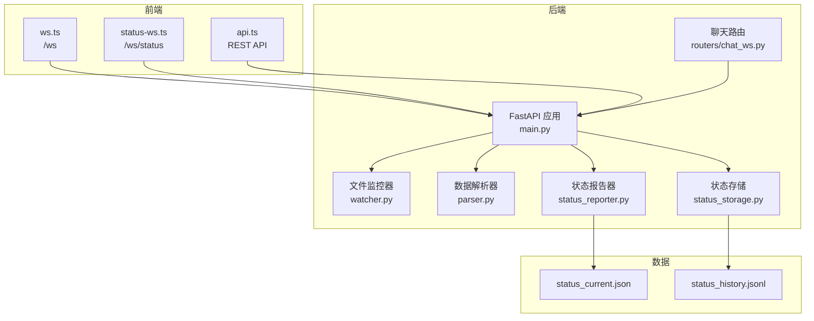
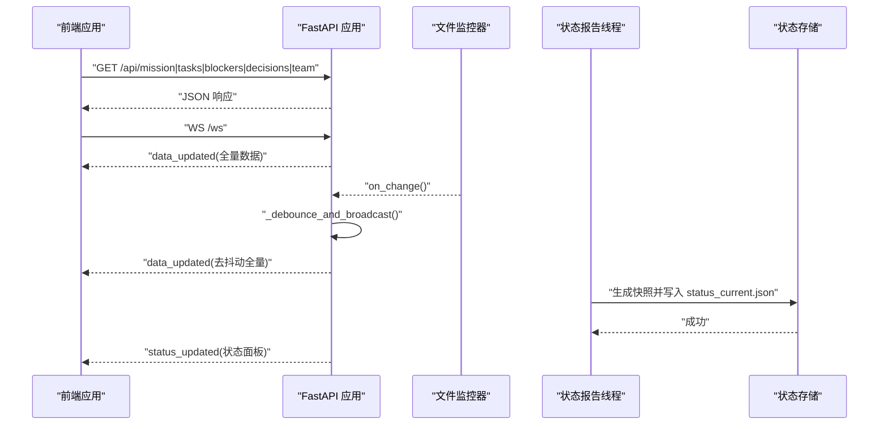
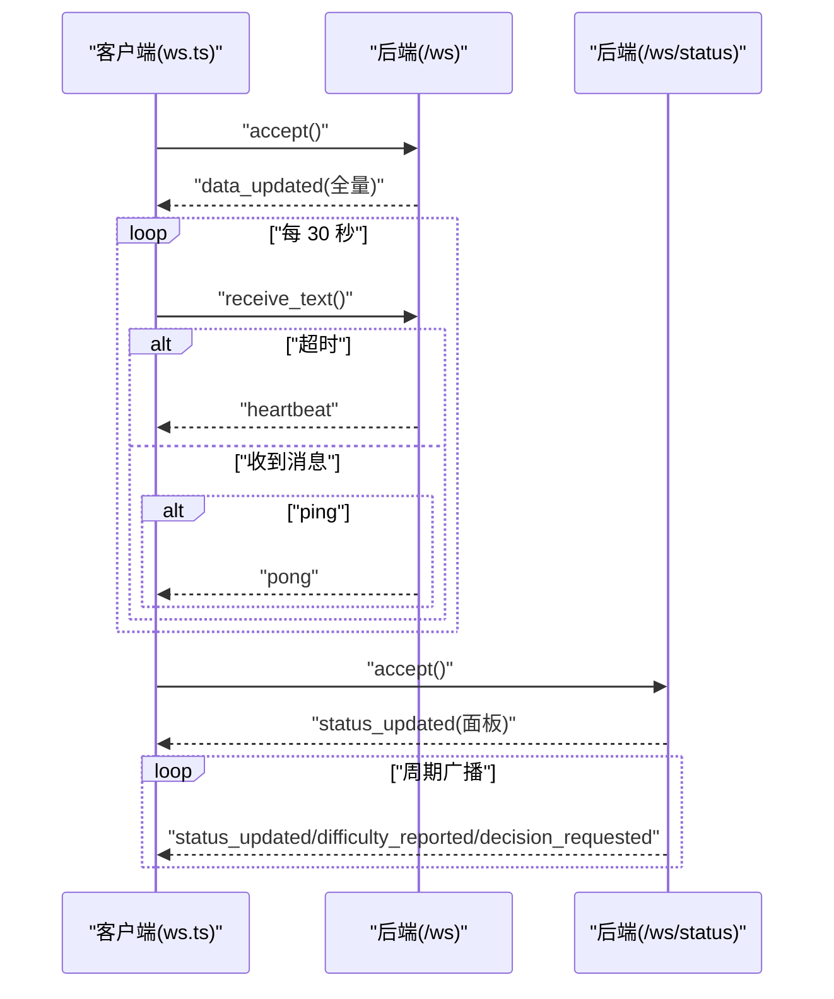
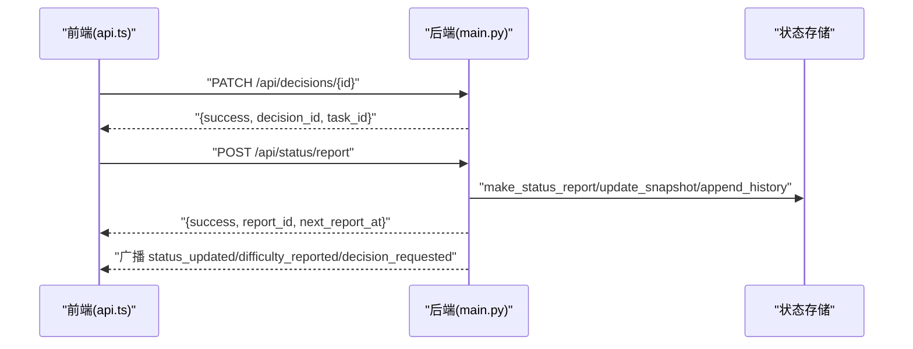
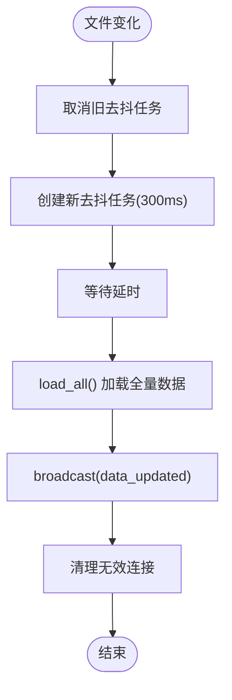
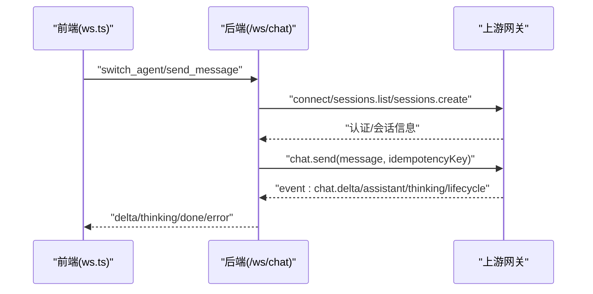
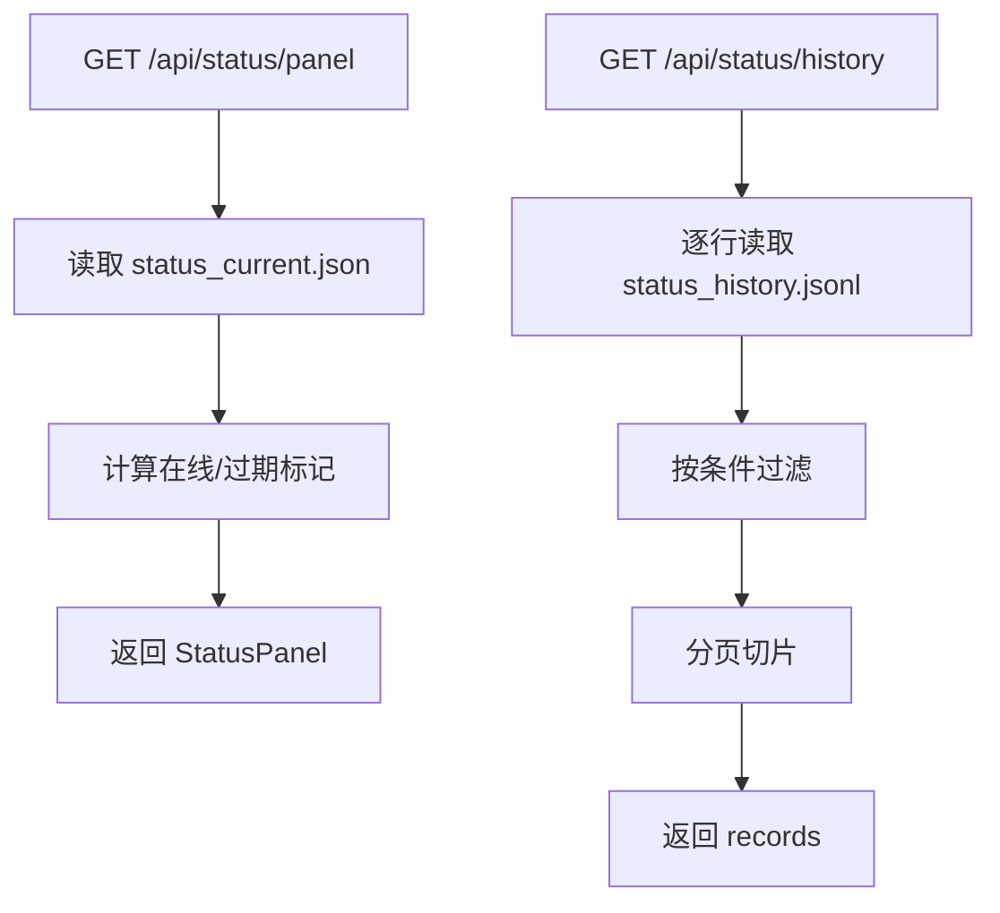
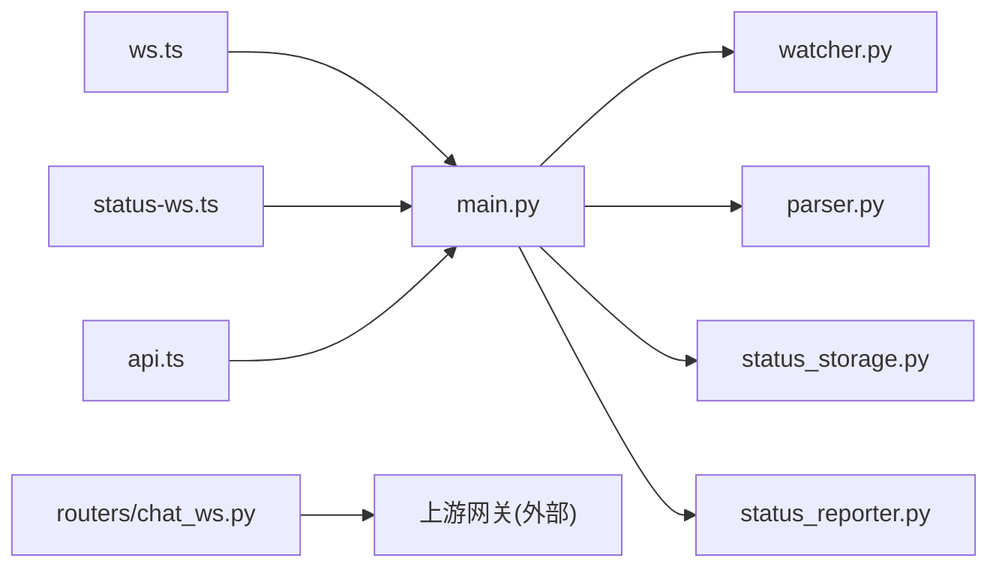

# 组件交互模式

<cite>
**本文引用的文件**
- [backend/main.py](file://backend/main.py)
- [backend/routers/chat_ws.py](file://backend/routers/chat_ws.py)
- [backend/watcher.py](file://backend/watcher.py)
- [backend/parser.py](file://backend/parser.py)
- [backend/status_storage.py](file://backend/status_storage.py)
- [backend/status_reporter.py](file://backend/status_reporter.py)
- [frontend/src/lib/ws.ts](file://frontend/src/lib/ws.ts)
- [frontend/src/lib/status-ws.ts](file://frontend/src/lib/status-ws.ts)
- [frontend/src/lib/api.ts](file://frontend/src/lib/api.ts)
- [data/status_current.json](file://data/status_current.json)
- [tests/test_chat_delta.py](file://tests/test_chat_delta.py)
- [tests/test_chat_delta2.py](file://tests/test_chat_delta2.py)
- [run.sh](file://run.sh)
</cite>

## 目录
1. [简介](#简介)
2. [项目结构](#项目结构)
3. [核心组件](#核心组件)
4. [架构总览](#架构总览)
5. [详细组件分析](#详细组件分析)
6. [依赖关系分析](#依赖关系分析)
7. [性能考量](#性能考量)
8. [故障排查指南](#故障排查指南)
9. [结论](#结论)
10. [附录](#附录)

## 简介
本文件面向 SynapseOS 2.0 的组件交互模式，系统性梳理后端 FastAPI 服务、WebSocket 通道、REST API、文件监控与前端三者之间的协作机制。重点覆盖：
- WebSocket 通信模式：连接管理、消息格式、心跳与 ping/pong、错误处理
- REST API 调用模式：HTTP 方法、URL 设计、请求/响应格式与状态码约定
- 文件监控与 API 调用的协调：去抖动策略与批量更新优化
- 组件间依赖关系与时序：交互序列图与状态转换图
- 并发控制与资源管理最佳实践

## 项目结构
系统采用前后端分离架构：
- 后端：FastAPI 应用，提供 REST API 与多条 WebSocket 通道；内置文件监控器与状态快照/历史存储
- 前端：Svelte 应用，通过 WebSocket 与 REST API 获取数据；静态资源由后端托管
- 数据层：本地 JSON/JSONL 文件，用于状态快照与历史记录

图表来源
- [backend/main.py:184-495](file://backend/main.py#L184-L495)
- [backend/routers/chat_ws.py:197-376](file://backend/routers/chat_ws.py#L197-L376)
- [backend/watcher.py:8-52](file://backend/watcher.py#L8-L52)
- [backend/parser.py:440-509](file://backend/parser.py#L440-L509)
- [backend/status_storage.py:10-236](file://backend/status_storage.py#L10-L236)
- [backend/status_reporter.py:258-274](file://backend/status_reporter.py#L258-L274)
- [frontend/src/lib/ws.ts:19-84](file://frontend/src/lib/ws.ts#L19-L84)
- [frontend/src/lib/status-ws.ts:12-78](file://frontend/src/lib/status-ws.ts#L12-L78)
- [frontend/src/lib/api.ts:75-181](file://frontend/src/lib/api.ts#L75-L181)
- [data/status_current.json:1-59](file://data/status_current.json#L1-L59)

章节来源
- [backend/main.py:184-495](file://backend/main.py#L184-L495)
- [frontend/src/lib/ws.ts:19-84](file://frontend/src/lib/ws.ts#L19-L84)
- [frontend/src/lib/status-ws.ts:12-78](file://frontend/src/lib/status-ws.ts#L12-L78)
- [frontend/src/lib/api.ts:75-181](file://frontend/src/lib/api.ts#L75-L181)

## 核心组件
- FastAPI 应用与生命周期：负责启动/停止文件监控器、状态报告线程、注册路由与 WebSocket 端点，并托管前端静态资源
- WebSocket 通道
  - /ws：通用数据通道，首次连接下发全量数据，支持心跳与 ping/pong
  - /ws/status：状态面板专用通道，广播状态变更
  - /ws/chat：工作台聊天桥接，连接上游网关，转发消息并流式回传
- 文件监控器：监控数据目录变化，触发去抖动后的全量数据广播
- REST API：提供任务/决策/团队/状态面板/历史等查询与上报接口
- 状态存储：维护实时状态快照与历史记录，支持面板渲染与过滤查询
- 前端模块：分别管理 /ws 与 /ws/status 的连接、重连与消息分发；封装 REST API 调用

章节来源
- [backend/main.py:39-182](file://backend/main.py#L39-L182)
- [backend/routers/chat_ws.py:197-376](file://backend/routers/chat_ws.py#L197-L376)
- [backend/watcher.py:8-52](file://backend/watcher.py#L8-L52)
- [backend/status_storage.py:10-236](file://backend/status_storage.py#L10-L236)
- [frontend/src/lib/ws.ts:19-84](file://frontend/src/lib/ws.ts#L19-L84)
- [frontend/src/lib/status-ws.ts:12-78](file://frontend/src/lib/status-ws.ts#L12-L78)

## 架构总览
后端通过生命周期钩子启动文件监控与状态报告线程，前者在文件变化时触发去抖动广播，后者周期性扫描任务文件生成状态快照并通过专用通道广播。前端通过两条 WebSocket 通道与 REST API 获取数据，实现低延迟的实时更新与稳定的离线回放能力。

图表来源
- [backend/main.py:120-182](file://backend/main.py#L120-L182)
- [backend/watcher.py:21-35](file://backend/watcher.py#L21-L35)
- [backend/status_reporter.py:258-274](file://backend/status_reporter.py#L258-L274)
- [backend/status_storage.py:62-127](file://backend/status_storage.py#L62-L127)
- [frontend/src/lib/ws.ts:26-74](file://frontend/src/lib/ws.ts#L26-L74)

## 详细组件分析

### WebSocket 通信模式
- 连接管理
  - /ws：接受连接后立即发送 data_updated 全量数据，随后维持心跳与 ping/pong
  - /ws/status：接受连接后发送当前面板数据，随后按需广播状态更新
  - 断开清理：捕获关闭异常并移除连接，避免内存泄漏
- 消息格式规范
  - 通用字段：type、payload、timestamp
  - /ws 支持：data_updated（全量数据）、heartbeat（心跳）、pong（心跳响应）
  - /ws/status 支持：status_updated、difficulty_reported、decision_requested
- 心跳机制
  - 服务端在接收超时（约 30 秒）时主动发送 heartbeat
  - 客户端收到 heartbeat 或收到 data_updated 时刷新“最后更新时间”
- 错误处理
  - 捕获 WebSocketDisconnect 正常断开
  - 捕获异常并打印堆栈，确保连接清理
  - 前端连接断开后指数退避重连，上限 10 秒

图表来源
- [backend/main.py:396-477](file://backend/main.py#L396-L477)
- [frontend/src/lib/ws.ts:26-74](file://frontend/src/lib/ws.ts#L26-L74)
- [frontend/src/lib/status-ws.ts:18-68](file://frontend/src/lib/status-ws.ts#L18-L68)

章节来源
- [backend/main.py:396-477](file://backend/main.py#L396-L477)
- [frontend/src/lib/ws.ts:26-74](file://frontend/src/lib/ws.ts#L26-L74)
- [frontend/src/lib/status-ws.ts:18-68](file://frontend/src/lib/status-ws.ts#L18-L68)

### REST API 调用模式
- HTTP 方法与 URL 设计
  - GET /api/mission、/api/tasks、/api/blockers、/api/decisions、/api/team
  - PATCH /api/decisions/{decision_id}
  - POST /api/status/report、/api/status/difficulty
  - GET /api/status/panel、/api/status/history、/api/status/{agent_id}
  - GET /api/registry
- 请求/响应格式
  - 决策更新：PATCH /api/decisions/{decision_id} 返回 success、decision_id、task_id
  - 状态上报：POST /api/status/report 返回 success、report_id、next_report_at
  - 状态面板：GET /api/status/panel 返回 StatusPanel 结构
  - 历史查询：GET /api/status/history 支持 agent_id、type、from_time、to_time、task_id、page、limit
- 状态码约定
  - 成功：200 OK
  - 资源不存在：404 Not Found（如 /api/status/{agent_id} 查询不存在的 agent）

图表来源
- [backend/main.py:224-298](file://backend/main.py#L224-L298)
- [backend/main.py:318-346](file://backend/main.py#L318-L346)
- [backend/status_storage.py:33-99](file://backend/status_storage.py#L33-L99)
- [frontend/src/lib/api.ts:75-181](file://frontend/src/lib/api.ts#L75-L181)

章节来源
- [backend/main.py:200-384](file://backend/main.py#L200-L384)
- [backend/status_storage.py:102-193](file://backend/status_storage.py#L102-L193)
- [frontend/src/lib/api.ts:75-181](file://frontend/src/lib/api.ts#L75-L181)

### 文件监控与 API 调用的协调机制
- 去抖动策略
  - 文件变化触发回调，若已有去抖任务未完成则取消旧任务
  - 新任务延时 WS_DEBOUNCE_MS（300ms）后统一读取全量数据并广播
- 批量更新优化
  - 一次性加载并序列化全量数据，减少多次 I/O
  - 广播前清理无效连接，避免向断开客户端发送消息
- 生命周期集成
  - 应用启动时初始化 DataWatcher 并注册回调
  - 应用关闭时停止监控与广播任务，释放资源

图表来源
- [backend/main.py:61-93](file://backend/main.py#L61-L93)
- [backend/watcher.py:21-35](file://backend/watcher.py#L21-L35)
- [backend/parser.py:440-509](file://backend/parser.py#L440-L509)

章节来源
- [backend/main.py:61-93](file://backend/main.py#L61-L93)
- [backend/watcher.py:21-35](file://backend/watcher.py#L21-L35)
- [backend/parser.py:440-509](file://backend/parser.py#L440-L509)

### 聊天 WebSocket（工作台桥接）
- 连接与会话
  - 建立到上游网关的 WebSocket，认证后列出/创建会话
  - 每个代理维护独立 sessionKey 与运行期 runId 映射，防止跨流混杂
- 历史加载
  - 从会话 JSONL 文件读取最近 N 条消息，剥离元信息与时间戳前缀
- 流式推送
  - chat 事件：delta/final/error 状态，assistant 文本增量推送
  - agent 事件：thinking/thought 工具/推理阶段文本与 delta
  - lifecycle：runId 结束时清理缓冲区与映射
- 请求/响应
  - 使用 idempotencyKey 作为 runId，确保事件路由正确

图表来源
- [backend/routers/chat_ws.py:197-376](file://backend/routers/chat_ws.py#L197-L376)
- [tests/test_chat_delta.py:21-280](file://tests/test_chat_delta.py#L21-L280)
- [tests/test_chat_delta2.py:21-281](file://tests/test_chat_delta2.py#L21-L281)

章节来源
- [backend/routers/chat_ws.py:197-376](file://backend/routers/chat_ws.py#L197-L376)
- [tests/test_chat_delta.py:21-280](file://tests/test_chat_delta.py#L21-L280)
- [tests/test_chat_delta2.py:21-281](file://tests/test_chat_delta2.py#L21-L281)

### 状态面板与历史查询
- 面板渲染
  - 从 status_current.json 读取快照，计算在线状态与过期标记
- 历史查询
  - 逐行解析 status_history.jsonl，支持多维过滤与分页
- 报告上报
  - POST /api/status/report 写入快照与历史，并根据内容类型选择广播事件类型

图表来源
- [backend/status_storage.py:102-193](file://backend/status_storage.py#L102-L193)
- [data/status_current.json:1-59](file://data/status_current.json#L1-59)

章节来源
- [backend/status_storage.py:102-193](file://backend/status_storage.py#L102-L193)
- [data/status_current.json:1-59](file://data/status_current.json#L1-59)

## 依赖关系分析
- 组件耦合
  - main.py 与 watcher.py、status_storage.py、status_reporter.py、parser.py 存在直接调用关系
  - 聊天路由与上游网关存在外部依赖，但内部通过队列与任务解耦
- 外部依赖
  - 前端通过 WebSocket 与 REST API 与后端交互
  - 状态报告器依赖任务文件目录结构与命名约定
- 循环依赖
  - 未发现循环导入；模块间通过函数调用与事件驱动解耦

图表来源
- [backend/main.py:15-21](file://backend/main.py#L15-L21)
- [backend/routers/chat_ws.py:140-158](file://backend/routers/chat_ws.py#L140-L158)
- [frontend/src/lib/ws.ts:15-84](file://frontend/src/lib/ws.ts#L15-L84)
- [frontend/src/lib/status-ws.ts:8-78](file://frontend/src/lib/status-ws.ts#L8-L78)
- [frontend/src/lib/api.ts:1-181](file://frontend/src/lib/api.ts#L1-L181)

章节来源
- [backend/main.py:15-21](file://backend/main.py#L15-L21)
- [backend/routers/chat_ws.py:140-158](file://backend/routers/chat_ws.py#L140-L158)
- [frontend/src/lib/ws.ts:15-84](file://frontend/src/lib/ws.ts#L15-L84)
- [frontend/src/lib/status-ws.ts:8-78](file://frontend/src/lib/status-ws.ts#L8-L78)
- [frontend/src/lib/api.ts:1-181](file://frontend/src/lib/api.ts#L1-L181)

## 性能考量
- 去抖动与批量广播
  - 300ms 去抖动降低频繁全量广播带来的网络与 CPU 压力
  - 广播前清理无效连接，避免无效 I/O
- 异步与并发
  - 文件监控与状态广播使用 asyncio，后台线程与异步任务并行
  - 聊天路由使用队列与任务隔离上游读取与下游推送
- I/O 优化
  - JSON/JSONL 顺序读写，历史查询按需过滤，避免全量扫描
- 前端缓存与重连
  - 前端维护 lastUpdated 时间戳，心跳与全量更新均刷新该值
  - 指数退避重连，避免雪崩式重试

[本节为通用指导，无需特定文件引用]

## 故障排查指南
- WebSocket 连接问题
  - 检查 /ws 与 /ws/status 是否能正常握手与接收 heartbeat
  - 若出现连接断开，查看后端日志与前端重连状态
- 决策更新失败
  - 确认任务目录存在且包含目标任务文件
  - 检查任务文件中是否存在“果爸决策”区块，必要时自动添加
- 状态上报异常
  - 确认 POST /api/status/report 的请求体字段完整
  - 检查 status_current.json 与 status_history.jsonl 写入权限
- 聊天流式推送异常
  - 使用测试脚本验证上游网关是否返回 chat.delta 事件
  - 确保 runId 与 idempotencyKey 映射正确

章节来源
- [backend/main.py:396-477](file://backend/main.py#L396-L477)
- [backend/main.py:224-298](file://backend/main.py#L224-L298)
- [backend/status_storage.py:102-193](file://backend/status_storage.py#L102-L193)
- [tests/test_chat_delta.py:21-280](file://tests/test_chat_delta.py#L21-L280)
- [tests/test_chat_delta2.py:21-281](file://tests/test_chat_delta2.py#L21-L281)

## 结论
SynapseOS 2.0 通过 FastAPI 提供统一的 REST 与 WebSocket 接口，结合文件监控与状态报告器，实现了数据驱动的实时面板与聊天桥接。去抖动与批量广播策略有效平衡了实时性与性能；前后端通过明确的消息格式与心跳机制保障了稳定性。建议在生产环境中进一步增强错误恢复与可观测性指标，以提升整体可靠性。

[本节为总结性内容，无需特定文件引用]

## 附录
- 启动与运维
  - 使用 run.sh 管理后端与前端进程，查看日志定位问题
- 数据模型参考
  - StatusPanel、AgentStatus、StatusReport 等接口定义见前端 api.ts

章节来源
- [run.sh:72-117](file://run.sh#L72-L117)
- [frontend/src/lib/api.ts:101-149](file://frontend/src/lib/api.ts#L101-L149)