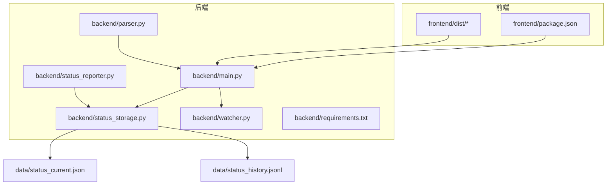
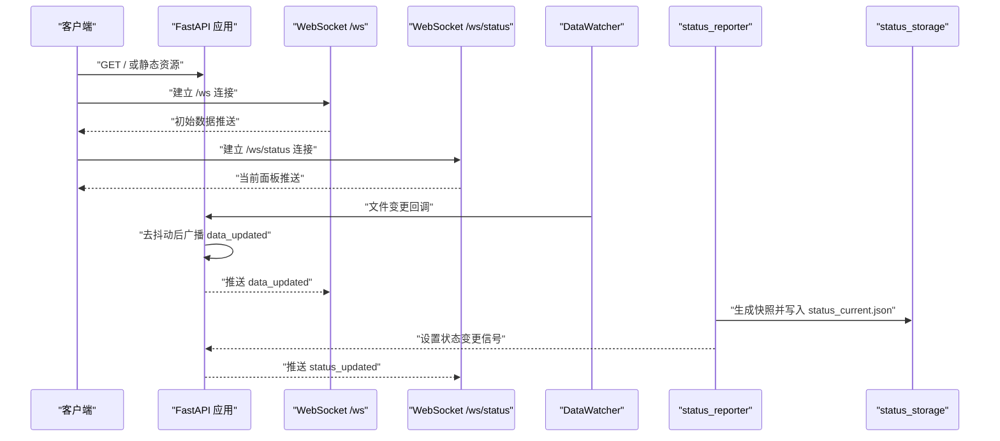
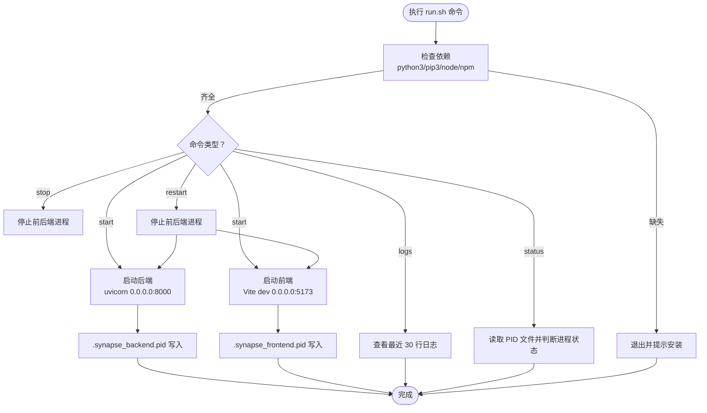
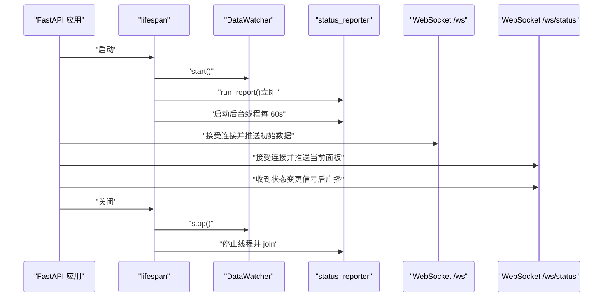
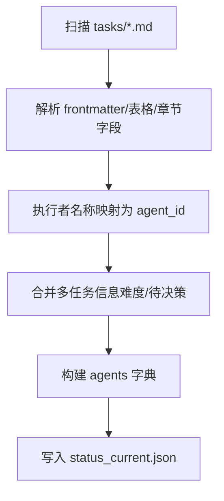
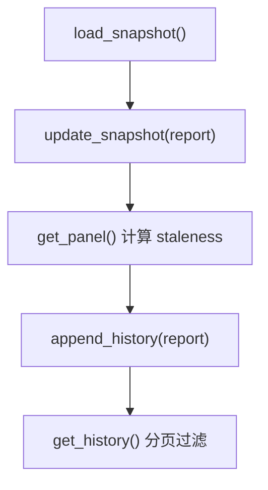
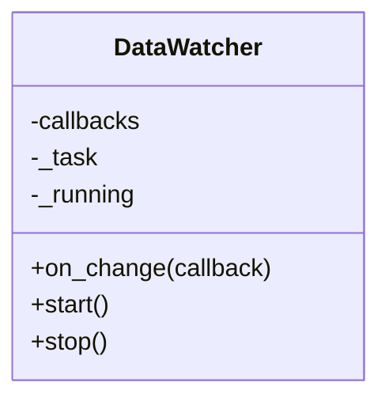
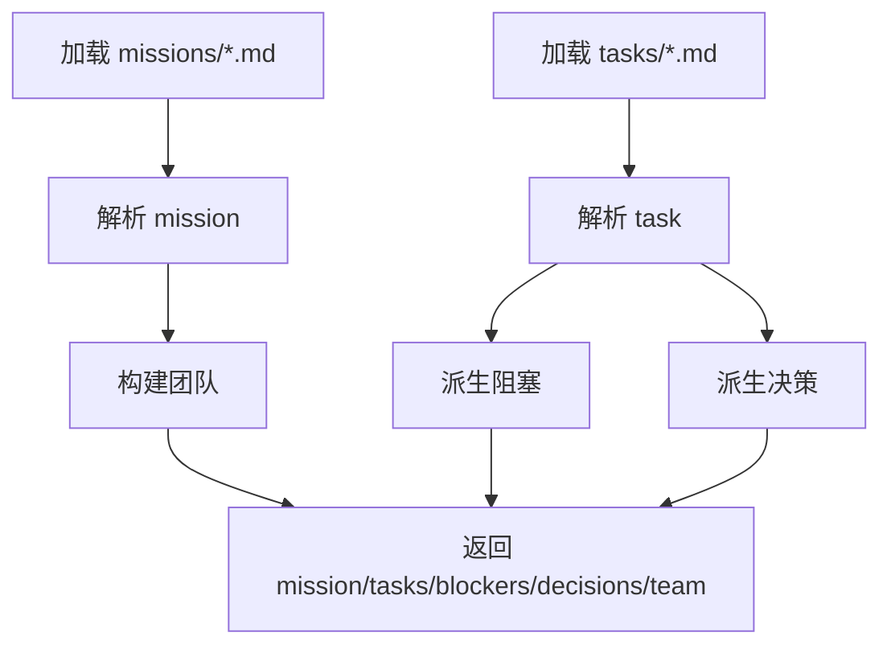
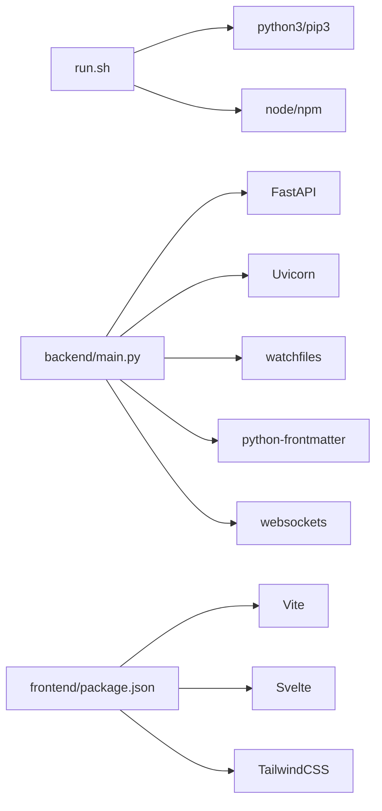

# 故障排除与维护

<cite>
**本文引用的文件**   
- [run.sh](file://run.sh)
- [backend/main.py](file://backend/main.py)
- [backend/status_reporter.py](file://backend/status_reporter.py)
- [backend/status_storage.py](file://backend/status_storage.py)
- [backend/watcher.py](file://backend/watcher.py)
- [backend/parser.py](file://backend/parser.py)
- [backend/requirements.txt](file://backend/requirements.txt)
- [frontend/package.json](file://frontend/package.json)
- [data/status_current.json](file://data/status_current.json)
- [data/status_history.jsonl](file://data/status_history.jsonl)
- [tests/test_chat_delta.py](file://tests/test_chat_delta.py)
- [tests/test_chat_delta2.py](file://tests/test_chat_delta2.py)
</cite>

## 目录
1. [简介](#简介)
2. [项目结构](#项目结构)
3. [核心组件](#核心组件)
4. [架构总览](#架构总览)
5. [详细组件分析](#详细组件分析)
6. [依赖关系分析](#依赖关系分析)
7. [性能考虑](#性能考虑)
8. [故障排除指南](#故障排除指南)
9. [版本升级与迁移](#版本升级与迁移)
10. [备份与灾难恢复](#备份与灾难恢复)
11. [结论](#结论)

## 简介
本指南面向 SynapseOS 2.0 的运维与维护人员，提供系统故障排除、日常维护、性能调优、安全加固以及版本升级与回滚策略。重点覆盖 run.sh 脚本的状态检查与进程管理、依赖缺失与端口冲突排查、权限与网络异常处理，并给出基于仓库现有实现的数据存储与状态上报流程说明。

## 项目结构
- 后端采用 FastAPI + Uvicorn，提供 REST API 与 WebSocket 通道；前端使用 Vite + Svelte。
- 数据层包含状态快照与历史记录文件，由状态上报器定期扫描任务 Markdown 并生成。
- 运维脚本 run.sh 负责安装依赖、启动前后端服务、查看日志与状态检查。

图表来源
- [backend/main.py:185-495](file://backend/main.py#L185-L495)
- [backend/status_reporter.py:1-274](file://backend/status_reporter.py#L1-L274)
- [backend/status_storage.py:1-236](file://backend/status_storage.py#L1-L236)
- [backend/watcher.py:1-52](file://backend/watcher.py#L1-L52)
- [backend/parser.py:1-509](file://backend/parser.py#L1-L509)
- [backend/requirements.txt:1-6](file://backend/requirements.txt#L1-L6)
- [frontend/package.json:1-24](file://frontend/package.json#L1-L24)
- [data/status_current.json:1-59](file://data/status_current.json#L1-L59)
- [data/status_history.jsonl:1-4](file://data/status_history.jsonl#L1-L4)

章节来源
- [run.sh:120-192](file://run.sh#L120-L192)
- [backend/main.py:185-495](file://backend/main.py#L185-L495)

## 核心组件
- 运维脚本 run.sh：负责依赖检查、前后端启动/停止/重启、日志查看与状态查询。
- 后端应用 backend/main.py：FastAPI 应用，注册路由、WebSocket、CORS、静态文件挂载，生命周期内启动文件监视与状态上报线程。
- 状态上报器 backend/status_reporter.py：扫描任务 Markdown，解析状态并写入状态快照。
- 状态存储 backend/status_storage.py：管理状态快照与历史记录，提供面板查询与过期检测。
- 文件监视 backend/watcher.py：监控 data 目录变化，触发数据更新广播。
- 解析器 backend/parser.py：解析 mission/task/blocker/decision/team 等实体。
- 前端配置 frontend/package.json：定义开发服务器端口与构建脚本。

章节来源
- [run.sh:58-192](file://run.sh#L58-L192)
- [backend/main.py:185-495](file://backend/main.py#L185-L495)
- [backend/status_reporter.py:1-274](file://backend/status_reporter.py#L1-L274)
- [backend/status_storage.py:1-236](file://backend/status_storage.py#L1-L236)
- [backend/watcher.py:1-52](file://backend/watcher.py#L1-L52)
- [backend/parser.py:1-509](file://backend/parser.py#L1-L509)
- [frontend/package.json:1-24](file://frontend/package.json#L1-L24)

## 架构总览
后端通过 uvicorn 运行 FastAPI 应用，提供 REST API 与两条 WebSocket 通道：
- /ws：数据更新通道，连接后立即推送初始数据，心跳保持。
- /ws/status：状态面板通道，连接后推送当前面板，随状态上报线程周期性更新。

状态上报器每 60 秒扫描任务目录，生成状态快照并写入 JSON；同时后台线程在应用生命周期内监听“状态变更”事件并通过 WebSocket 广播。

图表来源
- [backend/main.py:120-182](file://backend/main.py#L120-L182)
- [backend/main.py:396-477](file://backend/main.py#L396-L477)
- [backend/status_reporter.py:105-117](file://backend/status_reporter.py#L105-L117)
- [backend/status_storage.py:102-127](file://backend/status_storage.py#L102-L127)
- [backend/watcher.py:29-40](file://backend/watcher.py#L29-L40)

## 详细组件分析

### 运维脚本 run.sh：状态检查与进程管理
- 依赖检查：校验 python3/pip3/node/npm 是否存在，缺失则提示安装。
- 后端启动：进入 backend 目录安装 requirements.txt，使用 uvicorn 启动 FastAPI 应用，绑定 0.0.0.0:8000，日志重定向至 logs/synapse_backend.log，并写入 .synapse_backend.pid。
- 前端启动：进入 frontend 目录安装 node_modules（若不存在），使用 npm run dev 启动 Vite 开发服务器，绑定 0.0.0.0:5173，日志重定向至 logs/synapse_frontend.log，并写入 .synapse_frontend.pid。
- 停止/重启：读取 PID 文件，向对应进程发送终止信号，必要时强制杀死；重启流程先停止再启动。
- 日志查看：显示最近 30 行后端与前端日志。
- 状态查询：读取 PID 文件判断进程是否存活，输出“运行/停止”。

图表来源
- [run.sh:58-192](file://run.sh#L58-L192)

章节来源
- [run.sh:58-192](file://run.sh#L58-L192)

### 后端应用 backend/main.py：生命周期与 WebSocket
- 生命周期：启动时初始化 DataWatcher，立即执行一次状态上报，启动后台线程每 60 秒扫描任务并更新快照；关闭时清理线程、取消广播任务、停止 watcher。
- WebSocket：
  - /ws：连接后推送初始数据，支持 ping/pong 与心跳；断开自动清理。
  - /ws/status：连接后推送当前面板，随状态变更事件周期性更新。
- CORS：允许任意来源访问，便于前端开发调试。
- 静态文件：若存在 frontend/dist，则挂载为根静态资源；否则提供基础 JSON 响应。

图表来源
- [backend/main.py:120-182](file://backend/main.py#L120-L182)
- [backend/main.py:396-477](file://backend/main.py#L396-L477)
- [backend/watcher.py:36-51](file://backend/watcher.py#L36-L51)
- [backend/status_reporter.py:105-117](file://backend/status_reporter.py#L105-L117)

章节来源
- [backend/main.py:120-182](file://backend/main.py#L120-L182)
- [backend/main.py:396-477](file://backend/main.py#L396-L477)

### 状态上报器 backend/status_reporter.py：任务解析与快照生成
- 任务目录：默认从环境变量 CYBER_TEAM_DIR/tasks 读取，解析每个 Markdown 文件，提取执行者、状态、难度、待决策等字段。
- 名称映射：将中文/英文名片段映射为 agent_id，结合元信息生成面板数据。
- 快照写入：将 agents 字典写入 data/status_current.json，包含 updated_at 时间戳。

图表来源
- [backend/status_reporter.py:189-244](file://backend/status_reporter.py#L189-L244)
- [backend/status_reporter.py:246-266](file://backend/status_reporter.py#L246-L266)

章节来源
- [backend/status_reporter.py:189-244](file://backend/status_reporter.py#L189-L244)
- [backend/status_reporter.py:246-266](file://backend/status_reporter.py#L246-L266)

### 状态存储 backend/status_storage.py：快照与历史
- 快照：加载 data/status_current.json，更新单个 agent 的 last_report_at/next_report_at/online_status/is_stale 等字段。
- 面板：计算 staleness（超过阈值分钟数未更新即标记为 stale），并返回面板数据。
- 历史：以 JSON Lines 形式追加历史记录，支持按 agent_id/type/from_time/to_time/task_id 分页过滤。

图表来源
- [backend/status_storage.py:62-127](file://backend/status_storage.py#L62-L127)
- [backend/status_storage.py:139-193](file://backend/status_storage.py#L139-L193)

章节来源
- [backend/status_storage.py:62-127](file://backend/status_storage.py#L62-L127)
- [backend/status_storage.py:139-193](file://backend/status_storage.py#L139-L193)

### 文件监视 backend/watcher.py：数据变更驱动
- 使用 watchfiles 异步监听 data 目录，检测到变更后通知回调，触发去抖动后的广播。

图表来源
- [backend/watcher.py:8-52](file://backend/watcher.py#L8-L52)

章节来源
- [backend/watcher.py:8-52](file://backend/watcher.py#L8-L52)

### 解析器 backend/parser.py：任务/决策/阻塞/团队解析
- 从 mission/task 目录解析实体，提取标题、状态、优先级、执行者、决策状态、来源类型、创建者等字段。
- 构建团队成员列表与阻塞/决策清单，用于前端展示。

图表来源
- [backend/parser.py:441-509](file://backend/parser.py#L441-L509)

章节来源
- [backend/parser.py:441-509](file://backend/parser.py#L441-L509)

## 依赖关系分析
- 后端依赖：FastAPI、Uvicorn、watchfiles、python-frontmatter、websockets。
- 前端依赖：Vite、Svelte、TailwindCSS、ws 等。
- 运维脚本依赖：bash、python3、pip3、node、npm。

图表来源
- [backend/requirements.txt:1-6](file://backend/requirements.txt#L1-L6)
- [frontend/package.json:1-24](file://frontend/package.json#L1-L24)
- [run.sh:58-70](file://run.sh#L58-L70)

章节来源
- [backend/requirements.txt:1-6](file://backend/requirements.txt#L1-L6)
- [frontend/package.json:1-24](file://frontend/package.json#L1-L24)
- [run.sh:58-70](file://run.sh#L58-L70)

## 性能考虑
- WebSocket 去抖动：数据变更后延迟一定毫秒再广播，减少高频更新带来的压力。
- 状态上报周期：后台线程每 60 秒扫描一次任务目录，平衡实时性与 I/O 开销。
- 面板 staleness 检测：超过阈值分钟数未更新标记为离线，避免无效数据影响前端渲染。
- 前端开发服务器：Vite 默认端口 5173，生产环境可考虑静态资源预热与缓存策略。

章节来源
- [backend/main.py:86-94](file://backend/main.py#L86-L94)
- [backend/main.py:105-117](file://backend/main.py#L105-L117)
- [backend/status_storage.py:102-127](file://backend/status_storage.py#L102-L127)
- [frontend/package.json:7](file://frontend/package.json#L7)

## 故障排除指南

### 一、依赖缺失
- 现象：启动时报错提示缺少 python3/pip3/node/npm。
- 处理：根据 run.sh 的依赖检查逻辑安装缺失工具，然后重新执行启动命令。

章节来源
- [run.sh:58-70](file://run.sh#L58-L70)

### 二、端口冲突
- 后端端口：8000（uvicorn 绑定 0.0.0.0:8000）。
- 前端端口：5173（Vite dev server）。
- 排查步骤：
  - 使用 netstat/ss/lsof 检查端口占用。
  - 修改 run.sh 中的端口参数或停止占用进程。
  - 若需外部访问，确保防火墙放行相应端口。

章节来源
- [run.sh:86-90](file://run.sh#L86-L90)
- [frontend/package.json:7](file://frontend/package.json#L7)

### 三、权限问题
- 日志与数据目录：run.sh 自动创建 logs 与 data 目录；若权限不足，可能导致日志写入失败或状态文件无法更新。
- 处理：确保运行用户对项目根目录具有读写权限；必要时调整目录权限或切换用户。

章节来源
- [run.sh:21](file://run.sh#L21)
- [backend/status_storage.py:20-22](file://backend/status_storage.py#L20-L22)

### 四、网络连接异常
- WebSocket 断连：/ws 通道支持 ping/pong 与心跳，若长时间无活动会发送心跳包。
- 排查：检查客户端网络稳定性、代理/防火墙设置；关注后端日志中的异常堆栈。

章节来源
- [backend/main.py:420-440](file://backend/main.py#L420-L440)
- [backend/main.py:460-476](file://backend/main.py#L460-L476)

### 五、run.sh 状态检查输出解读
- status 命令输出：
  - ✅ Backend/ Frontend: running (PID xxx) 表示进程正在运行。
  - ❌ Backend/ Frontend: stopped 表示进程未运行或 PID 文件失效。
- 建议：当状态为 stopped 时，先查看对应日志文件，再执行 start 或 restart。

章节来源
- [run.sh:172-185](file://run.sh#L172-L185)
- [run.sh:162-170](file://run.sh#L162-L170)

### 六、数据一致性与状态面板
- 快照文件：data/status_current.json 记录当前状态快照，包含 agents 字段与 updated_at。
- 历史文件：data/status_history.jsonl 以 JSON Lines 存储历史记录，支持分页与过滤。
- 排查：若面板显示 stale，检查任务文件更新频率与状态上报线程是否正常运行。

章节来源
- [data/status_current.json:1-59](file://data/status_current.json#L1-L59)
- [data/status_history.jsonl:1-4](file://data/status_history.jsonl#L1-L4)
- [backend/status_storage.py:102-127](file://backend/status_storage.py#L102-L127)

### 七、WebSocket 测试参考
- 提供了针对 Gateway 的 WebSocket 测试脚本，可用于验证流式推送与事件分发。
- 可据此思路在本地模拟 chat/agent/session 等事件，辅助定位 WebSocket 层面的问题。

章节来源
- [tests/test_chat_delta.py:1-280](file://tests/test_chat_delta.py#L1-L280)
- [tests/test_chat_delta2.py:1-281](file://tests/test_chat_delta2.py#L1-L281)

## 版本升级与迁移

### 升级流程
- 备份：复制 data 目录与 logs 目录，保留历史状态与日志。
- 依赖更新：运行 run.sh 时会自动安装 requirements.txt；如需升级，先更新 requirements.txt 再执行启动。
- 启动验证：使用 status 命令检查后端/前端进程状态，访问 http://localhost:8000/docs 查看 API 文档。

章节来源
- [run.sh:79-81](file://run.sh#L79-L81)
- [backend/requirements.txt:1-6](file://backend/requirements.txt#L1-L6)

### 数据迁移策略
- 现状：状态快照与历史记录分别保存在 data/status_current.json 与 data/status_history.jsonl。
- 迁移建议：
  - 结构化存储：若未来需要更强的数据管理能力，可将 JSON 文件迁移到数据库（如 SQLite/PostgreSQL），并在 status_storage 层抽象接口。
  - 历史归档：对历史文件进行压缩归档，保留关键字段索引以便检索。

章节来源
- [backend/status_storage.py:139-193](file://backend/status_storage.py#L139-L193)
- [data/status_current.json:1-59](file://data/status_current.json#L1-L59)
- [data/status_history.jsonl:1-4](file://data/status_history.jsonl#L1-L4)

### 回滚方案
- 回退步骤：
  - 停止服务：./run.sh stop。
  - 还原备份：用备份的 data 与 logs 替换当前目录对应文件。
  - 重新启动：./run.sh start。
- 注意：回滚前确保备份完整且时间戳正确。

章节来源
- [run.sh:140-158](file://run.sh#L140-L158)

## 备份与灾难恢复

### 备份范围
- 关键数据：data/status_current.json、data/status_history.jsonl。
- 日志：logs/synapse_backend.log、logs/synapse_frontend.log。
- 配置：backend/requirements.txt、frontend/package.json。

### 备份策略
- 定期全量备份：每周一次，保留最近 N 份。
- 增量备份：每日增量，结合快照策略减少存储开销。
- 校验：备份完成后进行完整性校验与解压测试。

### 灾难恢复
- 恢复流程：
  - 停止服务：./run.sh stop。
  - 恢复 data 与 logs：将备份文件还原到对应路径。
  - 启动服务：./run.sh start。
  - 验证：使用 status 命令与 API 文档确认服务可用。

章节来源
- [run.sh:140-158](file://run.sh#L140-L158)
- [backend/status_storage.py:62-127](file://backend/status_storage.py#L62-L127)

## 结论
本指南基于仓库现有实现，总结了 SynapseOS 2.0 的运维要点：依赖检查、端口与权限排查、run.sh 状态检查与进程管理、WebSocket 与状态上报流程、性能与安全建议，以及版本升级、数据迁移与灾难恢复策略。建议在生产环境中进一步引入数据库化存储、日志集中化与告警、自动化巡检与备份演练，以提升系统的稳定性与可维护性。