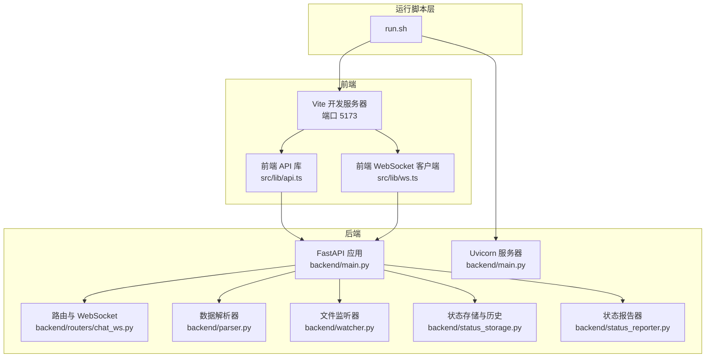
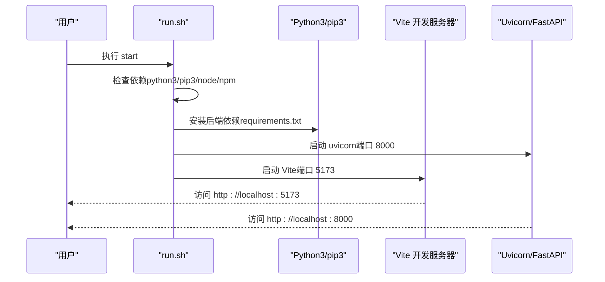
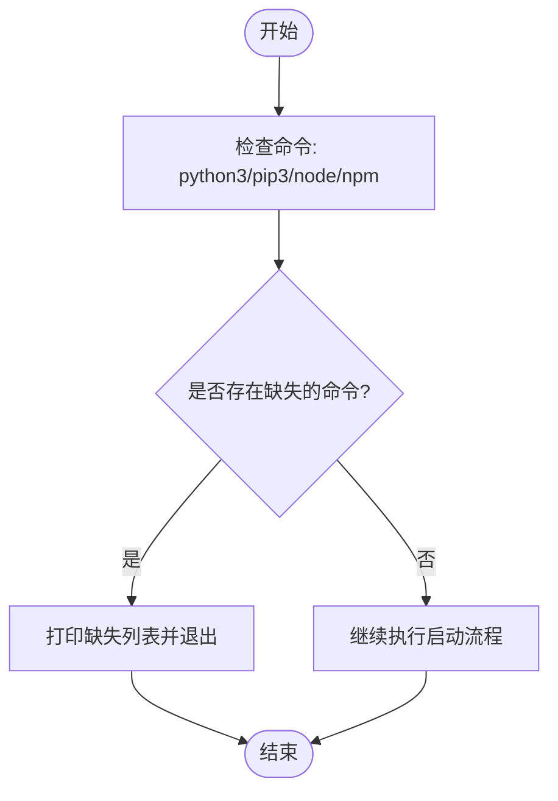
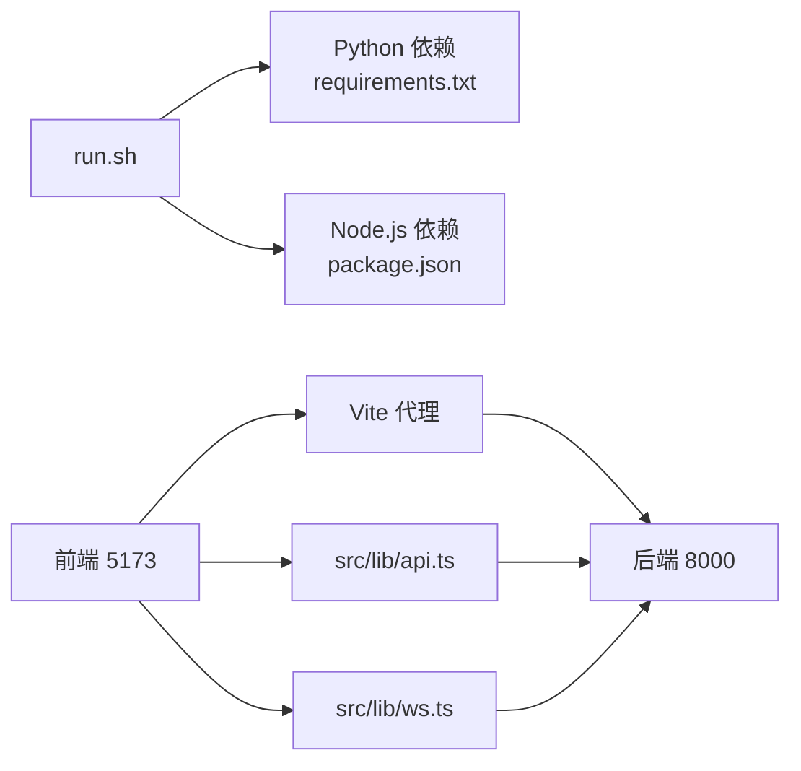

# 环境配置

<cite>
**本文引用的文件**
- [run.sh](file://run.sh)
- [backend/requirements.txt](file://backend/requirements.txt)
- [frontend/package.json](file://frontend/package.json)
- [backend/main.py](file://backend/main.py)
- [frontend/vite.config.ts](file://frontend/vite.config.ts)
- [backend/parser.py](file://backend/parser.py)
- [backend/watcher.py](file://backend/watcher.py)
- [backend/status_storage.py](file://backend/status_storage.py)
- [backend/status_reporter.py](file://backend/status_reporter.py)
- [backend/routers/chat_ws.py](file://backend/routers/chat_ws.py)
- [frontend/src/lib/api.ts](file://frontend/src/lib/api.ts)
- [frontend/src/lib/ws.ts](file://frontend/src/lib/ws.ts)
</cite>

## 目录
1. [简介](#简介)
2. [项目结构](#项目结构)
3. [核心组件](#核心组件)
4. [架构总览](#架构总览)
5. [详细组件分析](#详细组件分析)
6. [依赖关系分析](#依赖关系分析)
7. [性能考虑](#性能考虑)
8. [故障排查指南](#故障排查指南)
9. [结论](#结论)
10. [附录](#附录)

## 简介
本文件面向 SynapseOS 2.0 的环境配置与部署，覆盖系统要求、前置条件、依赖检查机制、Python 与 Node.js 依赖清单、跨平台安装指南、虚拟环境建议、权限与网络要求等内容。文档同时给出运行脚本的依赖验证流程、前后端端口与代理配置、以及常见问题排查方法，帮助用户在 Linux 与 macOS 上快速搭建并稳定运行系统。

## 项目结构
- 后端采用 FastAPI + Uvicorn，提供 REST API 与 WebSocket 服务，并通过文件监听驱动数据更新广播。
- 前端基于 Vite + Svelte，使用代理将 /api 与 /ws 请求转发至后端。
- 运行脚本负责依赖检查、后端与前端的启动/停止/重启/日志查看/状态查询。

图表来源
- [run.sh:120-138](file://run.sh#L120-L138)
- [frontend/vite.config.ts:11-21](file://frontend/vite.config.ts#L11-L21)
- [backend/main.py:184-198](file://backend/main.py#L184-L198)
- [backend/routers/chat_ws.py:174-349](file://backend/routers/chat_ws.py#L174-L349)
- [backend/parser.py:440-509](file://backend/parser.py#L440-L509)
- [backend/watcher.py:36-52](file://backend/watcher.py#L36-L52)
- [backend/status_storage.py:102-127](file://backend/status_storage.py#L102-L127)
- [backend/status_reporter.py:258-267](file://backend/status_reporter.py#L258-L267)

章节来源
- [run.sh:120-138](file://run.sh#L120-L138)
- [frontend/vite.config.ts:11-21](file://frontend/vite.config.ts#L11-L21)
- [backend/main.py:184-198](file://backend/main.py#L184-L198)

## 核心组件
- 依赖检查与启动控制：run.sh 提供 start/stop/restart/logs/status 等命令，内置依赖检查与进程管理。
- 后端服务：FastAPI + Uvicorn，提供 REST API 与 WebSocket，集成 CORS、静态资源与数据变更广播。
- 前端开发：Vite 代理将 /api 与 /ws 转发至本地后端，前端通过 Svelte store 与 WebSocket 实时接收数据。
- 数据与状态：parser 解析 Markdown 任务与使命数据；status_reporter 从任务文件生成状态快照；status_storage 维护当前快照与历史记录；watcher 监听数据目录变化并触发广播。

章节来源
- [run.sh:58-70](file://run.sh#L58-L70)
- [backend/main.py:184-198](file://backend/main.py#L184-L198)
- [frontend/vite.config.ts:11-21](file://frontend/vite.config.ts#L11-L21)
- [backend/parser.py:440-509](file://backend/parser.py#L440-L509)
- [backend/status_storage.py:102-127](file://backend/status_storage.py#L102-L127)
- [backend/status_reporter.py:258-267](file://backend/status_reporter.py#L258-L267)
- [backend/watcher.py:36-52](file://backend/watcher.py#L36-L52)

## 架构总览
- 端口与代理
  - 前端开发服务器：默认 5173，通过 Vite 代理将 /api 与 /ws 转发到后端。
  - 后端服务：默认 8000，提供 REST API 与 WebSocket。
- 依赖检查
  - run.sh 在 start/restart 前检查 python3、pip3、node、npm 是否可用。
- 运行模式
  - run.sh 自动安装后端依赖（pip3 install -r backend/requirements.txt），设置 PYTHONPATH 并启动 uvicorn。
  - 前端在首次启动时检测 node_modules 并执行 npm install，随后启动 Vite 开发服务器。

图表来源
- [run.sh:58-70](file://run.sh#L58-L70)
- [run.sh:79-95](file://run.sh#L79-L95)
- [run.sh:104-117](file://run.sh#L104-L117)
- [frontend/vite.config.ts:11-21](file://frontend/vite.config.ts#L11-L21)
- [backend/main.py:490-492](file://backend/main.py#L490-L492)

章节来源
- [run.sh:58-70](file://run.sh#L58-L70)
- [run.sh:79-95](file://run.sh#L79-L95)
- [run.sh:104-117](file://run.sh#L104-L117)
- [frontend/vite.config.ts:11-21](file://frontend/vite.config.ts#L11-L21)
- [backend/main.py:490-492](file://backend/main.py#L490-L492)

## 详细组件分析

### 依赖检查机制（run.sh）
- 检查项
  - python3、pip3、node、npm 命令是否可执行。
- 行为
  - 若缺失任一依赖，打印缺失列表并退出；否则继续启动。
- 影响范围
  - 任何 start/restart 前都会执行该检查。

图表来源
- [run.sh:58-70](file://run.sh#L58-L70)

章节来源
- [run.sh:58-70](file://run.sh#L58-L70)

### Python 依赖清单与作用
- 依赖文件：backend/requirements.txt
- 主要包与用途
  - fastapi：Web 框架，提供 REST API 与 WebSocket 支持。
  - uvicorn[standard]：ASGI 服务器，承载 FastAPI 应用。
  - watchfiles：文件监控，用于数据目录变更检测。
  - python-frontmatter：解析 Markdown frontmatter，支持任务与使命元数据读取。
  - websockets：WebSocket 支持，用于聊天桥接与状态频道。
- 版本与兼容性
  - 仓库中明确指定版本号，建议按文件锁定版本以确保一致性。

章节来源
- [backend/requirements.txt:1-6](file://backend/requirements.txt#L1-L6)

### Node.js 依赖清单与作用
- 依赖文件：frontend/package.json
- 开发依赖
  - @sveltejs/vite-plugin-svelte：Svelte 插件，配合 Vite 使用。
  - autoprefixer/postcss/tailwindcss：CSS 工具链，用于样式处理与构建。
  - vite：前端开发服务器与打包工具。
  - ws：WebSocket 客户端（开发环境使用）。
- 运行时依赖
  - svelte-routing：Svelte 路由支持。
- 版本与兼容性
  - 仓库中明确列出版本号，建议使用对应版本以保证构建一致性。

章节来源
- [frontend/package.json:11-22](file://frontend/package.json#L11-L22)

### 端口与代理配置
- 前端开发服务器：5173
- 后端服务：8000
- Vite 代理规则
  - /api → http://localhost:8000
  - /ws → ws://localhost:8000（WebSocket）

章节来源
- [frontend/vite.config.ts:11-21](file://frontend/vite.config.ts#L11-L21)
- [backend/main.py:490-492](file://backend/main.py#L490-L492)

### 数据目录与环境变量
- 数据目录
  - 后端状态数据：data/status_current.json、data/status_history.jsonl
- 环境变量
  - CYBER_TEAM_DIR：任务与使命数据目录，默认路径来自用户主目录下的特定子目录。
- 影响范围
  - parser、status_reporter、status_storage 均会读取该目录以生成/更新面板与历史。

章节来源
- [backend/status_storage.py:10-14](file://backend/status_storage.py#L10-L14)
- [backend/parser.py:9-13](file://backend/parser.py#L9-L13)
- [backend/status_reporter.py:15-21](file://backend/status_reporter.py#L15-L21)
- [backend/main.py:27-31](file://backend/main.py#L27-L31)

### WebSocket 与聊天桥接
- 前端 WebSocket
  - 通过 src/lib/ws.ts 连接 /ws，自动重连，解析 data_updated/heartbeat 等消息。
- 后端 WebSocket
  - /ws：推送数据更新；/ws/status：推送状态面板更新；/ws/chat：连接 OpenClaw 网关，转发消息流。
- 代理
  - Vite 将 /ws 代理到后端，实现开发环境的同源请求。

章节来源
- [frontend/src/lib/ws.ts:19-74](file://frontend/src/lib/ws.ts#L19-L74)
- [backend/main.py:396-477](file://backend/main.py#L396-L477)
- [backend/routers/chat_ws.py:174-349](file://backend/routers/chat_ws.py#L174-L349)
- [frontend/vite.config.ts:13-20](file://frontend/vite.config.ts#L13-L20)

## 依赖关系分析
- 运行脚本对系统工具的依赖
  - bash、python3、pip3、node、npm。
- 后端对 Python 包的依赖
  - fastapi、uvicorn、watchfiles、python-frontmatter、websockets。
- 前端对 Node.js 包的依赖
  - vite、@sveltejs/vite-plugin-svelte、svelte、tailwindcss、postcss、autoprefixer、ws、svelte-routing。
- 代理与端口
  - Vite 代理将 /api 与 /ws 转发到后端 8000 端口。

图表来源
- [run.sh:58-70](file://run.sh#L58-L70)
- [backend/requirements.txt:1-6](file://backend/requirements.txt#L1-L6)
- [frontend/package.json:11-22](file://frontend/package.json#L11-L22)
- [frontend/vite.config.ts:11-21](file://frontend/vite.config.ts#L11-L21)
- [backend/main.py:490-492](file://backend/main.py#L490-L492)

章节来源
- [run.sh:58-70](file://run.sh#L58-L70)
- [backend/requirements.txt:1-6](file://backend/requirements.txt#L1-L6)
- [frontend/package.json:11-22](file://frontend/package.json#L11-L22)
- [frontend/vite.config.ts:11-21](file://frontend/vite.config.ts#L11-L21)
- [backend/main.py:490-492](file://backend/main.py#L490-L492)

## 性能考虑
- WebSocket 广播与去抖
  - 后端对数据变更事件进行去抖处理，降低频繁广播带来的负载。
- 状态快照与历史
  - 状态快照与历史采用 JSON/JSONL 存储，建议定期清理历史文件以控制磁盘占用。
- 文件监控
  - 使用 watchfiles 异步监控数据目录，减少轮询开销。
- 前端代理
  - 开发环境下代理到后端，避免跨域与额外的网络往返。

章节来源
- [backend/main.py:61-94](file://backend/main.py#L61-L94)
- [backend/watcher.py:29-35](file://backend/watcher.py#L29-L35)
- [backend/status_storage.py:139-193](file://backend/status_storage.py#L139-L193)

## 故障排查指南
- 依赖缺失
  - 症状：启动时报错提示缺少 python3/pip3/node/npm。
  - 处理：安装对应工具并确保命令可在 PATH 中找到。
- 端口冲突
  - 症状：前端 5173 或后端 8000 被占用。
  - 处理：修改 Vite 配置或后端端口，或释放占用端口。
- WebSocket 连接失败
  - 症状：前端无法连接 /ws，出现重连。
  - 处理：检查后端是否正常运行、代理配置是否正确、防火墙是否放行。
- 数据目录不可读
  - 症状：状态面板为空或解析错误。
  - 处理：确认 CYBER_TEAM_DIR 指向正确的任务与使命数据目录，且具备读权限。
- 聊天桥接异常
  - 症状：/ws/chat 无响应或报错。
  - 处理：检查 OpenClaw 网关地址与令牌配置、网络连通性。

章节来源
- [run.sh:58-70](file://run.sh#L58-L70)
- [frontend/vite.config.ts:11-21](file://frontend/vite.config.ts#L11-L21)
- [backend/main.py:396-477](file://backend/main.py#L396-L477)
- [backend/status_reporter.py:15-21](file://backend/status_reporter.py#L15-L21)
- [backend/routers/chat_ws.py:174-349](file://backend/routers/chat_ws.py#L174-L349)

## 结论
SynapseOS 2.0 的环境配置相对简洁：依赖检查由 run.sh 统一执行，后端与前端分别通过 requirements.txt 与 package.json 明确版本约束。通过 Vite 代理与 WebSocket 通道，系统实现了前后端一体化开发体验。建议在 Linux/macOS 上按本文步骤安装依赖、配置数据目录与端口，即可快速启动并调试系统。

## 附录

### 系统要求与前置条件
- Python
  - 版本：Python 3.8+
  - 包管理：pip3
- Node.js 与 npm
  - 版本：Node.js 与 npm（具体版本请参考 package.json 中的开发依赖版本）
- 操作系统
  - Linux、macOS 均可运行

章节来源
- [run.sh:60-63](file://run.sh#L60-L63)
- [frontend/package.json:11-22](file://frontend/package.json#L11-L22)

### 跨平台安装指南（Linux/macOS）
- 安装 Python 3.8+ 与 pip3
  - 使用发行版包管理器安装 python3 与 pip3。
- 安装 Node.js 与 npm
  - 使用发行版包管理器或官方安装包安装 Node.js 与 npm。
- 安装项目依赖
  - 后端：pip3 install -r backend/requirements.txt
  - 前端：npm install（位于 frontend/ 目录）
- 启动项目
  - 使用 run.sh start 启动后端与前端服务。

章节来源
- [run.sh:79-95](file://run.sh#L79-L95)
- [run.sh:104-117](file://run.sh#L104-L117)
- [run.sh:120-138](file://run.sh#L120-L138)

### 环境变量与数据目录
- CYBER_TEAM_DIR
  - 默认值：用户主目录下的特定子目录
  - 作用：任务与使命数据目录，parser 与 status_reporter 读取该目录
- 数据文件
  - status_current.json：当前状态快照
  - status_history.jsonl：状态历史记录

章节来源
- [backend/parser.py:9-13](file://backend/parser.py#L9-L13)
- [backend/status_reporter.py:15-21](file://backend/status_reporter.py#L15-L21)
- [backend/status_storage.py:10-14](file://backend/status_storage.py#L10-L14)

### 端口与网络访问
- 前端开发端口：5173
- 后端服务端口：8000
- 代理规则：
  - /api → http://localhost:8000
  - /ws → ws://localhost:8000
- 网络要求
  - 本地回环网络可用
  - 如需外部访问，需开放 5173（前端）与 8000（后端）端口

章节来源
- [frontend/vite.config.ts:11-21](file://frontend/vite.config.ts#L11-L21)
- [backend/main.py:490-492](file://backend/main.py#L490-L492)

### 虚拟环境与权限建议
- Python 虚拟环境
  - 建议在独立虚拟环境中安装后端依赖，避免与系统 Python 冲突。
- 权限
  - 确保对 CYBER_TEAM_DIR 与 data 目录具有读写权限
  - 端口 5173/8000 需要系统允许绑定

章节来源
- [backend/status_storage.py:10-14](file://backend/status_storage.py#L10-L14)
- [backend/parser.py:9-13](file://backend/parser.py#L9-L13)