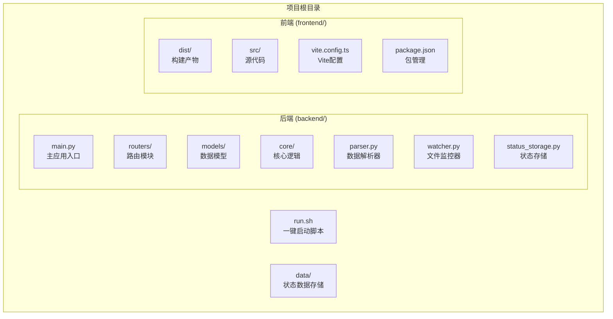
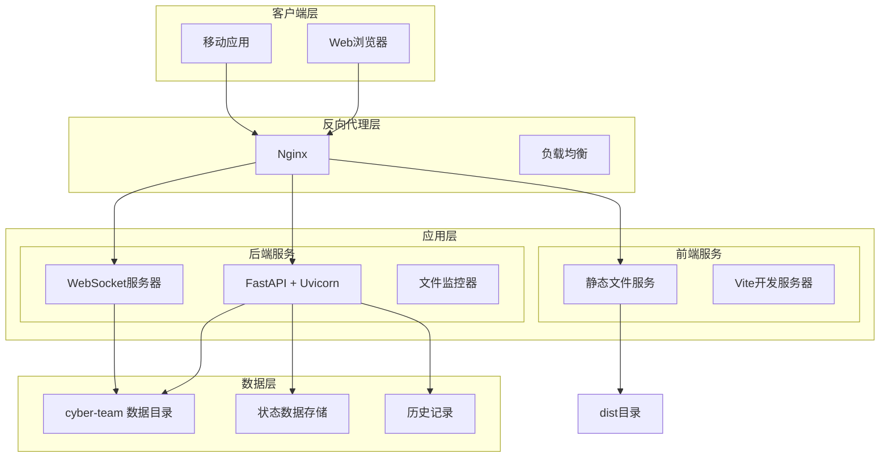
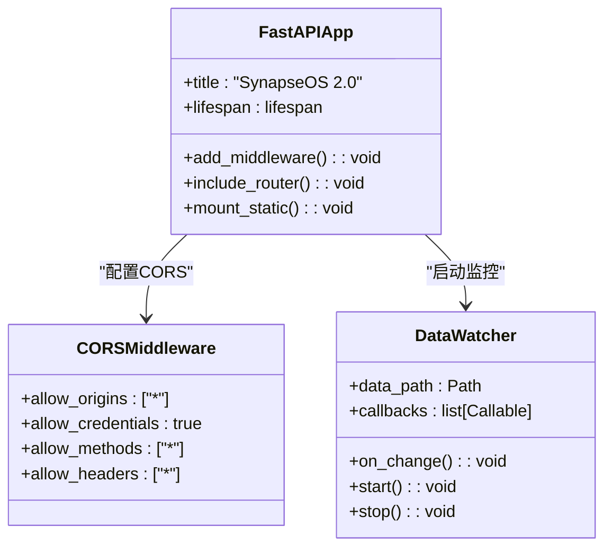
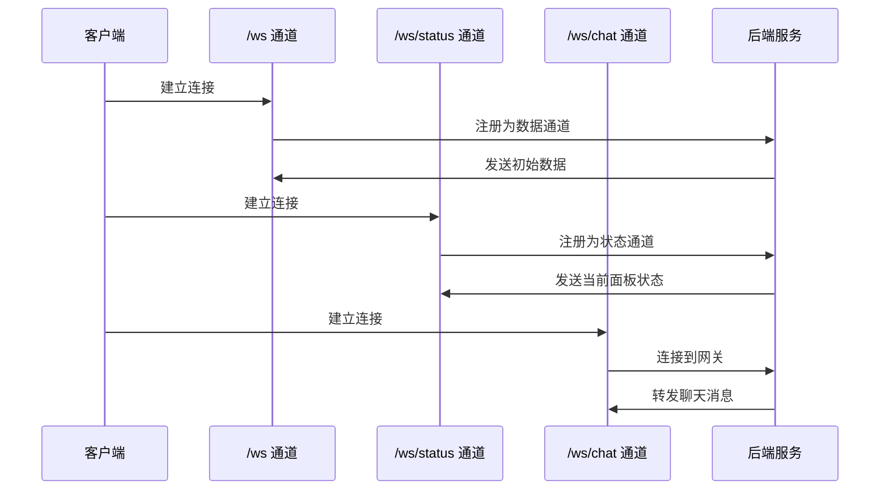
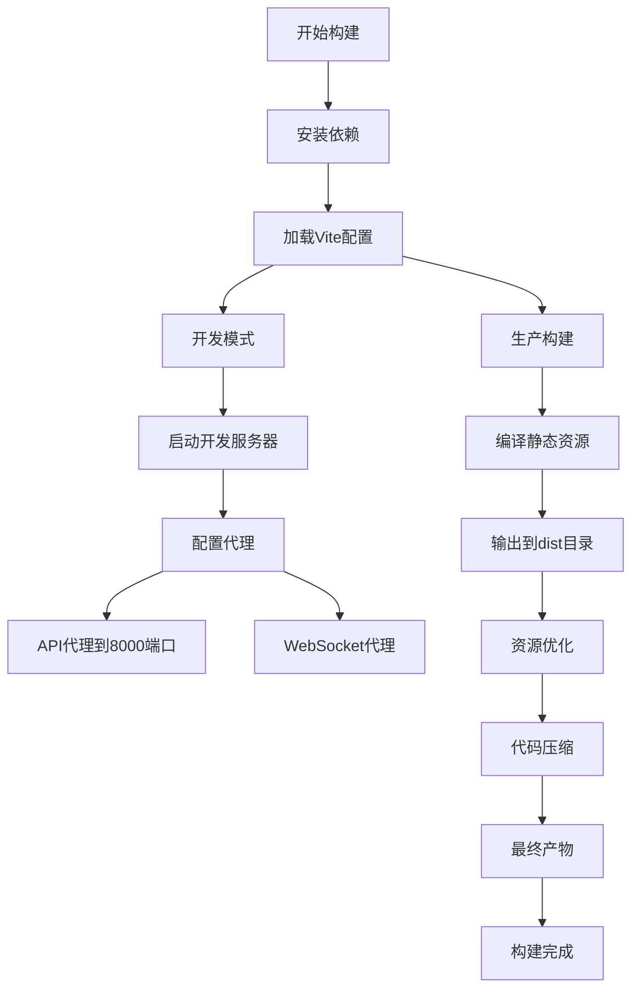
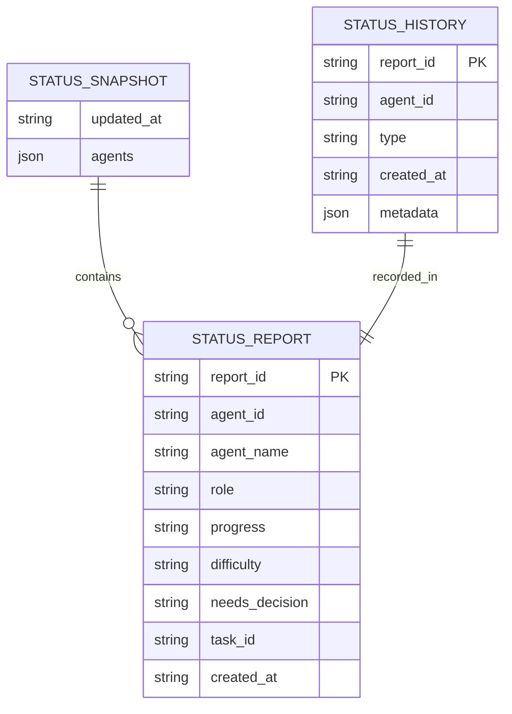
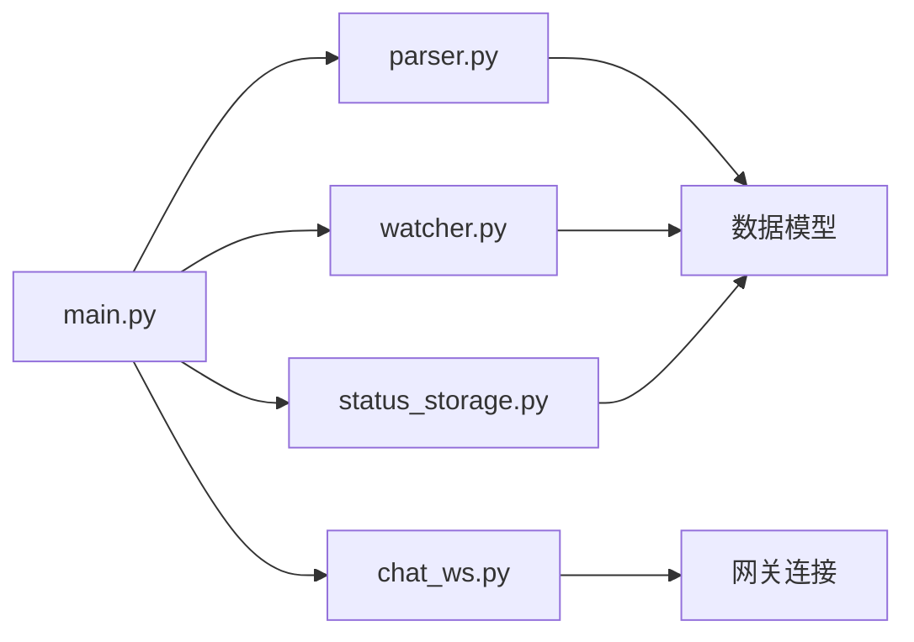

# 生产部署

<cite>
**本文档引用的文件**
- [run.sh](file://run.sh)
- [backend/main.py](file://backend/main.py)
- [backend/requirements.txt](file://backend/requirements.txt)
- [frontend/vite.config.ts](file://frontend/vite.config.ts)
- [frontend/package.json](file://frontend/package.json)
- [backend/routers/chat_ws.py](file://backend/routers/chat_ws.py)
- [backend/parser.py](file://backend/parser.py)
- [backend/watcher.py](file://backend/watcher.py)
- [backend/status_storage.py](file://backend/status_storage.py)
- [data/status_current.json](file://data/status_current.json)
- [data/status_history.jsonl](file://data/status_history.jsonl)
</cite>

## 目录
1. [简介](#简介)
2. [项目结构](#项目结构)
3. [核心组件](#核心组件)
4. [架构概览](#架构概览)
5. [详细组件分析](#详细组件分析)
6. [依赖关系分析](#依赖关系分析)
7. [性能考虑](#性能考虑)
8. [故障排除指南](#故障排除指南)
9. [结论](#结论)

## 简介

SynapseOS 2.0 是一个基于 FastAPI 和 Svelte 的实时协作平台，集成了 WebSocket 通信、文件监控和状态管理功能。该平台支持多用户实时协作，提供任务管理、状态监控和聊天功能。

## 项目结构

SynapseOS 2.0 采用前后端分离的架构设计，主要包含以下组件：



**图表来源**
- [run.sh:1-192](file://run.sh#L1-L192)
- [backend/main.py:1-495](file://backend/main.py#L1-L495)
- [frontend/vite.config.ts:1-23](file://frontend/vite.config.ts#L1-L23)

**章节来源**
- [run.sh:1-192](file://run.sh#L1-L192)
- [backend/main.py:1-495](file://backend/main.py#L1-L495)
- [frontend/vite.config.ts:1-23](file://frontend/vite.config.ts#L1-L23)

## 核心组件

### 后端服务组件

SynapseOS 2.0 的后端基于 FastAPI 框架，提供了完整的 REST API 和 WebSocket 服务：

- **FastAPI 应用**: 主要的 Web 服务器，处理 HTTP 请求
- **WebSocket 服务**: 支持实时数据推送和聊天功能
- **文件监控器**: 实时监控数据文件变化并触发更新
- **状态管理系统**: 管理员工状态报告和历史记录

### 前端组件

前端基于 Svelte 和 Vite 构建，提供现代化的用户界面：

- **Svelte 组件**: 响应式用户界面组件
- **Vite 开发服务器**: 提供热重载开发体验
- **静态资源**: 生产环境下的构建产物

**章节来源**
- [backend/main.py:185-186](file://backend/main.py#L185-L186)
- [frontend/package.json:1-24](file://frontend/package.json#L1-L24)

## 架构概览



**图表来源**
- [backend/main.py:480-488](file://backend/main.py#L480-L488)
- [frontend/vite.config.ts:11-22](file://frontend/vite.config.ts#L11-L22)

## 详细组件分析

### 一键启动脚本 (run.sh)

run.sh 是 SynapseOS 2.0 的核心部署工具，提供了完整的生命周期管理：

#### 主要功能特性

- **依赖检查**: 自动检测并安装必要的系统依赖
- **进程管理**: 后台运行后端和前端服务
- **日志管理**: 集中管理和查看应用日志
- **状态监控**: 提供服务运行状态查询

#### 参数选项详解

| 参数 | 描述 | 使用示例 |
|------|------|----------|
| `start` | 启动所有服务 | `./run.sh start` |
| `stop` | 停止所有服务 | `./run.sh stop` |
| `restart` | 重启所有服务 | `./run.sh restart` |
| `logs` | 查看最新日志 | `./run.sh logs` |
| `status` | 查询服务状态 | `./run.sh status` |

#### 后端服务配置

- **主机地址**: 0.0.0.0 (允许外部访问)
- **端口号**: 8000
- **日志级别**: warning (生产环境推荐)
- **Python 路径**: 包含 backend 目录

#### 前端服务配置

- **开发服务器端口**: 5173
- **代理配置**: 将 /api 代理到后端 8000 端口
- **WebSocket 代理**: 支持 /ws 协议升级

**章节来源**
- [run.sh:73-95](file://run.sh#L73-L95)
- [run.sh:98-117](file://run.sh#L98-L117)
- [run.sh:120-192](file://run.sh#L120-L192)

### FastAPI + Uvicorn 生产环境配置

#### 应用配置



**图表来源**
- [backend/main.py:185-193](file://backend/main.py#L185-L193)
- [backend/main.py:120-182](file://backend/main.py#L120-L182)

#### 关键配置项

- **CORS 设置**: 允许所有来源的跨域请求
- **静态文件服务**: 自动挂载前端构建产物
- **生命周期管理**: 启动时初始化监控器和状态报告器
- **WebSocket 支持**: 提供实时通信通道

**章节来源**
- [backend/main.py:185-193](file://backend/main.py#L185-L193)
- [backend/main.py:120-182](file://backend/main.py#L120-L182)

### WebSocket 通信架构

#### 通信通道设计

SynapseOS 2.0 实现了多种 WebSocket 通道以满足不同业务需求：



**图表来源**
- [backend/main.py:397-477](file://backend/main.py#L397-L477)
- [backend/routers/chat_ws.py:174-353](file://backend/routers/chat_ws.py#L174-L353)

#### 通道功能对比

| 通道 | URL路径 | 功能 | 适用场景 |
|------|---------|------|----------|
| 数据通道 | `/ws` | 实时数据推送 | 任务列表、阻塞器等 |
| 状态通道 | `/ws/status` | 状态更新通知 | 员工状态面板 |
| 聊天通道 | `/ws/chat` | 聊天消息 | 与网关通信 |

**章节来源**
- [backend/main.py:397-477](file://backend/main.py#L397-L477)
- [backend/routers/chat_ws.py:174-353](file://backend/routers/chat_ws.py#L174-L353)

### 前端静态资源构建

#### Vite 构建配置

前端使用 Vite 进行快速开发和生产构建：



**图表来源**
- [frontend/vite.config.ts:5-22](file://frontend/vite.config.ts#L5-L22)
- [frontend/package.json:6-10](file://frontend/package.json#L6-L10)

#### 构建优化策略

- **代理配置**: 开发时自动代理 API 请求
- **热重载**: 快速开发体验
- **生产优化**: 代码分割和资源压缩

**章节来源**
- [frontend/vite.config.ts:5-22](file://frontend/vite.config.ts#L5-L22)
- [frontend/package.json:6-10](file://frontend/package.json#L6-L10)

### 数据存储架构

#### 状态数据管理



**图表来源**
- [backend/status_storage.py:62-127](file://backend/status_storage.py#L62-L127)
- [backend/status_storage.py:139-193](file://backend/status_storage.py#L139-L193)

#### 数据文件结构

- **status_current.json**: 当前状态快照，包含所有员工的实时状态
- **status_history.jsonl**: 历史记录，每行一条 JSON 记录

**章节来源**
- [backend/status_storage.py:62-127](file://backend/status_storage.py#L62-L127)
- [backend/status_storage.py:139-193](file://backend/status_storage.py#L139-L193)

## 依赖关系分析

### 外部依赖

```mermaid
graph TB
subgraph "后端依赖"
FASTAPI[fastapi==0.115.0]
UVICORN[uvicorn[standard]==0.30.6]
WATCHFILES[watchfiles==0.24.0]
FRONTMATTER[python-frontmatter==1.1.0]
WEBSOCKETS[websockets==12.0]
end
subgraph "前端依赖"
VITE[vite==5.3.1]
SVELTE[svelte==4.2.18]
ROUTING[svelte-routing==2.13.0]
PREPROCESS[svelte-preprocess]
TAILWIND[tailwindcss==3.4.4]
end
subgraph "开发工具"
AUTOPREFIXER[autoprefixer==10.4.19]
POSTCSS[postcss==8.4.38]
WS[ws==8.20.0]
end
```

**图表来源**
- [backend/requirements.txt:1-6](file://backend/requirements.txt#L1-L6)
- [frontend/package.json:11-22](file://frontend/package.json#L11-L22)

### 内部模块依赖



**图表来源**
- [backend/main.py:15-21](file://backend/main.py#L15-L21)
- [backend/routers/chat_ws.py:1-16](file://backend/routers/chat_ws.py#L1-L16)

**章节来源**
- [backend/requirements.txt:1-6](file://backend/requirements.txt#L1-L6)
- [frontend/package.json:11-22](file://frontend/package.json#L11-L22)

## 性能考虑

### 后端性能优化

- **异步处理**: 使用 asyncio 处理 WebSocket 连接
- **文件监控**: 基于 watchfiles 的高效文件变更检测
- **内存管理**: 及时清理断开的 WebSocket 连接
- **日志级别**: 生产环境使用 warning 级别减少日志开销

### 前端性能优化

- **代码分割**: Vite 自动进行代码分割
- **资源压缩**: 生产构建时自动压缩静态资源
- **缓存策略**: 浏览器缓存静态资源
- **WebSocket 优化**: 连接池和心跳机制

### 数据处理优化

- **去抖机制**: WebSocket 广播使用 300ms 去抖
- **增量更新**: 只发送必要的数据更新
- **状态缓存**: 实时状态面板的本地缓存

## 故障排除指南

### 常见问题诊断

#### 服务启动问题

1. **依赖缺失**: 检查 Python 3、pip3、Node.js、npm 是否正确安装
2. **端口占用**: 确认 8000 和 5173 端口未被其他程序占用
3. **权限问题**: 确保对数据目录有读写权限

#### WebSocket 连接问题

1. **代理配置**: 检查 Nginx 或 Vite 代理是否正确配置
2. **CORS 设置**: 确认后端 CORS 配置允许客户端域名
3. **网络延迟**: 监控 WebSocket 心跳机制

#### 数据同步问题

1. **文件监控**: 验证 cyber-team 目录权限和可访问性
2. **状态存储**: 检查 status_current.json 和 status_history.jsonl 文件完整性
3. **编码问题**: 确认文件使用 UTF-8 编码

### 日志分析

#### 后端日志位置

- **默认路径**: `logs/synapse_backend.log`
- **日志内容**: 包含启动信息、错误堆栈和调试信息
- **轮转策略**: 建议配置日志轮转以控制磁盘空间

#### 前端日志位置

- **默认路径**: `logs/synapse_frontend.log`
- **日志内容**: Vite 开发服务器输出和构建信息
- **开发模式**: 提供详细的错误信息和警告

**章节来源**
- [run.sh:16-20](file://run.sh#L16-L20)
- [run.sh:162-170](file://run.sh#L162-L170)

## 结论

SynapseOS 2.0 提供了一个完整的企业级协作平台解决方案，具有以下优势：

### 技术优势

- **现代化架构**: 基于 FastAPI 和 Svelte 的现代技术栈
- **实时通信**: 完善的 WebSocket 支持和消息传递机制
- **数据驱动**: 基于 Markdown 文件的数据解析和管理
- **易于部署**: 简单的一键启动脚本和清晰的配置

### 生产环境建议

1. **Nginx 反向代理**: 建议在生产环境中使用 Nginx 进行反向代理
2. **进程管理**: 使用 systemd 或类似的进程管理器确保服务持续运行
3. **监控告警**: 配置健康检查和性能监控
4. **备份策略**: 定期备份状态数据和历史记录

### 扩展性考虑

- **微服务架构**: 可以根据需要拆分为独立的服务模块
- **数据库集成**: 支持替换为关系型或 NoSQL 数据库
- **认证授权**: 可以集成企业级身份认证系统
- **消息队列**: 支持引入消息队列处理高并发场景

通过遵循本文档的部署指南和最佳实践，可以成功地将 SynapseOS 2.0 部署到生产环境，并获得稳定可靠的企业协作体验。