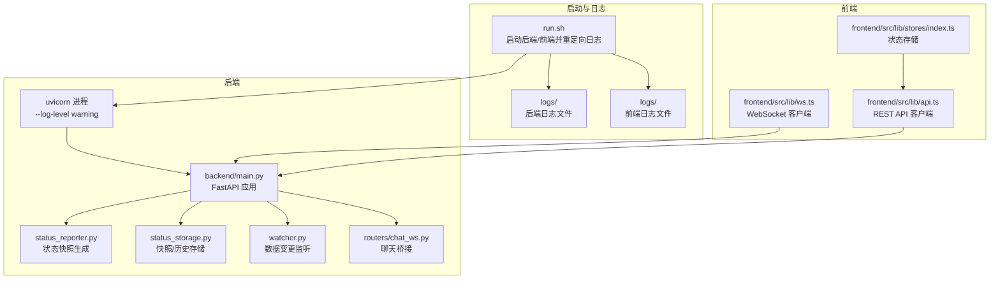
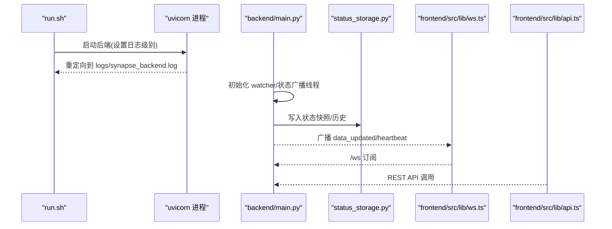
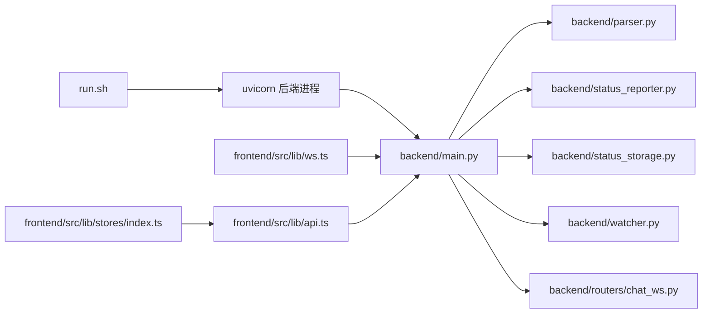
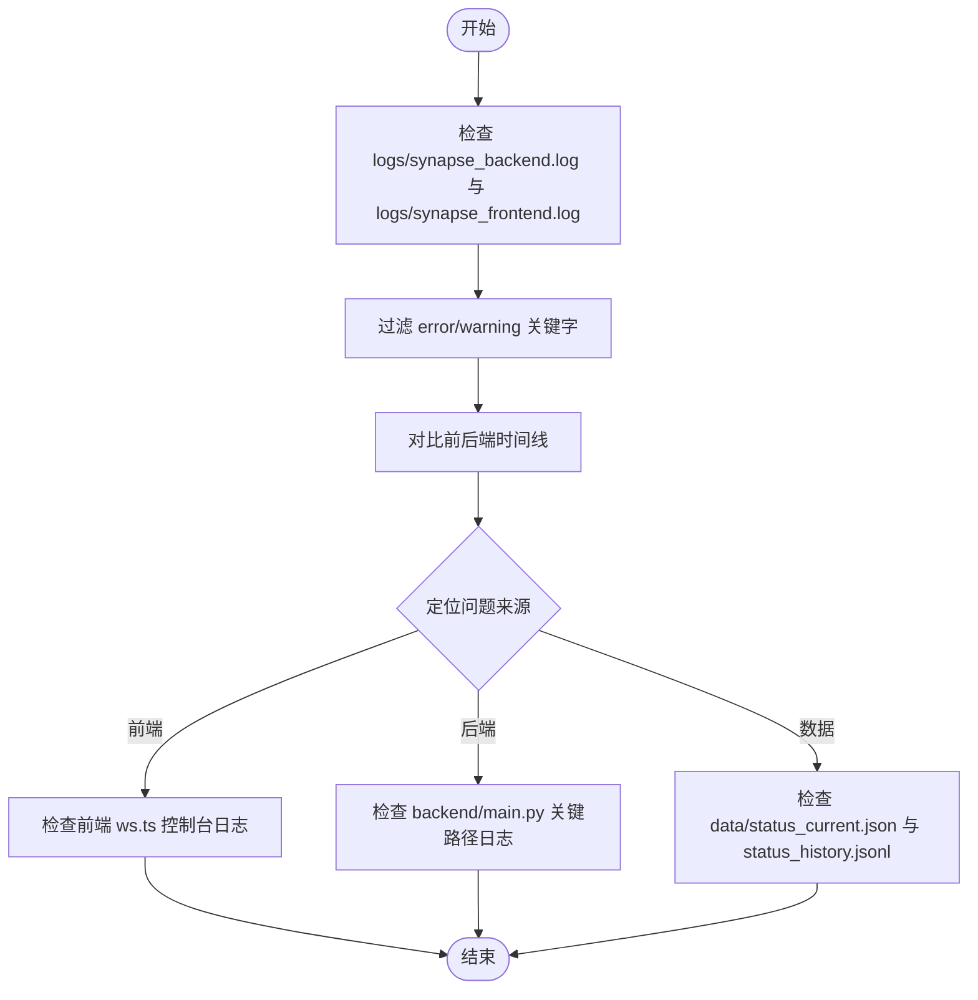

# 监控与日志

<cite>
**本文引用的文件**
- [run.sh](file://run.sh)
- [backend/main.py](file://backend/main.py)
- [backend/parser.py](file://backend/parser.py)
- [backend/status_reporter.py](file://backend/status_reporter.py)
- [backend/status_storage.py](file://backend/status_storage.py)
- [backend/watcher.py](file://backend/watcher.py)
- [backend/routers/chat_ws.py](file://backend/routers/chat_ws.py)
- [frontend/src/lib/ws.ts](file://frontend/src/lib/ws.ts)
- [frontend/src/lib/api.ts](file://frontend/src/lib/api.ts)
- [frontend/src/lib/stores/index.ts](file://frontend/src/lib/stores/index.ts)
</cite>

## 目录
1. [简介](#简介)
2. [项目结构](#项目结构)
3. [核心组件](#核心组件)
4. [架构总览](#架构总览)
5. [详细组件分析](#详细组件分析)
6. [依赖关系分析](#依赖关系分析)
7. [性能考虑](#性能考虑)
8. [故障排查指南](#故障排查指南)
9. [结论](#结论)
10. [附录](#附录)

## 简介
本文件面向 SynapseOS 2.0 的监控与日志管理，覆盖以下主题：
- 日志文件位置、格式与轮转策略
- run.sh 中的日志查看功能（logs 命令）及日志分析技巧
- 后端与前端的日志级别配置、错误追踪与性能监控指标
- 系统资源监控方案（CPU、内存、磁盘、网络）
- 告警配置、日志聚合与远程日志收集最佳实践

## 项目结构
SynapseOS 2.0 的日志体系由启动脚本统一输出到本地文件，并通过 WebSocket 实时推送状态更新；前端通过 WebSocket 订阅数据变更；后端通过 uvicorn 输出服务日志，同时在关键路径打印运行时信息用于问题定位。

图表来源
- [run.sh:18-95](file://run.sh#L18-L95)
- [backend/main.py:185-197](file://backend/main.py#L185-L197)
- [backend/status_reporter.py:258-266](file://backend/status_reporter.py#L258-L266)
- [backend/status_storage.py:62-99](file://backend/status_storage.py#L62-L99)
- [backend/watcher.py:29-40](file://backend/watcher.py#L29-L40)
- [backend/routers/chat_ws.py:186-365](file://backend/routers/chat_ws.py#L186-L365)
- [frontend/src/lib/ws.ts:26-74](file://frontend/src/lib/ws.ts#L26-L74)
- [frontend/src/lib/api.ts:75-180](file://frontend/src/lib/api.ts#L75-L180)
- [frontend/src/lib/stores/index.ts:6-46](file://frontend/src/lib/stores/index.ts#L6-L46)

章节来源
- [run.sh:18-95](file://run.sh#L18-L95)
- [backend/main.py:185-197](file://backend/main.py#L185-L197)

## 核心组件
- 启动与日志重定向：run.sh 统一安装依赖、启动后端 uvicorn 与前端 Vite，并将 stdout/stderr 重定向到 logs/synapse_backend.log 与 logs/synapse_frontend.log。
- 后端日志级别：uvicorn 使用 --log-level warning，减少噪声，便于生产环境观察。
- 关键运行时日志：后端在状态广播、WebSocket 连接、文件监听等关键路径打印运行时信息，便于快速定位问题。
- 前端日志：前端 WebSocket 客户端在连接、断开、错误时输出控制台日志，便于前端侧问题诊断。
- 数据持久化：状态快照与历史记录分别写入 data/status_current.json 与 data/status_history.jsonl，支持历史查询与分析。

章节来源
- [run.sh:18-95](file://run.sh#L18-L95)
- [backend/main.py:89](file://backend/main.py#L89)
- [backend/main.py:401-440](file://backend/main.py#L401-L440)
- [backend/watcher.py:33](file://backend/watcher.py#L33)
- [frontend/src/lib/ws.ts:33-69](file://frontend/src/lib/ws.ts#L33-L69)
- [backend/status_storage.py:62-99](file://backend/status_storage.py#L62-L99)

## 架构总览
下面的序列图展示了日志与监控的关键交互流程：启动脚本重定向日志；后端 uvicorn 输出服务日志；前端通过 WebSocket 订阅后端推送的数据更新；后端在状态变化时写入快照并广播。

图表来源
- [run.sh:85-95](file://run.sh#L85-L95)
- [backend/main.py:120-182](file://backend/main.py#L120-L182)
- [backend/status_storage.py:62-99](file://backend/status_storage.py#L62-L99)
- [frontend/src/lib/ws.ts:26-74](file://frontend/src/lib/ws.ts#L26-L74)
- [frontend/src/lib/api.ts:75-180](file://frontend/src/lib/api.ts#L75-L180)

## 详细组件分析

### 日志文件位置与格式
- 后端日志文件：logs/synapse_backend.log
- 前端日志文件：logs/synapse_frontend.log
- 日志格式：uvicorn 默认格式，包含时间戳、级别、模块与消息；后端关键路径打印的运行时信息为纯文本，便于 grep/awk 分析。
- 日志轮转策略：仓库未提供内置轮转配置。建议结合系统工具（如 logrotate 或 systemd-journald）进行轮转与压缩。

章节来源
- [run.sh:18-21](file://run.sh#L18-L21)
- [run.sh:85-95](file://run.sh#L85-L95)

### run.sh 中的日志查看功能（logs 命令）
- 功能：显示后端与前端最近 30 行日志，便于快速定位问题。
- 使用方式：./run.sh logs
- 分析技巧：
  - 结合后端关键路径打印（如 WebSocket 连接、状态广播、文件监听）进行关联分析。
  - 使用 grep 过滤关键字（如“error”、“exception”、“watcher”、“ws:status”等）快速定位异常。
  - 对比前后端日志时间线，判断是前端连接问题、后端广播问题还是上游数据源问题。

章节来源
- [run.sh:162-170](file://run.sh#L162-L170)
- [backend/main.py:401-440](file://backend/main.py#L401-L440)
- [backend/main.py:115-116](file://backend/main.py#L115-L116)
- [backend/watcher.py:33](file://backend/watcher.py#L33)

### 后端日志级别与错误追踪
- 日志级别：uvicorn 使用 --log-level warning，减少 INFO/DEBUG 信息，聚焦错误与警告。
- 错误追踪：
  - WebSocket 异常捕获与堆栈打印，便于定位连接中断、超时等问题。
  - 状态广播循环异常处理，避免异常导致广播任务退出。
  - 文件监听回调异常捕获，防止个别回调异常影响整体监听。
- 性能监控指标（可基于现有日志推导）：
  - 广播耗时：通过 WebSocket 发送前后的时间戳差值估算。
  - 监听延迟：watcher 检测到变更到通知回调的时间差。
  - 报告周期：状态快照生成与广播触发的周期性检查。

章节来源
- [backend/main.py:89](file://backend/main.py#L89)
- [backend/main.py:432-436](file://backend/main.py#L432-L436)
- [backend/main.py:159-160](file://backend/main.py#L159-L160)
- [backend/watcher.py:26-27](file://backend/watcher.py#L26-L27)

### 前端日志级别与错误追踪
- 日志级别：前端控制台输出，包含连接、断开、错误与消息解析异常。
- 错误追踪：
  - 连接失败与自动重连机制，指数退避最大至 10 秒。
  - 消息解析异常保护，避免单条消息异常导致页面崩溃。
- 性能监控指标（可基于现有日志推导）：
  - 连接建立耗时：onopen 与首次心跳到达的时间差。
  - 心跳频率：心跳事件到达的频率，反映后端广播稳定性。

章节来源
- [frontend/src/lib/ws.ts:33-69](file://frontend/src/lib/ws.ts#L33-L69)

### 数据持久化与历史查询
- 状态快照：data/status_current.json，包含各代理的最新状态与下次上报时间。
- 历史记录：data/status_history.jsonl，每行为一条 JSON 记录，支持按代理、类型、任务、时间范围过滤分页查询。
- 查询接口：/api/status/history 支持多条件过滤与分页，限制每页最多 100 条。

章节来源
- [backend/status_storage.py:62-99](file://backend/status_storage.py#L62-L99)
- [backend/status_storage.py:139-192](file://backend/status_storage.py#L139-L192)
- [backend/main.py:355-374](file://backend/main.py#L355-L374)

### 聊天桥接与远程日志
- 聊天桥接：/ws/chat 将前端消息转发至网关，流式回传 delta 事件，便于调试与分析。
- 远程日志：可通过 run.sh 的日志重定向能力，将日志输出到远端服务器或集中化日志平台（需配合外部工具）。

章节来源
- [backend/routers/chat_ws.py:186-365](file://backend/routers/chat_ws.py#L186-L365)
- [run.sh:112](file://run.sh#L112)

## 依赖关系分析

图表来源
- [run.sh:85-95](file://run.sh#L85-L95)
- [backend/main.py:15-21](file://backend/main.py#L15-L21)
- [frontend/src/lib/ws.ts:26-74](file://frontend/src/lib/ws.ts#L26-L74)
- [frontend/src/lib/api.ts:75-180](file://frontend/src/lib/api.ts#L75-L180)
- [frontend/src/lib/stores/index.ts:6-46](file://frontend/src/lib/stores/index.ts#L6-L46)

章节来源
- [backend/main.py:15-21](file://backend/main.py#L15-L21)

## 性能考虑
- 日志级别：后端 uvicorn 使用 warning，减少 IO 压力；若需更细粒度诊断，可在开发环境临时调整。
- 广播去抖：后端对数据变更采用去抖机制，降低频繁广播带来的压力。
- 心跳与超时：WebSocket 心跳与超时处理，避免长时间空闲连接占用资源。
- 历史查询限制：后端对历史查询的 limit 进行上限控制，防止大页请求造成内存压力。
- 文件监听：watchfiles 异步监听，检测到变更后异步通知，避免阻塞主线程。

章节来源
- [backend/main.py:88-93](file://backend/main.py#L88-L93)
- [backend/main.py:421-429](file://backend/main.py#L421-L429)
- [backend/status_storage.py:373](file://backend/status_storage.py#L373)

## 故障排查指南
- 启动后无日志输出
  - 检查 run.sh 是否正确重定向日志到 logs/synapse_backend.log 与 logs/synapse_frontend.log。
  - 确认 uvicorn 进程是否正常启动且未因权限或端口冲突退出。
- 前端无法连接 WebSocket
  - 使用 run.sh logs 查看后端 WebSocket 连接日志（如“connected”、“error”、“cleaned up”）。
  - 检查前端 ws.ts 控制台输出，确认是否发生 onerror/onclose 以及自动重连逻辑。
- 状态面板不更新
  - 检查 watcher 是否检测到数据变更（打印“detected changes”）。
  - 确认 status_reporter 是否成功生成快照（打印“updated X agents”）。
  - 核对 /api/status/panel 与 /api/status/history 的响应，确认历史记录写入成功。
- 聊天桥接异常
  - 检查 /ws/chat 的网关连接与会话创建流程，关注 sessions.json 读取与会话键映射。
  - 观察 delta 事件流是否正常，注意跨 agent 的 runId 映射。

章节来源
- [run.sh:162-170](file://run.sh#L162-L170)
- [backend/main.py:401-440](file://backend/main.py#L401-L440)
- [backend/watcher.py:33](file://backend/watcher.py#L33)
- [backend/status_reporter.py:114-116](file://backend/status_reporter.py#L114-L116)
- [backend/routers/chat_ws.py:60-90](file://backend/routers/chat_ws.py#L60-L90)

## 结论
SynapseOS 2.0 的日志与监控体系以 run.sh 统一输出为核心，后端 uvicorn 以较低日志级别运行，关键路径打印运行时信息，前端通过 WebSocket 实时订阅数据更新。通过 logs 命令与 grep/awk 等工具即可快速定位问题。建议结合系统级轮转工具与集中化日志平台，进一步完善长期运维与告警能力。

## 附录

### 日志查看与分析流程图

图表来源
- [run.sh:162-170](file://run.sh#L162-L170)
- [backend/main.py:401-440](file://backend/main.py#L401-L440)
- [frontend/src/lib/ws.ts:33-69](file://frontend/src/lib/ws.ts#L33-L69)