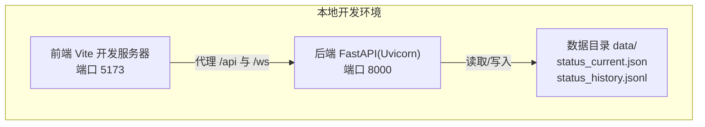
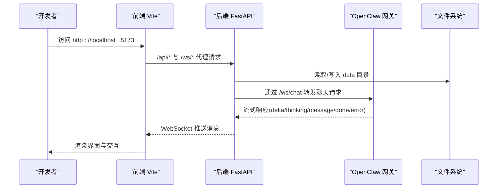
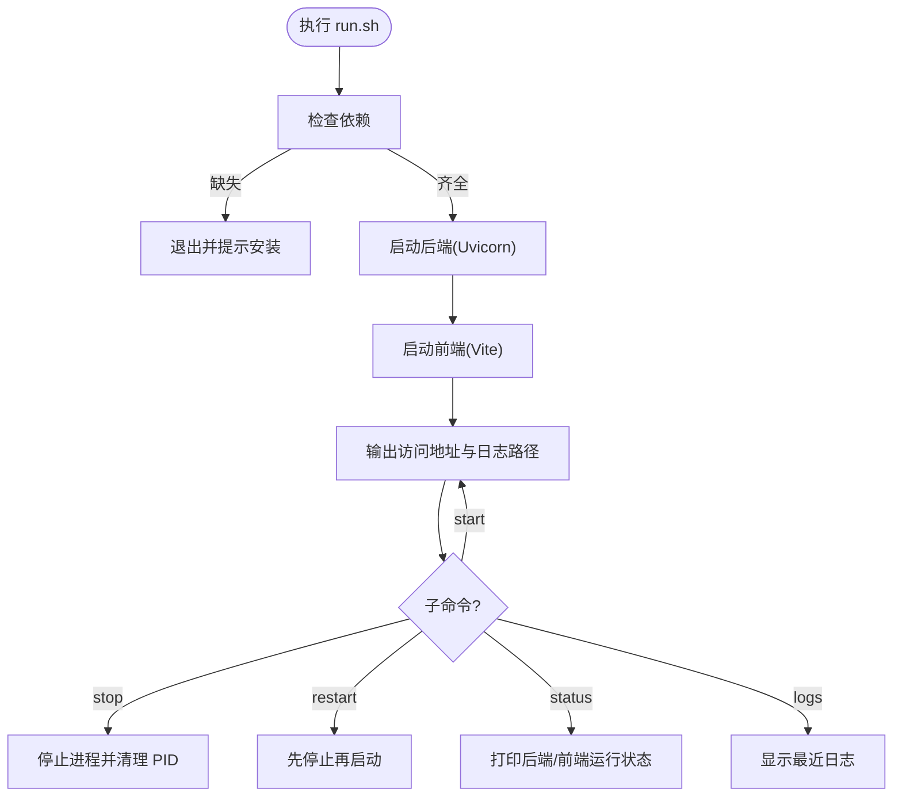
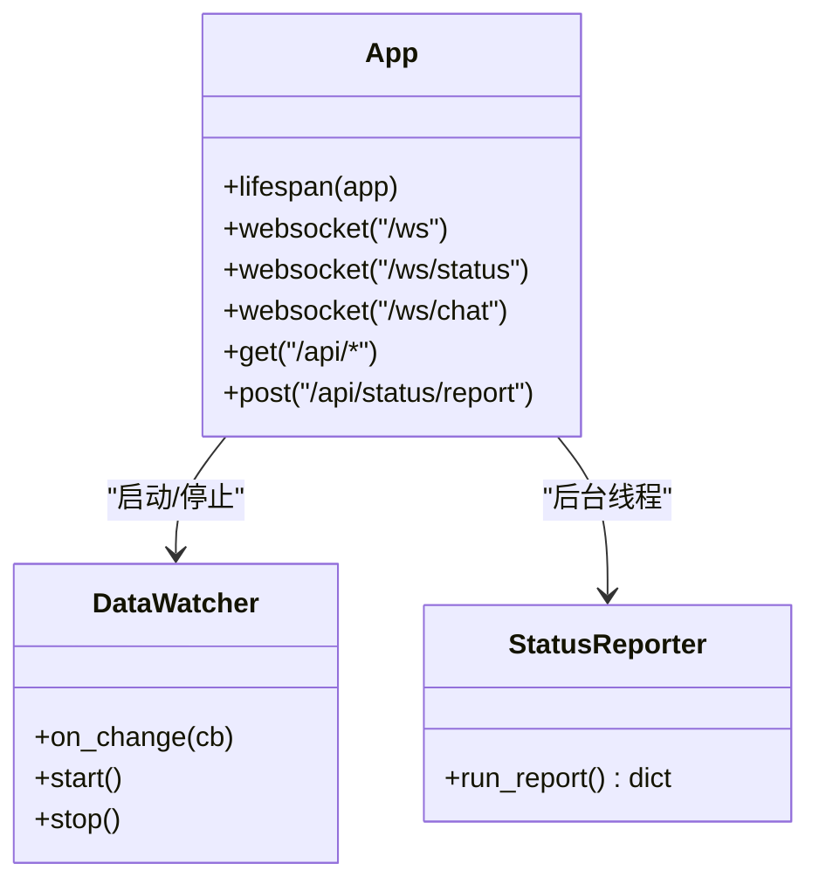
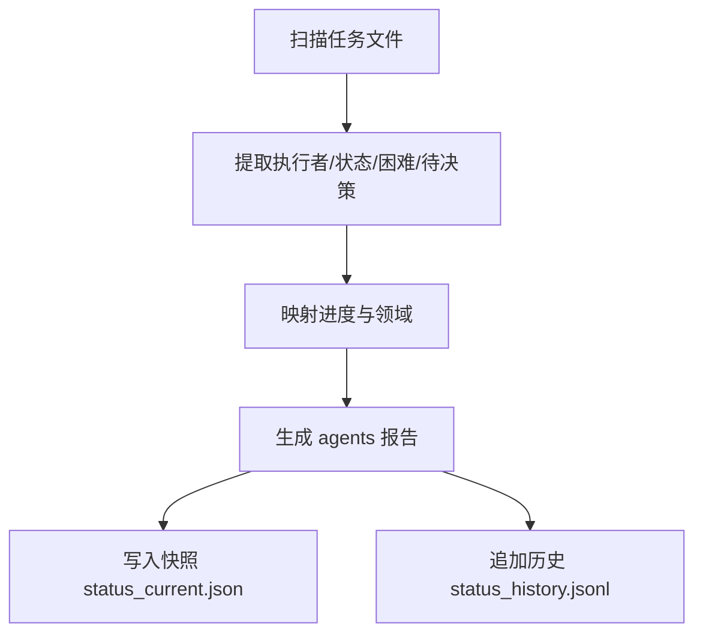
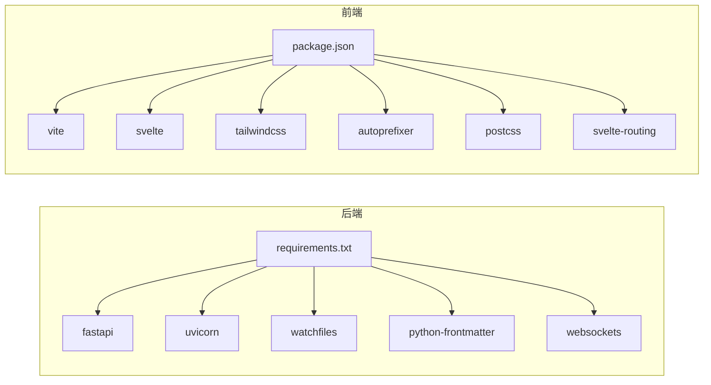

# 部署与运维

<cite>
**本文引用的文件**
- [run.sh](file://run.sh)
- [backend/main.py](file://backend/main.py)
- [backend/requirements.txt](file://backend/requirements.txt)
- [backend/parser.py](file://backend/parser.py)
- [backend/watcher.py](file://backend/watcher.py)
- [backend/status_storage.py](file://backend/status_storage.py)
- [backend/status_reporter.py](file://backend/status_reporter.py)
- [backend/routers/chat_ws.py](file://backend/routers/chat_ws.py)
- [frontend/package.json](file://frontend/package.json)
- [frontend/vite.config.ts](file://frontend/vite.config.ts)
- [data/status_current.json](file://data/status_current.json)
- [data/status_history.jsonl](file://data/status_history.jsonl)
</cite>

## 目录
1. [简介](#简介)
2. [项目结构](#项目结构)
3. [核心组件](#核心组件)
4. [架构总览](#架构总览)
5. [详细组件分析](#详细组件分析)
6. [依赖分析](#依赖分析)
7. [性能考虑](#性能考虑)
8. [故障排除指南](#故障排除指南)
9. [结论](#结论)
10. [附录](#附录)

## 简介
本文件面向 SynapseOS 2.0 的部署与运维，覆盖环境准备、依赖安装、一键启动脚本功能与进程管理、Python 与 Node.js 依赖清单、构建配置、容器化与反向代理建议、监控与日志、性能调优、故障排除、备份恢复与版本升级策略。文档严格基于仓库现有文件进行分析与总结，确保可操作性与准确性。

## 项目结构
- 后端采用 FastAPI + Uvicorn，提供 REST API 与 WebSocket 服务，并通过静态文件挂载前端产物。
- 前端使用 Vite 开发服务器，通过代理将 /api 与 /ws 请求转发至后端。
- 数据层包括状态快照与历史记录文件，以及对 cyber-team 任务 Markdown 的解析与聚合。
- 一键启动脚本负责依赖检查、后端与前端进程的启动/停止/重启/状态查询与日志查看。

图表来源
- [frontend/vite.config.ts:11-22](file://frontend/vite.config.ts#L11-L22)
- [backend/main.py:480-488](file://backend/main.py#L480-L488)
- [data/status_current.json:1-59](file://data/status_current.json#L1-L59)
- [data/status_history.jsonl:1-4](file://data/status_history.jsonl#L1-L4)

章节来源
- [run.sh:120-191](file://run.sh#L120-L191)
- [backend/main.py:480-488](file://backend/main.py#L480-L488)
- [frontend/vite.config.ts:11-22](file://frontend/vite.config.ts#L11-L22)

## 核心组件
- 一键启动脚本 run.sh：负责依赖检查、后端与前端进程管理、日志输出与状态查询。
- 后端服务 backend/main.py：FastAPI 应用，注册路由、WebSocket、CORS、静态资源挂载；集成数据变更监听与状态上报。
- 解析与存储模块：parser.py 负责解析任务 Markdown 并聚合数据；status_storage.py 负责状态快照与历史记录；status_reporter.py 负责周期性扫描任务文件生成状态快照。
- 前端构建与代理：package.json 定义开发与构建脚本；vite.config.ts 提供代理规则与开发服务器端口。
- 数据文件：status_current.json 为当前状态快照；status_history.jsonl 为历史记录流式文件。

章节来源
- [run.sh:58-117](file://run.sh#L58-L117)
- [backend/main.py:184-198](file://backend/main.py#L184-L198)
- [backend/parser.py:440-509](file://backend/parser.py#L440-L509)
- [backend/status_storage.py:102-193](file://backend/status_storage.py#L102-L193)
- [backend/status_reporter.py:258-267](file://backend/status_reporter.py#L258-L267)
- [frontend/package.json:6-10](file://frontend/package.json#L6-L10)
- [frontend/vite.config.ts:11-22](file://frontend/vite.config.ts#L11-L22)
- [data/status_current.json:1-59](file://data/status_current.json#L1-L59)
- [data/status_history.jsonl:1-4](file://data/status_history.jsonl#L1-L4)

## 架构总览
后端通过 DataWatcher 监听数据目录变化，触发 debounce 广播；同时后台线程定期扫描任务文件生成状态快照并通过专用 WebSocket 频道推送。前端通过 Vite 代理将 API 与 WebSocket 请求转发至后端，静态资源由后端挂载。

图表来源
- [frontend/vite.config.ts:13-20](file://frontend/vite.config.ts#L13-L20)
- [backend/main.py:396-477](file://backend/main.py#L396-L477)
- [backend/routers/chat_ws.py:174-349](file://backend/routers/chat_ws.py#L174-L349)

## 详细组件分析

### 一键启动脚本 run.sh
- 功能概览
  - 依赖检查：校验 python3、pip3、node、npm 是否存在。
  - 后端启动：安装 requirements.txt，使用 uvicorn 在 8000 端口启动 FastAPI 应用，日志重定向至 logs/synapse_backend.log。
  - 前端启动：若未安装 node_modules，则执行 npm install；随后以 Vite 开发模式启动，端口 5173，日志重定向至 logs/synapse_frontend.log。
  - 停止/重启/状态/日志：支持 stop、restart、status、logs 子命令。
- 进程管理
  - 使用 PID 文件记录后端与前端进程号，支持优雅停止与强制终止。
  - 支持重复启动时跳过已运行实例。
- 日志管理
  - 默认在项目根目录 logs/ 下输出后端与前端日志文件路径。

图表来源
- [run.sh:58-117](file://run.sh#L58-L117)
- [run.sh:120-191](file://run.sh#L120-L191)

章节来源
- [run.sh:58-117](file://run.sh#L58-L117)
- [run.sh:120-191](file://run.sh#L120-L191)

### 后端服务 backend/main.py
- 应用生命周期
  - 使用 lifespan 在应用启动时初始化 DataWatcher 与状态上报线程，并在关闭时清理。
  - 启动时立即执行一次状态上报，保证面板初始可用。
- WebSocket 通道
  - /ws：推送全量数据更新事件，带去抖机制，避免频繁广播。
  - /ws/status：推送状态面板更新事件，按需触发。
  - /ws/chat：桥接 OpenClaw 网关，转发聊天消息并回传流式响应。
- REST API
  - /api/mission、/api/tasks、/api/blockers、/api/decisions、/api/team、/api/registry 等接口返回聚合数据。
  - /api/status/* 提供状态快照、历史查询与难度/决策上报。
- 静态资源
  - 若存在 frontend/dist，则挂载为静态文件根目录；否则提供简单根路由响应。

图表来源
- [backend/main.py:184-198](file://backend/main.py#L184-L198)
- [backend/main.py:120-182](file://backend/main.py#L120-L182)
- [backend/watcher.py:8-52](file://backend/watcher.py#L8-L52)
- [backend/status_reporter.py:258-267](file://backend/status_reporter.py#L258-L267)

章节来源
- [backend/main.py:184-198](file://backend/main.py#L184-L198)
- [backend/main.py:396-477](file://backend/main.py#L396-L477)
- [backend/main.py:480-488](file://backend/main.py#L480-L488)

### 数据解析与状态存储
- parser.py
  - 从 CYBER_TEAM_DIR 的 missions 与 tasks 目录读取 Markdown 文件，解析为 Mission、Task、Blocker、Decision、TeamMember 等结构。
  - 通过 frontmatter 与正文解析提取字段，构建统一数据模型。
- status_storage.py
  - 生成状态快照并写入 status_current.json；历史记录以 JSONL 追加写入 status_history.jsonl。
  - 提供面板查询与分页历史查询接口。
- status_reporter.py
  - 扫描任务文件，推断执行者与状态，生成 agents 报告并写入快照。
  - 提供定时任务入口 run_report()。

图表来源
- [backend/parser.py:440-509](file://backend/parser.py#L440-L509)
- [backend/status_storage.py:62-193](file://backend/status_storage.py#L62-L193)
- [backend/status_reporter.py:189-267](file://backend/status_reporter.py#L189-L267)

章节来源
- [backend/parser.py:10-13](file://backend/parser.py#L10-L13)
- [backend/parser.py:440-509](file://backend/parser.py#L440-L509)
- [backend/status_storage.py:102-193](file://backend/status_storage.py#L102-L193)
- [backend/status_reporter.py:189-267](file://backend/status_reporter.py#L189-L267)
- [data/status_current.json:1-59](file://data/status_current.json#L1-L59)
- [data/status_history.jsonl:1-4](file://data/status_history.jsonl#L1-L4)

### 前端构建与代理
- package.json
  - scripts.dev：Vite 开发服务器，端口 5173。
  - scripts.build：Vite 构建产物至 dist。
  - devDependencies：Vite、Svelte、TailwindCSS、PostCSS 等。
  - dependencies：svelte-routing。
- vite.config.ts
  - server.proxy：将 /api 与 /ws 代理到后端 8000 端口。
  - 插件：@sveltejs/vite-plugin-svelte 与 svelte-preprocess。

章节来源
- [frontend/package.json:6-22](file://frontend/package.json#L6-L22)
- [frontend/vite.config.ts:11-22](file://frontend/vite.config.ts#L11-L22)

## 依赖分析
- Python 依赖（backend/requirements.txt）
  - fastapi、uvicorn[standard]、watchfiles、python-frontmatter、websockets
- Node.js 依赖（frontend/package.json）
  - 开发依赖：@sveltejs/vite-plugin-svelte、autoprefixer、postcss、svelte、tailwindcss、vite、ws
  - 运行依赖：svelte-routing
- 运行时端口
  - 后端：8000
  - 前端：5173
  - 代理：/api 与 /ws 转发至 8000

图表来源
- [backend/requirements.txt:1-6](file://backend/requirements.txt#L1-L6)
- [frontend/package.json:11-22](file://frontend/package.json#L11-L22)

章节来源
- [backend/requirements.txt:1-6](file://backend/requirements.txt#L1-L6)
- [frontend/package.json:11-22](file://frontend/package.json#L11-L22)

## 性能考虑
- WebSocket 去抖：后端对数据更新事件进行去抖处理，降低广播频率，减少前端渲染压力。
- 状态上报线程：每 60 秒扫描任务文件，生成状态快照并触发广播，避免高频轮询。
- 历史查询限制：后端历史接口限制每页最大条数，防止大页查询造成内存压力。
- 前端代理：Vite 本地开发代理简化跨域问题，生产环境建议通过反向代理统一入口。
- 静态资源：后端挂载 dist 目录，减少前端单独部署成本。

章节来源
- [backend/main.py:86-94](file://backend/main.py#L86-L94)
- [backend/main.py:105-117](file://backend/main.py#L105-L117)
- [backend/main.py:355-374](file://backend/main.py#L355-L374)

## 故障排除指南
- 启动失败（缺少依赖）
  - 现象：脚本报错提示缺失 python3/pip3/node/npm。
  - 处理：安装对应运行时与包管理器后重试。
- 进程未停止
  - 现象：stop 子命令无效或僵尸进程残留。
  - 处理：手动删除 PID 文件后重新启动；必要时使用系统工具查找并终止进程。
- 前端无法访问后端 API
  - 现象：浏览器控制台出现跨域或 404。
  - 处理：确认 Vite 代理配置正确；确保后端已在 8000 端口运行。
- WebSocket 断连或心跳异常
  - 现象：长时间无响应或连接中断。
  - 处理：检查后端日志与网络连通性；确认代理配置允许 WebSocket 协议。
- 状态面板不刷新
  - 现象：修改任务文件后面板未更新。
  - 处理：确认 DataWatcher 正常运行；检查任务文件格式与权限；验证 status_reporter 输出。

章节来源
- [run.sh:40-55](file://run.sh#L40-L55)
- [frontend/vite.config.ts:13-20](file://frontend/vite.config.ts#L13-L20)
- [backend/main.py:396-477](file://backend/main.py#L396-L477)

## 结论
SynapseOS 2.0 提供了简洁高效的本地开发与部署流程：一键启动脚本负责前后端进程与日志管理；后端通过 WebSocket 实时推送与 REST API 提供数据；前端通过 Vite 代理与静态资源挂载实现快速迭代。生产部署建议结合反向代理与容器化策略，配合完善的监控与日志体系，确保稳定运行与可观测性。

## 附录

### 环境配置与依赖安装
- Python 运行时与包管理器：python3、pip3
- Node.js 运行时与包管理器：node、npm
- 后端依赖：见 requirements.txt
- 前端依赖：见 package.json

章节来源
- [run.sh:58-70](file://run.sh#L58-L70)
- [backend/requirements.txt:1-6](file://backend/requirements.txt#L1-L6)
- [frontend/package.json:11-22](file://frontend/package.json#L11-L22)

### 生产部署指南（建议）
- 反向代理（Nginx）
  - 将 /api 与 /ws 代理至后端 8000 端口。
  - 将静态资源指向后端挂载的 dist 目录或独立托管。
- SSL 证书
  - 使用 ACME 自动签发或手动部署证书，启用 HTTPS。
- 进程与日志
  - 使用 systemd 或 Docker 管理进程与自动重启。
  - 将后端与前端日志输出到统一位置，便于集中收集。
- 备份与恢复
  - 定期备份 data/status_current.json 与 status_history.jsonl。
  - 恢复时先停止服务，替换文件后重启。
- 版本升级策略
  - 后端：升级 requirements.txt 后重新安装依赖并重启。
  - 前端：执行 npm install 与构建，替换 dist 内容后重启后端或刷新缓存。
- 监控与告警
  - 监控后端健康端点与 WebSocket 连接数。
  - 监控磁盘空间与日志文件大小，设置滚动与保留策略。

### Docker 容器化部署（建议）
- 构建镜像
  - 基于官方 Python 与 Node.js 镜像，分别安装后端与前端依赖。
  - 复制后端与前端源码，暴露 8000（后端）与 5173（前端）端口。
- 运行容器
  - 映射 data 目录为持久卷。
  - 通过反向代理暴露 80/443 端口。
- 编排（可选）
  - 使用 docker-compose 统一编排后端、前端与反向代理服务。

### 监控指标与日志管理
- 指标建议
  - CPU/内存占用、请求 QPS/延迟、WebSocket 连接数、状态快照更新频率。
- 日志建议
  - 后端：uvicorn 日志级别调整为 warning 或 info；接入集中式日志系统。
  - 前端：Vite 开发日志用于调试，生产环境关注后端日志。
- 性能调优
  - 合理设置去抖间隔与广播频率，避免过度更新。
  - 控制历史查询页大小，避免一次性加载过多记录。
  - 使用 CDN 加速静态资源，减少后端负载。