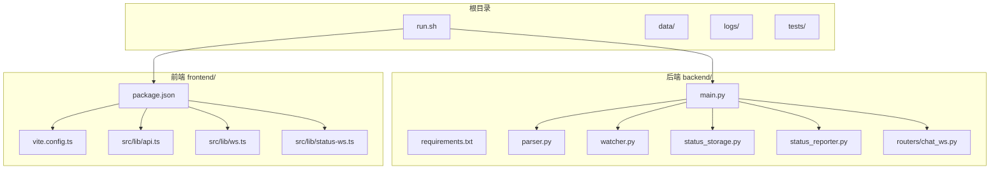
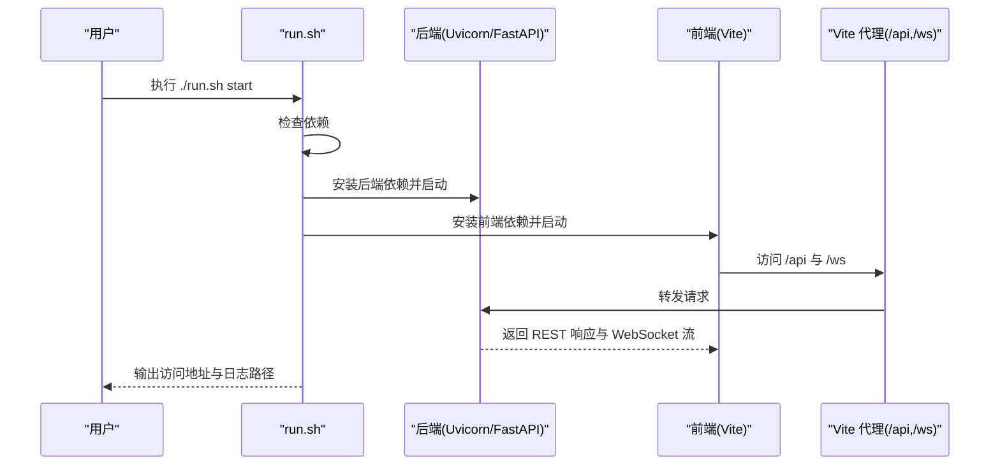

# 快速开始

<cite>
**本文引用的文件**
- [run.sh](file://run.sh)
- [backend/main.py](file://backend/main.py)
- [backend/requirements.txt](file://backend/requirements.txt)
- [frontend/package.json](file://frontend/package.json)
- [frontend/vite.config.ts](file://frontend/vite.config.ts)
- [frontend/src/lib/api.ts](file://frontend/src/lib/api.ts)
- [frontend/src/lib/ws.ts](file://frontend/src/lib/ws.ts)
- [frontend/src/lib/status-ws.ts](file://frontend/src/lib/status-ws.ts)
- [backend/parser.py](file://backend/parser.py)
- [backend/watcher.py](file://backend/watcher.py)
- [backend/status_storage.py](file://backend/status_storage.py)
- [backend/status_reporter.py](file://backend/status_reporter.py)
- [backend/routers/chat_ws.py](file://backend/routers/chat_ws.py)
</cite>

## 目录
1. [简介](#简介)
2. [项目结构](#项目结构)
3. [核心组件](#核心组件)
4. [架构总览](#架构总览)
5. [详细组件分析](#详细组件分析)
6. [依赖分析](#依赖分析)
7. [性能考虑](#性能考虑)
8. [故障排查指南](#故障排查指南)
9. [结论](#结论)
10. [附录](#附录)

## 简介
本指南面向首次接触 SynapseOS 2.0 的用户，提供从环境准备到一键启动、验证服务与基本使用的完整流程。你将学会：
- 准备 Python 3.8+、Node.js 与系统依赖
- 克隆项目、安装依赖并使用 run.sh 一键启动
- 后端（FastAPI + Uvicorn）与前端（Vite）的启动方式与关键参数
- 常见启动问题排查（端口占用、依赖缺失、权限问题）
- 如何验证服务（API 文档、WebSocket 连接、前端界面）
- 基本使用示例，快速体验核心功能

## 项目结构
项目采用前后端分离架构，根目录包含后端、前端、数据与测试目录；通过 run.sh 提供统一的一键启动入口。

图表来源
- [run.sh:1-192](file://run.sh#L1-L192)
- [backend/main.py:1-495](file://backend/main.py#L1-L495)
- [frontend/package.json:1-24](file://frontend/package.json#L1-L24)
- [frontend/vite.config.ts:1-23](file://frontend/vite.config.ts#L1-L23)

章节来源
- [run.sh:1-192](file://run.sh#L1-L192)
- [backend/main.py:1-495](file://backend/main.py#L1-L495)
- [frontend/package.json:1-24](file://frontend/package.json#L1-L24)
- [frontend/vite.config.ts:1-23](file://frontend/vite.config.ts#L1-L23)

## 核心组件
- 一键启动脚本：负责检查依赖、安装后端/前端依赖，并分别启动后端与前端服务，同时输出日志路径与访问地址。
- 后端服务：基于 FastAPI + Uvicorn，提供 REST API 与多条 WebSocket 通道（通用数据更新、状态面板、工作台聊天）。
- 前端应用：基于 Vite + Svelte，通过代理将 /api 与 /ws 请求转发至后端，提供任务面板、状态面板、聊天工作台等视图。
- 数据与状态：后端解析 Markdown 任务数据，生成状态快照与历史记录，支持实时广播与查询。

章节来源
- [run.sh:58-117](file://run.sh#L58-L117)
- [backend/main.py:184-495](file://backend/main.py#L184-L495)
- [frontend/package.json:6-10](file://frontend/package.json#L6-L10)
- [frontend/vite.config.ts:11-22](file://frontend/vite.config.ts#L11-L22)

## 架构总览
下面的时序图展示了从一键启动到服务可用的关键流程，以及前端如何通过代理访问后端 API 与 WebSocket。

图表来源
- [run.sh:120-138](file://run.sh#L120-L138)
- [backend/main.py:480-495](file://backend/main.py#L480-L495)
- [frontend/vite.config.ts:13-20](file://frontend/vite.config.ts#L13-L20)

## 详细组件分析

### 一键启动脚本 run.sh
- 功能要点
  - 依赖检查：确保存在 python3、pip3、node、npm
  - 后端启动：在 backend 目录安装 requirements.txt，使用 Uvicorn 启动 main.py，监听 0.0.0.0:8000
  - 前端启动：在 frontend 目录安装依赖（若不存在 node_modules），使用 npm run dev 启动 Vite，监听 0.0.0.0:5173
  - 日志管理：后台运行并写入 logs/synapse_backend.log 与 logs/synapse_frontend.log
  - 子命令：支持 start、stop、restart、logs、status
- 关键参数
  - 后端主机与端口：--host 0.0.0.0 --port 8000
  - 前端端口：--port 5173（由 package.json scripts.dev 指定）

章节来源
- [run.sh:58-117](file://run.sh#L58-L117)
- [run.sh:120-138](file://run.sh#L120-L138)
- [backend/requirements.txt:1-6](file://backend/requirements.txt#L1-L6)
- [frontend/package.json:7](file://frontend/package.json#L7)

### 后端服务（FastAPI + Uvicorn）
- 应用入口与生命周期
  - 使用 lifespan 在应用启动时初始化文件监控器与状态报告线程，在关闭时清理资源
  - 提供 CORS 支持，允许任意来源跨域
- 主要路由
  - REST API：/api/mission、/api/tasks、/api/blockers、/api/decisions、/api/team、/api/registry
  - 状态 API：/api/status/report、/api/status/panel、/api/status/history、/api/status/{agent_id}、/api/status/difficulty
  - WebSocket：/ws（通用数据更新）、/ws/status（状态面板）、/ws/chat（工作台聊天桥接）
- 静态资源
  - 若存在 frontend/dist，则挂载为静态文件根目录；否则提供简单根响应

章节来源
- [backend/main.py:119-182](file://backend/main.py#L119-L182)
- [backend/main.py:184-495](file://backend/main.py#L184-L495)

### 前端开发服务器（Vite）
- 启动命令与端口
  - npm run dev 启动，端口 5173（package.json scripts.dev）
- 代理配置
  - /api → http://localhost:8000
  - /ws → ws://localhost:8000（支持 WebSocket）
- 前端通信
  - API：通过 src/lib/api.ts 调用 /api/* 接口
  - WebSocket：通过 src/lib/ws.ts 连接 /ws，src/lib/status-ws.ts 连接 /ws/status

章节来源
- [frontend/package.json:6-10](file://frontend/package.json#L6-L10)
- [frontend/vite.config.ts:11-22](file://frontend/vite.config.ts#L11-L22)
- [frontend/src/lib/api.ts:75-98](file://frontend/src/lib/api.ts#L75-L98)
- [frontend/src/lib/ws.ts:19-24](file://frontend/src/lib/ws.ts#L19-L24)
- [frontend/src/lib/status-ws.ts:12-16](file://frontend/src/lib/status-ws.ts#L12-L16)

### 数据解析与状态存储
- 数据解析
  - 解析 cyber-team 目录下的 mission 与 task Markdown 文件，构建任务、阻塞、决策与团队数据
- 状态存储
  - 生成状态快照与历史记录，支持过期检测与分页查询
- 状态报告
  - 定时扫描任务文件，生成状态快照并触发 WebSocket 广播

章节来源
- [backend/parser.py:440-509](file://backend/parser.py#L440-L509)
- [backend/status_storage.py:62-127](file://backend/status_storage.py#L62-L127)
- [backend/status_reporter.py:258-267](file://backend/status_reporter.py#L258-L267)

### WebSocket 通道
- 通用数据通道 /ws
  - 连接后推送初始数据，心跳与 ping/pong 保持连接
- 状态通道 /ws/status
  - 专门用于状态面板的实时更新，支持事件类型区分
- 工作台聊天通道 /ws/chat
  - 桥接 OpenClaw 网关，转发消息并流式返回响应

章节来源
- [backend/main.py:396-477](file://backend/main.py#L396-L477)
- [backend/routers/chat_ws.py:197-376](file://backend/routers/chat_ws.py#L197-L376)

## 依赖分析
- 后端依赖
  - FastAPI、Uvicorn、watchfiles、python-frontmatter、websockets
- 前端依赖
  - Vite、Svelte、TailwindCSS、autoprefixer、postcss、ws、svelte-routing
- 代理与运行时
  - Vite 代理将前端请求转发至后端，便于本地联调

图表来源
- [frontend/vite.config.ts:13-20](file://frontend/vite.config.ts#L13-L20)
- [backend/main.py:184-495](file://backend/main.py#L184-L495)

章节来源
- [backend/requirements.txt:1-6](file://backend/requirements.txt#L1-L6)
- [frontend/package.json:11-22](file://frontend/package.json#L11-L22)
- [frontend/vite.config.ts:11-22](file://frontend/vite.config.ts#L11-L22)

## 性能考虑
- WebSocket 去抖：通用数据通道对频繁变更进行去抖处理，降低广播频率
- 状态广播：后台线程定期扫描任务文件，事件触发后异步广播，避免阻塞主线程
- 前端代理：Vite 本地开发代理减少跨域与网络往返开销
- 静态资源：后端挂载前端 dist 目录，减少不必要的 API 调用

章节来源
- [backend/main.py:61-94](file://backend/main.py#L61-L94)
- [backend/main.py:105-117](file://backend/main.py#L105-L117)
- [frontend/vite.config.ts:11-22](file://frontend/vite.config.ts#L11-L22)

## 故障排查指南
- 端口占用
  - 后端默认端口 8000，前端默认端口 5173。若被占用，请先释放端口或修改 run.sh 中的端口参数
  - 建议使用系统工具查看占用进程并终止
- 依赖缺失
  - run.sh 会检查 python3、pip3、node、npm 是否存在；若缺失请先安装对应工具链
- 权限问题
  - 确保当前用户对项目目录有读写权限；若需写入 data 目录，请检查目录权限
- WebSocket 连接失败
  - 确认后端已启动且未报错；检查前端代理是否正确转发 /ws 至后端
  - 查看 run.sh 输出的日志路径，定位具体错误
- 前端界面无法加载
  - 确认 Vite 已成功启动并监听 5173 端口；检查浏览器控制台是否有跨域或资源加载错误
- API 文档不可用
  - 后端启动后可通过 http://localhost:8000/docs 访问 FastAPI 自带文档；若不可用，检查后端日志

章节来源
- [run.sh:58-70](file://run.sh#L58-L70)
- [run.sh:129-133](file://run.sh#L129-L133)
- [frontend/vite.config.ts:13-20](file://frontend/vite.config.ts#L13-L20)

## 结论
通过 run.sh 一键启动脚本，你可以快速完成环境准备、依赖安装与服务启动。后端提供丰富的 REST API 与多条 WebSocket 通道，前端通过 Vite 代理实现无缝联调。遇到问题时，可依据本指南的排查步骤逐项定位。建议在启动后先访问 API 文档与前端界面，再进行 WebSocket 连接测试，最后体验核心功能模块。

## 附录
- 启动命令
  - 一键启动：./run.sh start
  - 停止：./run.sh stop
  - 重启：./run.sh restart
  - 查看日志：./run.sh logs
  - 查看状态：./run.sh status
- 访问地址
  - 前端：http://localhost:5173
  - 后端：http://localhost:8000
  - API 文档：http://localhost:8000/docs
- 关键端口
  - 后端：8000
  - 前端：5173
- 重要文件
  - 后端入口：backend/main.py
  - 前端入口：frontend/package.json（scripts.dev）
  - 代理配置：frontend/vite.config.ts