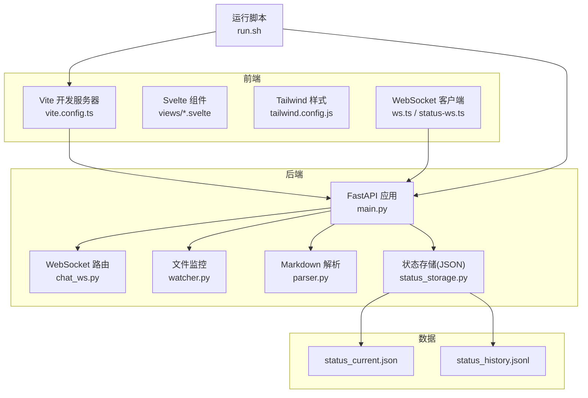
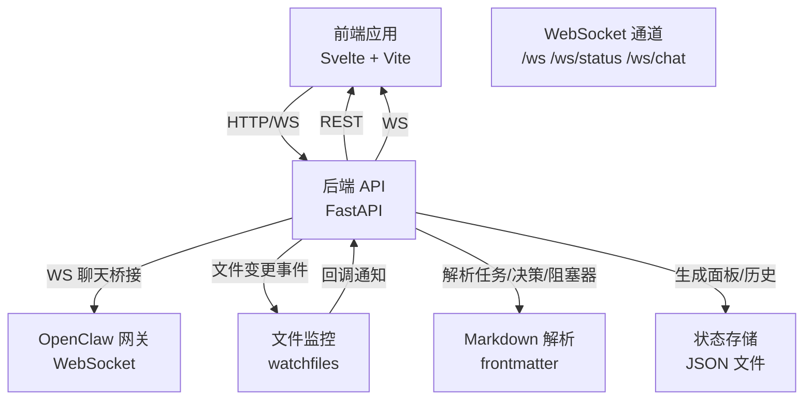
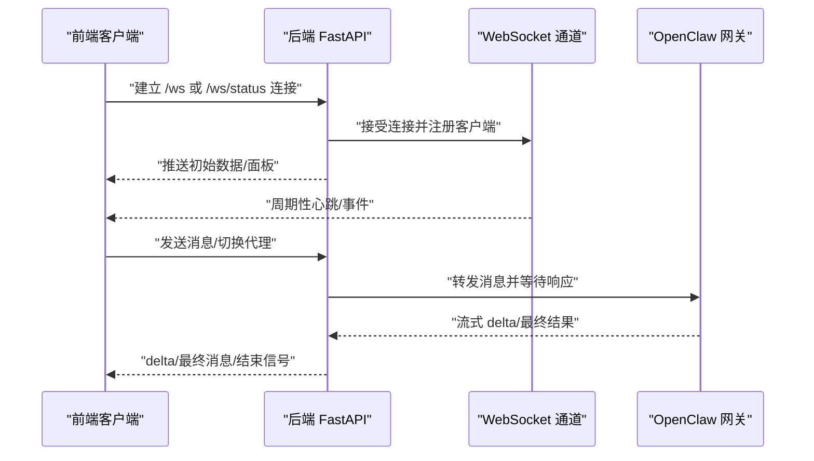
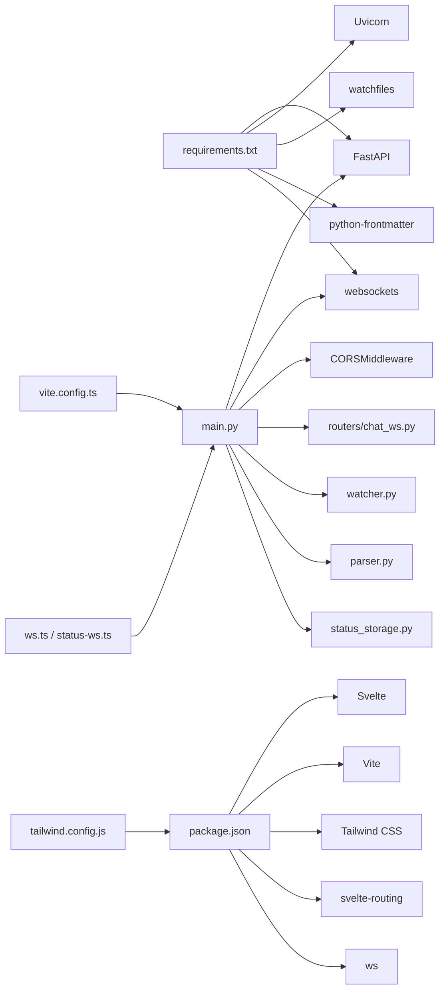

# 技术栈介绍

<cite>
**本文档引用的文件**
- [backend/requirements.txt](file://backend/requirements.txt)
- [backend/main.py](file://backend/main.py)
- [backend/watcher.py](file://backend/watcher.py)
- [backend/parser.py](file://backend/parser.py)
- [backend/status_storage.py](file://backend/status_storage.py)
- [backend/routers/chat_ws.py](file://backend/routers/chat_ws.py)
- [frontend/package.json](file://frontend/package.json)
- [frontend/vite.config.ts](file://frontend/vite.config.ts)
- [frontend/tailwind.config.js](file://frontend/tailwind.config.js)
- [frontend/src/lib/ws.ts](file://frontend/src/lib/ws.ts)
- [frontend/src/lib/status-ws.ts](file://frontend/src/lib/status-ws.ts)
- [run.sh](file://run.sh)
- [data/status_current.json](file://data/status_current.json)
</cite>

## 目录
1. [引言](#引言)
2. [项目结构](#项目结构)
3. [核心组件](#核心组件)
4. [架构总览](#架构总览)
5. [详细组件分析](#详细组件分析)
6. [依赖关系分析](#依赖关系分析)
7. [性能考量](#性能考量)
8. [故障排查指南](#故障排查指南)
9. [结论](#结论)
10. [附录](#附录)

## 引言
本文件系统化梳理 SynapseOS 2.0 的技术栈与架构，覆盖后端 Python 生态（FastAPI、Uvicorn、WebSocket）、前端 Svelte/Vite/Tailwind、数据库与存储（JSON 文件）、开发工具链（watchfiles、python-frontmatter），以及实时通信、CORS 跨域与生产部署方案。文档同时给出版本兼容性与选择理由，帮助读者快速理解并高效使用该系统。

## 项目结构
项目采用前后端分离的目录组织方式：
- 后端：Python 应用，包含路由、WebSocket、文件监控、状态存储与解析器等模块
- 前端：Svelte 应用，通过 Vite 开发服务器提供本地开发体验，并使用 Tailwind CSS 进行样式管理
- 数据：以 JSON 文件形式持久化状态快照与历史记录
- 运维：Shell 脚本统一安装依赖、启动后端与前端服务，并输出日志与状态

图表来源
- [backend/main.py:184-495](file://backend/main.py#L184-L495)
- [backend/routers/chat_ws.py:186-365](file://backend/routers/chat_ws.py#L186-L365)
- [backend/watcher.py:8-52](file://backend/watcher.py#L8-L52)
- [backend/parser.py:440-509](file://backend/parser.py#L440-L509)
- [backend/status_storage.py:10-236](file://backend/status_storage.py#L10-L236)
- [frontend/vite.config.ts:1-23](file://frontend/vite.config.ts#L1-L23)
- [frontend/tailwind.config.js:1-40](file://frontend/tailwind.config.js#L1-L40)
- [frontend/src/lib/ws.ts:1-84](file://frontend/src/lib/ws.ts#L1-L84)
- [frontend/src/lib/status-ws.ts:1-78](file://frontend/src/lib/status-ws.ts#L1-L78)
- [run.sh:72-117](file://run.sh#L72-L117)

章节来源
- [backend/main.py:184-495](file://backend/main.py#L184-L495)
- [frontend/vite.config.ts:1-23](file://frontend/vite.config.ts#L1-L23)
- [run.sh:72-117](file://run.sh#L72-L117)

## 核心组件
- 后端核心：FastAPI 提供高性能异步 Web 框架；Uvicorn 作为 ASGI 服务器承载应用；WebSocket 支持双向实时通信；CORS 中间件允许跨域访问；文件监控与 Markdown 解析负责数据变更与内容抽取；状态存储以 JSON 文件持久化。
- 前端核心：Vite 提供开发服务器与构建工具；Svelte 作为组件框架；Tailwind CSS 提供原子化样式；WebSocket 客户端分别连接通用数据通道与状态通道。
- 开发工具链：watchfiles 实现文件变更监听；python-frontmatter 用于解析带元数据的 Markdown 内容。

章节来源
- [backend/requirements.txt:1-6](file://backend/requirements.txt#L1-L6)
- [backend/main.py:184-495](file://backend/main.py#L184-L495)
- [frontend/package.json:11-22](file://frontend/package.json#L11-L22)

## 架构总览
后端通过 FastAPI 暴露 REST API 与 WebSocket 接口，前端通过 Vite 提供静态资源与代理，WebSocket 客户端在浏览器中建立长连接，实现数据与状态的实时推送。文件监控与解析器确保数据源变更能触发广播，状态存储提供快照与历史查询能力。

图表来源
- [backend/main.py:396-477](file://backend/main.py#L396-L477)
- [backend/routers/chat_ws.py:186-365](file://backend/routers/chat_ws.py#L186-L365)
- [backend/watcher.py:29-35](file://backend/watcher.py#L29-L35)
- [backend/parser.py:440-509](file://backend/parser.py#L440-L509)
- [backend/status_storage.py:62-193](file://backend/status_storage.py#L62-L193)

## 详细组件分析

### 后端技术栈与版本兼容性
- Python 3.8+：项目使用 asyncio、typing、pathlib 等特性，建议在 Python 3.8 及以上版本运行。
- FastAPI 0.115.0：提供异步路由、自动 OpenAPI 文档与中间件支持，满足高并发与低延迟需求。
- Uvicorn 0.30.6：标准版包含异步服务器与热重载能力，配合 run.sh 启动。
- WebSocket 12.0：用于聊天桥接与状态推送，提供稳定的双向通信。
- watchfiles 0.24.0：异步文件监控，支持多平台，适合本地开发与增量更新。
- python-frontmatter 1.1.0：解析带 YAML 元数据的 Markdown，便于从任务/决策文件中提取结构化信息。

版本兼容性与选择理由
- FastAPI/Uvicorn：二者在 0.x 版本中保持稳定接口，0.115.0 与 0.30.6 组合可获得较好的性能与稳定性。
- WebSocket：12.0 版本对异步与错误处理有改进，适配聊天桥接场景。
- watchfiles：异步 API 更贴合 FastAPI 的异步生命周期，减少阻塞。
- python-frontmatter：简洁可靠，与项目 Markdown 结构契合度高。

章节来源
- [backend/requirements.txt:1-6](file://backend/requirements.txt#L1-L6)
- [backend/main.py:9-11](file://backend/main.py#L9-L11)
- [backend/watcher.py:4](file://backend/watcher.py#L4)
- [backend/parser.py:4](file://backend/parser.py#L4)

### 前端技术栈与版本兼容性
- Svelte 4.2.18：组件化开发，编译期优化，适合构建交互式工作台界面。
- Vite 5.3.1：快速开发服务器与构建工具，支持热更新与代理转发。
- Tailwind CSS 3.4.4：原子化样式，便于快速构建赛博风格主题。
- Svelte Routing：单页应用路由，简化页面切换。
- ws 8.20.0：开发环境 WebSocket 依赖，便于本地联调。

选择理由
- Svelte + Vite：开发体验佳，打包体积小，适合中大型前端应用。
- Tailwind：无需编写复杂样式规则，快速实现一致的视觉语言。
- 路由与代理：Vite 配置将 /api 与 /ws 代理到后端，简化跨域与调试。

章节来源
- [frontend/package.json:11-22](file://frontend/package.json#L11-L22)
- [frontend/vite.config.ts:1-23](file://frontend/vite.config.ts#L1-L23)
- [frontend/tailwind.config.js:1-40](file://frontend/tailwind.config.js#L1-L40)

### 数据库与存储方案
- JSON 文件存储：状态快照保存于 status_current.json，历史记录保存于 status_history.jsonl（JSON Lines）。该方案具备以下特点：
  - 简洁易用：无需额外数据库服务，便于部署与迁移。
  - 易读性强：人类可直接查看与编辑，利于排障与审计。
  - 可扩展：历史文件按行追加，查询时可按条件过滤与分页。
- 存储模型与策略
  - 快照：记录每个代理的最新状态与下次上报时间，包含在线状态检测。
  - 历史：按时间顺序记录每次上报，支持按代理、类型、任务等维度筛选。
  - 种子数据：首次启动时生成演示数据，保证初始可用性。

章节来源
- [backend/status_storage.py:10-236](file://backend/status_storage.py#L10-L236)
- [data/status_current.json:1-59](file://data/status_current.json#L1-L59)

### 开发工具链
- watchfiles 0.24.0：在后台异步监控数据目录，检测到变更后触发回调，避免轮询带来的开销。
- python-frontmatter 1.1.0：解析 Markdown 的元数据与正文，结合正则表达式提取字段，支撑任务/决策/阻塞器等实体的构建。

章节来源
- [backend/watcher.py:1-52](file://backend/watcher.py#L1-L52)
- [backend/parser.py:123-342](file://backend/parser.py#L123-L342)

### WebSocket 实时通信架构
- 通用数据通道：/ws 向客户端推送全量数据更新，包含任务、决策、阻塞器与团队信息。客户端在连接后接收一次全量快照，随后按心跳机制维持连接。
- 状态通道：/ws/status 专门推送状态面板与事件（如难度上报、决策请求），客户端订阅状态面板变化。
- 聊天桥接：/ws/chat 将前端消息转发至 OpenClaw 网关，流式返回助手回复，同时维护会话键映射，防止跨会话事件交叉。
- 心跳与断线重连：客户端定期发送 ping 并接收 pong/heartbeat，断线后指数退避重连，保障稳定性。

图表来源
- [backend/main.py:396-477](file://backend/main.py#L396-L477)
- [backend/routers/chat_ws.py:186-365](file://backend/routers/chat_ws.py#L186-L365)
- [frontend/src/lib/ws.ts:26-74](file://frontend/src/lib/ws.ts#L26-L74)
- [frontend/src/lib/status-ws.ts:18-64](file://frontend/src/lib/status-ws.ts#L18-L64)

### CORS 跨域配置
- 后端在启动时添加 CORS 中间件，允许任意来源、方法与头，便于本地开发与多端访问。
- 前端通过 Vite 代理将 /api 与 /ws 请求转发至后端，避免浏览器同源策略限制。

章节来源
- [backend/main.py:187-193](file://backend/main.py#L187-L193)
- [frontend/vite.config.ts:13-20](file://frontend/vite.config.ts#L13-L20)

### 生产部署方案
- 一键启动脚本：run.sh 自动检查依赖、安装后端/前端依赖、启动后端（FastAPI + Uvicorn）与前端（Vite dev server），并输出日志路径与访问地址。
- 静态资源托管：后端在存在 dist 目录时挂载静态文件，实现 SPA 与 API 的一体化服务。
- 建议的生产实践
  - 使用反向代理（如 Nginx）统一入口，开启 HTTPS 与压缩。
  - 将前端构建产物（vite build）交由反向代理或 CDN 提供静态资源。
  - 后端使用进程管理器（如 systemd 或 PM2）守护进程，设置健康检查与日志切割。
  - 对 WebSocket 设置合理的超时与心跳策略，避免资源泄漏。

章节来源
- [run.sh:72-117](file://run.sh#L72-L117)
- [backend/main.py:480-488](file://backend/main.py#L480-L488)

## 依赖关系分析

图表来源
- [backend/requirements.txt:1-6](file://backend/requirements.txt#L1-L6)
- [backend/main.py:184-495](file://backend/main.py#L184-L495)
- [backend/routers/chat_ws.py:186-365](file://backend/routers/chat_ws.py#L186-L365)
- [backend/watcher.py:8-52](file://backend/watcher.py#L8-L52)
- [backend/parser.py:440-509](file://backend/parser.py#L440-L509)
- [backend/status_storage.py:10-236](file://backend/status_storage.py#L10-L236)
- [frontend/package.json:11-22](file://frontend/package.json#L11-L22)
- [frontend/vite.config.ts:1-23](file://frontend/vite.config.ts#L1-L23)
- [frontend/tailwind.config.js:1-40](file://frontend/tailwind.config.js#L1-L40)
- [frontend/src/lib/ws.ts:1-84](file://frontend/src/lib/ws.ts#L1-L84)
- [frontend/src/lib/status-ws.ts:1-78](file://frontend/src/lib/status-ws.ts#L1-L78)

## 性能考量
- 异步优先：后端使用 asyncio 与 FastAPI 异步特性，避免阻塞 IO；WebSocket 与文件监控均采用异步实现，降低上下文切换成本。
- 心跳与去抖：/ws 通道设置心跳与去抖机制，减少频繁广播带来的网络压力。
- 存储策略：JSON Lines 记录历史，按需过滤与分页，避免一次性加载全部历史导致内存压力。
- 前端优化：Svelte 编译期优化与 Vite 热更新，提升开发效率与构建速度。

## 故障排查指南
- 后端启动失败
  - 检查依赖安装：run.sh 会自动安装后端依赖，若失败请查看日志文件。
  - 端口占用：默认后端监听 8000，前端 5173，请确认端口未被占用。
- WebSocket 断线
  - 查看前端控制台日志，确认是否收到心跳/pong；客户端会自动重连，观察重连延迟是否指数增长。
  - 若为 /ws/chat 通道，检查 OpenClaw 网关是否可达与鉴权是否正确。
- CORS 问题
  - 确认后端已启用 CORS 中间件；前端代理配置是否正确指向后端地址。
- 状态不更新
  - 检查文件监控是否正常，确认数据目录变更是否触发回调；查看状态存储文件是否存在且可写。

章节来源
- [run.sh:162-170](file://run.sh#L162-L170)
- [frontend/src/lib/ws.ts:57-70](file://frontend/src/lib/ws.ts#L57-L70)
- [frontend/src/lib/status-ws.ts:51-58](file://frontend/src/lib/status-ws.ts#L51-L58)
- [backend/main.py:187-193](file://backend/main.py#L187-L193)

## 结论
SynapseOS 2.0 的技术栈围绕“异步 + 实时 + 简洁存储”展开：后端以 FastAPI/Uvicorn 为核心，结合 WebSocket 与文件监控实现数据驱动的实时推送；前端以 Svelte/Vite/Tailwind 构建现代化工作台；状态存储采用 JSON 文件，兼顾易用性与可扩展性。整体方案适合中小型团队在本地或内网环境中快速落地与迭代。

## 附录
- 版本对照表
  - 后端：FastAPI 0.115.0、Uvicorn 0.30.6、WebSocket 12.0、watchfiles 0.24.0、python-frontmatter 1.1.0
  - 前端：Svelte 4.2.18、Vite 5.3.1、Tailwind CSS 3.4.4、svelte-routing 2.13.0、ws 8.20.0
- 关键文件路径
  - 后端入口：backend/main.py
  - WebSocket 路由：backend/routers/chat_ws.py
  - 文件监控：backend/watcher.py
  - Markdown 解析：backend/parser.py
  - 状态存储：backend/status_storage.py
  - 前端配置：frontend/vite.config.ts、frontend/tailwind.config.js
  - 前端 WebSocket 客户端：frontend/src/lib/ws.ts、frontend/src/lib/status-ws.ts
  - 一键启动：run.sh
  - 状态快照示例：data/status_current.json